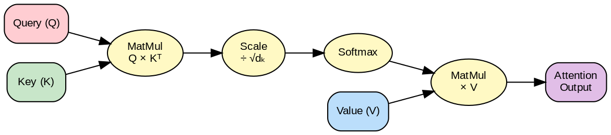

---
jupytext:
  text_representation:
    extension: .md
    format_name: myst
kernelspec:
  display_name: Python 3
  language: python
  name: python3
---

# Lectura 2: Fundamentos de Deep Learning

```{admonition} Objetivos de Aprendizaje
:class: tip
Al finalizar esta lectura podrás:
- Explicar el funcionamiento del perceptrón y las funciones de activación (ReLU, sigmoid, tanh)
- Aplicar operaciones fundamentales de álgebra lineal (multiplicación de matrices, transpuesta) a redes neuronales
- Comprender el proceso de forward pass y backward pass (retropropagación) en redes multicapa
- Identificar problemas de entrenamiento (overfitting, desvanecimiento de gradientes) y sus soluciones
- Distinguir entre diferentes funciones de pérdida y optimizadores según el tipo de problema
```

## Introducción

En la lectura anterior, mencionamos redes neuronales y retropropagación como conceptos clave. Ahora vamos a profundizar: ¿cómo funcionan realmente estas redes? ¿Qué es un tensor? ¿Por qué es tan importante el álgebra lineal?

Esta lectura es el corazón técnico de tu comprensión de aprendizaje profundo. Aunque no escribiremos código compilado, entenderemos los conceptos lo suficiente para trabajar con LLMs.

---

## Parte 1: El Perceptrón y Más Allá

### El Perceptrón Simple

```
     x1 ─────┐
             ├─→ [suma ponderada] ─→ [activación] → y
     x2 ─────┤
     x3 ─────┘
```

Matemáticamente:

```
z = w1*x1 + w2*x2 + w3*x3 + b

y = σ(z)  donde σ es una función de activación (ej: escalón)
```

**Pesos (w):** multiplicadores que aprende el modelo
**Bias (b):** término independiente que aprende el modelo
**Función de activación (σ):** introduce no-linealidad (crucial)

Sin funciones de activación, aunque stapiles múltiples capas, el resultado sería equivalente a una transformación lineal única. Las funciones de activación es lo que permite que las redes neuronales profundas sean universales (capaces de aproximar cualquier función).

### Funciones de Activación Comunes

```{code-cell} ipython3
import numpy as np
import matplotlib.pyplot as plt

# Definir funciones de activación
def sigmoid(z):
    return 1 / (1 + np.exp(-z))

def tanh(z):
    return np.tanh(z)

def relu(z):
    return np.maximum(0, z)

def leaky_relu(z, alpha=0.01):
    return np.where(z > 0, z, alpha * z)

# Crear valores de entrada
z = np.linspace(-5, 5, 200)

# Crear gráficas
fig, axes = plt.subplots(2, 2, figsize=(14, 10))

# Sigmoid
axes[0, 0].plot(z, sigmoid(z), 'b-', linewidth=2)
axes[0, 0].axhline(y=0, color='k', linestyle='--', alpha=0.3)
axes[0, 0].axhline(y=1, color='k', linestyle='--', alpha=0.3)
axes[0, 0].axvline(x=0, color='k', linestyle='--', alpha=0.3)
axes[0, 0].set_title('Sigmoid: σ(z) = 1/(1+e^(-z))', fontsize=12)
axes[0, 0].set_xlabel('z')
axes[0, 0].set_ylabel('σ(z)')
axes[0, 0].grid(True, alpha=0.3)
axes[0, 0].text(0, 0.5, 'Rango: (0, 1)', ha='center', fontsize=10,
                bbox=dict(boxstyle='round', facecolor='wheat', alpha=0.5))

# Tanh
axes[0, 1].plot(z, tanh(z), 'g-', linewidth=2)
axes[0, 1].axhline(y=-1, color='k', linestyle='--', alpha=0.3)
axes[0, 1].axhline(y=1, color='k', linestyle='--', alpha=0.3)
axes[0, 1].axvline(x=0, color='k', linestyle='--', alpha=0.3)
axes[0, 1].set_title('Tanh: tanh(z) = (e^z - e^(-z))/(e^z + e^(-z))', fontsize=12)
axes[0, 1].set_xlabel('z')
axes[0, 1].set_ylabel('tanh(z)')
axes[0, 1].grid(True, alpha=0.3)
axes[0, 1].text(0, 0, 'Rango: (-1, 1)', ha='center', fontsize=10,
                bbox=dict(boxstyle='round', facecolor='lightgreen', alpha=0.5))

# ReLU
axes[1, 0].plot(z, relu(z), 'r-', linewidth=2)
axes[1, 0].axhline(y=0, color='k', linestyle='--', alpha=0.3)
axes[1, 0].axvline(x=0, color='k', linestyle='--', alpha=0.3)
axes[1, 0].set_title('ReLU: relu(z) = max(0, z)', fontsize=12)
axes[1, 0].set_xlabel('z')
axes[1, 0].set_ylabel('relu(z)')
axes[1, 0].grid(True, alpha=0.3)
axes[1, 0].text(2.5, 1, 'Rango: [0, ∞)', ha='center', fontsize=10,
                bbox=dict(boxstyle='round', facecolor='lightcoral', alpha=0.5))

# Leaky ReLU
axes[1, 1].plot(z, leaky_relu(z), 'm-', linewidth=2)
axes[1, 1].axhline(y=0, color='k', linestyle='--', alpha=0.3)
axes[1, 1].axvline(x=0, color='k', linestyle='--', alpha=0.3)
axes[1, 1].set_title('Leaky ReLU: max(αz, z) donde α=0.01', fontsize=12)
axes[1, 1].set_xlabel('z')
axes[1, 1].set_ylabel('leaky_relu(z)')
axes[1, 1].grid(True, alpha=0.3)
axes[1, 1].text(2.5, 1, 'Evita "neuronas muertas"', ha='center', fontsize=10,
                bbox=dict(boxstyle='round', facecolor='plum', alpha=0.5))

plt.tight_layout()
plt.show()

print("Propiedades clave:")
print("- Sigmoid: Gradiente desaparece en extremos (z muy grande o pequeño)")
print("- Tanh: Similar a sigmoid pero centrada en 0, mejor para muchos casos")
print("- ReLU: Simple, rápida, evita desvanecimiento de gradiente (dominante hoy)")
print("- Leaky ReLU: Soluciona el problema de 'neuronas muertas' de ReLU")
```

**¿Por qué ReLU?** Computacionalmente simple, evita el desvanecimiento de gradientes, funciona mejor en redes profundas.

```{admonition} 🎮 Simulación Interactiva: Funciones de Activación
:class: tip

Explora las funciones de activación de manera interactiva. Puedes hacer zoom, pan y hover sobre los gráficos.
```

```{code-cell} ipython3
# Simulación interactiva de funciones de activación
import numpy as np
import plotly.graph_objects as go
from plotly.subplots import make_subplots

x = np.linspace(-5, 5, 200)

fig = make_subplots(rows=2, cols=2, subplot_titles=('ReLU', 'Sigmoid', 'Tanh', 'Leaky ReLU'))

# ReLU
fig.add_trace(go.Scatter(x=x, y=np.maximum(0, x), name='ReLU', line=dict(color='blue')), row=1, col=1)
# Sigmoid
fig.add_trace(go.Scatter(x=x, y=1/(1+np.exp(-x)), name='Sigmoid', line=dict(color='red')), row=1, col=2)
# Tanh
fig.add_trace(go.Scatter(x=x, y=np.tanh(x), name='Tanh', line=dict(color='green')), row=2, col=1)
# Leaky ReLU
fig.add_trace(go.Scatter(x=x, y=np.where(x > 0, x, 0.1*x), name='Leaky ReLU', line=dict(color='purple')), row=2, col=2)

fig.update_layout(height=500, title_text="Funciones de Activación Interactivas (zoom, pan, hover)")
fig.show()
```

```{admonition} 🤔 Reflexiona
:class: hint
¿Qué pasaría si una red neuronal solo tuviera transformaciones lineales (sin funciones de activación)? ¿Podría aproximar funciones complejas como XOR? Piensa en cómo se componen las transformaciones lineales.
```

---

## Parte 2: Álgebra Lineal para Deep Learning

Los LLMs procesar **tensores**. Entender tensores es entender cómo piensan estas redes.

### Escalares, Vectores, Matrices, Tensores

```
Escalar:     5                           (número solo)

Vector:      [1, 2, 3]                  (lista de números, dimensión: 1)

Matriz:      [[1, 2, 3],
              [4, 5, 6]]                (tabla 2D, dimensión: 2)

Tensor 3D:   [[[1, 2], [3, 4]],
              [[5, 6], [7, 8]]]         (cubo de números, dimensión: 3)

Tensor nD:   Extensión a N dimensiones
```

En una red neuronal:

```
Entrada: [32 imágenes, 224x224 píxeles, 3 canales (RGB)]
→ Tensor de forma (32, 224, 224, 3)

Pesos: [entrada_dim, salida_dim]
→ Matriz de forma (100, 50)

Salida: [32 predicciones, 10 clases (ej: dígitos 0-9)]
→ Tensor de forma (32, 10)
```

**Batch dimension:** Procesamos múltiples ejemplos simultáneamente para eficiencia.

### Multiplicación de Matrices

La operación fundamental de una red neuronal es la multiplicación de matrices:

```
Si A es (m × n) y B es (n × p):
C = A @ B  tiene forma (m × p)

Ejemplo:
Entrada: (32, 784)      [32 imágenes de 28×28 píxeles aplanados]
Pesos:   (784, 128)     [128 neuronas en la capa siguiente]
Salida:  (32, 128)      [32 predicciones intermedias]
```

**Nota:** En notación NumPy/PyTorch, "@" es la multiplicación matricial.

### Transpuesta

```
Si A = [[1, 2, 3],      entonces A^T = [[1, 4],
        [4, 5, 6]]                      [2, 5],
                                        [3, 6]]
```

Intercambia filas y columnas. La usarás constantemente en redes neuronales.

---

## Parte 3: Redes Neuronales Multicapa

### Arquitectura

```
Entrada ─→ Capa 1 ─→ Capa 2 ─→ ... ─→ Capa N ─→ Salida
          (w1, b1)   (w2, b2)        (wN, bN)

Cada capa realiza: y = σ(W @ x + b)
```

### Forward Pass (Propagación Hacia Adelante)

Imagina una red simple:

```
Entrada x: [0.5, -0.3]
Capa 1: W1 = [[0.1, 0.2], [0.3, 0.4]], b1 = [0.01, -0.02]
Capa 2: W2 = [[0.5, 0.6]], b2 = [0.1]

Forward Pass:
z1 = W1 @ x + b1 = [[0.1, 0.2], [0.3, 0.4]] @ [0.5, -0.3] + [0.01, -0.02]
   = [0.05 - 0.06 + 0.01, 0.15 - 0.12 - 0.02]
   = [0.0, 0.01]

a1 = relu(z1) = [0.0, 0.01]

z2 = W2 @ a1 + b2 = [0.5, 0.6] @ [0.0, 0.01] + 0.1
   = 0.006 + 0.1 = 0.106

a2 = sigmoid(z2) = 0.526   (predicción final)
```

```{code-cell} ipython3
import numpy as np

# Implementación de forward pass
def relu(z):
    return np.maximum(0, z)

def sigmoid(z):
    return 1 / (1 + np.exp(-z))

# Definir red neuronal
x = np.array([0.5, -0.3])
W1 = np.array([[0.1, 0.2], [0.3, 0.4]])
b1 = np.array([0.01, -0.02])
W2 = np.array([[0.5, 0.6]])
b2 = np.array([0.1])

print("Red Neuronal Simple - Forward Pass")
print("=" * 50)
print(f"\nEntrada x: {x}")

# Capa 1
z1 = W1 @ x + b1
print(f"\nCapa 1:")
print(f"  z1 = W1 @ x + b1 = {z1}")
a1 = relu(z1)
print(f"  a1 = relu(z1) = {a1}")

# Capa 2
z2 = W2 @ a1 + b2
print(f"\nCapa 2:")
print(f"  z2 = W2 @ a1 + b2 = {z2}")
a2 = sigmoid(z2)
print(f"  a2 = sigmoid(z2) = {a2}")

print(f"\nPredicción final: {a2[0]:.4f}")

# Visualización del flujo de datos
import matplotlib.pyplot as plt

fig, ax = plt.subplots(figsize=(12, 6))
ax.axis('off')

# Neuronas de entrada
input_y = [0.7, 0.3]
for i, val in enumerate(x):
    circle = plt.Circle((0.1, input_y[i]), 0.05, color='lightblue', ec='black', linewidth=2)
    ax.add_patch(circle)
    ax.text(0.1, input_y[i], f'{val:.1f}', ha='center', va='center', fontsize=10, weight='bold')
    ax.text(0.05, input_y[i] + 0.1, f'x{i+1}', ha='center', fontsize=9)

# Neuronas capa oculta
hidden_y = [0.8, 0.5, 0.2]
for i, val in enumerate(a1):
    circle = plt.Circle((0.5, hidden_y[i]), 0.05, color='lightgreen', ec='black', linewidth=2)
    ax.add_patch(circle)
    ax.text(0.5, hidden_y[i], f'{val:.2f}', ha='center', va='center', fontsize=9, weight='bold')
    if i == 0:
        ax.text(0.5, hidden_y[i] + 0.12, 'Capa Oculta\n(ReLU)', ha='center', fontsize=9)

# Neurona de salida
circle = plt.Circle((0.9, 0.5), 0.05, color='lightcoral', ec='black', linewidth=2)
ax.add_patch(circle)
ax.text(0.9, 0.5, f'{a2[0]:.3f}', ha='center', va='center', fontsize=10, weight='bold')
ax.text(0.9, 0.65, 'Salida\n(Sigmoid)', ha='center', fontsize=9)

# Conexiones entrada -> capa oculta
for i in range(2):
    for j in range(2):
        ax.plot([0.15, 0.45], [input_y[i], hidden_y[j]], 'gray', alpha=0.3, linewidth=1)

# Conexiones capa oculta -> salida
for i in range(2):
    ax.plot([0.55, 0.85], [hidden_y[i], 0.5], 'gray', alpha=0.3, linewidth=1)

ax.set_xlim(0, 1)
ax.set_ylim(0, 1)
ax.set_title('Visualización del Forward Pass', fontsize=14, weight='bold')

plt.tight_layout()
plt.show()
```

Este es el corazón de cómo los LLMs procesan información.

```{admonition} 📚 Conexión
:class: seealso
El forward pass que acabamos de ver es el mismo proceso que ocurre en cada capa de un Transformer (Lectura 4). La diferencia es que en Transformers, antes del forward pass aplicamos el mecanismo de atención.
```

---

## Parte 4: Retropropagación (Backpropagation)

La retropropagación es el algoritmo que permite entrenar redes profundas. Es el motor detrás de todo modelo de IA moderno.

### La Idea Conceptual

Imagina que tienes una predicción incorrecta. ¿Cuánto contribuyó cada peso a ese error?

```
Entrada → W1 → Capa 1 → W2 → Capa 2 → ... → Predicción INCORRECTA

¿Qué peso debería cambiar más para corregir el error?
Respuesta: El peso que contribuyó más al error.
```

La retropropagación calcula: *∂Error / ∂Peso* (cómo cambia el error con respecto a cada peso).

### Los Gradientes

```
Imagina que Error = 5.2 (tu predicción fue muy incorrecta)

∂Error/∂W1 = 0.3  (cambiar W1 en +0.01 aumentaría el error en ~0.003)
∂Error/∂W2 = -0.8 (cambiar W2 en +0.01 disminuiría el error en ~0.008)

Estrategia: Cambia los pesos en la dirección opuesta al gradiente
```

```
W_nuevo = W_viejo - learning_rate * gradiente

Si gradiente = 0.3:
W_nuevo = W_viejo - 0.01 * 0.3 = W_viejo - 0.003
```

### Propagación del Error

El genio de la retropropagación es que usa la **regla de la cadena** para calcular gradientes eficientemente:

```
Si y = f(g(h(x))):
dy/dx = (dy/dg) * (dg/dh) * (dh/dx)

En una red:
Error propagates: [Capa N] → [Capa N-1] → ... → [Capa 1]
                  ↑ Calcula gradientes en cada paso
```

:::{figure} diagrams/backpropagation_flow.png
:name: fig-backprop
:alt: Flujo de forward pass y backpropagation en redes neuronales
:align: center
:width: 90%

**Figura 4:** Flujo de Backpropagation - forward pass (líneas grises) y backward pass (flechas rojas).
:::

### Pseudocódigo

```
1. Forward pass: Calcula predicción (con todos los Z y A intermedios guardados)
2. Calcula pérdida: Loss = ||y_predicho - y_verdadero||^2
3. Backward pass:
   - Calcula ∂Loss/∂a_salida
   - Para cada capa (de atrás hacia adelante):
     - Calcula ∂Loss/∂w = ∂Loss/∂a * ∂a/∂z * ∂z/∂w
     - Propaga el gradiente al peso anterior
4. Actualiza pesos: W = W - learning_rate * ∂Loss/∂W
5. Repite con nuevo batch de datos
```

```{code-cell} ipython3
import numpy as np
import matplotlib.pyplot as plt

# Implementación educativa de backpropagation
class SimpleNetwork:
    def __init__(self):
        # Red simple: 2 → 3 → 1
        np.random.seed(42)
        self.W1 = np.random.randn(2, 3) * 0.5
        self.b1 = np.zeros((1, 3))
        self.W2 = np.random.randn(3, 1) * 0.5
        self.b2 = np.zeros((1, 1))

        # Para visualización
        self.gradients_history = []

    def sigmoid(self, z):
        return 1 / (1 + np.exp(-np.clip(z, -500, 500)))

    def sigmoid_derivative(self, a):
        return a * (1 - a)

    def forward(self, X):
        """Forward pass con guardado de valores intermedios"""
        self.X = X
        self.Z1 = X @ self.W1 + self.b1
        self.A1 = self.sigmoid(self.Z1)
        self.Z2 = self.A1 @ self.W2 + self.b2
        self.A2 = self.sigmoid(self.Z2)
        return self.A2

    def backward(self, y, learning_rate=0.1):
        """Backward pass con cálculo de gradientes"""
        m = y.shape[0]

        # Gradiente de la pérdida respecto a la salida
        dA2 = (self.A2 - y)

        # Capa 2
        dZ2 = dA2 * self.sigmoid_derivative(self.A2)
        dW2 = self.A1.T @ dZ2 / m
        db2 = np.sum(dZ2, axis=0, keepdims=True) / m

        # Capa 1
        dA1 = dZ2 @ self.W2.T
        dZ1 = dA1 * self.sigmoid_derivative(self.A1)
        dW1 = self.X.T @ dZ1 / m
        db1 = np.sum(dZ1, axis=0, keepdims=True) / m

        # Guardar magnitudes de gradientes para visualización
        self.gradients_history.append({
            'dW1': np.linalg.norm(dW1),
            'dW2': np.linalg.norm(dW2)
        })

        # Actualizar pesos
        self.W1 -= learning_rate * dW1
        self.b1 -= learning_rate * db1
        self.W2 -= learning_rate * dW2
        self.b2 -= learning_rate * db2

        return dW1, dW2

    def train_step(self, X, y, learning_rate=0.1):
        """Un paso de entrenamiento completo"""
        # Forward
        predictions = self.forward(X)

        # Calcular pérdida
        loss = np.mean((predictions - y) ** 2)

        # Backward
        self.backward(y, learning_rate)

        return loss

# Generar datos de ejemplo (problema XOR)
X = np.array([[0, 0], [0, 1], [1, 0], [1, 1]])
y = np.array([[0], [1], [1], [0]])

# Entrenar red
network = SimpleNetwork()
losses = []
num_epochs = 2000

for epoch in range(num_epochs):
    loss = network.train_step(X, y, learning_rate=1.0)
    losses.append(loss)

# Visualización
fig = plt.figure(figsize=(16, 10))
gs = fig.add_gridspec(3, 3, hspace=0.4, wspace=0.3)

# 1. Arquitectura con flujo de gradientes
ax1 = fig.add_subplot(gs[0, :])
ax1.axis('off')
ax1.set_xlim(0, 1)
ax1.set_ylim(0, 1)

# Dibujar red
layer_x = [0.15, 0.5, 0.85]
layer_labels = ['Input\n(2)', 'Hidden\n(3)', 'Output\n(1)']
neuron_counts = [2, 3, 1]

for i, (x, label, n) in enumerate(zip(layer_x, layer_labels, neuron_counts)):
    y_positions = np.linspace(0.3, 0.7, n)
    for y in y_positions:
        color = 'lightblue' if i == 0 else 'lightgreen' if i == 1 else 'lightcoral'
        circle = plt.Circle((x, y), 0.04, color=color, ec='black', linewidth=2, zorder=3)
        ax1.add_patch(circle)

    ax1.text(x, 0.15, label, ha='center', fontsize=11, weight='bold')

    # Conexiones con flechas de gradiente
    if i < len(layer_x) - 1:
        for y1 in y_positions:
            next_y = np.linspace(0.3, 0.7, neuron_counts[i+1])
            for y2 in next_y:
                # Forward (líneas grises)
                ax1.plot([x + 0.04, layer_x[i+1] - 0.04], [y1, y2],
                        'gray', alpha=0.3, linewidth=1, zorder=1)
                # Backward (flechas rojas)
                mid_x = (x + layer_x[i+1]) / 2
                mid_y = (y1 + y2) / 2
                ax1.annotate('', xy=(x + 0.04, y1), xytext=(mid_x, mid_y),
                           arrowprops=dict(arrowstyle='->', color='red', lw=1.5, alpha=0.5),
                           zorder=2)

# Anotaciones
ax1.text(0.32, 0.85, 'Forward Pass →', fontsize=12, color='gray', weight='bold')
ax1.text(0.68, 0.85, '← Backpropagation', fontsize=12, color='red', weight='bold')
ax1.set_title('Flujo de Forward Pass y Backpropagation', fontsize=13, weight='bold', pad=20)

# 2. Curva de pérdida
ax2 = fig.add_subplot(gs[1, 0])
ax2.plot(losses, linewidth=2, color='blue')
ax2.set_xlabel('Época', fontsize=11)
ax2.set_ylabel('Pérdida (MSE)', fontsize=11)
ax2.set_title('Curva de Aprendizaje', fontsize=12, weight='bold')
ax2.grid(True, alpha=0.3)
ax2.set_yscale('log')

# 3. Magnitudes de gradientes
ax3 = fig.add_subplot(gs[1, 1])
dW1_norms = [g['dW1'] for g in network.gradients_history]
dW2_norms = [g['dW2'] for g in network.gradients_history]
ax3.plot(dW1_norms, label='∇W1 (capa 1)', linewidth=2, alpha=0.7)
ax3.plot(dW2_norms, label='∇W2 (capa 2)', linewidth=2, alpha=0.7)
ax3.set_xlabel('Época', fontsize=11)
ax3.set_ylabel('Norma del Gradiente', fontsize=11)
ax3.set_title('Magnitud de Gradientes Durante Entrenamiento', fontsize=12, weight='bold')
ax3.legend()
ax3.grid(True, alpha=0.3)
ax3.set_yscale('log')

# 4. Predicciones finales
ax4 = fig.add_subplot(gs[1, 2])
final_preds = network.forward(X)
x_pos = np.arange(len(X))
ax4.bar(x_pos - 0.2, y.flatten(), 0.4, label='Ground Truth', alpha=0.7, color='green')
ax4.bar(x_pos + 0.2, final_preds.flatten(), 0.4, label='Predicción', alpha=0.7, color='orange')
ax4.set_xlabel('Muestra', fontsize=11)
ax4.set_ylabel('Valor', fontsize=11)
ax4.set_title('Predicciones Finales (XOR)', fontsize=12, weight='bold')
ax4.set_xticks(x_pos)
ax4.set_xticklabels([f'[{x[0]},{x[1]}]' for x in X])
ax4.legend()
ax4.grid(True, alpha=0.3, axis='y')
ax4.set_ylim(0, 1.2)

# 5-7. Cálculo paso a paso de un ejemplo
ax5 = fig.add_subplot(gs[2, :])
ax5.axis('off')

step_by_step = f"""
EJEMPLO DE BACKPROPAGATION - ÚLTIMA ÉPOCA

1. FORWARD PASS:
   Input: X = [0, 1]
   Z1 = X @ W1 + b1 = {network.X[1] @ network.W1 + network.b1}
   A1 = sigmoid(Z1) = {network.sigmoid(network.X[1] @ network.W1 + network.b1)}
   Z2 = A1 @ W2 + b2 = {(network.sigmoid(network.X[1] @ network.W1 + network.b1) @ network.W2 + network.b2)[0]}
   A2 = sigmoid(Z2) = {network.forward(network.X[1].reshape(1, -1))[0, 0]:.4f} (predicción)
   Target: y = 1

2. CALCULAR PÉRDIDA:
   Loss = (A2 - y)² = ({network.forward(network.X[1].reshape(1, -1))[0, 0]:.4f} - 1)² = {((network.forward(network.X[1].reshape(1, -1))[0, 0] - 1) ** 2):.6f}

3. BACKWARD PASS:
   ∂Loss/∂A2 = 2(A2 - y) = {2 * (network.forward(network.X[1].reshape(1, -1))[0, 0] - 1):.4f}
   ∂Loss/∂Z2 = ∂Loss/∂A2 * sigmoid'(A2) (regla de la cadena)
   ∂Loss/∂W2 = A1ᵀ @ ∂Loss/∂Z2 (gradiente para W2)

   ∂Loss/∂A1 = ∂Loss/∂Z2 @ W2ᵀ (propagar gradiente hacia atrás)
   ∂Loss/∂Z1 = ∂Loss/∂A1 * sigmoid'(A1) (regla de la cadena)
   ∂Loss/∂W1 = Xᵀ @ ∂Loss/∂Z1 (gradiente para W1)

4. ACTUALIZAR PESOS:
   W1 = W1 - learning_rate * ∂Loss/∂W1
   W2 = W2 - learning_rate * ∂Loss/∂W2

Resultado: Los pesos se ajustan para reducir el error en la próxima iteración.
"""

ax5.text(0.05, 0.95, step_by_step, fontsize=9, verticalalignment='top',
         fontfamily='monospace', bbox=dict(boxstyle='round', facecolor='wheat', alpha=0.8))

plt.suptitle('Visualización Completa de Backpropagation', fontsize=14, weight='bold')
plt.show()

print("Resultados del Entrenamiento")
print("=" * 60)
print(f"Pérdida inicial: {losses[0]:.6f}")
print(f"Pérdida final: {losses[-1]:.6f}")
print(f"Mejora: {(1 - losses[-1]/losses[0])*100:.2f}%")
print("\nPredicciones finales:")
for i, (x_val, y_val, pred) in enumerate(zip(X, y, final_preds)):
    print(f"  Input: {x_val} | Target: {y_val[0]} | Predicción: {pred[0]:.4f}")
```

---

## Parte 5: Evolución Arquitectónica hacia Transformers

### RNNs: Procesamiento Secuencial

```
Entrada: "Hola mundo"

Paso 1: Procesa "Hola" → Estado_1
Paso 2: Procesa "mundo" + Estado_1 → Estado_2

Problema: Estado_2 depende de cómo procesamos Estado_1,
que depende de cómo procesamos el token inicial.
En secuencias largas, la información se "olvida".
```

**Desvanecimiento de gradientes:** Al retropropagar, los gradientes se multiplican por números < 1 muchas veces, convergiendo a 0. El peso inicial (necesario para entender contexto lejano) casi no se actualiza.

### LSTMs: Puertas de Memoria

```
LSTM introduce "puertas" que controlan qué información mantener:

Puerta de olvido:  ¿Olvido información previa?
Puerta de entrada: ¿Incorporo información nueva?
Puerta de salida:  ¿Qué expongo al siguiente paso?
```

Mejoran el desvanecimiento de gradientes pero siguen siendo secuenciales.

### Transformers: Atención Global

```
En lugar de procesar palabra por palabra:



***Figura 1:** Diagrama del mecanismo de atención mostrando Query, Key y Value.*


Palabra 1: "Transformers"
Palabra 2: "procesan"
Palabra 3: "en paralelo"

El Transformer pregunta:
- ¿Cuál es la relación entre "Transformers" y "en paralelo"?
- ¿Cuál es la relación entre "en paralelo" y "procesan"?
- etc.

Todo simultáneamente, permitiendo que cada palabra "vea" todas las demás.
```

Veremos los detalles matemáticos en la próxima lectura.

---

## Parte 6: Entrenamiento en Práctica

### Funciones de Pérdida (Loss Functions)

La pérdida cuantifica cuánto se equivocó el modelo:

```{code-cell} ipython3
import numpy as np
import matplotlib.pyplot as plt

# Definir funciones de pérdida
def binary_crossentropy(y_true, y_pred):
    epsilon = 1e-15  # Para evitar log(0)
    y_pred = np.clip(y_pred, epsilon, 1 - epsilon)
    return -np.mean(y_true * np.log(y_pred) + (1 - y_true) * np.log(1 - y_pred))

def mse(y_true, y_pred):
    return np.mean((y_true - y_pred) ** 2)

def mae(y_true, y_pred):
    return np.mean(np.abs(y_true - y_pred))

# Visualización de funciones de pérdida
fig, axes = plt.subplots(1, 3, figsize=(16, 4))

# Binary Cross-Entropy
y_true = 1  # Verdadera etiqueta
y_pred_range = np.linspace(0.01, 0.99, 100)
bce_loss = -np.log(y_pred_range)

axes[0].plot(y_pred_range, bce_loss, 'b-', linewidth=2)
axes[0].set_xlabel('Predicción (ŷ)', fontsize=11)
axes[0].set_ylabel('Loss', fontsize=11)
axes[0].set_title('Binary Cross-Entropy\n(y_true = 1)', fontsize=12)
axes[0].grid(True, alpha=0.3)
axes[0].axvline(x=1.0, color='green', linestyle='--', alpha=0.5, label='Predicción perfecta')
axes[0].legend()
axes[0].text(0.5, 2, 'Penaliza fuertemente\npredicciones incorrectas',
             bbox=dict(boxstyle='round', facecolor='wheat', alpha=0.5), fontsize=9)

# MSE vs MAE para regresión
y_true_val = 5
y_pred_range2 = np.linspace(0, 10, 100)
mse_vals = (y_true_val - y_pred_range2) ** 2
mae_vals = np.abs(y_true_val - y_pred_range2)

axes[1].plot(y_pred_range2, mse_vals, 'r-', linewidth=2, label='MSE')
axes[1].plot(y_pred_range2, mae_vals, 'g-', linewidth=2, label='MAE')
axes[1].axvline(x=y_true_val, color='blue', linestyle='--', alpha=0.5, label='Valor real')
axes[1].set_xlabel('Predicción (ŷ)', fontsize=11)
axes[1].set_ylabel('Loss', fontsize=11)
axes[1].set_title('MSE vs MAE\n(y_true = 5)', fontsize=12)
axes[1].grid(True, alpha=0.3)
axes[1].legend()

# Comparación de sensibilidad a outliers
errors = np.array([0.5, 1.0, 2.0, 5.0])
mse_errors = errors ** 2
mae_errors = errors

x_pos = np.arange(len(errors))
width = 0.35

axes[2].bar(x_pos - width/2, mse_errors, width, label='MSE', color='red', alpha=0.7)
axes[2].bar(x_pos + width/2, mae_errors, width, label='MAE', color='green', alpha=0.7)
axes[2].set_xlabel('Error Absoluto', fontsize=11)
axes[2].set_ylabel('Valor de Loss', fontsize=11)
axes[2].set_title('MSE vs MAE: Sensibilidad a Outliers', fontsize=12)
axes[2].set_xticks(x_pos)
axes[2].set_xticklabels(errors)
axes[2].legend()
axes[2].grid(True, alpha=0.3, axis='y')
axes[2].text(2, 15, 'MSE penaliza más\nlos errores grandes',
             bbox=dict(boxstyle='round', facecolor='lightcoral', alpha=0.5), fontsize=9)

plt.tight_layout()
plt.show()

print("Resumen:")
print("- Binary Cross-Entropy: Para clasificación binaria, crece exponencialmente con errores")
print("- MSE: Penaliza errores grandes cuadráticamente, sensible a outliers")
print("- MAE: Penaliza errores linealmente, más robusto a outliers")
```

El objetivo del entrenamiento es minimizar esta pérdida.

### Optimizadores

No todos los gradientes son iguales. Los optimizadores usan estrategias más sofisticadas que descenso de gradiente simple:

```
Descenso de Gradiente: W = W - lr * ∇Loss

Adam (adaptive): Usa momento y adapta tasas de aprendizaje por parámetro
W = W - lr * (m / (√v + ε))

donde m es el promedio móvil del gradiente
y v es el promedio móvil del gradiente al cuadrado
```

Adam generalmente funciona mejor que descenso de gradiente simple.

### Overfitting y Regularización

```
Underfitting:   Modelo demasiado simple, no aprende
Perfecto:       Balance correcto
Overfitting:    Modelo memorizó los datos, no generaliza
```

```{code-cell} ipython3
import numpy as np
import matplotlib.pyplot as plt
from sklearn.preprocessing import PolynomialFeatures
from sklearn.linear_model import LinearRegression, Ridge

# Generar datos sintéticos
np.random.seed(42)
X = np.linspace(0, 10, 20).reshape(-1, 1)
y = 2 * np.sin(X).ravel() + np.random.normal(0, 0.5, X.shape[0])

X_test = np.linspace(0, 10, 200).reshape(-1, 1)

# Crear modelos con diferentes complejidades
models = {
    'Underfitting (grado 1)': 1,
    'Buen ajuste (grado 3)': 3,
    'Overfitting (grado 15)': 15
}

fig, axes = plt.subplots(1, 3, figsize=(16, 4))

for idx, (title, degree) in enumerate(models.items()):
    poly = PolynomialFeatures(degree=degree)
    X_poly = poly.fit_transform(X)
    X_test_poly = poly.transform(X_test)

    model = LinearRegression()
    model.fit(X_poly, y)
    y_pred = model.predict(X_test_poly)

    axes[idx].scatter(X, y, color='blue', s=50, alpha=0.6, label='Datos de entrenamiento')
    axes[idx].plot(X_test, y_pred, color='red', linewidth=2, label='Predicción del modelo')
    axes[idx].set_xlabel('X', fontsize=11)
    axes[idx].set_ylabel('y', fontsize=11)
    axes[idx].set_title(title, fontsize=12, weight='bold')
    axes[idx].legend()
    axes[idx].grid(True, alpha=0.3)
    axes[idx].set_ylim(-4, 4)

plt.tight_layout()
plt.show()

# Demostración de Dropout
print("\nTécnicas de Regularización:")
print("=" * 60)
print("\n1. DROPOUT:")
print("   - Apaga aleatoriamente un % de neuronas durante entrenamiento")
print("   - Fuerza a la red a no depender de neuronas específicas")
print("   - Típicamente: 20-50% de dropout")

# Simulación simple de dropout
np.random.seed(42)
activations = np.random.randn(10)
dropout_rate = 0.5

print(f"\n   Activaciones originales: {activations[:5].round(2)}")
mask = np.random.binomial(1, 1-dropout_rate, size=activations.shape)
activations_dropout = activations * mask / (1-dropout_rate)  # Scaling para compensar
print(f"   Con dropout (50%):       {activations_dropout[:5].round(2)}")
print(f"   Máscara:                 {mask[:5]}")

print("\n2. L2 REGULARIZATION (Ridge):")
print("   - Añade penalización: Loss_total = Loss + λ * Σ(w²)")
print("   - Prefiere pesos pequeños distribuidos vs pocos pesos grandes")

# Comparar con y sin regularización
X_small = X[:10]
y_small = y[:10]

poly = PolynomialFeatures(degree=10)
X_poly_small = poly.fit_transform(X_small)
X_test_poly = poly.transform(X_test)

# Sin regularización
model_no_reg = LinearRegression()
model_no_reg.fit(X_poly_small, y_small)

# Con regularización L2
model_l2 = Ridge(alpha=1.0)
model_l2.fit(X_poly_small, y_small)

fig, ax = plt.subplots(1, 1, figsize=(10, 5))
ax.scatter(X_small, y_small, color='blue', s=50, alpha=0.6, label='Datos')
ax.plot(X_test, model_no_reg.predict(X_test_poly), 'r-', linewidth=2,
        label='Sin regularización (overfitting)')
ax.plot(X_test, model_l2.predict(X_test_poly), 'g-', linewidth=2,
        label='Con L2 regularización (mejor)')
ax.set_xlabel('X', fontsize=11)
ax.set_ylabel('y', fontsize=11)
ax.set_title('Efecto de L2 Regularization', fontsize=12, weight='bold')
ax.legend()
ax.grid(True, alpha=0.3)
ax.set_ylim(-4, 4)
plt.tight_layout()
plt.show()

print(f"\n   Pesos máximos sin reg: {np.max(np.abs(model_no_reg.coef_)):.2f}")
print(f"   Pesos máximos con L2:  {np.max(np.abs(model_l2.coef_)):.2f}")
```

Técnicas para prevenir overfitting:

```
1. Dropout: Apagar neuronas aleatoriamente durante entrenamiento
2. L2 Regularization: Penalizar pesos grandes
3. Early Stopping: Detener entrenamiento cuando el desempeño en validación empeora
4. Data Augmentation: Crear más datos variados
```

---

## Reflexión y Ejercicios

### Preguntas para Reflexionar:

1. **¿Por qué es importante la función de activación?** ¿Qué pasaría si solo usaras transformaciones lineales?

2. **RNNs vs Transformers:** ¿Cuál es el tradeoff fundamental entre procesar secuencialmente vs en paralelo?

3. **Gradientes vanecientes:** Imagina una red muy profunda (100 capas). ¿Por qué es más difícil entrenar que una de 5 capas?

### Ejercicios Prácticos:

1. **Multiplicación de matrices:** Verifica manualmente que en el ejemplo del forward pass calculé correctamente z1 y z2. (Pista: [0.1, 0.2] @ [0.5, -0.3] = 0.1*0.5 + 0.2*(-0.3) = 0.05 - 0.06 = -0.01)

2. **Implementación conceptual:** Sin usar librerías, simula un forward pass de una red neuronal con:
   - Entrada: [1.0, 2.0]
   - Capa 1: W1=[[0.5, 0.1], [0.2, 0.3]], b1=[0.1, -0.1], activación=ReLU
   - Capa 2: W2=[[0.4, 0.6]], b2=[0.05], activación=Sigmoid

3. **Reflexión escrita (300 palabras):** "La retropropagación es conceptualmente simple (calcula derivadas), pero es la razón por la que podemos entrenar redes profundas. Explica por qué la capacidad de calcular gradientes eficientemente es tan importante para el aprendizaje profundo."

---

```{admonition} ✅ Verifica tu comprensión
:class: note
1. ¿Por qué es importante la función de activación? ¿Qué pasaría si solo usaras transformaciones lineales?
2. Explica con tus palabras cómo la retropropagación "aprende" de los errores del modelo.
3. ¿Cuál es el tradeoff fundamental entre procesar secuencialmente (RNNs) vs en paralelo (Transformers)?
4. Identifica overfitting: Si training loss = 0.01 y validation loss = 2.5, ¿qué está pasando?
```

## Resumen

```{admonition} Resumen
:class: important
**Conceptos clave:**
- Perceptrón es la unidad básica; funciones de activación (ReLU, sigmoid) introducen no-linealidad necesaria
- Tensores son matrices multidimensionales; forward pass usa multiplicación matricial para propagar información
- Retropropagación calcula gradientes mediante regla de la cadena, permitiendo actualizar pesos eficientemente
- RNNs procesan secuencias pero sufren desvanecimiento de gradientes; Transformers resuelven esto con atención
- Overfitting se previene con regularización (dropout, L2), early stopping y data augmentation
- Optimizadores como Adam adaptan tasas de aprendizaje por parámetro para convergencia más rápida

**Para la siguiente lectura:** Prepárate para entender cómo los LLMs generan texto token por token mediante generación autoregresiva. Veremos estrategias de muestreo y el rol de la temperatura en creatividad vs coherencia.
```

## Puntos Clave

- **Perceptrón:** Unidad básica; funciones de activación hacen que las redes sean no-lineales
- **Tensores:** Extensión de vectores y matrices a N dimensiones
- **Forward pass:** Entrada → pesos y sesgos → predicción
- **Retropropagación:** Calcula gradientes eficientemente usando la regla de la cadena
- **RNNs:** Procesan secuencias pero sufren de desvanecimiento de gradientes
- **Transformers:** Procesan en paralelo usando atención (próxima lectura)
- **Overfitting:** Regularización y early stopping lo previenen

