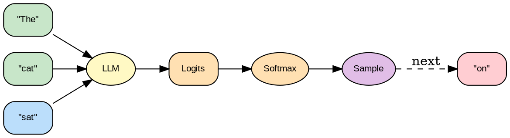

---
jupytext:
  text_representation:
    extension: .md
    format_name: myst
kernelspec:
  display_name: Python 3
  language: python
  name: python3
---

# Lectura 3: Generación Autoregresiva

```{admonition} Ejecutar en Google Colab
:class: tip

[](https://colab.research.google.com/github/salvahin/ACA-2026/blob/main/book/notebooks/03_generacion_autoregresiva.ipynb)
```

```{code-cell} ipython3
:tags: [remove-input, setup]

# Setup Colab Environment
!pip install -q numpy pandas matplotlib seaborn scikit-learn torch transformers accelerate triton xgrammar
print('Dependencies installed!')
```

```{admonition} Objetivos de Aprendizaje
:class: tip
Al finalizar esta lectura podrás:
- Explicar el proceso de generación autoregresiva token por token en LLMs
- Convertir logits a probabilidades usando softmax y ajustar con temperatura
- Comparar estrategias de muestreo (greedy, Top-K, Top-P, beam search) según el caso de uso
- Comprender cómo funciona el entrenamiento con cross-entropy loss
- Aplicar tokenización BPE para convertir texto a secuencias numéricas
```

```{admonition} 🎬 Video Recomendado
:class: tip

**[Let's build GPT: from scratch (Andrej Karpathy)](https://www.youtube.com/watch?v=kCc8FmEb1nY)** - Andrej ilustra conceptualmente cómo se genera el siguiente token de manera iterativa.
```

## Contexto
Aprenderás cómo los LLMs generan texto token por token mediante procesos autoregresivos. Comprenderás estrategias de muestreo (greedy, Top-K, Top-P) y su impacto en creatividad vs coherencia.

```{admonition} 📚 Prerequisito
:class: note
Antes de esta lección debes haber leido:
- **Lectura 1: IA Clásica vs Generativa** — Paradigmas de IA
- **Lectura 2: Fundamentos de Deep Learning** — Redes neuronales, activaciones y backprop
```

## Introducción

Hasta ahora, hemos entendido cómo funcionan los Transformers: procesan entrada, aplican atención, y producen representaciones. Pero ¿cómo generan texto un token por vez, como lo hace ChatGPT?

Esta lectura responde esa pregunta. Explicaremos cómo los LLMs convierten números en palabras, cómo eligen qué palabra generar, y cómo aprenden a hacer esto bien durante el entrenamiento.

---

## Parte 1: De Transformers a Generación




***Figura 1:** Proceso de generación autoregresiva token por token.*

### Repaso: Salida del Transformer

Recuerda que un Transformer toma una secuencia y produce:

```
Entrada:  "El gato saltó"
              ↓
          [Transformer]
              ↓
Salida:   Vector para "el", Vector para "gato", Vector para "saltó"

Cada vector representa la información contextualizada de esa palabra.
```

Para generación, usamos el vector de la **última palabra** como entrada a una capa de predicción:

```
Última salida del Transformer: [0.2, -0.5, 0.8, ..., 0.1]  (768-dimensional)
                                      ↓
                          [Proyección Linear]
                                      ↓
                          [Logits para 50,257 tokens]
                                      ↓
                                    Salida:
                                    Token 0 (PAD): logit = 2.3
                                    Token 1 (EOS): logit = 0.5
                                    ...
                                    Token 250 ("el"): logit = 8.1
                                    Token 251 ("gato"): logit = 7.9
                                    Token 252 ("saltó"): logit = 6.2
                                    ...
                                    Token 50256 (UNK): logit = -2.1
```

Los **logits** son números sin restricción. Necesitamos convertirlos en probabilidades.

---

## Parte 2: De Logits a Probabilidades

### Softmax

Softmax convierte logits en una distribución de probabilidad:

```
Sea logits = [2.3, 0.5, 8.1, 7.9, 6.2, ..., -2.1]

Paso 1: Exponencial
  exp(logits) = [e^2.3, e^0.5, e^8.1, e^7.9, e^6.2, ..., e^-2.1]
              = [9.97, 1.65, 3,320.1, 2,980.96, 493.8, ..., 0.12]

Paso 2: Normaliza
  suma = 9.97 + 1.65 + 3,320.1 + 2,980.96 + 493.8 + ... + 0.12

  probabilidades = exp(logits) / suma
                 = [9.97/suma, 1.65/suma, 3,320.1/suma, ...]
```

```{code-cell} ipython3
import numpy as np
import matplotlib.pyplot as plt

def softmax(logits):
    """Implementación numerically stable de softmax"""
    # Restar el máximo para estabilidad numérica
    exp_logits = np.exp(logits - np.max(logits))
    return exp_logits / np.sum(exp_logits)

# Ejemplo con tokens
logits = np.array([2.3, 0.5, 8.1, 7.9, 6.2, -2.1, 1.0, 3.5])
tokens = ['PAD', 'EOS', 'el', 'gato', 'saltó', 'perro', 'casa', 'corre']

# Calcular probabilidades
probs = softmax(logits)

print("Conversión de Logits a Probabilidades con Softmax")
print("=" * 60)
print(f"\n{'Token':<10} {'Logit':>10} {'exp(Logit)':>15} {'Probabilidad':>15}")
print("-" * 60)

for token, logit, prob in zip(tokens, logits, probs):
    print(f"{token:<10} {logit:>10.2f} {np.exp(logit):>15.2f} {prob:>14.4f} ({prob*100:.2f}%)")

print("-" * 60)
print(f"{'TOTAL':<10} {'':<10} {'':<15} {probs.sum():>14.4f} (100.00%)")

# Visualización
fig, axes = plt.subplots(1, 2, figsize=(14, 5))

# Gráfica de logits
axes[0].bar(tokens, logits, color='steelblue', alpha=0.7, edgecolor='black')
axes[0].set_xlabel('Tokens', fontsize=11)
axes[0].set_ylabel('Logits', fontsize=11)
axes[0].set_title('Logits (valores sin restricción)', fontsize=12, weight='bold')
axes[0].grid(True, alpha=0.3, axis='y')
axes[0].tick_params(axis='x', rotation=45)

# Gráfica de probabilidades
colors = ['lightcoral' if p == max(probs) else 'lightgreen' for p in probs]
axes[1].bar(tokens, probs, color=colors, alpha=0.7, edgecolor='black')
axes[1].set_xlabel('Tokens', fontsize=11)
axes[1].set_ylabel('Probabilidad', fontsize=11)
axes[1].set_title('Probabilidades después de Softmax (suman a 1)', fontsize=12, weight='bold')
axes[1].grid(True, alpha=0.3, axis='y')
axes[1].tick_params(axis='x', rotation=45)
axes[1].axhline(y=1.0, color='red', linestyle='--', linewidth=1, alpha=0.5)

# Agregar línea de suma
axes[1].text(0.5, 0.95, f'Suma = {probs.sum():.4f}',
             transform=axes[1].transAxes, ha='center',
             bbox=dict(boxstyle='round', facecolor='wheat', alpha=0.8))

plt.tight_layout()
plt.show()

print(f"\nToken con mayor probabilidad: '{tokens[np.argmax(probs)]}' ({probs.max()*100:.2f}%)")
```

Resultado: probabilidades que suman a 1.

```
Interpretación:
Token 250 ("el"): 0.15  (15% de probabilidad)
Token 251 ("gato"): 0.14 (14% de probabilidad)
Token 252 ("saltó"): 0.023 (2.3% de probabilidad)
...
```

### Temperatura

Un parámetro importante modifica la "agudeza" de la distribución:

```
Logits modificados = logits / T

donde T es la temperatura (típicamente entre 0.1 y 2.0)
```

:::{figure} diagrams/temperature_sampling.png
:name: fig-temperature
:alt: Efecto de temperatura en distribución de probabilidades
:align: center
:width: 90%

**Figura 2:** Efecto de la Temperatura - controla determinis, baja temperatura = determinístico, alta = creativo.
:::

```{code-cell} ipython3
import numpy as np
import matplotlib.pyplot as plt

def softmax(logits):
    exp_logits = np.exp(logits - np.max(logits))
    return exp_logits / np.sum(exp_logits)

def apply_temperature(logits, temperature):
    return logits / temperature

# Logits de ejemplo
logits = np.array([2.3, 0.5, 8.1, 7.9, 6.2, -2.1, 1.0, 3.5])
tokens = ['PAD', 'EOS', 'el', 'gato', 'saltó', 'perro', 'casa', 'corre']

# Diferentes temperaturas
temperatures = [0.1, 0.5, 1.0, 1.5, 2.0]

fig, axes = plt.subplots(2, 3, figsize=(16, 10))
axes = axes.flatten()

for idx, temp in enumerate(temperatures):
    # Aplicar temperatura
    scaled_logits = apply_temperature(logits, temp)
    probs = softmax(scaled_logits)

    # Visualizar
    ax = axes[idx]
    colors = ['lightcoral' if p == max(probs) else 'lightblue' for p in probs]
    ax.bar(tokens, probs, color=colors, alpha=0.7, edgecolor='black')
    ax.set_ylabel('Probabilidad', fontsize=10)
    ax.set_title(f'Temperatura = {temp:.1f}', fontsize=11, weight='bold')
    ax.tick_params(axis='x', rotation=45)
    ax.grid(True, alpha=0.3, axis='y')
    ax.set_ylim(0, 1.0)

    # Añadir estadísticas
    entropy = -np.sum(probs * np.log(probs + 1e-10))
    max_prob = np.max(probs)
    ax.text(0.5, 0.85, f'Max prob: {max_prob:.3f}\nEntropía: {entropy:.2f}',
            transform=ax.transAxes, ha='center', fontsize=9,
            bbox=dict(boxstyle='round', facecolor='wheat', alpha=0.7))

# Último subplot: comparación de entropías
ax = axes[-1]
entropies = []
for temp in np.linspace(0.1, 3.0, 50):
    probs = softmax(apply_temperature(logits, temp))
    entropy = -np.sum(probs * np.log(probs + 1e-10))
    entropies.append(entropy)

temp_range = np.linspace(0.1, 3.0, 50)
ax.plot(temp_range, entropies, 'b-', linewidth=2)
ax.set_xlabel('Temperatura', fontsize=11)
ax.set_ylabel('Entropía (diversidad)', fontsize=11)
ax.set_title('Temperatura vs Diversidad', fontsize=11, weight='bold')
ax.grid(True, alpha=0.3)
ax.axvline(x=1.0, color='red', linestyle='--', alpha=0.5, label='T=1.0 (estándar)')
ax.legend()

# Añadir anotaciones
ax.annotate('Más determinístico', xy=(0.3, 0.5), xytext=(0.5, 1.0),
            arrowprops=dict(arrowstyle='->', color='green', lw=1.5),
            fontsize=9, color='green')
ax.annotate('Más aleatorio', xy=(2.5, 1.8), xytext=(2.0, 1.3),
            arrowprops=dict(arrowstyle='->', color='red', lw=1.5),
            fontsize=9, color='red')

plt.tight_layout()
plt.show()

print("Efecto de la Temperatura:")
print("=" * 60)
for temp in [0.1, 0.5, 1.0, 2.0]:
    probs = softmax(apply_temperature(logits, temp))
    top_token = tokens[np.argmax(probs)]
    top_prob = np.max(probs)
    print(f"T={temp:.1f}: Token más probable = '{top_token}' ({top_prob*100:.1f}%)")
```

**Efecto:**
- T bajo → Generación determinística, coherente, potencialmente repetitiva
- T alto → Generación creativa, pero potencialmente incoherente

```{admonition} 🎮 Simulación Interactiva: Efecto de Temperatura
:class: tip

Explora cómo la temperatura afecta la distribución de probabilidades de manera interactiva.
```

```{code-cell} ipython3
# Simulación del efecto de temperatura en softmax
import numpy as np
import plotly.graph_objects as go

logits = np.array([2.0, 1.0, 0.5, 0.1, -0.5])
tokens = ['el', 'un', 'una', 'mi', 'su']

temperatures = [0.1, 0.5, 1.0, 1.5, 2.0]
fig = go.Figure()

for T in temperatures:
    probs = np.exp(logits/T) / np.sum(np.exp(logits/T))
    fig.add_trace(go.Bar(name=f'T={T}', x=tokens, y=probs))

fig.update_layout(
    barmode='group',
    title='Efecto de Temperatura en Distribución de Probabilidades',
    xaxis_title='Token',
    yaxis_title='Probabilidad',
    height=400
)
fig.show()
```

```{admonition} 🤔 Reflexiona
:class: hint
¿Por qué crees que un chatbot interactivo usa T=1.0 pero un traductor automático usa T=0.1? Piensa en qué priorizas en cada caso: creatividad o precisión.
```

---

## Parte 3: Estrategias de Muestreo (Decoding)

Ahora tenemos probabilidades para cada token. ¿Cuál elegimos?

### Greedy Decoding

```
Elige el token con la probabilidad más alta:

P("el") = 0.15
P("gato") = 0.14
P("saltó") = 0.023
...

Elige "el" (máxima probabilidad)

Repetir:
Entrada: "El gato saltó el"
           ↓
       [Transformer]
           ↓
Siguiente token más probable: "perro" (P = 0.18)

Entrada: "El gato saltó el perro"
...
```

**Ventaja:** Rápido, determinístico
**Desventaja:** A menudo genera texto monotonía o poco creativo

### Top-K Sampling

```
1. Ordena los tokens por probabilidad
2. Mantén solo los top K tokens
3. Renormaliza sus probabilidades
4. Muestra aleatoriamente de esa distribución

Ejemplo (K=5):
Original:       P("el")=0.15, P("gato")=0.14, P("saltó")=0.023, P("perro")=0.01, ...
Top-5 tokens:   P("el")=0.15, P("gato")=0.14, P("saltó")=0.023, P("corre")=0.015, P("perro")=0.01
Renormalizado:  P("el")=0.32, P("gato")=0.30, P("saltó")=0.05, P("corre")=0.03, P("perro")=0.02

Muestra aleatoriamente: 32% de probabilidad de "el", 30% de "gato", etc.
```

**Ventaja:** Excluye tokens muy improbables (tontos), pero mantiene diversidad
**Desventaja:** K es fijo; a veces queremos top-10, a veces top-3

### Top-P (Nucleus) Sampling

```
1. Ordena tokens por probabilidad (descendente)
2. Suma probabilidades de mayor a menor
3. Detén cuando la suma exceda P (típicamente 0.9)
4. Renormaliza esos tokens
5. Muestra

Ejemplo (P=0.9):
P("el")=0.35
P("el") + P("gato")=0.35+0.32=0.67
P("el") + P("gato") + P("saltó")=0.67+0.18=0.85
P("el") + P("gato") + P("saltó") + P("corre")=0.85+0.07=0.92 > 0.9 (STOP)

Tokens seleccionados: "el", "gato", "saltó", "corre"
Renormaliza y muestrea de esos.
```

```{code-cell} ipython3
import numpy as np
import matplotlib.pyplot as plt

def softmax(logits):
    exp_logits = np.exp(logits - np.max(logits))
    return exp_logits / np.sum(exp_logits)

def greedy_sampling(probs):
    """Selecciona el token con mayor probabilidad"""
    return np.argmax(probs)

def top_k_sampling(probs, k=5):
    """Top-K sampling"""
    top_k_indices = np.argsort(probs)[-k:]
    top_k_probs = probs[top_k_indices]
    # Renormalizar
    top_k_probs = top_k_probs / np.sum(top_k_probs)
    # Muestrear
    return np.random.choice(top_k_indices, p=top_k_probs)

def top_p_sampling(probs, p=0.9):
    """Top-P (Nucleus) sampling"""
    sorted_indices = np.argsort(probs)[::-1]
    sorted_probs = probs[sorted_indices]

    # Acumular probabilidades
    cumsum_probs = np.cumsum(sorted_probs)

    # Encontrar el núcleo
    nucleus_size = np.searchsorted(cumsum_probs, p) + 1
    nucleus_indices = sorted_indices[:nucleus_size]
    nucleus_probs = sorted_probs[:nucleus_size]

    # Renormalizar
    nucleus_probs = nucleus_probs / np.sum(nucleus_probs)

    # Muestrear
    return np.random.choice(nucleus_indices, p=nucleus_probs)

# Datos de ejemplo
logits = np.array([2.3, 0.5, 8.1, 7.9, 6.2, -2.1, 1.0, 3.5])
tokens = ['PAD', 'EOS', 'el', 'gato', 'saltó', 'perro', 'casa', 'corre']
probs = softmax(logits)

# Visualización de estrategias
fig, axes = plt.subplots(2, 2, figsize=(14, 10))

# 1. Distribución original
ax = axes[0, 0]
ax.bar(tokens, probs, color='lightblue', alpha=0.7, edgecolor='black')
ax.set_ylabel('Probabilidad', fontsize=11)
ax.set_title('Distribución Original', fontsize=12, weight='bold')
ax.tick_params(axis='x', rotation=45)
ax.grid(True, alpha=0.3, axis='y')

# 2. Greedy
ax = axes[0, 1]
colors_greedy = ['lightcoral' if i == np.argmax(probs) else 'lightgray' for i in range(len(probs))]
ax.bar(tokens, probs, color=colors_greedy, alpha=0.7, edgecolor='black')
ax.set_ylabel('Probabilidad', fontsize=11)
ax.set_title('Greedy: Solo el más probable', fontsize=12, weight='bold')
ax.tick_params(axis='x', rotation=45)
ax.grid(True, alpha=0.3, axis='y')
selected = tokens[np.argmax(probs)]
ax.text(0.5, 0.9, f"Selecciona: '{selected}'",
        transform=ax.transAxes, ha='center',
        bbox=dict(boxstyle='round', facecolor='wheat', alpha=0.8))

# 3. Top-K
ax = axes[1, 0]
k = 5
top_k_indices = np.argsort(probs)[-k:]
colors_topk = ['lightgreen' if i in top_k_indices else 'lightgray' for i in range(len(probs))]
ax.bar(tokens, probs, color=colors_topk, alpha=0.7, edgecolor='black')
ax.set_ylabel('Probabilidad', fontsize=11)
ax.set_title(f'Top-K Sampling (K={k})', fontsize=12, weight='bold')
ax.tick_params(axis='x', rotation=45)
ax.grid(True, alpha=0.3, axis='y')
ax.text(0.5, 0.9, f"Considera top {k} tokens",
        transform=ax.transAxes, ha='center',
        bbox=dict(boxstyle='round', facecolor='lightgreen', alpha=0.8))

# 4. Top-P
ax = axes[1, 1]
p = 0.9
sorted_indices = np.argsort(probs)[::-1]
sorted_probs = probs[sorted_indices]
cumsum_probs = np.cumsum(sorted_probs)
nucleus_size = np.searchsorted(cumsum_probs, p) + 1
nucleus_indices = sorted_indices[:nucleus_size]

colors_topp = ['lightyellow' if i in nucleus_indices else 'lightgray' for i in range(len(probs))]
ax.bar(tokens, probs, color=colors_topp, alpha=0.7, edgecolor='black')
ax.set_ylabel('Probabilidad', fontsize=11)
ax.set_title(f'Top-P (Nucleus) Sampling (P={p})', fontsize=12, weight='bold')
ax.tick_params(axis='x', rotation=45)
ax.grid(True, alpha=0.3, axis='y')
ax.text(0.5, 0.9, f"Considera {nucleus_size} tokens (suma ≈ {p})",
        transform=ax.transAxes, ha='center',
        bbox=dict(boxstyle='round', facecolor='lightyellow', alpha=0.8))

plt.tight_layout()
plt.show()

# Simulación de muestreo
print("Comparación de Estrategias de Muestreo")
print("=" * 60)
print(f"\n{'Estrategia':<20} {'Tokens Considerados':<30} {'Diversidad':<15}")
print("-" * 60)
print(f"{'Greedy':<20} {1:<30} {'Baja':<15}")
print(f"{'Top-K (K=5)':<20} {k:<30} {'Media':<15}")
print(f"{'Top-P (P=0.9)':<20} {nucleus_size:<30} {'Dinámica':<15}")

# Mostrar probabilidades acumuladas para Top-P
print(f"\nTop-P (P={p}) - Proceso de selección:")
print(f"{'Token':<10} {'Prob':>10} {'Cum. Prob':>12} {'¿Incluido?':<12}")
print("-" * 45)
for i, idx in enumerate(sorted_indices):
    cumprob = cumsum_probs[i]
    included = "Sí" if idx in nucleus_indices else "No"
    print(f"{tokens[idx]:<10} {probs[idx]:>10.4f} {cumprob:>12.4f} {included:<12}")
```

**Ventaja:** Dinámico; ajusta el número de tokens según la distribución
**Desventaja:** Requiere más computación (ordenar)

### Comparación Visual

```
Distribución original: [0.35, 0.32, 0.18, 0.07, 0.05, 0.03, ...]

Greedy:     Elige 0.35 (token 0)

Top-5:      Considera [0.35, 0.32, 0.18, 0.07, 0.05]
            Renormaliza: [0.37, 0.34, 0.19, 0.07, 0.03]
            Muestrea aleatoriamente

Top-P(0.9): Suma [0.35, 0.32, 0.18, 0.07] = 0.92 > 0.9
            Considera [0.35, 0.32, 0.18, 0.07]
            Renormaliza: [0.38, 0.35, 0.20, 0.08]
            Muestrea aleatoriamente
```

:::{figure} diagrams/sampling_strategies.png
:name: fig-sampling
:alt: Comparación de estrategias de muestreo (greedy, Top-K, Top-P)
:align: center
:width: 90%

**Figura 3:** Estrategias de Sampling - comparación visual de greedy vs Top-K vs Top-P.
:::

---

## Parte 4: Beam Search

Beam search es más complejo pero potente: en lugar de elegir un token, explora múltiples caminos.

### Idea Conceptual

```
Paso 1: Genera los K mejores tokens (ej: K=3)
  Beam 1: "el" (probabilidad acumulada = 0.35)
  Beam 2: "gato" (probabilidad acumulada = 0.32)
  Beam 3: "saltó" (probabilidad acumulada = 0.18)

Paso 2: Para cada beam, genera el siguiente token
  Beam 1 ("el"):    mejores opciones: [" gato" P=0.40, " perro" P=0.30, ...]
  Beam 2 ("gato"):  mejores opciones: [" saltó" P=0.50, " corrió" P=0.25, ...]
  Beam 3 ("saltó"): mejores opciones: [" sobre" P=0.60, ...]

Paso 3: Calcula probabilidades acumuladas de cada secuencia
  "el gato": 0.35 * 0.40 = 0.14
  "el perro": 0.35 * 0.30 = 0.105
  "gato saltó": 0.32 * 0.50 = 0.16
  "gato corrió": 0.32 * 0.25 = 0.08
  "saltó sobre": 0.18 * 0.60 = 0.108
  ...

Paso 4: Mantén los K mejores caminos
  Ranking: 1) "gato saltó" (0.16), 2) "el gato" (0.14), 3) "saltó sobre" (0.108), ...
  Nuevos beams (K=3):
    Beam 1: "gato saltó"
    Beam 2: "el gato"
    Beam 3: "saltó sobre"

Repite hasta longitud máxima o hasta que generes [END]
```

**Ventaja:** Explora múltiples caminos, mejor probabilidad general  
**Desventaja:** Computacionalmente costoso; requiere mantener múltiples secuencias

### Implementación de Beam Search

```{code-cell} ipython3
import numpy as np
import matplotlib.pyplot as plt
import matplotlib.patches as mpatches

def beam_search(log_prob_fn, initial_token, vocab, beam_width=3, max_steps=4):
    """
    Beam Search simplificado.
    
    Args:
        log_prob_fn: función que dado una secuencia devuelve log-probs del siguiente token
        initial_token: token de inicio (índice en vocab)
        vocab: lista de tokens (strings)
        beam_width: número de beams a mantener (K)
        max_steps: número máximo de tokens a generar
    
    Returns:
        Lista de (log_prob, secuencia) de los mejores beams al final
        Historia de expansiones para visualización
    """
    # Cada beam: (log_probabilidad_acumulada, lista_de_tokens)
    beams = [(0.0, [initial_token])]
    history = [list(beams)]  # para visualizar el árbol

    for step in range(max_steps):
        candidates = []
        for log_prob, tokens in beams:
            # Obtener distribución sobre siguiente token
            next_log_probs = log_prob_fn(tokens)
            
            # Expandir: considerar todos los tokens del vocabulario
            for token_idx, token_log_prob in enumerate(next_log_probs):
                new_log_prob = log_prob + token_log_prob
                candidates.append((new_log_prob, tokens + [token_idx]))
        
        # Mantener solo los K mejores candidatos (por log-prob acumulada)
        candidates.sort(key=lambda x: x[0], reverse=True)
        beams = candidates[:beam_width]
        history.append(list(beams))

    return beams, history


# Vocabulario simplificado de prueba
vocab = ['[START]', 'el', 'gato', 'saltó', 'sobre', 'la', 'cerca', '[END]']
V = len(vocab)

# Distribución de siguiente token simulada (para demostración)
# En la práctica, esto sería el LLM
np.random.seed(7)
transition_matrix = np.random.dirichlet(np.ones(V) * 0.5, size=V)

def log_prob_fn(token_sequence):
    """Distribución de siguiente token dado el último token."""
    last_token = token_sequence[-1]
    return np.log(transition_matrix[last_token] + 1e-10)

# Ejecutar beam search desde [START] (token 0)
best_beams, history = beam_search(log_prob_fn, initial_token=0, vocab=vocab,
                                   beam_width=3, max_steps=4)

# Resultados
print("=== Beam Search (K=3) ===")
print(f"Vocabulario: {vocab}\n")
for rank, (lp, seq) in enumerate(best_beams, 1):
    words_seq = [vocab[t] for t in seq]
    print(f"  Beam {rank}: {' '.join(words_seq):30s}  log-prob={lp:.3f}  prob={np.exp(lp):.6f}")
```

```{code-cell} ipython3
# Visualización del árbol de búsqueda
fig, ax = plt.subplots(figsize=(14, 6))

colors = ['#2196F3', '#FF5722', '#4CAF50']  # azul, naranja, verde para cada beam

step_labels = ['Inicio', 'Paso 1', 'Paso 2', 'Paso 3', 'Paso 4']
x_positions = np.linspace(0.05, 0.95, len(history))

# Dibujar nodos y conexiones
prev_coords = {}  # mapa de seq_tuple → (x, y) de nodo anterior

for step_idx, (step_beams, x_pos) in enumerate(zip(history, x_positions)):
    n = len(step_beams)
    y_positions = np.linspace(0.15, 0.85, max(n, 1))
    
    for beam_rank, ((lp, seq), y_pos) in enumerate(zip(step_beams, y_positions)):
        label = vocab[seq[-1]] if seq else '[START]'
        color = colors[beam_rank % len(colors)]
        
        # Nodo
        ax.plot(x_pos, y_pos, 'o', markersize=22,
                color=color, alpha=0.85, zorder=3)
        ax.text(x_pos, y_pos, label, ha='center', va='center',
                fontsize=8, weight='bold', color='white', zorder=4)
        ax.text(x_pos, y_pos - 0.09, f'{lp:.2f}',
                ha='center', va='top', fontsize=7, color='#555555')
        
        # Línea al padre
        if step_idx > 0:
            parent_seq = tuple(seq[:-1])
            if parent_seq in prev_coords:
                px, py = prev_coords[parent_seq]
                ax.plot([px, x_pos], [py, y_pos], '-',
                        color=color, alpha=0.4, linewidth=1.5, zorder=2)
        
        prev_coords[tuple(seq)] = (x_pos, y_pos)

# Etiquetas de pasos
for i, (label, x) in enumerate(zip(step_labels, x_positions)):
    ax.text(x, 0.97, label, ha='center', va='top',
            fontsize=10, weight='bold', color='#333333',
            transform=ax.transAxes if False else ax.transData)

ax.set_xlim(-0.02, 1.02)
ax.set_ylim(0.0, 1.0)
ax.axis('off')
ax.set_title(f'Árbol de Búsqueda — Beam Search (K=3)\n'
             f'Cada color es un beam; se muestran los 3 mejores en cada paso',
             fontsize=12, weight='bold')

legend_handles = [mpatches.Patch(color=c, label=f'Beam {i+1}')
                  for i, c in enumerate(colors)]
ax.legend(handles=legend_handles, loc='lower right', fontsize=9)

plt.tight_layout()
plt.show()

print("\nComparación de estrategias de decoding:")
print(f"  Greedy:      1 camino,  determinístico, rápido")
print(f"  Top-K/Top-P: 1 camino,  estocástico,   rápido")
print(f"  Beam Search: {3} caminos, determinístico, más lento")
```

---


## Parte 5: Entrenamiento - Cross-Entropy Loss

¿Cómo entrenan estos modelos a generar el token correcto?

### La Tarea de Entrenamiento

```
Texto: "El gato saltó sobre la cerca"
Tokenizado: [token_el, token_gato, token_saltó, ...]

Reorganiza como pares entrada-salida:
Entrada: [token_el] → Salida esperada: token_gato
Entrada: [token_el, token_gato] → Salida esperada: token_saltó
Entrada: [token_el, token_gato, token_saltó] → Salida esperada: token_sobre
...

Esto se llama "next-token prediction" o "causal language modeling".
```

### Cross-Entropy Loss

Para cada predicción:

```
Modelo produce:
P(token_gato) = 0.35
P(token_saltó) = 0.20
P(token_perro) = 0.15
...

La verdadera etiqueta es: token_gato (P=1.0)

Cross-Entropy Loss = -log(0.35) ≈ 1.05

Si el modelo predice correctamente (P=0.99):
Loss = -log(0.99) ≈ 0.01

Si predice incorrectamente (P=0.01):
Loss = -log(0.01) ≈ 4.6
```

**Fórmula:**
```
CE Loss = -Σ y_i * log(ŷ_i)

donde:
- y es la distribución verdadera (1 para la palabra correcta, 0 para otras)
- ŷ es la distribución predicha (softmax de logits)
```

### Entrenamiento

```
Para cada batch de ejemplos:
  1. Forward pass: predice probabilidades para cada posición
  2. Calcula CE loss para cada predicción
  3. Promedia los losses
  4. Retropropagación: actualiza pesos para reducir loss
  5. Repite con el siguiente batch

Después de 100 mil millones de tokens de entrenamiento,
el modelo ha aprendido patrones de lenguaje.
```

---

## Parte 6: Tokenización - BPE

¿Cómo convertimos texto en tokens?

### Problema

Vocabulario completo de caracteres: ~10,000 caracteres en Unicode
Vocabulario de palabras: millones (cada palabra es única)
Solución intermedia: **Byte Pair Encoding (BPE)**

### Algoritmo BPE Simplificado

```
Paso 1: Comienza con caracteres
  Vocabulario: [a, b, c, d, e, ...]

Paso 2: Busca el par más común, reemplázalo con un nuevo símbolo
  Documento: "aabaaaab"
  Par más común: "aa"
  Nuevo símbolo: X
  Documento: "XbXXb"
  Vocabulario: [a, b, c, ..., X]

Paso 3: Repite N veces (típicamente N=30,000)
  "XbXXb"
  Par más común: "Xb"
  Nuevo símbolo: Y
  "YXY"
  etc.

Resultado: Vocabulario de ~50,000 "tokens" que combinan caracteres y palabras.
```

```{code-cell} ipython3
from collections import Counter
import re

def get_stats(vocab):
    """Cuenta pares de símbolos consecutivos"""
    pairs = Counter()
    for word, freq in vocab.items():
        symbols = word.split()
        for i in range(len(symbols) - 1):
            pairs[symbols[i], symbols[i + 1]] += freq
    return pairs

def merge_vocab(pair, vocab):
    """Fusiona el par más frecuente en el vocabulario"""
    new_vocab = {}
    bigram = ' '.join(pair)
    replacement = ''.join(pair)

    for word in vocab:
        new_word = word.replace(bigram, replacement)
        new_vocab[new_word] = vocab[word]
    return new_vocab

# Simulación simple de BPE
print("Byte Pair Encoding (BPE) - Demostración")
print("=" * 60)

# Vocabulario inicial (palabras con frecuencias)
vocab = {
    'l o w </w>': 5,
    'l o w e r </w>': 2,
    'n e w e s t </w>': 6,
    'w i d e s t </w>': 3
}

print("\nVocabulario inicial (palabras divididas en caracteres):")
for word, freq in vocab.items():
    print(f"  '{word}': {freq} veces")

num_merges = 10
merges_history = []

print(f"\nAplicando {num_merges} fusiones BPE:")
print("-" * 60)

for i in range(num_merges):
    pairs = get_stats(vocab)
    if not pairs:
        break

    best_pair = max(pairs, key=pairs.get)
    vocab = merge_vocab(best_pair, vocab)
    merges_history.append(best_pair)

    print(f"\nFusión {i+1}: {best_pair[0]} + {best_pair[1]} = {''.join(best_pair)}")
    print(f"  Frecuencia del par: {pairs[best_pair]}")
    print(f"  Vocabulario actualizado:")
    for word, freq in vocab.items():
        print(f"    '{word}': {freq} veces")

print(f"\nHistorial de fusiones:")
for i, (a, b) in enumerate(merges_history, 1):
    print(f"  {i}. '{a}' + '{b}' → '{a}{b}'")

# Visualización
import matplotlib.pyplot as plt

# Crear visualización del proceso
fig, ax = plt.subplots(figsize=(12, 6))

# Mostrar progresión del tamaño promedio de tokens
initial_tokens = sum(len(word.split()) * freq for word, freq in vocab.items()) / sum(vocab.values())
steps = list(range(len(merges_history) + 1))
avg_token_counts = [initial_tokens]

# Recalcular para cada paso (simplificado)
temp_vocab = {
    'l o w </w>': 5,
    'l o w e r </w>': 2,
    'n e w e s t </w>': 6,
    'w i d e s t </w>': 3
}

for pair in merges_history:
    temp_vocab = merge_vocab(pair, temp_vocab)
    avg_tokens = sum(len(word.split()) * freq for word, freq in temp_vocab.items()) / sum(temp_vocab.values())
    avg_token_counts.append(avg_tokens)

ax.plot(steps, avg_token_counts, 'bo-', linewidth=2, markersize=8)
ax.set_xlabel('Número de Fusiones BPE', fontsize=12)
ax.set_ylabel('Tokens Promedio por Palabra', fontsize=12)
ax.set_title('Reducción de Tokens con BPE', fontsize=14, weight='bold')
ax.grid(True, alpha=0.3)
ax.axhline(y=avg_token_counts[0], color='red', linestyle='--', alpha=0.5,
           label=f'Inicial: {avg_token_counts[0]:.2f} tokens/palabra')
ax.axhline(y=avg_token_counts[-1], color='green', linestyle='--', alpha=0.5,
           label=f'Final: {avg_token_counts[-1]:.2f} tokens/palabra')
ax.legend()

plt.tight_layout()
plt.show()

print(f"\nReducción: {avg_token_counts[0]:.2f} → {avg_token_counts[-1]:.2f} tokens/palabra")
print(f"Compresión: {(1 - avg_token_counts[-1]/avg_token_counts[0])*100:.1f}%")
```

### Ventajas de BPE

```
Palabra: "unbelievable"
Caracteres: [u, n, b, e, l, i, e, v, a, b, l, e] - 12 símbolos

Con BPE:
Si "un" es común → token UN
Si "able" es común → token ABLE
Si "beli" es común → token BELI
Resultado: [UN, BELI, EV, ABLE] - 4 tokens

Económico: menos tokens = menor costo computacional
Flexible: palabras desconocidas se descomponen en sub-palabras
```

### Otros métodos

- **WordPiece (BERT):** Similar a BPE, pero usa probabilidad en lugar de frecuencia
- **SentencePiece:** Comienza con caracteres Unicode, no ASCII

---

## Parte 7: En Resumen: El Pipeline Completo

```
Entrada: "¿Cuál es la capital de Francia?"
           ↓
[Tokenización BPE]: [¿, Cuál, es, la, capital, de, Francia, ?]
           ↓
[Embeddings + Pos Encoding]
           ↓
[Transformer Bloques] × N
           ↓
[Proyección a Logits]: [logit_0, logit_1, ..., logit_50256]
           ↓
[Softmax]: [P(token_0), P(token_1), ..., P(token_50256)]
           ↓
[Sampling: Top-P (P=0.9), T=1.0]
           ↓
[Token Elegido]: token_Paris (P=0.42)
           ↓
Salida: "París"
           ↓
[Repite con nueva entrada]: "¿Cuál es la capital de Francia? París"
```

---


## Implementando la Generación Paso a Paso (PyTorch)

Para quitarle la "magia" a las librerías como HuggingFace, vamos a implementar nosotros mismos el ciclo autoregresivo exacto usando un modelo de lenguaje real (GPT-2).

```{code-cell} ipython3
import torch
from transformers import AutoTokenizer, GPT2LMHeadModel

# 1. Cargar modelo pequeño y tokenizer
model_id = "gpt2"
tokenizer = AutoTokenizer.from_pretrained(model_id)
model = GPT2LMHeadModel.from_pretrained(model_id)
model.eval()

# 2. Entrada inicial (Prompt)
text = "The capital of France is"
inputs = tokenizer(text, return_tensors="pt")

print(f"Texto original: '{text}'")
print(f"Tokens de entrada (IDs): {inputs['input_ids'][0].tolist()}")

# 3. Generación Autoregresiva Manual (Paso a paso)
max_new_tokens = 5
current_input_ids = inputs['input_ids']

print("\nIniciando generación iterativa...")
print("-" * 50)

with torch.no_grad():
    for step in range(max_new_tokens):
        # A) Forward pass: pasar todos los tokens actuales por el transformer
        outputs = model(input_ids=current_input_ids)
        
        # B) Extraer los logits de la ÚLTIMA posición generada
        # outputs.logits tiene forma: [batch_size, sequence_length, vocab_size]
        next_token_logits = outputs.logits[0, -1, :] 
        
        # C) Selección del siguiente token (Greedy Decoding: argmax)
        next_token_id = torch.argmax(next_token_logits)
        
        # D) Decodificar para ver qué palabra eligió
        next_word = tokenizer.decode(next_token_id)
        
        print(f"Paso {step+1} | Token ID: {next_token_id.item():>5} | Palabra: '{next_word}'")
        
        # E) Agregar el nuevo token a la secuencia para el siguiente paso (Autoregresivo!)
        current_input_ids = torch.cat([current_input_ids, next_token_id.unsqueeze(0).unsqueeze(0)], dim=-1)

print("-" * 50)
print(f"Texto final completo: '{tokenizer.decode(current_input_ids[0])}'")
```

Como puedes ver, `model.generate()` simplemente oculta este ciclo `for` detrás de una función fácil de usar. Cada palabra generada obliga al modelo a recalcular todo el contexto anterior.

## Reflexión y Ejercicios

### Preguntas para Reflexionar:

1. **Temperature:** ¿Por qué un chatbot interactivo usa T=1.0 pero un traductor automático usa T=0.1?

2. **Beam Search vs Sampling:** ¿Cuándo elegirías beam search? ¿Cuándo Top-P sampling?

3. **Cross-Entropy Loss:** ¿Por qué usamos logaritmo? ¿Qué pasaría si simplemente usáramos |y - ŷ|?

### Ejercicios Prácticos:

1. **Softmax manual:**
   ```
   Logits: [2.0, 0.5, 1.5]
   Calcula softmax y obtén probabilidades para cada token.
   ```

2. **BPE simulado:**
   ```
   Documento: "aaabaaab"
   Paso 1: ¿Cuál es el par más común?
   Paso 2: Reemplázalo con símbolo X. Nuevo documento: ?
   Paso 3: ¿Cuál es el siguiente par más común?
   ```

3. **Análisis: Greedy vs Top-P**
   ```
   Supón que tienes dos probabilidades de distribución:

   Caso 1: [0.9, 0.05, 0.03, 0.02, ...]
   Caso 2: [0.2, 0.2, 0.2, 0.2, 0.2]

   Para cada caso, ¿qué estrategia (greedy, top-K, top-P) elegirías?
   ¿Por qué?
   ```

4. **Reflexión escrita (300 palabras):** "Los LLMs se entrenan con cross-entropy loss en tareas de next-token prediction. ¿Cómo crees que esto lo hace buenos en tareas que no son predicción del siguiente token, como responder preguntas o resumir?"

---

```{admonition} ✅ Verifica tu comprensión
:class: note
1. ¿Cuál es la diferencia entre logits y probabilidades? ¿Por qué necesitamos softmax?
2. Explica con tus palabras por qué Top-P sampling es más flexible que Top-K.
3. ¿Cuándo elegirías beam search sobre Top-P sampling? Menciona un caso de uso específico.
4. ¿Por qué cross-entropy loss usa logaritmo? ¿Qué pasaría si usáramos simplemente |y - ŷ|?
```

## Resumen

```{admonition} Resumen
:class: important
**Conceptos clave:**
- Generación autoregresiva: modelo predice siguiente token basado en tokens anteriores, repite iterativamente
- Softmax convierte logits (scores sin normalizar) a distribución de probabilidad; temperatura controla distribución
- Estrategias de muestreo: greedy (determinístico), Top-K/Top-P (balancean creatividad y coherencia), beam search (explora múltiples caminos)
- Cross-entropy loss mide qué tan bien el modelo predice tokens correctos; minimizar durante entrenamiento
- Tokenización BPE descompone palabras en sub-palabras, balanceando eficiencia y flexibilidad (~30-50k tokens de vocabulario)

**Para la siguiente lectura:** Prepárate para profundizar en la arquitectura Transformer. Veremos en detalle el mecanismo de atención, multi-head attention y codificación posicional que hacen posible la generación que acabamos de estudiar.
```

## Puntos Clave

- **Logits → Softmax:** Convierte salida de modelo en probabilidades
- **Temperatura:** Controla "agudeza" de distribución (baja = determinístico, alta = aleatorio)
- **Greedy:** Elige token más probable (rápido, a menudo aburrido)
- **Top-K/Top-P:** Excluye tokens improbables, muestrea aleatoriamente (creativo, pero controlado)
- **Beam Search:** Explora múltiples caminos (mejor calidad, más lento)
- **Cross-Entropy Loss:** -log(P_correcta), minimizar durante entrenamiento
- **BPE:** Divide palabras en sub-palabras (balance entre caracteres y palabras)

---

## Referencias

- Sennrich, R., Haddow, B., & Birch, A. (2016). [Neural Machine Translation of Rare Words with Subword Units](https://arxiv.org/abs/1508.07909). arXiv:1508.07909.
- Holtzman, A. et al. (2020). [The Curious Case of Neural Text Degeneration](https://arxiv.org/abs/1904.09751). ICLR 2020.
- Fan, A., Lewis, M., & Dauphin, Y. (2018). [Hierarchical Neural Story Generation](https://arxiv.org/abs/1805.04833). ACL.
- Radford, A. et al. (2019). [Language Models are Unsupervised Multitask Learners](https://cdn.openai.com/better-language-models/language_models_are_unsupervised_multitask_learners.pdf). OpenAI.

