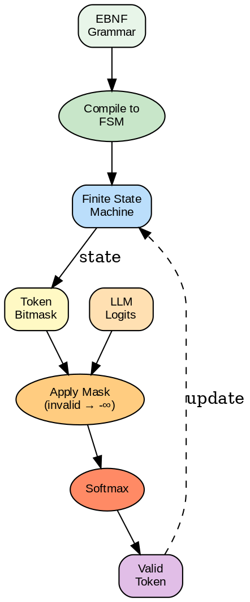

---
jupytext:
  text_representation:
    extension: .md
    format_name: myst
kernelspec:
  display_name: Python 3
  language: python
  name: python3
---

# Lectura 6: Sampling y Constrained Decoding


```{admonition} Ejecutar en Google Colab
:class: tip

[](https://colab.research.google.com/github/salvahin/ACA-2026/blob/main/book/notebooks/06_sampling_constrained_decoding.ipynb)
```

```{admonition} Objetivos de Aprendizaje
:class: tip
Al finalizar esta lectura podrás:
- Identificar el problema de salidas inválidas (JSON mal formado, código con errores sintácticos) en LLMs sin restricciones
- Aplicar constrained decoding mediante máscaras de logits para garantizar salidas válidas
- Utilizar gramáticas formales (CFG) con frameworks como XGrammar para restricciones complejas
- Evaluar el trade-off entre calidad de salida y garantía de validez en constrained decoding
- Implementar bitmask simple para restricciones de vocabulario limitado
```


## Introducción

En la lectura anterior, vimos cómo generar texto token por token usando diferentes estrategias (greedy, top-K, top-P). Pero ¿qué pasa cuando necesitas que el modelo genere en un formato específico? Por ejemplo:

- JSON válido (llaves y valores correctos)
- Código compilable (sintaxis correcta)
- Respuestas estructuradas (formato específico)

Sin restricciones, el modelo a menudo genera JSON mal formado o código con errores sintácticos. **Constrained decoding** es la solución: modifica dinámicamente qué tokens puede generar para garantizar que el resultado respete restricciones.

---

## Parte 1: Repaso de Decoding Libre

Antes de hablar de restricciones, recordemos cómo funciona decoding sin restricciones:

```
Paso 1: Transformer produce logits para 50,257 tokens
        logits = [2.1, 0.5, 3.2, 1.1, ..., -5.2]

Paso 2: Aplica temperatura y convierte a probabilidades
        P = softmax(logits / T)

Paso 3: Aplica Top-P (nucleus) sampling
        - Ordena por probabilidad descendente
        - Suma hasta alcanzar P_acumulada > 0.9
        - Renormaliza y muestrea

Paso 4: Genera siguiente token
        Token elegido → Agregua a secuencia

Paso 5: Repite desde Paso 1 hasta [END] o límite de longitud
```

El modelo es **libre** de elegir cualquier token (con probabilidades aprendidas).

---

## Parte 2: El Problema - Salidas Inválidas

### Ejemplo 1: JSON

```
Pregunta: "Extrae nombre y edad. Devuelve JSON."

Respuesta del modelo SIN restricciones:
{
  "nombre": "Juan
  "edad": 30,
  "ciudad": "Madrid"
  "ocupacion: "Ingeniero"
}

Problemas:
- "Juan sin cierre de comillas
- Falta comilla en "ocupacion
- Clave ocupacion no solicitada
```

El código que intenta parsear esto falla:

```{code-cell} ipython3
import json

# Ejemplo de JSON malformado
respuesta = """{
  "nombre": "Juan
  "edad": 30,
  "ciudad": "Madrid"
  "ocupacion: "Ingeniero"
}"""

try:
    data = json.loads(respuesta)
except json.JSONDecodeError as e:
    print(f"Error: {e}")
```

### Ejemplo 2: Código

```python
Pregunta: "Escribe una función que retorna el factorial"

Respuesta SIN restricciones:
def factorial(n):
    if n == 0
        return 1
    else
        return n * factorial(n - 1)

Problemas:
- Falta ":" después de "if n == 0"
- Indentación inconsistente
```

Este código no compila:

```
SyntaxError: expected ':' (line 2)
```

### El Coste de Regeneración

```{admonition} 🤔 Reflexiona
:class: hint
¿Por qué es costoso regenerar múltiples veces? Piensa en términos de tokens consumidos (que se pagan) y latencia (tiempo de espera del usuario). ¿Cuál es más crítico en tu aplicación?
```

Una solución ingenua: si el resultado es inválido, pide al modelo que intente de nuevo.

```
Intento 1: Resultado inválido → Descarta
Intento 2: Resultado inválido → Descarta
Intento 3: Resultado inválido → Descarta
Intento 4: Válido ✓

Costo: 4× el tiempo y tokens de salida
```

Esto es muy costoso a escala.

---

## Parte 3: Constrained Decoding - Enfoque Conceptual




***Figura 1:** Pipeline de Constrained Decoding con gramáticas.*

### La Idea

En lugar de permitir cualquier token:

```
Paso 1: Calcula qué tokens PODRÍAN ser válidos en esta posición
        - Si acabas de escribir "{", el próximo debe ser una comilla (para key)
        - Si estás dentro de un string, no puedes cerrar con "}"
        - Si escribiste "if", debes escribir ":" en algún momento

Paso 2: Crea una "máscara" de tokens válidos
        valid_mask = [1, 0, 1, 0, 0, 1, ...]
                     (1 = válido, 0 = inválido)

Paso 3: Anula logits de tokens inválidos
        logits_masked[i] = logits[i] si valid_mask[i] == 1
                          = -∞         si valid_mask[i] == 0

Paso 4: Aplica softmax (tokens con -∞ → probabilidad 0)
        P = softmax(logits_masked)

Paso 5: Muestrea normalmente
        (nunca selecciona tokens con P=0)
```

**Resultado:** El modelo elige el mejor token que sigue siendo válido.

---

## Parte 4: LogitsProcessor - Implementación

### LogitsProcessor Genérica

Frameworks como Hugging Face implementan esto con `LogitsProcessor`:

```python
class ConstrainedLogitsProcessor:
    def __call__(self, input_ids, scores):
        """
        input_ids: tokens generados hasta ahora
        scores: logits sin procesar para el siguiente token

        Retorna: scores modificados
        """
        # Identifica tokens válidos basado en input_ids
        valid_tokens = self.get_valid_tokens(input_ids)

        # Anulan logits de tokens inválidos
        scores[~valid_tokens] = -float("inf")

        return scores
```

### Ejemplo: JSON Válido

```python
import json
from transformers import LogitsProcessor

class JSONLogitsProcessor(LogitsProcessor):
    def __init__(self, tokenizer):
        self.tokenizer = tokenizer

    def get_valid_tokens(self, input_ids):
        # Convierte tokens a texto
        text = self.tokenizer.decode(input_ids)

        # Determina qué caracteres son válidos en JSON
        # Basado en el estado actual (dentro de string, dentro de objeto, etc.)

        valid_chars = self.get_valid_json_chars(text)
        valid_token_ids = [
            i for i, token in enumerate(self.tokenizer.vocab.items())
            if token in valid_chars
        ]

        return valid_token_ids
```

### Estados en JSON

```
Estado 1: Esperando { inicial
  válidos: { solo

Estado 2: Dentro del objeto, esperando key
  válidos: ", nombre de variable, }

Estado 3: Dentro de string (clave)
  válidos: caracteres, ", (pero no }))

Estado 4: Después de ", esperando :
  válidos: :

Estado 5: Después de :, esperando valor
  válidos: ", número, true, false, null, {, [

etc.
```

---

## Parte 5: XGrammar - Constrained Decoding Avanzado

XGrammar es un framework especializado en constrained decoding. Permite especificar restricciones mediante **gramáticas formales**.

### Gramáticas sin Contexto (CFG)

```
JSON Grammar (simplificada):

json ::= object | array | string | number | "true" | "false" | "null"
object ::= "{" (string ":" value ("," string ":" value)*)? "}"
array ::= "[" (value ("," value)*)? "]"
value ::= object | array | string | number | "true" | "false" | "null"
string ::= "\"" ([\x20-\x21\x23-\x5B\x5D-\x7E] | "\\\"")* "\""
number ::= [0-9]+ ("." [0-9]+)? ([eE] [+-]? [0-9]+)?
```

Esto define **exactamente** qué es un JSON válido.

### Cómo XGrammar lo Usa

```
1. Parser de la gramática → Autómata finito determinista (DFA)
2. En cada paso de generación:
   - Estado actual en DFA: "dentro de objeto, esperando key"
   - Tokens válidos desde ese estado: ["\"", "}"]
   - Anulan logits de otros tokens
   - Muestrea normalmente
3. Transición de estado: si genera "\", nuevo estado = "dentro de string"
4. Repite hasta alcanzar estado de aceptación (JSON válido)
```

### Ventajas de XGrammar

```
✓ Garantiza salida válida (respeta la gramática 100%)
✓ Flexible: soporta cualquier CFG
✓ Integración con llama.cpp y otros servidores

Ejemplos:
- JSON: grammar = load_json_grammar()
- SQL: grammar = load_sql_grammar()
- Python: grammar = load_python_grammar()
```

---

## Parte 6: Bitmask - Constrained Decoding Sencillo

Para restricciones simples, una máscara de bits es suficiente:

### Caso 1: Tokens Específicos

```python
# Solo permite tokens que son dígitos
valid_tokens = [
    tokenizer.encode("0")[0],
    tokenizer.encode("1")[0],
    tokenizer.encode("2")[0],
    # ...,
    tokenizer.encode("9")[0],
]

bitmask = [False] * tokenizer.vocab_size
for token_id in valid_tokens:
    bitmask[token_id] = True

# Durante decoding:
logits[~bitmask] = -float("inf")
```

### Caso 2: Palabras de Vocabulario Pequeño

```python
# Genera solo respuestas de un conjunto limitado
allowed_responses = ["Sí", "No", "Quizás"]
allowed_token_ids = [tokenizer.encode(resp)[0] for resp in allowed_responses]

bitmask = [False] * vocab_size
for token_id in allowed_token_ids:
    bitmask[token_id] = True
```

**Ventaja:** Muy rápido, ningún overhead computacional
**Desventaja:** Solo funciona para restricciones simples

```{admonition} 🎮 Simulación Interactiva: Top-K vs Top-P Sampling
:class: tip

Compara visualmente las diferentes estrategias de sampling.
```

```{code-cell} ipython3
# Comparación Top-K vs Top-P
import numpy as np
import plotly.graph_objects as go
from plotly.subplots import make_subplots

np.random.seed(42)
probs = np.array([0.35, 0.25, 0.15, 0.10, 0.08, 0.04, 0.02, 0.01])
tokens = [f'tok_{i}' for i in range(len(probs))]

fig = make_subplots(rows=1, cols=3, subplot_titles=('Original', 'Top-K (K=3)', 'Top-P (P=0.9)'))

# Original
fig.add_trace(go.Bar(x=tokens, y=probs, marker_color='steelblue'), row=1, col=1)

# Top-K
top_k = 3
top_k_probs = np.where(np.argsort(-probs) < top_k, probs, 0)
top_k_probs = top_k_probs / top_k_probs.sum()
colors_k = ['green' if p > 0 else 'lightgray' for p in top_k_probs]
fig.add_trace(go.Bar(x=tokens, y=top_k_probs, marker_color=colors_k), row=1, col=2)

# Top-P
cumsum = np.cumsum(np.sort(probs)[::-1])
cutoff_idx = np.searchsorted(cumsum, 0.9) + 1
threshold = np.sort(probs)[::-1][min(cutoff_idx, len(probs)-1)]
top_p_probs = np.where(probs >= threshold, probs, 0)
top_p_probs = top_p_probs / top_p_probs.sum()
colors_p = ['orange' if p > 0 else 'lightgray' for p in top_p_probs]
fig.add_trace(go.Bar(x=tokens, y=top_p_probs, marker_color=colors_p), row=1, col=3)

fig.update_layout(height=350, showlegend=False, title_text="Estrategias de Sampling")
fig.show()
```

---

## Parte 7: Trade-offs - Calidad vs Restricciones

### El Dilema

```
Sin restricciones:
- Mejor calidad (el modelo elige libremente)
- Puede generar salida inválida
- Requiere reintento o parseo manual

Con restricciones estrictas:
- Salida garantizada válida
- Posiblemente menor calidad (forzado a tokens sub-óptimos)
- Sin overhead de reintento
```

### Ejemplo: JSON con Número

```
Prompt: "¿Cuántos años tienes? (responde como {\"edad\": <número>})"

Sin restricciones:
P("7") = 0.7     ← Mejor probabilidad
P("siete") = 0.2
P("07") = 0.05

Con restricción JSON:
P("7") = 0.7     ← Se permite, se elige
P("siete") = 0    ← Anulado (no es número en JSON)
P("07") = 0.05   ← Se permite, segunda opción

Resultado: Mismo token elegido (7)
Sin penalización de calidad en este caso.
```

### Otro Ejemplo: Creatividad

```
Prompt: "Escribe un haiku"

Sin restricciones:
El modelo puede usar cualquier estructura
Potencialmente más creativo

Con restricción (estructura haiku):
línea 1: 5 sílabas
línea 2: 7 sílabas
línea 3: 5 sílabas

El modelo DEBE seguir esto
Menos flexibilidad, pero garantizado haiku
```

### Recomendaciones

```
Usa restricciones CUANDO:
- Necesitas salida estructurada (JSON, XML, SQL)
- Dominio tiene reglas claras (código, formato)
- Costo de reintento es alto (tokens = dinero)

Evita restricciones CUANDO:
- Necesitas máxima creatividad
- Restricciones excluyen buenas respuestas
- Costo computacional de constrained decoding > reintento
```

---

## Parte 8: Ejemplo Práctico Completo

### Escenario

```
Tarea: Extraer información de reseña de película
Entrada: "¡Película increíble! Me encantó. 9/10. Recomendado."
Salida requerida:
{
    "sentimiento": "positivo",
    "calificación": 9,
    "recomendado": true
}
```

### Sin Constrained Decoding

```python
response = model.generate(
    "Extrae información. Responde en JSON: {...}",
    max_new_tokens=100,
    temperature=1.0
)

# Salida posible:
# {
#   "sentimiento": "muy positivo",
#   "calificacion": 9,
#   recomendado: true,
#   "director": "Unknown"
# }
# ← Mal formado (calificacion vs calificación, falta comilla en recomendado)
```

### Con Constrained Decoding

```python
from xgrammar import Grammar, CompiledGrammar

json_grammar = """
object ::= "{" (string ":" value ("," string ":" value)*)? "}"
string ::= "\"" ([\\x20-\\x21\\x23-\\x5B\\x5D-\\x7E] | "\\\\\"")* "\""
value ::= object | string | number | "true" | "false"
number ::= [0-9]+
"""

compiled = CompiledGrammar(json_grammar, tokenizer)

response = model.generate(
    "Extrae información. Responde en JSON: {...}",
    max_new_tokens=100,
    logits_processor=compiled.logits_processor
)

# Salida: GARANTIZADO JSON VÁLIDO
# Siempre respetará estructura JSON
```

---

## Reflexión y Ejercicios

### Preguntas para Reflexionar:

1. **Trade-off calidad:** ¿En qué casos crees que constrained decoding degrada significativamente la calidad de la salida?

2. **Gramáticas:** ¿Cómo escribirías una gramática para código Python válido? ¿Qué lo haría más complejo que JSON?

3. **Híbrido:** ¿Podrías combinar constrained decoding (garantiza validez) con reintento (mejora calidad)? ¿Cómo?

### Ejercicios Prácticos:

1. **Diseña una máscara de bits:**
   ```
   Crea una máscara que solo permite respuestas de verdadero/falso
   (asume tokenizer.encode("verdadero")[0] = 500, "falso"[0] = 501)
   ```

2. **Escribe una mini-gramática:**
   ```
   Escribe una gramática para números positivos:
   número ::= [1-9][0-9]* | "0"

   ¿Permite "007"? ¿Permite "0"? ¿Por qué?
   ```

3. **Análisis de overhead:**
   ```
   Estimas que:
   - Constrained decoding agrega 10% de overhead
   - Reintento promedio 1.5 intentos (50% de fallo)

   Para 10,000 solicitudes:
   - Costo sin restricción: 10,000 * 1.5 = 15,000 generaciones
   - Costo con restricción: 10,000 * 1.1 = 11,000 generaciones

   ¿Vale la pena agregar restricciones?
   ```

4. **Reflexión escrita (350 palabras):** "Imagina que estás construyendo un sistema que genera SQL automáticamente. SQL mal formado puede dañar la base de datos. ¿Usarías constrained decoding, reintento manual, o una combinación? ¿Por qué?"

---

## Puntos Clave

- **Problema:** LLMs sin restricciones generan salida inválida (JSON mal formado, código con errores)
- **Solución:** Constrained decoding - anulan logits de tokens inválidos
- **Bitmask:** Simple, rápido; para restricciones simples (vocabulario limitado)
- **LogitsProcessor:** Flexible; puede verificar estados complejos
- **XGrammar:** Gramáticas formales; garantiza validez de salida
- **Trade-off:** Restricciones garantizan validez pero pueden reducir calidad ligeramente
- **Recomendación:** Usa cuando costo de reintento > overhead de constrained decoding

---

## Errores Comunes

```{admonition} ⚠️ Errores frecuentes
:class: warning

1. **Máscara incorrecta**: Anular logits con 0 en lugar de -inf. Usa `logits[~mask] = -float("inf")`, no `logits[~mask] = 0`.
2. **Olvidar renormalizar**: Después de anular logits, softmax renormaliza automáticamente. No lo hagas manualmente.
3. **Gramáticas incompletas**: Una gramática con reglas faltantes puede bloquear la generación (no tokens válidos disponibles).
4. **Overhead subestimado**: Verificar tokens válidos en cada paso puede ser lento. Cachea cuando sea posible.
```

## Ejercicio Práctico: Implementar Bitmask Simple

```{code-cell} ipython3
import torch
import torch.nn.functional as F

# Simular vocabulario de tokenizador
vocab_size = 50257  # Tamaño típico de GPT-2

# Simular logits del modelo (scores sin normalizar)
torch.manual_seed(42)
logits = torch.randn(vocab_size)

# TAREA: Solo permitir respuestas "Sí" (token 43521) o "No" (token 2949)
allowed_tokens = [43521, 2949]

# Crear bitmask
bitmask = torch.zeros(vocab_size, dtype=torch.bool)
for token_id in allowed_tokens:
    bitmask[token_id] = True

# Aplicar máscara
logits_masked = logits.clone()
logits_masked[~bitmask] = -float("inf")

# Convertir a probabilidades
probs_original = F.softmax(logits, dim=-1)
probs_masked = F.softmax(logits_masked, dim=-1)

# Verificar resultados
print("SIN máscara:")
print(f"  Top 5 tokens: {torch.topk(probs_original, 5).indices.tolist()}")
print(f"  Suma de probabilidades: {probs_original.sum():.4f}")

print("\nCON máscara (solo 'Sí' o 'No'):")
print(f"  Tokens permitidos: {allowed_tokens}")
print(f"  P(token 43521): {probs_masked[43521]:.4f}")
print(f"  P(token 2949): {probs_masked[2949]:.4f}")
print(f"  Suma de probabilidades: {probs_masked.sum():.4f}")

# Samplear
sampled_token = torch.multinomial(probs_masked, 1).item()
print(f"\nToken seleccionado: {sampled_token}")
print(f"  ¿Es válido?: {sampled_token in allowed_tokens}")
```

```{admonition} ✅ Verifica tu comprensión
:class: note
1. ¿Por qué usar -float("inf") en lugar de 0 para anular logits de tokens inválidos?
2. Explica el trade-off fundamental de constrained decoding: validez vs calidad.
3. ¿Cuándo usarías bitmask simple vs XGrammar con CFG completa?
4. Diseña una estrategia híbrida: constrained decoding + reintento. ¿Cuándo sería útil?
```

## Resumen

```{admonition} Resumen
:class: important
**Conceptos clave:**
- LLMs sin restricciones generan salidas inválidas frecuentemente (JSON mal formado, código con errores)
- Constrained decoding anula logits de tokens inválidos usando máscara, forzando salida válida
- Bitmask simple: para vocabulario limitado (ej: "Sí"/"No"); rápido, sin overhead
- LogitsProcessor: flexible, verifica estados complejos; XGrammar usa gramáticas formales (CFG)
- Trade-off: restricciones garantizan validez pero pueden reducir calidad al forzar tokens sub-óptimos
- Usa cuando costo de reintento > overhead de verificación (especialmente en producción a escala)

**Para la siguiente lectura:** Prepárate para fine-tuning y evaluación. Veremos cómo adaptar modelos pre-entrenados a tareas específicas con LoRA/QLoRA y cómo evaluar rigurosamente evitando benchmark contamination.
```
