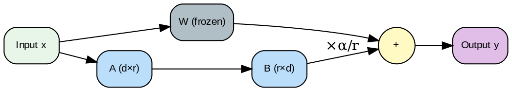

---
jupytext:
  text_representation:
    extension: .md
    format_name: myst
kernelspec:
  display_name: Python 3
  language: python
  name: python3
---

# Lectura 7: Fine-Tuning y Evaluación


```{admonition} Ejecutar en Google Colab
:class: tip

[](https://colab.research.google.com/github/salvahin/ACA-2026/blob/main/book/notebooks/07_fine_tuning_evaluacion.ipynb)
```

```{admonition} Objetivos de Aprendizaje
:class: tip
Al finalizar esta lectura podrás:
- Comparar full fine-tuning vs PEFT (LoRA, QLoRA) en términos de eficiencia y precisión
- Aplicar LoRA para actualizar solo matrices de bajo rango (~1-2% de parámetros)
- Comprender instruction tuning y su impacto en la capacidad de seguir instrucciones
- Evaluar modelos rigurosamente usando métricas apropiadas (BLEU, ROUGE, Pass@k)
- Detectar y prevenir benchmark contamination en el proceso de evaluación
```

```{admonition} 🎬 Video Recomendado
:class: tip

**[Fine-tuning LLMs (Deeplearning.ai)](https://www.youtube.com/watch?v=eC6Hd1hFvos)** - Explicación del diagrama mental entre pre-entrenamiento y fine-tuning con ejemplos prácticos.
```


## Contexto
Aprenderás técnicas de fine-tuning desde full fine-tuning hasta métodos eficientes (LoRA, QLoRA). Dominarás evaluación rigurosa y detección de benchmark contamination.

## Introducción

Un modelo pre-entrenado es un punto de partida. Para optimizarlo para tu tarea específica, necesitas **fine-tuning**. ¿Pero cómo evalúas si la mejora es real o solo memoria memorizada?

Esta lectura cubre fine-tuning (full, LoRA, QLoRA), evaluación rigurosa y métricas confiables.

---

## Parte 1: Full Fine-Tuning




***Figura 1:** Arquitectura LoRA mostrando las matrices de bajo rango A y B.*

### La Idea

```
Modelo pre-entrenado: Entrenado en 1 billón de tokens generales
Tu tarea específica: 10,000 ejemplos de instrucciones en tu dominio

Full Fine-Tuning:
  - Toma el modelo pre-entrenado
  - Continúa el entrenamiento con TUS datos
  - Actualiza TODOS los pesos (por eso "full")
```

### Proceso

```
Paso 1: Prepare datos
  ```
  [
    {"instruction": "Traduce a español", "input": "hello", "output": "hola"},
    {"instruction": "Traduce a español", "input": "good morning", "output": "buenos días"},
    ...
  ]
  ```

Paso 2: Configura entrenamiento
  ```
  modelo = AutoModelForCausalLM.from_pretrained("meta-llama/Llama-2-7b")

  optimizer = AdamW(modelo.parameters(), lr=1e-5)

  para epoch in range(3):  # 3 pasadas por los datos
    para batch in data_loader:
      logits = modelo(batch["input_ids"])
      loss = cross_entropy(logits, batch["labels"])
      loss.backward()
      optimizer.step()
      optimizer.zero_grad()
  ```

Paso 3: Evalúa
  - Genera respuestas en datos de validación
  - Compara con respuestas esperadas
  - Calcula métricas

Paso 4: Guarda modelo
  - Guardas los NUEVOS pesos (7B parámetros)
  - ~28 GB en float32, ~7 GB en INT8
```

### Costos de Full Fine-Tuning

```
Hardware requerido:
  Llama 7B: GPU A100 (80GB) mínimo
  Llama 70B: 8 x A100

Datos: 10,000 ejemplos * 1,000 tokens = 10M tokens
Tiempo: ~30 minutos en 8x A100
Costo: ~$50-100 (AWS p3 instances)

Ventaja: Máxima adaptación a tu dominio
Desventaja: Muy caro, requiere mucho dato, riesgo de overfitting
```

### Cuándo Usar Full Fine-Tuning

```
SÍ si:
  ✓ Dominio muy específico (medicina, derecho, muy diferente del general)
  ✓ Tienes 50,000+ ejemplos
  ✓ Presupuesto disponible
  ✓ Necesitas máxima precisión

NO si:
  ✗ Tienes < 10,000 ejemplos (overfitting probable)
  ✗ Presupuesto limitado
  ✗ Dominio similar al general
```

**Advertencia: Catastrophic Forgetting** - Full fine-tuning puede hacer que el modelo "olvide" capacidades generales. Mitigación: mezclar datos generales (20%) con específicos (80%), o usar LoRA.

```{admonition} 🤔 Reflexiona
:class: hint
¿Por qué crees que full fine-tuning causa catastrophic forgetting? Piensa en términos de gradientes: si solo entrenas con datos específicos, ¿qué pasa con los pesos que capturan conocimiento general?
```

---

## Parte 2: PEFT - Parameter Efficient Fine-Tuning

### El Problema de Full Fine-Tuning

```
Llama 7B: 7,000,000,000 parámetros = 28 GB en float32
Fine-tuning requiere guardar:
  - Pesos originales
  - Gradientes (28 GB)
  - Optimizer states (28 GB más)
  - Pesos actualizados
  Total: ~112 GB de memoria

Solo un 1% de A100 puede hacer esto
```

### La Solución: PEFT (LoRA)

En lugar de actualizar TODOS los pesos, actualiza solo una **matriz de rango bajo**:

```
Peso original (forma 4096 x 4096): 16M parámetros
  W

LoRA: Descompone update como producto de matrices pequeñas
  W' = W + ΔW
  ΔW = A (4096 x r) @ B (r x 4096)

donde r es rank pequeño (típicamente 4, 8, 16)

Si r = 8:
  A: 4096 x 8 = 32K parámetros
  B: 8 x 4096 = 32K parámetros
  Total: 64K parámetros (en lugar de 16M)

Ratio: 64K / 16M = 0.4% de parámetros

Con LoRA en todas las capas:
  Total parámetros trainables: ~1-2% del modelo original
  Costo de memoria: 1/50 del full fine-tuning
```

### LoRA en Práctica

```{code-cell} ipython3
:tags: [skip-execution]

from peft import get_peft_model, LoraConfig
from transformers import AutoModelForCausalLM

config = LoraConfig(
    r=8,                           # Rank bajo
    lora_alpha=32,                 # Escala de actualización
    target_modules=["q_proj", "v_proj"],  # Qué capas actualizar
    lora_dropout=0.1,
    bias="none",
    task_type="CAUSAL_LM"
)

modelo = AutoModelForCausalLM.from_pretrained("meta-llama/Llama-2-7b")
modelo = get_peft_model(modelo, config)

# Ahora entrenar como normal, pero:
# - Memoria: 10x más eficiente
# - Tiempo: 5x más rápido
# - Guardas solo: 1-2% de parámetros (300 MB en lugar de 28 GB)
```

### QLoRA: Aún Más Eficiente

```
LoRA: Modelo en float16 (13 GB) + LoRA en float16 (100 MB)
      Requiere: 13 GB memoria

QLoRA: Modelo cuantizado INT4 (1.5 GB) + LoRA en float16 (100 MB)
       Requiere: 2 GB memoria

Trade-off:
  - Pérdida de precisión por cuantización: ~1-2%
  - Mejor eficiencia: 6.5x menos memoria
  - Mismo resultado de fine-tuning
```

### Comparación

```
Método              Memoria    Tiempo    Guardas   Precisión
─────────────────────────────────────────────────────────────
Full Fine-Tuning    100 GB     1.0x      28 GB     100%
LoRA                13 GB      0.2x      300 MB    99.8%
QLoRA               2 GB       0.15x     300 MB    99%
```

:::{figure} diagrams/finetuning_comparison.png
:name: fig-finetuning
:alt: Comparación de métodos de fine-tuning en términos de eficiencia y precisión
:align: center
:width: 90%

**Figura 2:** Comparación de Métodos de Fine-Tuning - full tuning vs LoRA vs QLoRA.
:::

---

## Parte 3: Instruction Tuning

Un tipo especial de fine-tuning enfocado en seguir instrucciones:

### Dataset de Instruction Tuning

```
{
  "instruction": "Clasifica el sentimiento de este review",
  "input": "El producto es excelente, muy satisfecho",
  "output": "positivo"
}

vs

{
  "instruction": "Traduce al español",
  "input": "hello",
  "output": "hola"
}

vs

{
  "instruction": "Resuelve esta ecuación",
  "input": "2x + 3 = 7",
  "output": "x = 2"
}
```

### Ventaja de Instruction Tuning

```
Sin instruction tuning:
  Entrada: "Traduce al español: hello"
  Salida: "El hello es un saludo"  ← Modelo no entiende que traduce

Con instruction tuning:
  Entrada: "Traduce al español: hello"
  Salida: "hola"  ← Modelo entiende la instrucción
```

Hace al modelo general sobre **tipos de instrucciones**, no solo una tarea.

---

## Parte 4: Evaluación - El Desafío

### El Problema: Cómo Saber si Mejoraste

```
Pre-entrenado (GPT):
  Prompt: "¿Cuál es 2 + 2?"
  Salida: "4"

Fine-tuned en mi dominio:
  Prompt: "¿Cuál es 2 + 2?"
  Salida: "El resultado es 4"

¿Mejora? Depende...
```

### Problema 1: Benchmark Contamination

```
Entrenaste el modelo en datos que podrían incluir el benchmark
Entonces el modelo "recuerda" la respuesta, no aprendió

Ejemplo:
  Fine-tuning data accidentalmente incluye ejemplos de SQuAD (benchmark QA)
  Evalúas en SQuAD
  Resultado: 95% (pero es memorización, no comprensión)

Cómo prevenirlo:
  ✓ Verifica que fine-tuning data NO incluya benchmark
  ✓ Usa benchmarks nuevos, no publicados
  ✓ Examina ejemplos de fine-tuning manualmente
```

### Problema 2: Overfitting

```
Pequeño fine-tuning set (100 ejemplos):
  Training loss: 0.01 (muy bajo, modelo memorizó)
  Validation loss: 2.5 (muy alto, no generaliza)

Problema: Modelo funciona en training pero falla en producción
```

---

## Parte 5: Evaluación Rigurosa

### Métricas Automáticas

#### BLEU (Machine Translation)

```
Traducción esperada: "The cat is black"
Traducción generada: "The cat is black"
BLEU: 100%

Traducción esperada: "The cat is black"
Traducción generada: "The black cat"
BLEU: 50% (n-gramas parcialmente coinciden)
```

Propiedad: Simple pero no captura semántica.

#### ROUGE (Resumen)

```
Resumen de referencia: "El producto es excelente"
Resumen generado: "El producto es muy bueno"

ROUGE-L (longest common subsequence):
  LCS: "El producto es"
  ROUGE-L = 3 / 5 = 60%
```

Propiedad: Mejor para resúmenes, pero aún imperfecto.

#### METEOR, CIDEr, etc.

Variaciones de las anteriores, cada una captura algo diferente.

### LLM-as-Judge

Una alternativa moderna: **usa otro LLM para evaluar**

```
Prompt de evaluación:
  ```
  Evalúa la siguiente respuesta en una escala 1-10.

  Pregunta: ¿Cuál es la capital de Francia?
  Respuesta esperada: París
  Respuesta generada: Francia tiene muchas ciudades importantes, París siendo la capital.

  Criterios:
  - Exactitud (es correcta?)
  - Completitud (contiene toda la información?)
  - Claridad (es clara?)

  Puntuación: ?
  ```

Ventaja: Comprende semántica, es flexible
Desventaja: Sesgo hacia modelo evaluador, requiere ejecución LLM
```

### Metrics Específicas por Dominio

```
QA (Question Answering):
  - Exact Match (EM): ¿Es la respuesta exacta?
  - F1 Score: Overlap de palabras

Clasificación:
  - Accuracy: % respuestas correctas
  - F1 (macro/micro): Balance entre precisión y recall

Generación:
  - Perplexity: Confianza del modelo en respuesta
  - BLEU/ROUGE/METEOR
  - Human evaluation (gold standard)
```

---

## Parte 6: Pass@k Metrics

Métrica importante para generación de código y problemas complejos:

### Idea

```
Una pregunta puede tener múltiples respuestas correctas.
En lugar de 1 intento, generas k intentos.
Alguno es correcto?

Pass@1: Generaste 1 respuesta, fue correcta?
Pass@5: Generaste 5 respuestas, al menos 1 fue correcta?
Pass@100: Generaste 100 respuestas, al menos 1 fue correcta?
```

### Ejemplo

```
Pregunta: "Escribe una función que ordena un array"

Pass@1 = 70%   (de 100 preguntas, 70 veces el primer intento fue correcto)
Pass@5 = 85%   (de 100 preguntas, 85 veces alguno de los 5 intentos fue correcto)
Pass@100 = 92% (de 100 preguntas, 92 veces alguno de 100 intentos fue correcto)
```

### Fórmula

```
Pass@k = 1 - (N-c)! / ((N-k)! * (N-c-k+1)!)

donde:
  N = número total de intentos generados
  c = número de intentos correctos
  k = número que usamos para computar métrica

O más simplemente (si puedes generar muchos intentos):
  Pass@k ≈ 1 - (1 - Pass@1)^k
```

---

## Parte 7: Benchmark Contamination y Cómo Evitarlo

### Tipos de Contaminación

```
Tipo 1: Datos de fine-tuning incluyen benchmark
  Problema: Modelo memorizó respuestas
  Solución: Excluir benchmark de fine-tuning

Tipo 2: Pre-entrenamiento vio benchmark
  Problema: Modelo ya conocía respuestas
  Solución: Entrenar de cero (impractical) o usar benchmarks nuevos

Tipo 3: Leakage por semejanza
  Problema: Fine-tuning data es muy similar al benchmark
  Solución: Análisis cuidadoso de semejanza
```

### Cómo Detectar

```
Test 1: Analiza conjunto de fine-tuning
  ```
  for example in fine_tuning_set:
    if example in benchmark:
      print("¡CONTAMINACIÓN!")
  ```

Test 2: Verifica por hash
  ```
  hash(fine_tuning_text) == hash(benchmark_text)
  ```

Test 3: Simil coseno
  ```
  similarity(embedding(fine_tuning_text), embedding(benchmark_text))
  if similarity > 0.9:
    print("¡Posible contaminación!")
  ```
```

---

## Parte 8: Recomendaciones Prácticas

### Flujo de Fine-Tuning y Evaluación

```
1. Prepara datos
   ├─ 80% training
   ├─ 10% validation
   └─ 10% test

2. Fine-tune (LoRA si presupuesto limitado)
   ├─ Monitorea training loss
   ├─ Detén cuando validation loss empiece a subir (early stopping)
   └─ Guarda mejor checkpoint

3. Evalúa en test set
   ├─ Usa métricas automáticas
   ├─ Evalúa manualmente 100-200 ejemplos
   └─ Busca patterns de error

4. Compara vs baseline
   ├─ Modelo pre-entrenado sin fine-tuning
   ├─ Otro modelo especializado
   └─ Verifica que mejora es significativa

5. Valida en datos nuevos
   ├─ Datos que el modelo NUNCA vio
   ├─ Simula distribución de producción
   └─ Mide drop en rendimiento (es esperado)

6. Despliega con monitoreo
   ├─ Monitorea métricas en producción
   ├─ Recolecta feedback de usuarios
   └─ Reentrana si rendimiento baja
```

### Checklists Finales

```
Antes de confiar en el modelo:

Benchmark Contamination:
  ☐ Verificaste que fine-tuning ≠ benchmark?
  ☐ Validaste en datos que nunca viste?
  ☐ Usaste evaluación humana en sample?

Overfitting:
  ☐ Training loss ≠ Validation loss?
  ☐ Early stopping implementado?
  ☐ Data augmentation considerado?

Fairness y Bias:
  ☐ Rendimiento consistente en subgrupos?
  ☐ Buscaste ejemplos donde falla?
  ☐ Documentaste limitaciones?
```

---

## Reflexión y Ejercicios

### Preguntas para Reflexionar:

1. **Full vs LoRA:** ¿Cuándo la pérdida de precisión de LoRA es inaceptable?

2. **Evaluación:** ¿Qué es mejor, BLEU score de 0.8 u aprobación humana del 70%?

3. **Contaminación:** ¿Cómo sabrías si contaminaste sin intención?

### Ejercicios Prácticos:

1. **Fine-tuning Budget:**
   ```
   Tienes presupuesto de $500 para fine-tuning.
   Opciones:
   a) Full fine-tuning en 4x A100 ($200)
   b) LoRA en 1x A100 ($50)
   c) QLoRA en 1x 24GB GPU ($10)

   ¿Cuál elegirías?
   ¿Cómo usarías el presupuesto restante?
   ```

2. **Dataset Split:**
   ```
   Tienes 10,000 ejemplos etiquetados manualmente.
   ¿Cuál es mejor split?

   a) 8000 train, 1000 val, 1000 test
   b) 9000 train, 500 val, 500 test
   c) 7000 train, 2000 val, 1000 test

   ¿Por qué?
   ```

3. **Benchmark Analysis:**
   ```
   Tu modelo:
   - SQuAD (benchmark público): 90% F1
   - Preguntas internas: 65% F1

   ¿Posible contaminación? ¿Qué investigarías?
   ```

4. **Reflexión escrita (350 palabras):** "La métrica perfecta es evaluación humana, pero es cara. ¿Cuáles son las 3 métricas automáticas más importantes para tu dominio? ¿Cómo verificarías que correlacionan con calidad humana?"

---

## Puntos Clave

- **Full Fine-Tuning:** Actualiza todos los pesos; caro pero máxima adaptación
- **LoRA:** Actualiza matriz de rango bajo (~1% parámetros); 50x más eficiente
- **QLoRA:** LoRA + cuantización; cabe en GPU de consumidor
- **Instruction Tuning:** Fine-tuning en pares (instrucción, salida)
- **Benchmark Contamination:** Riesgo crítico de sobreestimar rendimiento
- **LLM-as-Judge:** Evalúa con otro LLM; más semántica que métricas
- **Pass@k:** Generas k respuestas; alguna es correcta?
- **Flujo:** Entrenar en train, valida en validation, test en datos nuevos, despliega con monitoreo

---

## Errores Comunes

```{admonition} ⚠️ Errores frecuentes
:class: warning

1. **Catastrophic Forgetting**: Al hacer full fine-tuning, el modelo olvida capacidades generales. Mitigación: mezcla datos generales (20%) con específicos (80%).
2. **Learning rate muy alto**: En fine-tuning, usa lr más bajo que en pre-entrenamiento (típicamente 1e-5 a 1e-4). LR alto destruye pesos pre-entrenados.
3. **Evaluar en datos contaminados**: Nunca evalúes en datos que el modelo vio durante entrenamiento. Usa splits estrictos: train/val/test.
4. **Ignorar LoRA alpha**: `lora_alpha` controla la escala de actualización. Típicamente `lora_alpha = 2 * r` o `4 * r`.
```

## Ejercicio Práctico: Calcular Parámetros LoRA

```{code-cell} ipython3
import numpy as np

def calcular_params_lora(hidden_dim, num_layers, rank, target_modules):
    """
    Calcula el número de parámetros trainables con LoRA.

    Args:
        hidden_dim: Dimensión oculta del modelo (e.g., 4096 para Llama-7B)
        num_layers: Número de capas transformer
        rank: Rank de LoRA (r)
        target_modules: Lista de módulos a los que aplicar LoRA (e.g., ["q_proj", "v_proj"])

    Returns:
        Total de parámetros trainables
    """
    # Cada módulo tiene una matriz de peso de hidden_dim x hidden_dim
    # LoRA descompone como A (hidden_dim x r) @ B (r x hidden_dim)
    params_per_module = (hidden_dim * rank) + (rank * hidden_dim)

    # Total = num_capas × num_módulos × params_por_módulo
    total_params = num_layers * len(target_modules) * params_per_module

    return total_params
```

Vamos a poner a prueba nuestra función utilizando la arquitectura base del **Llama 2 (7B)** como referencia para calcular la fracción exacta de parámetros que ajustaríamos:

```{code-cell} ipython3
# Ejemplo Analítico: Llama 2 7B
hidden_dim = 4096
num_layers = 32
rank = 8
target_modules = ["q_proj", "v_proj"]  # Solo atención (q y v)

params_lora = calcular_params_lora(hidden_dim, num_layers, rank, target_modules)
params_modelo_completo = 7_000_000_000  # 7B parámetros

print("Configuración LoRA:")
print(f"  Hidden dim: {hidden_dim}")
print(f"  Num layers: {num_layers}")
print(f"  Rank (r): {rank}")
print(f"  Target modules: {target_modules}")
print()
print("Resultados:")
print(f"  Parámetros LoRA: {params_lora:,}")
print(f"  Parámetros totales del modelo: {params_modelo_completo:,}")
print(f"  Ratio trainable: {params_lora / params_modelo_completo * 100:.4f}%")
print()
print(f"  Tamaño en disco (float16):")
print(f"    LoRA: {params_lora * 2 / (1024**2):.2f} MB")
print(f"    Modelo completo: {params_modelo_completo * 2 / (1024**3):.2f} GB")
```

Las matemáticas del ahorro en memoria VRAM son asombrosas. Ahora iteraremos sobre distintas configuraciones hiperparamétricas (Rank y módulos target) para observar la progresión del costo computacional de entrenar estas matrices.

```{code-cell} ipython3
# Evaluar impacto técnico de hiperparámetros
print("\nComparación Múltiple de Configuraciones LoRA:")
print(f"{'Rank':<6} {'Modules':<20} {'Params':<15} {'Ratio':<10}")
print("-" * 60)

for r in [4, 8, 16, 32]:
    for mods in [["q_proj", "v_proj"], ["q_proj", "k_proj", "v_proj", "o_proj"]]:
        p = calcular_params_lora(hidden_dim, num_layers, r, mods)
        ratio = p / params_modelo_completo * 100
        mod_str = f"{len(mods)} mods"
        print(f"{r:<6} {mod_str:<20} {p:>13,} {ratio:>9.4f}%")
```

```{admonition} ✅ Verifica tu comprensión
:class: note
1. ¿Cuándo la pérdida de precisión de LoRA (~0.2%) es inaceptable? Da un ejemplo de dominio.
2. Explica por qué benchmark contamination es un problema crítico. ¿Cómo lo detectarías?
3. ¿Qué es mejor para tu proyecto: BLEU score de 0.8 o aprobación humana del 70%? Justifica.
4. Calcula: si Pass@1 = 70%, ¿cuál sería aproximadamente Pass@5? Usa la fórmula simplificada.
```

## Resumen

```{admonition} Resumen
:class: important
**Conceptos clave:**
- Full fine-tuning actualiza todos los pesos; caro (~100 GB memoria) pero máxima adaptación
- LoRA actualiza matrices de bajo rango (~1-2% parámetros); 50x más eficiente, 99.8% precisión de full fine-tuning
- QLoRA combina LoRA + cuantización INT4; permite fine-tuning en GPUs de consumidor (2 GB memoria)
- Instruction tuning entrena modelo a seguir instrucciones; generaliza sobre tipos de tareas
- Métricas: BLEU/ROUGE (automáticas), LLM-as-Judge (semántica), Pass@k (múltiples intentos)
- Benchmark contamination: evaluar en datos que modelo vio durante entrenamiento → sobrestima rendimiento

**Para la siguiente lectura:** Prepárate para MLOps básico y visualización. Veremos cómo trackear experimentos, versionar configuraciones y crear visualizaciones efectivas para comunicar resultados.
```

---

## Referencias

- Hu, E. et al. (2021). [LoRA: Low-Rank Adaptation of Large Language Models](https://arxiv.org/abs/2106.09685). ICLR 2022.
- Dettmers, T. et al. (2023). [QLoRA: Efficient Finetuning of Quantized LLMs](https://arxiv.org/abs/2305.14314). NeurIPS 2023.
- Chen, M. et al. (2021). [Evaluating Large Language Models Trained on Code](https://arxiv.org/abs/2107.03374). arXiv (Codex/HumanEval).
- Papineni, K. et al. (2002). [BLEU: A Method for Automatic Evaluation of Machine Translation](https://aclanthology.org/P02-1040/). ACL.

---

## Lecturas Recomendadas

- **D2L: Fine-Tuning BERT** - [Capítulo 16.6](https://d2l.ai/chapter_natural-language-processing-applications/finetuning-bert.html). Guía práctica sobre cómo adaptar modelos pre-entrenados a tareas específicas.
