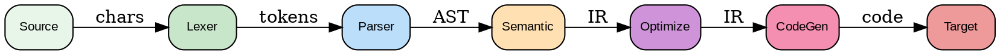

---
jupytext:
  text_representation:
    extension: .md
    format_name: myst
kernelspec:
  display_name: Python 3
  language: python
  name: python3
---

# Introducción a Compiladores

```{admonition} Ejecutar en Google Colab
:class: tip

[](https://colab.research.google.com/github/salvahin/ACA-2026/blob/main/book/notebooks/01-introduccion-compiladores.ipynb)
```

```{code-cell} ipython3
:tags: [remove-input, setup]

# Setup Colab Environment
!pip install -q numpy pandas matplotlib seaborn scikit-learn torch transformers accelerate triton xgrammar
print('Dependencies installed!')
```

```{admonition} Objetivos de Aprendizaje
:class: tip
Al finalizar esta lectura podrás:
- Identificar las 5 fases principales de un compilador y su función específica
- Distinguir entre los 4 tipos de lenguajes en la Jerarquía de Chomsky
- Reconocer qué problemas puede y no puede resolver una gramática libre de contexto (CFG)
- Explicar por qué XGrammar opera en el nivel Tipo 2 (CFG) de la jerarquía
- Relacionar cada fase del compilador con el pipeline de XGrammar
```

```{admonition} 🎬 Video Recomendado
:class: tip

**[Computerphile: How Compilers Work](https://www.youtube.com/watch?v=QXjU9qTsYCc)** - Visión general de alto nivel sobre lexers, parsers y compilación estática.
```

```{admonition} 🔧 Herramienta Interactiva
:class: seealso

**[AST Explorer](https://astexplorer.net/)** - Pega cualquier código fuente y visualiza en tiempo real el Árbol de Sintaxis Abstracta generado por distintos parsers.
```

## ¿Qué es un Compilador?

Imagina que escribes un programa en Python o C++. Tu computadora no entiende directamente el código fuente que escribiste. Necesita traducirlo a instrucciones de máquina que pueda ejecutar. Eso es exactamente lo que hace un compilador: es un **traductor automático** que convierte código en un lenguaje fuente (el que escribimos) a un lenguaje destino (generalmente código de máquina o código intermedio).

En nuestro contexto del curso, estamos diseñando un compilador especializado para gramáticas libres de contexto que generarán kernels CUDA en GPU. El compilador tomará especificaciones en lenguaje natural o semi-formal, validará su estructura, y generará código eficiente para ejecutarse en hardware paralelo.

### Analogy: La Cocina

Piensa en un compilador como una cocina profesional:
- **Receta** = código fuente
- **Chef** = compilador
- **Ingredientes procesados** = tokens del código
- **Platos finales** = código ejecutable
- **Control de calidad** = optimizaciones

El chef no solo sigue la receta al pie; valida que todos los ingredientes sean correctos, los prepara eficientemente, y verifica que el plato final sea comestible y delicioso.

```{admonition} 🤔 Reflexiona
:class: hint
¿Por qué un compilador necesita múltiples fases en lugar de procesar todo de una vez? Piensa en términos de modularidad y mantenibilidad.
```

## Las Fases de un Compilador

Un compilador típico procesa el código fuente a través de varias etapas bien definidas. Entender estas fases es fundamental para comprender cómo XGrammar funciona internamente.



***Figura 1:** Fases del pipeline de compilación tradicional.*


### 1. Análisis Léxico (Lexing)

**Objetivo**: Convertir la secuencia de caracteres en tokens significativos.

```
Entrada:  "int x = 42;"
          ^^^         ← caracteres individuales

Salida:   [INT, ID('x'), ASSIGN, NUM(42), SEMICOLON]
                        ← tokens
```

El analizador léxico lee caracteres y agrupa palabras clave, identificadores, números, operadores, etc. Por ejemplo, cuando ve `int`, reconoce que es una palabra clave reservada.

**En XGrammar**: La fase léxica está implícitamente definida en cómo especificamos los tokens en nuestra gramática. Cuando escribimos:

```
KEYWORD = "int" | "float" | "for"
```

Estamos definiendo patrones que el compilador debe reconocer en la entrada.

### 2. Análisis Sintáctico (Parsing)

**Objetivo**: Verificar que los tokens sigan la estructura definida por la gramática, construyendo un árbol de análisis sintáctico.

```
Tokens:   [INT, ID, ASSIGN, NUM, SEMICOLON]

Árbol:              declaración
                   /     |     \
                 tipo   id   asignación
                 |      |       /  \
                INT     x      =   valor
                              |
                             42
```

El analizador sintáctico verifica que la secuencia de tokens cumple con las reglas de la gramática. En nuestro caso, si la entrada viola las reglas (por ejemplo, `int = 42 x`), el parser rechaza la entrada.

**En XGrammar**: Es la fase central. Nuestro compilador debe generar un parser (típicamente un Earley parser) que acepte exactamente los strings definidos por nuestra gramática CFG.

```{admonition} 🎯 Conexión con el Proyecto
:class: important
En XGrammar, la fase de parsing es crítica porque genera las máscaras de tokens que guían la generación del LLM. El Earley parser construye un autómata de pila que determina qué tokens son válidos en cada paso, asegurando que el código generado sea sintácticamente correcto desde el inicio.
```

### 3. Análisis Semántico

**Objetivo**: Verificar que el significado del programa sea válido y coherente.

Este es el nivel donde:
- Se verifican tipos (`int x = "hello"` sería un error de tipo)
- Se resuelven referencias a variables (¿está `x` declarada antes de usarse?)
- Se analizan alcances (¿en qué contexto es válido este identificador?)

```
Problema: x + y
Pregunta: ¿Están x e y definidas antes?
```

Las CFGs **no pueden** verificar esto directamente. Por eso las lenguajes de programación reales van más allá de CFGs. Por ejemplo, no puedes expresar "las llaves deben estar balanceadas *y* cada variable debe estar declarada" solo con una CFG.

```{admonition} ⚠️ Error Común
:class: warning
Los estudiantes frecuentemente intentan expresar restricciones semánticas (como "variables declaradas antes de usar") directamente en la gramática CFG. Esto es imposible - las CFGs solo validan estructura sintáctica. Las restricciones semánticas requieren análisis posterior con tabla de símbolos.
```

### 4. Optimización

**Objetivo**: Mejorar el código intermedio sin cambiar su comportamiento observable.

Ejemplos de optimizaciones:
- **Dead Code Elimination**: Remover código inalcanzable
- **Constant Folding**: Reemplazar `3 + 4` con `7` en tiempo de compilación
- **Loop Unrolling**: Expandir loops para mejor paralelismo (importante para GPUs)
- **Register Allocation**: Decidir qué valores guardar en qué registros

En el contexto de XGrammar:
```
Regla original:
  expr = term | expr '+' term | expr '-' term

Optimizada (factorizada):
  expr = term (('+' | '-') term)*
```

Ambas aceptan el mismo lenguaje, pero la segunda es más eficiente de compilar y ejecutar.

### 5. Generación de Código

**Objetivo**: Traducir a código en el lenguaje destino (máquina, ensamblador, otra lenguaje).

```
Entrada optimizada:  x = (y + 3) * 2

Código LLVM:         %1 = add i32 %y, 3
                     %2 = mul i32 %1, 2
                     store i32 %2, i32* %x

Código CUDA:         int temp = y + 3;
                     x = temp * 2;
```

Para XGrammar, la "generación de código" significa generar un parser eficiente que acepte exactamente el lenguaje especificado.

## Resumen Visual de las Fases

```
código fuente
    ↓
[LEXING] → tokens
    ↓
[PARSING] → árbol sintáctico
    ↓
[ANÁLISIS SEMÁNTICO] → validación de significado
    ↓
[OPTIMIZACIÓN] → código intermedio optimizado
    ↓
[CODEGEN] → código destino (máquina, CUDA, etc.)
```

Cada fase produce salida que la siguiente fase consume. Aunque técnicamente pueden saltarse algunas fases dependiendo del caso de uso, este orden es el estándar.

## La Jerarquía de Chomsky

Ahora hablaremos de un concepto teórico crucial: la **Jerarquía de Chomsky**. Esta jerarquía clasifica lenguajes según su poder expresivo y las gramáticas que los generan.

### Tipo 0: Lenguajes Recursivamente Enumerables

**Características**: Sin restricciones. Las reglas pueden tener cualquier forma.

```
Producción general: α → β  (donde α y β son cualquier string)
```

**Poder**: Pueden expresar cualquier cosa computable (equivalente a máquinas de Turing).

**Ejemplo**: "El número de 1s es igual al número de 2s en un string", "Código ejecutable válido"

**Limitación**: Indecidible. No existe algoritmo que siempre termine para reconocerlos.

### Tipo 1: Lenguajes Sensibles al Contexto (Context-Sensitive)

**Características**: Las reglas deben ser no-decrecientes en longitud.

```
Producción: αAβ → αγβ  (donde γ es no-vacío y más largo que A)
```

**Poder**: Pueden expresar restricciones de alcance, tipos, y memoria limitada.

**Ejemplo**: "Las llaves están balanceadas Y cada variable está declarada"

```
a^n b^n c^n  (lenguaje context-sensitive)
```

**Máquina asociada**: Autómata lineal acotado (LBA - Linear Bounded Automaton)

### Tipo 2: Lenguajes Libres de Contexto (Context-Free)

**Características**: Las reglas tienen un solo no-terminal a la izquierda.

```
Producción: A → β
```

**Poder**: Pueden expresar la mayoría de estructuras sintácticas de lenguajes de programación.

**Ejemplo**: Expresiones aritméticas, balanceo de paréntesis, JSON

```
S → ( S ) S | ε  (paréntesis balanceados)
```

**Máquina asociada**: Autómata de pila (PDA - Pushdown Automaton)

**Nota importante para XGrammar**: Nuestras gramáticas son CFGs. Esto significa que podemos validar estructura, pero NO podemos validar semántica compleja (tipos, alcances, etc.) directamente en la gramática.

```{admonition} 🤔 Reflexiona
:class: hint
¿Qué ventaja tiene separar la validación sintáctica (CFG) de la semántica? Piensa en términos de reutilización y modularidad del compilador.
```

### Tipo 3: Lenguajes Regulares

**Características**: Las reglas son muy restrictivas. Solo un no-terminal, a la derecha, al final.

```
Producción: A → aB | a | ε
```

**Poder**: Pueden expresar patrones simples.

**Ejemplo**: Números en punto flotante, identificadores válidos, palabras clave

```
ID → [a-zA-Z_][a-zA-Z0-9_]*
```

**Máquina asociada**: Autómata finito (DFA/NFA)

### Jerarquía Ilustrada

```
Tipo 0 (Recursivamente Enumerable)
    ↑
    ├─── Más poder expresivo
Tipo 1 (Context-Sensitive)
    ↑
    ├─── Más fácil de reconocer
Tipo 2 (Context-Free) ← ¡Aquí estamos nosotros!
    ↑
    ├─── Más fácil de implementar
Tipo 3 (Regular)
    ↓
    └─── Menos poder expresivo
```

### Relaciones de Inclusión

```
Regular ⊂ Context-Free ⊂ Context-Sensitive ⊂ Recursivamente Enumerable
```

Cada clase contiene todas las clases anteriores. Un lenguaje regular también es context-free.

## Aplicación a XGrammar

En el proyecto, trabajamos con Tipo 2 (CFG). Esto significa:

✅ **Podemos expresar:**
- Estructura de JSON
- Sintaxis de kernels Triton
- Procedimiento estructurado
- Expresiones anidadas

❌ **NO podemos expresar directamente:**
- "Variables deben estar declaradas antes de usarse"
- "Tipos deben coincidir en asignaciones"
- "Indentación válida" (requiere Tipo 1)

**Solución**: Combinamos gramática CFG con **análisis semántico post-parsing** para validar restricciones que van más allá de lo que la CFG puede expresar.

## Reflexión

La teoría de Chomsky no es solo matemática abstracta. Es el fundamento de cómo entendemos lo que es expresable en un lenguaje. Cuando diseñamos nuestra gramática DSL para XGrammar, estamos eligiendo deliberadamente vivir en el nivel Type 2 (CFG) porque:

1. Es lo suficientemente poderoso para expresar sintaxis
2. Es lo suficientemente simple para compilar eficientemente
3. Podemos agregar análisis semántico después para restricciones más complejas

```{admonition} Resumen
:class: important
**Conceptos clave:**
- Un compilador traduce código fuente a código ejecutable a través de 5 fases: lexing, parsing, análisis semántico, optimización y generación de código
- La Jerarquía de Chomsky clasifica lenguajes por poder expresivo: Tipo 3 (Regular) ⊂ Tipo 2 (CFG) ⊂ Tipo 1 (CSG) ⊂ Tipo 0 (RE)
- XGrammar opera en Tipo 2 (CFG), permitiendo validar sintaxis eficientemente mientras deja la semántica para análisis posterior
- Las CFGs pueden expresar estructura pero no restricciones contextuales como tipos o scope

**Para la siguiente lectura:**
Exploraremos los lenguajes regulares y autómatas finitos deterministas (DFAs), la base del análisis léxico que es la primera fase del compilador.
```

```{admonition} ✅ Verifica tu comprensión
:class: note
1. ¿Cuáles son las 5 fases principales de un compilador y qué hace cada una?
2. ¿En qué nivel de la Jerarquía de Chomsky opera XGrammar y por qué?
3. Da un ejemplo de una restricción que una CFG **puede** expresar y otra que **no puede** expresar
4. ¿Por qué la fase de parsing es crítica para XGrammar en generación con LLMs?
```

## Ejemplos en Código: Simulando las Fases del Compilador

Veamos cómo implementar un pequeño compilador que procesa expresiones aritméticas simples:

```{code-cell} ipython3
# Fase 1: Análisis Léxico (Tokenización)
import re
from dataclasses import dataclass
from typing import List, Optional

@dataclass
class Token:
    """Representa un token del código fuente"""
    type: str
    value: str
    position: int

    def __repr__(self):
        return f"{self.type}({self.value})"

class Lexer:
    """Analizador léxico simple"""

    # Patrones de tokens (orden importa!)
    TOKEN_PATTERNS = [
        ('NUMBER', r'\d+(\.\d+)?'),
        ('PLUS', r'\+'),
        ('MINUS', r'-'),
        ('TIMES', r'\*'),
        ('DIVIDE', r'/'),
        ('LPAREN', r'\('),
        ('RPAREN', r'\)'),
        ('WHITESPACE', r'\s+'),
    ]

    def __init__(self, code: str):
        self.code = code
        self.position = 0

    def tokenize(self) -> List[Token]:
        """Convierte código fuente en lista de tokens"""
        tokens = []

        while self.position < len(self.code):
            matched = False

            for token_type, pattern in self.TOKEN_PATTERNS:
                regex = re.compile(pattern)
                match = regex.match(self.code, self.position)

                if match:
                    value = match.group(0)
                    if token_type != 'WHITESPACE':  # Ignorar espacios
                        tokens.append(Token(token_type, value, self.position))
                    self.position = match.end()
                    matched = True
                    break

            if not matched:
                raise SyntaxError(f"Carácter inválido en posición {self.position}: '{self.code[self.position]}'")

        return tokens

# Probar el lexer
code = "42 + 3.14 * (2 - 1)"
lexer = Lexer(code)
tokens = lexer.tokenize()

print("Entrada:", code)
print("Tokens:", tokens)
```

```{code-cell} ipython3
# Fase 2: Análisis Sintáctico (Parsing)
# Parser recursivo descendente que respeta precedencia de operadores

@dataclass
class ASTNode:
    """Nodo del Árbol de Sintaxis Abstracta"""
    pass

@dataclass
class Number(ASTNode):
    value: float

@dataclass
class BinaryOp(ASTNode):
    operator: str
    left: ASTNode
    right: ASTNode

    def __repr__(self):
        return f"({self.operator} {self.left} {self.right})"

class Parser:
    """Parser recursivo descendente con precedencia de operadores"""

    def __init__(self, tokens: List[Token]):
        self.tokens = tokens
        self.position = 0

    def current_token(self) -> Optional[Token]:
        if self.position < len(self.tokens):
            return self.tokens[self.position]
        return None

    def consume(self, expected_type: str) -> Token:
        """Consume un token del tipo esperado"""
        token = self.current_token()
        if not token or token.type != expected_type:
            raise SyntaxError(f"Se esperaba {expected_type}, se encontró {token}")
        self.position += 1
        return token

    def parse(self) -> ASTNode:
        """Punto de entrada del parser"""
        return self.parse_expression()

    def parse_expression(self) -> ASTNode:
        """Expresión: suma/resta (menor precedencia)"""
        left = self.parse_term()

        while self.current_token() and self.current_token().type in ['PLUS', 'MINUS']:
            op_token = self.current_token()
            self.position += 1
            right = self.parse_term()
            left = BinaryOp(op_token.value, left, right)

        return left

    def parse_term(self) -> ASTNode:
        """Término: multiplicación/división (mayor precedencia)"""
        left = self.parse_factor()

        while self.current_token() and self.current_token().type in ['TIMES', 'DIVIDE']:
            op_token = self.current_token()
            self.position += 1
            right = self.parse_factor()
            left = BinaryOp(op_token.value, left, right)

        return left

    def parse_factor(self) -> ASTNode:
        """Factor: número o expresión entre paréntesis"""
        token = self.current_token()

        if token.type == 'NUMBER':
            self.position += 1
            return Number(float(token.value))
        elif token.type == 'LPAREN':
            self.consume('LPAREN')
            expr = self.parse_expression()
            self.consume('RPAREN')
            return expr
        else:
            raise SyntaxError(f"Token inesperado: {token}")

# Probar el parser
parser = Parser(tokens)
ast = parser.parse()

print("\nÁrbol de Sintaxis Abstracta (AST):")
print(ast)
```

```{code-cell} ipython3
# Fase 3: Evaluación (simulando generación de código)
# En un compilador real, esto generaría código de máquina

class Evaluator:
    """Evalúa el AST para producir un resultado"""

    def evaluate(self, node: ASTNode) -> float:
        if isinstance(node, Number):
            return node.value
        elif isinstance(node, BinaryOp):
            left_val = self.evaluate(node.left)
            right_val = self.evaluate(node.right)

            if node.operator == '+':
                return left_val + right_val
            elif node.operator == '-':
                return left_val - right_val
            elif node.operator == '*':
                return left_val * right_val
            elif node.operator == '/':
                return left_val / right_val
            else:
                raise ValueError(f"Operador desconocido: {node.operator}")
        else:
            raise TypeError(f"Tipo de nodo desconocido: {type(node)}")

# Evaluar el AST
evaluator = Evaluator()
result = evaluator.evaluate(ast)

print(f"\nResultado de '{code}' = {result}")
print(f"Verificación: {eval(code)} (usando eval de Python)")
```

```{code-cell} ipython3
# Visualización del proceso completo
def compile_and_run(source_code: str):
    """Pipeline completo de compilación"""
    print(f"{'='*60}")
    print(f"CÓDIGO FUENTE: {source_code}")
    print(f"{'='*60}\n")

    # Fase 1: Lexing
    print("FASE 1: ANÁLISIS LÉXICO")
    lexer = Lexer(source_code)
    tokens = lexer.tokenize()
    print(f"Tokens: {tokens}\n")

    # Fase 2: Parsing
    print("FASE 2: ANÁLISIS SINTÁCTICO")
    parser = Parser(tokens)
    ast = parser.parse()
    print(f"AST: {ast}\n")

    # Fase 3: Evaluación
    print("FASE 3: EJECUCIÓN")
    evaluator = Evaluator()
    result = evaluator.evaluate(ast)
    print(f"Resultado: {result}\n")

    return result

# Probar varios ejemplos
ejemplos = [
    "5 + 3",
    "10 - 2 * 3",
    "(10 - 2) * 3",
    "100 / (5 + 5)",
]

for ejemplo in ejemplos:
    compile_and_run(ejemplo)
```

## Jerarquía de Chomsky: Ejemplos Prácticos

```{code-cell} ipython3
# Tipo 3: Lenguaje Regular (DFA)
# Ejemplo: Reconocer identificadores válidos [a-zA-Z_][a-zA-Z0-9_]*

class IdentifierDFA:
    """DFA para reconocer identificadores válidos"""

    def __init__(self):
        self.state = 'start'

    def is_valid_identifier(self, text: str) -> bool:
        """Verifica si un string es un identificador válido"""
        self.state = 'start'

        for char in text:
            if self.state == 'start':
                if char.isalpha() or char == '_':
                    self.state = 'valid'
                else:
                    return False
            elif self.state == 'valid':
                if char.isalnum() or char == '_':
                    self.state = 'valid'
                else:
                    return False

        return self.state == 'valid'

# Probar el DFA
dfa = IdentifierDFA()
test_cases = ['x', 'var_1', '123abc', '_private', 'myVariable2', '2nd_var']

print("TIPO 3: Lenguaje Regular (Identificadores)")
print("="*60)
for test in test_cases:
    result = dfa.is_valid_identifier(test)
    print(f"'{test}' -> {'✓ válido' if result else '✗ inválido'}")
```

```{code-cell} ipython3
# Tipo 2: Lenguaje Libre de Contexto (CFG)
# Ejemplo: Paréntesis balanceados

class BalancedParentheses:
    """Reconoce paréntesis balanceados usando una pila (PDA)"""

    def is_balanced(self, text: str) -> bool:
        """Verifica si los paréntesis están balanceados"""
        stack = []
        matching = {'(': ')', '[': ']', '{': '}'}

        for char in text:
            if char in matching:  # Opening bracket
                stack.append(char)
            elif char in matching.values():  # Closing bracket
                if not stack:
                    return False
                opening = stack.pop()
                if matching[opening] != char:
                    return False

        return len(stack) == 0

# Probar el reconocedor
checker = BalancedParentheses()
test_cases = ['()', '((()))', '(()())', '(()', '())(', '{[()]}', '({)}']

print("\nTIPO 2: Lenguaje Libre de Contexto (Paréntesis Balanceados)")
print("="*60)
for test in test_cases:
    result = checker.is_balanced(test)
    print(f"'{test}' -> {'✓ balanceado' if result else '✗ no balanceado'}")
```

```{code-cell} ipython3
# Tipo 1: Lenguaje Sensible al Contexto
# Ejemplo: a^n b^n c^n (mismo número de a's, b's y c's)

class ContextSensitiveLanguage:
    """Reconoce strings de la forma a^n b^n c^n"""

    def is_anbncn(self, text: str) -> bool:
        """Verifica si el string es de la forma a^n b^n c^n"""
        # Contar cada carácter
        count_a = text.count('a')
        count_b = text.count('b')
        count_c = text.count('c')

        # Verificar que solo contenga a, b, c
        if len(text) != count_a + count_b + count_c:
            return False

        # Verificar orden: todas las a's primero, luego b's, luego c's
        if text != 'a' * count_a + 'b' * count_b + 'c' * count_c:
            return False

        # Verificar que sean iguales
        return count_a == count_b == count_c and count_a > 0

# Probar el reconocedor
csl = ContextSensitiveLanguage()
test_cases = ['abc', 'aabbcc', 'aaabbbccc', 'aabbc', 'abbc', 'aabbcccc', 'abcabc']

print("\nTIPO 1: Lenguaje Sensible al Contexto (a^n b^n c^n)")
print("="*60)
for test in test_cases:
    result = csl.is_anbncn(test)
    print(f"'{test}' -> {'✓ válido' if result else '✗ inválido'}")
```

```{code-cell} ipython3
# Comparación de poder expresivo
import matplotlib.pyplot as plt

# Crear visualización de la jerarquía
fig, ax = plt.subplots(figsize=(10, 8))

# Definir las capas
layers = [
    ("Tipo 3\nRegulares", 0.2, "lightblue"),
    ("Tipo 2\nLibres de Contexto", 0.4, "lightgreen"),
    ("Tipo 1\nSensibles al Contexto", 0.6, "lightyellow"),
    ("Tipo 0\nRecurs. Enumerables", 0.8, "lightcoral")
]

y_positions = [0.2, 0.4, 0.6, 0.8]
widths = [0.3, 0.5, 0.7, 0.9]

for i, ((name, y, color), width) in enumerate(zip(layers, widths)):
    # Dibujar rectángulo
    rect = plt.Rectangle((0.5 - width/2, y - 0.08), width, 0.16,
                         facecolor=color, edgecolor='black', linewidth=2)
    ax.add_patch(rect)
    ax.text(0.5, y, name, ha='center', va='center', fontsize=12, fontweight='bold')

# Añadir ejemplos
examples = [
    (0.2, "Identificadores, números\nDFA/NFA"),
    (0.4, "JSON, expresiones aritméticas\nParser con pila"),
    (0.6, "Variables declaradas antes de usar\nAutómata lineal acotado"),
    (0.8, "Cualquier programa computable\nMáquina de Turing")
]

for y, text in examples:
    ax.text(1.1, y, text, ha='left', va='center', fontsize=9, style='italic')

# Añadir flechas de inclusión
for i in range(len(y_positions) - 1):
    ax.annotate('', xy=(0.5, y_positions[i+1] - 0.08),
                xytext=(0.5, y_positions[i] + 0.08),
                arrowprops=dict(arrowstyle='->', lw=2, color='red'))

ax.set_xlim(0, 1.5)
ax.set_ylim(0, 1)
ax.axis('off')
ax.set_title('Jerarquía de Chomsky: Poder Expresivo Creciente',
             fontsize=14, fontweight='bold', pad=20)

plt.tight_layout()
plt.show()

print("XGrammar opera en Tipo 2 (CFG) porque:")
print("  ✓ Es suficientemente poderoso para expresar sintaxis")
print("  ✓ Es eficientemente parseable (O(n) o O(n³))")
print("  ✓ Permite análisis semántico adicional post-parsing")
```

## Ejercicios

1. **Identificación de Fases**: Dado el código `x = 10 + 5 * 2;`, describe qué sucede en cada fase del compilador.

2. **Jerarquía de Chomsky**: Clasifica los siguientes lenguajes en la jerarquía de Chomsky:
   - Números binarios válidos: `0`, `1`, `01`, `101`
   - Paréntesis balanceados: `()`, `(())`, `()()`
   - `a^n b^n c^n` (n de cada letra)
   - El código de un programa Python completo

3. **Limitaciones de CFG**: ¿Por qué no podemos expresar con una sola CFG que "cada variable debe estar declarada antes de usarse"? ¿Qué tipo de Chomsky necesitaríamos?

4. **Diseño de Gramática**: Propón una gramática CFG simple para números en punto flotante. ¿Qué patrones acepta?

## Preguntas de Reflexión

- ¿Cuál es la diferencia entre "poder expresivo" y "facilidad de implementación"? ¿Por qué XGrammar elige CFG en lugar de Tipo 1?
- Si pudiéramos usar gramáticas Tipo 1, ¿qué problemas en verificación de GPU kernels podrían resolverse?
- ¿Cómo crees que una IA completa (Tipo 0) podría generar kernels CUDA mejores que un compilador basado en CFG?

---

## Referencias

- Aho, A., Lam, M., Sethi, R., & Ullman, J. (2006). [Compilers: Principles, Techniques, and Tools](https://suif.stanford.edu/dragonbook/) (2nd ed.). Pearson. ("Dragon Book")
- Chomsky, N. (1956). [Three Models for the Description of Language](https://www.jstor.org/stable/1705753). IRE Transactions on Information Theory.
- Hopcroft, J. & Ullman, J. (1979). Introduction to Automata Theory, Languages, and Computation. Addison-Wesley.
