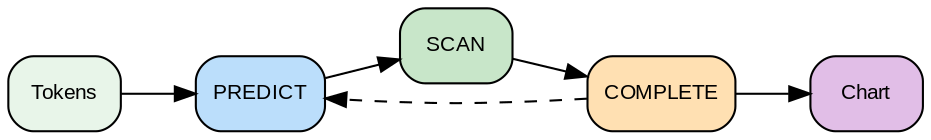

---
jupytext:
  text_representation:
    extension: .md
    format_name: myst
kernelspec:
  display_name: Python 3
  language: python
  name: python3
---

# BNF, EBNF y Estrategias de Parsing

```{admonition} Objetivos de Aprendizaje
:class: tip
Al finalizar esta lectura podrás:
- Convertir gramáticas entre notación BNF y EBNF
- Utilizar cuantificadores EBNF (*, +, ?, []) para simplificar gramáticas
- Distinguir entre estrategias de parsing top-down (LL) y bottom-up (LR)
- Explicar las ventajas del algoritmo Earley para parsing general de CFGs
- Identificar cuándo usar LL, LR o Earley según las características de la gramática
```

## Del Formalismo a la Práctica

Hasta ahora hemos escrito gramáticas en notación teórica:

```
E → E + T | T
T → T * F | F
```

Esto funciona para matemáticas, pero en la práctica los compiladores usan **notaciones más prácticas**: **BNF** y **EBNF**. Además, necesitamos decidir **cómo parser** la entrada: ¿top-down o bottom-up?

## BNF: Backus-Naur Form

**BNF** es la notación estándar para especificar sintaxis de lenguajes de programación. Es casi idéntica a la notación teórica, pero con convenciones de legibilidad.

### Sintaxis BNF

```
Notación teórica: A → B C | D
Notación BNF:    <A> ::= <B> <C> | <D>

Elementos:
- <no-terminal>: entre ángulos
- "terminal": entre comillas (caracteres literales)
- |: alternancia (O)
- ::=: "se define como"
```

### Ejemplo: Expresión Simple en BNF

```bnf
<expression> ::= <term> | <expression> "+" <term>
<term>       ::= <factor> | <term> "*" <factor>
<factor>     ::= "(" <expression> ")" | <number>
<number>     ::= <digit> | <number> <digit>
<digit>      ::= "0" | "1" | ... | "9"
```

Comparado con notación teórica:

```
E → T | E + T
T → F | T * F
F → (E) | N
N → D | ND
D → 0|1|...|9
```

**BNF es lo mismo, solo más legible.**

## EBNF: Extended BNF

**EBNF** añade **cuantificadores** para hacer las gramáticas más compactas:

### Operadores EBNF

```
{X}      → repetición cero o más veces (kleene star)
[X]      → optional (cero o una vez)
X+       → una o más veces
X?       → cero o una vez (alternativa a [X])
(X|Y)    → agrupamiento

Equivalencias con BNF:
{X} ≡ X* (en algunos sistemas)
[X] ≡ X?
X+ ≡ X {X}
```

### Reescritura con EBNF

La gramática anterior en EBNF es **mucho más simple**:

```ebnf
expression ::= term ("+" term)*
term       ::= factor ("*" factor)*
factor     ::= "(" expression ")" | number
number     ::= digit+
digit      ::= "0".."9"
```

¿Ves la diferencia? Los cuantificadores eliminan la necesidad de recursión izquierdista.

### Comparación Visual

```
BNF (recursión explícita):
expr → expr "+" term | term

EBNF (cuantificador implícito):
expr → term ("+" term)*

Ambos aceptan: 1+2+3+4
Pero EBNF es más legible.
```

## Clases de Caracteres (Alternativa a Enumeración)

EBNF también permite especificar conjuntos de caracteres compactamente:

```ebnf
digit     ::= "0".."9"           (rango)
letter    ::= "a".."z" | "A".."Z"
alphanumeric ::= letter | digit
hexdigit  ::= "0".."9" | "a".."f"

identifier ::= letter (letter | digit | "_")*
```

Internamente, esto es **idéntico a las regex** que vimos en la lectura de DFAs.

## Ejemplo: JSON en EBNF

```ebnf
json       ::= value
value      ::= object | array | string | number | "true" | "false" | "null"
object     ::= "{" [pair ("," pair)*] "}"
array      ::= "[" [value ("," value)*] "]"
pair       ::= string ":" value
string     ::= '"' char* '"'
number     ::= ["-"] int ["." digit+]
int        ::= "0" | ("1".."9" digit*)
char       ::= /* cualquier carácter excepto comillas */
digit      ::= "0".."9"
```

Compara esto con si lo escribiéramos en BNF puro - sería mucho más largo con recursión anidada.

## Introducción a Estrategias de Parsing

Ahora que sabemos cómo **escribir** gramáticas, necesitamos saber cómo **reconocerlas**.

Hay dos enfoques principales:

### Estrategia 1: Top-Down (Descendente)

**Idea**: Empezar desde el símbolo inicial, derivar hacia los terminales.

```
Símbolo inicial: expression
Predicción: ¿Cuál regla aplico?
Basado en: lo que veo en la entrada (lookahead)

Proceso:
1. Tengo "expression" y debo derivar
2. Leo el primer token: es un número
3. Como es un número, debo aplicar: expression → term (→ factor (→ number))
4. Consumo el número
5. Veo "+", así que aplico: expression → term "+" expression
6. Continúo recursivamente
```

**Top-Down ≈ Predictivo ≈ Descendente Recursivo**

### Estrategia 2: Bottom-Up (Ascendente)

**Idea**: Empezar desde los terminales, reducir hacia el símbolo inicial.

```
Entrada: número "+" número
Reducción:
1. número → factor (reduce)
2. factor → term (reduce)
3. term → expression (reduce)
4. Veo "+", necesito otro expression
5. número → factor → term → expression
6. Tengo expression "+" expression
7. Reduce a expression

Proceso: SHIFT tokens, REDUCE cuando coincide con regla derecha
```

**Bottom-Up ≈ Shift-Reduce ≈ Ascendente**

### Visualización Comparativa

```
TOP-DOWN                      BOTTOM-UP
─────────────────────────────────────────

Árbol crecimiento:            Árbol crecimiento:
        expr                      número
         |                           |
        term                       factor
         |                           |
       número                      term
                                    |
                                  expr
                                    |
                                   (root)

Lee de arriba            Lee de abajo hacia arriba
hacia abajo

Predicción:              Reconocimiento:
¿Qué regla usar?        ¿Qué regla coincide?

Fácil de implementar     Más poderoso (LALR, LR)
(recursión manual)       (tablas de transición)

Limitado en             Maneja más gramatic
gramáticas que acepta   as (menos restricciones)
```

:::{figure} diagrams/ll_vs_lr_parsing.png
:name: fig-ll-vs-lr-parsing
:alt: Comparación visual de estrategias LL y LR
:align: center
:width: 90%

**Figura 1:** Comparación de estrategias de parsing: LL (top-down, predictivo) vs LR (bottom-up, shift-reduce). Muestra las diferencias en el orden de procesamiento y construcción del árbol de análisis.
:::

## LL vs LR Parsing

Estas clasificaciones describen **qué gramáticas puede manejar** cada estrategia.

### LL(1): Left-to-right, Leftmost derivation, 1 token lookahead

- **Top-down**
- Mira 1 token adelante para decidir qué regla aplicar
- Implementable como **parsers recursivos descendentes** (código a mano)

```
Ventaja: Fácil de escribir
Desventaja: No maneja recursión izquierdista
             if (expr "+" expr) → infinito

Solución: Transformar a recursión derechista o usar cuantificadores EBNF
```

### LR(1): Left-to-right, Rightmost derivation, 1 token lookahead

- **Bottom-up**
- Usa una **pila** y una **tabla de transición**
- Implementable con generadores como **YACC, Bison**

```
Ventaja: Maneja recursión izquierdista, más gramaticas
Desventaja: Más complejo, requiere generador

Ejemplo LR válido:
  expr → expr "+" term | term   ← ¡Recursión izquierdista!

Este no es LL(1), pero sí es LR(1).
```

## Earley Parsing: El Algoritmo "Mágico"

XGrammar usa **Earley parsing**, que es interesante porque:
- Maneja **cualquier CFG** (no solo LL o LR)
- Es **top-down** pero tan generoso que acepta gramáticas más generales
- Complejidad: O(n³) en general, O(n) para gramáticas LL/LR



***Figura 1:** Proceso del algoritmo Earley Parser.*


El algoritmo es elegante pero un poco complejo. Lo veremos en detalle en la próxima lectura.

```{admonition} 🤔 Reflexiona
:class: hint
¿Por qué EBNF usa cuantificadores (* + ?) en lugar de solo recursión? Piensa en legibilidad y en cómo se traduce directamente a bucles en el código del parser.
```

## Ejemplo: Parsear "2 + 3" con Diferentes Estrategias

### LL(1) Top-Down

```
Entrada: [2, +, 3]
Stack: [expression]

Paso 1: Ver 2 (número)
  Predigo: expression → term
  Stack: [term]

Paso 2: Ver 2 (número)
  Predigo: term → factor
  Stack: [factor]

Paso 3: Ver 2 (número)
  Predigo: factor → number
  Stack: [number]

Paso 4: Consumo 2
  Stack: []

Paso 5: Veo +, necesito que expression → term "+" expression
  Predigo (retroceso en derivación): expression → term "+" expression
  Termino term, ahora espero "+"
  Stack: ["+", expression]

Paso 6: Veo +, lo consumo
  Stack: [expression]

Paso 7: Veo 3, predigo expression → term → factor → number
  Consumo 3

Resultado: ✓ Aceptado, árbol construido
```

### LR(1) Bottom-Up

```
Entrada: [2, +, 3]
Stack: []
Acciones: [shift 2, reduce, shift +, shift 3, reduce*]

1. SHIFT 2 → Stack: [2]
2. REDUCE (2 → number) → Stack: [number]
3. REDUCE (number → factor) → Stack: [factor]
4. REDUCE (factor → term) → Stack: [term]
5. SHIFT + → Stack: [term, +]
6. SHIFT 3 → Stack: [term, +, 3]
7. REDUCE (3 → number) → Stack: [term, +, number]
8. REDUCE (number → factor) → Stack: [term, +, factor]
9. REDUCE (factor → term) → Stack: [term, +, term]
10. REDUCE (term "+" term → expression) → Stack: [expression]

Resultado: ✓ Aceptado
```

## Ventajas de EBNF para Compiladores

```
Razón 1: Menos reglas
  BNF:   expr → term | expr "+" term
         term → factor | term "*" factor
  EBNF:  expr → term ("+" term)*
         term → factor ("*" factor)*

Razón 2: Más claro conceptualmente
  {X}* claramente significa "cero o más"
  No necesitas entender recursión derechista

Razón 3: Fácil de mapear a código
  Cuantificadores → while loops
  | → if/else
  () → función auxiliar
```

## Ejemplo XGrammar: Tokenización Kernel CUDA

```ebnf
kernel     ::= "def" identifier "(" parameters? ")" ":" block
parameters ::= parameter ("," parameter)*
parameter  ::= identifier ":" type_spec
type_spec  ::= "i32" | "f32" | "tensor"
block      ::= statement+
statement  ::= assignment | loop | kernel_call
assignment ::= identifier "=" expression ";"
loop       ::= "for" identifier "in" "range" "(" expr "," expr ")" ":" block
kernel_call ::= identifier "(" arguments? ")"
arguments  ::= expression ("," expression)*
expression ::= term ("+" term | "-" term)*
term       ::= factor ("*" factor | "/" factor)*
factor     ::= "(" expression ")" | identifier | literal
identifier ::= letter (letter | digit | "_")*
literal    ::= number | string
number     ::= digit+
letter     ::= "a".."z" | "A".."Z" | "_"
digit      ::= "0".."9"
```

Esta gramática EBNF sería **mucho más larga** en BNF puro.

## De EBNF a Código

Un **parser generator** como ANTLR toma EBNF y genera código que:

```python
# De esta regla EBNF:
expression ::= term ("+" term)*

# Genera esta función Python:
def parseExpression(tokens):
    term = parseTerm(tokens)
    while currentToken() == "+":
        consume("+")
        term = Binary("+", term, parseTerm(tokens))
    return term
```

**Automatización**: No escribes el parser a mano, el generador lo crea.

```{admonition} Resumen
:class: important
**Conceptos clave:**
- BNF es la notación estándar para gramáticas; EBNF añade cuantificadores para mayor compacidad
- Los cuantificadores {X}, [X], X+, X? eliminan la necesidad de recursión explícita en muchos casos
- Parsing top-down (LL) predice qué regla aplicar; bottom-up (LR) reduce cuando reconoce patrones
- Earley parsing acepta cualquier CFG con complejidad O(n³) general, O(n) para LL/LR

**Para la siguiente lectura:**
Exploraremos el pipeline completo de XGrammar: cómo compila gramáticas a parsers eficientes mediante normalización, construcción de autómatas y optimizaciones.
```

```{admonition} ✅ Verifica tu comprensión
:class: note
1. Convierte `A → A B | ε` a EBNF
2. ¿Cuál es la diferencia clave entre LL(1) y LR(1)?
3. ¿Por qué Earley puede parsear cualquier CFG mientras LL/LR no?
4. ¿Qué significa que un parser tenga lookahead k=1?
```

## Ejercicios

1. **Conversión BNF → EBNF**: Reescribe en EBNF:
   ```
   statement ::= variable "=" expression
   statement ::= statement ";" statement
   ```

2. **Cuantificadores**: ¿Qué lenguaje acepta cada una?
   ```
   a) "a" "b"*
   b) ("a" | "b")+
   c) ["-"] digit+
   ```

3. **LL vs LR**: ¿Cuál estrategia se usaría para?
   ```
   expr → expr "+" expr | number
   expr → expr "-" expr | expr "+" expr | number
   ```

4. **EBNF Completa**: Escribe EBNF para una lista JSON simple `[1, 2, 3]`

5. **Predicción**: Para la expresión `2 + 3`, ¿qué token debe verparse primero para decidir qué regla aplicar en un parser LL(1)?

## Preguntas de Reflexión

- ¿Por qué EBNF usa cuantificadores en lugar de solo BNF recursivo?
- ¿Cuál es el trade-off entre "gramáticas simples (LL)" y "poder expresivo (LR)"?
- En XGrammar, ¿por qué elegimos Earley (que maneja cualquier CFG) en lugar de generar LL o LR?
- ¿Cómo el lookahead (LL(1) vs LR(1)) afecta la complejidad del parser?

## Conexión con Constrained Decoding en LLMs

```{admonition} 🔗 Aplicación en el proyecto
:class: tip

EBNF es la notación que usamos para especificar gramáticas en XGrammar:
- Los cuantificadores `*`, `+`, `?` se traducen directamente a restricciones de generación
- Cuando especificamos `statement+` (uno o más statements), el parser de XGrammar garantiza que el LLM genere al menos un statement antes de permitir terminación
- EBNF compacto → parser eficiente → constrained decoding rápido
- En el proyecto, escribirás gramáticas EBNF para lenguajes de programación que el LLM debe generar con corrección sintáctica garantizada
```

## Ejercicio Práctico: Conversión BNF a EBNF

Aprende a simplificar gramáticas convirtiendo BNF recursivo a EBNF con cuantificadores.

```{code-cell} ipython3
# Comparación BNF vs EBNF

def show_conversion(name, bnf_rules, ebnf_rule):
    """Muestra la conversión de BNF a EBNF con explicación."""
    print(f"\n{'='*60}")
    print(f"Conversión: {name}")
    print('='*60)
    print("\nBNF (con recursión):")
    for rule in bnf_rules:
        print(f"  {rule}")
    print(f"\nEBNF (con cuantificadores):")
    print(f"  {ebnf_rule}")
    print()

# Ejemplo 1: Lista de elementos separados por comas
show_conversion(
    "Lista de parámetros",
    [
        "params ::= param | params ',' param",
        "param  ::= identifier"
    ],
    "params ::= param (',' param)*"
)

# Ejemplo 2: Secuencia de statements
show_conversion(
    "Bloque de código",
    [
        "block ::= statement | block statement",
        "statement ::= assignment | loop"
    ],
    "block ::= statement+"
)

# Ejemplo 3: Expresión con operadores binarios
show_conversion(
    "Expresión aritmética",
    [
        "expr ::= term | expr '+' term | expr '-' term",
        "term ::= factor | term '*' factor | term '/' factor",
        "factor ::= number | '(' expr ')'"
    ],
    """expr   ::= term (('+' | '-') term)*
term   ::= factor (('*' | '/') factor)*
factor ::= number | '(' expr ')'"""
)

# Ejemplo 4: Elemento opcional
show_conversion(
    "Declaración de función con retorno opcional",
    [
        "function ::= 'def' id '(' params ')' return_type ':' body",
        "return_type ::= '->' type | ε"
    ],
    "function ::= 'def' id '(' params ')' ['->' type] ':' body"
)

# Ejercicio práctico: Convertir una gramática dada
print(f"\n{'='*60}")
print("EJERCICIO: Convierte esta gramática BNF a EBNF")
print('='*60)

bnf_grammar = """
BNF Original:
  list ::= '[' elements ']' | '[' ']'
  elements ::= value | elements ',' value
  value ::= number | string
"""

ebnf_solution = """
EBNF Simplificado:
  list ::= '[' [value (',' value)*] ']'
  value ::= number | string

Observa:
  - La lista vacía [] se maneja con el opcional [...]
  - La repetición elements se convierte en value (',' value)*
  - Menos reglas, más legible
"""

print(bnf_grammar)
print("\n" + "-"*60)
print(ebnf_solution)

# Tabla de equivalencias
print(f"\n{'='*60}")
print("Tabla de Equivalencias BNF ↔ EBNF")
print('='*60)

equivalences = [
    ("A ::= B | A B", "A ::= B+", "Uno o más B"),
    ("A ::= ε | A B", "A ::= B*", "Cero o más B"),
    ("A ::= B | ε", "A ::= [B] o A ::= B?", "B opcional"),
    ("A ::= B C | B D", "A ::= B (C | D)", "Factorización"),
]

print(f"{'BNF':<20} {'EBNF':<20} {'Significado':<20}")
print("-"*60)
for bnf, ebnf, meaning in equivalences:
    print(f"{bnf:<20} {ebnf:<20} {meaning:<20}")
```

---

## Referencias

- Backus, J. (1959). [The Syntax and Semantics of the Proposed International Algebraic Language](https://www.softwarepreservation.org/projects/ALGOL/paper/Backus-Syntax_and_Semantics_of_Proposed_IAL.pdf). IFIP Congress.
- Earley, J. (1970). [An Efficient Context-Free Parsing Algorithm](https://doi.org/10.1145/362007.362035). Communications of the ACM.
- Knuth, D. (1965). [On the Translation of Languages from Left to Right](https://doi.org/10.1016/S0019-9958(65)90426-2). Information and Control.
