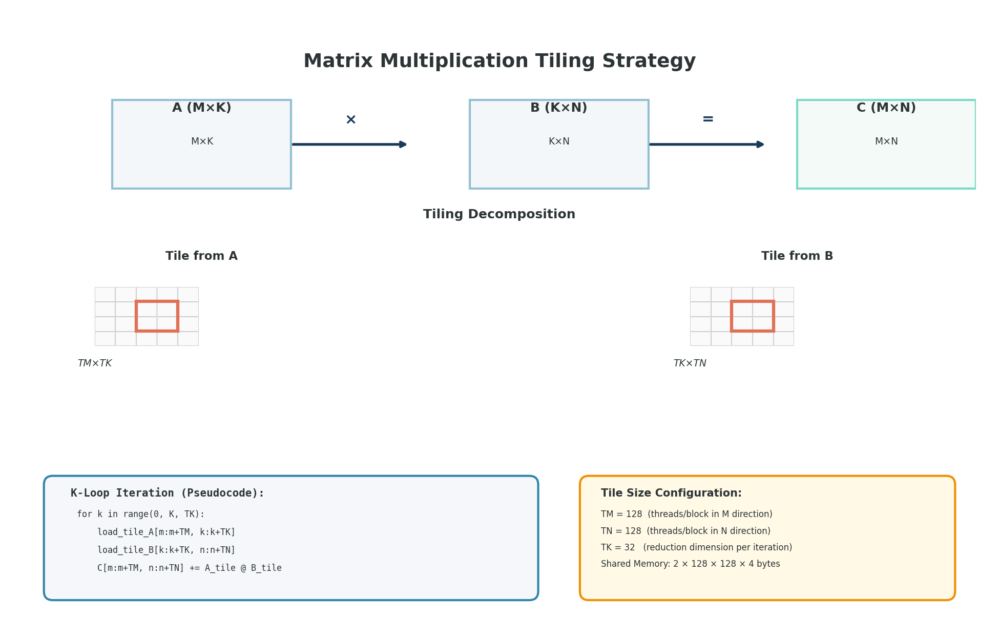

---
jupytext:
  text_representation:
    extension: .md
    format_name: myst
kernelspec:
  display_name: Python 3
  language: python
  name: python3
---

# Triton Completo: Filosofía, API y Reducciones

```{code-cell} ipython3
import torch
import sys

# Validación temprana de entorno para cuadernos estrictamente acoplados a NVidia (Triton/vLLM)
if not torch.cuda.is_available():
    print("❌ ADVERTENCIA: Este notebook requiere una GPU NVidia y arquitectura CUDA para funcionar.")
    print("Por favor, sube este notebook a Google Colab y selecciona Entorno de ejecución -> Cambiar tipo de entorno -> T4 GPU o superior.")
    sys.exit("Entorno incompatible: Sistema sin CUDA detectado.")
else:
    print("✅ Entorno GPU detectado compatible con los requerimientos.")
```


```{code-cell} ipython3
# Setup condicional para Google Colab
import sys
if 'google.colab' in sys.modules:
    !pip install -q triton plotly
    # Nota: la lista anterior puede contener librerías extra, las cuales Colab ignorará o instalará rápido.
```


```{admonition} Ejecutar en Google Colab
:class: tip

[](https://colab.research.google.com/github/salvahin/ACA-2026/blob/main/book/notebooks/04_triton_completo.ipynb)
```


> **Módulo:** Project 2 - GPU Computing & Kernel Optimization
> **Semana:** 4
> **Tiempo de lectura:** ~45 minutos

---

## Introducción

CUDA requiere controlar muchos detalles: indexación manual, sincronización, gestión de memoria compartida. **Triton** responde a una pregunta simple: ¿Qué pasa si especificas la lógica, no el paralelismo?

En Triton, el **compilador** maneja el paralelismo por ti. Esta lectura cubre la filosofía de Triton, su API completa, y patrones de reducción.

---

```{admonition} Objetivos de Aprendizaje
:class: tip
Al finalizar esta lectura podrás:
- Explicar la filosofía "bloques, no threads" de Triton (programa = bloque de datos)
- Usar el API completo de `triton.language` (load, store, arange, máscaras, reducciones)
- Implementar reducciones locales (tl.sum dentro de bloque) y globales (dos etapas)
- Aplicar autotuning con `@triton.autotune` para encontrar mejores BLOCK_SIZE
- Escribir kernels fusionados (softmax, layernorm, GELU) con una sola pasada de datos
```

---

## Contexto
Esta lectura cubre el lenguaje Triton para escribir kernels GPU de forma más productiva que CUDA. Aprenderás su filosofía "bloques, no threads" y patrones de reducción.

## Filosofía de Triton

```{admonition} 🧠 Modelo Mental: Triton vs CUDA
:class: hint
**CUDA**: Piensas como un thread individual
- "Soy el thread 42, proceso el elemento datos[42]"
- Control manual de todo: indexación, sincronización, shared memory

**Triton**: Piensas como un bloque de datos
- "Soy el programa 5, proceso el bloque de datos [1280:1536]"
- Compilador maneja: coalescing, sincronización, vectorización automática

Es como programar en NumPy vs escribir loops manualmente.
```

### Piensa en Bloques, No en Threads

```
CUDA:   1 thread  → 1 elemento
Triton: 1 programa → 1 bloque de datos
```

```{code-cell} ipython3
:tags: [skip-execution]

# CUDA: especificar todo
# idx = blockIdx.x * blockDim.x + threadIdx.x
# if idx < n: data[idx] = data[idx] * 2

# Triton: solo decir qué hacer
@triton.jit
def kernel(data_ptr, n, BLOCK: tl.constexpr):
    pid = tl.program_id(0)
    offsets = pid * BLOCK + tl.arange(0, BLOCK)
    mask = offsets < n
    data = tl.load(data_ptr + offsets, mask=mask)
    tl.store(data_ptr + offsets, data * 2, mask=mask)
```

Triton maneja automáticamente:
- Sincronización
- Coalescing de memoria
- Distribución de threads
- Checks de límites

---

## El Decorador @triton.jit

```{code-cell} ipython3
:tags: [skip-execution]

import triton
import triton.language as tl

@triton.jit
def kernel_simple(x_ptr, y_ptr, n, BLOCK_SIZE: tl.constexpr):
    # program_id: cuál "bloque" soy
    pid = tl.program_id(axis=0)

    # Crear índices
    offsets = pid * BLOCK_SIZE + tl.arange(0, BLOCK_SIZE)
    mask = offsets < n

    # Cargar, computar, guardar
    x = tl.load(x_ptr + offsets, mask=mask)
    y = x * 2
    tl.store(y_ptr + offsets, y, mask=mask)
```

`BLOCK_SIZE: tl.constexpr` es una **constante en tiempo de compilación**, permitiendo optimizaciones que CUDA no puede hacer.

---

## API Completa de triton.language

### Creación de Vectores

```{code-cell} ipython3
:tags: [skip-execution]

# Índices secuenciales
v = tl.arange(0, 256)           # [0, 1, 2, ..., 255]
v = tl.arange(0, 256, 2)        # [0, 2, 4, ..., 254]

# Vectores constantes
zeros = tl.zeros((256,), dtype=tl.float32)
ones = tl.ones((256,), dtype=tl.float32)
pi = tl.full((256,), 3.14159, dtype=tl.float32)
```

### Carga y Almacenamiento

```{code-cell} ipython3
:tags: [skip-execution]

# Cargar datos
x = tl.load(x_ptr + offsets)
x = tl.load(x_ptr + offsets, mask=mask)
x = tl.load(x_ptr + offsets, mask=mask, other=0.0)

# Guardar datos
tl.store(y_ptr + offsets, y)
tl.store(y_ptr + offsets, y, mask=mask)

# Operaciones atómicas
tl.atomic_add(ptr + offsets, values)
tl.atomic_max(ptr + offsets, values)
```

### Operaciones Aritméticas

```{code-cell} ipython3
:tags: [skip-execution]

# Básicas
suma = a + b
resta = a - b
producto = a * b
division = a / b

# Funciones matemáticas
raiz = tl.sqrt(x)
exp_x = tl.exp(x)
log_x = tl.log(x)
sin_x = tl.sin(x)
cos_x = tl.cos(x)
abs_x = tl.abs(x)

# Comparaciones
maximo = tl.maximum(a, b)
minimo = tl.minimum(a, b)
```

### Máscaras y Condicionales

```{code-cell} ipython3
:tags: [skip-execution]

# Crear máscaras
mask_bounds = offsets < n
mask_condition = x > threshold

# Combinar máscaras
combined = mask_bounds & mask_condition

# Condicional vectorizado
result = tl.where(condition, value_true, value_false)

# Ejemplo: ReLU
result = tl.where(x > 0, x, 0.0)
```

### Indexación 2D

```{code-cell} ipython3
:tags: [skip-execution]

@triton.jit
def kernel_2d(matrix_ptr, height, width, BLOCK_H: tl.constexpr, BLOCK_W: tl.constexpr):
    pid_h = tl.program_id(0)
    pid_w = tl.program_id(1)

    # Índices locales
    local_h = tl.arange(0, BLOCK_H)
    local_w = tl.arange(0, BLOCK_W)

    # Expandir a 2D con broadcasting
    h_indices = pid_h * BLOCK_H + local_h[:, None]
    w_indices = pid_w * BLOCK_W + local_w[None, :]

    # Índices lineales (row-major)
    linear = h_indices * width + w_indices

    # Máscara 2D
    mask = (h_indices < height) & (w_indices < width)

    data = tl.load(matrix_ptr + linear, mask=mask, other=0.0)
```

```{code-cell} ipython3
# Visualización de Tiling en Multiplicación de Matrices
import numpy as np
import plotly.graph_objects as go
from plotly.subplots import make_subplots

fig = make_subplots(rows=1, cols=3, subplot_titles=('Matriz A', 'Matriz B', 'Matriz C'))

M, K, N = 8, 8, 8
BLOCK = 4

# Crear matrices con bloques coloreados
for idx, (titulo, dims) in enumerate([(('A', (M, K)), 1), (('B', (K, N)), 2), (('C', (M, N)), 3)]):
    name, (rows, cols) = titulo
    z = np.zeros((rows, cols))

    # Colorear un bloque
    if name == 'A':
        z[0:BLOCK, 0:BLOCK] = 1
    elif name == 'B':
        z[0:BLOCK, 0:BLOCK] = 2
    else:
        z[0:BLOCK, 0:BLOCK] = 3

    fig.add_trace(go.Heatmap(z=z, colorscale=[[0, 'white'], [0.33, '#FF6B6B'],
                                               [0.66, '#4ECDC4'], [1, '#45B7D1']],
                             showscale=False), row=1, col=idx)

fig.update_layout(title="Tiling: Cada bloque procesa un tile de 4×4", height=300)
fig.show()
```

---



> **Tiling: División del Trabajo en Bloques**
>
> El tiling divide matrices grandes en tiles que caben en shared memory. Cada bloque CUDA procesa su propio tile, reutilizando los datos cargados una vez para múltiples cálculos y aumentando la intensidad aritmética al amortizar el costo de carga desde memoria global.

## Reducciones

### Reducciones Locales (Dentro del Bloque)

```{code-cell} ipython3
:tags: [skip-execution]

@triton.jit
def kernel_reduce(data_ptr, result_ptr, n, BLOCK: tl.constexpr):
    pid = tl.program_id(0)
    offsets = pid * BLOCK + tl.arange(0, BLOCK)
    mask = offsets < n

    data = tl.load(data_ptr + offsets, mask=mask, other=0.0)

    # Reducciones - producen UN escalar por bloque
    suma = tl.sum(data)
    maximo = tl.max(data)
    minimo = tl.min(data)

    # Guardar (cada bloque produce 1 resultado)
    tl.store(result_ptr + pid, suma)
```

### Reducciones con Máscara

```{code-cell} ipython3
:tags: [skip-execution]

@triton.jit
def suma_condicional(data_ptr, result_ptr, threshold, n, BLOCK: tl.constexpr):
    pid = tl.program_id(0)
    offsets = pid * BLOCK + tl.arange(0, BLOCK)
    mask = offsets < n

    data = tl.load(data_ptr + offsets, mask=mask, other=0.0)

    # Solo sumar elementos > threshold
    filtered = tl.where(data > threshold, data, 0.0)
    suma = tl.sum(filtered)

    tl.store(result_ptr + pid, suma)
```

### Reducción Global (Dos Etapas)

```{code-cell} ipython3
:tags: [skip-execution]

@triton.jit
def kernel_etapa1(data_ptr, temp_ptr, n, BLOCK: tl.constexpr):
    """Cada bloque suma sus datos"""
    pid = tl.program_id(0)
    offsets = pid * BLOCK + tl.arange(0, BLOCK)
    mask = offsets < n

    data = tl.load(data_ptr + offsets, mask=mask, other=0.0)
    tl.store(temp_ptr + pid, tl.sum(data))

@triton.jit
def kernel_etapa2(temp_ptr, result_ptr, num_bloques, BLOCK: tl.constexpr):
    """Sumar todos los resultados parciales"""
    offsets = tl.arange(0, BLOCK)
    mask = offsets < num_bloques

    temp = tl.load(temp_ptr + offsets, mask=mask, other=0.0)
    tl.store(result_ptr, tl.sum(temp))

def suma_total(data):
    n = data.numel()
    BLOCK = 256
    num_bloques = triton.cdiv(n, BLOCK)

    temp = torch.zeros(num_bloques, device='cuda')
    kernel_etapa1[(num_bloques,)](data, temp, n, BLOCK=BLOCK)

    result = torch.zeros(1, device='cuda')
    kernel_etapa2[(1,)](temp, result, num_bloques, BLOCK=BLOCK)

    return result[0]
```

---

## Autotuning

### Configuración Básica

```{code-cell} ipython3
:tags: [skip-execution]

@triton.autotune(
    configs=[
        triton.Config({'BLOCK_M': 64, 'BLOCK_N': 64}),
        triton.Config({'BLOCK_M': 128, 'BLOCK_N': 64}),
        triton.Config({'BLOCK_M': 64, 'BLOCK_N': 128}),
        triton.Config({'BLOCK_M': 128, 'BLOCK_N': 128}),
    ],
    key=['M', 'N']  # Retunar si estos cambian
)
@triton.jit
def kernel_autotuned(A, B, M, N, BLOCK_M: tl.constexpr, BLOCK_N: tl.constexpr):
    # Código del kernel...
    pass
```

### Cómo Funciona

```
Primera llamada:
1. Triton prueba cada configuración
2. Mide tiempo de ejecución
3. Selecciona la más rápida
4. Cachea resultado

Llamadas siguientes:
→ Usa configuración cacheada
```

---

## Ejemplos Completos

### Softmax Fusionado

```{code-cell} ipython3
:tags: [skip-execution]

@triton.jit
def softmax_kernel(x_ptr, out_ptr, M, N, BLOCK: tl.constexpr):
    row = tl.program_id(0)
    offsets = tl.arange(0, BLOCK)
    mask = offsets < N

    # Cargar fila
    x = tl.load(x_ptr + row * N + offsets, mask=mask, other=-float('inf'))

    # Softmax numéricamente estable
    max_x = tl.max(x, axis=0)
    x = x - max_x
    exp_x = tl.exp(x)
    sum_exp = tl.sum(exp_x, axis=0)
    softmax = exp_x / sum_exp

    tl.store(out_ptr + row * N + offsets, softmax, mask=mask)

def softmax_triton(x):
    M, N = x.shape
    out = torch.empty_like(x)
    BLOCK = triton.next_power_of_2(N)
    softmax_kernel[(M,)](x, out, M, N, BLOCK=BLOCK)
    return out
```

### Layer Normalization

```{code-cell} ipython3
:tags: [skip-execution]

@triton.jit
def layernorm_kernel(x_ptr, out_ptr, gamma_ptr, beta_ptr, M, N, eps, BLOCK: tl.constexpr):
    row = tl.program_id(0)
    offsets = tl.arange(0, BLOCK)
    mask = offsets < N

    x = tl.load(x_ptr + row * N + offsets, mask=mask, other=0.0)
    gamma = tl.load(gamma_ptr + offsets, mask=mask, other=1.0)
    beta = tl.load(beta_ptr + offsets, mask=mask, other=0.0)

    # Calcular mean y var
    mean = tl.sum(x, axis=0) / N
    x_centered = x - mean
    var = tl.sum(x_centered * x_centered, axis=0) / N

    # Normalizar
    x_norm = x_centered / tl.sqrt(var + eps)
    out = gamma * x_norm + beta

    tl.store(out_ptr + row * N + offsets, out, mask=mask)
```

### GELU Activation

```{code-cell} ipython3
:tags: [skip-execution]

@triton.jit
def gelu_kernel(x_ptr, out_ptr, n, BLOCK: tl.constexpr):
    pid = tl.program_id(0)
    offsets = pid * BLOCK + tl.arange(0, BLOCK)
    mask = offsets < n

    x = tl.load(x_ptr + offsets, mask=mask)

    # GELU: 0.5 * x * (1 + tanh(sqrt(2/π) * (x + 0.044715 * x³)))
    sqrt_2_over_pi = 0.7978845608028654
    coef = 0.044715
    tanh_arg = sqrt_2_over_pi * (x + coef * x * x * x)
    gelu = 0.5 * x * (1.0 + tl.tanh(tanh_arg))

    tl.store(out_ptr + offsets, gelu, mask=mask)
```

---

## Comparación: Triton vs CUDA

| Aspecto | CUDA | Triton |
|---------|------|--------|
| Abstracción | Bajo (control total) | Alto (automático) |
| Unidad de trabajo | Thread | Programa (bloque) |
| Shared memory | Manual | Automático |
| Sincronización | Manual | Automática |
| Coalescing | Manual | Automático |
| Tensor cores | Manual | Automático (tl.dot) |
| Debugging | Difícil | Más fácil |
| Performance | Máxima | ~95%+ |

### Cuándo Usar Cada Uno

**Triton:**
- Kernels personalizados
- Prototipos rápidos
- Operaciones de deep learning
- Autotuning fácil

**CUDA:**
- Control absoluto necesario
- Patrones muy irregulares
- Optimizaciones específicas de hardware

---

## Resumen

```{admonition} Resumen
:class: important
**Conceptos clave de Triton:**
- **Filosofía**: Programas operan sobre bloques de datos, no threads individuales
- **Abstracción**: Compilador maneja coalescing, sincronización, vectorización
- **API esencial**:
  - `tl.program_id(0)` - Cuál bloque soy
  - `tl.arange(0, BLOCK)` - Crear índices
  - `tl.load/store(..., mask=...)` - Memoria con bounds checking
  - `tl.sum/max/min` - Reducciones dentro del bloque
- **Reducciones globales**: Dos kernels (etapa1: bloques→temporales, etapa2: sum temporales)
- **Autotuning**: `@triton.autotune` prueba configs automáticamente

**Checklist de kernel Triton:**
- [ ] Usar `mask=` en todos los `tl.load` y `tl.store`
- [ ] `BLOCK_SIZE: tl.constexpr` para valores de compilación
- [ ] Para reducciones globales: dos kernels (local + global)
- [ ] Broadcasting correcto en 2D: `[:, None]` y `[None, :]`
```

```{admonition} ⚠️ Antipatrón: Olvidar Máscaras
:class: warning
**Error común**: `x = tl.load(x_ptr + offsets)` sin máscara

**Problema**: Si `BLOCK_SIZE=256` pero `n=100`, accedes posiciones 100-255 que no existen → resultados incorrectos o crash

**Solución**: Siempre usar máscara:
```python
mask = offsets < n
x = tl.load(x_ptr + offsets, mask=mask, other=0.0)
```
```

```{admonition} ⚡ Tip de Performance
:class: important
**Kernel fusionado vs múltiples kernels:**

Malo (3 kernels):
```python
y = x + 1
y = y * 2
y = y - 3
```
Requiere 3 round-trips a memoria → 6 accesos totales (3 loads + 3 stores)

Bueno (1 kernel fusionado):
```python
@triton.jit
def fused(x_ptr, y_ptr, n, BLOCK: tl.constexpr):
    x = tl.load(x_ptr + offsets, mask=mask)
    y = (x + 1) * 2 - 3  # Todo en registros
    tl.store(y_ptr + offsets, y, mask=mask)
```
Solo 2 accesos (1 load + 1 store) → 3x menos tráfico de memoria
```

```{admonition} 🎯 En tu proyecto
:class: note
Usarás Triton cuando implementes:
- Kernels elementwise fusionados (ReLU, GELU, dropout)
- Softmax optimizado (una pasada con max, exp, sum fusionados)
- LayerNorm (calcular mean y var en una pasada)

Típicamente 1.2-2x más rápido que PyTorch naive por fusión de operaciones.
```

---

## Ejercicios

### Ejercicio 1: Traducir a Triton

```cuda
__global__ void relu(float *x, float *y, int n) {
    int idx = blockIdx.x * blockDim.x + threadIdx.x;
    if (idx < n) {
        y[idx] = x[idx] > 0 ? x[idx] : 0;
    }
}
```

### Ejercicio 2: Implementar Dropout

Crea un kernel que aplique dropout con probabilidad p.

### Ejercicio 3: Suma Condicional

Escribe un kernel que sume solo elementos positivos.

### Para Pensar

> *Si Triton genera código optimizado automáticamente, ¿por qué aún necesitas entender coalescing y bank conflicts?*

---

## Errores Comunes

```{admonition} Errores frecuentes en Triton
:class: warning

1. **Olvidar máscaras en load/store**: Sin máscara, puedes acceder memoria inválida cuando `BLOCK_SIZE > n`.
2. **Confundir constexpr**: `BLOCK_SIZE: tl.constexpr` debe ser constante en tiempo de compilación.
3. **Broadcasting incorrecto en 2D**: Usar `[:, None]` y `[None, :]` correctamente para expandir dimensiones.
4. **No usar `other=` en load**: Si cargas con máscara, especifica valor por defecto para elementos fuera de límites.
```

## Ejercicio Práctico: Debugging de Kernel con Bug

```{code-cell} ipython3
import torch
import triton
import triton.language as tl

# Kernel con múltiples bugs - ¡encuéntralos y corrígelos!
@triton.jit
def buggy_relu_kernel(x_ptr, y_ptr, n, BLOCK_SIZE: tl.constexpr):
    """ReLU con bugs intencionales."""
    pid = tl.program_id(axis=0)
    offsets = pid * BLOCK_SIZE + tl.arange(0, BLOCK_SIZE)
    # BUG 1: ¿Falta algo aquí?
    x = tl.load(x_ptr + offsets)
    # BUG 2: ¿Esta lógica es correcta?
    y = tl.where(x < 0, x, 0.0)
    # BUG 3: ¿Qué pasa si BLOCK_SIZE no divide n?
    tl.store(y_ptr + offsets, y)

def test_buggy_kernel():
    """Test que expone los bugs."""
    # Caso 1: Tamaño que no es múltiplo de BLOCK_SIZE
    n = 100
    BLOCK_SIZE = 32
    x = torch.randn(n, device='cuda')

    print(f"Testing con n={n}, BLOCK_SIZE={BLOCK_SIZE}")
    print(f"Bloques necesarios: {(n + BLOCK_SIZE - 1) // BLOCK_SIZE}")

    y = torch.empty_like(x)
    grid = lambda meta: (triton.cdiv(n, meta['BLOCK_SIZE']),)

    try:
        buggy_relu_kernel[grid](x, y, n, BLOCK_SIZE=BLOCK_SIZE)
        torch.cuda.synchronize()

        # Verificar contra PyTorch
        expected = torch.relu(x)
        correct = torch.allclose(y, expected, rtol=1e-5)

        print(f"¿Kernel completó? ✓")
        print(f"¿Resultados correctos? {'✓' if correct else '✗'}")

        if not correct:
            print("\n=== Debugging ===")
            diff = (y - expected).abs()
            print(f"Max error: {diff.max().item():.6f}")
            print(f"Primeros 5 valores:")
            for i in range(5):
                print(f"  x[{i}]={x[i]:.4f} → y[{i}]={y[i]:.4f}, esperado={expected[i]:.4f}")
            print(f"Últimos 5 valores:")
            for i in range(n-5, n):
                print(f"  x[{i}]={x[i]:.4f} → y[{i}]={y[i]:.4f}, esperado={expected[i]:.4f}")

    except Exception as e:
        print(f"✗ Error durante ejecución: {e}")

# Ejecutar test
print("=== Test de Kernel Buggy ===\n")
test_buggy_kernel()

print("\n=== Bugs Encontrados ===")
print("BUG 1: Falta verificar límites con máscara en tl.load")
print("BUG 2: Lógica invertida - debería ser tl.where(x > 0, x, 0.0)")
print("BUG 3: Falta máscara en tl.store para elementos fuera de límites")

print("\n=== Kernel Corregido ===")
print("""
@triton.jit
def relu_kernel_fixed(x_ptr, y_ptr, n, BLOCK_SIZE: tl.constexpr):
    pid = tl.program_id(axis=0)
    offsets = pid * BLOCK_SIZE + tl.arange(0, BLOCK_SIZE)
    mask = offsets < n  # FIX 1: Máscara para límites
    x = tl.load(x_ptr + offsets, mask=mask, other=0.0)  # FIX 1
    y = tl.where(x > 0, x, 0.0)  # FIX 2: Lógica correcta
    tl.store(y_ptr + offsets, y, mask=mask)  # FIX 3: Máscara en store
""")
```

---

*Esta lectura es parte del curso "Grammar-Constrained GPU Kernel Generation" - ACA*

---

## Referencias

- Triton. [Triton Language and Compiler](https://github.com/triton-lang/triton). GitHub.
- Tillet, P., Kung, H.T., & Cox, D. (2019). [Triton: An Intermediate Language and Compiler for Tiled Neural Network Computations](https://www.eecs.harvard.edu/~htk/publication/2019-mapl-tillet-kung-cox.pdf). MAPL.
- Triton. [Tutorials](https://triton-lang.org/main/getting-started/tutorials/). Triton Docs.
