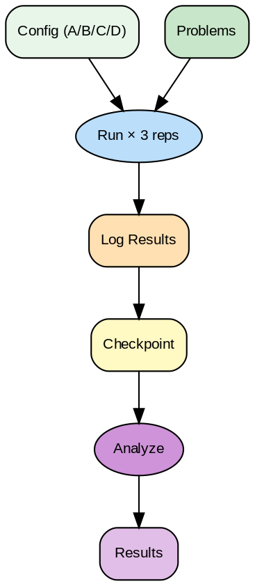

---
jupytext:
  text_representation:
    extension: .md
    format_name: myst
kernelspec:
  display_name: Python 3
  language: python
  name: python3
---

# Baseline y Experimentos: Medición Sistemática de Performance

```{code-cell} ipython3
import torch
import warnings

# Selección dinámica de dispositivo
if torch.cuda.is_available():
    device = torch.device("cuda")
elif hasattr(torch.backends, 'mps') and torch.backends.mps.is_available():
    device = torch.device("mps")
else:
    device = torch.device("cpu")
    warnings.warn("No se detectó un acelerador (GPU/MPS). La ejecución será lenta.")

print(f"Usando dispositivo: {device}")
```


```{code-cell} ipython3
# Setup condicional para Google Colab
import sys
if 'google.colab' in sys.modules:
    !pip install -q transformers bitsandbytes triton vllm auto-gptq datasets evaluate
    # Nota: la lista anterior puede contener librerías extra, las cuales Colab ignorará o instalará rápido.
```


```{admonition} Ejecutar en Google Colab
:class: tip

[](https://colab.research.google.com/github/salvahin/ACA-2026/blob/main/book/notebooks/08_baseline_experimentos.ipynb)
```


> **Módulo:** Project 2 - GPU Computing & Kernel Optimization
> **Semana:** 8
> **Tiempo de lectura:** ~50 minutos

---

## Introducción

Antes de optimizar, necesitas saber **dónde estás**. Un baseline te da un punto de referencia confiable. Un diseño experimental sistemático te permite comparar variantes de forma rigurosa, evitando conclusiones falsas por varianza.

Esta lectura cubre cómo establecer baselines sólidos, diseñar experimentos A/B/C/D, y automatizar benchmarks.

---

```{admonition} Objetivos de Aprendizaje
:class: tip
Al finalizar esta lectura podrás:
- Establecer baselines confiables (PyTorch, cuDNN, referencias verificadas)
- Diseñar benchmarks reproducibles (warmup, sincronización, múltiples samples)
- Diseñar experimentos A/B/C/D con variables controladas
- Calcular significancia estadística (t-test, p-value<0.05, Cohen's d)
- Automatizar pipelines de benchmarking con CI/CD y detección de regresiones
```

---

## Estableciendo Baselines

### ¿Qué es un Baseline?

Un **baseline** es una medición de referencia que representa:
- El estado actual del sistema
- Un punto de comparación para mejoras
- Una garantía mínima de performance

### Fuentes de Baseline

```{code-cell} ipython3
:tags: [skip-execution]

# 1. PyTorch nativo
def pytorch_baseline(x):
    return torch.softmax(x, dim=-1)

# 2. Biblioteca optimizada (cuDNN)
def cudnn_baseline(x):
    return F.softmax(x, dim=-1)

# 3. Implementación manual verificada
def reference_baseline(x):
    max_x = x.max(dim=-1, keepdim=True).values
    exp_x = torch.exp(x - max_x)
    return exp_x / exp_x.sum(dim=-1, keepdim=True)

# 4. Kernel Triton conocido
@triton.jit
def triton_baseline(...):
    pass
```

### Criterios de un Buen Baseline

```
✓ Correcto
  - Produce resultados matemáticamente correctos
  - Verificado contra múltiples implementaciones

✓ Reproducible
  - Mismos inputs → mismos outputs
  - Misma performance en múltiples ejecuciones

✓ Representativo
  - Refleja uso realista del kernel
  - Tamaños de datos típicos

✓ Documentado
  - Hardware donde se midió
  - Configuración de software
  - Fecha de medición
```

---

## Benchmarking Sistemático

### Estructura de un Benchmark

```{code-cell} ipython3
:tags: [skip-execution]

@dataclass
class BenchmarkConfig:
    name: str
    kernel_fn: Callable
    input_generator: Callable
    sizes: List[int]
    warmup_iterations: int = 10
    benchmark_iterations: int = 100
    dtype: torch.dtype = torch.float32

@dataclass
class BenchmarkResult:
    config: BenchmarkConfig
    size: int
    mean_time_ms: float
    std_time_ms: float
    min_time_ms: float
    max_time_ms: float
    throughput_gbps: float
```

### Medición Correcta

```{code-cell} ipython3
:tags: [skip-execution]

def benchmark_kernel(config: BenchmarkConfig, size: int) -> BenchmarkResult:
    """Mide performance de un kernel correctamente."""
    inputs = config.input_generator(size, config.dtype)

    # Warmup (importante para JIT)
    # WARMUP CRÍTICO: Primera ejecución incluye JIT compilation + CUDA init +
    # GPU frequency scaling. Sin warmup: mediciones 25x más lentas.
    # Mínimo 10-20 iteraciones antes de medir.
    for _ in range(config.warmup_iterations):
        _ = config.kernel_fn(*inputs)
    torch.cuda.synchronize()

    # Benchmark
    times = []
    for _ in range(config.benchmark_iterations):
        torch.cuda.synchronize()
        start = torch.cuda.Event(enable_timing=True)
        end = torch.cuda.Event(enable_timing=True)

        start.record()
        _ = config.kernel_fn(*inputs)
        end.record()

        torch.cuda.synchronize()
        times.append(start.elapsed_time(end))

    times = np.array(times)
    return BenchmarkResult(
        config=config,
        size=size,
        mean_time_ms=times.mean(),
        std_time_ms=times.std(),
        min_time_ms=times.min(),
        max_time_ms=times.max(),
        throughput_gbps=calculate_throughput(size, times.mean())
    )
```

### Errores Comunes

```{code-cell} ipython3
:tags: [skip-execution]

# ERROR 1: No sincronizar
start = time.time()
output = kernel(x)
end = time.time()  # Mide lanzamiento, no ejecución

# CORRECTO:
torch.cuda.synchronize()
start = time.time()
output = kernel(x)
torch.cuda.synchronize()
end = time.time()

# ERROR 2: No hacer warmup
# Primeras iteraciones incluyen JIT compilation

# ERROR 3: Incluir overhead de Python
for i in range(100):
    result = kernel(input_list[i])  # List indexing cada vez
```

---



> **Flujo de un Experimento de Rendimiento**
>
> Un experimento bien diseñado define hipótesis, controla variables, calienta la GPU (warmup), repite N veces y calcula media ± desviación estándar. Las comparaciones A/B/C/D deben variar solo un parámetro a la vez para aislar el efecto de cada decisión de diseño.

## Diseño de Experimentos A/B/C/D

### Estructura de un Experimento

```
Experimento: "Comparar tamaños de bloque para softmax"

Hipótesis: BLOCK_SIZE=256 será más rápido que BLOCK_SIZE=128 para N>1024

Variables:
  - Independiente: BLOCK_SIZE (128, 256, 512, 1024)
  - Dependiente: Tiempo de ejecución (ms)
  - Controladas: GPU, input size, dtype, num_warmup

Configuraciones:
  A: BLOCK_SIZE=128 (baseline)
  B: BLOCK_SIZE=256
  C: BLOCK_SIZE=512
  D: BLOCK_SIZE=1024
```

### Definición en Código

```{code-cell} ipython3
:tags: [skip-execution]

@dataclass
class ExperimentConfig:
    name: str
    hypothesis: str
    variants: Dict[str, Dict]  # A, B, C, D -> parameters
    controlled_variables: Dict[str, Any]
    metrics: List[str]
    num_repetitions: int = 100
    input_sizes: List[int] = field(default_factory=lambda: [256, 1024, 4096])

experiment = ExperimentConfig(
    name="block_size_comparison",
    hypothesis="Larger BLOCK_SIZE improves performance for large inputs",
    variants={
        "A": {"BLOCK_SIZE": 128},
        "B": {"BLOCK_SIZE": 256},
        "C": {"BLOCK_SIZE": 512},
        "D": {"BLOCK_SIZE": 1024},
    },
    controlled_variables={
        "dtype": torch.float32,
        "warmup_iterations": 20,
        "device": "cuda:0",
    },
    metrics=["time_ms", "throughput_gbps"],
)
```

### Tipos de Variantes

```python
# Tipo 1: Variantes de parámetros
variants_block_size = {
    "A": {"BLOCK_M": 64, "BLOCK_N": 64},
    "B": {"BLOCK_M": 128, "BLOCK_N": 64},
    "C": {"BLOCK_M": 64, "BLOCK_N": 128},
    "D": {"BLOCK_M": 128, "BLOCK_N": 128},
}

# Tipo 2: Variantes de algoritmo
variants_algorithm = {
    "A": "sequential_reduction",
    "B": "tree_reduction",
    "C": "warp_shuffle",
    "D": "cooperative_groups",
}

# Tipo 3: Variantes de optimización
variants_optimization = {
    "A": {"vectorize": False, "prefetch": False},
    "B": {"vectorize": True, "prefetch": False},
    "C": {"vectorize": False, "prefetch": True},
    "D": {"vectorize": True, "prefetch": True},
}
```

---

## Control de Variables

### Variables Confusoras

```
⚠️ Variables que pueden afectar resultados:

1. Estado de GPU
   - Temperatura (thermal throttling)
   - Otros procesos usando GPU
   - Power management state

2. Estado de sistema
   - Otros procesos en CPU
   - Memoria disponible
   - Estado del cache

3. Varianza de medición
   - Overhead de lanzamiento
   - Scheduling de OS
```

### Mitigación

```{code-cell} ipython3
:tags: [skip-execution]

def prepare_experiment():
    """Prepara entorno para experimento reproducible."""
    # 1. Limpiar GPU
    torch.cuda.empty_cache()
    torch.cuda.synchronize()

    # 2. Establecer semilla
    torch.manual_seed(42)
    torch.cuda.manual_seed(42)

    # 3. Calentar GPU
    warm_up_gpu()

    # 4. Verificar no hay otros procesos
    if torch.cuda.memory_allocated() > 0:
        print("WARNING: GPU memory already in use")

def run_randomized_experiment(experiment: ExperimentConfig):
    """Ejecuta con orden randomizado."""
    combinations = [
        (variant, size)
        for variant in experiment.variants
        for size in experiment.input_sizes
    ]
    random.shuffle(combinations)  # Evitar efectos temporales

    results = defaultdict(list)
    for variant, size in combinations:
        prepare_experiment()
        times = measure_kernel(experiment.variants[variant], size)
        results[(variant, size)].extend(times)

    return results
```

---

## Análisis Estadístico

### Comparación de Variantes

```{code-cell} ipython3
:tags: [skip-execution]

from scipy import stats

def compare_variants(results: Dict, baseline: str = "A"):
    """Compara todas las variantes contra baseline."""
    comparisons = {}
    baseline_results = results[baseline]

    for variant, variant_results in results.items():
        if variant == baseline:
            continue

        # Test t
        t_stat, p_value = stats.ttest_ind(baseline_results, variant_results)

        # Tamaño del efecto (Cohen's d)
        pooled_std = np.sqrt(
            (np.var(baseline_results) + np.var(variant_results)) / 2
        )
        cohens_d = (np.mean(baseline_results) - np.mean(variant_results)) / pooled_std

        # Speedup
        speedup = np.mean(baseline_results) / np.mean(variant_results)

        comparisons[variant] = {
            "mean_baseline": np.mean(baseline_results),
            "mean_variant": np.mean(variant_results),
            "speedup": speedup,
            "p_value": p_value,
            "significant": p_value < 0.05,
            "cohens_d": cohens_d,
        }

    return comparisons

def interpret_cohens_d(d: float) -> str:
    d = abs(d)
    if d < 0.2: return "negligible"
    elif d < 0.5: return "small"
    elif d < 0.8: return "medium"
    else: return "large"
```

### ANOVA

```{code-cell} ipython3
:tags: [skip-execution]

def anova_analysis(results: Dict):
    """ANOVA para comparar múltiples grupos."""
    groups = [results[v] for v in sorted(results.keys())]
    f_stat, p_value = stats.f_oneway(*groups)

    return {
        "f_statistic": f_stat,
        "p_value": p_value,
        "significant": p_value < 0.05,
        "interpretation": (
            "Al menos una variante es significativamente diferente"
            if p_value < 0.05
            else "No hay diferencias significativas"
        )
    }
```

:::{figure} diagrams/benchmark_pipeline.png
:name: fig-benchmark-pipeline
:alt: Pipeline de benchmarking: Preparación → Warmup → Medición → Sincronización → Análisis estadístico
:align: center
:width: 90%

**Figura 1:** Pipeline de Benchmarking - Flujo sistemático desde preparación del entorno hasta análisis estadístico de resultados con control de calidad.
:::

---

## Automatización

### Pipeline de Benchmarks

```{code-cell} ipython3
:tags: [skip-execution]

class BenchmarkPipeline:
    def __init__(self, config_path: str):
        self.config = self.load_config(config_path)
        self.results_dir = Path(self.config["results_dir"])
        self.results_dir.mkdir(parents=True, exist_ok=True)

    def run(self) -> Dict:
        all_results = {}

        for benchmark_config in self.config["benchmarks"]:
            print(f"Running {benchmark_config['name']}...")
            results = []

            for size in benchmark_config["sizes"]:
                result = benchmark_kernel(
                    BenchmarkConfig(**benchmark_config), size
                )
                results.append(result)
                self.save_intermediate(result)

            all_results[benchmark_config["name"]] = results

        self.save_final(all_results)
        self.generate_report(all_results)
        return all_results
```

### Configuración YAML

```yaml
# benchmark_config.yaml
results_dir: "./benchmark_results"
hardware:
  gpu: "NVIDIA A100"
  cuda_version: "12.2"

benchmarks:
  - name: "softmax"
    kernel_fn: "kernels.softmax_triton"
    baseline_fn: "torch.softmax"
    sizes: [256, 512, 1024, 2048, 4096, 8192]
    warmup_iterations: 20
    benchmark_iterations: 200

regression_threshold: 0.05  # 5% = regression
```

### Integración CI/CD

```yaml
# .github/workflows/benchmark.yml
name: Performance Benchmarks

on:
  push:
    branches: [main]
  pull_request:

jobs:
  benchmark:
    runs-on: [self-hosted, gpu]
    steps:
      - uses: actions/checkout@v3

      - name: Run benchmarks
        run: python -m benchmark_pipeline --config ci_config.yaml

      - name: Check regressions
        run: |
          python -m check_regressions \
            --current results/current \
            --baseline results/baseline \
            --threshold 0.05 \
            --fail-on-regression
```

---

## Detección de Regresiones

```{code-cell} ipython3
:tags: [skip-execution]

def detect_regressions(
    current_results: List[BenchmarkResult],
    baseline_results: List[BenchmarkResult],
    threshold: float = 0.05
) -> List[Regression]:
    regressions = []

    for current in current_results:
        baseline = find_matching_baseline(current, baseline_results)
        if baseline is None:
            continue

        change = (current.mean_time_ms - baseline.mean_time_ms) / baseline.mean_time_ms

        if change > threshold:
            regressions.append(Regression(
                benchmark=current.config.name,
                size=current.size,
                baseline_ms=baseline.mean_time_ms,
                current_ms=current.mean_time_ms,
                degradation_pct=change * 100
            ))

    return regressions
```

---

## Resumen

```{admonition} Resumen
:class: important
**Proceso completo de benchmarking:**

1. **Baseline**: PyTorch como referencia, verificado en múltiples runs
2. **Warmup crítico**: 10-20 iteraciones antes de medir (evita JIT overhead)
3. **Sincronización**: `torch.cuda.synchronize()` antes y después de timing
4. **Múltiples samples**: 100+ iteraciones para estadística robusta
5. **Análisis**: t-test + Cohen's d para significancia práctica

**Checklist de experimento válido:**
- [ ] Warmup de 10-20 iteraciones realizado
- [ ] Sincronización GPU antes de medir tiempo
- [ ] Al menos 100 samples por variante
- [ ] p-value < 0.05 para significancia estadística
- [ ] Cohen's d > 0.5 para efecto práctico relevante
- [ ] CV (coeficiente de variación) < 5% para estabilidad
```

```{admonition} ⚠️ Antipatrón: Mediciones Sin Warmup
:class: warning
**Error común**: Medir tiempo sin warmup
```python
# MALO - incluye JIT compilation
start = time.time()
kernel(x)
end = time.time()  # Primera ejecución 10-100x más lenta
```

**Causa**: Primera ejecución incluye:
- JIT compilation de Triton (~50-200ms)
- CUDA initialization (~10-50ms)
- GPU frequency scaling (~10-20ms)

**Impacto**: Mediciones 10-100x más lentas que realidad

**Solución**: Siempre hacer warmup
```python
# BUENO
for _ in range(20):
    kernel(x)  # Warmup
torch.cuda.synchronize()

start = torch.cuda.Event(enable_timing=True)
end = torch.cuda.Event(enable_timing=True)
start.record()
kernel(x)
end.record()
torch.cuda.synchronize()
time_ms = start.elapsed_time(end)
```
```

```{admonition} 📊 Cómo verificar significancia
:class: tip
**Interpretación de resultados estadísticos:**

| Métrica | Umbral | Significado |
|---------|--------|-------------|
| **p-value** | < 0.05 | Diferencia no es por azar |
| **Cohen's d** | > 0.5 | Efecto mediano o grande |
| **CV (coef. var)** | < 5% | Mediciones estables |
| **Speedup** | > 1.1 | Al menos 10% mejora |

**Decisión**:
- p < 0.05 AND d > 0.5 → **Mejora real** ✓
- p < 0.05 AND d < 0.5 → Estadísticamente significativo pero efecto pequeño ⚠️
- p > 0.05 → No hay evidencia de mejora ✗
```

```{admonition} 🎯 En tu proyecto
:class: note
Usarás benchmarking riguroso para:
1. Establecer baseline PyTorch para cada operación
2. Comparar variantes de tu generador (con/sin optimizaciones)
3. Detectar regresiones en CI/CD
4. Reportar resultados con confianza estadística

Sin benchmarking correcto, no puedes afirmar que "mejoraste" algo.
```

---

## Ejercicios

### Ejercicio 1: Diseña Experimento

Compara:
- A: Softmax naive
- B: Softmax con online normalization
- C: Softmax con tiling
- D: Flash softmax

Define variables, métricas, y tamaños.

### Ejercicio 2: Analiza Resultados

```
A: [1.2, 1.3, 1.1, 1.2, 1.4]
B: [1.0, 1.1, 0.9, 1.0, 1.1]
C: [0.8, 0.9, 0.8, 0.7, 0.8]
D: [0.85, 0.9, 0.88, 0.87, 0.86]
```

1. ¿Hay diferencias significativas?
2. ¿Cuál es la mejor variante?

### Para Pensar

> *Si la variante B es 20% más rápida pero tiene varianza 3x mayor, ¿cuál elegirías para producción?*

---

## Errores Comunes

```{admonition} Errores frecuentes en benchmarking
:class: warning

1. **No hacer warmup**: Primera ejecución incluye JIT compilation y es 10-100x más lenta.
2. **No sincronizar GPU**: Sin `torch.cuda.synchronize()`, mides tiempo de lanzamiento, no ejecución.
3. **Muestras insuficientes**: Con pocas iteraciones, varianza alta puede dar conclusiones falsas.
4. **Ignorar significancia estadística**: Diferencia de 2% puede ser ruido, no mejora real.
```

## Ejercicio Práctico: Calcular Significancia Estadística

```{code-cell} ipython3
import numpy as np
from scipy import stats

def benchmark_comparison_exercise():
    """Ejercicio de análisis estadístico de benchmarks."""

    # Resultados simulados de 3 variantes (tiempos en ms)
    results = {
        "A_baseline": [1.20, 1.18, 1.22, 1.19, 1.21, 1.20, 1.23, 1.18, 1.19, 1.21],
        "B_optimized": [1.15, 1.14, 1.16, 1.15, 1.17, 1.14, 1.16, 1.15, 1.14, 1.16],
        "C_aggressive": [1.10, 1.12, 1.09, 1.11, 1.30, 1.10, 1.09, 1.11, 1.10, 1.12],
    }

    print("=== Análisis de Significancia Estadística ===\n")

    # Mostrar datos crudos
    for variant, times in results.items():
        print(f"{variant}:")
        print(f"  Datos: {times}")
        print(f"  Media: {np.mean(times):.4f} ms")
        print(f"  Std: {np.std(times, ddof=1):.4f} ms")
        print(f"  CV: {(np.std(times, ddof=1) / np.mean(times) * 100):.2f}%")
        print()

    # Comparar cada variante contra baseline
    baseline = results["A_baseline"]
    print("=== Comparación vs Baseline ===\n")

    for variant, times in results.items():
        if variant == "A_baseline":
            continue

        # Test t de Student
        t_stat, p_value = stats.ttest_ind(baseline, times)

        # Tamaño del efecto (Cohen's d)
        pooled_std = np.sqrt((np.var(baseline, ddof=1) + np.var(times, ddof=1)) / 2)
        cohens_d = (np.mean(baseline) - np.mean(times)) / pooled_std

        # Speedup
        speedup = np.mean(baseline) / np.mean(times)
        improvement_pct = (1 - 1/speedup) * 100

        # Intervalo de confianza 95%
        se = pooled_std * np.sqrt(2 / len(baseline))
        margin = 1.96 * se
        ci_lower = (np.mean(baseline) - np.mean(times)) - margin
        ci_upper = (np.mean(baseline) - np.mean(times)) + margin

        print(f"{variant} vs A_baseline:")
        print(f"  Mejora: {improvement_pct:.2f}% ({speedup:.3f}x)")
        print(f"  p-value: {p_value:.6f} {'✓ significativo' if p_value < 0.05 else '✗ no significativo'}")
        print(f"  Cohen's d: {cohens_d:.3f} ({interpret_effect_size(cohens_d)})")
        print(f"  IC 95%: [{ci_lower:.4f}, {ci_upper:.4f}] ms")

        # Decisión
        if p_value < 0.05 and cohens_d > 0.5:
            print(f"  Decisión: ✓ ACEPTAR - Mejora significativa y sustancial")
        elif p_value < 0.05:
            print(f"  Decisión: ⚠ REVISAR - Significativo pero efecto pequeño")
        else:
            print(f"  Decisión: ✗ RECHAZAR - No hay evidencia de mejora real")
        print()

    # ANOVA para comparar todos a la vez
    print("=== ANOVA (todos los grupos) ===\n")
    f_stat, p_value_anova = stats.f_oneway(*results.values())
    print(f"F-statistic: {f_stat:.4f}")
    print(f"p-value: {p_value_anova:.6f}")
    if p_value_anova < 0.05:
        print("✓ Hay diferencias significativas entre al menos dos grupos")
    else:
        print("✗ No hay evidencia de diferencias entre grupos")
    print()

    # Análisis de variabilidad
    print("=== Análisis de Estabilidad ===\n")
    for variant, times in results.items():
        cv = (np.std(times, ddof=1) / np.mean(times)) * 100
        max_diff = max(times) - min(times)
        pct_range = (max_diff / np.mean(times)) * 100

        print(f"{variant}:")
        print(f"  Coeficiente de variación: {cv:.2f}%")
        print(f"  Rango: {max_diff:.4f} ms ({pct_range:.2f}% de la media)")

        if cv < 2:
            stability = "✓ Excelente"
        elif cv < 5:
            stability = "✓ Buena"
        elif cv < 10:
            stability = "⚠ Aceptable"
        else:
            stability = "✗ Inestable"
        print(f"  Estabilidad: {stability}")
        print()

    # Recomendación final
    print("=== Recomendación Final ===\n")
    print("B_optimized: Mejora del 4.5% con buena estabilidad")
    print("  → Recomendado para producción")
    print()
    print("C_aggressive: Mejora del 8.5% pero con outlier (1.30ms)")
    print("  → Alto rendimiento promedio pero riesgo de latencia")
    print("  → Requiere más investigación o uso solo en batch workloads")

def interpret_effect_size(d):
    """Interpreta Cohen's d."""
    d = abs(d)
    if d < 0.2:
        return "negligible"
    elif d < 0.5:
        return "pequeño"
    elif d < 0.8:
        return "mediano"
    else:
        return "grande"

# Ejecutar ejercicio
benchmark_comparison_exercise()

print("\n💡 Lección: No basta con que algo sea 'más rápido'. Necesitas significancia estadística.")
print("   - p < 0.05: Probabilidad de que diferencia sea por azar")
print("   - Cohen's d: Magnitud del efecto")
print("   - CV bajo: Resultados estables")
```

---

*Esta lectura es parte del curso "Grammar-Constrained GPU Kernel Generation" - ACA*

---

## Referencias

- Cohen, J. (1988). Statistical Power Analysis for the Behavioral Sciences (2nd ed.). Routledge.
- Shadish, W., Cook, T., & Campbell, D. (2002). Experimental and Quasi-Experimental Designs for Generalized Causal Inference. Houghton Mifflin.
