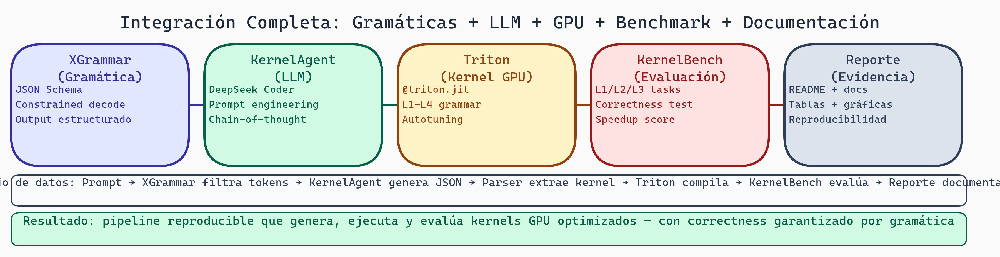

---
jupytext:
  text_representation:
    extension: .md
    format_name: myst
kernelspec:
  display_name: Python 3
  language: python
  name: python3
---

# Integración y Documentación: Cerrando el Círculo

```{code-cell} ipython3
# Setup condicional para Google Colab
import sys
if 'google.colab' in sys.modules:
    !pip install -q transformers bitsandbytes triton vllm auto-gptq datasets evaluate
    # Nota: la lista anterior puede contener librerías extra, las cuales Colab ignorará o instalará rápido.
```


```{admonition} Ejecutar en Google Colab
:class: tip

[](https://colab.research.google.com/github/salvahin/ACA-2026/blob/main/book/notebooks/10_integracion_documentacion.ipynb)
```


> **Módulo:** Project 2 - GPU Computing & Kernel Optimization
> **Semana:** 10
> **Tiempo de lectura:** ~45 minutos

---

## Introducción

Has recorrido desde conceptos básicos de GPU hasta optimización avanzada de kernels. Esta lectura final cierra el círculo: conecta el conocimiento de GPU con la generación automática de código y te guía en documentar tu trabajo profesionalmente.

---

```{admonition} Objetivos de Aprendizaje
:class: tip
Al finalizar esta lectura podrás:
- Explicar cómo gramáticas capturan restricciones de GPU (indexación válida, máscaras, atomics)
- Identificar qué es generable (patrones conocidos) vs qué requiere innovación manual
- Estructurar documentación técnica (README, API docs, experimentos, resultados)
- Garantizar reproducibilidad total (requirements, hardware specs, scripts, verificación)
- Comunicar resultados para diferentes audiencias (estudiantes, ingenieros, investigadores)
```

---

## Parte 1: Integrando Gramáticas con GPU

### El Problema Fundamental

Queremos generar kernels GPU automáticamente. Pero no queremos código aleatorio - queremos kernels **válidos y eficientes**.

```
Entrada: "Suma de vectores elemento-elemento"

Generador (CFG + LLM)
         ↓
Salida: @triton.jit
        def kernel(...): ...
```

### ¿Por Qué Gramática?

Una gramática es un **conjunto de reglas** que garantiza estructura:

```
Kernel ::= FunctionDef | LoadStore | Compute | Return
FunctionDef ::= "@triton.jit" "def kernel(" Parameters ")"
LoadStore ::= "x =" "tl.load(...)"
Compute ::= "y =" ArithmeticExpr
Return ::= "tl.store(...)"
```

La gramática **fuerza estructura**. El resultado podría ser malo, pero será **sintácticamente válido**.

### Restricciones de GPU en la Gramática

**Restricción 1: Indexación Válida**

```
IndexExpr ::= ThreadID Operator
            | BlockID Operator
            | ConstantOffset

Válido:
- program_id(axis=0) * BLOCK_SIZE + threadIdx

Inválido:
- offsets[offsets]  (indexación indirecta)
```

**Restricción 2: Máscaras en Memoria**

```
LoadExpr ::= "tl.load(" Pointer Mask ")"
Mask ::= "mask=" BooleanExpr "," "other=" DefaultValue

Válido:
- tl.load(x_ptr + offsets, mask=offsets < n, other=0.0)

Inválido (potencial out-of-bounds):
- tl.load(x_ptr + random_offset)
```

**Restricción 3: Operaciones Atómicas**

```
AtomicExpr ::= "tl.atomic_add(" Pointer Value ")"

Válido:
- tl.atomic_add(result_ptr, suma_bloque)

Inválido:
- result_ptr[0] = result_ptr[0] + suma  # Race condition
```

**Restricción 4: Reducciones Globales**

```
GlobalReduction ::= LocalReduction ThenSecondKernel

// Necesitas dos kernels:
// Kernel 1: cada bloque suma → temporales
// Kernel 2: suma los temporales
```

### Ejemplo: Gramática Simplificada para Triton

```
Program ::= Imports KernelDef WrapperFn

KernelDef ::= "@triton.jit"
              "def kernel_name(" Parameters "):"
              KernelBody

KernelBody ::= GetProgramId
              | CreateIndices
              | LoadData
              | ComputeValues
              | StoreResult

GetProgramId ::= "pid = tl.program_id(axis=" Integer ")"
CreateIndices ::= "offsets = pid * BLOCK_SIZE + tl.arange(0, BLOCK_SIZE)"
LoadData ::= "x = tl.load(x_ptr + offsets, mask=offsets < n, other=0.0)"
ComputeValues ::= Variable "=" Expression
StoreResult ::= "tl.store(y_ptr + offsets, y, mask=offsets < n)"
```

### Implicaciones

1. **Validez Garantizada**: Si restricciones están en gramática, código generado es válido
2. **Espacio Explorable**: Millones de kernels posibles pero finito y buscable
3. **Transferencia de Conocimiento**: La gramática captura patrones que funcionan

---



> **Arquitectura Integrada del Proyecto**
>
> El sistema completo conecta gramática XGrammar → LLM generador → kernels Triton → evaluación KernelBench → análisis de resultados → documentación. Cada componente retroalimenta al anterior: los errores encontrados en evaluación guían mejoras en la gramática; los resultados de análisis informan las hipótesis de la siguiente iteración.

## Parte 2: Documentación Profesional

### Estructura de Documentación

```
docs/
├── README.md                 # Punto de entrada
├── QUICKSTART.md             # Guía rápida
├── INSTALLATION.md           # Instalación
├── ARCHITECTURE.md           # Diseño del sistema
├── API.md                    # Referencia de API
├── EXPERIMENTS.md            # Diseño experimental
├── RESULTS.md                # Resultados
├── CONTRIBUTING.md           # Contribución
└── tutorials/
    ├── 01_basic_usage.md
    └── 02_custom_kernels.md
```

### README.md Efectivo

```markdown
# KernelAgent: GPU Kernel Generation

> Generación automática de kernels GPU optimizados.

## Quick Start

```bash
pip install kernelagent
```

```{code-cell} ipython3
:tags: [skip-execution]

from kernelagent import generate_kernel

kernel = generate_kernel("Implement softmax")
print(kernel)
```

## Results

| Operation | Speedup vs PyTorch |
|-----------|-------------------|
| Softmax   | 1.3x              |
| LayerNorm | 1.5x              |

## Documentation

- [Installation](docs/INSTALLATION.ipynb)
- [API Reference](docs/API.ipynb)
- [Tutorials](docs/tutorials/)

## License

MIT License
```

---

## Reproducibilidad

### Requirements

```yaml
# environment.yml
name: kernelagent
dependencies:
  - python=3.10
  - pytorch=2.1.0
  - triton=2.1.0
  - cuda-toolkit=12.1
```

```txt
# requirements.txt
torch==2.1.0+cu121
triton==2.1.0
numpy==1.24.3
```

### Hardware

```markdown
# Hardware Requirements

## Tested Configurations

| GPU | CUDA | Driver | Status |
|-----|------|--------|--------|
| A100 80GB | 12.1 | 535.104.05 | ✅ |
| RTX 4090 | 12.1 | 535.104.05 | ✅ |
| V100 32GB | 11.8 | 520.61.05 | ✅ |
```

### Script de Reproducción

```bash
#!/bin/bash
# reproduce_experiments.sh

set -e

echo "=== Reproduction Script ==="

# 1. Verify environment
echo "[1/5] Checking environment..."
python -c "import torch; print(f'PyTorch: {torch.__version__}')"
nvidia-smi --query-gpu=name,memory.total --format=csv

# 2. Download data
echo "[2/5] Downloading files..."
python scripts/download_models.py

# 3. Run baselines
echo "[3/5] Running baselines..."
python -m benchmark.run_baseline --output results/baseline

# 4. Run experiments
echo "[4/5] Running experiments..."
python -m experiments.run_all --config configs/main.yaml

# 5. Generate figures
echo "[5/5] Generating results..."
python scripts/generate_figures.py

echo "=== Done! ==="
```

### Verificación

```{code-cell} ipython3
:tags: [skip-execution]

# verify_reproduction.py

EXPECTED_RESULTS = {
    "softmax_speedup": {"value": 1.32, "tolerance": 0.05},
    "layernorm_speedup": {"value": 1.48, "tolerance": 0.05},
    "total_pass_rate": {"value": 0.87, "tolerance": 0.02},
}

def verify_results(results_path: str) -> bool:
    with open(results_path) as f:
        results = json.load(f)

    all_pass = True
    for metric, expected in EXPECTED_RESULTS.items():
        actual = results.get(metric)
        diff = abs(actual - expected["value"])

        if diff > expected["tolerance"]:
            print(f"❌ {metric}: expected {expected['value']}, got {actual}")
            all_pass = False
        else:
            print(f"✅ {metric}: {actual}")

    return all_pass
```

---

## Documentación de Código

### Docstrings Completos

```{code-cell} ipython3
:tags: [skip-execution]

def generate_kernel(
    description: str,
    model: str = "codellama-7b",
    temperature: float = 0.1,
) -> GeneratedKernel:
    """
    Generate a Triton kernel from natural language.

    Args:
        description: Natural language description.
            Example: "Implement row-wise softmax"
        model: Language model to use.
        temperature: Sampling temperature.

    Returns:
        GeneratedKernel with code and metadata.

    Raises:
        ValueError: If description is empty.
        GenerationError: If generation fails.

    Example:
        >>> kernel = generate_kernel("Implement ReLU")
        >>> print(kernel.code)
    """
    pass
```

### Type Hints

```{code-cell} ipython3
:tags: [skip-execution]

from typing import Optional, List, Dict, Callable
from dataclasses import dataclass

@dataclass
class BenchmarkResult:
    """Results from benchmarking a kernel."""
    mean_time_ms: float
    std_time_ms: float
    throughput_gbps: float
    samples: int

def benchmark_kernel(
    kernel: Callable,
    inputs: List[torch.Tensor],
    *,
    warmup: int = 10,
    iterations: int = 100,
) -> BenchmarkResult:
    """Benchmark a Triton kernel."""
    pass
```

---

## Reporte Final

### Estructura del Reporte

```markdown
# Grammar-Constrained GPU Kernel Generation
## Final Project Report

### Abstract
[150-200 words]

### 1. Introduction
- Problem statement
- Motivation
- Objectives

### 2. Background
- GPU architecture
- Triton programming
- Grammar-constrained generation

### 3. Methodology
- System architecture
- Grammar design
- Evaluation framework

### 4. Implementation
- Key components
- Technical decisions

### 5. Experiments
- Setup
- Baselines
- Results

### 6. Analysis
- Performance
- Errors
- Ablations

### 7. Discussion
- Findings
- Limitations
- Future work

### 8. Conclusion
[Summary]

### References

### Appendix
- A: Grammar specification
- B: Full results
```

### Checklist de Entrega

```markdown
# Project Submission Checklist

## Code
- [ ] All code committed
- [ ] Tests passing (>80% coverage)
- [ ] Code documented
- [ ] README complete
- [ ] Dependencies locked

## Documentation
- [ ] Architecture documented
- [ ] API reference complete
- [ ] Tutorials included

## Experiments
- [ ] Configs in repository
- [ ] Results reproducible
- [ ] Raw data archived

## Report
- [ ] All sections written
- [ ] Figures high quality
- [ ] References complete
```

---

## Cierre del Círculo

```{admonition} Resumen Final del Módulo
:class: important
**Tu viaje de aprendizaje (10 semanas):**

**Fundamentos (Semanas 1-3)**:
- GPU arquitectura: SIMT, warps, jerarquía de memoria
- CUDA y PyTorch: Indexación, coalescing, streams
- Optimización de memoria: Tiling, bank conflicts, roofline

**Implementación (Semanas 4-5)**:
- Triton completo: Filosofía "bloques", API, reducciones
- Patrones avanzados: Autotuning, ocupancia, optimizaciones específicas

**Evaluación (Semanas 6-8)**:
- KernelBench: Niveles L1-L4, estrategias de selección
- Debugging: Taxonomía de errores, metodología sistemática
- Benchmarking: Baselines, significancia estadística, CI/CD

**Análisis (Semanas 9-10)**:
- Visualización: Comunicar resultados efectivamente
- Integración: Gramáticas + restricciones GPU
- Documentación: Reproducibilidad total

**Ahora entiendes:**
✓ Por qué ciertas restricciones (máscaras, coalescing) son fundamentales
✓ Cómo una gramática captura patrones válidos de GPU
✓ Qué patrones son generables vs cuáles requieren innovación
✓ Cómo evaluar kernels rigurosamente (correctitud + performance)
✓ Cómo documentar para que otros puedan reproducir y extender
```

```{admonition} 🎯 Aplicación en tu Proyecto Final
:class: note
**Componentes de tu sistema de generación:**

1. **Gramática**: Captura restricciones GPU
   - Indexación válida: `pid * BLOCK + arange(BLOCK)`
   - Máscaras obligatorias: `load(..., mask=offsets<n)`
   - Atomics para race conditions

2. **Corpus**: Biblioteca de patrones
   - L1: Templates elementwise (add, mul, relu)
   - L2: Templates reducciones (sum, softmax)
   - L3: Templates complejos (matmul, layernorm)

3. **Evaluación**: Pipeline automático
   - Correctitud: vs PyTorch reference
   - Performance: Speedup + significancia estadística
   - Debugging: Clasificación automática de errores

4. **Documentación**: Reproducibilidad
   - README con quickstart
   - Experimentos reproducibles
   - Resultados con visualizaciones

**Tu contribución**: Automatizar la generación de kernels GPU que antes requerían expertise manual.
```

```{admonition} ✅ Checklist de Entrega Final
:class: tip
**Código** (40%):
- [ ] Generador funcional (gramática + LLM/templates)
- [ ] Tests passing (>80% coverage)
- [ ] README con instalación y quickstart
- [ ] Dependencias documentadas

**Experimentos** (30%):
- [ ] Baseline establecido para cada operación
- [ ] Resultados en KernelBench (L1-L3 mínimo)
- [ ] Análisis estadístico con significancia
- [ ] Reproducibilidad verificada

**Reporte** (30%):
- [ ] Metodología clara
- [ ] Resultados con visualizaciones
- [ ] Análisis de errores (taxonomía aplicada)
- [ ] Conclusiones y trabajo futuro
- [ ] Referencias completas
```

---

## Lo que Aprendiste

1. **Arquitectura GPU**: SIMT, warps, jerarquía de memoria
2. **Triton**: Escribir y optimizar kernels
3. **Patrones**: Tiling, reducciones, coalescing
4. **Evaluación**: Benchmarks, experimentos A/B/C/D
5. **Integración**: Cómo gramáticas restringen generación

---

## Reflexión Final

La programación GPU es difícil porque el hardware es diferente. Pero una vez que lo entiendes, es increíblemente gratificante. Un kernel bien escrito puede procesar gigabytes de datos en milisegundos.

**Lo próximo:**
- Implementa kernels en KernelBench
- Optimiza hasta que no puedas más
- Lee código de librerías (cuBLAS, cuDNN)
- Contribuye a proyectos open source
- Enseña a otros

¡Éxito!

---

*Esta lectura concluye el curso "Grammar-Constrained GPU Kernel Generation" - ACA*

---

## Referencias

- NumPy. [NumPy Documentation](https://numpy.org/doc/). NumPy.
- PyTorch. [PyTorch Documentation](https://pytorch.org/docs/). PyTorch.
- XGrammar. [Efficient, Flexible and Portable Structured Generation](https://github.com/mlc-ai/xgrammar). GitHub.
- Triton. [Triton Language and Compiler](https://github.com/triton-lang/triton). GitHub.
