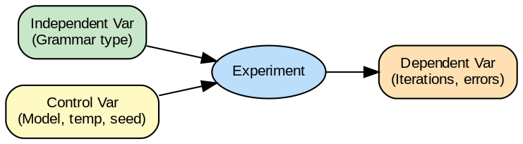

---
jupytext:
  text_representation:
    extension: .md
    format_name: myst
kernelspec:
  display_name: Python 3
  language: python
  name: python3
---

# Power Analysis y Diseño Experimental

```{admonition} Ejecutar en Google Colab
:class: tip

[](https://colab.research.google.com/github/salvahin/ACA-2026/blob/main/book/notebooks/04-poweranalysis-diseno.ipynb)
```

```{code-cell} ipython3
:tags: [remove-input, setup]

# Setup Colab Environment
!pip install -q numpy pandas matplotlib seaborn scikit-learn torch transformers accelerate triton
print('Dependencies installed!')
```
## Semana 4 - Estadística para Generación de Kernels GPU

```{admonition} Objetivos de Aprendizaje
:class: tip
Al finalizar esta lectura podrás:
- Calcular el tamaño muestral necesario usando power analysis
- Distinguir entre diseños within-subjects y between-subjects
- Identificar variables independientes, dependientes y de control
- Calcular y reportar poder estadístico de tus pruebas
- Diseñar experimentos balanceados y contrabalanceados
```

```{admonition} 🎬 Video Recomendado
:class: tip

**[StatQuest: Statistical Power](https://www.youtube.com/watch?v=Rsc5znwR5FA)** - Explicación visual de qué es el poder estadístico, cómo calcularlo, y por qué es crucial para diseñar experimentos antes de recolectar datos.
```

Aquí es donde la planificación científica se convierte en poder estadístico. Antes de ejecutar tu experimento, necesitas saber: **¿Cuántas muestras necesito para detectar un efecto que me importa?** Eso es power analysis.

## Conceptos Fundamentales del Diseño

### Variables Independientes y Dependientes

Una **variable independiente (IV)** es lo que tú manipulas. En tu proyecto:
- IV: Tipo de decoding (baseline vs. con restricciones gramaticales)
- IV: Temperatura del LLM (0.0 vs. 0.5)
- IV: Arquitectura del kernel (simple vs. compleja)

Una **variable dependiente (DV)** es lo que mides como resultado:
- DV: Número de kernels válidos (compilables)
- DV: Iteraciones hasta convergencia
- DV: Tiempo de ejecución
- DV: Consumo de memoria

**Variables de control** son factores que intentas mantener constantes:
- Mismo LLM base (ej. GPT-3.5)
- Mismo hardware
- Mismos prompts de instrucción
- Mismo conjunto de kernels de prueba

Controlar variables de confusión mejora tu capacidad de atribuir resultados a tu IV.

## Diseños Experimentales: Las Cuatro Configuraciones




***Figura 1:** Proceso del diseño experimental desde hipótesis hasta conclusiones.*

### Configuración A: Between-Subjects, Simple

Diferentes participantes/muestras experimentan diferentes condiciones.

```
Grupo 1 (Baseline): 50 kernels generados con baseline
↓ Mide: tasa de validez

Grupo 2 (Restricciones): 50 kernels generados con restricciones
↓ Mide: tasa de validez

Compare grupos
```

**Ventajas**: Simple, menos riesgo de sesgo por aprendizaje
**Desventajas**: Necesitas más muestras, mayor variación entre grupos

### Configuración B: Within-Subjects, Simple

Los mismos kernels se generan con ambos métodos.

```
Set de 50 kernels
↓
Genera con Baseline → mide: validez A
↓
Genera con Restricciones → mide: validez B
↓
Compara A vs B para cada kernel
```

**Ventajas**: Controlas variabilidad del kernel, necesitas menos muestras
**Desventajas**: Riesgo de orden/aprendizaje, el segundo intento puede ser diferente

### Configuración C: Múltiples Factores, Between-Subjects

```
         Restricciones: No | Restricciones: Sí
Temp=0   Grupo 1 (n=20)  | Grupo 3 (n=20)
Temp=0.5 Grupo 2 (n=20)  | Grupo 4 (n=20)

Total: 80 muestras
```

Mides efectos de:
- Restricciones (promedio Grupo 1&2 vs. Grupo 3&4)
- Temperatura (promedio Grupo 1&3 vs. Grupo 2&4)
- **Interacción**: ¿El efecto de restricciones depende de temperatura?

**Ventaja**: Eficiente, obtiene múltiples efectos
**Desventaja**: Más complejo de analizar

### Configuración D: Múltiples Factores, Within-Subjects

Los mismos kernels experimentan todas las combinaciones.

```
50 kernels
↓
Cada kernel se genera 4 veces:
- Baseline, Temp=0
- Baseline, Temp=0.5
- Restricciones, Temp=0
- Restricciones, Temp=0.5
```

**Ventaja**: Máximo control, necesitas menos kernels
**Desventaja**: Riesgo de orden/fatiga, complejidad analítica

## Power Analysis

```{admonition} 🎮 Calculadora Interactiva de Poder Estadístico
:class: tip

Visualiza la relación entre n, α, poder y tamaño del efecto:

<iframe src="https://rpsychologist.com/d3/nhst/" width="100%" height="650px" style="border:1px solid #ddd; border-radius:8px;"></iframe>

*Mueve los sliders para ver cómo cambian las distribuciones bajo H₀ y H₁.*
```

**El poder** es tu capacidad de detectar un efecto real cuando existe.

```
Poder = 1 - β

β = probabilidad de Error Tipo II (no detectar cuando existe)
```

Típicamente buscamos poder ≥ 0.80, significando 80% de probabilidad de detectar un efecto real.

:::{figure} diagrams/power_vs_n.png
:name: fig-power-vs-n
:alt: Gráfico mostrando relación entre tamaño muestral y poder estadístico
:align: center
:width: 90%

**Figura 6:** Relación entre tamaño muestral y poder estadístico en análisis de potencia.
:::

### Factores que Afectan el Poder

1. **Tamaño del efecto (d)**: Qué tan grande es la diferencia que esperas
2. **Tamaño muestral (n)**: Cuántas observaciones tienes
3. **Nivel de significancia (α)**: Tu umbral de p-valor
4. **Dirección de la prueba**: Una cola vs. dos colas

### Ejemplo: Calculando Tamaño Muestral Requerido

Quieres comparar tasa de validez:
- Baseline: esperas 75% validez
- Con restricciones: esperas 85% validez
- Diferencia esperada: 10 puntos porcentuales
- Quieres poder = 0.80, α = 0.05

Usando fórmulas o software (G*Power):

```
n = 240 por grupo (480 total)
```

Significa que necesitas 240 intentos con baseline y 240 con restricciones.

Si n = 100 por grupo:
```
Poder resultante ≈ 0.45
```

Muy bajo. Solo 45% de probabilidad de detectar tu efecto de 10%.

**Insight**: Detectar pequeñas diferencias (2-5%) requiere muestras grandes. Diferencias grandes (15-20%) requieren menos.

```{code-cell} ipython3
import numpy as np
import matplotlib.pyplot as plt
from scipy import stats
import seaborn as sns

# Función para calcular tamaño muestral requerido (aproximación)
def calcular_n_requerido(p1, p2, alpha=0.05, power=0.80):
    """
    Calcula tamaño muestral requerido para comparar dos proporciones
    """
    # Z-scores
    z_alpha = stats.norm.ppf(1 - alpha/2)  # dos colas
    z_beta = stats.norm.ppf(power)

    # Proporción promedio
    p_avg = (p1 + p2) / 2

    # Fórmula aproximada
    n = ((z_alpha * np.sqrt(2 * p_avg * (1 - p_avg)) +
          z_beta * np.sqrt(p1*(1-p1) + p2*(1-p2))) / (p1 - p2))**2

    return int(np.ceil(n))

# Parámetros del ejemplo
p_baseline = 0.75
p_restricciones = 0.85
diferencia = p_restricciones - p_baseline

print("Power Analysis: Comparación de Tasas de Validez")
print("=" * 60)
print(f"Baseline: esperamos {p_baseline:.0%} validez")
print(f"Restricciones: esperamos {p_restricciones:.0%} validez")
print(f"Diferencia esperada: {diferencia:.0%} ({diferencia*100:.0f} puntos porcentuales)")
print(f"\nParámetros:")
print(f"  α (nivel de significancia) = 0.05")
print(f"  Poder objetivo = 0.80")

# Calcular tamaño muestral
n_requerido = calcular_n_requerido(p_baseline, p_restricciones)
print(f"\nTamaño muestral requerido: n = {n_requerido} por grupo")
print(f"Total de muestras: {n_requerido * 2}")

# Calcular poder con diferentes tamaños muestrales
tamanios = np.arange(50, 500, 10)
poderes = []

for n in tamanios:
    # Estadístico de prueba bajo H1
    se = np.sqrt(p_baseline*(1-p_baseline)/n + p_restricciones*(1-p_restricciones)/n)
    z = diferencia / se

    # Poder = P(rechazar H0 | H1 es verdadera)
    z_crit = stats.norm.ppf(0.975)  # crítico para α=0.05 dos colas
    poder = 1 - stats.norm.cdf(z_crit - z)
    poderes.append(poder)

poderes = np.array(poderes)

# Visualización
fig, axes = plt.subplots(2, 2, figsize=(14, 10))

# 1. Poder vs Tamaño Muestral
axes[0, 0].plot(tamanios, poderes, 'b-', linewidth=2)
axes[0, 0].axhline(0.80, color='red', linestyle='--', linewidth=2,
                   label='Poder objetivo = 0.80')
axes[0, 0].axvline(n_requerido, color='green', linestyle='--', linewidth=2,
                   label=f'n requerido = {n_requerido}')
axes[0, 0].fill_between(tamanios, 0, poderes, where=(poderes >= 0.80),
                        alpha=0.3, color='green', label='Poder adecuado')
axes[0, 0].fill_between(tamanios, 0, poderes, where=(poderes < 0.80),
                        alpha=0.3, color='red', label='Poder insuficiente')

axes[0, 0].set_xlabel('Tamaño muestral por grupo (n)')
axes[0, 0].set_ylabel('Poder estadístico (1-β)')
axes[0, 0].set_title('Curva de Poder: Tamaño Muestral vs Poder')
axes[0, 0].legend()
axes[0, 0].grid(alpha=0.3)

# Anotar punto de interés
idx_80 = np.argmin(np.abs(poderes - 0.80))
axes[0, 0].plot(tamanios[idx_80], 0.80, 'ro', markersize=10)
axes[0, 0].text(tamanios[idx_80] + 20, 0.80,
                f'({tamanios[idx_80]}, 0.80)',
                fontsize=10, bbox=dict(boxstyle='round', facecolor='yellow'))

# 2. Poder vs Tamaño del Efecto
diferencias_test = np.arange(0.02, 0.30, 0.01)
n_fixed = 100

poderes_efecto = []
for diff in diferencias_test:
    p2 = p_baseline + diff
    se = np.sqrt(p_baseline*(1-p_baseline)/n_fixed + p2*(1-p2)/n_fixed)
    z = diff / se
    z_crit = stats.norm.ppf(0.975)
    poder = 1 - stats.norm.cdf(z_crit - z)
    poderes_efecto.append(poder)

axes[0, 1].plot(diferencias_test * 100, poderes_efecto, 'b-', linewidth=2)
axes[0, 1].axhline(0.80, color='red', linestyle='--', linewidth=2,
                   label='Poder = 0.80')
axes[0, 1].axvline(diferencia * 100, color='green', linestyle='--', linewidth=2,
                   label=f'Diferencia esperada = {diferencia*100:.0f}%')

axes[0, 1].set_xlabel('Tamaño del Efecto (diferencia en %)')
axes[0, 1].set_ylabel('Poder estadístico')
axes[0, 1].set_title(f'Curva de Poder: Tamaño del Efecto (n={n_fixed} fijo)')
axes[0, 1].legend()
axes[0, 1].grid(alpha=0.3)

# 3. Trade-off: α vs Poder
alphas = np.arange(0.01, 0.20, 0.01)
poderes_alpha = []

for alpha in alphas:
    z_crit = stats.norm.ppf(1 - alpha/2)
    se = np.sqrt(p_baseline*(1-p_baseline)/n_requerido +
                 p_restricciones*(1-p_restricciones)/n_requerido)
    z = diferencia / se
    poder = 1 - stats.norm.cdf(z_crit - z)
    poderes_alpha.append(poder)

axes[1, 0].plot(alphas, poderes_alpha, 'b-', linewidth=2)
axes[1, 0].axhline(0.80, color='red', linestyle='--', alpha=0.5)
axes[1, 0].axvline(0.05, color='green', linestyle='--', linewidth=2,
                   label='α estándar = 0.05')

axes[1, 0].set_xlabel('Nivel de significancia (α)')
axes[1, 0].set_ylabel('Poder estadístico (1-β)')
axes[1, 0].set_title(f'Trade-off α vs Poder (n={n_requerido})')
axes[1, 0].legend()
axes[1, 0].grid(alpha=0.3)

# 4. Tabla resumen de escenarios
escenarios = [
    ('Pequeño', 0.05, 620),
    ('Mediano', 0.10, 155),
    ('Grande', 0.15, 69),
    ('Muy Grande', 0.20, 39)
]

categorias = [e[0] for e in escenarios]
diferencias_esc = [e[1] * 100 for e in escenarios]
n_req = [e[2] for e in escenarios]

x_pos = np.arange(len(categorias))
bars = axes[1, 1].bar(x_pos, n_req, color=['red', 'orange', 'yellow', 'green'],
                      alpha=0.7, edgecolor='black', linewidth=2)

axes[1, 1].set_ylabel('Tamaño muestral requerido (n por grupo)')
axes[1, 1].set_title('Tamaño Muestral vs Tamaño del Efecto\n(α=0.05, poder=0.80)')
axes[1, 1].set_xticks(x_pos)
axes[1, 1].set_xticklabels([f'{cat}\n(Δ={diff:.0f}%)'
                            for cat, diff in zip(categorias, diferencias_esc)])
axes[1, 1].set_yscale('log')
axes[1, 1].grid(axis='y', alpha=0.3, which='both')

for i, (bar, n) in enumerate(zip(bars, n_req)):
    height = bar.get_height()
    axes[1, 1].text(bar.get_x() + bar.get_width()/2., height * 1.2,
                    f'n={n}',
                    ha='center', va='bottom', fontweight='bold', fontsize=10)

plt.tight_layout()
plt.show()

print("\nTabla de Tamaños Muestrales Requeridos:")
print("-" * 60)
print(f"{'Tamaño Efecto':<15} {'Diferencia':<12} {'n por grupo':<12} {'Total'}")
print("-" * 60)
for cat, diff, n in escenarios:
    print(f"{cat:<15} {diff*100:>6.0f}%        {n:>6}        {n*2:>6}")

print("\nConclusión:")
print("  - Efectos pequeños requieren MUCHAS muestras")
print("  - Efectos grandes requieren menos muestras")
print("  - Siempre hacer power analysis ANTES de recolectar datos")
```

## Tamaño del Efecto

El tamaño del efecto cuantifica la magnitud de una diferencia.

### Cohen's d (para variables continuas)

```
d = (μ₁ - μ₂) / σ_pooled

Donde σ_pooled = √[((n₁-1)s₁² + (n₂-1)s₂²) / (n₁+n₂-2)]
```

Interpretación:
- d = 0.2: efecto pequeño
- d = 0.5: efecto mediano
- d = 0.8: efecto grande

Ejemplo: Baseline toma 5.0s ± 1.2s, Restricciones toma 4.2s ± 1.1s

```
d = (5.0 - 4.2) / √[((29×1.2² + 29×1.1²) / 58)]
  = 0.8 / 1.15
  ≈ 0.70 (mediano a grande)
```

### Diferencia Proporcional (para conteos)

Para tasa de validez:

```
p₁ = 0.75 (75% baseline)
p₂ = 0.85 (85% restricciones)
h = 2 × arcsin(√p₂) - 2 × arcsin(√p₁)
  ≈ 0.42 (mediano)
```

```{code-cell} ipython3
import numpy as np
import matplotlib.pyplot as plt
from scipy import stats

# Función para calcular Cohen's d
def cohens_d(mean1, mean2, std1, std2, n1, n2):
    """Calcula Cohen's d para dos muestras"""
    pooled_std = np.sqrt(((n1-1)*std1**2 + (n2-1)*std2**2) / (n1 + n2 - 2))
    d = (mean1 - mean2) / pooled_std
    return d

# Función para calcular h de Cohen (para proporciones)
def cohens_h(p1, p2):
    """Calcula h de Cohen para dos proporciones"""
    h = 2 * (np.arcsin(np.sqrt(p2)) - np.arcsin(np.sqrt(p1)))
    return h

print("Tamaño del Efecto: Cuantificando la Magnitud de Diferencias")
print("=" * 60)

# Ejemplo 1: Cohen's d (variables continuas)
print("\n1. Cohen's d (Variables Continuas)")
print("-" * 60)
mean_baseline = 5.0
std_baseline = 1.2
mean_restricciones = 4.2
std_restricciones = 1.1
n1 = n2 = 30

d = cohens_d(mean_baseline, mean_restricciones,
             std_baseline, std_restricciones, n1, n2)

print(f"Baseline: μ = {mean_baseline:.1f}s, σ = {std_baseline:.1f}s")
print(f"Restricciones: μ = {mean_restricciones:.1f}s, σ = {std_restricciones:.1f}s")
print(f"Diferencia: {mean_baseline - mean_restricciones:.1f}s")
print(f"Cohen's d = {d:.3f}")

if abs(d) < 0.2:
    interpretacion = "trivial/despreciable"
elif abs(d) < 0.5:
    interpretacion = "pequeño"
elif abs(d) < 0.8:
    interpretacion = "mediano"
else:
    interpretacion = "grande"

print(f"Interpretación: Efecto {interpretacion}")

# Ejemplo 2: Cohen's h (proporciones)
print("\n2. Cohen's h (Proporciones)")
print("-" * 60)
p1 = 0.75
p2 = 0.85
h = cohens_h(p1, p2)

print(f"Baseline: p₁ = {p1:.2f} (75% validez)")
print(f"Restricciones: p₂ = {p2:.2f} (85% validez)")
print(f"Cohen's h = {h:.3f}")

if abs(h) < 0.2:
    interp_h = "pequeño"
elif abs(h) < 0.5:
    interp_h = "mediano"
else:
    interp_h = "grande"

print(f"Interpretación: Efecto {interp_h}")

# Visualización
fig, axes = plt.subplots(2, 2, figsize=(14, 10))

# 1. Visualización de Cohen's d
x = np.linspace(-2, 10, 1000)
dist1 = stats.norm.pdf(x, mean_baseline, std_baseline)
dist2 = stats.norm.pdf(x, mean_restricciones, std_restricciones)

axes[0, 0].plot(x, dist1, 'r-', linewidth=2, label=f'Baseline (μ={mean_baseline})')
axes[0, 0].plot(x, dist2, 'b-', linewidth=2, label=f'Restricciones (μ={mean_restricciones})')
axes[0, 0].fill_between(x, 0, dist1, alpha=0.3, color='red')
axes[0, 0].fill_between(x, 0, dist2, alpha=0.3, color='blue')

axes[0, 0].axvline(mean_baseline, color='red', linestyle='--', linewidth=2)
axes[0, 0].axvline(mean_restricciones, color='blue', linestyle='--', linewidth=2)

# Anotar Cohen's d
axes[0, 0].annotate('', xy=(mean_restricciones, max(dist1)/2),
                    xytext=(mean_baseline, max(dist1)/2),
                    arrowprops=dict(arrowstyle='<->', color='green', lw=2))
axes[0, 0].text((mean_baseline + mean_restricciones)/2, max(dist1)/2 + 0.02,
                f'd = {d:.2f}\n({interpretacion})',
                ha='center', fontsize=10, fontweight='bold',
                bbox=dict(boxstyle='round', facecolor='yellow'))

axes[0, 0].set_xlabel('Tiempo de compilación (s)')
axes[0, 0].set_ylabel('Densidad de Probabilidad')
axes[0, 0].set_title("Cohen's d: Visualización del Tamaño del Efecto")
axes[0, 0].legend()
axes[0, 0].grid(alpha=0.3)

# 2. Diferentes tamaños de efecto
efectos_d = [0.2, 0.5, 0.8, 1.2]
colores = ['lightblue', 'lightgreen', 'yellow', 'orange']
nombres = ['Pequeño', 'Mediano', 'Grande', 'Muy Grande']

for d_val, color, nombre in zip(efectos_d, colores, nombres):
    mu2 = 5 - d_val  # centrar en 5, mover por d
    dist = stats.norm.pdf(x, mu2, 1)
    axes[0, 1].plot(x, dist, linewidth=2, label=f'{nombre} (d={d_val})')

dist_ref = stats.norm.pdf(x, 5, 1)
axes[0, 1].plot(x, dist_ref, 'k--', linewidth=2, label='Referencia (μ=5)')

axes[0, 1].set_xlabel('Valor')
axes[0, 1].set_ylabel('Densidad')
axes[0, 1].set_title("Comparación de Tamaños de Efecto (Cohen's d)")
axes[0, 1].legend()
axes[0, 1].grid(alpha=0.3)

# 3. Proporciones y Cohen's h
proporciones = np.linspace(0.1, 0.9, 50)
h_values = [cohens_h(0.5, p) for p in proporciones]

axes[1, 0].plot(proporciones * 100, h_values, 'b-', linewidth=2)
axes[1, 0].axhline(0, color='gray', linestyle='-', linewidth=1)
axes[1, 0].axhline(0.2, color='orange', linestyle='--', alpha=0.5, label='h=0.2 (pequeño)')
axes[1, 0].axhline(0.5, color='yellow', linestyle='--', alpha=0.5, label='h=0.5 (mediano)')
axes[1, 0].axhline(0.8, color='red', linestyle='--', alpha=0.5, label='h=0.8 (grande)')

axes[1, 0].axvline(p1 * 100, color='red', linestyle=':', linewidth=2)
axes[1, 0].axvline(p2 * 100, color='blue', linestyle=':', linewidth=2)

axes[1, 0].set_xlabel('Proporción p₂ (%)')
axes[1, 0].set_ylabel("Cohen's h")
axes[1, 0].set_title(f"Cohen's h para Proporciones\n(Referencia p₁ = 50%)")
axes[1, 0].legend()
axes[1, 0].grid(alpha=0.3)

# 4. Tabla de interpretaciones
categorias = ['d/h', 'Interpretación', 'Overlap', '% no-overlap']
pequeño = ['0.2', 'Pequeño', '85%', '15%']
mediano = ['0.5', 'Mediano', '67%', '33%']
grande = ['0.8', 'Grande', '53%', '47%']
muy_grande = ['1.2', 'Muy Grande', '38%', '62%']

tabla_data = [pequeño, mediano, grande, muy_grande]

axes[1, 1].axis('tight')
axes[1, 1].axis('off')
table = axes[1, 1].table(cellText=tabla_data,
                         colLabels=categorias,
                         cellLoc='center',
                         loc='center',
                         colWidths=[0.2, 0.3, 0.25, 0.25])

table.auto_set_font_size(False)
table.set_fontsize(10)
table.scale(1, 2.5)

# Colorear filas
colores_filas = ['lightblue', 'lightgreen', 'yellow', 'orange']
for i, color in enumerate(colores_filas):
    for j in range(len(categorias)):
        table[(i+1, j)].set_facecolor(color)

# Header
for i in range(len(categorias)):
    table[(0, i)].set_facecolor('#4CAF50')
    table[(0, i)].set_text_props(weight='bold', color='white')

axes[1, 1].set_title("Guía de Interpretación del Tamaño del Efecto",
                     fontsize=12, fontweight='bold', pad=20)

plt.tight_layout()
plt.show()

print("\nGuía de Interpretación:")
print("-" * 60)
print("Cohen's d / h    Tamaño        Interpretación")
print("-" * 60)
print("< 0.2            Trivial       Prácticamente insignificante")
print("0.2 - 0.5        Pequeño       Detectable pero pequeño")
print("0.5 - 0.8        Mediano       Moderadamente importante")
print("≥ 0.8            Grande        Muy importante")
print("\nNota: Estos son lineamientos generales. La importancia práctica")
print("depende del contexto de tu aplicación.")
```

## Órdenes y Contrabalanceo

En diseños within-subjects, el **orden importa**.

Si ejecutas "Baseline primero, luego Restricciones", podrías ver:
- **Efecto de aprendizaje**: El segundo intento se beneficia del primero
- **Efecto de fatiga**: El segundo intento es peor porque el modelo está "cansado"
- **Efecto de sesgo**: El modelo recuerda lo que hizo antes

### Solución: Contrabalanceo

```
Mitad de participantes: Baseline → Restricciones
Otra mitad: Restricciones → Baseline
```

Esto distribuye cualquier efecto de orden entre condiciones.

Para múltiples condiciones (>2), usa **cuadrado latino**:

```
Participante 1: A → B → C
Participante 2: B → C → A
Participante 3: C → A → B
```

Cada condición aparece en cada posición exactamente una vez.

## Validez Interna vs. Externa

### Validez Interna

¿Tus resultados se deben realmente a tu variable independiente, o a algo más?

**Amenazas**:
- **Confusión**: Variable no controlada correlaciona con IV
- **Selección sesgada**: Cómo eliges muestras afecta resultados
- **Maduración**: Los participantes cambian con el tiempo
- **Artefactos experimentales**: Comportamiento artificial en el laboratorio

En tu proyecto:
- ¿Usas el mismo LLM/versión para ambas condiciones?
- ¿Los kernels de prueba son representativos?
- ¿Hay cambios en el código entre ejecuciones que podrían confundir?

### Validez Externa

¿Tus resultados generalizan más allá de tu experimento?

**Amenazas**:
- **Especificidad de población**: Solo estudiantes en la clase
- **Especificidad de contexto**: Solo en un sistema específico
- **Especificidad de operacionalización**: Solo con esta implementación de restricciones

En tu proyecto:
- ¿Tus restricciones son generales o específicas para GPUs?
- ¿Generalizaría a otros LLMs?
- ¿Generalizaría a otros tipos de kernels?

## Plan Experimental Robusto

Aquí hay un plan general para tu proyecto:

```
1. ESPECIFICA
   - IV: Decoding method (baseline vs. restricciones)
   - DV: Tasa de validez, iteraciones, tiempo
   - Controles: Mismo LLM, mismo dataset, mismo hardware
   - α = 0.05, poder objetivo = 0.80

2. POWER ANALYSIS
   - Esperas diferencia de 10% en validez
   - Usas G*Power: necesitas n=240 por grupo

3. DISEÑO
   - Within-subjects (mismo kernels ambos métodos)
   - Contrabalanceo: mitad baseline primero, mitad restricciones primero
   - Total: 240 kernels × 2 métodos = 480 ejecuciones

4. RECOLECTA DATOS
   - Controla orden
   - Registra todas las variables de interés

5. ANALIZA
   - Prueba de hipótesis de dos muestras pareadas
   - Reporta p-valor, efecto tamaño, IC 95%

6. INTERPRETA
   - ¿Significante y prácticamente importante?
```

## Ejercicios y Reflexión

### Ejercicio 1: Identifica Variables
Para tu proyecto, especifica:
- ¿Cuáles son tus IVs?
- ¿Cuáles son tus DVs?
- ¿Qué variables de control necesitas?

### Ejercicio 2: Elige Diseño
¿Cuál configuración es mejor para tu proyecto (A/B/C/D)? Justifica:
- ¿Ventajas del tuyo?
- ¿Desventajas?
- ¿Cómo controlarías confusores?

### Ejercicio 3: Power Analysis
Supongamos:
- Esperas Cohen's d = 0.6
- α = 0.05, dos colas
- Poder = 0.80

¿Cuál es el tamaño muestral requerido?

(Usa online calculator de G*Power si no lo sabes)

### Ejercicio 4: Validez
Para tu diseño experimental:
- ¿Cuáles son 3 amenazas a validez interna? ¿Cómo las mitigas?
- ¿Cuáles son 3 amenazas a validez externa?

### Reflexión
1. **Trade-offs**: Si aumentas poder a 0.95 (vs. 0.80), ¿cómo cambia tu n requerido? ¿Vale la pena?
2. **Efectos prácticos vs. estadísticos**: Si encuentras p<0.001 pero el efecto es d=0.15, ¿es tu método mejor realmente?
3. **Orden**: ¿Cómo planificarías contrabalanceo en tu proyecto? ¿Es feasible?

---

**Próxima semana**: Veremos cómo hacer que nuestros experimentos sean reproducibles controlando la aleatoriedad y documentando bien.

---

## Referencias

- Cohen, J. (1988). [Statistical Power Analysis for the Behavioral Sciences](https://www.routledge.com/Statistical-Power-Analysis-for-the-Behavioral-Sciences/Cohen/p/book/9780805802832) (2nd ed.). Routledge.
- Cohen, J. (1992). [A Power Primer](https://doi.org/10.1037/0033-2909.112.1.155). Psychological Bulletin.
- Campbell, D. & Stanley, J. (1963). Experimental and Quasi-Experimental Designs for Research. Houghton Mifflin.
