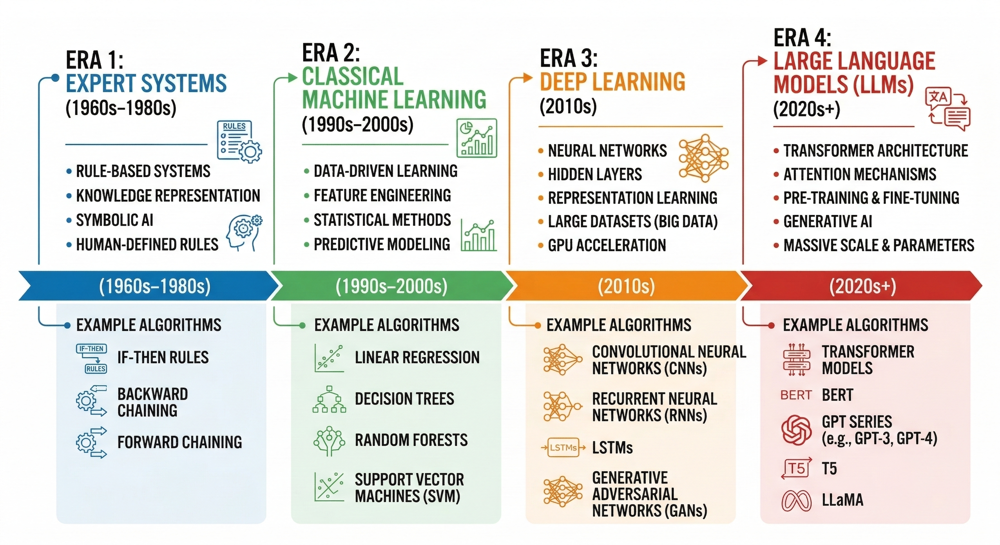
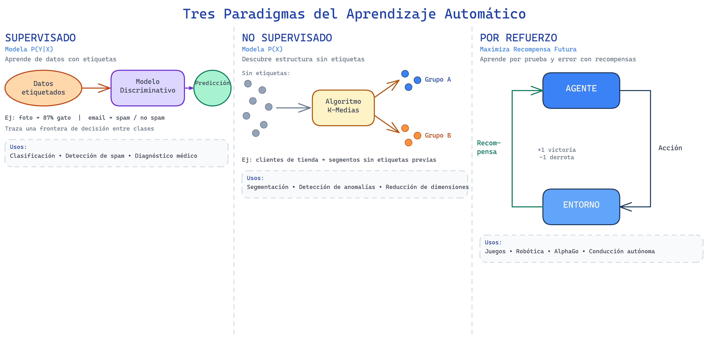
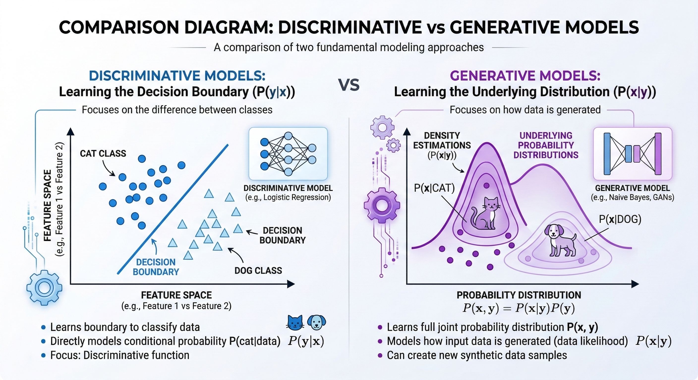
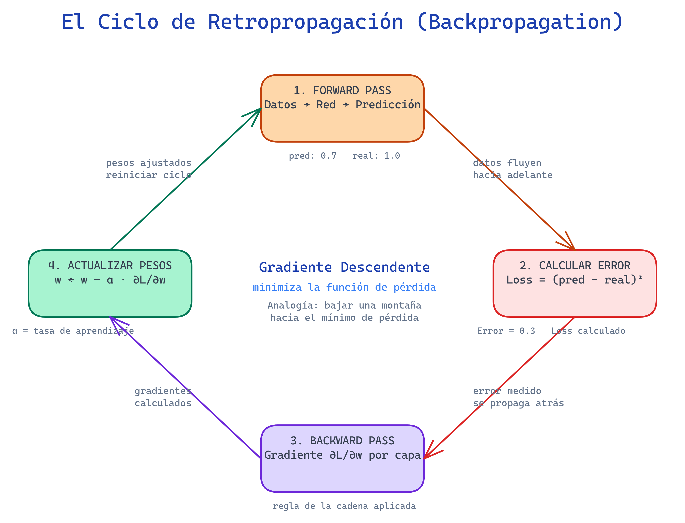

# Lectura 1: IA Clásica vs Generativa

## Contexto
En esta lectura comprenderás la evolución de la IA desde sistemas basados en reglas hasta modelos generativos modernos. Aprenderás las diferencias entre paradigmas discriminativos y generativos, y cuándo aplicar cada enfoque.

## Introducción

Imagina que quieres construir un sistema inteligente. Hace 50 años, los investigadores tenían una idea clara: *codifiquemos las reglas del sentido común directamente en la máquina*. Si querías un sistema que diagnosticara enfermedades, le escribías reglas: "Si el paciente tiene fiebre Y tos Y radiografía anormal, entonces probablemente tiene neumonía."

Ese enfoque funcionaba para problemas simples, pero se topaba con una pared: ¿qué pasa cuando las reglas son demasiado complejas para escribir explícitamente? ¿Cómo codificas el patrón visual que distingue un gato de un perro?

En esta lectura exploraremos cómo la IA ha evolucionado desde ese primer enfoque de **reglas explicitas** hasta los **modelos generativos** modernos como ChatGPT. Veremos que cada enfoque responde a la pregunta: "¿Cómo podemos hacer que las máquinas aprendan?"

---

## Parte 1: El Viaje del Aprendizaje Automático

### Era 1: Sistemas Expertos (1960s-1980s)


### Timeline: Evolución de la IA



> **Visualización: Las Cuatro Eras de la Inteligencia Artificial**
>
> El diagrama anterior traza la evolución de la IA a través de cuatro eras distintas, cada una impulsada por preguntas y tecnologías diferentes. Observa cómo **Era 1 (Sistemas Expertos)** buscaba codificar reglas explícitas, mientras que **Era 2 (Aprendizaje Automático Clásico)** cambió el paradigma hacia el descubrimiento automático de patrones. **Era 3 (Aprendizaje Profundo)** revolucionó el campo permitiendo representaciones jerárquicas complejas, y finalmente **Era 4 (Modelos de Lenguaje Grande)** combinó escalabilidad masiva con arquitecturas de Transformers. Esta progresión ilustra un principio fundamental: hemos transitado desde **"Programar soluciones"** hacia **"Entrenar sistemas para descubrirlas"**.

Los **sistemas expertos** codificaban el conocimiento de humanos expertos como reglas lógicas:

```python
# Ejemplo conceptual de un sistema experto
if paciente.fiebre and paciente.tos and paciente.radiografia == "anormal":
    diagnostico = "neumonía"
elif paciente.fiebre and paciente.dolor_garganta:
    diagnostico = "faringitis"
```

**Ventajas:**
- Transparentes y fáciles de auditar
- Funcionan bien para dominios con reglas claras

**Problemas:**
- Requieren que un experto escriba cada regla
- No se adaptan a nuevas situaciones
- El número de reglas crece exponencialmente

### Era 2: Aprendizaje Automático Clásico (1990s-2010s)

El gran salto: **en lugar de escribir reglas, enseña al sistema a descubrirlas a partir de datos.**

Imagina que tienes 1,000 fotos de gatos y 1,000 de perros. Un algoritmo de aprendizaje automático examine automáticamente estas imágenes y descubra patrones: "Los gatos tienen orejas triangulares, los perros tienen orejas más redondeadas," etc.

Los principales paradigmas son:

#### 2.1 Aprendizaje Supervisado

**La idea:** tienes datos con etiquetas. Quieres que la máquina aprenda a etiquetar nuevos datos.

```
Entrada: Fotos de animales
Salida Deseada: [gato, perro, gato, gato, perro, ...]

El sistema aprende: ¿qué características predicen cada etiqueta?
```

**Algoritmos comunes:** Regresión logística, máquinas de soporte vectorial (SVM), árboles de decisión.

#### 2.2 Aprendizaje No Supervisado

**La idea:** tienes datos sin etiquetas. El sistema debe encontrar patrones o estructura internamente.

```
Entrada: Clientes de una tienda (sin información de grupo)
Salida: Clusters de clientes similares
```

**Algoritmo común:** K-medias, clustering jerárquico.

#### 2.3 Aprendizaje por Refuerzo

**La idea:** un agente aprende mediante prueba y error, recibiendo recompensas por buenas acciones.

```
Agente intenta jugar ajedrez → pierde → obtiene recompensa negativa
Agente intenta otro movimiento → gana → obtiene recompensa positiva
```

Después de miles de intentos, el sistema aprende estrategias ganadoras.



> **Los Tres Paradigmas del Aprendizaje Automático**
>
> El diagrama compara visualmente los tres paradigmas principales. **Supervisado** (izquierda): los datos vienen con etiquetas y el modelo aprende a predecir la clase correcta — modela P(Y|X). **No Supervisado** (centro): los datos no tienen etiquetas y el algoritmo descubre agrupaciones naturales — modela P(X). **Por Refuerzo** (derecha): el agente aprende a través del ciclo Agente ↔ Entorno, recibiendo recompensas positivas o negativas por cada acción. Cada paradigma resuelve una pregunta diferente: "¿a qué clase pertenece?", "¿qué estructura hay?", y "¿qué acciones maximizan la recompensa?".

### Era 3: Aprendizaje Profundo (2010s)

Las redes neuronales profundas revolucionaron todo. Pero antes de hablar de eso, necesitamos entender **modelos discriminativos vs generativos**.

---

## Parte 2: Discriminativos vs Generativos

Esta es una distinción fundamental que aún hoy define cómo pensamos sobre IA.

### Modelos Discriminativos

**Pregunta que responden:** "¿A qué categoría pertenece esto?"

```
Entrada: Foto de animal
Modelo discriminativo: "Esto es un gato" (probabilidad: 87%)

¿Cómo funciona? Dibuja una línea (o hipersuperficie) entre gatos y perros.
```

**Ejemplos:**
- Clasificación de imágenes: "¿es un gato o un perro?"
- Detección de spam: "¿es este email spam o no?"
- Diagnóstico médico: "¿tiene esta radiografía un tumor?"

**Ventaja clave:** Son muy buenos en lo que hacen. Si solo necesitas clasificar, son eficientes.

### Modelos Generativos

**Pregunta que responden:** "¿Cuál es la distribución subyacente de los datos? ¿Puedo generar nuevos ejemplos?"

```
Entrada: La palabra "gato"
Modelo generativo: Genera una descripción realista de un gato

O:

Entrada: Primeras palabras de un texto
Modelo generativo: Completa la oración de forma coherente
```

**Ejemplos:**
- Traducción automática
- Resumen de textos
- Generación de imágenes (DALL-E, Stable Diffusion)
- Chatbots (GPT)

**Ventaja clave:** Entienden la distribución completa de los datos, no solo cómo clasificar.

### El Factor P(X|Y) vs P(X,Y)



> **Comparación Fundamental: Discriminativos vs Generativos**
>
> El diagrama anterior ilustra la diferencia arquitectónica y conceptual más importante en aprendizaje automático moderno. Los **modelos discriminativos** (lado izquierdo) aprenden a trazar un límite de decisión entre clases—excelentes para clasificación, pero limitados a esa tarea específica. Los **modelos generativos** (lado derecho) aprenden la estructura completa de distribución de los datos, permitiéndoles no solo clasificar sino también generar nuevos ejemplos realistas. Matemáticamente, discriminativos modelan P(Y|X) ("probabilidad de etiqueta dado el dato"), mientras que generativos modelan P(X,Y) ("probabilidad conjunta"). Este contraste es **crucial para tu comprensión**: ChatGPT es posible porque es generativo, no meramente discriminativo. Un generativo "entiende" qué hace que una oración sea probable en el lenguaje humano.


- **Discriminativo** modela P(Y|X): "¿cuál es la probabilidad de la etiqueta Y dado el dato X?"
- **Generativo** modela P(X,Y): "¿cuál es la probabilidad conjunta de X e Y?" De aquí puedes derivar P(X|Y) si lo necesitas, pero también P(X): "¿qué datos son probables?"

---

## Parte 3: De Redes Neuronales a LLMs

### El Perceptrón (1950s)

```
Entrada → [suma ponderada] → [función escalón] → Salida (0 o 1)

x1 →|
    |--[w1*x1 + w2*x2 + b > 0?] → Salida
x2 →|--[w2]
      [b]
```

Podía resolver problemas lineales simples. Su limitación: no podía resolver el problema XOR.

### Redes Neuronales Multicapa

```
Capa de Entrada → Capas Ocultas → Capa de Salida
```

Múltiples capas de "neuronas" conectadas. Cada conexión tiene un peso. Al sumar múltiples transformaciones no-lineales, podemos aproximar cualquier función.

**Clave:** La función de activación (ReLU, tanh, sigmoid) introduce no-linealidad.

### El Algoritmo de Retropropagación (Backpropagation)

La retropropagación es cómo entrenamos redes neuronales profundas. Conceptualmente:

1. **Forward pass:** alimenta datos a través de la red
2. **Calcula error:** ¿cuánto se equivocó la predicción?
3. **Backward pass:** propaga ese error hacia atrás, calculando cuánto debe cambiar cada peso
4. **Actualización:** ajusta los pesos en la dirección que reduce el error

Es como subir una montaña ciega: sientes hacia dónde está más empinado (gradiente) y das un paso en esa dirección.



> **El Ciclo de Retropropagación**
>
> Los cuatro pasos del entrenamiento forman un ciclo continuo que se repite por N épocas. En el **Forward Pass** los datos atraviesan la red y producen una predicción. En **Calcular Error** se mide la diferencia con el valor real (función de pérdida). En el **Backward Pass** se aplica la regla de la cadena para calcular el gradiente ∂L/∂w de cada peso en cada capa. Finalmente, en **Actualizar Pesos** se ajustan los pesos en la dirección que reduce la pérdida: w ← w − α·∂L/∂w, donde α es la tasa de aprendizaje. El ciclo se repite hasta que la pérdida converge al mínimo — la analogía de descender una montaña hasta el valle.

### RNNs y la Secuencia

Las redes neuronales recurrentes (RNNs) fueron diseñadas para procesar secuencias:

```
Entrada: "Quiero aprender IA"
RNN: Procesa palabra por palabra, manteniendo un "estado" de memoria

Palabra 1: "Quiero" → Estado1
Palabra 2: "aprender" + Estado1 → Estado2
Palabra 3: "IA" + Estado2 → Estado3 (contiene contexto de todas las palabras anteriores)
```

**Problema:** Las RNNs sufren de desvanecimiento de gradientes (el error se diluye en secuencias largas).

### LSTMs y GRUs

Arquitecturas mejoradas que mantienen "vías" especiales para que la información importante no desaparezca a través de secuencias largas.

### Transformers: El Cambio de Juego

Los Transformers (2017) reemplazan la recurrencia con **mecanismo de atención**. Veremos detalles en la próxima lectura, pero la idea clave:

```
En lugar de procesar palabra por palabra en orden,
el Transformer puede ver toda la secuencia simultáneamente
y aprender qué palabras son relevantes unas para otras.
```

Esto escala mucho mejor y permite entrenar con más datos.

---

## Parte 4: ¿Cuándo Usar Cada Enfoque?

### Usa Aprendizaje Clásico Si:

- Tienes pocos datos (< 10,000 ejemplos)
- El problema es relativamente simple
- Necesitas interpretabilidad máxima
- Recursos computacionales limitados

**Ejemplo:** Predecir si un cliente cambiará de proveedor basado en 5 características.

### Usa Aprendizaje Profundo Si:

- Tienes muchos datos (> 100,000 ejemplos)
- El problema es complejo (imágenes, texto, audio)
- Puedes acceder a GPUs
- La interpretabilidad es menos crítica

**Ejemplo:** Clasificar radiografías médicas de 1 millón de pacientes.

### Usa Modelos Generativos Si:

- Necesitas generar nuevos contenidos (imágenes, texto, código)
- Quieres un sistema versátil (un LLM puede hacer clasificación, resumir, traducir, etc.)
- Tienes datos abundantes

**Ejemplo:** Chatbot que responde preguntas, resume documentos y genera código.

---

## Reflexión y Ejercicios

### Preguntas para Reflexionar:

1. **Piensa en un problema de tu ámbito laboral.** ¿Sería mejor resolverlo con reglas explícitas, un modelo discriminativo o un modelo generativo? ¿Por qué?

2. **¿Cuál crees que es el principal tradeoff entre modelos discriminativos y generativos?** ¿Y entre IA clásica y aprendizaje profundo?

3. **Los LLMs son modelos generativos.** ¿Cómo podrían usarse para tareas de clasificación (típicamente discriminativas)?

### Ejercicios Prácticos:

1. **Identifica tres problemas en la industria** (diagnóstico, recomendaciones, detección de fraude, etc.). Para cada uno, decide qué paradigma sería más apropiado y justifica tu respuesta.

2. **Busca un artículo de investigación en arXiv** sobre un modelo generativo reciente. Nota cómo los autores lo comparan con modelos discriminativos. ¿Qué ventaja destacan?

3. **Reflexión escrita (250 palabras):** "La evolución de la IA ha sido una búsqueda de métodos cada vez más generales. ¿Crees que los LLMs son el pico de esa generalidad, o crees que veremos paradigmas aún más generales?"

---

## Puntos Clave

- **IA clásica** usaba reglas explícitas; **aprendizaje automático** descubre reglas a partir de datos
- **Supervisado:** aprender de datos etiquetados; **No supervisado:** encontrar estructura; **Refuerzo:** aprender de recompensas
- **Discriminativo:** "¿a qué categoría pertenece?"; **Generativo:** "¿cuál es la distribución de los datos?"
- **Transformers** revolucionaron el NLP reemplazando recurrencia con atención global
- **Elige la herramienta basada en:** cantidad de datos, complejidad del problema, recursos disponibles, necesidad de interpretabilidad

