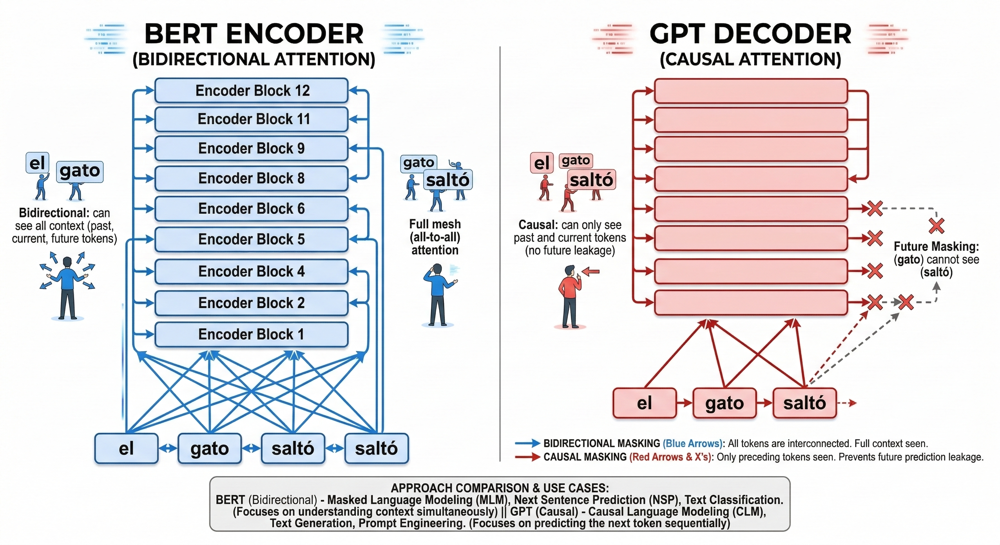
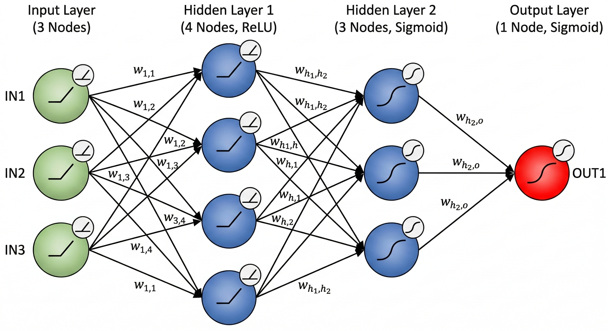
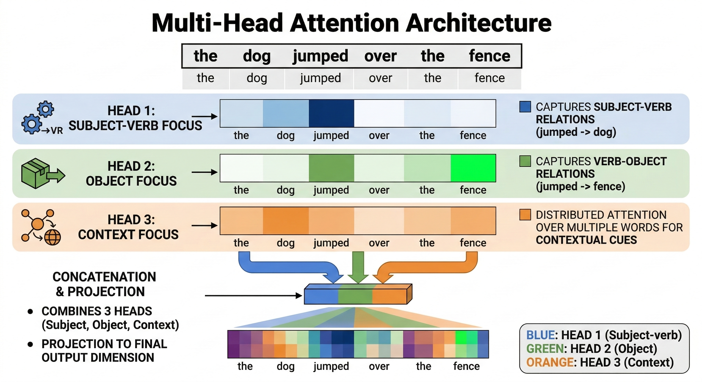
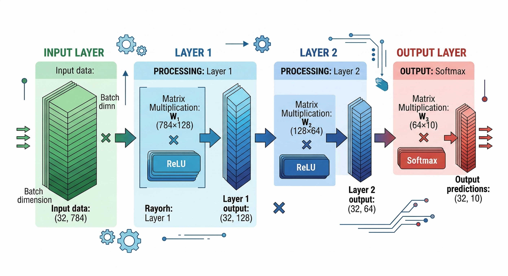
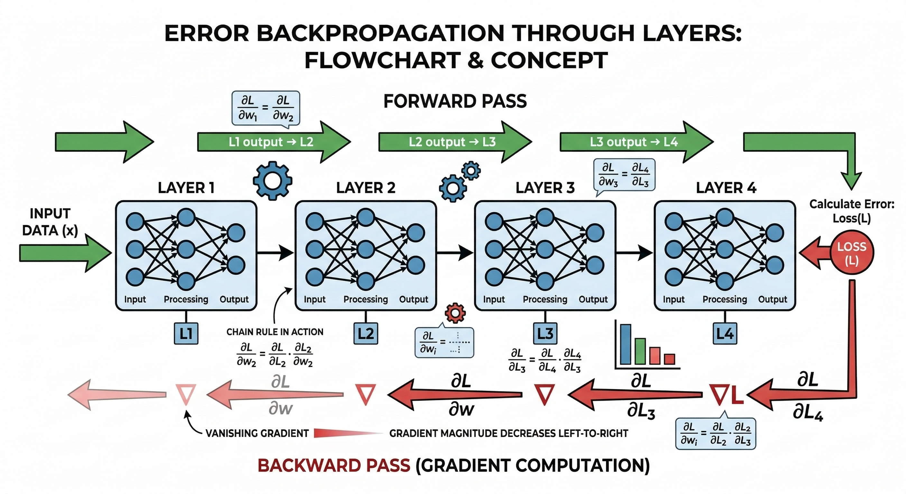
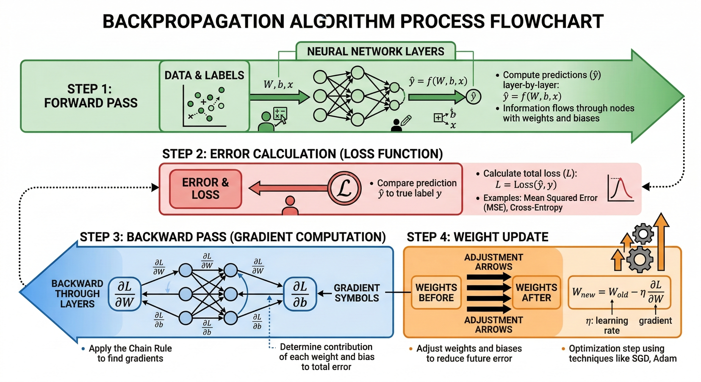
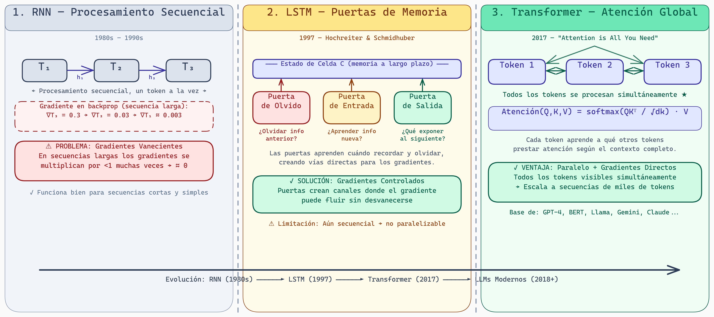
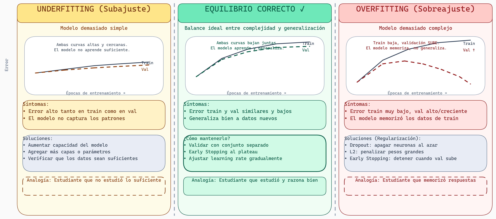

# Lectura 2: Fundamentos de Deep Learning

## Introducción

En la lectura anterior, mencionamos redes neuronales y retropropagación como conceptos clave. Ahora vamos a profundizar: ¿cómo funcionan realmente estas redes? ¿Qué es un tensor? ¿Por qué es tan importante el álgebra lineal?

Esta lectura es el corazón técnico de tu comprensión de aprendizaje profundo. Aunque no escribiremos código compilado, entenderemos los conceptos lo suficiente para trabajar con LLMs.

---

## Parte 1: El Perceptrón y Más Allá

### El Perceptrón Simple

```
     x1 ─────┐
             ├─→ [suma ponderada] ─→ [activación] → y
     x2 ─────┤
     x3 ─────┘
```

Matemáticamente:

```
z = w1*x1 + w2*x2 + w3*x3 + b

y = σ(z)  donde σ es una función de activación (ej: escalón)
```

**Pesos (w):** multiplicadores que aprende el modelo
**Bias (b):** término independiente que aprende el modelo
**Función de activación (σ):** introduce no-linealidad (crucial)

Sin funciones de activación, aunque stapiles múltiples capas, el resultado sería equivalente a una transformación lineal única. Las funciones de activación es lo que permite que las redes neuronales profundas sean universales (capaces de aproximar cualquier función).

### Funciones de Activación Comunes



> **Funciones de Activación: Introduciendo No-linealidad**
>
> El diagrama anterior muestra visualmente las funciones de activación más importantes en deep learning. Observa cómo cada función transforma su entrada de manera diferente: **Sigmoid** mapea todo a un rango (0,1) suave, **Tanh** a (-1,1), **ReLU** simplemente corta los negativos, y **GELU** proporciona un suavizado diferenciable. La razón por la que necesitamos estas funciones es crucial: sin ellas, aunque apilemos múltiples capas, el resultado sería equivalente a una transformación lineal única. Las funciones de activación son lo que permite que las redes neuronales profundas sean **universales** (capaces de aproximar cualquier función continua). **ReLU domina hoy** porque es computacionalmente simple y evita el desvanecimiento de gradientes en redes profundas.

```python
# Sigmoid: valores entre 0 y 1
σ(z) = 1 / (1 + e^(-z))

# Tanh: valores entre -1 y 1
tanh(z) = (e^z - e^(-z)) / (e^z + e^(-z))

# ReLU (Rectified Linear Unit): max(0, z) - dominante hoy
relu(z) = max(0, z)
```

---

## Parte 2: Álgebra Lineal para Deep Learning

Los LLMs procesar **tensores**. Entender tensores es entender cómo piensan estas redes.

### Escalares, Vectores, Matrices, Tensores

```
Escalar:     5                           (número solo)

Vector:      [1, 2, 3]                  (lista de números, dimensión: 1)

Matriz:      [[1, 2, 3],
              [4, 5, 6]]                (tabla 2D, dimensión: 2)

Tensor 3D:   [[[1, 2], [3, 4]],
              [[5, 6], [7, 8]]]         (cubo de números, dimensión: 3)

Tensor nD:   Extensión a N dimensiones
```

En una red neuronal:

```
Entrada: [32 imágenes, 224x224 píxeles, 3 canales (RGB)]
→ Tensor de forma (32, 224, 224, 3)

Pesos: [entrada_dim, salida_dim]
→ Matriz de forma (100, 50)

Salida: [32 predicciones, 10 clases (ej: dígitos 0-9)]
→ Tensor de forma (32, 10)
```

**Batch dimension:** Procesamos múltiples ejemplos simultáneamente para eficiencia.

### Multiplicación de Matrices

La operación fundamental de una red neuronal es la multiplicación de matrices:

```
Si A es (m × n) y B es (n × p):
C = A @ B  tiene forma (m × p)

Ejemplo:
Entrada: (32, 784)      [32 imágenes de 28×28 píxeles aplanados]
Pesos:   (784, 128)     [128 neuronas en la capa siguiente]
Salida:  (32, 128)      [32 predicciones intermedias]
```

**Nota:** En notación NumPy/PyTorch, "@" es la multiplicación matricial.

### Transpuesta

```
Si A = [[1, 2, 3],      entonces A^T = [[1, 4],
        [4, 5, 6]]                      [2, 5],
                                        [3, 6]]
```

Intercambia filas y columnas. La usarás constantemente en redes neuronales.

---

## Parte 3: Redes Neuronales Multicapa

### Arquitectura



> **Arquitectura de una Red Neuronal Multicapa**
>
> El diagrama anterior ilustra cómo se conectan múltiples capas en una red neuronal profunda. Cada capa contiene neuronas que aplican transformaciones lineales (W @ x + b) seguidas por una función de activación no-lineal. La información fluye desde la entrada a través de capas ocultas progresivamente más abstractas hasta la salida. Esta estructura es lo que permite que redes profundas aprendan representaciones jerárquicas de complejidad creciente.

```
Entrada ─→ Capa 1 ─→ Capa 2 ─→ ... ─→ Capa N ─→ Salida
          (w1, b1)   (w2, b2)        (wN, bN)

Cada capa realiza: y = σ(W @ x + b)
```



> **Anatomía Detallada: Capas y Funciones de Activación**
>
> Este diagrama desglosa la estructura interna de una red neuronal con capas específicamente etiquetadas. Observa cómo la **capa de entrada** recibe los datos (3 nodos), las **capas ocultas** (4 y 3 nodos respectivamente) transforman los datos con funciones de activación ReLU y Sigmoid, y la **capa de salida** (1 nodo con Sigmoid) produce la predicción final. Las conexiones ponderadas (w₁,₁, w₁,₂, etc.) son los parámetros que el modelo aprende durante el entrenamiento. Esta es la arquitectura más simple pero también la más fundamental para entender cómo funciona el aprendizaje profundo.

### Forward Pass (Propagación Hacia Adelante)

Imagina una red simple:

```
Entrada x: [0.5, -0.3]
Capa 1: W1 = [[0.1, 0.2], [0.3, 0.4]], b1 = [0.01, -0.02]
Capa 2: W2 = [[0.5, 0.6]], b2 = [0.1]

Forward Pass:
z1 = W1 @ x + b1 = [[0.1, 0.2], [0.3, 0.4]] @ [0.5, -0.3] + [0.01, -0.02]
   = [0.05 - 0.06 + 0.01, 0.15 - 0.12 - 0.02]
   = [0.0, 0.01]

a1 = relu(z1) = [0.0, 0.01]

z2 = W2 @ a1 + b2 = [0.5, 0.6] @ [0.0, 0.01] + 0.1
   = 0.006 + 0.1 = 0.106

a2 = sigmoid(z2) = 0.526   (predicción final)
```

Este es el corazón de cómo los LLMs procesan información.



> **Estructura Completa del Forward Pass**
>
> El diagrama anterior muestra cómo los datos fluyen a través de una red neuronal completa durante el forward pass. Para cada entrada, se aplica una secuencia de transformaciones: multiplicaciones de matrices ponderadas, adición de bias, y funciones de activación no-lineales. El resultado es que la información original se transforma en representaciones progresivamente más abstracts, permitiendo que la red capture patrones complejos en los datos.

---

## Parte 4: Retropropagación (Backpropagation)

La retropropagación es el algoritmo que permite entrenar redes profundas. Es el motor detrás de todo modelo de IA moderno.

### La Idea Conceptual

Imagina que tienes una predicción incorrecta. ¿Cuánto contribuyó cada peso a ese error?

```
Entrada → W1 → Capa 1 → W2 → Capa 2 → ... → Predicción INCORRECTA

¿Qué peso debería cambiar más para corregir el error?
Respuesta: El peso que contribuyó más al error.
```

La retropropagación calcula: *∂Error / ∂Peso* (cómo cambia el error con respecto a cada peso).



> **Flujo de Retropropagación: Error Hacia Atrás**
>
> El diagrama anterior ilustra cómo el error se propaga hacia atrás a través de la red. Durante la retropropagación, el error que se calculó en la salida se "desdobla" a través de cada capa, calculando las contribuciones de cada peso al error total. Este es el mecanismo que permite que el modelo sepa qué pesos necesitan cambiar para mejorar su predicción. Sin este algoritmo eficiente, entrenar redes profundas sería computacionalmente prohibitivo.

### Los Gradientes

```
Imagina que Error = 5.2 (tu predicción fue muy incorrecta)

∂Error/∂W1 = 0.3  (cambiar W1 en +0.01 aumentaría el error en ~0.003)
∂Error/∂W2 = -0.8 (cambiar W2 en +0.01 disminuiría el error en ~0.008)

Estrategia: Cambia los pesos en la dirección opuesta al gradiente
```

```
W_nuevo = W_viejo - learning_rate * gradiente

Si gradiente = 0.3:
W_nuevo = W_viejo - 0.01 * 0.3 = W_viejo - 0.003
```

### Propagación del Error

El genio de la retropropagación es que usa la **regla de la cadena** para calcular gradientes eficientemente:

```
Si y = f(g(h(x))):
dy/dx = (dy/dg) * (dg/dh) * (dh/dx)

En una red:
Error propagates: [Capa N] → [Capa N-1] → ... → [Capa 1]
                  ↑ Calcula gradientes en cada paso
```

### Pseudocódigo



> **El Algoritmo Completo: Forward + Backward**
>
> El diagrama anterior resume el proceso completo de una iteración de entrenamiento. En el **forward pass** (flechas hacia la derecha), los datos fluyen a través de la red para producir predicciones. En el **backward pass** (flechas hacia la izquierda), el error se propaga hacia atrás para calcular los gradientes. Este ciclo forward-backward repetido miles de veces es lo que permite que el modelo ajuste sus pesos y mejore su desempeño. La elegancia del algoritmo es que reutiliza los cálculos intermedios del forward pass para hacer el backward pass eficiente.

```
1. Forward pass: Calcula predicción (con todos los Z y A intermedios guardados)
2. Calcula pérdida: Loss = ||y_predicho - y_verdadero||^2
3. Backward pass:
   - Calcula ∂Loss/∂a_salida
   - Para cada capa (de atrás hacia adelante):
     - Calcula ∂Loss/∂w = ∂Loss/∂a * ∂a/∂z * ∂z/∂w
     - Propaga el gradiente al peso anterior
4. Actualiza pesos: W = W - learning_rate * ∂Loss/∂W
5. Repite con nuevo batch de datos
```

---

## Parte 5: Evolución Arquitectónica hacia Transformers

### RNNs: Procesamiento Secuencial

```
Entrada: "Hola mundo"

Paso 1: Procesa "Hola" → Estado_1
Paso 2: Procesa "mundo" + Estado_1 → Estado_2

Problema: Estado_2 depende de cómo procesamos Estado_1,
que depende de cómo procesamos el token inicial.
En secuencias largas, la información se "olvida".
```

**Desvanecimiento de gradientes:** Al retropropagar, los gradientes se multiplican por números < 1 muchas veces, convergiendo a 0. El peso inicial (necesario para entender contexto lejano) casi no se actualiza.

### LSTMs: Puertas de Memoria

```
LSTM introduce "puertas" que controlan qué información mantener:

Puerta de olvido:  ¿Olvido información previa?
Puerta de entrada: ¿Incorporo información nueva?
Puerta de salida:  ¿Qué expongo al siguiente paso?
```

Mejoran el desvanecimiento de gradientes pero siguen siendo secuenciales.

### Transformers: Atención Global

```
En lugar de procesar palabra por palabra:

Palabra 1: "Transformers"
Palabra 2: "procesan"
Palabra 3: "en paralelo"

El Transformer pregunta:
- ¿Cuál es la relación entre "Transformers" y "en paralelo"?
- ¿Cuál es la relación entre "en paralelo" y "procesan"?
- etc.

Todo simultáneamente, permitiendo que cada palabra "vea" todas las demás.
```

Veremos los detalles matemáticos en la próxima lectura.



> **Evolución Arquitectónica: de RNN a Transformer**
>
> El diagrama compara las tres arquitecturas secuenciales que llevaron a los LLMs modernos. **RNN (1980s-90s):** procesa un token a la vez, pasando el estado oculto h al siguiente paso — funciona para secuencias cortas, pero sufre de gradientes vanecientes en secuencias largas. **LSTM (1997):** introduce tres puertas (Olvido, Entrada, Salida) que regulan cuándo recordar y olvidar, creando canales donde los gradientes pueden fluir sin degradarse. **Transformer (2017):** abandona completamente la recurrencia; todos los tokens se procesan simultáneamente y cada uno puede "atender" a cualquier otro mediante la fórmula Atención(Q,K,V) = softmax(QKᵀ/√dk)·V. Este paralelismo masivo es lo que permite escalar a GPT-4, BERT, Llama y Claude.

---

## Parte 6: Entrenamiento en Práctica

### Funciones de Pérdida (Loss Functions)

La pérdida cuantifica cuánto se equivocó el modelo:

```python
# Clasificación binaria: Binary Crossentropy
Loss = -[y * log(ŷ) + (1-y) * log(1-ŷ)]

# Clasificación multiclase: Crossentropy
Loss = -Σ y_i * log(ŷ_i)

# Regresión: Mean Squared Error
Loss = (1/N) * Σ (y_i - ŷ_i)^2
```

El objetivo del entrenamiento es minimizar esta pérdida.

### Optimizadores

No todos los gradientes son iguales. Los optimizadores usan estrategias más sofisticadas que descenso de gradiente simple:

```
Descenso de Gradiente: W = W - lr * ∇Loss

Adam (adaptive): Usa momento y adapta tasas de aprendizaje por parámetro
W = W - lr * (m / (√v + ε))

donde m es el promedio móvil del gradiente
y v es el promedio móvil del gradiente al cuadrado
```

Adam generalmente funciona mejor que descenso de gradiente simple.

### Overfitting y Regularización

```
Underfitting:   Modelo demasiado simple, no aprende
Perfecto:       Balance correcto
Overfitting:    Modelo memorizó los datos, no generaliza
```



> **Underfitting, Equilibrio y Overfitting**
>
> El diagrama compara los tres escenarios del entrenamiento. En **Underfitting**, tanto la curva de entrenamiento como la de validación permanecen altas — el modelo es demasiado simple para capturar los patrones. En **Equilibrio Correcto**, ambas curvas descienden juntas y se mantienen cercanas — el modelo aprende y generaliza bien a datos nuevos. En **Overfitting**, la curva de entrenamiento sigue bajando pero la de validación comienza a subir — señal de que el modelo memorizó los datos de entrenamiento en lugar de aprender patrones generalizables. La clave diagnóstica es observar la **brecha entre train y validación**: si esta brecha crece, hay overfitting; si ambas son altas, hay underfitting.

Técnicas para prevenir overfitting:

```
1. Dropout: Apagar neuronas aleatoriamente durante entrenamiento
2. L2 Regularization: Penalizar pesos grandes
3. Early Stopping: Detener entrenamiento cuando el desempeño en validación empeora
4. Data Augmentation: Crear más datos variados
```

---

## Reflexión y Ejercicios

### Preguntas para Reflexionar:

1. **¿Por qué es importante la función de activación?** ¿Qué pasaría si solo usaras transformaciones lineales?

2. **RNNs vs Transformers:** ¿Cuál es el tradeoff fundamental entre procesar secuencialmente vs en paralelo?

3. **Gradientes vanecientes:** Imagina una red muy profunda (100 capas). ¿Por qué es más difícil entrenar que una de 5 capas?

### Ejercicios Prácticos:

1. **Multiplicación de matrices:** Verifica manualmente que en el ejemplo del forward pass calculé correctamente z1 y z2. (Pista: [0.1, 0.2] @ [0.5, -0.3] = 0.1*0.5 + 0.2*(-0.3) = 0.05 - 0.06 = -0.01)

2. **Implementación conceptual:** Sin usar librerías, simula un forward pass de una red neuronal con:
   - Entrada: [1.0, 2.0]
   - Capa 1: W1=[[0.5, 0.1], [0.2, 0.3]], b1=[0.1, -0.1], activación=ReLU
   - Capa 2: W2=[[0.4, 0.6]], b2=[0.05], activación=Sigmoid

3. **Reflexión escrita (300 palabras):** "La retropropagación es conceptualmente simple (calcula derivadas), pero es la razón por la que podemos entrenar redes profundas. Explica por qué la capacidad de calcular gradientes eficientemente es tan importante para el aprendizaje profundo."

---

## Puntos Clave

- **Perceptrón:** Unidad básica; funciones de activación hacen que las redes sean no-lineales
- **Tensores:** Extensión de vectores y matrices a N dimensiones
- **Forward pass:** Entrada → pesos y sesgos → predicción
- **Retropropagación:** Calcula gradientes eficientemente usando la regla de la cadena
- **RNNs:** Procesan secuencias pero sufren de desvanecimiento de gradientes
- **Transformers:** Procesan en paralelo usando atención (próxima lectura)
- **Overfitting:** Regularización y early stopping lo previenen

