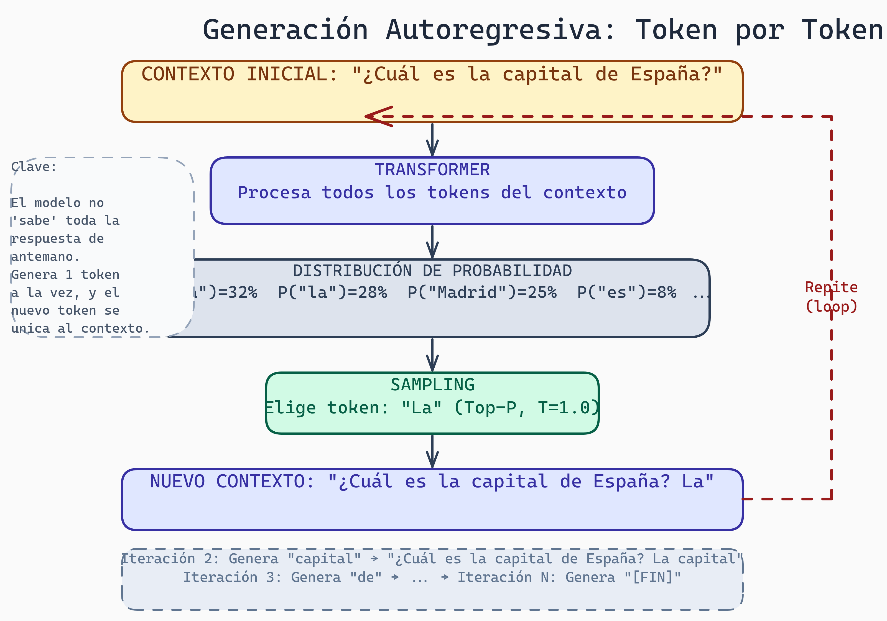
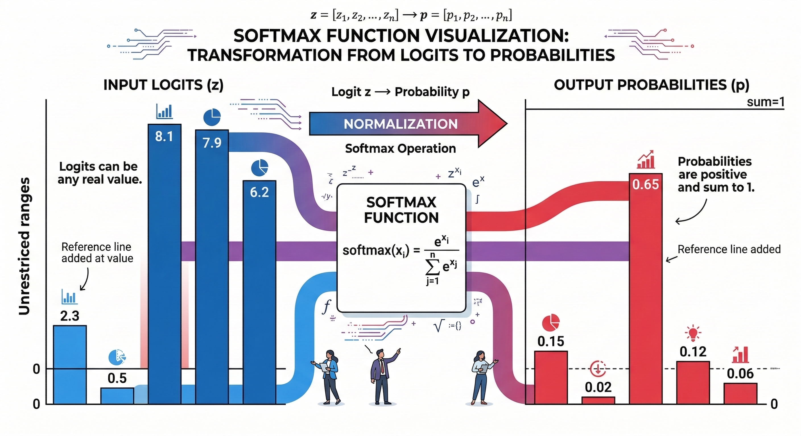
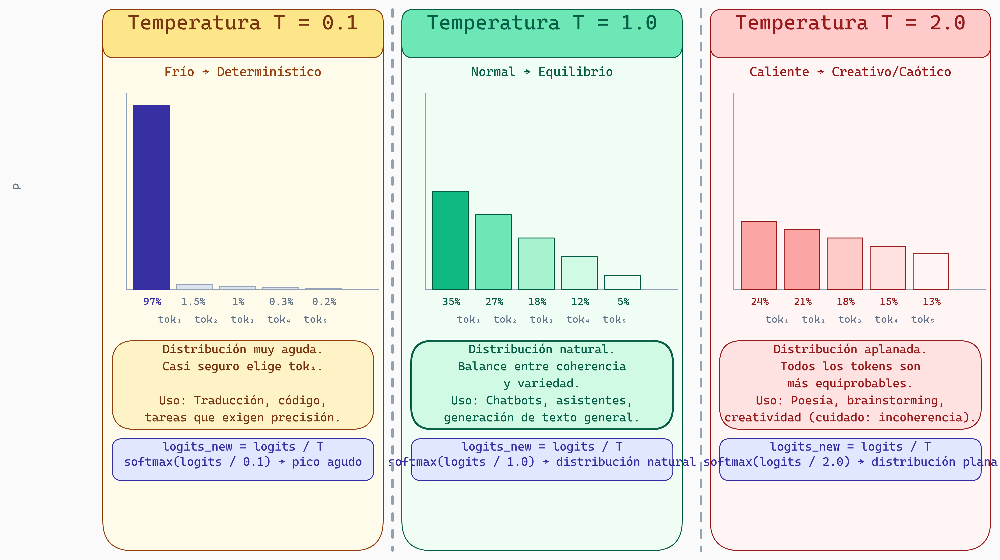
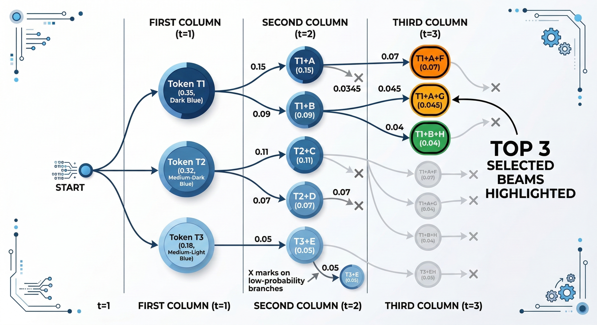
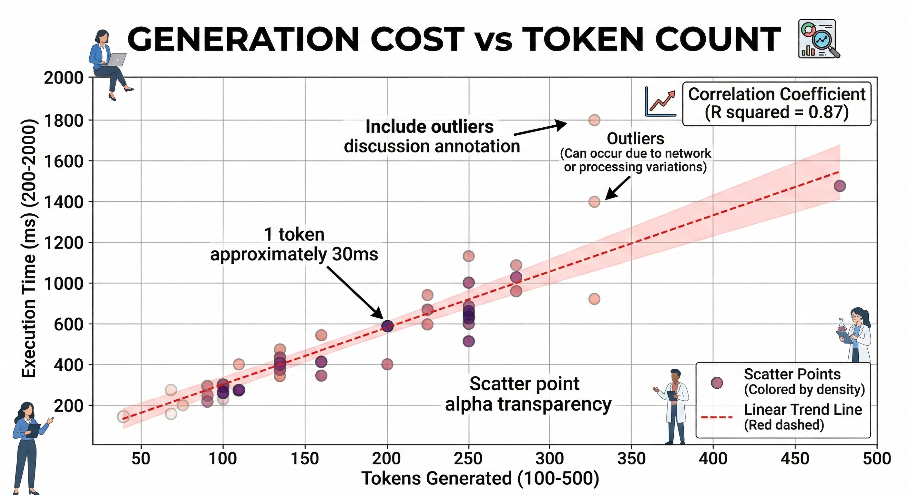

# Lectura 3: Generación Autoregresiva

## Contexto
Aprenderás cómo los LLMs generan texto token por token mediante procesos autoregresivos. Comprenderás estrategias de muestreo (greedy, Top-K, Top-P) y su impacto en creatividad vs coherencia.

## Introducción

Hasta ahora, hemos entendido cómo funcionan los Transformers: procesan entrada, aplican atención, y producen representaciones. Pero ¿cómo generan texto un token por vez, como lo hace ChatGPT?

Esta lectura responde esa pregunta. Explicaremos cómo los LLMs convierten números en palabras, cómo eligen qué palabra generar, y cómo aprenden a hacer esto bien durante el entrenamiento.

---

## Parte 1: De Transformers a Generación




> **El Loop Autoregresivo: Cómo Genera un LLM**
>
> El diagrama ilustra el proceso de generación token por token. El modelo recibe un contexto inicial, lo procesa en el Transformer para producir una distribución de probabilidad sobre todos los tokens del vocabulario, aplica una estrategia de sampling (Top-P, Greedy, etc.) para elegir un token, y luego ese token se concatena al contexto y el ciclo se repite. Cada iteración genera exactamente **un** token — si la respuesta final tiene 50 tokens, el modelo ejecutó 50 forward passes. Esto explica por qué la generación de texto largo es más costosa que la comprensión.

### Repaso: Salida del Transformer

Recuerda que un Transformer toma una secuencia y produce:

```
Entrada:  "El gato saltó"
              ↓
          [Transformer]
              ↓
Salida:   Vector para "el", Vector para "gato", Vector para "saltó"

Cada vector representa la información contextualizada de esa palabra.
```

Para generación, usamos el vector de la **última palabra** como entrada a una capa de predicción:

```
Última salida del Transformer: [0.2, -0.5, 0.8, ..., 0.1]  (768-dimensional)
                                      ↓
                          [Proyección Linear]
                                      ↓
                          [Logits para 50,257 tokens]
                                      ↓
                                    Salida:
                                    Token 0 (PAD): logit = 2.3
                                    Token 1 (EOS): logit = 0.5
                                    ...
                                    Token 250 ("el"): logit = 8.1
                                    Token 251 ("gato"): logit = 7.9
                                    Token 252 ("saltó"): logit = 6.2
                                    ...
                                    Token 50256 (UNK): logit = -2.1
```

Los **logits** son números sin restricción. Necesitamos convertirlos en probabilidades.

---

## Parte 2: De Logits a Probabilidades

### Softmax



> **Visualización de la Función Softmax**
>
> El diagrama anterior ilustra cómo softmax transforma logits (números sin restricción) en una distribución de probabilidad. Observa cómo después de aplicar softmax, los valores se concentran en un rango (0,1) y suman exactamente 1. La palabra "jumped" tiene la mayor probabilidad relativa, mientras que palabras menos relevantes como "near" tienen probabilidades menores. Este es el mecanismo que permite al modelo "elegir" entre 50,000 posibles tokens de manera probabilística.

Softmax convierte logits en una distribución de probabilidad:

```
Sea logits = [2.3, 0.5, 8.1, 7.9, 6.2, ..., -2.1]

Paso 1: Exponencial
  exp(logits) = [e^2.3, e^0.5, e^8.1, e^7.9, e^6.2, ..., e^-2.1]
              = [9.97, 1.65, 3,320.1, 2,980.96, 493.8, ..., 0.12]

Paso 2: Normaliza
  suma = 9.97 + 1.65 + 3,320.1 + 2,980.96 + 493.8 + ... + 0.12

  probabilidades = exp(logits) / suma
                 = [9.97/suma, 1.65/suma, 3,320.1/suma, ...]
```

Resultado: probabilidades que suman a 1.

```
Interpretación:
Token 250 ("el"): 0.15  (15% de probabilidad)
Token 251 ("gato"): 0.14 (14% de probabilidad)
Token 252 ("saltó"): 0.023 (2.3% de probabilidad)
...
```

### Temperatura

Un parámetro importante modifica la "agudeza" de la distribución:

```
Logits modificados = logits / T

donde T es la temperatura (típicamente entre 0.1 y 2.0)
```

```
T = 0.1 (frío):
  Softmax([2.3/0.1, 0.5/0.1, 8.1/0.1, ...])
  = Softmax([23, 5, 81, ...])
  = Distribución muy aguda, casi el 100% en el token más probable

T = 1.0 (normal):
  Softmax([2.3, 0.5, 8.1, ...])
  = Distribución normal

T = 2.0 (caliente):
  Softmax([2.3/2.0, 0.5/2.0, 8.1/2.0, ...])
  = Softmax([1.15, 0.25, 4.05, ...])
  = Distribución más plana, mayor aleatoriedad
```

**Efecto:**
- T bajo → Generación determinística, coherente, potencialmente repetitiva
- T alto → Generación creativa, pero potencialmente incoherente



> **Efecto de la Temperatura en la Distribución de Probabilidad**
>
> El diagrama compara visualmente cómo la temperatura modifica la distribución de probabilidad sobre el vocabulario. Con **T=0.1 (frío)**, la distribución es extremadamente aguda — tok₁ recibe ~97% de probabilidad y el resto es casi cero; útil para traducción y código donde la respuesta correcta es única. Con **T=1.0 (normal)**, se obtiene una distribución natural y balanceada; ideal para chatbots y asistentes. Con **T=2.0 (caliente)**, la distribución se aplana notablemente — los tokens compiten con probabilidades similares, lo que produce mayor variedad pero también mayor riesgo de incoherencia. La fórmula es simple: `logits_nuevo = logits / T` seguido de softmax.

---

## Parte 3: Estrategias de Muestreo (Decoding)

Ahora tenemos probabilidades para cada token. ¿Cuál elegimos?

### Greedy Decoding

```
Elige el token con la probabilidad más alta:

P("el") = 0.15
P("gato") = 0.14
P("saltó") = 0.023
...

Elige "el" (máxima probabilidad)

Repetir:
Entrada: "El gato saltó el"
           ↓
       [Transformer]
           ↓
Siguiente token más probable: "perro" (P = 0.18)

Entrada: "El gato saltó el perro"
...
```

**Ventaja:** Rápido, determinístico
**Desventaja:** A menudo genera texto monotonía o poco creativo

### Top-K Sampling

```
1. Ordena los tokens por probabilidad
2. Mantén solo los top K tokens
3. Renormaliza sus probabilidades
4. Muestra aleatoriamente de esa distribución

Ejemplo (K=5):
Original:       P("el")=0.15, P("gato")=0.14, P("saltó")=0.023, P("perro")=0.01, ...
Top-5 tokens:   P("el")=0.15, P("gato")=0.14, P("saltó")=0.023, P("corre")=0.015, P("perro")=0.01
Renormalizado:  P("el")=0.32, P("gato")=0.30, P("saltó")=0.05, P("corre")=0.03, P("perro")=0.02

Muestra aleatoriamente: 32% de probabilidad de "el", 30% de "gato", etc.
```

**Ventaja:** Excluye tokens muy improbables (tontos), pero mantiene diversidad
**Desventaja:** K es fijo; a veces queremos top-10, a veces top-3

### Top-P (Nucleus) Sampling

```
1. Ordena tokens por probabilidad (descendente)
2. Suma probabilidades de mayor a menor
3. Detén cuando la suma exceda P (típicamente 0.9)
4. Renormaliza esos tokens
5. Muestra

Ejemplo (P=0.9):
P("el")=0.35
P("el") + P("gato")=0.35+0.32=0.67
P("el") + P("gato") + P("saltó")=0.67+0.18=0.85
P("el") + P("gato") + P("saltó") + P("corre")=0.85+0.07=0.92 > 0.9 (STOP)

Tokens seleccionados: "el", "gato", "saltó", "corre"
Renormaliza y muestrea de esos.
```

**Ventaja:** Dinámico; ajusta el número de tokens según la distribución
**Desventaja:** Requiere más computación (ordenar)

### Comparación Visual

```
Distribución original: [0.35, 0.32, 0.18, 0.07, 0.05, 0.03, ...]

Greedy:     Elige 0.35 (token 0)

Top-5:      Considera [0.35, 0.32, 0.18, 0.07, 0.05]
            Renormaliza: [0.37, 0.34, 0.19, 0.07, 0.03]
            Muestrea aleatoriamente

Top-P(0.9): Suma [0.35, 0.32, 0.18, 0.07] = 0.92 > 0.9
            Considera [0.35, 0.32, 0.18, 0.07]
            Renormaliza: [0.38, 0.35, 0.20, 0.08]
            Muestrea aleatoriamente
```

---

## Parte 4: Beam Search

Beam search es más complejo pero potente: en lugar de elegir un token, explora múltiples caminos.



> **Visualización de Beam Search**
>
> El diagrama anterior muestra cómo beam search mantiene múltiples hipótesis en paralelo, evaluando todas las rutas potenciales. A diferencia de greedy (que elige ciegamente el mejor inmediato), beam search rastrea las mejores K secuencias y continúa expandiéndolas. Esto permite encontrar secuencias globalmente superiores que podrían tener un token mediocre en el medio pero un resultado final excelente. El trade-off: es más lento pero produce generalmente mejor calidad de salida.

### Idea Conceptual

```
Paso 1: Genera los K mejores tokens (ej: K=3)
  Beam 1: "el" (probabilidad acumulada = 0.35)
  Beam 2: "gato" (probabilidad acumulada = 0.32)
  Beam 3: "saltó" (probabilidad acumulada = 0.18)

Paso 2: Para cada beam, genera el siguiente token
  Beam 1 ("el"):    mejores opciones: [" gato" P=0.40, " perro" P=0.30, ...]
  Beam 2 ("gato"):  mejores opciones: [" saltó" P=0.50, " corrió" P=0.25, ...]
  Beam 3 ("saltó"): mejores opciones: [" sobre" P=0.60, ...]

Paso 3: Calcula probabilidades acumuladas de cada secuencia
  "el gato": 0.35 * 0.40 = 0.14
  "el perro": 0.35 * 0.30 = 0.105
  "gato saltó": 0.32 * 0.50 = 0.16
  "gato corrió": 0.32 * 0.25 = 0.08
  "saltó sobre": 0.18 * 0.60 = 0.108
  ...

Paso 4: Mantén los K mejores caminos
  Ranking: 1) "gato saltó" (0.16), 2) "el gato" (0.14), 3) "saltó sobre" (0.108), ...
  Nuevos beams (K=3):
    Beam 1: "gato saltó"
    Beam 2: "el gato"
    Beam 3: "saltó sobre"

Repite hasta longitud máxima o hasta que generes [END]
```

**Ventaja:** Explora múltiples caminos, mejor probabilidad general
**Desventaja:** Computacionalmente costoso; requiere mantener múltiples secuencias

---

## Parte 5: Entrenamiento - Cross-Entropy Loss

¿Cómo entrenan estos modelos a generar el token correcto?

### La Tarea de Entrenamiento

```
Texto: "El gato saltó sobre la cerca"
Tokenizado: [token_el, token_gato, token_saltó, ...]

Reorganiza como pares entrada-salida:
Entrada: [token_el] → Salida esperada: token_gato
Entrada: [token_el, token_gato] → Salida esperada: token_saltó
Entrada: [token_el, token_gato, token_saltó] → Salida esperada: token_sobre
...

Esto se llama "next-token prediction" o "causal language modeling".
```

### Cross-Entropy Loss

Para cada predicción:

```
Modelo produce:
P(token_gato) = 0.35
P(token_saltó) = 0.20
P(token_perro) = 0.15
...

La verdadera etiqueta es: token_gato (P=1.0)

Cross-Entropy Loss = -log(0.35) ≈ 1.05

Si el modelo predice correctamente (P=0.99):
Loss = -log(0.99) ≈ 0.01

Si predice incorrectamente (P=0.01):
Loss = -log(0.01) ≈ 4.6
```

**Fórmula:**
```
CE Loss = -Σ y_i * log(ŷ_i)

donde:
- y es la distribución verdadera (1 para la palabra correcta, 0 para otras)
- ŷ es la distribución predicha (softmax de logits)
```

### Entrenamiento

```
Para cada batch de ejemplos:
  1. Forward pass: predice probabilidades para cada posición
  2. Calcula CE loss para cada predicción
  3. Promedia los losses
  4. Retropropagación: actualiza pesos para reducir loss
  5. Repite con el siguiente batch

Después de 100 mil millones de tokens de entrenamiento,
el modelo ha aprendido patrones de lenguaje.
```

---

## Parte 6: Tokenización - BPE

¿Cómo convertimos texto en tokens?

### Problema

Vocabulario completo de caracteres: ~10,000 caracteres en Unicode
Vocabulario de palabras: millones (cada palabra es única)
Solución intermedia: **Byte Pair Encoding (BPE)**

### Algoritmo BPE Simplificado

```
Paso 1: Comienza con caracteres
  Vocabulario: [a, b, c, d, e, ...]

Paso 2: Busca el par más común, reemplázalo con un nuevo símbolo
  Documento: "aabaaaab"
  Par más común: "aa"
  Nuevo símbolo: X
  Documento: "XbXXb"
  Vocabulario: [a, b, c, ..., X]

Paso 3: Repite N veces (típicamente N=30,000)
  "XbXXb"
  Par más común: "Xb"
  Nuevo símbolo: Y
  "YXY"
  etc.

Resultado: Vocabulario de ~50,000 "tokens" que combinan caracteres y palabras.
```

### Ventajas de BPE

```
Palabra: "unbelievable"
Caracteres: [u, n, b, e, l, i, e, v, a, b, l, e] - 12 símbolos

Con BPE:
Si "un" es común → token UN
Si "able" es común → token ABLE
Si "beli" es común → token BELI
Resultado: [UN, BELI, EV, ABLE] - 4 tokens

Económico: menos tokens = menor costo computacional
Flexible: palabras desconocidas se descomponen en sub-palabras
```

### Otros métodos

- **WordPiece (BERT):** Similar a BPE, pero usa probabilidad en lugar de frecuencia
- **SentencePiece:** Comienza con caracteres Unicode, no ASCII

---

## Parte 7: Costo Computacional de Generación



> **Costo de Generación vs Cantidad de Tokens**
>
> El diagrama anterior muestra un insight crucial: el costo de generar respuestas largas es lineal con el número de tokens generados. Si generas 100 tokens, necesitas 100 forward passes del Transformer. Si generas 1000 tokens, necesitas 1000 forward passes. Esto explica por qué los LLMs son caros de usar en producción y por qué estrategias como beam search tienen una penalización clara: cada hipótesis adicional multiplica el costo. Es un trade-off entre calidad y costo que los sistemas deben balancear.

## Parte 8: En Resumen: El Pipeline Completo

```
Entrada: "¿Cuál es la capital de Francia?"
           ↓
[Tokenización BPE]: [¿, Cuál, es, la, capital, de, Francia, ?]
           ↓
[Embeddings + Pos Encoding]
           ↓
[Transformer Bloques] × N
           ↓
[Proyección a Logits]: [logit_0, logit_1, ..., logit_50256]
           ↓
[Softmax]: [P(token_0), P(token_1), ..., P(token_50256)]
           ↓
[Sampling: Top-P (P=0.9), T=1.0]
           ↓
[Token Elegido]: token_Paris (P=0.42)
           ↓
Salida: "París"
           ↓
[Repite con nueva entrada]: "¿Cuál es la capital de Francia? París"
```

---

## Reflexión y Ejercicios

### Preguntas para Reflexionar:

1. **Temperature:** ¿Por qué un chatbot interactivo usa T=1.0 pero un traductor automático usa T=0.1?

2. **Beam Search vs Sampling:** ¿Cuándo elegirías beam search? ¿Cuándo Top-P sampling?

3. **Cross-Entropy Loss:** ¿Por qué usamos logaritmo? ¿Qué pasaría si simplemente usáramos |y - ŷ|?

### Ejercicios Prácticos:

1. **Softmax manual:**
   ```
   Logits: [2.0, 0.5, 1.5]
   Calcula softmax y obtén probabilidades para cada token.
   ```

2. **BPE simulado:**
   ```
   Documento: "aaabaaab"
   Paso 1: ¿Cuál es el par más común?
   Paso 2: Reemplázalo con símbolo X. Nuevo documento: ?
   Paso 3: ¿Cuál es el siguiente par más común?
   ```

3. **Análisis: Greedy vs Top-P**
   ```
   Supón que tienes dos probabilidades de distribución:

   Caso 1: [0.9, 0.05, 0.03, 0.02, ...]
   Caso 2: [0.2, 0.2, 0.2, 0.2, 0.2]

   Para cada caso, ¿qué estrategia (greedy, top-K, top-P) elegirías?
   ¿Por qué?
   ```

4. **Reflexión escrita (300 palabras):** "Los LLMs se entrenan con cross-entropy loss en tareas de next-token prediction. ¿Cómo crees que esto lo hace buenos en tareas que no son predicción del siguiente token, como responder preguntas o resumir?"

---

## Puntos Clave

- **Logits → Softmax:** Convierte salida de modelo en probabilidades
- **Temperatura:** Controla "agudeza" de distribución (baja = determinístico, alta = aleatorio)
- **Greedy:** Elige token más probable (rápido, a menudo aburrido)
- **Top-K/Top-P:** Excluye tokens improbables, muestrea aleatoriamente (creativo, pero controlado)
- **Beam Search:** Explora múltiples caminos (mejor calidad, más lento)
- **Cross-Entropy Loss:** -log(P_correcta), minimizar durante entrenamiento
- **BPE:** Divide palabras en sub-palabras (balance entre caracteres y palabras)

