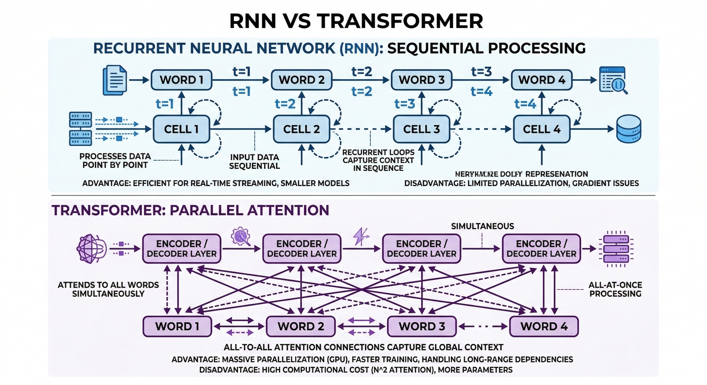
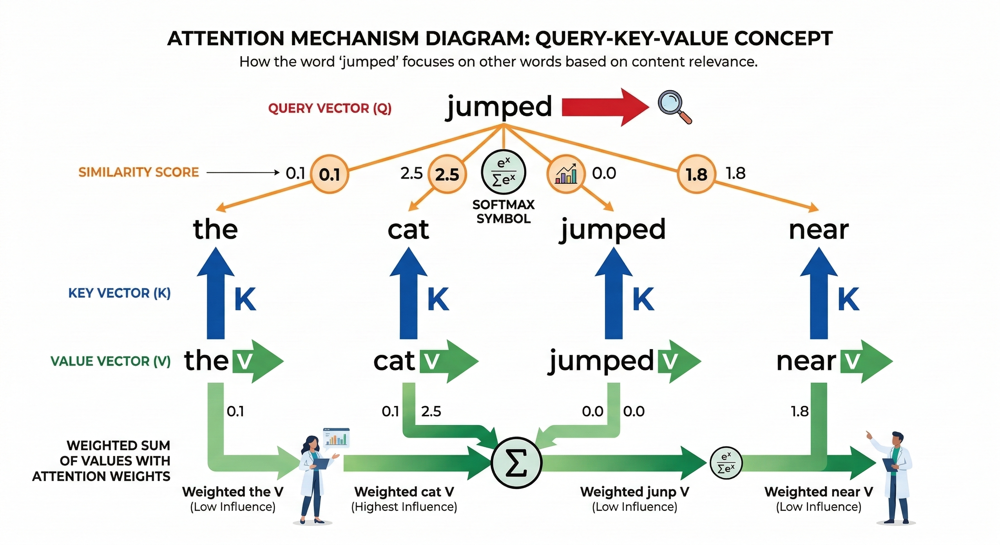
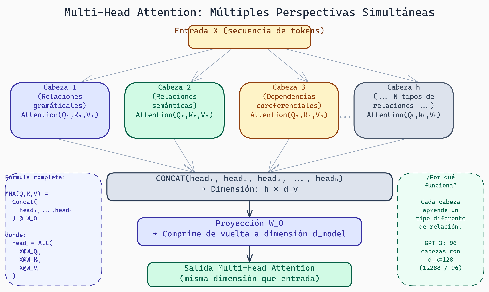
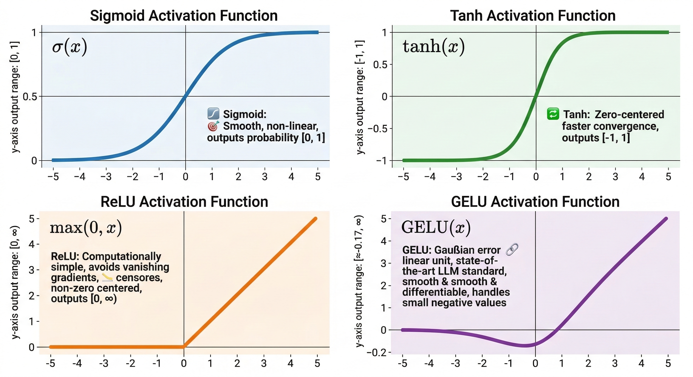
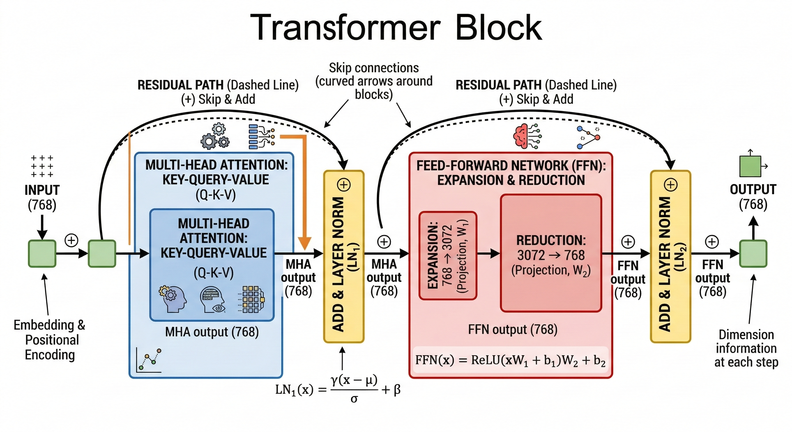
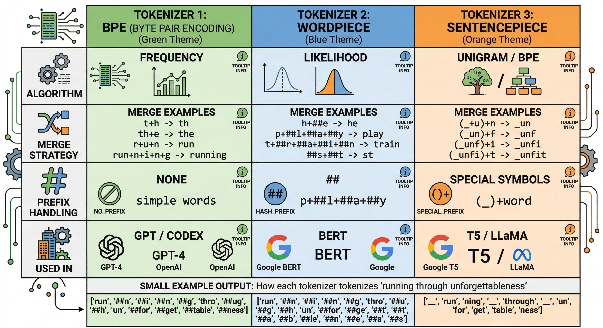
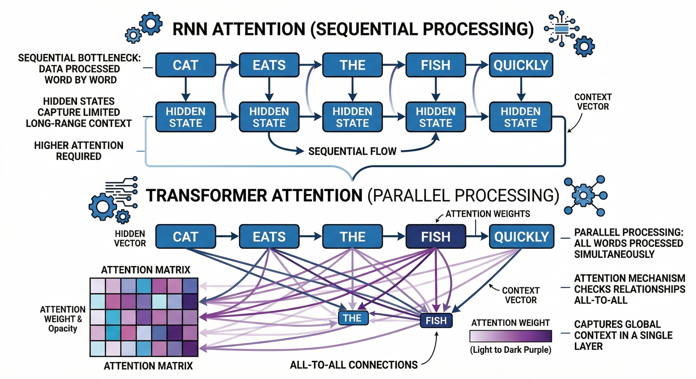
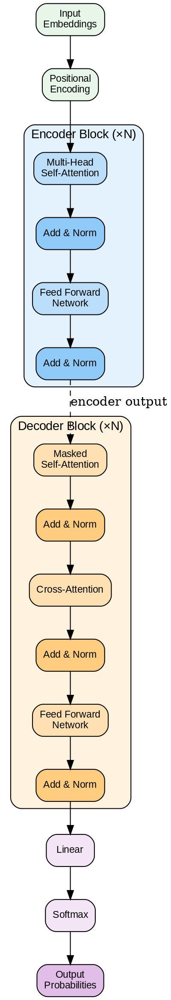

# Lectura 4: Arquitectura Transformer

## Contexto
Dominarás la arquitectura Transformer, fundamento de todos los LLMs modernos. Comprenderás el mecanismo de atención, multi-head attention, codificación posicional y la diferencia entre encoders (BERT) y decoders (GPT).

## Introducción

Los Transformers revolucionaron el procesamiento de lenguaje natural. Publicados en 2017 ("Attention is All You Need"), esta arquitectura es el fundamento de todos los LLMs modernos: GPT, BERT, Claude, Llama, etc.

En esta lectura entenderemos cómo funcionan Transformers desde sus componentes básicos hasta la arquitectura completa. La clave es el **mecanismo de atención**, que permitió a los modelos ver relaciones entre palabras distantes sin procesarlas secuencialmente.

---

## Parte 1: Motivación - El Problema de las Secuencias Largas

### El Desafío de RNNs

Recuerda de la lectura anterior:

```
Entrada: "El gato saltó sobre la cerca porque oyó un ruido en el jardín"

RNN:
t=1: "El" → Estado_1
t=2: "gato" + Estado_1 → Estado_2
t=3: "saltó" + Estado_2 → Estado_3
...
t=9: "jardín" + Estado_8 → Estado_9
```

**Problema:** Para que "jardín" influya en cómo interpretamos "El" (palabra 1), el gradiente debe viajar hacia atrás a través de 8 pasos. Cada paso multiplica por valores pequeños (desvanecimiento de gradientes).

Además, procesamiento secuencial es lento. Si la frase tiene 1000 palabras, debes hacer 1000 pasos seriales.



> **RNNs vs Transformers: Procesamiento Secuencial vs Paralelo**
>
> Este gráfico compara cómo RNNs procesan secuencias de forma secuencial (un paso a la vez) versus cómo Transformers pueden procesar todos los elementos en paralelo. La visualización destaca por qué los Transformers son significativamente más rápidos en hardware moderno como GPUs, permitiendo entrenar modelos más grandes en menos tiempo.

### La Solución: Atención

¿Qué pasa si, en lugar de procesar palabra por palabra, permitimos que cada palabra "atienda" a todas las demás palabras simultáneamente?

```
Pregunta: "¿Qué palabras son relevantes para entender 'saltó'?"

Respuesta (después de atención):
- "gato" es muy relevante (30% de atención)
- "cerca" es relevante (20% de atención)
- "el" es poco relevante (5% de atención)
- "jardín" tiene algo de relevancia (15% de atención)
- etc.

Luego, representación de "saltó" = 30% de "gato" + 20% de "cerca" + ... (promedio ponderado)
```

Esto permite que: 1) Cada palabra vea todo el contexto inmediatamente, 2) Las conexiones lejanas son directas (sin múltiples pasos), 3) Podemos procesar en paralelo.

---

## Parte 2: El Mecanismo de Atención Escalada por Puntuación

### Conceptos Previos: Embeddings

Las palabras se representan como vectores numéricos llamados **embeddings**.

```
"gato" → [0.2, -0.5, 0.8, 0.1, ...]  (vector de dimensión 768 para GPT-style)
"perro" → [0.3, -0.4, 0.7, 0.15, ...] (similar a "gato")
"matriz" → [0.9, 0.2, -0.1, -0.5, ...] (diferente)
```

Palabras similares tienen embeddings similares. Esto se aprende durante el entrenamiento.

### La Operación de Atención: Queries, Keys, Values

Imagina que quieres entender la palabra "saltó". Usas tres operaciones:

```
1. QUERY (Pregunta): "¿Qué estoy intentando entender?"
   Query para "saltó" = proyecto_a_query(embedding["saltó"])

2. KEY (Clave): "¿De qué información estoy informando?"
   Keys para todas las palabras: [proyecto_a_key(emb[i]) para cada palabra i]

3. VALUE (Valor): "¿Qué información proporciono?"
   Values para todas las palabras: [proyecto_a_value(emb[i]) para cada palabra i]
```

**Matemáticamente:**
```
Q = X @ W_Q    (Query: una proyección linear de la entrada)
K = X @ W_K    (Key: otra proyección linear)
V = X @ W_V    (Value: una tercera proyección linear)
```

donde X es la matriz de embeddings de entrada y W_Q, W_K, W_V son matrices de peso aprendidas.

### Puntuación y Softmax

```
Paso 1: Calcula similitud entre query y cada key

Similitud("saltó", "gato") = Query["saltó"] · Key["gato"]  (producto punto)
Similitud("saltó", "perro") = Query["saltó"] · Key["perro"]
Similitud("saltó", "matriz") = Query["saltó"] · Key["matriz"]
...

Paso 2: Escala por √d_k (stabilidad numérica)

scores = Q @ K^T / √d_k

donde d_k es la dimensión de las keys (ej: 64)
```

¿Por qué √d_k? Sin escala, los productos punto tienen varianza grande, causando softmax con picos muy agudos. La escala los mantiene estables.

```
Paso 3: Convierte scores a probabilidades con softmax

attention_weights = softmax(scores)

Ejemplo (tokens: "el", "gato", "saltó", "cerca"):
Para "saltó":
  scores = [0.1, 2.5, 0.0, 1.8]
  attention_weights = softmax(...) = [0.02, 0.72, 0.01, 0.25]

Interpretación: al procesar "saltó", atiende 72% a "gato", 25% a "cerca", etc.
```

### Agregación de Valores

```
output = attention_weights @ V

= 0.02 * Value["el"] + 0.72 * Value["gato"] + 0.01 * Value["saltó"] + 0.25 * Value["cerca"]
```

La representación actualizada de "saltó" es un promedio ponderado de los values basado en las similitudes calculadas.

### Fórmula Completa

```
Attention(Q, K, V) = softmax(Q @ K^T / √d_k) @ V
```

Esta es la fórmula más importante de los Transformers. La verás en cada configuración.



> **Mecanismo de Atención Query-Key-Value**
>
> Este diagrama desglosa el flujo del mecanismo de atención: cómo las Queries consultan las Keys para determinar pesos de atención, y cómo estos pesos se aplican a los Values para producir la salida. Visualizar este proceso es esencial para comprender por qué los Transformers pueden capturar relaciones complejas entre tokens independientemente de su distancia en la secuencia.

---

## Parte 3: Atención Multi-Cabeza

Una cabeza de atención captura un tipo de relación. ¿Qué pasa si queremos múltiples tipos?

```
Cabeza 1: Atención a sujetos gramaticales
  "el perro saltó" → Cabeza 1 atiende "el" a "perro"

Cabeza 2: Atención a objetos
  "el perro saltó sobre la cerca" → Cabeza 2 atiende "saltó" a "cerca"

Cabeza 3: Atención a dependencias léxicas
  "saltó" → Cabeza 3 atiende a tiempos verbales relacionados ("salta", "saltará")
```

**Implementación:**

```
Para cada cabeza h (ej: 8 cabezas):
  Q_h = X @ W_Q^h
  K_h = X @ W_K^h
  V_h = X @ W_V^h

  head_h = Attention(Q_h, K_h, V_h)

Concatena todas las cabezas:
  multi_head = concat(head_1, head_2, ..., head_8)

Proyección linear de salida:
  output = multi_head @ W_O
```

El modelo aprende automáticamente a asignar diferentes tipos de atención a diferentes cabezas. Es una forma elegante de paralelizar múltiples tipos de análisis.



> **Multi-Head Attention: Múltiples Perspectivas Simultáneas**
>
> El diagrama muestra cómo la entrada X se distribuye en paralelo a `h` cabezas independientes, cada una aprendiendo un tipo distinto de relación (gramatical, semántica, correferencial, etc.). Las salidas de todas las cabezas se concatenan y proyectan de vuelta a la dimensión original del modelo mediante la matriz W_O. GPT-3 utiliza 96 cabezas con d_k=128 cada una.

---


> **Mecanismo de Atención Escalada por Puntuación (Scaled Dot-Product Attention)**
>
> Para cada query Q, el modelo calcula un score de compatibilidad contra todas las keys K mediante Q·Kᵀ/√d_k, aplica softmax para obtener pesos normalizados, y promedia ponderadamente los values V. La escala √d_k evita que los dot-products crezcan demasiado en alta dimensión, estabilizando los gradientes.

## Parte 4: Codificación Posicional

Un problema: la atención ignora orden. Si mezclas las palabras:

```
Original: "gato saltó cerca"
Mezclado: "saltó cerca gato"

Sin codificación posicional, la atención vería exactamente lo mismo
(los mismos embeddings, solo en diferente orden).
```

**Solución:** Suma una **codificación posicional** a cada embedding que encode la posición.

```
embedding_final_pos_0 = embedding["gato"] + pos_encoding[0]
embedding_final_pos_1 = embedding["saltó"] + pos_encoding[1]
embedding_final_pos_2 = embedding["cerca"] + pos_encoding[2]
```

**Fórmula de Vaswani (original):**

```
PE(pos, 2i) = sin(pos / 10000^(2i/d_model))
PE(pos, 2i+1) = cos(pos / 10000^(2i/d_model))

donde:
- pos es la posición en la secuencia (0, 1, 2, ...)
- i es el índice de la dimensión (0, 1, 2, ..., d_model/2)
- d_model es la dimensión total del embedding (ej: 768)
```

Esto crea patrones sinusoidales a diferentes frecuencias, permitiendo al modelo aprender relaciones posicionales.



> **Mapa de Calor de Codificación Posicional**
>
> Este mapa de calor visualiza cómo cambian los valores de la codificación posicional a través de diferentes posiciones y dimensiones. Los patrones sinusoidales a diferentes frecuencias permiten que el modelo entienda tanto distancias cortas como largas entre elementos en la secuencia, siendo crucial para que los Transformers reconozcan la estructura y el orden del texto.

**Nota moderna:** Algunos modelos nuevos usan codificaciones posicionales aprendidas o relativas (Rotary Embeddings en Llama 2). Pero el concepto es igual.

---

## Parte 5: Normalización y Feed-Forward

El Transformer no es solo atención. Tiene componentes adicionales cruciales:

### Layer Normalization

```
Problema: Durante el entrenamiento, la distribución de valores
en cada capa cambia. Esto ralentiza el aprendizaje (covariate shift).

Solución: Normaliza la media y varianza en cada capa.

Normalización de capa:
x_normalized = (x - mean(x)) / sqrt(var(x) + ε)

Luego aprende parámetros γ y β que reescalan:
output = γ * x_normalized + β
```

La normalización de capa ayuda a que el entrenamiento sea más estable y rápido.

### Red Feed-Forward (FFN)

Después de la atención multi-cabeza, cada Transformer agrega una red neuronal simple:

```
FFN(x) = max(0, x @ W_1 + b_1) @ W_2 + b_2

Es decir:
1. Proyecta a dimensión más alta (típicamente 4x) con ReLU
2. Proyecta de vuelta a dimensión original

Ejemplo (d_model=768):
  x (768) → W_1 → (3072) → ReLU → W_2 → (768)
```

Esta red **introduce no-linealidad adicional** y permite aprender transformaciones más complejas por token.

### Residual Connections

```
En lugar de:
  x' = Atention(x)

Usa:
  x' = x + Attention(x)
```

Las conexiones residuales ayudan a los gradientes a fluir a través de redes profundas y estabiliza el entrenamiento.

---

## Parte 6: Bloques y Capas del Transformer

### Un Bloque Transformer Completo



> **Arquitectura del Bloque Transformer**
>
> Este diagrama ilustra el flujo de datos a través de un bloque Transformer completo, mostrando cómo la Multi-Head Attention se combina con conexiones residuales y normalización de capa. Comprender esta estructura es fundamental para visualizar cómo los Transformers procesan información en paralelo a través de múltiples cabezas de atención.

```
Entrada: x (secuencia de embeddings)
         ↓
[Multi-Head Attention]
         ↓
[Add + LayerNorm]  (residual connection + normalización)
         ↓
[Feed-Forward Network]
         ↓
[Add + LayerNorm]  (residual connection + normalización)
         ↓
Salida: x' (secuencia transformada)
```

### Encoder vs Decoder

```
ENCODER:
- Puede ver todo el contexto simultáneamente
- Salida: representaciones contextualizadas
- Ejemplo: BERT (clasificación, preguntas-respuestas)

DECODER:
- Solo puede ver palabras anteriores (causal masking)
- Razón: genera token por token, no debería "mirar adelante"
- Salida: predicción del siguiente token
- Ejemplo: GPT (generación de texto)
```



> **BERT (Encoder) vs GPT (Decoder): Arquitecturas Complementarias**
>
> Este diagrama contrasta la arquitectura de BERT con atención bidireccional (puede ver contexto futuro y pasado) frente a GPT con atención causal (solo ve tokens anteriores). Esta diferencia fundamental determina si un modelo es mejor para comprensión de lenguaje (BERT) o para generación de texto (GPT).

**Causal Masking:**

```
Posición 0 puede atender a: [0]
Posición 1 puede atender a: [0, 1]
Posición 2 puede atender a: [0, 1, 2]
...

Esto se logra poniendo scores -∞ para posiciones futuras,
así softmax los convierte en 0.
```

### Stacking de Capas

Los modelos modernos apilan múltiples bloques:

```
Entrada
  ↓
[Bloque 1]
  ↓
[Bloque 2]
  ↓
... (12, 24, 32, ... bloques)
  ↓
Salida
```

Más bloques = mayor capacidad pero mayor costo computacional.

### Ventajas del Paralelismo



> **Paralelización: Atención en RNNs vs Transformers**
>
> Este diagrama ilustra la diferencia fundamental en cómo se procesan secuencias: RNNs deben procesar tokens secuencialmente (el paso t depende del paso t-1), mientras que Transformers pueden procesar todos los tokens simultáneamente. Esta capacidad de paralelización es la razón por la cual los Transformers modernos entrenan significativamente más rápido y pueden escalar a modelos mucho más grandes que las arquitecturas secuenciales.

---



> **Arquitectura Transformer: Encoder-Decoder**
>
> El Transformer original (Vaswani et al., 2017) combina un encoder (izquierda) y un decoder (derecha). El encoder apila N bloques de self-attention + FFN sobre la secuencia fuente. El decoder agrega cross-attention sobre las representaciones del encoder, permitiendo que cada posición de salida atienda toda la entrada. GPT usa solo el decoder; BERT usa solo el encoder.

## Parte 7: La Arquitectura Completa Original

Para un modelo como GPT:

```
Entrada (texto):        "el gato saltó"
         ↓
[Tokenización]          [el] [gato] [saltó]
         ↓
[Token Embedding]       [e_1] [e_2] [e_3]  (768-dimensional)
         ↓
[Pos Encoding]          [e_1 + PE_0] [e_2 + PE_1] [e_3 + PE_2]
         ↓
[N Bloques Transformer]
  Cada bloque:
    - Multi-Head Attention
    - Add + LayerNorm
    - FFN
    - Add + LayerNorm
         ↓
[Output Projection]     [logits para 50,000 tokens]
         ↓
[Softmax]               [probabilidades]
         ↓
Predicción:             Siguiente token más probable
```

---

## Reflexión y Ejercicios

### Preguntas para Reflexionar:

1. **¿Por qué la atención multi-cabeza es mejor que una sola cabeza?** ¿Qué perdería un modelo con una sola cabeza de atención?

2. **Causal masking:** Explica por qué un modelo como GPT que genera texto token por token necesita causal masking durante el entrenamiento.

3. **Comparación:** ¿Cuál es la ventaja fundamental de Transformers sobre RNNs? ¿Hay alguna ventaja de RNNs que los Transformers no tengan?

### Ejercicios Prácticos:

1. **Atención manual:** Tienes embeddings para "el", "gato", "saltó":
   ```
   "el" → [1, 0]
   "gato" → [0.9, 0.1]
   "saltó" → [0.5, 0.5]

   W_Q = W_K = W_V = Identidad (para simplificar)

   Calcula la atención de "saltó" a todas las palabras:
   1. Query para "saltó"
   2. Keys para todas
   3. Scores (producto punto)
   4. Softmax
   5. Agregación de values
   ```

2. **Codificación posicional:** Calcula PE(pos=0, 2i=0) y PE(pos=1, 2i=0) con d_model=512.

3. **Reflexión escrita (350 palabras):** "Los Transformers reemplazaron las RNNs porque procesamiento paralelo + atención directa > procesamiento secuencial. Pero ¿por qué aún investigadores estudian modelos secuenciales? ¿Hay escenarios donde secuencial es mejor?"

---

## Puntos Clave

- **Atención:** Cada elemento consulta (Q) a todos los demás elementos, usando claves (K) y valores (V)
- **Fórmula:** Attention(Q, K, V) = softmax(Q @ K^T / √d_k) @ V
- **Multi-head:** Múltiples cabezas capturan diferentes tipos de relaciones
- **Codificación posicional:** Agrega información de posición (sin ella, el orden no importaría)
- **Normalización + FFN:** Estabilizan entrenamiento e introducen no-linealidad
- **Conexiones residuales:** Permiten entrenar modelos profundos
- **Encoder vs Decoder:** Encoder ve todo contexto; Decoder solo tokens anteriores (causal)

