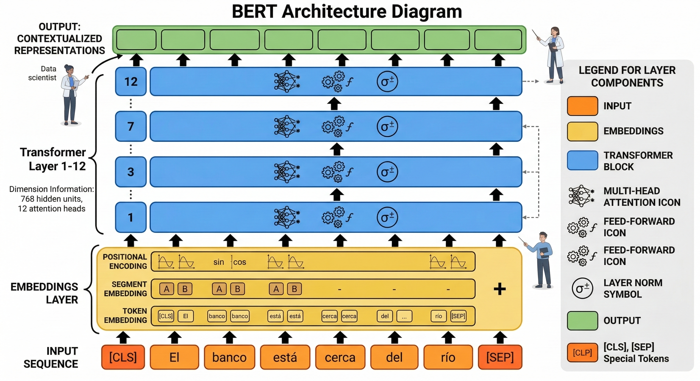
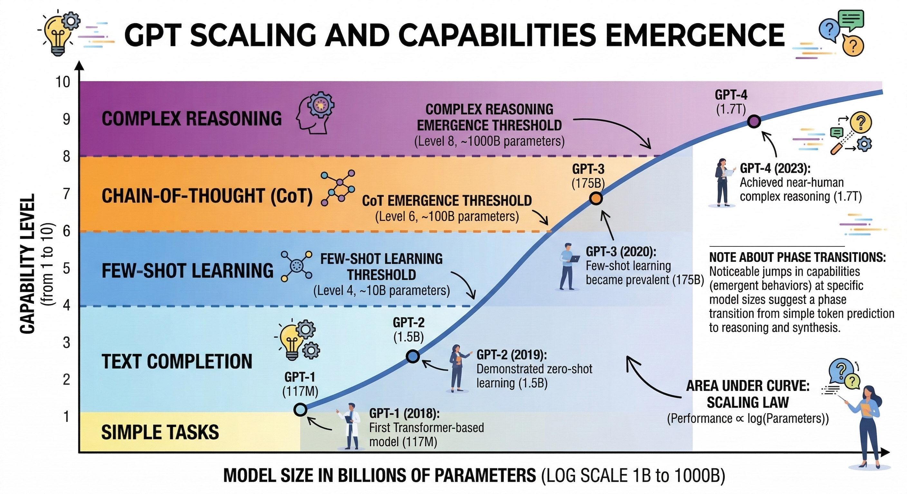
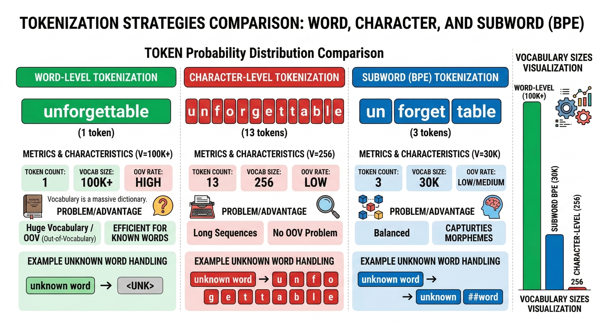
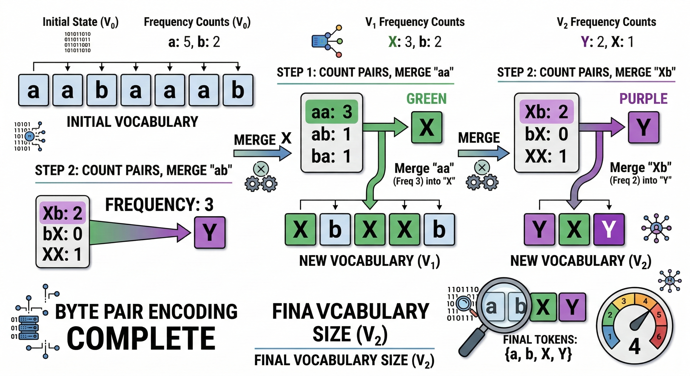
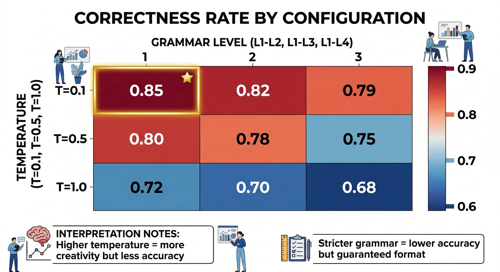
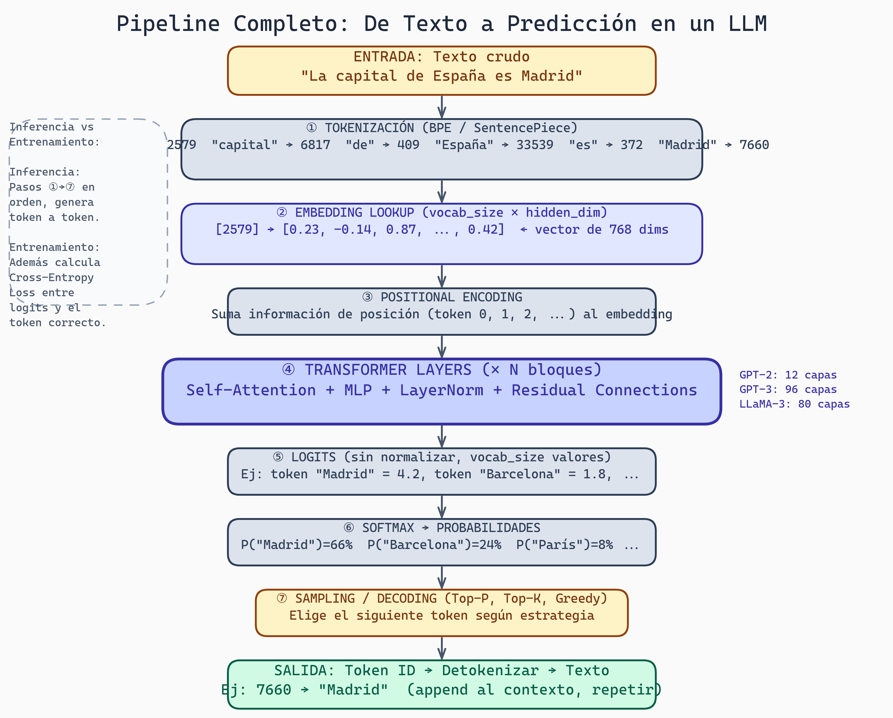
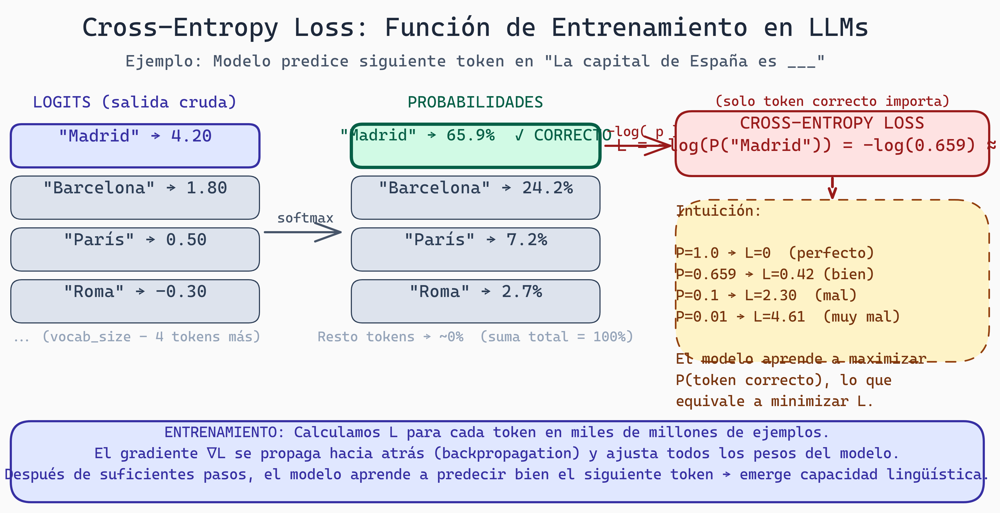

# Lectura 5: BERT, GPTs y Tokenización

## Introducción

Hasta ahora entiendes la arquitectura Transformer. Pero, ¿cómo se materializó en modelos que cambiaron el mundo? BERT revolucionó NLP con comprensión bidireccional. GPT demostró que escalar funciona. Y todo comienza con **tokenización**: convertir texto en números que el modelo entiende.

Esta lectura conecta arquitectura con implementaciones reales y el proceso fundamental de tokenización.

---

## Parte 1: BERT - Comprensión Bidireccional

### El Problema Pre-BERT

Antes de 2018, los modelos de lenguaje eran **unidireccionales**:

```
Oración: "El banco está cerca del río"

Modelo unidireccional (izquierda→derecha):
  "banco" se predice solo con contexto de "El"
  No sabe si es banco financiero o banco de río

Modelo bidireccional (BERT):
  "banco" se predice con contexto completo
  Ve "río" → entiende que es banco de agua
```

### Arquitectura BERT



> **Arquitectura bidireccional de BERT**
>
> BERT utiliza un Transformer Encoder que procesa texto en ambas direcciones simultáneamente, permitiendo que cada token atienda a todos los tokens de la secuencia. Esta arquitectura es fundamental para la comprensión profunda del contexto completo en tareas de procesamiento de lenguaje natural.

```
BERT = Transformer Encoder (bidireccional)

Entrada:  [CLS] El banco está cerca del río [SEP]
           ↓     ↓    ↓     ↓     ↓    ↓   ↓
        Embeddings + Positional + Segment
           ↓     ↓    ↓     ↓     ↓    ↓   ↓
        ┌─────────────────────────────────────┐
        │      12-24 Transformer Layers       │
        │      (Multi-Head Self-Attention)    │
        └─────────────────────────────────────┘
           ↓     ↓    ↓     ↓     ↓    ↓   ↓
        Representaciones contextualizadas
```

### Pre-entrenamiento de BERT

**Tarea 1: Masked Language Modeling (MLM)**

```
Original:  "El gato [MASK] sobre la mesa"
Objetivo:  Predecir "salta"

→ Fuerza comprensión bidireccional
→ 15% de tokens se enmascaran
```

**Tarea 2: Next Sentence Prediction (NSP)**

```
Oración A: "El perro ladró"
Oración B: "Tenía hambre"  → IsNext (relacionadas)
Oración B: "París es bonito" → NotNext (no relacionadas)
```

### Variantes de BERT

```
BERT-base:    110M parámetros, 12 layers, 768 hidden
BERT-large:   340M parámetros, 24 layers, 1024 hidden

RoBERTa:      Sin NSP, más datos, entrenamiento más largo
ALBERT:       Parámetros compartidos, más eficiente
DistilBERT:   66% más pequeño, 97% performance
```

---

## Parte 2: GPT - Generación Autoregresiva a Escala

### Filosofía GPT

Mientras BERT comprende, GPT genera. La apuesta: **escalar funciona**.

```
GPT-1 (2018):   117M parámetros
GPT-2 (2019):   1.5B parámetros  → "Demasiado peligroso para publicar"
GPT-3 (2020):   175B parámetros → Few-shot learning emerge
GPT-4 (2023):   ~1.7T parámetros (estimado)
```

### Arquitectura GPT

```
GPT = Transformer Decoder (unidireccional)

Diferencia clave con BERT:
  - Masked self-attention (solo ve tokens anteriores)
  - Entrenado para predecir siguiente token
  - Genera texto autorregressivamente

Entrada:  "El gato"
Proceso:
  P(siguiente | "El gato") → "salta"
  P(siguiente | "El gato salta") → "sobre"
  ...
```

### Emergent Abilities



> **Leyes de escalado y capacidades emergentes en modelos generativos**
>
> Este diagrama muestra cómo las capacidades emergen de manera no lineal con el aumento de parámetros y datos de entrenamiento. A cierta escala crítica, el modelo desarrolla repentinamente habilidades complejas que no aparecen en modelos más pequeños, ilustrando un fenómeno fundamental en el aprendizaje profundo moderno.

A cierta escala, emergen capacidades no entrenadas explícitamente:

```
Escala pequeña (<10B):
  - Completa texto
  - Traduce (si entrenado)

Escala media (10-100B):
  - Few-shot learning
  - Razonamiento básico

Escala grande (>100B):
  - Chain-of-thought
  - Razonamiento complejo
  - Código
```

### GPT para Código

```python
# CodeX/Codex: GPT fine-tuned en código
# Base de GitHub Copilot

Prompt: "# Función que ordena una lista"
Output:
def sort_list(lst):
    return sorted(lst)
```

---

## Parte 3: Tokenización

### ¿Por Qué Tokenizar?

Los modelos no entienden texto. Necesitan números.

```
Texto:     "Hello world"
Tokens:    [15496, 995]    # IDs numéricos
Embeddings: [[0.1, -0.3, ...], [0.5, 0.2, ...]]  # Vectores
```

### Estrategias de Tokenización



> **Taxonomía de estrategias de tokenización**
>
> Este diagrama ilustra el espectro completo de enfoques para tokenización: desde tokenización por palabras (vocabulario grande pero incompletitud), pasando por caracteres (vocabulario pequeño pero secuencias largas), hasta tokenización subword (óptimo balance). La comprensión visual de estos trade-offs es esencial para diseñar sistemas de procesamiento de lenguaje eficientes.

**1. Word-level (palabras)**
```
"I love programming" → ["I", "love", "programming"]

Problemas:
  - Vocabulario enorme (100k+ palabras)
  - OOV (out-of-vocabulary): "unforgettable" → [UNK]
  - No maneja typos: "progrmaing" → [UNK]
```

**2. Character-level (caracteres)**
```
"Hello" → ["H", "e", "l", "l", "o"]

Problemas:
  - Secuencias muy largas
  - Pierde significado semántico
  - Ineficiente para transformers
```

**3. Subword (BPE, WordPiece, SentencePiece)**
```
"unforgettable" → ["un", "forget", "table"]
"programming"   → ["program", "ming"]

Ventajas:
  - Vocabulario manejable (~30-50k)
  - Maneja palabras nuevas
  - Balance entre word y character
```

### BPE (Byte Pair Encoding)



> **Proceso iterativo de codificación por pares de bytes (BPE)**
>
> BPE construye un vocabulario subword de manera automática mediante fusiones iterativas de pares de caracteres frecuentes. Este enfoque balancear eficiencia computacional con la capacidad de representar palabras nuevas o raras, fundamental para tokenización robusta en modelos modernos.

Algoritmo paso a paso:

```python
# Corpus inicial
vocabulary = {'l o w </w>': 5, 'l o w e r </w>': 2,
              'n e w e s t </w>': 6, 'w i d e s t </w>': 3}

# Paso 1: Contar pares de caracteres
pairs = {('e', 's'): 9, ('s', 't'): 9, ('t', '</w>'): 9, ...}

# Paso 2: Merge el par más frecuente
'es' se convierte en un token
vocabulary = {'l o w </w>': 5, 'l o w e r </w>': 2,
              'n e w es t </w>': 6, 'w i d es t </w>': 3}

# Repetir hasta alcanzar tamaño de vocabulario deseado
```

### Implementación con tiktoken (OpenAI)

```python
import tiktoken

# Encoder para GPT-4
enc = tiktoken.encoding_for_model("gpt-4")

text = "def hello_world():"
tokens = enc.encode(text)
print(tokens)  # [755, 23748, 11645, 33529, 25]
print(len(tokens))  # 5 tokens

# Decodificar
decoded = enc.decode(tokens)
print(decoded)  # "def hello_world():"

# Ver tokens individuales
for token in tokens:
    print(f"{token} → '{enc.decode([token])}'")
# 755 → 'def'
# 23748 → ' hello'
# 11645 → '_world'
# 33529 → '()'
# 25 → ':'
```

### Tokenización de Código

El código tiene características especiales:

```python
# Código Triton
code = """
@triton.jit
def add_kernel(x_ptr, y_ptr, n):
    pid = tl.program_id(0)
"""

# Con tiktoken (cl100k_base)
tokens = enc.encode(code)
print(f"Tokens: {len(tokens)}")  # ~25-30 tokens

# Observaciones:
# - "@triton" puede ser 2 tokens: "@" + "triton"
# - "program_id" puede ser: "program" + "_id"
# - Indentación consume tokens
```

### SentencePiece (Google)

Alternativa a BPE, usado en T5, LLaMA:

```python
import sentencepiece as spm

# Entrenar modelo
spm.SentencePieceTrainer.train(
    input='corpus.txt',
    model_prefix='tokenizer',
    vocab_size=32000,
    model_type='bpe'  # o 'unigram'
)

# Usar modelo
sp = spm.SentencePieceProcessor()
sp.load('tokenizer.model')

tokens = sp.encode_as_pieces("Hello world")
# ['▁Hello', '▁world']  # ▁ marca inicio de palabra
```

### Comparación de Tokenizadores



> **Comparación visual de estrategias de tokenización**
>
> Diferentes tokenizadores emplean estrategias distintas para descomponer palabras en subunidades. El diagrama comparativo ayuda a entender las fortalezas y debilidades de BPE, WordPiece y SentencePiece en contextos variados, desde generación de texto hasta procesamiento multilingüe.

| Aspecto | BPE (GPT) | WordPiece (BERT) | SentencePiece |
|---------|-----------|------------------|---------------|
| Merge | Más frecuente | Maximiza likelihood | Unigram/BPE |
| Prefijo | Ninguno | ## para continuación | ▁ para inicio |
| Usado en | GPT, CodeX | BERT, DistilBERT | T5, LLaMA |

---

## Parte 4: De Texto a Modelo

### Pipeline Completo

```
Texto crudo
    ↓
Tokenización (BPE/SentencePiece)
    ↓
Token IDs [15496, 995, ...]
    ↓
Embedding lookup (vocab_size × hidden_dim)
    ↓
Positional encoding
    ↓
Transformer layers
    ↓
Logits (vocab_size)
    ↓
Softmax → Probabilidades
    ↓
Sampling/Decoding
    ↓
Token ID → Detokenizar → Texto
```



> **Pipeline Completo: De Texto a Predicción en un LLM**
>
> El diagrama muestra los 7 pasos que recorre cualquier texto al pasar por un LLM: desde la tokenización BPE que convierte palabras a IDs, pasando por el embedding lookup y positional encoding, hasta las capas Transformer que producen logits. Finalmente, el softmax convierte los logits en probabilidades y el sampling elige el siguiente token. La nota lateral distingue inferencia (pasos ①–⑦) del entrenamiento, donde además se calcula el Cross-Entropy Loss contra el token correcto.

### Vocabulario y Embeddings

```python
# En PyTorch
import torch.nn as nn

vocab_size = 50257  # GPT-2
hidden_dim = 768

embedding = nn.Embedding(vocab_size, hidden_dim)

# Token ID → Vector
token_id = torch.tensor([15496])  # "Hello"
vector = embedding(token_id)  # Shape: [1, 768]
```

### Impacto del Tokenizador

```
Mismo texto, diferentes tokenizadores:

Texto: "tl.load(x_ptr + offsets)"

GPT-4 (cl100k):  ~8 tokens
LLaMA:           ~10 tokens
BERT:            ~12 tokens

Impacto:
  - Más tokens = más costo ($)
  - Más tokens = más lento
  - Más tokens = menos contexto disponible
```

---

## Parte 5: Logits, Softmax y Cross-Entropy

### De Logits a Probabilidades

```python
import torch
import torch.nn.functional as F

# Logits: output crudo del modelo (sin normalizar)
logits = torch.tensor([2.0, 1.0, 0.1])

# Softmax: convierte a probabilidades
probs = F.softmax(logits, dim=-1)
# tensor([0.659, 0.242, 0.099])
# Suma = 1.0

# Interpretación:
# Token 0: 65.9% probabilidad
# Token 1: 24.2% probabilidad
# Token 2:  9.9% probabilidad
```

### Temperature

```python
def softmax_with_temp(logits, temperature=1.0):
    return F.softmax(logits / temperature, dim=-1)

logits = torch.tensor([2.0, 1.0, 0.1])

# T=1.0 (normal)
softmax_with_temp(logits, 1.0)  # [0.659, 0.242, 0.099]

# T=0.5 (más confiado)
softmax_with_temp(logits, 0.5)  # [0.836, 0.142, 0.022]

# T=2.0 (más uniforme)
softmax_with_temp(logits, 2.0)  # [0.506, 0.307, 0.187]
```

### Cross-Entropy Loss

```python
# Función de pérdida para entrenamiento
loss_fn = nn.CrossEntropyLoss()

# Logits del modelo (batch=1, vocab_size=3)
logits = torch.tensor([[2.0, 1.0, 0.1]])

# Target: el token correcto es el índice 0
target = torch.tensor([0])

loss = loss_fn(logits, target)
# loss ≈ 0.417

# Interpretación:
# - Loss bajo = modelo confiado en respuesta correcta
# - Loss alto = modelo equivocado o inseguro
```



> **Cross-Entropy Loss: Función de Entrenamiento en LLMs**
>
> El diagrama muestra el flujo completo: los logits crudos del modelo se convierten en probabilidades vía softmax, y luego se calcula `-log(P(token_correcto))` como función de pérdida. Solo la probabilidad asignada al token correcto entra en el cálculo. La intuición clave: P=1.0 produce L=0 (perfecto), mientras que una probabilidad baja produce una pérdida alta. Backpropagation ajusta los pesos para maximizar P del token correcto en miles de millones de ejemplos.

---

## Ejercicios Prácticos

### Ejercicio 1: Explorar Tokenización

```python
import tiktoken

enc = tiktoken.encoding_for_model("gpt-4")

# Tokeniza estos snippets de Triton
snippets = [
    "@triton.jit",
    "tl.load(x_ptr + offsets, mask=mask)",
    "pid = tl.program_id(axis=0)",
]

for s in snippets:
    tokens = enc.encode(s)
    print(f"'{s}' → {len(tokens)} tokens")
    for t in tokens:
        print(f"  {t}: '{enc.decode([t])}'")
```

### Ejercicio 2: Comparar Tokenizadores

Compara cómo diferentes tokenizadores manejan código Triton. ¿Cuál es más eficiente?

### Ejercicio 3: Visualizar Attention

Usa BertViz para visualizar qué tokens "atienden" a cuáles en un snippet de código.

---

## Preguntas de Reflexión

1. ¿Por qué BERT usa [MASK] en lugar de predecir el siguiente token como GPT?

2. Si entrenaras un tokenizador específico para código Triton, ¿qué tokens "especiales" incluirías?

3. ¿Cómo afecta la elección de tokenizador al costo de usar un LLM para generar kernels?

---

## Recursos

- **Paper BERT**: Devlin et al. "BERT: Pre-training of Deep Bidirectional Transformers"
- **Paper GPT-3**: Brown et al. "Language Models are Few-Shot Learners"
- **BPE Original**: Sennrich et al. "Neural Machine Translation of Rare Words with Subword Units"
- **tiktoken**: github.com/openai/tiktoken
- **Hugging Face Tokenizers**: huggingface.co/docs/tokenizers

---

*Esta lectura es parte del curso "Grammar-Constrained GPU Kernel Generation" - TC3002B*
