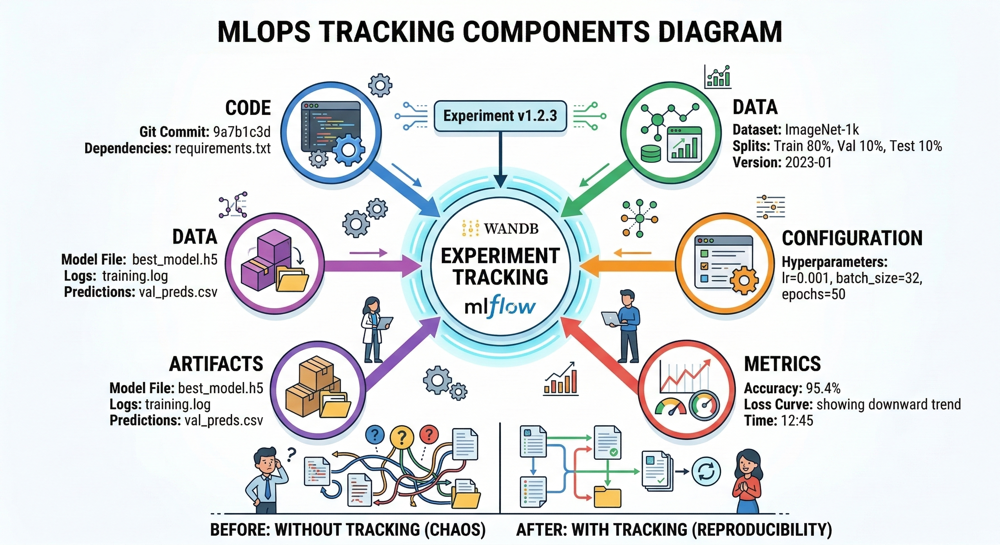
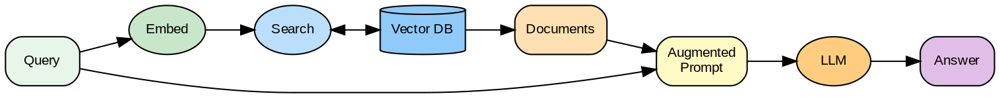
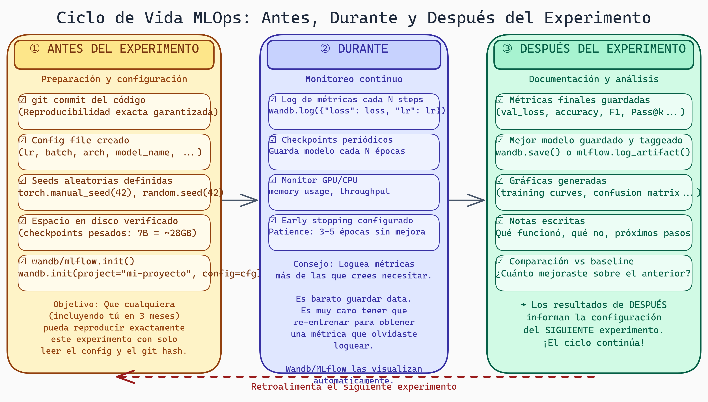

# Lectura 8: MLOps Básico y Visualización

## Introducción

Has entrenado modelos, generado código, evaluado resultados. Pero, ¿cómo **rastrear** todo? ¿Cómo saber qué hiperparámetros usaste hace 3 semanas? ¿Cómo comparar 50 experimentos?

MLOps (Machine Learning Operations) resuelve esto: logging sistemático, versionado de experimentos, y visualización efectiva. Esta lectura te da las herramientas para investigación reproducible.

---

## Parte 1: El Problema del Tracking

### Escenario Común

```
Semana 1:
  - Entrené modelo con lr=0.001, batch=32
  - Resultados: 78% accuracy
  - Guardé en: model_v1.pt

Semana 3:
  - Entrené con lr=0.0001, batch=64
  - Resultados: 82% accuracy
  - Guardé en: model_final_v2_really_final.pt

Semana 5:
  - ¿Cuál era la configuración de model_v1?
  - ¿Por qué v2 es mejor?
  - ¿Qué datos usé?
  → No sé 😱
```

### Lo Que Necesitas Rastrear

```
1. CÓDIGO
   - Versión de git commit
   - Dependencias (requirements.txt)

2. DATOS
   - Dataset usado
   - Splits train/val/test
   - Preprocesamiento

3. CONFIGURACIÓN
   - Hiperparámetros
   - Arquitectura
   - Seeds aleatorias

4. MÉTRICAS
   - Loss por época
   - Métricas de evaluación
   - Tiempo de entrenamiento

5. ARTEFACTOS
   - Checkpoints del modelo
   - Gráficas generadas
   - Predicciones de ejemplo
```

---

## Parte 2: Weights & Biases (wandb)



> **Componentes integrales de MLOps para rastreo de experimentos**
>
> El rastreo efectivo de experimentos requiere capturar múltiples aspectos: código, datos, configuración, métricas y artefactos. Este diagrama ilustra cómo herramientas como Weights & Biases organizan e integran todos estos componentes, permitiendo reproducibilidad total y comparación sistemática entre experimentos en proyectos de aprendizaje automático.

### Setup Básico

```python
import wandb

# Inicializar proyecto
wandb.init(
    project="kernel-generation",
    name="experiment-001",
    config={
        "learning_rate": 0.001,
        "batch_size": 32,
        "model": "codellama-7b",
        "temperature": 0.1,
    }
)
```

### Logging de Métricas

```python
# Durante entrenamiento
for epoch in range(100):
    train_loss = train_one_epoch()
    val_loss = validate()

    wandb.log({
        "epoch": epoch,
        "train_loss": train_loss,
        "val_loss": val_loss,
        "learning_rate": scheduler.get_lr()[0]
    })

# Métricas finales
wandb.log({
    "final_accuracy": 0.85,
    "total_time_hours": 2.5
})
```

### Logging de Configuración Completa

```python
config = {
    # Modelo
    "model_name": "codellama-7b",
    "quantization": "int8",

    # Entrenamiento
    "learning_rate": 1e-4,
    "batch_size": 32,
    "epochs": 10,
    "optimizer": "adamw",
    "weight_decay": 0.01,

    # Datos
    "dataset": "triton-corpus-v2",
    "train_size": 5000,
    "val_size": 500,

    # Generación
    "temperature": 0.1,
    "max_tokens": 512,
    "grammar_enabled": True,

    # Reproducibilidad
    "seed": 42,
    "git_commit": get_git_hash(),
}

wandb.init(project="kernel-gen", config=config)
```

### Tablas y Artefactos

```python
# Tabla de resultados
results_table = wandb.Table(
    columns=["kernel_id", "correctness", "speedup", "tokens"],
    data=[
        ["softmax_v1", True, 1.3, 245],
        ["matmul_v1", True, 1.1, 512],
        ["relu_v1", False, 0.0, 128],
    ]
)
wandb.log({"results": results_table})

# Guardar artefactos
artifact = wandb.Artifact("model-checkpoint", type="model")
artifact.add_file("model.pt")
wandb.log_artifact(artifact)
```

### Comparación de Experimentos

```python
# En la UI de wandb:
# 1. Selecciona múltiples runs
# 2. Compara métricas lado a lado
# 3. Identifica qué configuración funciona mejor

# Programáticamente:
api = wandb.Api()
runs = api.runs("username/kernel-generation")

for run in runs:
    print(f"{run.name}: accuracy={run.summary['accuracy']}")
```

---

## Parte 3: MLflow (Alternativa)

### Setup Básico

```python
import mlflow

# Configurar tracking server
mlflow.set_tracking_uri("http://localhost:5000")
mlflow.set_experiment("kernel-generation")

# Iniciar run
with mlflow.start_run(run_name="experiment-001"):
    # Log parámetros
    mlflow.log_param("learning_rate", 0.001)
    mlflow.log_param("model", "codellama-7b")

    # Log métricas
    for epoch in range(10):
        mlflow.log_metric("loss", loss, step=epoch)

    # Log modelo
    mlflow.pytorch.log_model(model, "model")
```

### Comparación wandb vs MLflow

| Aspecto | wandb | MLflow |
|---------|-------|--------|
| Hosting | Cloud (gratis hasta cierto punto) | Self-hosted o cloud |
| UI | Muy pulida | Funcional |
| Colaboración | Excelente | Básica |
| Integración | Muchos frameworks | Flexible |
| Costo | Gratis para académicos | Open source |

---

## Parte 4: Versionado de Experimentos

### Estructura de Directorios

```
experiments/
├── 2024-03-01_baseline/
│   ├── config.yaml
│   ├── metrics.json
│   ├── model.pt
│   └── logs/
├── 2024-03-05_grammar-v1/
│   ├── config.yaml
│   ├── metrics.json
│   ├── model.pt
│   └── logs/
└── 2024-03-10_grammar-v2/
    ├── config.yaml
    ├── metrics.json
    ├── model.pt
    └── logs/
```

### Config Files (YAML)

```yaml
# config.yaml
experiment:
  name: "grammar-v2"
  date: "2024-03-10"
  git_commit: "abc123"

model:
  name: "codellama-7b"
  quantization: "int8"

training:
  learning_rate: 0.0001
  batch_size: 64
  epochs: 20

generation:
  temperature: 0.1
  max_tokens: 512
  grammar:
    enabled: true
    version: "L1-L4-v2"

data:
  train_path: "data/train.json"
  val_path: "data/val.json"

seeds:
  numpy: 42
  torch: 42
  python: 42
```

### Hydra para Configuración

```python
import hydra
from omegaconf import DictConfig

@hydra.main(config_path="configs", config_name="default")
def train(cfg: DictConfig):
    print(f"Learning rate: {cfg.training.learning_rate}")
    print(f"Model: {cfg.model.name}")

    # Hydra guarda automáticamente la config usada
    # en outputs/YYYY-MM-DD/HH-MM-SS/.hydra/

if __name__ == "__main__":
    train()
```

---



> **Pipeline RAG como Sistema de Producción**
>
> Un pipeline RAG en producción involucra múltiples componentes a monitorear: ingesta y vectorización de documentos, búsqueda semántica en el vector store, ensamble del contexto, llamada al LLM y post-procesamiento. MLOps debe rastrear métricas en cada etapa: latencia de retrieval, relevancia de chunks, calidad de respuesta y costos de tokens.

## Parte 5: Visualización de Resultados

### Principios de Visualización

```
1. CLARIDAD sobre decoración
   - Un mensaje por gráfica
   - Eliminar elementos innecesarios

2. COMPARACIÓN efectiva
   - Misma escala para comparar
   - Agrupar relacionados

3. HONESTIDAD
   - Mostrar incertidumbre (barras de error)
   - No truncar ejes engañosamente

4. ACCESIBILIDAD
   - Colores distinguibles (colorblind-friendly)
   - Etiquetas legibles
```

### Gráficas Comunes en ML

**1. Curvas de Entrenamiento**

```python
import matplotlib.pyplot as plt

fig, ax = plt.subplots(figsize=(10, 6))

ax.plot(epochs, train_loss, label='Train', color='blue')
ax.plot(epochs, val_loss, label='Validation', color='orange')

ax.set_xlabel('Epoch')
ax.set_ylabel('Loss')
ax.set_title('Training Progress')
ax.legend()
ax.grid(True, alpha=0.3)

plt.savefig('training_curve.png', dpi=150, bbox_inches='tight')
```

**2. Comparación de Métodos (Boxplot)**

```python
import seaborn as sns

data = {
    'Method': ['Baseline']*50 + ['Grammar']*50,
    'Speedup': baseline_speedups + grammar_speedups
}
df = pd.DataFrame(data)

fig, ax = plt.subplots(figsize=(8, 6))
sns.boxplot(x='Method', y='Speedup', data=df, ax=ax)
ax.set_title('Speedup Distribution: Baseline vs Grammar')
ax.axhline(y=1.0, color='red', linestyle='--', label='PyTorch baseline')
```

**3. Heatmap de Resultados**

```python
# Resultados por configuración
results = np.array([
    [0.85, 0.82, 0.79],  # temp=0.1
    [0.80, 0.78, 0.75],  # temp=0.5
    [0.72, 0.70, 0.68],  # temp=1.0
])

fig, ax = plt.subplots(figsize=(8, 6))
sns.heatmap(
    results,
    annot=True,
    fmt='.2f',
    xticklabels=['L1-L2', 'L1-L3', 'L1-L4'],
    yticklabels=['T=0.1', 'T=0.5', 'T=1.0'],
    cmap='YlGnBu',
    ax=ax
)
ax.set_xlabel('Grammar Level')
ax.set_ylabel('Temperature')
ax.set_title('Correctness Rate by Configuration')
```

**4. Scatter con Tendencia**

```python
fig, ax = plt.subplots(figsize=(8, 6))

ax.scatter(tokens_generated, execution_time, alpha=0.6)

# Línea de tendencia
z = np.polyfit(tokens_generated, execution_time, 1)
p = np.poly1d(z)
ax.plot(tokens_generated, p(tokens_generated), "r--", label='Trend')

ax.set_xlabel('Tokens Generated')
ax.set_ylabel('Execution Time (ms)')
ax.set_title('Generation Cost vs Token Count')
ax.legend()
```

### Paletas de Colores Accesibles

```python
# Paleta colorblind-friendly
colors = ['#0077BB', '#EE7733', '#009988', '#CC3311', '#33BBEE']

# O usar seaborn
sns.set_palette('colorblind')

# Verificar accesibilidad:
# - coblis.org (simulador de daltonismo)
# - Evitar rojo-verde como único diferenciador
```

---

## Parte 6: Reportes Automatizados

### Generación de Reportes

```python
def generate_experiment_report(run_dir: str) -> str:
    """Genera reporte Markdown de un experimento."""

    config = load_config(f"{run_dir}/config.yaml")
    metrics = load_json(f"{run_dir}/metrics.json")

    report = f"""
# Experiment Report: {config['experiment']['name']}

## Configuration
- Model: {config['model']['name']}
- Learning Rate: {config['training']['learning_rate']}
- Grammar: {config['generation']['grammar']['version']}

## Results
- Final Accuracy: {metrics['accuracy']:.2%}
- Average Speedup: {metrics['speedup']:.2f}x
- Success Rate: {metrics['success_rate']:.2%}

## Visualizations


## Notes
{load_notes(run_dir)}
"""
    return report
```

### Dashboard con Streamlit

```python
import streamlit as st

st.title("Kernel Generation Experiments")

# Selector de experimentos
experiments = list_experiments()
selected = st.selectbox("Select experiment", experiments)

# Mostrar métricas
metrics = load_metrics(selected)
col1, col2, col3 = st.columns(3)
col1.metric("Accuracy", f"{metrics['accuracy']:.2%}")
col2.metric("Speedup", f"{metrics['speedup']:.2f}x")
col3.metric("Success Rate", f"{metrics['success_rate']:.2%}")

# Gráfica interactiva
fig = create_training_plot(selected)
st.plotly_chart(fig)
```

---

## Parte 7: Checklist de MLOps

### Antes del Experimento

```
□ Versión de código commiteada (git)
□ Config file creado
□ Seeds definidas para reproducibilidad
□ Espacio en disco verificado
□ wandb/mlflow inicializado
```

### Durante el Experimento

```
□ Logging de métricas cada N steps
□ Checkpoints periódicos
□ Monitoreo de recursos (GPU memory, CPU)
□ Early stopping configurado
```

### Después del Experimento

```
□ Métricas finales guardadas
□ Mejor modelo guardado
□ Gráficas generadas
□ Notas escritas (qué funcionó, qué no)
□ Comparación con baseline documentada
```



> **Ciclo de Vida MLOps: Antes, Durante y Después del Experimento**
>
> El diagrama organiza las tres fases del ciclo de un experimento reproducible. La fase **Antes** (amber) establece la trazabilidad: git commit, config file, seeds y tracker inicializado. La fase **Durante** (indigo) garantiza monitoreo continuo: métricas por step, checkpoints periódicos, recursos GPU y early stopping. La fase **Después** (verde) cierra el loop: métricas finales, artefactos, gráficas y notas. La flecha de retroalimentación inferior indica que cada experimento informa el diseño del siguiente, creando un ciclo de mejora iterativa.

---

## Ejercicios Prácticos

### Ejercicio 1: Setup wandb

Configura wandb para tu proyecto y loguea un experimento simple.

### Ejercicio 2: Config con Hydra

Crea una estructura de configs para experimentos de generación de kernels.

### Ejercicio 3: Dashboard

Crea un dashboard simple en Streamlit que muestre resultados de múltiples experimentos.

---

## Preguntas de Reflexión

1. ¿Qué información perderías si no usaras tracking de experimentos?

2. ¿Cómo decidirías entre wandb y MLflow para tu proyecto?

3. ¿Qué visualizaciones serían más útiles para comunicar resultados de KernelBench?

---

## Recursos

- **Weights & Biases Docs**: docs.wandb.ai
- **MLflow Docs**: mlflow.org/docs
- **Hydra**: hydra.cc
- **Streamlit**: streamlit.io
- **Matplotlib Best Practices**: matplotlib.org/stable/tutorials

---

*Esta lectura es parte del curso "Grammar-Constrained GPU Kernel Generation" - TC3002B*
