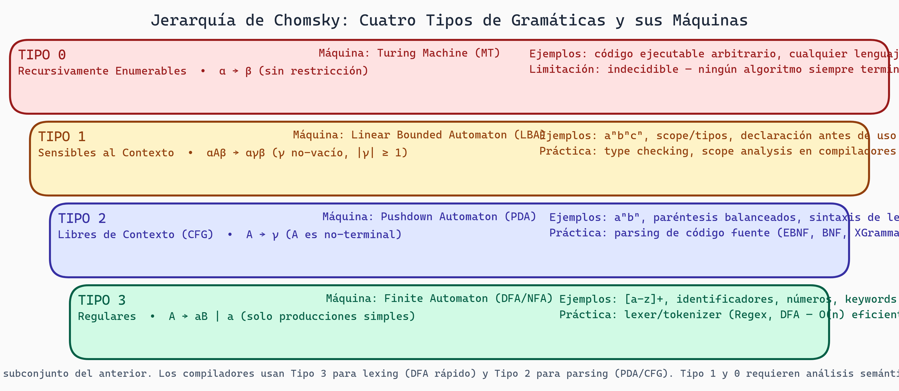

# Introducción a Compiladores

## ¿Qué es un Compilador?

Imagina que escribes un programa en Python o C++. Tu computadora no entiende directamente el código fuente que escribiste. Necesita traducirlo a instrucciones de máquina que pueda ejecutar. Eso es exactamente lo que hace un compilador: es un **traductor automático** que convierte código en un lenguaje fuente (el que escribimos) a un lenguaje destino (generalmente código de máquina o código intermedio).

En nuestro contexto del curso, estamos diseñando un compilador especializado para gramáticas libres de contexto que generarán kernels CUDA en GPU. El compilador tomará especificaciones en lenguaje natural o semi-formal, validará su estructura, y generará código eficiente para ejecutarse en hardware paralelo.

### Analogy: La Cocina

Piensa en un compilador como una cocina profesional:
- **Receta** = código fuente
- **Chef** = compilador
- **Ingredientes procesados** = tokens del código
- **Platos finales** = código ejecutable
- **Control de calidad** = optimizaciones

El chef no solo sigue la receta al pie; valida que todos los ingredientes sean correctos, los prepara eficientemente, y verifica que el plato final sea comestible y delicioso.

## Las Fases de un Compilador

Un compilador típico procesa el código fuente a través de varias etapas bien definidas. Entender estas fases es fundamental para comprender cómo XGrammar funciona internamente.


***Figura 1:** Fases del pipeline de compilación tradicional.*


### 1. Análisis Léxico (Lexing)

**Objetivo**: Convertir la secuencia de caracteres en tokens significativos.

```
Entrada:  "int x = 42;"
          ^^^         ← caracteres individuales

Salida:   [INT, ID('x'), ASSIGN, NUM(42), SEMICOLON]
                        ← tokens
```

El analizador léxico lee caracteres y agrupa palabras clave, identificadores, números, operadores, etc. Por ejemplo, cuando ve `int`, reconoce que es una palabra clave reservada.

**En XGrammar**: La fase léxica está implícitamente definida en cómo especificamos los tokens en nuestra gramática. Cuando escribimos:

```
KEYWORD = "int" | "float" | "for"
```

Estamos definiendo patrones que el compilador debe reconocer en la entrada.

### 2. Análisis Sintáctico (Parsing)

**Objetivo**: Verificar que los tokens sigan la estructura definida por la gramática, construyendo un árbol de análisis sintáctico.

```
Tokens:   [INT, ID, ASSIGN, NUM, SEMICOLON]

Árbol:              declaración
                   /     |     \
                 tipo   id   asignación
                 |      |       /  \
                INT     x      =   valor
                              |
                             42
```

El analizador sintáctico verifica que la secuencia de tokens cumple con las reglas de la gramática. En nuestro caso, si la entrada viola las reglas (por ejemplo, `int = 42 x`), el parser rechaza la entrada.

**En XGrammar**: Es la fase central. Nuestro compilador debe generar un parser (típicamente un Earley parser) que acepte exactamente los strings definidos por nuestra gramática CFG.

### 3. Análisis Semántico

**Objetivo**: Verificar que el significado del programa sea válido y coherente.

Este es el nivel donde:
- Se verifican tipos (`int x = "hello"` sería un error de tipo)
- Se resuelven referencias a variables (¿está `x` declarada antes de usarse?)
- Se analizan alcances (¿en qué contexto es válido este identificador?)

```
Problema: x + y
Pregunta: ¿Están x e y definidas antes?
```

Las CFGs **no pueden** verificar esto directamente. Por eso las lenguajes de programación reales van más allá de CFGs. Por ejemplo, no puedes expresar "las llaves deben estar balanceadas *y* cada variable debe estar declarada" solo con una CFG.

### 4. Optimización

**Objetivo**: Mejorar el código intermedio sin cambiar su comportamiento observable.

Ejemplos de optimizaciones:
- **Dead Code Elimination**: Remover código inalcanzable
- **Constant Folding**: Reemplazar `3 + 4` con `7` en tiempo de compilación
- **Loop Unrolling**: Expandir loops para mejor paralelismo (importante para GPUs)
- **Register Allocation**: Decidir qué valores guardar en qué registros

En el contexto de XGrammar:
```
Regla original:
  expr = term | expr '+' term | expr '-' term

Optimizada (factorizada):
  expr = term (('+' | '-') term)*
```

Ambas aceptan el mismo lenguaje, pero la segunda es más eficiente de compilar y ejecutar.

### 5. Generación de Código

**Objetivo**: Traducir a código en el lenguaje destino (máquina, ensamblador, otra lenguaje).

```
Entrada optimizada:  x = (y + 3) * 2

Código LLVM:         %1 = add i32 %y, 3
                     %2 = mul i32 %1, 2
                     store i32 %2, i32* %x

Código CUDA:         int temp = y + 3;
                     x = temp * 2;
```

Para XGrammar, la "generación de código" significa generar un parser eficiente que acepte exactamente el lenguaje especificado.

## Resumen Visual de las Fases

```
código fuente
    ↓
[LEXING] → tokens
    ↓
[PARSING] → árbol sintáctico
    ↓
[ANÁLISIS SEMÁNTICO] → validación de significado
    ↓
[OPTIMIZACIÓN] → código intermedio optimizado
    ↓
[CODEGEN] → código destino (máquina, CUDA, etc.)
```

Cada fase produce salida que la siguiente fase consume. Aunque técnicamente pueden saltarse algunas fases dependiendo del caso de uso, este orden es el estándar.

## La Jerarquía de Chomsky

Ahora hablaremos de un concepto teórico crucial: la **Jerarquía de Chomsky**. Esta jerarquía clasifica lenguajes según su poder expresivo y las gramáticas que los generan.

### Tipo 0: Lenguajes Recursivamente Enumerables

**Características**: Sin restricciones. Las reglas pueden tener cualquier forma.

```
Producción general: α → β  (donde α y β son cualquier string)
```

**Poder**: Pueden expresar cualquier cosa computable (equivalente a máquinas de Turing).

**Ejemplo**: "El número de 1s es igual al número de 2s en un string", "Código ejecutable válido"

**Limitación**: Indecidible. No existe algoritmo que siempre termine para reconocerlos.

### Tipo 1: Lenguajes Sensibles al Contexto (Context-Sensitive)

**Características**: Las reglas deben ser no-decrecientes en longitud.

```
Producción: αAβ → αγβ  (donde γ es no-vacío y más largo que A)
```

**Poder**: Pueden expresar restricciones de alcance, tipos, y memoria limitada.

**Ejemplo**: "Las llaves están balanceadas Y cada variable está declarada"

```
a^n b^n c^n  (lenguaje context-sensitive)
```

**Máquina asociada**: Autómata lineal acotado (LBA - Linear Bounded Automaton)

### Tipo 2: Lenguajes Libres de Contexto (Context-Free)

**Características**: Las reglas tienen un solo no-terminal a la izquierda.

```
Producción: A → β
```

**Poder**: Pueden expresar la mayoría de estructuras sintácticas de lenguajes de programación.

**Ejemplo**: Expresiones aritméticas, balanceo de paréntesis, JSON

```
S → ( S ) S | ε  (paréntesis balanceados)
```

**Máquina asociada**: Autómata de pila (PDA - Pushdown Automaton)

**Nota importante para XGrammar**: Nuestras gramáticas son CFGs. Esto significa que podemos validar estructura, pero NO podemos validar semántica compleja (tipos, alcances, etc.) directamente en la gramática.

### Tipo 3: Lenguajes Regulares

**Características**: Las reglas son muy restrictivas. Solo un no-terminal, a la derecha, al final.

```
Producción: A → aB | a | ε
```

**Poder**: Pueden expresar patrones simples.

**Ejemplo**: Números en punto flotante, identificadores válidos, palabras clave

```
ID → [a-zA-Z_][a-zA-Z0-9_]*
```

**Máquina asociada**: Autómata finito (DFA/NFA)

### Jerarquía Ilustrada

```
Tipo 0 (Recursivamente Enumerable)
    ↑
    ├─── Más poder expresivo
Tipo 1 (Context-Sensitive)
    ↑
    ├─── Más fácil de reconocer
Tipo 2 (Context-Free) ← ¡Aquí estamos nosotros!
    ↑
    ├─── Más fácil de implementar
Tipo 3 (Regular)
    ↓
    └─── Menos poder expresivo
```

### Relaciones de Inclusión

```
Regular ⊂ Context-Free ⊂ Context-Sensitive ⊂ Recursivamente Enumerable
```

Cada clase contiene todas las clases anteriores. Un lenguaje regular también es context-free.



> **Jerarquía de Chomsky — Cuatro Niveles de Poder Expresivo**
>
> Cada nivel anida al anterior: los lenguajes regulares (Tipo 3) son un subconjunto de los CFG (Tipo 2), que son un subconjunto de los context-sensitive (Tipo 1), que a su vez son un subconjunto de los recursivamente enumerables (Tipo 0). XGrammar opera principalmente en el nivel Tipo 2.

## Aplicación a XGrammar

En el proyecto, trabajamos con Tipo 2 (CFG). Esto significa:

✅ **Podemos expresar:**
- Estructura de JSON
- Sintaxis de kernels Triton
- Procedimiento estructurado
- Expresiones anidadas

❌ **NO podemos expresar directamente:**
- "Variables deben estar declaradas antes de usarse"
- "Tipos deben coincidir en asignaciones"
- "Indentación válida" (requiere Tipo 1)

**Solución**: Combinamos gramática CFG con **análisis semántico post-parsing** para validar restricciones que van más allá de lo que la CFG puede expresar.

## Reflexión

La teoría de Chomsky no es solo matemática abstracta. Es el fundamento de cómo entendemos lo que es expresable en un lenguaje. Cuando diseñamos nuestra gramática DSL para XGrammar, estamos eligiendo deliberadamente vivir en el nivel Type 2 (CFG) porque:

1. Es lo suficientemente poderoso para expresar sintaxis
2. Es lo suficientemente simple para compilar eficientemente
3. Podemos agregar análisis semántico después para restricciones más complejas

## Ejercicios

1. **Identificación de Fases**: Dado el código `x = 10 + 5 * 2;`, describe qué sucede en cada fase del compilador.

2. **Jerarquía de Chomsky**: Clasifica los siguientes lenguajes en la jerarquía de Chomsky:
   - Números binarios válidos: `0`, `1`, `01`, `101`
   - Paréntesis balanceados: `()`, `(())`, `()()`
   - `a^n b^n c^n` (n de cada letra)
   - El código de un programa Python completo

3. **Limitaciones de CFG**: ¿Por qué no podemos expresar con una sola CFG que "cada variable debe estar declarada antes de usarse"? ¿Qué tipo de Chomsky necesitaríamos?

4. **Diseño de Gramática**: Propón una gramática CFG simple para números en punto flotante. ¿Qué patrones acepta?

## Preguntas de Reflexión

- ¿Cuál es la diferencia entre "poder expresivo" y "facilidad de implementación"? ¿Por qué XGrammar elige CFG en lugar de Tipo 1?
- Si pudiéramos usar gramáticas Tipo 1, ¿qué problemas en verificación de GPU kernels podrían resolverse?
- ¿Cómo crees que una IA completa (Tipo 0) podría generar kernels CUDA mejores que un compilador basado en CFG?
