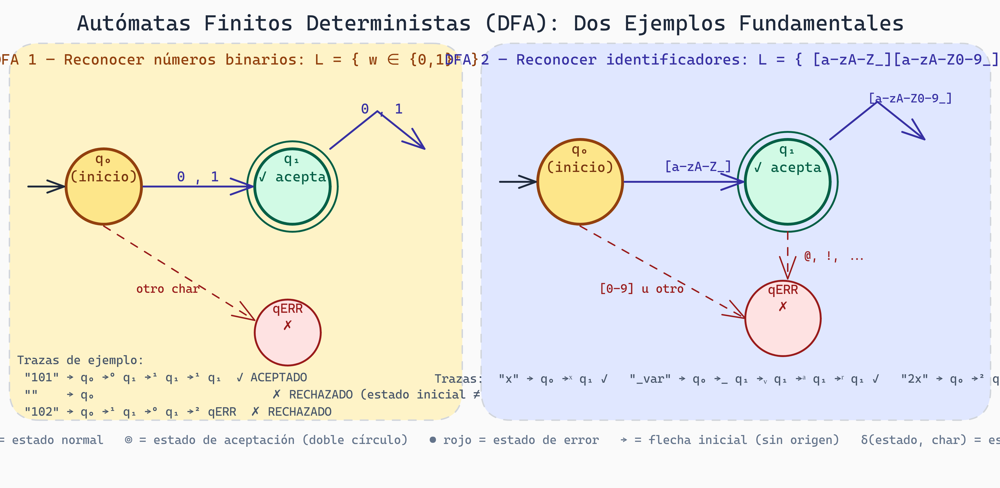
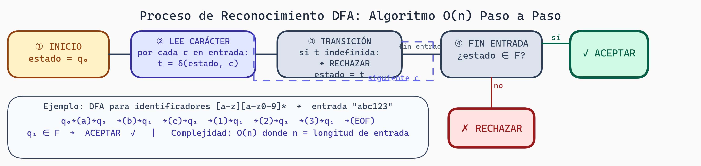

# Lenguajes Regulares y Autómatas Finitos Deterministas

## Contexto
Esta lectura presenta los fundamentos del análisis léxico: cómo reconocer patrones usando autómatas finitos. Los DFAs son la base para construir **lexers** (primera fase del compilador), NO el parser completo.

## Introducción: La Potencia de lo Simple

Antes de construir parsers complejos, necesitamos dominar lo básico: reconocer **patrones simples**. Un identificador en C como `variable_name`, un número como `3.14`, una palabra clave como `if`. Todos estos son ejemplos de **lenguajes regulares**.

Los lenguajes regulares son los más simples en la jerarquía de Chomsky (Tipo 3), pero tienen una propiedad especial: pueden reconocerse **muy eficientemente** usando máquinas simples llamadas **autómatas finitos**. Esta es la base de la fase léxica en cualquier compilador.

## Expresiones Regulares: El Lenguaje de los Patrones

Una **expresión regular** (regex) es una forma compacta de describir patrones en strings. Si has usado alguna vez `grep` o validado un email con regex, ya has trabajado con esto.

### Notación Básica

```
a        → la letra 'a' exactamente
a|b      → 'a' OR 'b'
ab       → 'a' seguida de 'b' (concatenación)
a*       → cero o más 'a'
a+       → uno o más 'a'
a?       → cero o uno 'a'
[abc]    → cualquiera de 'a', 'b', 'c'
[a-z]    → cualquier letra minúscula
.        → cualquier carácter (en la mayoría de sistemas)
```

### Ejemplos Prácticos

```
Identificador:     [a-zA-Z_][a-zA-Z0-9_]*
Número entero:     -?[0-9]+
Número flotante:   -?[0-9]+(\.[0-9]+)?
Email simple:      [a-z]+@[a-z]+\.[a-z]+
Palabra clave:     (if|else|while|for)
```

**En contexto de GPU**: Imagine especificar patrones válidos en un kernel CUDA:

```
thread_id:  blockIdx\.x|blockIdx\.y|blockIdx\.z
kernel_name: [a-zA-Z_][a-zA-Z0-9_]*
```

### Composición

Las expresiones regulares son **composables**. Puedes definir una en términos de otras:

```
DIGIT = [0-9]
INT = -?{DIGIT}+
FLOAT = {INT}\.{DIGIT}+
NUMBER = {INT}|{FLOAT}
```

Esta es la base de cómo se definen tokens en la mayoría de generadores de parsers (lex, flex).

## Autómatas Finitos Deterministas (DFA)

Un **DFA** (Deterministic Finite Automaton) es una máquina imaginaria que reconoce patrones. Está compuesto de:

1. **Estados**: Puntos de decisión
2. **Transiciones**: Aristas etiquetadas con caracteres
3. **Estado inicial**: Por donde empezamos
4. **Estados de aceptación**: Estados "felices" que significan "acepté el string"

### Definición Formal

Un DFA es una tupla: **M = (Q, Σ, δ, q₀, F)**

- **Q**: Conjunto de estados (finito)
- **Σ**: Alfabeto (conjunto de caracteres que procesamos)
- **δ**: Función de transición (Q × Σ → Q)
- **q₀**: Estado inicial
- **F ⊆ Q**: Estados de aceptación

### Ejemplo 1: Reconocer "hola"

```
q₀ --h--> q₁ --o--> q₂ --l--> q₃ --a--> q₄(accept)

Transiciones por carácter:
δ(q₀, 'h') = q₁
δ(q₁, 'o') = q₂
δ(q₂, 'l') = q₃
δ(q₃, 'a') = q₄

Entrada: "hola" → Aceptado (terminamos en q₄)
Entrada: "hol"  → Rechazado (terminamos en q₃, no aceptación)
Entrada: "hola mundo" → Rechazado (caracter extra después)
```

### Ejemplo 2: Reconocer Números Binarios

Queremos aceptar cualquier string de 0s y 1s (con al menos uno).

```
Estados:
- q₀: Inicial, sin dígitos vistos aún
- q₁: Hemos visto al menos un dígito binario
  ↓ es el estado de aceptación

Diagrama:
              ┌─0,1─┐
              v     │
q₀ --0,1--> q₁ ----┘
^
│ (otro = rechazo)
```

La función de transición:

```
δ(q₀, '0') = q₁
δ(q₀, '1') = q₁
δ(q₁, '0') = q₁
δ(q₁, '1') = q₁
δ(q₀, cualquier otro) = error (rechazo)
δ(q₁, cualquier otro) = error (rechazo)
```

Entradas:
- `"0"` → Aceptado (q₀ → q₁)
- `"101"` → Aceptado (q₀ → q₁ → q₁ → q₁)
- `""` → Rechazado (nunca dejamos q₀)
- `"102"` → Rechazado (no hay transición para '2' desde q₁)

### Ejemplo 3: Identificadores en Lenguajes de Programación

Un identificador: comienza con letra o `_`, seguido de letras, dígitos, o `_`.

```
Expresión regular: [a-zA-Z_][a-zA-Z0-9_]*

DFA:
       ┌─[a-zA-Z0-9_]─┐
       │               v
q₀ --> q₁(accept) ---→ q₁
^      ^
│      └─[a-zA-Z_]─┘
└─(cualquier otro char) → error


δ(q₀, [a-zA-Z_]) = q₁
δ(q₁, [a-zA-Z0-9_]) = q₁
(todo lo demás lleva a rechazo)

Aceptados: x, _var, myFunction, i2c_channel
Rechazados: 2x (comienza con número), @var (carácter inválido)
```



> **Autómatas Finitos Deterministas: Números Binarios e Identificadores**
>
> El diagrama muestra dos DFAs clásicos con su notación estándar: estado inicial (amarillo), estados de aceptación (verde, doble círculo), estado de error (rojo) y flechas de transición etiquetadas. **DFA 1** (números binarios): desde q₀ cualquier 0 o 1 va a q₁ (aceptación), donde se puede quedar consumiendo más dígitos; cualquier otro carácter lleva a qERR. **DFA 2** (identificadores): desde q₀ solo letras o `_` llevan a q₁ (aceptación); desde q₁ letras, dígitos y `_` mantienen la aceptación; dígitos en q₀ o símbolos inválidos van a error.

## Tabla de Transición

En lugar de dibujar estados, podemos representar un DFA como tabla:

```
Para el DFA de números binarios:

        0    1   otro
q₀     q₁   q₁   err
q₁     q₁   q₁   err

Estados finales: {q₁}
```

Esta es exactamente la representación que usaría un compilador internamente.

## Proceso de Reconocimiento

Cuando un DFA procesa una entrada, sigue este algoritmo:

```
Algoritmo: Simular DFA
1. estado_actual = q₀
2. Para cada carácter en entrada:
      transición = δ(estado_actual, carácter)
      si transición es indefinida:
          RECHAZAR
      estado_actual = transición
3. Si estado_actual está en F:
      ACEPTAR
   Si no:
      RECHAZAR
```

Este algoritmo es **O(n)** donde n es la longitud de la entrada. Muy eficiente.



> **Algoritmo de Reconocimiento DFA — Flujo Completo**
>
> El proceso tiene cuatro fases: iniciar en q₀, leer cada carácter del input, hacer la transición de estado correspondiente (bucle hasta agotar el input), y al final decidir: si el estado actual es de aceptación, la cadena es válida; si no, es rechazada. El ejemplo muestra el trace de `abc123` carácter por carácter.

## Eficiencia del Léxer

En la práctica, un **léxer** (analizador léxico) mantiene múltiples DFAs pequeños corriendo en paralelo, cada uno buscando un token diferente:

```
Entrada: "int x = 42;"

Ejecutar simultáneamente:
- DFA para palabras clave → reconoce "int"
- DFA para identificadores → reconoce "x"
- DFA para operadores → reconoce "="
- DFA para números → reconoce "42"

Resultado: [KEYWORD(int), ID(x), ASSIGN, INT(42), SEMICOLON]
```

XGrammar usa esta idea: después de léxing (que generalmente hacemos con regex o DFAs), el parser toma los tokens y estructura.

## Conexión con Expresiones Regulares

Hay un **teorema fundamental** en teoría de autómatas:

**Teorema**: Un lenguaje es regular (reconocible por DFA) **si y solo si** puede describirse con una expresión regular.

Esto significa:
- Cada regex puede convertirse a un DFA
- Cada DFA puede convertirse a una regex

Por esto, herramientas como `flex` pueden tomar regexes y automáticamente generar DFAs eficientes.

## Limitaciones de los Lenguajes Regulares

Aunque potentes, los DFAs tienen limitaciones claras:

### No pueden contar

DFAs no pueden reconocer:
```
a^n b^n  (misma cantidad de 'a' y 'b')
```

¿Por qué? Los DFAs solo tienen **memoria finita** (número fijo de estados). Para verificar que el número de 'a' sea igual al de 'b', necesitarían "recordar" cuántas 'a' vieron, lo cual requiere infinitos estados potenciales.

### No pueden anidar balanceadamente

DFAs no pueden reconocer:
```
(()())   (paréntesis balanceados)
```

Esto requiere una **pila** para recordar paréntesis abiertos. Los DFAs no tienen pilas; solo un estado.

**Solución**: Necesitamos algo más poderoso. Aquí es donde entran los **autómatas de pila** (PDAs) y las **gramáticas libres de contexto**.

## Aplicación a XGrammar

En XGrammar, los lenguajes regulares son **la fase 1** de tokenización:

1. **Regex → DFA**: Convertimos expresiones regulares a DFAs eficientes
2. **Tokenización**: Los DFAs corren para identificar tokens individuales
3. **Salida**: Stream de tokens (sin estructura)

Ejemplo en un kernel Triton:

```
# Código fuente:
@triton.jit
def kernel(x_ptr: tl.tensor):
    ...

# Fase 1 (Tokens):
[DECORATOR(@), ID(triton), DOT, ID(jit),
 KEYWORD(def), ID(kernel), LPAREN, ID(x_ptr), COLON, ...]

# Fase 2 (Parsing CFG): Estructura los tokens
```

## Ejercicios

1. **Diseña una DFA** para aceptar números en punto flotante válidos (`3.14`, `.5`, `10.`). Dibuja el diagrama de estados.

2. **Escribe una expresión regular** para:
   - Hexadecimal color: `#RRGGBB`
   - Dirección IPv4: `XXX.XXX.XXX.XXX` (donde X es dígito)
   - Identificador Python válido

3. **Tabla de transición**: Crea la tabla para un DFA que reconoce la palabra "gpu".

4. **Reconocimiento de token**: Traza manualmente estos strings a través de tu DFA de identificadores:
   - `variable_1` → ¿Aceptado?
   - `_private` → ¿Aceptado?
   - `123_name` → ¿Aceptado?

5. **Limitación teórica**: Explica por qué un DFA no puede reconocer todos los strings donde el número de 'a' es menor que el número de 'b'.

## Preguntas de Reflexión

- ¿Cuál es la relación entre "estados en un DFA" y "memoria requerida"?
- En el contexto de GPU kernels, ¿qué patrones son "suficientemente simples" como para usar regex? ¿Cuáles necesitan algo más poderoso?
- ¿Por qué crees que la industria usa herramientas como `flex` para generar lexers automáticamente en lugar de escribir DFAs manualmente?
