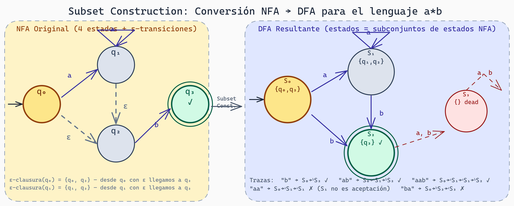
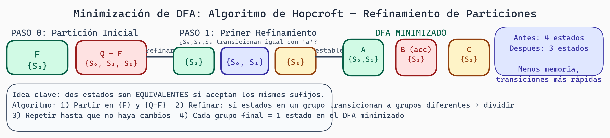

# NFAs y Conversión a DFA: Determinismo a través de la Construcción de Subconjuntos

## El Problema del Determinismo

En la lectura anterior, trabajamos con **DFAs deterministas**: desde cada estado, para cada carácter, hay exactamente una transición. Esto es restrictivo cuando diseñamos autómatas manualmente.

Imagina que quieres reconocer dos palabras: "gato" y "gatos". Con un DFA, necesitarías:

```
q₀ --g--> q₁ --a--> q₂ --t--> q₃ --o--> q₄ --s?--> q₅
```

Pero aquí hay un problema: desde q₄, cuando leemos 's', ¿es el final (aceptamos) o no? En un DFA, debe haber exactamente una opción.

Sería mucho más fácil si pudiéramos decir: "desde q₄, el string termina aquí (aceptado), **y** también si vemos 's', seguimos a q₅ (también aceptado)".

Esto es posible con **NFAs** (Nondeterministic Finite Automata).

## Autómatas Finitos No-Deterministas (NFA)

Un **NFA** es como un DFA, pero con superpoderes:

1. **Múltiples transiciones**: Desde un estado, el mismo carácter puede llevar a varios estados
2. **Transiciones épsilon (ε)**: Cambios de estado sin consumir carácter

### Definición Formal

Un NFA es una tupla: **M = (Q, Σ, δ, q₀, F)**

- **Q**: Conjunto de estados
- **Σ**: Alfabeto
- **δ: Q × (Σ ∪ {ε}) → 2^Q** (nota: potencia - múltiples estados posibles)
- **q₀**: Estado inicial
- **F**: Estados de aceptación

### Ejemplo 1: NFA para "gato" | "gatos"

```
          a    t    o
     ┌─g─→q₁─→q₂─→q₃─→q₄(accept)
     │                     ↑
q₀───┤                      └─s─┘
     │
     └─ (otras opciones posibles)

Estados de aceptación: {q₄, q₅}

Especialmente: δ(q₄, 's') = {q₅}
              δ(q₄, ε) = {} (implícitamente, q₄ es aceptación)

O más directo:
q₀ --g--> q₁ --a--> q₂ --t--> q₃ --o--> q₄ --ε--> q₅
                                 └──s──┘

Aquí q₄ y q₅ son aceptación.
```

Para reconocer "gatos":
```
q₀ -g-> q₁ -a-> q₂ -t-> q₃ -o-> q₄ -s-> q₅ (aceptado)
```

Para reconocer "gato":
```
q₀ -g-> q₁ -a-> q₂ -t-> q₃ -o-> q₄ (aceptado)
```

### Ejemplo 2: Transiciones Épsilon

Las transiciones épsilon permiten "saltos gratis". Considera un NFA que acepta strings que empiezan con 'a' o terminan con 'b':

```
       ┌─ a ─┐
       │      v
q₀─ε──┤     q₁ ─ε─→ q₃ (accept)
       │              ↑
       └─ b ─┐      (cualquier)
              v
             q₂ ─────→ q₃

Dicho de otro modo:
- Desde q₀, puedo saltar (ε) a q₁ o a q₂
- q₁ espera 'a' y salta a q₃
- q₂ espera cualquier carácter y salta a q₃
```

Entrada "a":
```
q₀ -ε-> q₁ -a-> q₃ (aceptado)
```

Entrada "xa" (donde x es cualquier carácter):
```
q₀ -ε-> q₂ -x-> q₃ -a-> ... (¡espera, necesitaría otro estado!)
```

Este NFA no es correcto. Mejor:

```
q₀ -ε-> q₁ -ε-> q₂
q₁ -a-> q₃ (accept)
q₂ -cualquier- -> q₂
q₂ -b-> q₃ (accept)
```

### Ventajas de NFAs

```
NFA = "Optimista"
DFA = "Pesimista"

En un NFA, cuando hay ambigüedad, exploramos TODOS los caminos posibles.
En un DFA, debemos decidir exactamente.
```

NFAs son:
- **Más fáciles de diseñar**: Puedes escribir múltiples transiciones sin pensar
- **Más compactos**: Número de estados generalmente menor
- **Teóricos**: Base para algoritmos de compilación

## Simulación de un NFA

Reconocer un string en un NFA es más complejo que en un DFA:

```
Algoritmo: Simular NFA
1. estados_actuales = ε-clausura(q₀)  // todos los estados alcanzables desde q₀ con ε
2. Para cada carácter en entrada:
      nuevos_estados = {}
      Para cada estado en estados_actuales:
          Para cada estado_siguiente en δ(estado, carácter):
              nuevos_estados = nuevos_estados ∪ ε-clausura(estado_siguiente)
      estados_actuales = nuevos_estados
      Si estados_actuales está vacío:
          RECHAZAR
3. Si algún estado en estados_actuales está en F:
      ACEPTAR
   Si no:
      RECHAZAR
```

La clave es **ε-clausura**: el conjunto de todos los estados alcanzables usando solo transiciones ε.

### Ejemplo: ε-clausura

```
Estados de un NFA:
q₀ -ε-> q₁
q₀ -ε-> q₂
q₁ -ε-> q₃

ε-clausura(q₀) = {q₀, q₁, q₂, q₃}  (todos alcanzables sin consumir entrada)
ε-clausura(q₁) = {q₁, q₃}
ε-clausura(q₂) = {q₂}
ε-clausura(q₃) = {q₃}
```

## Conversión de NFA a DFA: Construcción de Subconjuntos

Aquí viene la magia: **Cualquier NFA puede convertirse a un DFA equivalente**.

La técnica se llama **"Subset Construction"** o "construcción de potencia".

La idea: cada estado del DFA representa un **conjunto de estados del NFA**.

### Algoritmo de Conversión

```
Entrada: NFA M = (Q, Σ, δ, q₀, F)
Salida: DFA M' = (Q', Σ, δ', q₀', F')

q₀' = ε-clausura(q₀)
Q' = {q₀'}  (empezar con un estado)
cola = [q₀']

Mientras cola no esté vacía:
    S = cola.pop()  // S es un subconjunto de estados del NFA
    Q' = Q' ∪ {S}

    Para cada carácter a en Σ:
        S' = {}
        Para cada estado q en S:
            S' = S' ∪ δ(q, a)
        S' = ε-clausura(S')  // aplicar ε-clausura

        δ'(S, a) = S'

        Si S' no está en Q':
            cola = cola + [S']

F' = {S ⊆ Q | S ∩ F ≠ ∅}  // estados que contienen estados de aceptación del NFA
```

### Ejemplo Paso a Paso

**NFA Original**:
```
Queremos reconocer a*b (cero o más 'a', seguida de 'b')

q₀ --a--> q₁
q₀ --ε--> q₂
q₁ --a--> q₁
q₁ --ε--> q₂
q₂ --b--> q₃ (accept)

Estados de aceptación: {q₃}
```

**Conversión**:

Paso 1: q₀' = ε-clausura(q₀) = {q₀, q₂}

```
  δ_NFA(q₀, a) = {q₁}    → ε-clausura = {q₁, q₂}
  δ_NFA(q₂, a) = {}
  δ'({q₀, q₂}, a) = {q₁, q₂}

  δ_NFA(q₀, b) = {}
  δ_NFA(q₂, b) = {q₃}
  δ'({q₀, q₂}, b) = {q₃}
```

Paso 2: Procesar {q₁, q₂}
```
  δ_NFA(q₁, a) = {q₁}    → ε-clausura = {q₁, q₂}
  δ_NFA(q₂, a) = {}
  δ'({q₁, q₂}, a) = {q₁, q₂}

  δ_NFA(q₁, b) = {}
  δ_NFA(q₂, b) = {q₃}
  δ'({q₁, q₂}, b) = {q₃}
```

Paso 3: Procesar {q₃}
```
  δ_NFA(q₃, a) = {}
  δ'({q₃}, a) = {}

  δ_NFA(q₃, b) = {}
  δ'({q₃}, b) = {}
```

**DFA Resultante**:
```
Estados:
  Q' = {{q₀,q₂}, {q₁,q₂}, {q₃}, {}}

Transiciones (nota: renombramos para claridad):
  S₀ = {q₀, q₂}  (inicial)
  S₁ = {q₁, q₂}
  S₂ = {q₃}      (aceptación)
  S₃ = {}        (dead state)

Tabla:
        a    b
S₀ → S₁  S₂
S₁ → S₁  S₂
S₂ → S₃  S₃
S₃ → S₃  S₃
```

Este DFA acepta exactamente: a*b

Entradas:
- `"b"` → S₀ -b-> S₂ (aceptado)
- `"ab"` → S₀ -a-> S₁ -b-> S₂ (aceptado)
- `"aab"` → S₀ -a-> S₁ -a-> S₁ -b-> S₂ (aceptado)
- `"aa"` → S₀ -a-> S₁ -a-> S₁ (rechazado, en S₁)



> **Subset Construction: Conversión NFA → DFA para a\*b**
>
> El diagrama muestra el proceso completo. **NFA** (izquierda, fondo amarillo): 4 estados con transiciones sobre `a`, `b` y ε (flechas punteadas). Las ε-transiciones permiten moverse sin consumir caracteres. **DFA** (derecha, fondo azul): cada estado es un subconjunto de estados del NFA. S₀={q₀,q₂} es el estado inicial (ε-clausura de q₀). S₂={q₃} es el único estado de aceptación (doble círculo). S₃={} es el estado muerto (dead state) al que se va cuando no hay transición válida. La flecha central "Subset Const." representa el algoritmo de construcción de potencia.

## Minimización de DFA: Algoritmo de Hopcroft

Una vez que tenemos un DFA (conversión de NFA), podemos optimizarlo **eliminando estados redundantes**.

Dos estados son **equivalentes** si aceptan exactamente los mismos sufijos.

### Algoritmo Simplificado

```
Entrada: DFA M = (Q, Σ, δ, q₀, F)
Salida: DFA minimizado

Paso 1: Particionar Q en dos grupos:
  - F (aceptación)
  - Q - F (rechazo)

Paso 2: Mientras la partición cambie:
  Para cada grupo G en la partición:
    Para cada símbolo a en Σ:
      Si los estados en G transicionan a diferentes grupos con a:
        Dividir G en subgrupos según a-transición

Paso 3: Crear nuevo DFA con grupos como estados
```

### Ejemplo Minificación

Tomemos nuestro DFA anterior:

```
Estados originales: S₀, S₁, S₂, S₃

Partición inicial:
  Aceptación: {S₂}
  Rechazo: {S₀, S₁, S₃}

Análisis:
  Grupo {S₀, S₁, S₃}:
    - Transición 'a': S₀→S₁, S₁→S₁, S₃→S₃
      Diferentes grupos: S₁ (en el grupo), S₃ (en el grupo)
      Pero tanto S₀ como S₁ van a S₁ (mismo grupo), mientras S₃ va a S₃
      Dividir: {S₀, S₁} vs {S₃}

Partición después de división:
  {S₂}, {S₀, S₁}, {S₃}

Continuar análisis hasta estabilidad...
```

En este caso, muchos estados finales son necesarios y no se pueden eliminar.



> **Minimización por Refinamiento de Particiones (Hopcroft)**
>
> El algoritmo empieza con dos grupos: estados de aceptación F y el resto Q-F. En cada iteración, si dos estados en el mismo grupo se comportan diferente ante algún símbolo (van a grupos distintos), se divide el grupo. El proceso termina cuando ninguna partición se puede refinar más. El DFA resultante es el mínimo posible para el lenguaje.

## Relación NFA-DFA en la Práctica

```
HERRAMIENTA              ENTRADA    PROCESO                      SALIDA
────────────────────────────────────────────────────────────
Expresión Regular    →  NFA (auto)  →  Conversión subset constr.  →  DFA eficiente
                                        Minimización Hopcroft

flex (lexer gen)         regex      →  NFA                    →  DFA
                                        Subset construction
                                        Optimizaciones

XGrammar                 CFG        →  (diferente proceso, entrada Earley)
```

## Por qué Importa en XGrammar

1. **Tokenización**: El léxer usa DFAs eficientes generados de regexes (vía NFA)
2. **Compilación**: Entender NFA/DFA ayuda a entender transformaciones de gramáticas
3. **Optimización**: Técnicas similares (epsilon-elimination, minimización) se usan en la pipeline de XGrammar

## Ejercicios

1. **NFA para alternancia**: Diseña un NFA para (a|b)*c

2. **ε-clausura**: Dado este NFA, calcula ε-clausura para cada estado:
   ```
   q₀ -ε-> q₁ -a-> q₂
   q₀ -b-> q₃
   q₁ -ε-> q₄
   q₄ -ε-> q₁
   ```

3. **Simulación NFA**: Simula el procesamiento de "ba" en el NFA anterior.

4. **Subset construction**: Convierte este NFA a DFA:
   ```
   q₀ -a-> q₁
   q₀ -a-> q₂
   q₁ -b-> q₃ (accept)
   q₂ -c-> q₃ (accept)
   ```

5. **Minimización**: ¿Cuál es el DFA mínimo para (a|b)*?

## Preguntas de Reflexión

- ¿Cuál es el peor caso de tamaño cuando convertimos un NFA a DFA (número de estados)?
- ¿Por qué es importante la ε-clausura en la conversión?
- En XGrammar, cuando compilamos una gramática, ¿dónde aparecen procesos similares a NFA→DFA?
