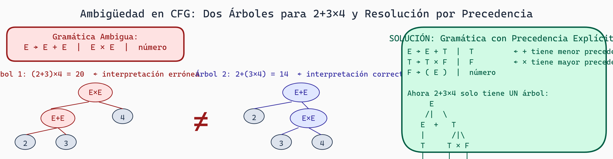

# Gramáticas Libres de Contexto: Estructurando el Caos

## ¿Por qué Necesitamos Algo Más?

Hasta ahora hemos trabajado con lenguajes regulares y DFAs. Estos son perfectos para patrones planos: identificadores, números, palabras clave.

Pero, ¿qué sobre **estructura**? Considera una expresión matemática:

```
2 + 3 * 4

¿Es (2 + 3) * 4 = 20?
¿O es 2 + (3 * 4) = 14?
```

La respuesta depende de la **precedencia de operadores**, que crea una **jerarquía anidada**. Similarmente:

```
if (x > 0) {
    for (int i = 0; i < 10; i++) {
        y = x + i;
    }
}
```

Los bloques están **anidados**. Los paréntesis deben **balancearse**.

Los DFAs son **memoryless** - solo tienen un número fijo de estados. No pueden "recordar" que vieron un paréntesis abierto y esperar el cierre. **Necesitamos una pila.**

Aquí entran las **Gramáticas Libres de Contexto (CFG)** y sus máquinas reconocedoras: **Autómatas de Pila (PDA)**.

## Gramáticas Libres de Contexto: Definición

Una **Gramática Libre de Contexto** es una forma sistemática de generar un lenguaje.


***Figura 1:** Jerarquía de Chomsky mostrando los cuatro tipos de gramáticas.*


### Componentes

Una CFG es una tupla: **G = (V, Σ, R, S)**

- **V**: No-terminales (símbolos intermedios, no aparecen en output final)
- **Σ**: Terminales (símbolos finales, caracteres/tokens)
- **R**: Reglas de producción (cómo expandir no-terminales)
- **S**: Símbolo inicial

### Notación

Las reglas se escriben:
```
A → α  (A es no-terminal, α es secuencia de terminales y no-terminales)
A → β | γ  (múltiples opciones)
```

### Ejemplo 1: Expresiones Aritméticas Simples

```
Terminales: {+, *, (, ), número}
No-terminales: {E, T, F}
Inicial: E

Reglas:
E → E + T | T
T → T * F | F
F → ( E ) | número
```

Aquí:
- **E** (Expresión) maneja suma (menor precedencia)
- **T** (Término) maneja multiplicación (mayor precedencia)
- **F** (Factor) maneja paréntesis y números (máxima precedencia)

La **estructura de la gramática** impone orden de operaciones.

### Ejemplo 2: Paréntesis Balanceados

```
Terminales: {(, )}
No-terminales: {S}
Inicial: S

Reglas:
S → ( S ) S | ε

Interpretación:
- Un '(' abre, un ')' cierra
- Dentro podemos tener más S (anidamiento)
- Podemos terminar en cualquier momento (ε)

Derivación para "(())":
S → (S)S → (S)ε → ((S)S)ε → (()S)ε → (()ε)ε → (())
```

### Ejemplo 3: Un Lenguaje Simple JSON-like

```
Terminales: {:, ,, [, ], {, }, string, number}
No-terminales: {Value, Object, Array, Pair}
Inicial: Value

Reglas:
Value → Object | Array | string | number

Object → { } | { Pairs }
Pairs → Pair | Pair , Pairs

Array → [ ] | [ Values ]
Values → Value | Value , Values

Pair → string : Value
```

Este reconoce estructuras JSON válidas.

## Derivaciones: Cómo se Generan Strings

Una **derivación** es una secuencia de pasos aplicando reglas.

### Derivación Izquierdista (Leftmost)

Siempre expandimos el no-terminal **más a la izquierda**:

```
Expresión: 2 + 3 * 4

Derivación desde E:
E
→ E + T           (expandir E, producción: E → E + T)
→ T + T           (expandir E izquierdo a T)
→ F + T           (expandir T izquierdo a F)
→ 2 + T           (expandir F a 2)
→ 2 + T * F       (expandir T a T * F)
→ 2 + F * F       (expandir T izquierdo a F)
→ 2 + 3 * F       (expandir F a 3)
→ 2 + 3 * 4       (expandir F a 4)

Resultado: 2 + 3 * 4
```

### Derivación Derechista (Rightmost)

Siempre expandimos el no-terminal **más a la derecha**:

```
E
→ E + T           (expandir E)
→ E + T * F       (expandir T)
→ E + T * 4       (expandir F)
→ E + 3 * 4       (expandir F)
→ 2 + 3 * 4       (expandir E)
```

Ambas derivaciones producen la **misma cadena final**, pero el **orden** de expansión es diferente. Los parsers generalmente usan leftmost o rightmost para construir estructuras.

## Árboles de Análisis Sintáctico (Parse Trees)

Un **árbol de análisis** representa la estructura jerárquica del string:

```
Para: 2 + 3 * 4

               E
             / | \
            E  +  T
            |     /|\
            T    T*F
            |    | |
            F    F 4
            |    |
            2    3

Altura representa anidamiento/precedencia.
Hojas son terminales.
Nodos internos son no-terminales.
```

El árbol muestra que 3*4 se agrupa antes de sumarlo con 2, lo que es correcto según precedencia.

### Construcción del Árbol

Durante parsing, el compilador construye este árbol bottom-up o top-down:

```
Bottom-up (como hacen muchos parsers):
1. Ver 2 → es F
2. F es T (aplicar regla T → F)
3. T es E (aplicar regla E → T)
4. Ver +
5. Ver 3 → es F
6. F es T (aplicar regla T → F)
7. Ver *
8. Ver 4 → es F
9. Reducir 4 → T (T → F)
10. Reducir T*F → T (T → T * F)
11. Ahora tenemos E + T
12. Reducir E + T → E (E → E + T)

Resultado: E (árbol construido)
```

## Ambigüedad en Gramáticas

Una gramática es **ambigua** si un string puede tener más de un árbol de análisis.

### Ejemplo de Ambigüedad

Considera esta gramática simplificada:

```
E → E + E | E * E | número

Para: 2 + 3 * 4

Árbol 1:               Árbol 2:
      E                     E
     /|\                   /|\
    E + E               E * E
    | /|\               /|   |
    2 E * E            E + E 4
      | | |            | | |
      3   4            2   3

Árbol 1: (2 + 3) * 4 = 20
Árbol 2: 2 + (3 * 4) = 14
```

Diferentes árboles, diferentes significados. **Malo**.

### Resolución de Ambigüedad

La gramática anterior es ambigua. La solución: **reescribir la gramática** para hacer precedencia explícita:

```
E → E + T | T
T → T * F | F
F → ( E ) | número

Ahora solo un árbol para 2 + 3 * 4:
        E
       /|\
      E + T
      |  /|\
      T T*F
      | | |
      F F 4
      | |
      2 3

Forzamos que * se agrupe más apretadamente que +.
```

**Las CFGs ambiguas son problemáticas** porque no sabemos qué interpretación es correcta. Los compiladores reales van a extremos para evitarlas.



> **Ambigüedad en CFG: Dos Interpretaciones para la Misma Cadena**
>
> La gramática ambigua `E → E+E | E×E | número` produce dos árboles para `2+3×4`: uno que calcula `(2+3)×4=20` y otro que calcula `2+(3×4)=14`. La solución es estratificar la gramática con niveles de precedencia explícitos (`E → T | E+T`, `T → F | T×F`), lo que garantiza un único árbol de parse.

## El Problema de la Precedencia

Para operadores, la forma de escribir la gramática determina la precedencia:

```
Baja precedencia (superior en árbol):
E → E + T | T

Mediana precedencia:
T → T * F | F

Alta precedencia (hojas):
F → ( E ) | número
```

Esto es **tan importante** que dedicaremos toda una lectura a diseño de gramáticas.

## Ejemplo: Gramática Triton-like

Para kernels GPU, podríamos tener:

```
Terminales: {for, in, range, (, ), :, =, +, -, *, /, block_id, thread_id, ...}
No-terminales: {Program, Statement, LoopStmt, Assignment, Expr, ...}

Program → Statement*
Statement → Assignment | LoopStmt
LoopStmt → for ID in range ( Expr , Expr ) : Block
Assignment → ID = Expr
Expr → Expr + Term | Term
Term → Term * Factor | Factor
Factor → ( Expr ) | ID | NUMBER | thread_id . ID

Block → Statement | { Statement* }
```

Con esta gramática, podemos expresar:

```
for i in range(0, 10):
    x = block_id.x + i * 2
```

Y el parser construiría un árbol que el compilador después usaría para generar CUDA.

## Lenguajes Libres de Contexto vs Regulares

```
Lenguajes Regulares:
- Reconocidos por DFA
- No pueden contar
- No pueden anidar (excepto finito)
- Memoria: finita

Lenguajes Libres de Contexto:
- Reconocidos por PDA (pushdown automaton)
- Pueden contar (balanceo de paréntesis)
- Pueden anidar arbitrariamente
- Memoria: pila (unbounded)
```

### Lo que CFG **SÍ** puede expresar

✅ Paréntesis balanceados: (()())
✅ Expresiones anidadas: ((1+2)*3)
✅ Estructuras de datos: JSON completo
✅ Bloques de código con indentación (con cuidado)

### Lo que CFG **NO** puede expresar

❌ a^n b^n c^n (3 contadores, necesita Type 1)
❌ "Cada variable declarada antes de usarse" (necesita Type 1 o análisis semántico)
❌ "Tipos deben coincidir" (necesita análisis semántico)

**Solución práctica**: Combinamos CFG para estructura + análisis semántico para restricciones contextuales.

## Reconocimiento con PDA (Preview)

Un **autómata de pila** es como un DFA pero con una pila infinita:

```
Estados, transiciones como DFA, PERO:
- Puede leer y escribir la pila
- Transición: (estado, entrada, top_pila) → (nuevo_estado, push/pop/nada)

Ejemplo para paréntesis balanceados:
Estado: {q₀ (iniciar), q₁ (aceptar)}

δ(q₀, '(', ⊥) → (q₀, push '(')  // ⊥ es el fondo de la pila
δ(q₀, ')', '(') → (q₀, pop)
δ(q₀, ε, ⊥) → (q₁, nada)         // aceptar si pila vacía

Entrada: "()"
- (q₀, (), ⊥) → push ( → pila: [(
- (q₀, ), () → pop → pila: []
- ε-transición → (q₁, nada) → ACEPTADO
```

En la próxima lectura sobre parsing, veremos cómo los parsers reales (Earley, LALR) implementan la idea de PDA para CFGs.

## Ejercicios

1. **Derivación**: Deriva "((()))" usando la gramática S → (S)S | ε

2. **Árbol de análisis**: Para "a + b * c", dibuja el árbol completo usando:
   ```
   E → E + T | T
   T → T * F | F
   F → a | b | c
   ```

3. **Ambigüedad**: ¿Esta gramática es ambigua?
   ```
   S → aS | Sa | ε
   ```
   Muestra los árboles para "aa".

4. **Diseño de gramática**: Escribe una CFG para direcciones IPv4 (X.X.X.X donde X es 0-255).
   Pista: Esto es difícil sin expresiones regulares. ¿Por qué?

5. **Lenguaje generado**: ¿Qué lenguaje genera?
   ```
   S → aSb | ε
   ```

## Preguntas de Reflexión

- ¿Por qué la estructura de la gramática determina la precedencia de operadores?
- ¿Cuál es la relación entre "árbol de análisis" y "significado" del programa?
- En XGrammar, cuando diseñamos una gramática para generar kernels, ¿cómo usamos precedencia para asegurar que el código generado es semánticamente válido?
- ¿Cuál es el trade-off entre "escribir gramáticas simples pero ambiguas" vs "gramáticas complejas pero no-ambiguas"?
