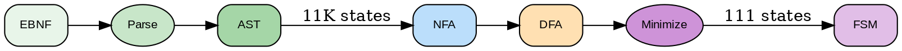
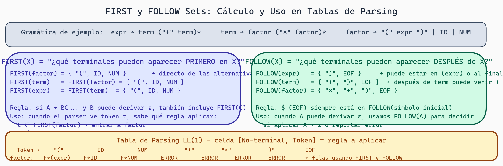

# Pipeline FSM de XGrammar: De Gramática a Autómata Eficiente

## Resumen Ejecutivo
XGrammar compila gramáticas a parsers eficientes: parsing → normalización → NFA → DFA → minimización → análisis lookahead → generación de código. Resultado: parser Earley con máscaras de bits O(1).

## La Misión: Compilar una Gramática

XGrammar es un compilador especializado. Su entrada no es código fuente tradicional, sino **especificaciones de gramática**. Su salida es un **parser eficiente** que reconoce exactamente ese lenguaje.

Entender el pipeline interno es crucial para usar XGrammar efectivamente.

## Visión General del Pipeline

```
Entrada:           Descripción de Gramática (CFG o EBNF)
                              ↓
[PARSING]          Parsear la especificación misma
                              ↓
[NORMALIZATION]    Convertir a forma canónica
                              ↓
[NFA CONSTRUCTION] Construir autómata no-determinista
                              ↓
[EPSILON ELIM]     Eliminar transiciones ε
                              ↓
[SUBSET CONSTRUCTION] Convertir NFA a DFA
                              ↓
[DFA MINIMIZATION] Eliminar estados redundantes
                              ↓
[RULE INLINING]    Optimizar reglas simples
                              ↓
[DEAD CODE ELIM]   Remover código inalcanzable
                              ↓
[LOOKAHEAD ANALYSIS] Calcular conjuntos FIRST/FOLLOW
                              ↓
[PARSER GENERATION] Generar código ejecutable (Earley o similar)
                              ↓
Salida:            Parser compilado (C++, Python, etc.)
```



***Figura 1:** Pipeline completo de XGrammar desde gramática hasta bitmask de tokens.*


Veamos cada fase en detalle.

## Fase 1: Parsing de la Especificación

**Objetivo**: La especificación de gramática misma debe parsearse.

```
Entrada: Una especificación como:
  expr = term ("+" term)*
  term = factor ("*" factor)*
  factor = "(" expr ")" | identifier | number

XGrammar debe reconocer que esto es una especificación de gramática válida.
Internamente usa su propio parser (bootstrap) para esto.

Resultado: Estructura interna AST (Abstract Syntax Tree) de la gramática
```

## Fase 2: Normalización

**Objetivo**: Convertir la gramática a una **forma normal** - una representación canónica.

### ¿Por qué normalizar?

Diferentes formas de escribir la misma idea deben normalizarse:

```
Original:
  expr = term + expr | term
  term = factor * term | factor
  factor = "(" expr ")" | ID | NUM

Problemas:
- Recursión mixta (derechista e izquierdista)
- Alternativas implícitas
- Posibles ambigüedades

Normalizado (forma CNF-like):
  expr → term expr_rest
  expr_rest → "+" expr | ε
  term → factor term_rest
  term_rest → "*" term | ε
  factor → "(" expr ")" | ID | NUM

O también válido:
  expr → term | expr "+" term  (Greibach Normal Form preparada)
```

### Ventajas de Normalización

```
1. Consistencia: Todos los algoritmos posteriores asumen forma normal
2. Simplificación: Eliminamos variaciones que complican análisis
3. Optimización: Es más fácil optimizar código regular
4. Portabilidad: Salida normalizada es más transferible
```

## Fase 3: Construcción de NFA

**Objetivo**: Convertir la CFG normalizada a un **NFA equivalente** que reconoce el lenguaje.

Este es conceptualmente el paso más interesante. **Cómo se mapea una CFG a un autómata?**

### Construcción de Thompson

Para una gramática simple como:
```
S → a b
```

Se construye:
```
q₀ --a--> q₁ --b--> q₂ (accept)
```

Para alternancia:
```
S → a | b

    ┌─a─→ q₁ ─┐
q₀─┤        ├→ q₃ (accept)
    └─b─→ q₂ ─┘
```

Para repetición:
```
S → a*

    ┌─a─┐
q₀─┤    ├→ q₂ (accept)
    └──ε──┘

Permite cero o más 'a'
```

### Construcción Recursiva para Gramáticas

Para una regla como:
```
expr → term "+" term
```

Se construye:
```
NFA(expr) = NFA(term) ⊕ "+" ⊕ NFA(term)

Donde ⊕ significa concatenación de autómatas
```

### Ejemplo Completo: Expresiones Aritméticas

```
Gramática:
  expr → term ("+" term)*
  term → factor ("*" factor)*
  factor → "(" expr ")" | ID | NUM

NFA para expresión:
  [NFA_term] -ε→ [LOOP: "+" → NFA_term]*

NFA para término:
  [NFA_factor] -ε→ [LOOP: "*" → NFA_factor]*

NFA para factor:
         ┌─"("─→ [NFA_expr] ─")"─┐
    q₀─ε┤                        ├─ε→ accept
         ├─ID─→ q₁ ─ε────────────┤
         └─NUM─→ q₂ ─ε───────────┘

Resultado: NFA gigante que reconoce toda la gramática
```

## Fase 4: Eliminación de Epsilon

**Objetivo**: Remover transiciones ε para simplificar posterior procesamiento.

### ¿Por qué eliminar ε?

Los algoritmos de conversión NFA→DFA funcionan mejor sin ε. Aunque técnicamente funcionarían con ε (con ε-clausura), la representación interna es más limpia sin ellos.

### Algoritmo de Eliminación

```
Para cada transición ε:
  p -ε-> q

1. Calcular ε-clausura(p) = {p, ...}
2. Calcular ε-clausura(q) = {q, ...}
3. Para cada transición q -a-> r:
     Añadir p -a-> r (directamente, saltando ε)
4. Si q es aceptación:
     Hacer p también aceptación

Resultado: Mismo lenguaje, sin transiciones ε
```

### Ejemplo

```
Antes:
q₀ -ε-> q₁ --a--> q₂

Después de eliminación ε:
q₀ --a--> q₂

(q₁ se elimina si solo servía para la transición ε)
```

## Fase 5: Construcción de Subconjuntos (NFA → DFA)

**Objetivo**: Convertir NFA a DFA determinista para ejecución eficiente.

Ya estudiamos esto en detalle. Brevemente:

```
Algoritmo: Subset construction
1. Crear estado inicial del DFA: ε-clausura(q₀_nfa)
2. BFS a través de todos los subconjuntos alcanzables
3. Cada subconjunto es un estado DFA
4. Transiciones siguen la unión de transiciones NFA

Resultado: DFA con hasta 2^|Q_nfa| estados (peor caso)
```

## Fase 6: Minimización de DFA

**Objetivo**: Eliminar estados redundantes.

Usamos algoritmos como **Hopcroft** para agrupar estados equivalentes:

```
Antes (después de subset construction):
q₁ -a-> q₃
q₂ -a-> q₃
(q₁ y q₂ son idénticos en comportamiento)

Después de minimización:
q₁ = q₂ (fusionados)

Ahora: {q₁,q₂} -a-> q₃
```

### Ganancia

```
Tamaño del DFA antes: potencialmente exponencial en #reglas
Tamaño después: típicamente 1-10% del inicial

Ejecución: Mucho más rápida (menos estados = menos memoria)
```

## Fase 7: Inlining de Reglas

**Objetivo**: Simplificar la gramática eliminando reglas triviales.

### Casos de Inlining

```
Caso 1: Regla con una sola producción
  factor → atom    (si solo aparece una vez)

  Antes:  factor → atom
          atom → ID

  Después: factor → ID

Caso 2: Regla que aparece una sola vez
  Si 'factor' solo se usa en 'term', podemos inline su definición

Ventaja: Menos estados en el autómata final
Desventaja: Menos modularidad (si queremos reuso)
```

## Fase 8: Eliminación de Código Muerto

**Objetivo**: Remover estados/transiciones que nunca se alcanzan.

### Detección

```
Algoritmo: BFS desde estado inicial
  Alcanzables = todos los estados visitables desde q₀
  Muertos = todos los estados en Q - Alcanzables
  Remover muertos

Ejemplo:
  q₀ --a--> q₁ --b--> q₂ (accept)
  q₃ --c--> q₄            (no alcanzable desde q₀)

  Resultado: q₃, q₄ se eliminan
```

## Fase 9: Análisis de Lookahead (FIRST/FOLLOW)

**Objetivo**: Calcular qué tokens pueden aparecer en cada punto.

Esto es crucial para:
- Errores informativos (esperábamos X pero vimos Y)
- Optimizaciones (saltar ramas imposibles)
- Generación de parsers eficientes (tablas de decisión)

### FIRST(symbol)

Conjunto de terminales que pueden ser **primero** en una derivación de `symbol`.

```
expr → term ("+" term)*
term → factor ("*" factor)*
factor → "(" expr ")" | ID | NUM

FIRST(factor) = {"(", ID, NUM}
FIRST(term) = FIRST(factor) = {"(", ID, NUM}
FIRST(expr) = FIRST(term) = {"(", ID, NUM}
```

### FOLLOW(symbol)

Conjunto de terminales que pueden aparecer **después** de `symbol` en una derivación válida.

```
expr → term ("+" term)*

FOLLOW(term en expr) = {"+" , EOF}   (puede venir + o fin)

term → factor ("*" factor)*

FOLLOW(factor en term) = {"*", FOLLOW(term)}
```

**Uso en compilación**: Si parseamos un `factor` en contexto `term`, sabemos que después debe venir `*` o algo en `FOLLOW(term)`. Si vemos algo distinto, es error.



> **FIRST y FOLLOW Sets — Cálculo y Uso en Tablas de Parsing LL(1)**
>
> `FIRST(X)` responde "¿qué terminales pueden aparecer primero al derivar X?" — se usa para saber qué regla aplicar al ver un token. `FOLLOW(X)` responde "¿qué puede aparecer después de X?" — se usa cuando X puede derivar ε para decidir si aplicar la producción vacía o reportar error. Juntos construyen la tabla de parsing LL(1).

## Fase 10: Generación de Parser

**Objetivo**: Producir código ejecutable en lenguaje de destino.

XGrammar genera **Earley parsers** (u otro tipo), con optimizaciones basadas en análisis anterior.

```
Entrada a generador:
  - DFA minimizado
  - Tabla de transiciones
  - Información FIRST/FOLLOW
  - Información de aceptación

Generador escribe (ejemplo Python):

def parse(tokens):
    stack = [initial_state]
    position = 0

    while position < len(tokens):
        state = stack[-1]
        token = tokens[position]

        # Búsqueda en tabla DFA
        if transition := dfa_table[state].get(token):
            stack.append(transition)
            position += 1
        elif # regla de reducción
            # aplicar reducción
            ...

Resultado: Función ejecutable que acepta/rechaza input
```

## Optimización: Adaptive Token Mask Cache

XGrammar usa una optimización sofisticada llamada **"adaptive token mask cache"**:

```
Observación: En cada estado del DFA, solo algunos tokens son válidos.

Sin cache:
  Cada token-lookahead requiere búsqueda en tabla completa: O(|alphabet|)

Con cache:
  Calcular máscara de tokens válidos → bitmap
  Lookahead: lookup O(1) en bitmap

Adaptativo:
  Si muchos tokens válidos → usar tabla
  Si pocos → usar bitmap
  Cambiar estrategia dinámicamente según acceso
```

## Ciclo Completo: Ejemplo

Especificación:
```
json_value = json_object | json_array | string | number | "true" | "false" | "null"
json_object = "{" | (string ":" json_value ("," string ":" json_value)*) "}"
json_array = "[" | (json_value ("," json_value)*) "]"
string = '"' char* '"'
number = "-"? digit+ ("." digit+)?
digit = "0".."9"
char = /* any */
```

Pipeline:
```
1. [PARSING] → AST de la especificación
2. [NORMALIZATION] → Forma normal interna
3. [NFA CONSTRUCTION] → NFA con ~100+ estados
4. [EPSILON ELIM] → NFA limpio
5. [SUBSET CONST] → DFA con ~50-200 estados
6. [MINIMIZATION] → DFA con ~20-30 estados
7. [INLINING] → Fusión de reglas simples
8. [DEAD CODE ELIM] → Remover estados inalcanzables
9. [LOOKAHEAD] → Tablas FIRST/FOLLOW
10. [CODEGEN] → Parser ejecutable optimizado

Resultado: Parser que reconoce JSON válido en O(n) tiempo.
```

## Rendimiento en Práctica

Para una gramática típica de kernel GPU:

```
Especificación: ~20 reglas EBNF
NFA resultante: ~200 estados
DFA después subset: ~500 estados (peor caso)
DFA después minimización: ~30-50 estados (típico)

Parsing: Token-by-token, ~10-100 nanosegundos por token
Memoria: Tabla de transiciones ≈ 50-200 KB

Comparación LL(1): ~O(n log n) para construcción manual
XGrammar Earley: O(n) o O(n²) para gramáticas especiales
```

## Ejercicios

1. **Traza NFA**: Construye manualmente un NFA para:
   ```
   S → "a" "b" | "a" "c"
   ```

2. **Epsilon Elimination**: Elimina transiciones ε de:
   ```
   q₀ -ε-> q₁ --a--> q₂
   q₁ -ε-> q₃ --b--> q₂
   ```

3. **FIRST/FOLLOW**: Calcula para:
   ```
   S → A "x" | B "y"
   A → "a"
   B → A | "b"
   ```

4. **Minimización**: ¿Qué estados serían equivalentes?
   ```
   q₁ --a--> accept
   q₂ --a--> accept
   q₃ --a--> reject
   ```

5. **Lookahead**: ¿Cuál es FIRST(term) en?
   ```
   expr → term "+" expr | term
   term → "(" expr ")" | ID
   ```

## Preguntas de Reflexión

- ¿Por qué es importante pasar por un NFA intermedio en lugar de ir directo CFG → DFA?
- ¿Cuál es el trade-off entre "minimizar DFA" y "tiempo de compilación"?
- ¿Cómo el adaptive token mask cache mejora el rendimiento de parsing?
- En un GPU kernel DSL, ¿qué reglas serían candidatas para inlining?
