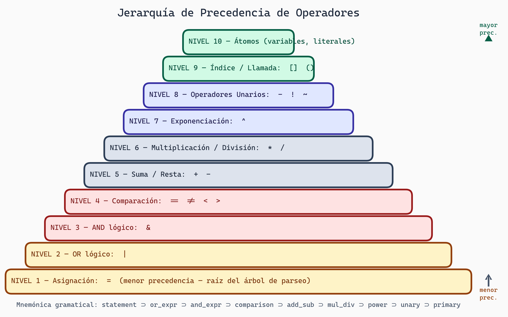
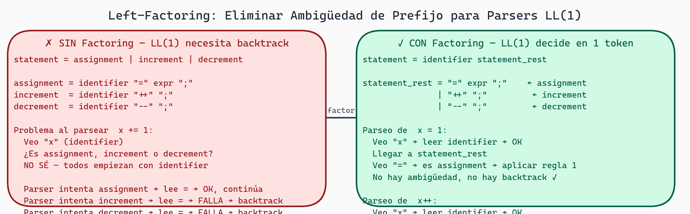

# Diseño de Gramáticas DSL: Principios y Práctica

## El Arte, No Solo la Ciencia

Hemos cubierto la **teoría** de compiladores. Ahora viene la parte desafiante: **diseñar buenas gramáticas**.

Escribir una gramática es como escribir código. Puedes teclear sintaxis correcta que compile pero sea horrible: ambigua, ineficiente, difícil de mantener.

Una buena gramática:
- Expresa exactamente lo que quieres (no más, no menos)
- Es eficiente de parsear
- Es fácil de entender y mantener
- Evita ambigüedades

## Principio 1: Comienza Mínimo, Extiende Gradualmente

**Tentación**: Escribir una gramática completa de una vez.

**Realidad**: Las gramáticas son como escaleras. Subes paso a paso.

### Enfoque Bottom-Up: Empezar Simple

```
Fase 1: Lo más básico
  number = digit+
  digit = "0".."9"

Pruebas: ¿Funciona? Parseramos "123" ✓

Fase 2: Agregamos operaciones
  expr = number ("+" number)*

Pruebas: ¿Parsea "1+2+3"? ✓

Fase 3: Agregamos multiplicación
  expr = term ("+" term)*
  term = number ("*" number)*

Pruebas: ¿Respeta precedencia? 1+2*3 = 1+(2*3)? ✓

Fase 4: Agregamos paréntesis
  term = factor ("*" factor)*
  factor = "(" expr ")" | number

Pruebas: ¿Parsea "(1+2)*3"? ✓

Fase 5: Agregamos variables
  factor = "(" expr ")" | identifier | number
  identifier = letter (letter | digit | "_")*
  letter = "a".."z" | "A".."Z" | "_"

Pruebas: ¿Parsea "x + y * 2"? ✓
```

Cada paso añade **una** característica pequeña.

### Ventajas

```
✓ Pruebas incrementales detectan problemas rápido
✓ Fácil debuggear (la nueva característica causó el error)
✓ Más fácil para otros entender el desarrollo
✓ Cambios locales no rompen lo anterior
```

### Contraejemplo: Engullir Demasiado

```
Mal: Escribir todo de una:

cfg = (rule)+
rule = identifier "=" body
body = term ("OR" term)*
term = factor ("AND" factor)*
factor = "(" body ")" | "!" factor | atomic
atomic = identifier | literal | character_class | quantified
quantified = atomic "{" number "}"
           | atomic "{" number "," number "}"
           | atomic "*" | atomic "+" | atomic "?"
character_class = "[" char_range ("," char_range)* "]"
char_range = char | char ".." char
literal = '"' string '"'
...

Resultado: Confuso, difícil de depurar si no funciona
```

## Principio 2: Separar Niveles de Precedencia

Este es **tan importante** que dedicamos secciones enteras a ello.

### Jerarquía de Precedencia Típica

Para operadores aritméticos, de menor a mayor precedencia:

```
Nivel 1: Asignación (=)
Nivel 2: OR (|)
Nivel 3: AND (&)
Nivel 4: Comparación (==, !=, <, >)
Nivel 5: Suma/Resta (+, -)
Nivel 6: Multiplicación/División (*, /)
Nivel 7: Exponenciación (^)
Nivel 8: Unarios (-, !, ~)
Nivel 9: Indexación/Llamadas ([], ())
Nivel 10: Átomos (literales, variables)
```



> **Jerarquía de Precedencia de Operadores**
>
> Diagrama en pirámide invertida: las barras más anchas (abajo) representan menor precedencia y las más estrechas (arriba) mayor precedencia. **Nivel 1** (ámbar, más ancho): Asignación `=`, raíz del árbol de parseo. Los niveles 2–4 (rojo) cubren operadores lógicos y comparaciones. Los niveles 5–6 (gris neutro) son suma/resta y multiplicación/división. Los niveles 7–8 (índigo) corresponden a exponenciación y unarios. Los niveles 9–10 (verde, más estrecho) son indexación/llamadas y átomos. La mnemónica inferior muestra la cadena de reglas gramaticales anidadas que implementa esta jerarquía.

En una gramática, esto se refleja como:

```
statement = assignment
assignment = or_expr ("=" or_expr)*
or_expr = and_expr ("|" and_expr)*
and_expr = comparison ("&" comparison)*
comparison = add_sub (("==" | "!=" | "<" | ">") add_sub)*
add_sub = mul_div (("+" | "-") mul_div)*
mul_div = power (("*" | "/") power)*
power = unary ("^" unary)*
unary = "-" unary | "!" unary | primary
primary = "(" expression ")" | literal | identifier
```

### Por qué Esto Funciona

```
Estructura refleja precedencia:
- Raíz (statement) = baja precedencia
- Hojas (primary) = alta precedencia

Ejemplo: a + b * c

Derivación:
  statement → assignment → or_expr → and_expr → comparison → add_sub
            → mul_div (b * c) + mul_div(a)

El árbol automáticamente agrupa (b*c) juntos
porque mul_div está más profundo que add_sub.
```

### Codificación de Precedencia

```
¿RECUERDO?
  expr → expr "+" expr   (ambiguo, MALO)
  expr → expr "*" expr

¿BIEN?
  expr → expr "+" term | term    (+ tiene baja prec)
  term → term "*" factor | factor (* tiene alta prec)
  factor → number | "(" expr ")"

La estructura **es** la precedencia.
```

## Principio 3: Diseño Modular en Capas

Para gramáticas complejas (como una DSL de kernel GPU), usamos **diseño en capas**.

### Estructura L1-L4

Adaptado para XGrammar, pensamos en niveles:

```
L4: AST (Abstract Syntax Tree)
    Lo que semánticamente significa

L3: Construcciones sintácticas de alto nivel
    bloques, funciones, declaraciones

L2: Construcciones sintácticas de nivel medio
    expresiones, operadores, control de flujo

L1: Tokens e construcciones básicas
    literales, identificadores, palabras clave

L0: Léxica
    caracteres, patrones básicos

Ejemplo en kernel Triton:

L4: [BlockProgram(kernel, grid_def, ...)]

L3: kernel = "def" name "(" params ")" ":" block
    grid = "@triton.jit\ndef launch(...): ..."

L2: expr = term (("+" | "-") term)*
    statement = assignment | loop | condition

L1: literal = number | string
    identifier = letter (letter|digit|"_")*
    keyword = "def" | "for" | "if" | ...

L0: letter = "a".."z" | "A".."Z" | "_"
    digit = "0".."9"
```

### Ventajas de Separación en Capas

```
✓ Independencia: Cambiar L1 no afecta L3
✓ Reuso: Reglas de L1 usadas en múltiples L2
✓ Claridad: Cada nivel tiene responsabilidad clara
✓ Testing: Probar cada nivel aisladamente
```

## Principio 4: Evitar Ambigüedad

La ambigüedad es el **enemigo** de una buena gramática.

### Detección de Ambigüedad

Una gramática es ambigua si existe un string con **dos o más árboles de análisis distintos**.

```
Gramática ambigua:
  expr → expr "+" expr | expr "*" expr | number

Para "1+2*3":
Árbol 1: (1+2)*3 = 9
Árbol 2: 1+(2*3) = 7

Ambiguo: No sabemos qué significa.
```

### Resolución Tipo 1: Reescribir Gramática

```
Solución:
  expr → term ("+" term)*
  term → factor ("*" factor)*
  factor → number

Ahora solo un árbol para "1+2*3": 1+(2*3)
Precedencia codificada en estructura.
```

### Resolución Tipo 2: Directivas de Desambiguación

Algunos parseadores permiten directivas:

```
expr → expr "+" expr    %left      ← asociatividad izquierda
     | expr "*" expr    %left
     | number

Interpretación: En caso de ambigüedad, reducir izquierda.
1+2+3 → ((1+2)+3) ✓ no (1+(2+3))
```

XGrammar típicamente **no permite ambigüedad** - debes escribir gramáticas no-ambiguas.

## Principio 5: Caracteres de Escape y Delimitadores

A menudo necesitas capturar strings literales o caracteres especiales.

### Problema

```
Especificación:
  rule = name "=" body

¿Qué pasa si el usuario escribe?
  rule = "rule = exp"

Confusión: ¿El "=" es parte del string o delimitador de la regla?
```

### Solución: Escapar Explícitamente

```
EBNF estándar:
  string = '"' char* '"'
  char = /* cualquier char excepto comillas, o escaped */

Ejemplo:
  rule = "rule = exp"  ← string literal
  name = "my rule"    ← string con espacios

Y dentro, escapes:
  string = '"' (not_quote | "\\" any)* '"'
```

### Delimitadores

Para código embebido (como Triton en GPU):

```
code_block = "```" code "```"
code = /* cualquier cosa excepto ``` */

O:
code_block = "{{" code "}}"
```

## Principio 6: Left-Factoring para Parsers Eficientes

Si tienes múltiples reglas que comparten prefijo, factoriza.

### Problema

```
Sin factoring (parser LL hace muchos backtrack):
  statement = assignment | increment | decrement | ...

  assignment = identifier "=" expr ";"
  increment = identifier "++" ";"
  decrement = identifier "--" ";"

Para "x", no sé si es assignment, increment o decrement.
Necesito leer más (lookahead).
```

### Solución: Factorizar Común

```
Con factoring:
  statement = identifier statement_rest
  statement_rest = "=" expr ";"      ← assignment
                 | "++" ";"           ← increment
                 | "--" ";"           ← decrement

Ahora:
  Veo identifier → avanzo a statement_rest
  Veo "=" → es assignment
  Veo "++" → es increment

Decisión clara y rápida (LL(1)).
```



> **Left-Factoring — Transformación para LL(1)**
>
> Sin factoring, todas las alternativas de `statement` comienzan con `identifier`, obligando al parser a hacer backtracking O(n). Con factoring, se extrae el prefijo común `identifier` como primer paso, y el parser decide con un solo token qué alternativa seguir: `=` → assignment, `++` → increment, `--` → decrement. Resultado: parsing sin backtrack, O(1) por decisión.

## Principio 7: Usar EBNF para Evitar Recursión Artificial

EBNF ahorra escritura y mejora claridad.

### Comparación

```
BNF puro (mucha recursión):
  expr_list = expr | expr_list "," expr

EBNF (clara):
  expr_list = expr ("," expr)*

Ambas aceptan el mismo lenguaje: 1, 2, 3
Pero EBNF es más legible y eficiente.
```

### Cuantificadores EBNF en Profundidad

```
{X}    = cero o más = X*
X?     = cero o uno
X+     = uno o más
{X,Y}  = entre X e Y repeticiones
[X]    = opcional = X?

Ejemplo:
  number = "-"? digit+ ("." digit+)?

Deconstruyendo:
  "-"?              → opcional signo negativo
  digit+            → uno o más dígitos
  ("." digit+)?     → opcionalmente: punto y más dígitos

Acepta: 42, -3.14, 0, .5
Rechaza: -, 3., (números incompletos)
```

## Principio 8: Debugging de Gramáticas

Las gramáticas incorrectas son fáciles de escribir, difíciles de debuggear.

### Técnica 1: Pruebas Incrementales

```
Para cada regla que añades:
1. Escribe tests que deberían aceptarse
2. Escribe tests que deberían rechazarse
3. Verifica ambos

Ejemplo para "number":
  Aceptar: 0, 42, -5, 3.14, 0.0, .5
  Rechazar: -, 3., abcd, 3..14, -.-5
```

### Técnica 2: Verbose Parsing

Algunos parseadores (XGrammar) pueden emitir debug:

```
parse(input, verbose=True)

Salida:
  Entering rule: expr
    Entering rule: term
      Entering rule: factor
        Matched: 42
      Exiting rule: factor (success)
    Exiting rule: term (success)
    Matched: +
    Entering rule: term
      ...
  Exiting rule: expr (success)
```

De aquí ves exactamente dónde falla.

### Técnica 3: Análisis de Cobertura

```
Test suite:

✓ expr = "1" (minimalist)
✓ expr = "1+2" (suma)
✓ expr = "1*2" (multiplicación)
✓ expr = "1+2*3" (precedencia)
✓ expr = "(1+2)*3" (paréntesis)
✓ expr = "-5" (unario)
✓ expr = "(1)" (paréntesis single)

Cobertura:
- Cada regla al menos una vez
- Cada alternancia (|) al menos una vez
- Casos límite (vacío, solo un elemento, muchos)
```

## Caso de Estudio: Gramática DSL para Kernel GPU Triton

Diseño progresivo:

### Iteración 1: Variables y Asignación

```
Especificación mínima:

program = statement*
statement = assignment ";"
assignment = identifier "=" expr
expr = identifier | number

Tests:
✓ x = 5;
✓ y = 42;
✓ x = y;
✗ x = 5  (falta ;)
```

### Iteración 2: Expresiones Aritméticas

```
Añadimos:
expr = term ("+" term | "-" term)*
term = factor ("*" factor | "/" factor)*
factor = "(" expr ")" | identifier | number

Tests:
✓ x = 1 + 2;
✓ x = 2 * 3 + 1;
✓ x = (1 + 2) * 3;
```

### Iteración 3: Loops

```
statement = assignment ";" | loop
loop = "for" identifier "in" "range" "(" expr "," expr ")" ":" block
block = "{" statement* "}"

Tests:
✓ for i in range(0, 10): { x = i; }
✓ for i in range(0, 10): { x = i; y = i * 2; }
```

### Iteración 4: Kernel Signature

```
program = kernel_def
kernel_def = "@triton.jit" newline
             "def" identifier "(" params? ")" "->" type ":" newline
             indent block
params = param ("," param)*
param = identifier ":" type
type = "Tensor" | "int32" | "float32"

Tests:
✓ @triton.jit
  def kernel(x: Tensor, n: int32) -> Tensor:
      return x
```

Cada paso: pequeño, testeable, se integra con lo anterior.

## Errores Comunes a Evitar

```
MALO: Gramáticas que generan autómatas enormes
  expr = expr "+" expr | expr "-" expr | expr "*" expr | ...
  Resultado: muchas reglas de reducción, parsing lento

MEJOR: Jerarquía clara de precedencia

MALO: Ambigüedad no resuelta
  if (cond) stmt
  if (cond) stmt else stmt

MEJOR: Usar reglas de desambiguación claras

MALO: Left-recursion en parsers LL(1)
  expr = expr "+" term | term

MEJOR: Transformar a right-recursion o usar EBNF

MALO: Aceptar strings no deseados
  expr = .* (aceptar cualquier cosa)

MEJOR: Especificar exactamente qué aceptar
```

## Ejercicios

1. **Diseño Incremental**: Especifica una gramática para direcciones de email:
   - Iteración 1: user@domain
   - Iteración 2: user.name@domain
   - Iteración 3: user+tag@domain.co.uk

2. **Precedencia**: Reescribe para expresar precedencia clara:
   ```
   expr = expr "||" expr | expr "&&" expr | expr "==" expr | ...
   ```

3. **Ambigüedad**: ¿Cuál es el problema aquí?
   ```
   stmt = "if" expr ":" stmt
        | "if" expr ":" stmt "else" stmt
   ```

4. **Left-Factoring**: Factoriza:
   ```
   stmt = "print" expr ";" | "println" expr ";"
   ```

5. **Debugging**: Diseña test cases para esta gramática:
   ```
   list = "[" [item ("," item)*] "]"
   item = number | string
   number = digit+
   string = '"' letter* '"'
   ```

## Preguntas de Reflexión

- ¿Cuál es el verdadero costo de la ambigüedad? ¿Solo teoría o afecta en la práctica?
- ¿Cómo se diseñaría una gramática para lenguaje natural (inglés) vs lenguaje de programación?
- En el contexto de GPU kernels, ¿hay características inherentemente ambiguas que no se pueden resolver solo con gramática?
- ¿Cómo el diseño de la gramática afecta la capacidad de dar mensajes de error útiles?
