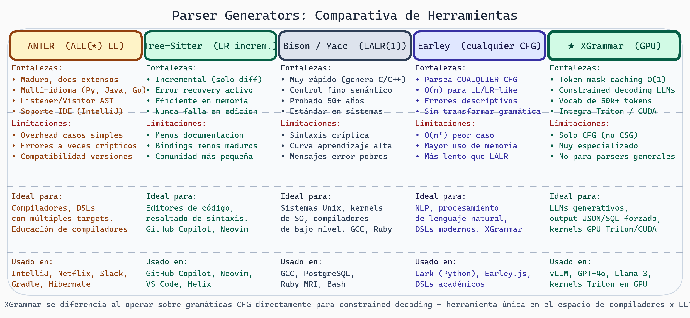
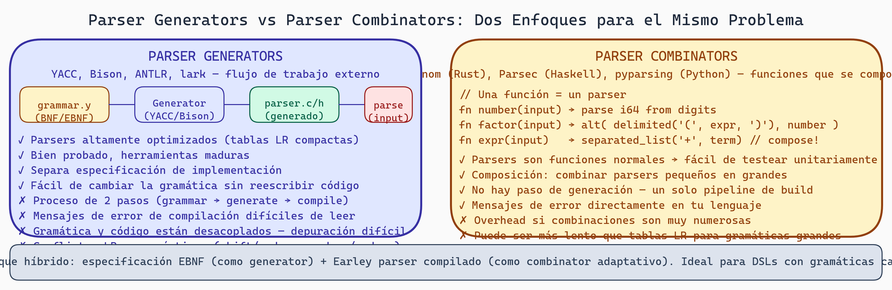

# Parser Generators y Reflexión: De Teoría a Práctica Industrial

## El Ecosistema Real

Durante este módulo, hemos estudiado teoría elegante: autómatas, gramáticas, jerarquía de Chomsky. Ahora conectaremos eso con **herramientas reales** que usan miles de proyectos diarios.

## Herramientas Principales: Comparativa



> **Parser Generators: Comparativa de Herramientas**
>
> Tabla comparativa de cinco herramientas: **ANTLR** (ámbar, ALL(*) LL adaptativo) — maduro, multi-idioma, ideal para compiladores y DSLs; usado en IntelliJ y Netflix. **Tree-Sitter** (verde, LR incremental) — re-parsea solo el diff, con error recovery; ideal para editores, usado en GitHub Copilot y Neovim. **Bison/Yacc** (gris, LALR(1)) — muy rápido, genera C/C++, décadas de trayectoria; usado en GCC y PostgreSQL. **Earley** (índigo) — parsea cualquier CFG sin transformación, O(n) para LL/LR-like, errores descriptivos; base de Lark. **★ XGrammar** (verde destacado) — token mask caching O(1), constrained decoding para LLMs, vocabularios de 50k+ tokens; usado en vLLM, GPT-4o y kernels Triton.

### ANTLR (Another Language Tool Recognition)

**Creador**: Terence Parr (Universidad de San Francisco)

**Características**:
- Genera parsers a partir de EBNF
- Soporta múltiples lenguajes de salida (Java, Python, C#, JavaScript, Go, C++)
- Errores descriptivos con contexto
- Listener/Visitor patterns para AST traversal
- Ampliamente usado (IDE JetBrains, Netflix, Slack)

**Estrategia de Parsing**:
- ALL(*): Adaptive LL with Lookahead
- Puede parsear cualquier CFG (aunque no todas)
- Mejor que LL(k) para gramáticas complejas

```antlr
// Archivo ANTLR: expr.g4
grammar Expr;

expr    : expr '+' term
        | term
        ;

term    : term '*' factor
        | factor
        ;

factor  : '(' expr ')'
        | NUMBER
        ;

NUMBER  : [0-9]+ ;
WS      : [ \t\r\n] -> skip ;
```

**Generación**:
```bash
antlr4 expr.g4 -Dlanguage=Python3
```

Genera: `ExprParser.py`, `ExprLexer.py`, `ExprListener.py`

**Ventajas**:
- Maduro, bien documentado
- Comunidad grande
- Debugging tools

**Desventajas**:
- Overhead para casos simples
- Mensajes de error a veces crípticos
- Compatibilidad de versiones

### Tree-Sitter

**Creador**: Max Brunsfeld (GitHub)

**Propósito**:
- Parser incremental para editores y herramientas
- Reconstruir AST solo de partes cambiadas
- Tolerante a errores (continúa parseando aunque haya syntax error)

**Estrategia**:
- LR-style bottom-up
- Técnica de prioridad de error (error recovery avanzado)

```javascript
// tree-sitter grammar: JavaScript
{
  rules: {
    program: $ => repeat($.statement),
    statement: $ => choice(
      $.variable_declaration,
      $.expression_statement
    ),
    variable_declaration: $ => seq(
      'var',
      $.identifier,
      '=',
      $.expression,
      ';'
    ),
    expression: $ => choice(
      $.number,
      $.identifier,
      seq($.expression, '+', $.expression)
    ),
    identifier: $ => /[a-zA-Z_][a-zA-Z0-9_]*/,
    number: $ => /[0-9]+/
  }
}
```

**Ventajas**:
- Incremental (rápido para editores)
- Error recovery (nunca falla completamente)
- Eficiente en memoria

**Desventajas**:
- Menos documentación que ANTLR
- Comunidad más pequeña
- Bindings a lenguajes menos maduro

### Bison / Yacc

**Historia**: Herramientas clásicas (1970s-1980s)

**Estrategia**: LALR(1) parser generation

```yacc
%{
#include <stdio.h>
%}

%token NUMBER
%token PLUS
%token TIMES

%%

expr : expr PLUS term   { $$ = $1 + $3; }
     | term
     ;

term : term TIMES factor { $$ = $1 * $3; }
     | factor
     ;

factor : '(' expr ')'    { $$ = $3; }
       | NUMBER          { $$ = $1; }
       ;

%%
```

**Ventajas**:
- Muy rápido (compilado a C/C++)
- Bien entendido en industria
- Control fino sobre acciones

**Desventajas**:
- Sintaxis críptica
- Poco amigable para principiantes
- Menos flexible que ANTLR

### Earley Parsers

**Algoritmo**: Desarrollado por Jay Earley (1970)

**Característica única**: Parsea **cualquier CFG** sin necesidad de transformación

**Complejidad**:
- O(n³) caso general
- O(n²) para CFGs ambiguas
- O(n) para LL/LR-like

**Ventajas**:
- Muy general
- Menos transformación de gramática
- Errores claros (qué se esperaba vs qué se vio)

**Desventajas**:
- Más lento que LR
- Mayor overhead de memoria

**Usado por**: XGrammar, algunos DSL modernos

```python
# Pseudo-código Earley
def parse(tokens):
    chart = [set() for _ in range(len(tokens) + 1)]

    # Predictor, scanner, completer
    for i in range(len(tokens) + 1):
        while chart[i] changes:
            for item in chart[i]:
                if not_yet_scanned(item):
                    scanner(item, tokens[i])
                if not_yet_predicted(item):
                    predictor(item)
                if completed(item):
                    completer(item)

    return extract_tree(chart)
```

## XGrammar: Posición en el Ecosistema

### ¿Por qué XGrammar es Diferente?

XGrammar es **especializado** para un caso de uso específico:

```
Caso Clásico (ej. ANTLR):
  "Quiero parsear lenguaje X con buenas características"
  Objetivo: Parser general y flexible

XGrammar:
  "Quiero generar código GPU que valide estructura de kernel"
  Objetivo: Parser optimizado + generación de GPU code
  Restricción: CFG solamente
```

### Arquitectura XGrammar

```
Entrada: Especificación de gramática DSL
    ↓
[XGrammar Compiler]
    ├─ Parsea especificación (bootstrap)
    ├─ Valida no-ambigüedad
    ├─ Optimiza (NFA→DFA, minimización)
    ├─ Analiza lookahead
    └─ Genera parser
    ↓
Salida 1: Parser ejecutable (Python, C++)
Salida 2: GPU kernel validator (CUDA)
```

### Ventajas de XGrammar

```
1. Integración GPU nativa
   - Genera kernels que ejecutan parsing en GPU
   - Paralelización automática

2. Optimizaciones especializadas
   - Adaptive token mask cache
   - Compresión de tabla de estados
   - Kernel fusion

3. Garantías teóricas
   - No permite ambigüedad
   - Validación de cobertura

4. Performance
   - Parsing O(n) en GPU
   - Tasa de tokens/segundo alta
```

### Limitaciones de XGrammar

```
1. Solo CFG
   - No puede expresar restricciones context-sensitive
   - Requiere análisis post-parsing para semántica

2. Especializado
   - Optimizado para GPU
   - No ideal para parsers "tradicionales"

3. Comunidad Pequeña
   - Menos tutoriales/ejemplos que ANTLR
   - Menos integración con IDEs

4. Experimentales
   - Más nuevo, menos probado en wild
```

## Comparativa de Decisión

```
┌─────────────────────────────────────────────────────────────┐
│               ¿Cuál herramienta elegir?                      │
└─────────────────────────────────────────────────────────────┘

ANTLR si:
  ✓ Necesitas parsear lenguaje completo (Java, C++, etc.)
  ✓ Errores descriptivos criticales
  ✓ Necesitas soporte de comunidad
  ✓ Presupuesto para learning curve

Tree-Sitter si:
  ✓ Incremental (editor, IDE)
  ✓ Error recovery crucial
  ✓ Lenguajes dinámicos (JS, Python)
  ✓ Rendimiento en editor importante

Bison si:
  ✓ Legacy system (UNIX, compiladores tradicionales)
  ✓ Performance crítica (C/C++)
  ✓ Control fino sobre parsing
  ✓ Ya tienes experiencia

Earley si:
  ✓ Gramática ambigua (generar todos los árboles)
  ✓ Lógica/AI (parsing natural language)
  ✓ Prototipado rápido (menos transformación)

XGrammar si:
  ✓ GPU kernel validation
  ✓ DSL especializado para GPU
  ✓ Performance de parsing crítico
  ✓ Necesitas ejecutar en GPU
```

## Reflexión: Lecciones del Módulo

### 1. Teoría Importa... Pero Seleccionadamente

```
Cosas teóricas que realmente importan:
  ✓ Jerarquía de Chomsky (entender qué es posible)
  ✓ Autómatas (comprender máquinas parsing)
  ✓ Ambigüedad (evitar estructuras malas)
  ✓ Precedencia (operadores correctos)

Cosas teóricas académicas (nice pero no crítico):
  ✗ Minimización Hopcroft (generadores lo hacen)
  ✗ Subset construction (generadores lo hacen)
  ✗ Greibach Normal Form (generadores lo hacen)

Moral: Entender principios ayuda a usar herramientas mejor.
```

### 2. Diseño de Lenguaje es un Oficio

```
No hay una sola forma "correcta".

Ejemplo: ¿Qué es más fácil?
  Java:   if (condition) { statement; }
  Python: if condition: statement

Java: Más símbolos, menos ambigüedad
Python: Menos símbolos, requiere track de indentación

Trade-off:
  Sintaxis visual vs Complejidad parsing
  Facilidad lectura vs Facilidad tipeo
```

### 3. Error Recovery es Infraestimado

```
Errores son inevitables.

Compilador clásico:
  Primer error → termina
  Programador: frustrado

Compilador moderno:
  Error → recupera, continúa buscando más errores
  Compilador output: lista de todos los problemas
  Programador: arregla múltiples cosas en iteración

Lección: Tiempo de desarrollo cae cuando tienes error recovery.
```

### 4. Especificidad es Poderosa

```
Herramienta general (ANTLR):
  Maneja 100 lenguajes
  Overhead para cada uno

Herramienta específica (XGrammar):
  Optimizada para GPU kernels
  ~2-5x más rápido en su dominio

Lección: No siempre quieres general. A veces, específico es mejor.
```

### 5. De CFG a Tipo 1+ es Manual

```
CFG (teórico): A → α
Tipo 1 (context-sensitive): αAβ → αγβ

En práctica:
  - Escribes CFG
  - Generador produce parser
  - Análisis semántico manual (código)

No hay "generador de Type 1 parser universal".
Necesitas código custom para cada restricción.

Lección: Conocer limitaciones de CFG ayuda a planificar.
```

## Síntesis: Del Compilador Perfecto

Si fueras a diseñar el compilador "perfecto":

```
Fase 1: Lexing (DFA)
  Entrada: Caracteres
  Salida: Tokens
  Herramienta: flex/lex (o hand-written)

Fase 2: Parsing (CFG)
  Entrada: Tokens
  Salida: AST
  Herramienta: ANTLR/Bison/XGrammar
  Propiedad: No-ambiguo, error recovery

Fase 3: Análisis Semántico (Custom)
  Entrada: AST
  Salida: AST anotado, tabla de símbolos
  Tareas:
    - Type checking
    - Scope resolution
    - Semantic validation
  Código: Custom por lenguaje

Fase 4: Optimización (Custom)
  Entrada: AST anotado
  Salida: AST optimizado
  Técnicas: Constant folding, dead code elim, etc.
  Código: Custom por lenguaje

Fase 5: Codegen (Custom)
  Entrada: AST optimizado
  Salida: Código ejecutable (máquina, GPU, otro lenguaje)
  Código: Custom por target
```

## Trend Moderno: Parser Combinators

En lugar de generadores, algunos lenguajes modernos (Rust, Scala) favorecen **parser combinators**:

```rust
// Rust: nom parser combinator
use nom::IResult;
use nom::character::complete::{char, digit1};

fn number(input: &str) -> IResult<&str, i32> {
    let (input, num) = digit1(input)?;
    Ok((input, num.parse().unwrap()))
}

fn factor(input: &str) -> IResult<&str, i32> {
    nom::branch::alt((
        nom::sequence::delimited(char('('), expr, char(')')),
        number
    ))(input)
}

fn expr(input: &str) -> IResult<&str, i32> {
    let (input, left) = term(input)?;
    // ... parsear más
}
```

**Ventaja**: Parsers son **composables**, testeable, sin generación.
**Desventaja**: Overhead si número de combinaciones explosivo.



> **Generadores vs Combinadores — Dos Filosofías de Construcción**
>
> Los generadores (YACC, Bison, ANTLR) separan la especificación de la gramática del código ejecutable: escribes BNF, el tool genera el parser. Los combinadores (nom, Parsec, pyparsing) son funciones del lenguaje host que se componen: cada parser es una función, y los parsers grandes se construyen combinando los pequeños. XGrammar adopta un enfoque híbrido: especificación EBNF como generator + Earley parser compilado como combinator adaptativo.

## Ejercicios

1. **Elección de Herramienta**: Para estos DSLs, ¿qué herramienta elegirías?
   - SQL query DSL
   - LaTeX math formula
   - GPU kernel specification
   - Natural language instructions

2. **ANTLR Práctico**: Escribe reglas ANTLR para:
   ```
   variable_assignment = ID "=" expression ";"
   expression = term ("+" term)*
   term = factor ("*" factor)*
   factor = "(" expression ")" | number
   number = [0-9]+
   ```

3. **Comparativa de Errores**: Para este error:
   ```
   x = 5 + ;
   ```
   Cómo diferentes herramientas lo reportarían.

4. **Optimización XGrammar**: Para una gramática con 50 tokens, ¿bitmap o hash table sería mejor para token masking?

5. **Reflexión Comparativa**: ¿Cuáles son las 3 cosas más importantes que aprendiste sobre compiladores?

## Preguntas de Reflexión

- ¿Cuál es la razón **realmente profunda** por la que CFG es el "sweet spot" para lenguajes de programación?

- Si pudieras agregar una característica a XGrammar, ¿qué sería? ¿Por qué?

- En el contexto de generación de GPU kernels: ¿Cuáles restricciones son mejor expresadas como gramática, y cuáles como código semántico?

- ¿Cómo la evolución de GPUs (más potentes, más paralelas) cambiaría la arquitectura ideal de un compilador para kernels?

- Si tuvieras que enseñar compiladores a alguien en 1 semana, ¿cuáles 5 conceptos clave enseñarías?

## Recursos Adicionales (Lecturas Sugeridas)

Aunque fuera del curso, si quieres profundizar:

**Clásicos**:
- "Compilers: Principles, Techniques, and Tools" (Dragon Book) - exhaustivo
- "Engineering a Compiler" - más práctico que Dragon Book
- "Modern Compiler Implementation" - accesible

**Específicos**:
- ANTLR oficial docs: antlr.org
- Earley parser overview: Erik Demaine MIT OpenCourseWare
- GPU compilation: NVIDIA CUDA programming guide

**Práctico**:
- Lean sobre escritura de parsers en tu lenguaje favorito
- Implementa un parser recursivo descendente para calc simple
- Usa ANTLR para pequeño proyecto

## Conclusión

Has aprendido que compiladores no son "magia negra". Son:

```
1. Máquinas (autómatas)
   - DFAs para tokens
   - PDAs para estructura

2. Matemáticas (gramáticas)
   - CFGs expresan exactamente lo parseabel sin ambigüedad
   - Jerarquía de Chomsky delimita qué es posible

3. Algoritmos (parsing)
   - Top-down vs bottom-up son trade-offs
   - Lookahead reduce ambigüedad

4. Ingeniería (tools & design)
   - Generadores automatizan lo tedioso
   - Diseño de lenguaje es arte, no ciencia
   - Trade-offs son inevitables

5. Herramientas (ANTLR, XGrammar, etc.)
   - Usan principios anteriores eficientemente
   - Eleges la herramienta según tu problema específico
```

En el contexto de XGrammar para GPU kernels: tienes ahora las bases para entender cómo funciona, diseñar gramáticas, y saber cuándo las limitaciones de CFG requieren análisis adicional.

La compilación es donde **teoría conoce práctica**. Espero que este módulo te haya mostrado ambos lados.
