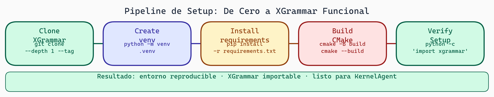

# 01. Setup del Entorno

## Introducción

Cuando comenzamos un proyecto de investigación o desarrollo, lo primero que debemos hacer es preparar nuestro entorno de manera **reproducible y consistente**. Imagina que das el código a un colega y no funciona en su máquina, pero sí en la tuya. ¿Frustante, verdad? Todo se debe a diferencias en el entorno.

En esta lectura aprenderemos cómo configurar correctamente un proyecto Python para garantizar que cualquiera pueda replicar exactamente tu trabajo. Cubriremos tres componentes esenciales: clonar repositorios con versiones específicas, manejar entornos virtuales, y construir librerías complejas como XGrammar.

## ¿Por qué importa el setup?

El entorno es como la receta de un pastel: si alguien usa harina diferente o deja el horno a otra temperatura, el resultado será distinto. En ciencia computacional, necesitamos exactitud. Pequeñas diferencias de versiones pueden causar comportamientos inesperados.

**Principio fundamental**: Tu código debe funcionar de forma idéntica en cualquier máquina que tenga el entorno correcto.

## Clonación de Repositorios con Tags Específicos

### El problema de "HEAD fluctuante"

Cuando clonas un repositorio sin especificar una versión, obtienes la rama principal (usualmente `main` o `master`) en su estado más reciente. Pero la rama evoluciona constantemente. Dos clonaciones en diferentes momentos pueden dar código distinto.

```bash
# ❌ No recomendado - obtienes lo que hay ahora
git clone https://github.com/milab-ai/xgrammar.git
cd xgrammar
# ¿Qué versión tengo? Nadie lo sabe exactamente...
```

### Usando tags para reproducibilidad

Los repositorios usan **tags** para marcar versiones específicas. Puedes pensar en un tag como una fotografía del código en un momento exacto.

```bash
# ✓ Recomendado - reproducible y explícito
git clone https://github.com/milab-ai/xgrammar.git
cd xgrammar
git checkout v0.1.0  # O el tag que necesites
```

¿Cómo saber qué tags están disponibles?

```bash
git tag -l  # Lista todos los tags disponibles
git show v0.1.0  # Ver información sobre un tag específico
```

### Crear tu propio pin de versiones

En un proyecto real, documentarías las versiones exactas:

```
# requirements-dev.txt
xgrammar==0.1.0
torch==2.1.0
triton==2.2.0
numpy==1.24.3
```

La razón: si alguien instala dentro de un año, sin estos pins instalará versiones completamente diferentes, y probablemente el código no funcione.

## Entornos Virtuales: El Aislamiento

### ¿Qué es un entorno virtual?

Cada proyecto Python puede necesitar versiones diferentes de las mismas librerías. Si instalaras todo directamente en Python del sistema, tendríamos conflictos masivos.

Un entorno virtual es una carpeta especial que contiene su propia instalación de Python y paquetes. Es como tener una "máquina virtual ligera" solo para nuestro proyecto.

### Usando `venv` (built-in)

```bash
# Crear un entorno virtual
python3 -m venv venv

# Activarlo (Linux/Mac)
source venv/bin/activate

# Activarlo (Windows)
venv\Scripts\activate

# Confirmar que está activo (verás "venv" en tu prompt)
which python  # Debe apuntar a venv/bin/python
```

Una vez activado, cualquier `pip install` va solo a este entorno.

```bash
pip install torch==2.1.0
pip list  # Verás solo lo que instalaste en THIS venv
```

Para salir:

```bash
deactivate
```

### Usando `conda` (alternativa poderosa)

`conda` es un gestor de entornos más sofisticado, especialmente útil para dependencias complejas:

```bash
# Crear un entorno
conda create --name grammar-gpu python=3.11

# Activarlo
conda activate grammar-gpu

# Desactivarlo
conda deactivate
```

Ventajas de conda:
- Maneja dependencias binarias (como CUDA) automáticamente
- Puede instalar paquetes que no están en PyPI
- Mejor control de versiones

```bash
# Instalar desde conda-forge
conda install -c conda-forge xgboost

# Instalar mezcla de conda y pip
conda install pytorch::pytorch
pip install triton
```

## El archivo `requirements.txt`

Este archivo es tu "lista de compras" para reproducibilidad.

### Formato básico

```txt
# requirements.txt
torch==2.1.0
triton==2.2.0
numpy==1.24.3
pydantic==2.3.0
```

El operador `==` significa "exactamente esta versión". Otros operadores existen:

```txt
torch>=2.0.0      # Versión 2.0.0 o posterior
torch<3.0.0       # Anterior a 3.0.0
torch>=2.0,<3.0   # Entre 2.0 (inclusive) y 3.0 (exclusivo)
```

### Generando requirements.txt

```bash
# Genera un archivo con todo lo instalado (útil, pero impreciso)
pip freeze > requirements.txt
```

El problema: `pip freeze` incluye *todo*, incluso dependencias de dependencias. Es mejor escribir manualmente solo lo que tu código importa directamente.

```txt
# requirements.txt (hecho a mano - mejor)
torch==2.1.0
triton==2.2.0
numpy==1.24.3  # Necesario si lo usas directamente
pydantic==2.3.0
```

### Reproducibilidad exacta con pip-tools

Para proyectos serios, existe una herramienta que resuelve dependencias de forma determinista:

```bash
pip install pip-tools

# Creas un archivo simple
# requirements.in
torch
triton>=2.2
```

```bash
# Esto genera requirements.txt con TODAS las versiones pinned
pip-compile requirements.in
```

El resultado es un archivo que garantiza exactitud total.

## Compilando XGrammar: CMake y nanobind

XGrammar es una librería C++ con bindings Python. Compilarla requiere pasos especiales.

### Prerequisitos

XGrammar usa:
- **CMake**: Sistema de construcción
- **nanobind**: Para crear bindings Python desde C++
- Un compilador C++ (GCC, Clang, MSVC)

```bash
# Ubuntu/Debian
sudo apt-get install cmake build-essential

# macOS (asumiendo Homebrew)
brew install cmake llvm

# Windows: Descargar CMake desde cmake.org
```

### Compilación paso a paso

```bash
# 1. Clonar con tag específico
git clone https://github.com/milab-ai/xgrammar.git
cd xgrammar
git checkout v0.1.0

# 2. Crear directorio de construcción
mkdir build
cd build

# 3. Ejecutar CMake
cmake .. -DCMAKE_BUILD_TYPE=Release

# 4. Compilar
cmake --build . --config Release

# 5. Instalar (opcional)
cmake --install .
```

### Instalación desde fuente (en desarrollo)

Si quieres modificar XGrammar durante el desarrollo:

```bash
# Desde la raíz del repo (no en build/)
pip install -e .
```

El flag `-e` significa "editable". Cambios en el código fuente se reflejan sin recompilar.

### Verificar que XGrammar funciona

```python
import xgrammar as xgr

# Si esto funciona sin errores, ¡está instalado!
schema = {"type": "object"}
compiled = xgr.compile(schema)
print("XGrammar funcionando correctamente")
```

## Configuración de Proyecto Completa

Aquí está el workflow completo para un nuevo miembro del equipo:

```bash
# Paso 1: Clonar el proyecto
git clone https://github.com/tu-org/grammar-kernel-project.git
cd grammar-kernel-project

# Paso 2: Clonar dependencias específicas
git submodule update --init --recursive

# Paso 3: Crear entorno
conda create -n grammar-gpu python=3.11
conda activate grammar-gpu

# Paso 4: Instalar requisitos
pip install -r requirements.txt

# Paso 5: Compilar XGrammar
cd xgrammar
mkdir build && cd build
cmake .. -DCMAKE_BUILD_TYPE=Release
cmake --build . --config Release
pip install -e ..  # Desde raíz de xgrammar
cd ../../

# Paso 6: Verificar
python -c "import xgrammar; print('✓ Todo listo')"
```

### Script de automatización

Para hacerlo aún más fácil, crea un script `setup.sh`:

```bash
#!/bin/bash
set -e  # Salir si algo falla

echo "Configurando entorno..."

# Crear conda env
conda create -n grammar-gpu python=3.11 -y
eval "$(conda shell.bash hook)"
conda activate grammar-gpu

# Instalar requisitos
pip install -r requirements.txt

# Compilar XGrammar
cd xgrammar
mkdir -p build && cd build
cmake .. -DCMAKE_BUILD_TYPE=Release
cmake --build . --config Release
pip install -e ..
cd ../../

echo "✓ Setup completado. Ejecuta: conda activate grammar-gpu"
```

```bash
chmod +x setup.sh
./setup.sh
```



> **Pipeline de Setup — De Cero a XGrammar Funcional**
>
> El proceso sigue cinco etapas ordenadas: clonar el repositorio con el tag exacto, crear el entorno virtual aislado, instalar dependencias Python, compilar con CMake (que genera los bindings C++/nanobind), y verificar que `import xgrammar` funcione. Reproducir este orden garantiza un entorno idéntico al de producción.

## Ejercicios

1. **Reproduce una clonación**:
   - Clona XGrammar con un tag específico
   - Verifica que `git describe --tags` muestra el tag correcto
   - Crea un entorno virtual e instálalo
   - Ejecuta el script de validación

2. **Problema de reproducibilidad**:
   - Crea un `requirements.txt` sin pins de versión
   - En una máquina virtual o contenedor distinto, instálalo dos veces
   - Usa `pip freeze` para ver si las versiones son idénticas
   - ¿Lo fueron? ¿Por qué sí o por qué no?

3. **CMake exploration**:
   - En un proyecto que uses, ejecuta `cmake --help-variable CMAKE_BUILD_TYPE`
   - Explica qué diferencia hay entre `Release` y `Debug`
   - ¿Por qué usamos `Release` para código en producción?

## Preguntas de Reflexión

- ¿Cuál es la diferencia conceptual entre un tag de Git y una rama?
- Si alguien clona tu proyecto sin leer el README, ¿qué pasaría? ¿Cómo lo prevenirías?
- ¿Por qué crees que CMake es útil para proyectos con múltiples lenguajes?
- ¿Cuándo elegirías `venv` vs `conda`? ¿Hay situaciones donde uno es claramente mejor?

## Recursos Útiles

- [Git tagging official docs](https://git-scm.com/book/en/v2/Git-Basics-Tagging)
- [Python venv documentation](https://docs.python.org/3/library/venv.html)
- [Conda user guide](https://docs.conda.io/projects/conda/en/latest/user-guide/)
- [CMake tutorial](https://cmake.org/cmake/help/latest/guide/tutorial/index.html)
- [nanobind documentation](https://nanobind.readthedocs.io/)
