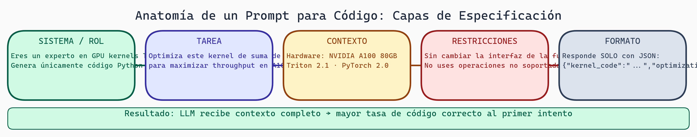

# Prompt Engineering para Generación de Código

> **Módulo:** Project 1 - LLM & Constrained Generation
> **Semana:** 3
> **Tiempo de lectura:** ~25 minutos

---

## Introducción

Has aprendido sobre los modelos de lenguaje especializados en código como CodeLlama y StarCoder. Ahora viene la pregunta crucial: **¿cómo comunicarte efectivamente con estos modelos para obtener el código que necesitas?**

Prompt engineering es el arte y ciencia de diseñar instrucciones que guíen a los LLMs hacia las respuestas deseadas. Para generación de código, esto es especialmente crítico: un prompt mal diseñado puede producir código sintácticamente correcto pero funcionalmente inútil, mientras que un prompt bien diseñado puede generar soluciones elegantes y eficientes.

---

## Objetivos de Aprendizaje

Al finalizar esta lectura, serás capaz de:

1. Diseñar system prompts efectivos para tareas de generación de código
2. Aplicar técnicas de few-shot prompting con ejemplos de código
3. Implementar Chain-of-Thought (CoT) para problemas de programación complejos
4. Analizar y mejorar los prompts utilizados en KernelAgent

---

## Anatomía de un Prompt para Código

Un prompt efectivo para generación de código tiene varios componentes:

### 1. System Prompt

El system prompt establece el contexto y las reglas del juego. Para KernelAgent, podría verse así:

```
You are an expert GPU kernel developer specializing in Triton.
You write efficient, correct kernels following best practices.
Always include proper bounds checking with masks.
Use descriptive variable names that indicate tensor dimensions.
```

> 💡 **Concepto clave:** El system prompt define la "personalidad" y expertise del modelo. Para código, especifica el lenguaje, framework, y estándares de calidad esperados.

### 2. Contexto del Problema

Proporciona información relevante sobre el problema:

```
# Task: Implement a fused softmax kernel in Triton
# Input: tensor of shape (batch_size, seq_len, hidden_dim)
# Output: softmax applied along the last dimension
# Constraints: Must handle arbitrary hidden_dim sizes
```

### 3. Ejemplos (Few-shot)

Incluir ejemplos ayuda al modelo a entender el formato esperado:

```python
# Example: Simple vector addition in Triton
@triton.jit
def add_kernel(x_ptr, y_ptr, output_ptr, n_elements, BLOCK_SIZE: tl.constexpr):
    pid = tl.program_id(0)
    offsets = pid * BLOCK_SIZE + tl.arange(0, BLOCK_SIZE)
    mask = offsets < n_elements
    x = tl.load(x_ptr + offsets, mask=mask)
    y = tl.load(y_ptr + offsets, mask=mask)
    tl.store(output_ptr + offsets, x + y, mask=mask)
```

---

## Few-Shot Prompting para Código

Few-shot prompting es particularmente poderoso para código porque:

1. **Establece patrones sintácticos**: El modelo aprende el estilo de código esperado
2. **Demuestra convenciones**: Nombres de variables, estructura de funciones
3. **Muestra el nivel de detalle**: Cuántos comentarios, qué tipo de error handling

### Selección de Ejemplos

No todos los ejemplos son igual de útiles. Considera:

```python
# MAL: Ejemplo demasiado simple, no enseña patrones útiles
def add(a, b):
    return a + b

# BIEN: Ejemplo que muestra patrones relevantes para Triton
@triton.jit
def reduction_kernel(x_ptr, output_ptr, n_elements, BLOCK_SIZE: tl.constexpr):
    pid = tl.program_id(0)
    offsets = pid * BLOCK_SIZE + tl.arange(0, BLOCK_SIZE)
    mask = offsets < n_elements
    x = tl.load(x_ptr + offsets, mask=mask, other=0.0)
    result = tl.sum(x, axis=0)
    if pid == 0:
        tl.store(output_ptr, result)
```

### Número Óptimo de Ejemplos

- **0 ejemplos (zero-shot)**: Útil para tareas simples o bien definidas
- **1-3 ejemplos**: Típicamente óptimo para generación de código
- **>5 ejemplos**: Puede confundir o llenar el contexto innecesariamente

**Criterios CoT vs few-shot:**
- Few-shot: ejemplos similares disponibles, patrón claro, formato específico
- CoT: problema complejo, múltiples pasos, trade-offs de diseño
- Combina ambos para kernels GPU: patrón estructural + razonamiento de optimización

---

## Chain-of-Thought para Código

Chain-of-Thought (CoT) pide al modelo que "piense paso a paso" antes de generar código. Esto es especialmente útil para:

- Algoritmos complejos
- Optimización de kernels GPU
- Debugging de código existente

### Ejemplo: CoT para Kernel de Softmax

```
Let's think step by step about implementing softmax in Triton:

1. **Input Analysis**: We have a tensor of shape (batch, seq, hidden)
   - We need to apply softmax along the last dimension (hidden)
   - Each (batch, seq) position is independent

2. **Algorithm Design**:
   - For numerical stability: subtract max before exp
   - Compute: softmax(x) = exp(x - max(x)) / sum(exp(x - max(x)))

3. **Parallelization Strategy**:
   - Each program handles one (batch, seq) position
   - Within a program, process hidden_dim elements in blocks

4. **Memory Access Pattern**:
   - Load contiguous elements along hidden_dim
   - Use masks for non-multiple-of-BLOCK_SIZE dimensions

5. **Implementation**:
   [Now generate the actual code...]
```

> 💡 **Concepto clave:** CoT no solo mejora la calidad del código generado, sino que también hace el proceso más interpretable y debuggeable.

---



> **Anatomía de un Prompt para Código — Cinco Capas**
>
> Un prompt eficaz para generación de código no es solo una instrucción: es un documento estructurado con capas que reducen la ambigüedad del LLM. El sistema/rol establece el contexto de expertise; la tarea describe el objetivo concreto; el contexto da información técnica relevante; las restricciones delimitan el espacio de soluciones; y el formato especifica exactamente cómo debe verse el output. Cada capa omitida aumenta la probabilidad de output inusable.

## Prompts en KernelAgent

KernelAgent utiliza un sistema de prompts estructurado en su pipeline. Analicemos sus componentes:

### Stage 1: Análisis del Problema

```python
# Prompt para entender el problema de KernelBench
"""
Analyze the following PyTorch reference implementation:
{pytorch_code}

Identify:
1. Input tensor shapes and dtypes
2. Mathematical operations performed
3. Output tensor characteristics
4. Potential optimization opportunities for GPU
"""
```

### Stage 2: Planificación

```python
# Prompt para diseñar la estrategia
"""
Design a Triton kernel strategy for:
{problem_description}

Consider:
- Block sizes and tiling strategy
- Memory access patterns
- Reduction operations needed
- Autotuning parameters
"""
```

### Stage 3: Generación

```python
# Prompt para generar código
"""
Generate a Triton kernel implementing:
{planned_strategy}

Requirements:
- Use @triton.jit decorator
- Include proper masks for bounds checking
- Follow the API: {api_signature}
"""
```

---

## Errores Comunes en Prompts para Código

### 1. Ambigüedad en Especificaciones

```
# MAL
"Write a fast matrix multiplication"

# BIEN
"Write a Triton kernel for matrix multiplication of tensors
A (M x K) and B (K x N), producing C (M x N).
Use tiling with configurable BLOCK_M, BLOCK_N, BLOCK_K."
```

### 2. Falta de Contexto de Restricciones

```
# MAL
"Implement softmax in Triton"

# BIEN
"Implement softmax in Triton for tensors where the reduction
dimension may not be a multiple of the block size.
Handle edge cases with proper masking."
```

### 3. Ejemplos Inconsistentes

Todos los ejemplos deben seguir el mismo estilo y convenciones. Mezclar estilos confunde al modelo.

---

## Resumen

En esta lectura exploramos:

- **System prompts**: Establecen el contexto y expertise del modelo
- **Few-shot prompting**: Ejemplos que guían el estilo y estructura del código
- **Chain-of-Thought**: Razonamiento paso a paso para problemas complejos
- **Prompts de KernelAgent**: Cómo se estructura un pipeline de prompts real

---

## Ejercicios y Reflexión

### Preguntas de comprensión

1. ¿Por qué es importante incluir ejemplos de código con masks en prompts para Triton?
2. ¿Cuándo usarías CoT vs few-shot prompting para generación de código?
3. ¿Qué información del problema de KernelBench es esencial incluir en el prompt?

### Ejercicio práctico

Toma uno de los prompts de KernelAgent (disponibles en `.fuse/prompts/`) y:
1. Identifica sus componentes (system, context, examples)
2. Propón una mejora al prompt
3. Compara la salida del modelo con ambas versiones

### Para pensar

> *¿Cómo cambiaría tu estrategia de prompting si tuvieras que generar código para un DSL completamente nuevo que el modelo nunca ha visto en su entrenamiento?*

---

## Próximos pasos

En la siguiente semana, exploraremos **XGrammar y Constrained Decoding** - cómo forzar al modelo a generar código que sea sintácticamente válido, combinando el arte de los prompts con la ciencia de las gramáticas formales.

---

*Esta lectura es parte del curso "Grammar-Constrained GPU Kernel Generation" - TC3002B*
