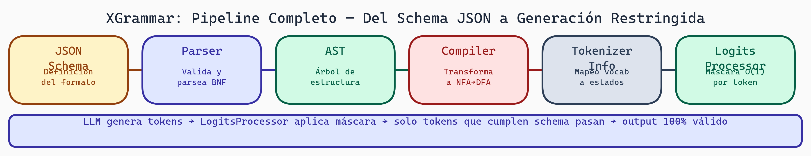

# 03. Internos de XGrammar: El Pipeline de Compilación

## Introducción

XGrammar es una librería que compila gramáticas en máquinas de estados finitos (FSMs) para guiar la generación de texto en modelos de lenguaje. Suena complejo, pero la arquitectura es elegante. En esta lectura entenderemos cómo funciona internamente, qué es cada componente, y cómo explorar el código.

## La Visión General: Del JSON al FSM

El pipeline de XGrammar transforma gramáticas en máquinas que pueden guiar la generación de tokens. Aquí está el flujo:

```
Gramática JSON (entrada)
        ↓
    Parser (analiza)
        ↓
      AST (árbol)
        ↓
   Compiler (procesa)
        ↓
      FSM (máquina de estados)
        ↓
LogitsProcessor (restricciones en generación)
```

Veamos cada paso.

## Paso 1: Gramática JSON (Entrada)

Una gramática describe qué texto es válido. XGrammar usa JSON Schema como base:

```json
{
  "type": "object",
  "properties": {
    "nombre": {"type": "string"},
    "edad": {"type": "integer"},
    "ciudad": {"type": "string"}
  },
  "required": ["nombre", "edad"]
}
```

Esta gramática especifica: "generarás un JSON objeto con propiedades nombre, edad, ciudad".

### Características soportadas

- **Tipos primitivos**: `string`, `integer`, `number`, `boolean`, `null`
- **Estructuras**: `object`, `array`
- **Restricciones**: `required`, `properties`, `items`, `enum`, `pattern`
- **Composición**: `oneOf`, `anyOf`, `allOf`

```python
# ⚠️ XGrammar requiere instalación especial
# !pip install xgrammar

import xgrammar as xgr

# Ejemplo: gramática para números
numero_schema = {
    "type": "number",
    "minimum": 0,
    "maximum": 100
}

# Ejemplo: gramática para arrays
lista_schema = {
    "type": "array",
    "items": {"type": "string"},
    "minItems": 1,
    "maxItems": 5
}
```

## Paso 2: Parser (Análisis)

El parser lee la gramática y la analiza estructuralmente. Verifica que sea válida y extrae información.

```python
# Internamente, XGrammar hace algo así:
def parse_schema(schema):
    """Analizar JSON Schema"""

    if "type" not in schema:
        raise ValueError("type es obligatorio")

    schema_type = schema["type"]

    if schema_type == "string":
        return parse_string_schema(schema)
    elif schema_type == "object":
        return parse_object_schema(schema)
    elif schema_type == "array":
        return parse_array_schema(schema)
    # ...
    else:
        raise ValueError(f"type desconocido: {schema_type}")
```

### Validación durante el parsing

```python
import json

def validar_schema(schema):
    """Validar que un schema sea JSON Schema válido"""

    # 1. Debe ser un diccionario
    if not isinstance(schema, dict):
        raise TypeError("Schema debe ser un dict")

    # 2. Si tiene type, debe ser string o array de strings
    if "type" in schema:
        tipo = schema["type"]
        if isinstance(tipo, str):
            if tipo not in ["string", "integer", "object", "array", "boolean", "null"]:
                raise ValueError(f"type inválido: {tipo}")

    # 3. Si es object, properties debe ser dict
    if schema.get("type") == "object":
        props = schema.get("properties", {})
        if not isinstance(props, dict):
            raise TypeError("properties debe ser dict")

    return True
```

## Paso 3: AST (Abstract Syntax Tree)

El AST es una representación interna. Imagina que es un árbol donde cada nodo representa una parte de la gramática:

```
Object
├── Property "nombre"
│   └── String
├── Property "edad"
│   └── Integer
└── Property "ciudad"
    └── String
```

```python
# Representación simplificada de un AST
class ASTNode:
    pass

class ObjectNode(ASTNode):
    def __init__(self, properties, required):
        self.properties = properties  # dict de nombre -> tipo
        self.required = required       # set de nombres requeridos

class StringNode(ASTNode):
    def __init__(self, pattern=None, enum=None):
        self.pattern = pattern
        self.enum = enum

class IntegerNode(ASTNode):
    def __init__(self, minimum=None, maximum=None):
        self.minimum = minimum
        self.maximum = maximum

# Construir el AST para nuestro schema de JSON
ast = ObjectNode(
    properties={
        "nombre": StringNode(),
        "edad": IntegerNode(minimum=0),
        "ciudad": StringNode()
    },
    required={"nombre", "edad"}
)
```

## Paso 4: Compiler (Compilación)

El compilador transforma el AST en una máquina de estados finitos. Esta es la parte más compleja internamente.

### ¿Qué es una máquina de estados finitos?

Una FSM es un modelo matemático con:
- **Estados**: posiciones en la generación (ej: "esperando '{'", "leyendo nombre", etc.)
- **Transiciones**: cambios entre estados (ej: ver token `{` → pasar a siguiente estado)
- **Aceptación**: estados finales válidos

Visualiza así:

```
START → { → nombre : → "..." → , → edad : → número → } → END
```

### Compilación simplificada

```python
class FSMCompiler:
    def __init__(self):
        self.state_counter = 0
        self.states = {}
        self.transitions = {}

    def new_state(self):
        state_id = self.state_counter
        self.state_counter += 1
        return state_id

    def compile_object(self, obj_node):
        """Compilar ObjectNode a FSM"""

        start = self.new_state()
        current = start

        # Estado después de {
        self.transitions[(current, '{')] = self.new_state()
        current = self.transitions[(current, '{')]

        # Para cada propiedad
        for prop_name, prop_type in obj_node.properties.items():
            # Transición a "nombre" : valor
            self.transitions[(current, prop_name)] = self.new_state()
            current = self.transitions[(current, prop_name)]

            self.transitions[(current, ':')] = self.new_state()
            current = self.transitions[(current, ':')]

            # Compilar el tipo
            current = self.compile_type(prop_type, current)

            # Coma (si no es el último)
            next_state = self.new_state()
            self.transitions[(current, ',')] = next_state
            self.transitions[(current, '}')] = end_state
            current = next_state

        # Estado final
        end_state = self.new_state()
        self.transitions[(current, '}')] = end_state

        return start, end_state

    def compile_type(self, node, current):
        # Compilar tipos recursivamente
        if isinstance(node, StringNode):
            # ... manejo especial para strings
            pass
        # ... otros tipos
        return current

compiler = FSMCompiler()
start_state, end_state = compiler.compile_object(ast)
```

## Paso 5: TokenizerInfo

Para que XGrammar funcione con modelos de lenguaje, necesita saber cómo el modelo tokeniza el texto. Diferentes modelos usan diferentes tokenizadores:

- **GPT-2**: BPE (Byte-Pair Encoding)
- **LLAMA**: Sentencepiece
- **T5**: Sentencepiece

```python
# ⚠️ Requiere: !pip install xgrammar transformers

import xgrammar as xgr
from transformers import AutoTokenizer

# Obtener el tokenizador del modelo
tokenizer = AutoTokenizer.from_pretrained("meta-llama/Llama-2-7b")

# Crear TokenizerInfo
tokenizer_info = xgr.TokenizerInfo.from_huggingface(tokenizer)

# Ahora XGrammar sabe:
# - Cuántos tokens hay
# - Qué string representa cada token
# - Cómo funciona el tokenizador
```

XGrammar usa TokenizerInfo para crear máquinas que trabajan a nivel de **tokens**, no caracteres.

```python
# TokenizerInfo internamente almacena:
class TokenizerInfo:
    def __init__(self):
        self.vocab_size = 32000  # Número de tokens
        self.id_to_token = {}     # token_id -> string
        self.token_to_id = {}     # string -> token_id
        self.eos_token_id = 2     # ID del token de final

    def encode(self, text):
        """Convertir texto a token IDs"""
        return [self.token_to_id[t] for t in text.split()]

    def decode(self, token_ids):
        """Convertir token IDs a texto"""
        return "".join(self.id_to_token[id] for id in token_ids)
```

## Paso 6: LogitsProcessor (Restricción en Generación)

Una vez compilada la gramática a FSM, XGrammar crea un "procesador de logits". Durante la generación de texto, este procesador:

1. Rastrea en qué estado del FSM estamos
2. Permite solo tokens que conducen a estados válidos
3. Actualiza el estado cuando se genera un token

```python
# Pseudocódigo de LogitsProcessor
class GrammarLogitsProcessor:
    def __init__(self, fsm, tokenizer_info):
        self.fsm = fsm
        self.tokenizer = tokenizer_info
        self.current_state = fsm.start_state

    def __call__(self, input_ids, scores):
        """
        input_ids: tokens generados hasta ahora
        scores: logits (antes de softmax) para cada token del vocab

        Retorna: scores modificados para desalentar tokens inválidos
        """

        # Encontrar qué tokens son válidos desde current_state
        valid_tokens = self.fsm.get_valid_transitions(self.current_state)

        # Penalizar tokens inválidos
        for token_id in range(len(scores)):
            if token_id not in valid_tokens:
                scores[token_id] = -float('inf')  # Imposible de generar

        return scores

    def update_state(self, token_id):
        """Actualizar estado después de generar un token"""
        self.current_state = self.fsm.get_next_state(
            self.current_state,
            token_id
        )
```

## Explorando el Código de XGrammar

### Estructura del repositorio

```
xgrammar/
├── src/                    # Código C++
│   ├── compiler/           # Compilador (AST a FSM)
│   ├── grammar/            # Definiciones de gramática
│   └── runtime/            # Runtime (LogitsProcessor)
├── python/                 # Bindings Python
│   ├── xgrammar/
│   │   ├── __init__.py
│   │   ├── grammar.py      # API de gramáticas
│   │   ├── tokenizer.py    # TokenizerInfo
│   │   └── processor.py    # LogitsProcessor
├── tests/
├── CMakeLists.txt
└── README.md
```

### Inspeccionando objetos de XGrammar

```python
# ⚠️ Requiere: !pip install xgrammar

import xgrammar as xgr
import json

# Crear una gramática compilada
schema = {
    "type": "object",
    "properties": {
        "nombre": {"type": "string"},
        "edad": {"type": "integer"}
    }
}

grammar = xgr.Grammar.from_schema(schema)

# Inspeccionarla
print(type(grammar))
# <class 'xgrammar.grammar.Grammar'>

print(dir(grammar))
# ['as_json', 'start_state', 'num_states', 'transitions', ...]

print(grammar.num_states)
# 12 (el compilador creó 12 estados)

# Obtener el estado inicial
print(grammar.start_state)
# 0
```

### Depurando gramáticas

Para entender qué hace una gramática, puedes visualizar sus transiciones:

```python
def print_fsm(grammar):
    """Imprimir la FSM en formato legible"""
    visited = set()

    def dfs(state, indent=0):
        if state in visited:
            return
        visited.add(state)

        print("  " * indent + f"State {state}:")

        # Obtener transiciones desde este estado
        for next_state, token_id in grammar.get_transitions(state):
            token_str = tokenizer.decode([token_id])
            print("  " * (indent + 1) + f"--{token_str}→ {next_state}")
            dfs(next_state, indent + 2)

    dfs(grammar.start_state)

grammar = xgr.Grammar.from_schema({"type": "string"})
print_fsm(grammar)
```

## Flujo Completo: De Schema a Generación

Aquí está todo junto:

```python
# ⚠️ Requiere GPU y librerías especiales:
# !pip install xgrammar transformers torch

import xgrammar as xgr
from transformers import AutoTokenizer, AutoModelForCausalLM
import torch

# 1. Preparar tokenizador
model_name = "meta-llama/Llama-2-7b"
tokenizer = AutoTokenizer.from_pretrained(model_name)
tokenizer_info = xgr.TokenizerInfo.from_huggingface(tokenizer)

# 2. Compilar gramática
schema = {
    "type": "object",
    "properties": {
        "nombre": {"type": "string"},
        "edad": {"type": "integer"}
    },
    "required": ["nombre"]
}

grammar = xgr.Grammar.from_schema(schema)
grammar.compile(tokenizer_info)

# 3. Cargar modelo
model = AutoModelForCausalLM.from_pretrained(model_name)

# 4. Crear processor
processor = xgr.LogitsProcessor(grammar)

# 5. Generar con restricciones
input_ids = tokenizer.encode("Genera JSON: ")

with torch.no_grad():
    for _ in range(100):  # Máximo 100 tokens
        outputs = model(torch.tensor([input_ids]))
        logits = outputs.logits[0, -1, :]

        # Aplicar restricciones
        logits = processor(input_ids, logits)

        # Muestreo
        token_id = torch.argmax(logits).item()
        input_ids.append(token_id)

        if token_id == tokenizer.eos_token_id:
            break

# Decodificar resultado
resultado = tokenizer.decode(input_ids)
print(resultado)
# Output garantizado que es JSON válido
```



> **XGrammar — Pipeline Completo de Compilación y Restricción**
>
> XGrammar transforma un JSON Schema en un mecanismo de restricción de tokens en tiempo de inferencia. El schema se parsea a un AST, que el compilador convierte en un NFA y luego minimiza a un DFA. `TokenizerInfo` mapea cada token del vocabulario a los estados del DFA. En tiempo de generación, `LogitsProcessor` aplica una máscara binaria en O(1) que solo permite tokens válidos según el estado actual — garantizando que cada token generado respete la gramática.

## Ejercicios

1. **Explora un schema simple**:
   - Compila un schema `{"type": "string", "enum": ["a", "b", "c"]}`
   - Imprime las transiciones de su FSM
   - ¿Cuántos estados tiene?

2. **Crea un visualizador**:
   - Escribe un script que lea una gramática
   - Exporte sus transiciones a formato DOT (para Graphviz)
   - Visualiza el FSM

3. **Comparar compilaciones**:
   - Compila dos esquemas similares
   - Compara el número de estados
   - ¿Cuál es más "grande"? ¿Por qué?

## Preguntas de Reflexión

- ¿Por qué necesita XGrammar saber cómo tokeniza el modelo? ¿Qué pasaría sin esto?
- Las máquinas de estados son deterministas. ¿Qué implicaciones tiene para la generación?
- ¿Cómo crees que XGrammar maneja casos como "números entre 0 y 100"?

## Recursos

- [XGrammar GitHub](https://github.com/mlc-ai/xgrammar)
- [JSON Schema spec](https://json-schema.org/)
- [Finite State Machines tutorial](https://en.wikipedia.org/wiki/Finite-state_machine)
