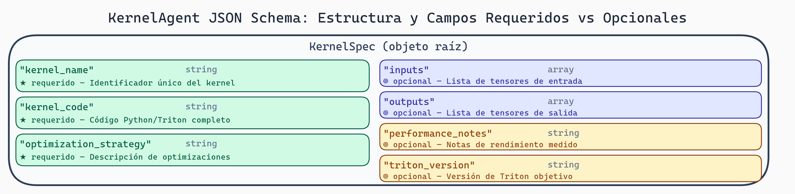

# 04. Phase I: Definiendo la Gramática JSON para KernelAgent

## Introducción

En esta phase, definiremos una gramática JSON Schema que describe la estructura de los kernels Triton que nuestro agente debe generar. Es el primer paso concreto del proyecto: "¿Cómo le decimos al modelo qué estructura debe tener el código?"

La gramática es el puente entre lo que queremos (kernels Triton válidos) y lo que el modelo puede generar (secuencias de tokens).

## Objetivo de la Phase

Vamos a:
1. Diseñar un JSON Schema para representar subgrafos de KernelAgent
2. Compilarlo con XGrammar
3. Crear test cases (casos positivos y negativos)
4. Validar que funciona correctamente

## ¿Qué es KernelAgent?

KernelAgent es un framework para generación automática de kernels GPU. Un subgrafo es una parte de una computación completa. Por ejemplo:

```
Computación completa:
    input → kernel A → kernel B → output

Subgrafo:
    intermediate_1 → kernel A → intermediate_2
```

Nuestro JSON Schema describirá cómo se ve un subgrafo válido.

## Diseño del Schema

Empecemos simple. Un subgrafo de KernelAgent tiene:
- **Inputs**: Variables de entrada
- **Kernel**: El código que ejecutar
- **Outputs**: Variables de salida
- **Constraints**: Restricciones (tamaño, tipos de datos)

```json
{
  "type": "object",
  "properties": {
    "subgraph_id": {
      "type": "string",
      "description": "Identificador único"
    },
    "inputs": {
      "type": "array",
      "items": {
        "type": "object",
        "properties": {
          "name": {"type": "string"},
          "dtype": {"enum": ["float32", "float64", "int32", "int64"]},
          "shape": {
            "type": "array",
            "items": {"type": "integer"},
            "description": "Forma del tensor, ej: [32, 64]"
          }
        },
        "required": ["name", "dtype", "shape"]
      }
    },
    "kernel": {
      "type": "object",
      "properties": {
        "name": {"type": "string"},
        "code": {"type": "string"},
        "framework": {"enum": ["triton", "cuda", "hip"]}
      },
      "required": ["name", "code", "framework"]
    },
    "outputs": {
      "type": "array",
      "items": {
        "type": "object",
        "properties": {
          "name": {"type": "string"},
          "dtype": {"enum": ["float32", "float64", "int32", "int64"]},
          "shape": {
            "type": "array",
            "items": {"type": "integer"}
          }
        },
        "required": ["name", "dtype"]
      }
    }
  },
  "required": ["subgraph_id", "inputs", "kernel", "outputs"]
}
```



> **KernelSpec JSON Schema — Arquitectura de Campos**
>
> El schema de KernelAgent divide sus campos en dos categorías: los requeridos (`kernel_name`, `kernel_code`, `optimization_strategy`) que XGrammar siempre validará, y los opcionales (`inputs`, `outputs`, `performance_notes`, `triton_version`) que enriquecen el output pero no bloquean la generación si el LLM los omite. Esta separación permite flexibilidad en la generación mientras se garantiza que el output mínimo es siempre usable.

## Implementación: Compilando el Schema

Ahora compilaremos este schema con XGrammar:

```python
# === CÓDIGO CONCEPTUAL ===
# Este archivo se crearía en: schemas/kernel_subgraph_schema.py
# ⚠️ xgrammar requiere instalación especial: !pip install xgrammar

import json
# import xgrammar as xgr  # Descomentar cuando xgrammar esté instalado
from pathlib import Path

KERNEL_SUBGRAPH_SCHEMA = {
    "type": "object",
    "properties": {
        "subgraph_id": {
            "type": "string",
            "pattern": "^[a-zA-Z_][a-zA-Z0-9_]*$",
            "description": "Identificador válido de Python"
        },
        "inputs": {
            "type": "array",
            "items": {
                "type": "object",
                "properties": {
                    "name": {"type": "string"},
                    "dtype": {"enum": ["float32", "float64", "int32", "int64"]},
                    "shape": {
                        "type": "array",
                        "items": {"type": "integer", "minimum": 1}
                    }
                },
                "required": ["name", "dtype", "shape"]
            },
            "minItems": 1
        },
        "kernel": {
            "type": "object",
            "properties": {
                "name": {"type": "string"},
                "code": {"type": "string"},
                "framework": {"enum": ["triton", "cuda", "hip"]}
            },
            "required": ["name", "code", "framework"]
        },
        "outputs": {
            "type": "array",
            "items": {
                "type": "object",
                "properties": {
                    "name": {"type": "string"},
                    "dtype": {"enum": ["float32", "float64", "int32", "int64"]},
                    "shape": {
                        "type": "array",
                        "items": {"type": "integer", "minimum": 1}
                    }
                },
                "required": ["name", "dtype"]
            },
            "minItems": 1
        }
    },
    "required": ["subgraph_id", "inputs", "kernel", "outputs"],
    "additionalProperties": False
}

def compile_schema(schema):
    """Compilar schema con XGrammar"""

    # Crear la gramática
    grammar = xgr.Grammar.from_schema(schema)

    # Opcional: compilar con tokenizador específico
    # from transformers import AutoTokenizer
    # tokenizer = AutoTokenizer.from_pretrained("meta-llama/Llama-2-7b")
    # tokenizer_info = xgr.TokenizerInfo.from_huggingface(tokenizer)
    # grammar.compile(tokenizer_info)

    return grammar

# Compilar
kernel_grammar = compile_schema(KERNEL_SUBGRAPH_SCHEMA)

print(f"Gramática compilada con {kernel_grammar.num_states} estados")

# Guardar para reutilizar
def save_grammar(grammar, path):
    """Guardar gramática compilada"""
    path = Path(path)
    path.parent.mkdir(parents=True, exist_ok=True)

    # Guardar schema como referencia
    with open(path.with_suffix('.json'), 'w') as f:
        json.dump(KERNEL_SUBGRAPH_SCHEMA, f, indent=2)

    # XGrammar puede serializar (si lo permite)
    # grammar.save(str(path.with_suffix('.xgr')))

save_grammar(kernel_grammar, "compiled_grammars/kernel_subgraph.xgr")
```

## Test Cases: Positivos y Negativos

Ahora probemos que la gramática funciona correctamente. Escribiremos test cases: ejemplos que DEBEN pasar (positivos) y ejemplos que DEBEN fallar (negativos).

```python
# === CÓDIGO CONCEPTUAL ===
# Este archivo se crearía en: tests/test_kernel_schema.py
# !pip install pytest

import json
import pytest
# from schemas.kernel_subgraph_schema import KERNEL_SUBGRAPH_SCHEMA, compile_schema  # Módulo local

class TestKernelSchema:
    """Test suite para la gramática JSON"""

    @pytest.fixture
    def grammar(self):
        return compile_schema(KERNEL_SUBGRAPH_SCHEMA)

    # ==================== TEST POSITIVOS ====================

    def test_minimal_valid_kernel(self):
        """El caso más simple: un kernel con un input y un output"""
        valid = {
            "subgraph_id": "simple_add",
            "inputs": [
                {
                    "name": "x",
                    "dtype": "float32",
                    "shape": [32, 64]
                }
            ],
            "kernel": {
                "name": "add_one",
                "code": "y = x + 1",
                "framework": "triton"
            },
            "outputs": [
                {
                    "name": "y",
                    "dtype": "float32",
                    "shape": [32, 64]
                }
            ]
        }

        # Convertir a JSON para validar
        json_str = json.dumps(valid)
        assert len(json_str) > 0  # JSON válido

        # Aquí iríamos a validar contra la gramática
        # (veremos cómo en la siguiente sección)

    def test_multiple_inputs_outputs(self):
        """Kernel con múltiples inputs y outputs"""
        valid = {
            "subgraph_id": "matrix_multiply",
            "inputs": [
                {
                    "name": "A",
                    "dtype": "float32",
                    "shape": [128, 256]
                },
                {
                    "name": "B",
                    "dtype": "float32",
                    "shape": [256, 512]
                }
            ],
            "kernel": {
                "name": "matmul",
                "code": "C = A @ B",
                "framework": "triton"
            },
            "outputs": [
                {
                    "name": "C",
                    "dtype": "float32",
                    "shape": [128, 512]
                }
            ]
        }

        json_str = json.dumps(valid)
        assert json.loads(json_str) == valid

    def test_all_dtypes(self):
        """Probar todos los tipos de dato soportados"""
        for dtype in ["float32", "float64", "int32", "int64"]:
            valid = {
                "subgraph_id": f"test_{dtype}",
                "inputs": [{
                    "name": "x",
                    "dtype": dtype,
                    "shape": [10]
                }],
                "kernel": {
                    "name": "identity",
                    "code": "y = x",
                    "framework": "triton"
                },
                "outputs": [{
                    "name": "y",
                    "dtype": dtype
                }]
            }

            json_str = json.dumps(valid)
            assert dtype in json_str

    def test_all_frameworks(self):
        """Probar todos los frameworks soportados"""
        for fw in ["triton", "cuda", "hip"]:
            valid = {
                "subgraph_id": f"test_{fw}",
                "inputs": [{
                    "name": "x",
                    "dtype": "float32",
                    "shape": [10]
                }],
                "kernel": {
                    "name": "test",
                    "code": "// test",
                    "framework": fw
                },
                "outputs": [{
                    "name": "y",
                    "dtype": "float32"
                }]
            }

            assert json.dumps(valid)

    # ==================== TEST NEGATIVOS ====================

    def test_missing_required_field_subgraph_id(self):
        """Falta field requerido: subgraph_id"""
        invalid = {
            # Falta subgraph_id
            "inputs": [{
                "name": "x",
                "dtype": "float32",
                "shape": [10]
            }],
            "kernel": {
                "name": "test",
                "code": "y = x",
                "framework": "triton"
            },
            "outputs": [{
                "name": "y",
                "dtype": "float32"
            }]
        }

        # Esto debería ser JSON válido (es un dict válido)
        # pero NO es válido según nuestro schema
        json_str = json.dumps(invalid)
        assert "subgraph_id" not in invalid

    def test_invalid_dtype(self):
        """dtype inválido (fuera de enum)"""
        invalid = {
            "subgraph_id": "bad_dtype",
            "inputs": [{
                "name": "x",
                "dtype": "bfloat16",  # No soportado
                "shape": [10]
            }],
            "kernel": {
                "name": "test",
                "code": "y = x",
                "framework": "triton"
            },
            "outputs": [{
                "name": "y",
                "dtype": "float32"
            }]
        }

        # bfloat16 no está en el enum
        assert "bfloat16" not in ["float32", "float64", "int32", "int64"]

    def test_invalid_framework(self):
        """Framework no reconocido"""
        invalid = {
            "subgraph_id": "bad_fw",
            "inputs": [{
                "name": "x",
                "dtype": "float32",
                "shape": [10]
            }],
            "kernel": {
                "name": "test",
                "code": "y = x",
                "framework": "pytorch"  # No soportado
            },
            "outputs": [{
                "name": "y",
                "dtype": "float32"
            }]
        }

        assert "pytorch" not in ["triton", "cuda", "hip"]

    def test_invalid_subgraph_id_format(self):
        """subgraph_id no cumple pattern (debe ser identificador válido)"""
        invalid = {
            "subgraph_id": "123-invalid",  # Comienza con número
            "inputs": [{
                "name": "x",
                "dtype": "float32",
                "shape": [10]
            }],
            "kernel": {
                "name": "test",
                "code": "y = x",
                "framework": "triton"
            },
            "outputs": [{
                "name": "y",
                "dtype": "float32"
            }]
        }

        # Pattern: ^[a-zA-Z_][a-zA-Z0-9_]*$
        import re
        pattern = r"^[a-zA-Z_][a-zA-Z0-9_]*$"
        assert not re.match(pattern, "123-invalid")

    def test_empty_inputs(self):
        """inputs vacío (viola minItems: 1)"""
        invalid = {
            "subgraph_id": "empty_input",
            "inputs": [],  # Vacío
            "kernel": {
                "name": "test",
                "code": "y = x",
                "framework": "triton"
            },
            "outputs": [{
                "name": "y",
                "dtype": "float32"
            }]
        }

        assert len(invalid["inputs"]) == 0

    def test_empty_outputs(self):
        """outputs vacío (viola minItems: 1)"""
        invalid = {
            "subgraph_id": "empty_output",
            "inputs": [{
                "name": "x",
                "dtype": "float32",
                "shape": [10]
            }],
            "kernel": {
                "name": "test",
                "code": "y = x",
                "framework": "triton"
            },
            "outputs": []  # Vacío
        }

        assert len(invalid["outputs"]) == 0

    def test_invalid_shape_dimension(self):
        """Shape con dimensión inválida (< 1)"""
        invalid = {
            "subgraph_id": "bad_shape",
            "inputs": [{
                "name": "x",
                "dtype": "float32",
                "shape": [0, 10]  # 0 no es válido
            }],
            "kernel": {
                "name": "test",
                "code": "y = x",
                "framework": "triton"
            },
            "outputs": [{
                "name": "y",
                "dtype": "float32"
            }]
        }

        assert 0 in invalid["inputs"][0]["shape"]

    def test_additional_properties_not_allowed(self):
        """Propiedades adicionales no permitidas"""
        invalid = {
            "subgraph_id": "extra_props",
            "inputs": [{
                "name": "x",
                "dtype": "float32",
                "shape": [10]
            }],
            "kernel": {
                "name": "test",
                "code": "y = x",
                "framework": "triton"
            },
            "outputs": [{
                "name": "y",
                "dtype": "float32"
            }],
            "extra_field": "no debería estar aquí"  # Campo extra
        }

        assert "extra_field" not in KERNEL_SUBGRAPH_SCHEMA["properties"]
```

## Validación Manual

Ahora creemos un script que valide JSON contra nuestro schema:

```python
# === CÓDIGO CONCEPTUAL ===
# Este archivo se crearía en: utils/validate_schema.py
# !pip install jsonschema

import json
from pathlib import Path
from jsonschema import validate, ValidationError
# from schemas.kernel_subgraph_schema import KERNEL_SUBGRAPH_SCHEMA  # Módulo local

def validate_kernel_json(json_str):
    """
    Validar que un string JSON cumple el schema

    Retorna:
        (True, None) si es válido
        (False, error_message) si no es válido
    """

    try:
        data = json.loads(json_str)
    except json.JSONDecodeError as e:
        return False, f"JSON inválido: {e}"

    try:
        validate(instance=data, schema=KERNEL_SUBGRAPH_SCHEMA)
        return True, None
    except ValidationError as e:
        return False, f"Validación fallida: {e.message}"

# Usar
if __name__ == "__main__":
    test_json = json.dumps({
        "subgraph_id": "test",
        "inputs": [{"name": "x", "dtype": "float32", "shape": [10]}],
        "kernel": {"name": "k", "code": "y=x", "framework": "triton"},
        "outputs": [{"name": "y", "dtype": "float32"}]
    })

    valid, error = validate_kernel_json(test_json)
    print(f"Valid: {valid}")
    if error:
        print(f"Error: {error}")
```

## Ejercicios

1. **Expande el schema**:
   - Agrega un campo `description` opcional a inputs/outputs
   - Agrega un campo `optimization_level` que sea "O0", "O1", "O2", o "O3"
   - Actualiza los tests

2. **Crea test cases con XGrammar real**:
   - Compila el schema con XGrammar
   - Escribe un test que genere JSON válido usando XGrammar
   - Verifica que puedes parsear el JSON generado

3. **Schema discovery**:
   - Recolecta 5 kernels Triton reales
   - Analiza su estructura
   - ¿Tu schema actual los cubriría? Si no, ¿qué necesitarías agregar?

## Preguntas de Reflexión

- ¿Qué pasa si alguien genera JSON según el schema, pero el código Triton dentro es inválido? ¿El schema lo previene?
- ¿Es mejor ser restrictivo (few constraints) o permisivo (many constraints) en un schema para LLM?
- ¿Cómo crees que el modelo aprendería a generar valores válidos para "shape"?

## Recursos

- [JSON Schema specification](https://json-schema.org/)
- [jsonschema Python library](https://python-jsonschema.readthedocs.io/)
- [XGrammar compilation examples](https://github.com/mlc-ai/xgrammar)
