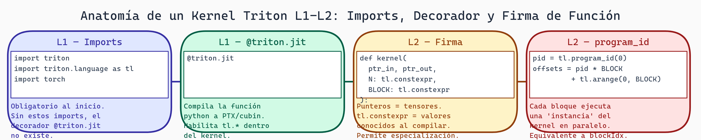

# 06. Gramática L1-L2: Estructura Base de Kernels Triton

## Introducción

Ahora que tenemos un corpus de kernels Triton y entendemos la estructura interna de XGrammar, vamos a crear la gramática **L1-L2**. Esta cubre la estructura "esqueletal" de los kernels Triton:

- **L1**: Imports y decoradores (qué necesita todo kernel)
- **L2**: Firma de la función (parámetros, tipos)

Es lo más básico. Una vez que domines esto, L3 (expresiones) y L4 (control flow) serán naturales.

## Anatomía de un Kernel Triton Mínimo

```python
# ⚠️ Requiere GPU NVIDIA y Triton instalado
# En Colab: Runtime > Change runtime type > T4 GPU
# !pip install triton

import triton
import triton.language as tl

@triton.jit
def kernel_name(x_ptr, y_ptr, BLOCK_SIZE: tl.constexpr):
    # Aquí va el cuerpo (L3-L4)
    pass
```

Desglosemos:

1. **L1-Imports**: `import triton`, `import triton.language as tl`
2. **L1-Decoradores**: `@triton.jit` (obligatorio)
3. **L2-Firma**: Nombre, parámetros, tipos

## L1: Imports Requeridos

Todo kernel Triton necesita estos imports. Vamos a modelarlos en EBNF:

```ebnf
imports = import_triton import_triton_language
        | import_triton_language import_triton

import_triton = "import" "triton"
import_triton_language = "import" "triton" "." "language" ("as" "tl")?
```

En práctica, casi siempre ves:
```python
import triton
import triton.language as tl
```

Pero técnicamente podrías hacer:
```python
import triton.language
# Y luego usar triton.language.load() en vez de tl.load()
```

## L1: Decorador @triton.jit

El decorador `@triton.jit` es obligatorio. Opcionalmente puede tener argumentos:

```python
@triton.jit
def kernel(...): pass

# O con argumentos
@triton.jit(version=1)
def kernel(...): pass

@triton.jit(interpret=True)
def kernel(...): pass
```

EBNF:
```ebnf
decorator = "@" "triton" "." "jit" decorator_args?

decorator_args = "(" kwarg ("," kwarg)* ")"
kwarg = identifier "=" (string | number | boolean)
```

## L2: Firma de la Función

La firma especifica parámetros y sus tipos:

```python
def kernel_add(x_ptr, y_ptr, output_ptr, n: tl.constexpr):
    pass
```

Características:
- Parámetros sin tipo: `x_ptr, y_ptr, output_ptr` (estos son punteros)
- Parámetros con tipo `tl.constexpr`: `n: tl.constexpr` (valores constantes en tiempo de compilación)
- Opcionalmente, tipos con valores por defecto: `BLOCK_SIZE: tl.constexpr = 1024`

EBNF:
```ebnf
function_def = "def" identifier "(" parameters? ")"

parameters = parameter ("," parameter)*

parameter = identifier
          | identifier ":" type_annotation
          | identifier ":" type_annotation "=" literal

type_annotation = "tl" "." "constexpr"
                | identifier

literal = number | string | "True" | "False"
```

## Ejemplo Práctico: Kernel Vector Add

```python
import triton
import triton.language as tl

@triton.jit
def kernel_add(
    x_ptr,
    y_ptr,
    output_ptr,
    n,
    BLOCK_SIZE: tl.constexpr
):
    """
    Estructura L1-L2 completada.
    Falta L3 (expresiones) y L4 (control flow).
    """
    pass
```

## Implementación EBNF Completa

Aquí está la especificación formal de L1-L2 en EBNF:

```ebnf
# Nivel L1-L2: Estructura e Importes

source_code = imports decorators function_def

# ===== IMPORTS (L1) =====

imports = import_statement+

import_statement = "import" "triton"
                 | "import" "triton" "." "language" ("as" "tl")?

# ===== DECORADORES (L1) =====

decorators = decorator+

decorator = "@" "triton" "." "jit" decorator_args?

decorator_args = "(" kwarg_list? ")"

kwarg_list = kwarg ("," kwarg)*

kwarg = IDENTIFIER "=" literal

# ===== FUNCIÓN (L2) =====

function_def = "def" IDENTIFIER "(" params? ")" ":"

params = parameter ("," parameter)*

parameter = IDENTIFIER type_hint? default_value?

type_hint = ":" type_expr

type_expr = "tl" "." "constexpr"
          | IDENTIFIER

default_value = "=" literal

# ===== LITERALES =====

literal = NUMBER
        | STRING
        | "True"
        | "False"
        | "None"

# ===== IDENTIFIERS (terminales) =====

IDENTIFIER = [a-zA-Z_][a-zA-Z0-9_]*
NUMBER = [0-9]+
STRING = '"' (~["])* '"'
       | "'" (~['])* "'"
```

## Implementación en XGrammar

Ahora convertiremos esto a JSON Schema que XGrammar pueda compilar:

```python
# === CÓDIGO CONCEPTUAL ===
# Este archivo se crearía en: schemas/triton_l1_l2_schema.py
# Aquí se muestra la estructura del schema

import json

TRITON_L1_L2_SCHEMA = {
    "type": "object",
    "properties": {
        "imports": {
            "type": "array",
            "items": {
                "type": "object",
                "properties": {
                    "type": {
                        "enum": ["import_triton", "import_triton_language"]
                    },
                    "as_name": {
                        "type": "string",
                        "default": "tl"
                    }
                },
                "required": ["type"]
            },
            "minItems": 2,
            "maxItems": 2,
            "description": "Imports requeridos: triton y triton.language"
        },
        "decorator": {
            "type": "object",
            "properties": {
                "name": {
                    "enum": ["triton.jit"]
                },
                "kwargs": {
                    "type": "object",
                    "additionalProperties": {
                        "oneOf": [
                            {"type": "string"},
                            {"type": "number"},
                            {"type": "boolean"}
                        ]
                    }
                }
            },
            "required": ["name"]
        },
        "function": {
            "type": "object",
            "properties": {
                "name": {
                    "type": "string",
                    "pattern": "^kernel_[a-z_][a-z0-9_]*$",
                    "description": "Nombres de kernel típicamente empiezan con 'kernel_'"
                },
                "parameters": {
                    "type": "array",
                    "items": {
                        "type": "object",
                        "properties": {
                            "name": {"type": "string"},
                            "type_hint": {
                                "oneOf": [
                                    {"enum": ["tl.constexpr"]},
                                    {"type": "string"}
                                ]
                            },
                            "default": {
                                "oneOf": [
                                    {"type": "number"},
                                    {"type": "string"},
                                    {"type": "boolean"},
                                    {"enum": [None]}
                                ]
                            }
                        },
                        "required": ["name"]
                    },
                    "minItems": 1,
                    "maxItems": 16,  # Límite razonable de parámetros
                    "description": "Parámetros del kernel"
                }
            },
            "required": ["name", "parameters"]
        }
    },
    "required": ["imports", "decorator", "function"],
    "additionalProperties": False
}
```



> **Kernel Triton L1-L2 — Las Cuatro Capas Estructurales**
>
> Todo kernel Triton válido requiere estas cuatro capas en orden: imports de `triton` y `triton.language` (L1), el decorador `@triton.jit` que activa la compilación JIT a PTX (L1), la firma de función con punteros y parámetros `tl.constexpr` (L2), y la obtención del `program_id` que posiciona cada bloque paralelo en los datos (L2). Omitir cualquier capa produce un error de compilación o resultados incorrectos.

## Generador de Código: De JSON a Python

Ahora creamos un generador que convierte el JSON estructurado de vuelta a código Python:

```python
# === CÓDIGO CONCEPTUAL ===
# Este archivo se crearía en: generators/triton_generator.py

import json
from typing import Dict, List, Any

class TritonCodeGenerator:
    """Genera código Triton a partir de JSON estructurado"""

    def __init__(self):
        pass

    def generate_imports(self, imports_list: List[Dict]) -> str:
        """Generar sección de imports"""

        lines = []
        for imp in imports_list:
            if imp["type"] == "import_triton":
                lines.append("import triton")
            elif imp["type"] == "import_triton_language":
                as_name = imp.get("as_name", "tl")
                lines.append(f"import triton.language as {as_name}")

        return "\n".join(lines)

    def generate_decorator(self, decorator_spec: Dict) -> str:
        """Generar decorador"""

        code = "@triton.jit"

        if "kwargs" in decorator_spec and decorator_spec["kwargs"]:
            kwargs_str = ", ".join(
                f"{k}={self._format_value(v)}"
                for k, v in decorator_spec["kwargs"].items()
            )
            code += f"({kwargs_str})"

        return code

    def generate_function_signature(self, function_spec: Dict) -> str:
        """Generar firma de función"""

        name = function_spec["name"]
        params = function_spec.get("parameters", [])

        # Generar lista de parámetros
        param_strs = []
        for param in params:
            param_str = param["name"]

            # Agregar type hint si existe
            if "type_hint" in param:
                param_str += f": {param['type_hint']}"

            # Agregar default si existe
            if "default" in param and param["default"] is not None:
                param_str += f"={self._format_value(param['default'])}"

            param_strs.append(param_str)

        params_str = ", ".join(param_strs)
        return f"def {name}({params_str}):"

    def generate(self, spec: Dict) -> str:
        """Generar código Triton completo (L1-L2)"""

        lines = [
            self.generate_imports(spec["imports"]),
            "",  # Línea en blanco
            self.generate_decorator(spec["decorator"]),
            self.generate_function_signature(spec["function"]),
            "    pass  # Cuerpo del kernel (L3-L4 por venir)",
        ]

        return "\n".join(lines)

    @staticmethod
    def _format_value(value: Any) -> str:
        """Formatear un valor para código Python"""

        if isinstance(value, str):
            return f'"{value}"'
        elif isinstance(value, bool):
            return "True" if value else "False"
        elif value is None:
            return "None"
        else:
            return str(value)

# Uso
if __name__ == "__main__":
    spec = {
        "imports": [
            {"type": "import_triton"},
            {"type": "import_triton_language", "as_name": "tl"}
        ],
        "decorator": {
            "name": "triton.jit",
            "kwargs": {}
        },
        "function": {
            "name": "kernel_add",
            "parameters": [
                {"name": "x_ptr"},
                {"name": "y_ptr"},
                {"name": "output_ptr"},
                {"name": "n"},
                {"name": "BLOCK_SIZE", "type_hint": "tl.constexpr", "default": 1024}
            ]
        }
    }

    generator = TritonCodeGenerator()
    code = generator.generate(spec)
    print(code)

    # Output:
    # import triton
    # import triton.language as tl
    #
    # @triton.jit
    # def kernel_add(x_ptr, y_ptr, output_ptr, n, BLOCK_SIZE: tl.constexpr=1024):
    #     pass  # Cuerpo del kernel (L3-L4 por venir)
```

## Validación L1-L2

Tests para verificar que nuestra gramática funciona:

```python
# === CÓDIGO CONCEPTUAL ===
# Este archivo se crearía en: tests/test_l1_l2.py
# Los imports asumen que ya creaste los módulos anteriores
# !pip install pytest jsonschema

import pytest
import json
# from generators.triton_generator import TritonCodeGenerator  # Módulo local
# from schemas.triton_l1_l2_schema import TRITON_L1_L2_SCHEMA  # Módulo local
from jsonschema import validate, ValidationError

class TestTritonL1L2:
    """Tests para importes, decoradores y firma"""

    def test_valid_basic_kernel(self):
        """Kernel válido más simple"""
        spec = {
            "imports": [
                {"type": "import_triton"},
                {"type": "import_triton_language"}
            ],
            "decorator": {"name": "triton.jit"},
            "function": {
                "name": "kernel_basic",
                "parameters": [
                    {"name": "x_ptr"},
                    {"name": "y_ptr"}
                ]
            }
        }

        validate(instance=spec, schema=TRITON_L1_L2_SCHEMA)

        # Generar código
        generator = TritonCodeGenerator()
        code = generator.generate(spec)
        assert "import triton" in code
        assert "@triton.jit" in code
        assert "def kernel_basic" in code

    def test_kernel_with_constexpr(self):
        """Kernel con parámetros constexpr"""
        spec = {
            "imports": [
                {"type": "import_triton"},
                {"type": "import_triton_language"}
            ],
            "decorator": {"name": "triton.jit"},
            "function": {
                "name": "kernel_with_const",
                "parameters": [
                    {"name": "x_ptr"},
                    {"name": "BLOCK_SIZE", "type_hint": "tl.constexpr"}
                ]
            }
        }

        validate(instance=spec, schema=TRITON_L1_L2_SCHEMA)

        generator = TritonCodeGenerator()
        code = generator.generate(spec)
        assert "tl.constexpr" in code

    def test_kernel_with_defaults(self):
        """Kernel con valores por defecto"""
        spec = {
            "imports": [
                {"type": "import_triton"},
                {"type": "import_triton_language"}
            ],
            "decorator": {"name": "triton.jit"},
            "function": {
                "name": "kernel_defaults",
                "parameters": [
                    {"name": "x_ptr"},
                    {"name": "BLOCK_SIZE", "type_hint": "tl.constexpr", "default": 1024}
                ]
            }
        }

        validate(instance=spec, schema=TRITON_L1_L2_SCHEMA)

        generator = TritonCodeGenerator()
        code = generator.generate(spec)
        assert "BLOCK_SIZE: tl.constexpr=1024" in code

    def test_invalid_missing_imports(self):
        """Debe fallar: faltan imports"""
        spec = {
            "imports": [{"type": "import_triton"}],  # Solo uno
            "decorator": {"name": "triton.jit"},
            "function": {
                "name": "kernel_test",
                "parameters": [{"name": "x"}]
            }
        }

        with pytest.raises(ValidationError):
            validate(instance=spec, schema=TRITON_L1_L2_SCHEMA)

    def test_invalid_missing_decorator(self):
        """Debe fallar: falta decorator"""
        spec = {
            "imports": [
                {"type": "import_triton"},
                {"type": "import_triton_language"}
            ],
            # Falta decorator
            "function": {
                "name": "kernel_test",
                "parameters": [{"name": "x"}]
            }
        }

        with pytest.raises(ValidationError):
            validate(instance=spec, schema=TRITON_L1_L2_SCHEMA)

    def test_invalid_kernel_name(self):
        """Nombre de kernel no válido"""
        spec = {
            "imports": [
                {"type": "import_triton"},
                {"type": "import_triton_language"}
            ],
            "decorator": {"name": "triton.jit"},
            "function": {
                "name": "not_kernel_123",  # No empieza con kernel_
                "parameters": [{"name": "x"}]
            }
        }

        with pytest.raises(ValidationError):
            validate(instance=spec, schema=TRITON_L1_L2_SCHEMA)

    def test_too_many_parameters(self):
        """Demasiados parámetros"""
        spec = {
            "imports": [
                {"type": "import_triton"},
                {"type": "import_triton_language"}
            ],
            "decorator": {"name": "triton.jit"},
            "function": {
                "name": "kernel_test",
                "parameters": [
                    {"name": f"p{i}"}
                    for i in range(20)  # Más que maxItems: 16
                ]
            }
        }

        with pytest.raises(ValidationError):
            validate(instance=spec, schema=TRITON_L1_L2_SCHEMA)
```

## Ejercicios

1. **Extiende el schema**:
   - Agrega soporte para otros decoradores (ej: `@triton.autotune`)
   - Permite múltiples decoradores
   - Actualiza el generador

2. **Crea un parser inverso**:
   - Lee código Triton Python
   - Extrae la sección L1-L2
   - Genera el JSON estructurado

3. **Test contra corpus**:
   - Toma kernels del corpus de la lectura anterior
   - Extrae su L1-L2
   - ¿Tu schema los acepta?

## Preguntas de Reflexión

- ¿Por qué crees que `@triton.jit` es obligatorio?
- ¿Qué ventajas tiene modelar esto en JSON Schema vs. una gramática de texto puro?
- ¿Cómo cambiaría el esquema si quisieras soportar kernels que usan `@triton.heuristics`?

## Recursos

- [EBNF specification](https://www.w3.org/TR/xml11/#sec-notation)
- [Triton documentation - decorators](https://triton-lang.org/)
- [JSON Schema Specification](https://json-schema.org/)
