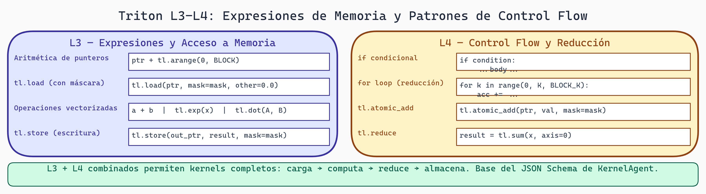

# 07. Gramática L3-L4: Expresiones y Control Flow

## Introducción

Ahora llegamos al corazón del kernel: el cuerpo del código. **L3** cubre expresiones (aritmética, comparaciones, indexación), y **L4** cubre control flow (if, for, while). Esto es donde ocurre la computación real.

Esta lectura es la más técnica, porque los patrones son complejos. Pero la idea es la misma: especificar qué sintaxis es válida en código Triton.

## L3: Expresiones en Triton

### Categorías de Expresiones

En código Triton típicamente ves:

```python
# Operaciones aritméticas
result = x + y * 2
result = tl.sum(x)

# Indexación
value = array[0]
value = array[idx]

# Comparaciones
mask = x > 0
mask = x == y

# Llamadas a funciones API
data = tl.load(ptr + offset, mask=mask)
tl.store(ptr + offset, data, mask=mask)

# Conversiones de tipo
x = x.to(tl.float32)
```

### EBNF para L3

```ebnf
expression = assignment
           | ternary_expr

assignment = identifier "=" expression

ternary_expr = logical_or_expr ("if" logical_or_expr "else" ternary_expr)?

logical_or_expr = logical_and_expr ("or" logical_and_expr)*

logical_and_expr = bitwise_or_expr ("and" bitwise_or_expr)*

bitwise_or_expr = bitwise_xor_expr ("|" bitwise_xor_expr)*

bitwise_xor_expr = bitwise_and_expr ("^" bitwise_and_expr)*

bitwise_and_expr = comparison_expr ("&" comparison_expr)*

comparison_expr = arithmetic_expr (comp_op arithmetic_expr)*

comp_op = "==" | "!=" | "<" | "<=" | ">" | ">="

arithmetic_expr = mul_expr (add_op mul_expr)*

add_op = "+" | "-"

mul_expr = unary_expr (mul_op unary_expr)*

mul_op = "*" | "/" | "%" | "//"

unary_expr = unary_op? postfix_expr

unary_op = "-" | "+" | "~" | "not"

postfix_expr = primary_expr postfix_part*

postfix_part = subscript | method_call | member_access

subscript = "[" expression "]"

method_call = "." identifier "(" args? ")"

member_access = "." identifier

primary_expr = literal
             | identifier
             | "(" expression ")"
             | function_call

function_call = identifier "(" args? ")"
              | "tl" "." identifier "(" args? ")"

args = expression ("," expression)*

literal = NUMBER | STRING | "True" | "False" | "None"
```

### Expresiones Comunes en Triton

```python
# Cargar datos
x = tl.load(x_ptr + offsets, mask=mask, other=0.0)

# Operaciones vectoriales
y = x + 1
z = x * y

# Reducciones
sum_x = tl.sum(x)
max_x = tl.max(x)

# Conversiones
x_float = x.to(tl.float32)

# Creación de tensores
offsets = tl.arange(0, BLOCK_SIZE)
zeros = tl.zeros((BLOCK_SIZE,), dtype=tl.float32)

# Operaciones condicionales
result = tl.where(mask, x, y)

# Operaciones booleanas
mask = (x > 0) & (y < 10)
```

## L4: Control Flow

### Patrones de Control Flow

Triton soporta `if`, `for`, `while` con algunas limitaciones (deben ser compilables):

```python
# if simple
if condition:
    x = y + 1

# if-else
if x > 0:
    result = x
else:
    result = -x

# for loop
for i in range(n):
    x[i] = y[i] + 1

# while loop
while condition:
    x = x + 1
```

### EBNF para L4

```ebnf
statement = expression_stmt
          | if_stmt
          | for_stmt
          | while_stmt
          | return_stmt
          | assignment_stmt

if_stmt = "if" condition ":" suite
          ("elif" condition ":" suite)*
          ("else" ":" suite)?

for_stmt = "for" identifier "in" iterable ":" suite

while_stmt = "while" condition ":" suite

return_stmt = "return" expression?

assignment_stmt = identifier "=" expression
                | identifier ("[" expression "]") "=" expression

suite = simple_stmt
      | NEWLINE INDENT statement+ DEDENT

condition = expression

iterable = "range" "(" arguments ")"
         | identifier

arguments = expression ("," expression)*
```



> **Triton L3-L4 — Operaciones de Memoria y Control Flow**
>
> L3 cubre la capa de acceso a datos: aritmética de punteros para calcular offsets, `tl.load` con máscara para lecturas seguras fuera de límites, operaciones vectorizadas (suma, exp, dot), y `tl.store` para escritura. L4 agrega lógica condicional y loops que permiten kernels complejos: `if` para branches, `for` para reducciones acumulativas, `tl.atomic_add` para escrituras concurrentes seguras, y `tl.reduce` para operaciones de reducción paralela.

## Implementación L3-L4 en JSON Schema

```python
# schemas/triton_l3_l4_schema.py

import json

TRITON_L3_L4_EXPRESSION_SCHEMA = {
    "type": "object",
    "oneOf": [
        # Expresiones simples
        {
            "type": "object",
            "properties": {
                "type": {"enum": ["literal"]},
                "value": {"oneOf": [
                    {"type": "number"},
                    {"type": "string"},
                    {"type": "boolean"},
                    {"enum": [None]}
                ]}
            },
            "required": ["type", "value"]
        },
        # Variable reference
        {
            "type": "object",
            "properties": {
                "type": {"enum": ["identifier"]},
                "name": {"type": "string"}
            },
            "required": ["type", "name"]
        },
        # Operación binaria
        {
            "type": "object",
            "properties": {
                "type": {"enum": ["binary_op"]},
                "operator": {
                    "enum": ["+", "-", "*", "/", "%", "//",
                             "&", "|", "^", "<<", ">>",
                             "==", "!=", "<", "<=", ">", ">=",
                             "and", "or"]
                },
                "left": {"$ref": "#"},
                "right": {"$ref": "#"}
            },
            "required": ["type", "operator", "left", "right"]
        },
        # Operación unaria
        {
            "type": "object",
            "properties": {
                "type": {"enum": ["unary_op"]},
                "operator": {"enum": ["-", "+", "~", "not"]},
                "operand": {"$ref": "#"}
            },
            "required": ["type", "operator", "operand"]
        },
        # Indexación
        {
            "type": "object",
            "properties": {
                "type": {"enum": ["subscript"]},
                "object": {"$ref": "#"},
                "index": {"$ref": "#"}
            },
            "required": ["type", "object", "index"]
        },
        # Llamada a función
        {
            "type": "object",
            "properties": {
                "type": {"enum": ["call"]},
                "func": {
                    "oneOf": [
                        {
                            "type": "object",
                            "properties": {
                                "type": {"enum": ["identifier"]},
                                "name": {"type": "string"}
                            }
                        },
                        {
                            "type": "object",
                            "properties": {
                                "type": {"enum": ["member"]},
                                "object": {"type": "string"},  # "tl"
                                "member": {"type": "string"}     # "load", "store", etc.
                            }
                        }
                    ]
                },
                "args": {
                    "type": "array",
                    "items": {"$ref": "#"}
                },
                "kwargs": {
                    "type": "object",
                    "additionalProperties": {"$ref": "#"}
                }
            },
            "required": ["type", "func"]
        }
    ]
}

TRITON_L3_L4_STATEMENT_SCHEMA = {
    "type": "object",
    "oneOf": [
        # Assignment
        {
            "type": "object",
            "properties": {
                "type": {"enum": ["assign"]},
                "target": {"type": "string"},
                "value": TRITON_L3_L4_EXPRESSION_SCHEMA
            },
            "required": ["type", "target", "value"]
        },
        # If statement
        {
            "type": "object",
            "properties": {
                "type": {"enum": ["if"]},
                "condition": TRITON_L3_L4_EXPRESSION_SCHEMA,
                "then_body": {
                    "type": "array",
                    "items": {"$ref": "#"}
                },
                "else_body": {
                    "type": "array",
                    "items": {"$ref": "#"}
                }
            },
            "required": ["type", "condition", "then_body"]
        },
        # For loop
        {
            "type": "object",
            "properties": {
                "type": {"enum": ["for"]},
                "target": {"type": "string"},
                "iter": {
                    "oneOf": [
                        {
                            "type": "object",
                            "properties": {
                                "type": {"enum": ["range_call"]},
                                "start": TRITON_L3_L4_EXPRESSION_SCHEMA,
                                "end": TRITON_L3_L4_EXPRESSION_SCHEMA,
                                "step": TRITON_L3_L4_EXPRESSION_SCHEMA
                            }
                        },
                        {
                            "type": "object",
                            "properties": {
                                "type": {"enum": ["identifier"]},
                                "name": {"type": "string"}
                            }
                        }
                    ]
                },
                "body": {
                    "type": "array",
                    "items": {"$ref": "#"}
                }
            },
            "required": ["type", "target", "iter", "body"]
        },
        # While loop
        {
            "type": "object",
            "properties": {
                "type": {"enum": ["while"]},
                "condition": TRITON_L3_L4_EXPRESSION_SCHEMA,
                "body": {
                    "type": "array",
                    "items": {"$ref": "#"}
                }
            },
            "required": ["type", "condition", "body"]
        },
        # Return
        {
            "type": "object",
            "properties": {
                "type": {"enum": ["return"]},
                "value": TRITON_L3_L4_EXPRESSION_SCHEMA
            }
        }
    ]
}

TRITON_KERNEL_BODY_SCHEMA = {
    "type": "array",
    "items": TRITON_L3_L4_STATEMENT_SCHEMA,
    "description": "Cuerpo del kernel (L3-L4)"
}
```

## Generador de Código L3-L4

```python
# generators/l3_l4_generator.py

class ExpressionGenerator:
    """Genera expresiones Python/Triton desde JSON"""

    def generate_expression(self, expr_spec):
        """Generar una expresión"""

        if expr_spec["type"] == "literal":
            return self._format_literal(expr_spec["value"])

        elif expr_spec["type"] == "identifier":
            return expr_spec["name"]

        elif expr_spec["type"] == "binary_op":
            left = self.generate_expression(expr_spec["left"])
            right = self.generate_expression(expr_spec["right"])
            op = expr_spec["operator"]
            return f"({left} {op} {right})"

        elif expr_spec["type"] == "unary_op":
            operand = self.generate_expression(expr_spec["operand"])
            op = expr_spec["operator"]
            return f"{op}{operand}"

        elif expr_spec["type"] == "subscript":
            obj = self.generate_expression(expr_spec["object"])
            idx = self.generate_expression(expr_spec["index"])
            return f"{obj}[{idx}]"

        elif expr_spec["type"] == "call":
            func_spec = expr_spec["func"]
            if func_spec["type"] == "identifier":
                func_name = func_spec["name"]
            else:  # member
                func_name = f"{func_spec['object']}.{func_spec['member']}"

            args = [self.generate_expression(arg) for arg in expr_spec.get("args", [])]
            kwargs = {
                k: self.generate_expression(v)
                for k, v in expr_spec.get("kwargs", {}).items()
            }

            args_str = ", ".join(args)
            if kwargs:
                kwargs_str = ", ".join(f"{k}={v}" for k, v in kwargs.items())
                args_str = f"{args_str}, {kwargs_str}" if args_str else kwargs_str

            return f"{func_name}({args_str})"

        else:
            raise ValueError(f"Tipo desconocido: {expr_spec['type']}")

    @staticmethod
    def _format_literal(value):
        if isinstance(value, str):
            return f'"{value}"'
        elif isinstance(value, bool):
            return "True" if value else "False"
        elif value is None:
            return "None"
        else:
            return str(value)


class StatementGenerator(ExpressionGenerator):
    """Genera statements (if, for, etc.)"""

    def generate_statement(self, stmt_spec, indent=0):
        """Generar un statement con indentación"""

        indent_str = "    " * indent

        if stmt_spec["type"] == "assign":
            target = stmt_spec["target"]
            value = self.generate_expression(stmt_spec["value"])
            return f"{indent_str}{target} = {value}"

        elif stmt_spec["type"] == "if":
            lines = []
            condition = self.generate_expression(stmt_spec["condition"])
            lines.append(f"{indent_str}if {condition}:")

            for stmt in stmt_spec["then_body"]:
                lines.append(self.generate_statement(stmt, indent + 1))

            if "else_body" in stmt_spec:
                lines.append(f"{indent_str}else:")
                for stmt in stmt_spec["else_body"]:
                    lines.append(self.generate_statement(stmt, indent + 1))

            return "\n".join(lines)

        elif stmt_spec["type"] == "for":
            lines = []
            target = stmt_spec["target"]
            iter_spec = stmt_spec["iter"]

            if iter_spec["type"] == "range_call":
                start = self.generate_expression(iter_spec["start"])
                end = self.generate_expression(iter_spec["end"])
                step = self.generate_expression(iter_spec.get("step", {"type": "literal", "value": 1}))
                iter_expr = f"range({start}, {end}, {step})"
            else:
                iter_expr = iter_spec["name"]

            lines.append(f"{indent_str}for {target} in {iter_expr}:")

            for stmt in stmt_spec["body"]:
                lines.append(self.generate_statement(stmt, indent + 1))

            return "\n".join(lines)

        elif stmt_spec["type"] == "while":
            lines = []
            condition = self.generate_expression(stmt_spec["condition"])
            lines.append(f"{indent_str}while {condition}:")

            for stmt in stmt_spec["body"]:
                lines.append(self.generate_statement(stmt, indent + 1))

            return "\n".join(lines)

        elif stmt_spec["type"] == "return":
            if "value" in stmt_spec:
                value = self.generate_expression(stmt_spec["value"])
                return f"{indent_str}return {value}"
            else:
                return f"{indent_str}return"

        else:
            raise ValueError(f"Statement desconocido: {stmt_spec['type']}")

# Uso
if __name__ == "__main__":
    # Expresión: x + y * 2
    expr_spec = {
        "type": "binary_op",
        "operator": "+",
        "left": {
            "type": "identifier",
            "name": "x"
        },
        "right": {
            "type": "binary_op",
            "operator": "*",
            "left": {"type": "identifier", "name": "y"},
            "right": {"type": "literal", "value": 2}
        }
    }

    gen = ExpressionGenerator()
    print(gen.generate_expression(expr_spec))
    # Output: (x (y * 2))

    # Statement: if x > 0: y = x
    stmt_spec = {
        "type": "if",
        "condition": {
            "type": "binary_op",
            "operator": ">",
            "left": {"type": "identifier", "name": "x"},
            "right": {"type": "literal", "value": 0}
        },
        "then_body": [
            {
                "type": "assign",
                "target": "y",
                "value": {"type": "identifier", "name": "x"}
            }
        ]
    }

    stmt_gen = StatementGenerator()
    print(stmt_gen.generate_statement(stmt_spec))
    # Output:
    # if (x > 0):
    #     y = x
```

## Tests L3-L4

```python
# tests/test_l3_l4.py

import pytest
from generators.l3_l4_generator import ExpressionGenerator, StatementGenerator

class TestExpressions:
    """Tests para expresiones L3"""

    def test_literal(self):
        gen = ExpressionGenerator()
        expr = {"type": "literal", "value": 42}
        assert gen.generate_expression(expr) == "42"

    def test_identifier(self):
        gen = ExpressionGenerator()
        expr = {"type": "identifier", "name": "x"}
        assert gen.generate_expression(expr) == "x"

    def test_binary_op(self):
        gen = ExpressionGenerator()
        expr = {
            "type": "binary_op",
            "operator": "+",
            "left": {"type": "identifier", "name": "x"},
            "right": {"type": "literal", "value": 1}
        }
        result = gen.generate_expression(expr)
        assert "x" in result and "1" in result and "+" in result

    def test_tl_load_call(self):
        gen = ExpressionGenerator()
        expr = {
            "type": "call",
            "func": {
                "type": "member",
                "object": "tl",
                "member": "load"
            },
            "args": [{"type": "identifier", "name": "ptr"}],
            "kwargs": {
                "mask": {"type": "identifier", "name": "mask"},
                "other": {"type": "literal", "value": 0}
            }
        }
        result = gen.generate_expression(expr)
        assert "tl.load" in result
        assert "ptr" in result
        assert "mask=" in result

class TestStatements:
    """Tests para control flow L4"""

    def test_assignment(self):
        gen = StatementGenerator()
        stmt = {
            "type": "assign",
            "target": "x",
            "value": {"type": "literal", "value": 42}
        }
        result = gen.generate_statement(stmt)
        assert result == "x = 42"

    def test_if_statement(self):
        gen = StatementGenerator()
        stmt = {
            "type": "if",
            "condition": {
                "type": "binary_op",
                "operator": ">",
                "left": {"type": "identifier", "name": "x"},
                "right": {"type": "literal", "value": 0}
            },
            "then_body": [
                {
                    "type": "assign",
                    "target": "y",
                    "value": {"type": "identifier", "name": "x"}
                }
            ]
        }
        result = gen.generate_statement(stmt)
        assert "if" in result
        assert "y = x" in result

    def test_for_loop(self):
        gen = StatementGenerator()
        stmt = {
            "type": "for",
            "target": "i",
            "iter": {
                "type": "range_call",
                "start": {"type": "literal", "value": 0},
                "end": {"type": "literal", "value": 10},
                "step": {"type": "literal", "value": 1}
            },
            "body": [
                {
                    "type": "assign",
                    "target": "x",
                    "value": {"type": "identifier", "name": "i"}
                }
            ]
        }
        result = gen.generate_statement(stmt)
        assert "for i in range" in result
```

## Ejercicios

1. **Extiende las expresiones**:
   - Agrega soporte para operadores de asignación compuesta (+=, -=, etc.)
   - Agrega soporte para expresiones ternarias (`x if cond else y`)
   - Actualiza el generador y tests

2. **Analiza patrones del corpus**:
   - Extrae las expresiones más comunes de tus kernels del corpus
   - Crea un histograma de operadores usados
   - ¿Cuál es la profundidad máxima de expresiones anidadas?

3. **Validación semántica**:
   - Crea un analizador que detecte variables no definidas
   - Valida que las funciones tl.* se usan correctamente
   - (Pista: necesitarás rastrear el "scope" de variables)

## Preguntas de Reflexión

- ¿Qué limitaciones crees que tiene Triton respecto a control flow vs. Python regular?
- ¿Por qué crees que `for` en Triton debe poder compilarse estáticamente?
- ¿Cómo representarías funciones lambda en este esquema?

## Recursos

- [Triton language reference](https://triton-lang.org/)
- [Python AST documentation](https://docs.python.org/3/library/ast.html)
- [Operator precedence in Python](https://docs.python.org/3/reference/expressions.html#operator-precedence)
