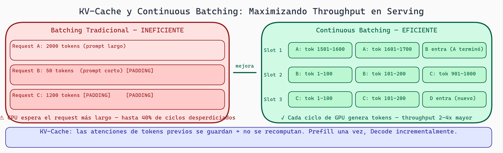

# Lectura 7: Serving y Optimización

## Introducción

Generaste un modelo excelente. ¿Ahora qué? Necesitas servir (deploy) millones de tokens por segundo a usuarios reales. Un modelo de 7B parámetros tarda 2 segundos por token en GPU estándar. Con millones de usuarios, esto es insostenible.

Esta lectura trata sobre **optimización de inference**: cómo servir LLMs rápidamente y a bajo costo.

---

## Parte 1: El Cuello de Botella - KV-Cache

### El Problema

```
Generación autoregresiva:
Paso 1: Entrada "¿Hola?" → Genera "Hola"
  Computa: atención sobre 1 token (entrada) + 1 token (salida)

Paso 2: Entrada "¿Hola? Hola" → Genera ","
  Computa: atención sobre 2 tokens (entrada) + 2 tokens (salida)
  ← Repite cómputo del token 1 INNECESARIAMENTE

Paso 3: Entrada "¿Hola? Hola," → Genera "¿"
  Computa: atención sobre 3 tokens (entrada) + 3 tokens (salida)
  ← Repite cómputación de tokens 1, 2 INNECESARIAMENTE
```

**Problema:** Conforme generas más tokens, recomputa la atención sobre tokens previos (cada paso tarda más).

### La Solución: KV-Cache

En lugar de recomputar, **almacena** Keys y Values de pasos anteriores:

```
Paso 1: Genera "Hola"
  Computa atención, almacena KV del token 1
  KV-Cache = {token_1: (K_1, V_1)}

Paso 2: Genera ","
  NO recomputa token 1
  Usa KV-Cache para token 1
  Computa atención solo para token 2
  KV-Cache = {token_1: (K_1, V_1), token_2: (K_2, V_2)}

Paso 3: Genera "¿"
  Usa KV-Cache para tokens 1, 2
  Computa atención solo para token 3
  KV-Cache = {..., token_3: (K_3, V_3)}
```

**Efecto:** Cada paso genera 1 token (en lugar de N tokens), velocidad casi 10-100x

### Costo de KV-Cache

```
Para un modelo de 7B con depth=32 (32 capas):
Cada token tiene: Keys + Values
Tamaño por token ≈ 32 capas * 128 dim * 2 (K y V) * 2 bytes (fp16)
                = ~16 KB por token por secuencia

Para una secuencia de 4096 tokens:
KV-Cache ≈ 4096 * 16 KB = 64 MB

Para 256 secuencias concurrentes:
Total ≈ 256 * 64 MB = 16 GB ← ¡Casi toda la memoria de GPU!
```

**Trade-off:** KV-Cache es **esencial** para velocidad pero consume **mucha memoria**.

---

## Parte 2: Frameworks de Serving

### vLLM

**La mayoría popular para LLMs:**

```
Características:
✓ KV-Cache automático y optimizado
✓ Paged Attention: asigna memoria dinámicamente (como paginación en SO)
✓ Continuous Batching: acepta nuevas solicitudes mientras genera
✓ Multitarea: múltiples usuarios simultáneamente

Ejemplo:
from vllm import LLM

llm = LLM("meta-llama/Llama-2-7b")
outputs = llm.generate(
    ["Hola", "¿Cómo estás?"],
    max_tokens=100
)

Rendimiento típico:
- Throughput: 100-500 tokens/segundo (en V100)
- Latencia: 50-200 ms por token
```

### TensorRT-LLM (NVIDIA)

```
Características:
✓ Kernel CUDA optimizados (muy rápido)
✓ Soporte para arquitecturas especiales
✓ Requiere compilación (menos flexible que vLLM)

Ejemplo:
from tensorrt_llm.llm import LLM

llm = LLM("models/llama2-7b-tensorrt")
outputs = llm.generate(
    prompts=["Hola"],
    max_new_tokens=100
)

Rendimiento típico:
- Throughput: 200-1000 tokens/segundo (depende de GPU)
- Latencia: 30-100 ms por token
```

### SGLang

```
Características:
✓ Constrained decoding integrado
✓ Batching inteligente
✓ Optimizado para cadenas de solicitudes complejas

Ejemplo:
import sglang as sgl

@sgl.function
def generate_json(s):
    s += "Extrae información. Responde en JSON:\n"
    s += sgl.gen(
        "json_output",
        max_tokens=200,
        grammar="json"  # ← Constrained decoding
    )

state = generate_json.run("Información: Juan, 30 años")
```

---



> **KV-Cache y Continuous Batching — El Motor del Serving Eficiente**
>
> El KV-Cache guarda los resultados de atención de tokens ya procesados, evitando recomputarlos en cada nuevo token generado (prefill una vez, decode incrementalmente). El batching tradicional desperdiciaría GPU esperando el request más largo con padding; el continuous batching asigna dinámicamente slots a requests en vuelo — cuando un request termina, el slot se reasigna inmediatamente a uno nuevo. Juntos, estos mecanismos son la razón por la que vLLM y SGLang logran throughputs 10-20x mayores que una implementación naive.

## Parte 3: Continuous Batching

### Batching Tradicional

```
Lote 1:
  Solicitud A: "¿Hola?" (120 tokens)
  Solicitud B: "¿Cómo?" (100 tokens)

Espera a ambas:
  Solicitud A tarda 120 pasos
  Solicitud B tarda 100 pasos
  Tiempo total: max(120, 100) = 120 pasos (limitado por A)

Problema: B termina, pero espera a A.
GPU ociosa mientras B espera (ineficiencia)
```

### Continuous Batching (Dinámico)

```
Paso 1:
  Solicitud A: generar 1 token
  Solicitud B: generar 1 token
  GPU: procesa ambos parallelamente

Paso 2:
  Solicitud A: generar 1 token
  Solicitud B: generar 1 token
  NUEVA solicitud C: generar 1 token ← Se agrega dinámicamente
  GPU: procesa A, B, C

Paso 100:
  Solicitud A: TERMINÓ (120 tokens generados)
  Solicitud B: generar 1 token
  Solicitud C: generar 1 token
  GPU: procesa solo B, C (memoria liberada de A)

Resultado:
  Tiempo total: 120 pasos (igual)
  Pero MUCHO más throughput porque siempre hay trabajo
```

### Impacto en Práctica

```
Sin continuous batching:
  1 usuario: 100 tokens
  Tiempo: 100 pasos * 100ms = 10 segundos

Con continuous batching + 10 usuarios simultáneos:
  10 usuarios: 100 tokens c/u (1000 tokens total)
  Tiempo: ~110 pasos * 100ms = 11 segundos

  Throughput: 1000 tokens / 11 segundos ≈ 90 tokens/s
  Sin CB: 100 tokens / 10 segundos = 10 tokens/s per usuario
```

---

## Parte 4: Speculative Decoding

### La Idea

En cada paso, el modelo genera 1 token. ¿Y si un modelo **más pequeño y rápido** genera k tokens especulativos?

```
Paso 1: Modelo pequeño (rápido) especula 4 tokens
  Entrada: "¿Hola?"
  Salida especulativa: "Hola , ¿ cómo"

Paso 2: Modelo grande (lento) valida
  "¿Hola? Hola , ¿ cómo"
  Computa logits para esos 4 tokens
  Verifica si coinciden con especulación

  Si todos coinciden: ✓ Aceptamos los 4
  Si difieren en posición 3: Aceptamos 2, rechazamos 2

Resultado:
  Generamos múltiples tokens en el tiempo que tardaba 1
```

### Matemáticamente

```
Sin speculative decoding:
  Throughput = 1 token / paso

Con speculative decoding (k=4):
  Throughput ≈ 4 tokens / paso (si aciertos)

Aceleración: ~3-5x típicamente
Requiere: modelo pequeño auxiliar (overhead)
```

### Compatibilidad con Constrained Decoding

```
Problema: Speculative decoding especula libremente.
Constrained decoding restringe logits.

Solución:
1. Modelo pequeño respeta restricciones (genera especulativos válidos)
2. Modelo grande valida (considera restricciones)
3. Ventaja: especulación es válida, aceptación de de es más probable
```

---

## Parte 5: Cuantización - Comprimiendo Pesos

### El Problema

Modelo Llama 2 7B con float32:
```
7 * 10^9 parámetros * 4 bytes = 28 GB
Imposible en GPU consumer (típicamente 24 GB)
```

### Soluciones de Cuantización

#### INT8

```
Original (float32): valor = 0.0234567
Cuantizado (INT8): valor ≈ 6 (entero entre -128 y 127)

Proceso:
  1. Escala: max_val = max(|valores|)
  2. Quantize: int8_val = round(float_val / max_val * 127)
  3. Dequantize: float_val = int8_val / 127 * max_val

Tamaño: 7B * 1 byte = 7 GB ✓ (cabe en GPU)
Pérdida de precisión: ~2-3% en calidad
```

#### INT4

```
Similar a INT8 pero con 4 bits (16 valores posibles)
Tamaño: 7B * 0.5 bytes = 3.5 GB
Pérdida de precisión: ~5-7% en calidad
Más rápido que INT8 (menos memoria bandwidth)
```

#### Métodos Avanzados: GPTQ y AWQ

```
GPTQ (Gradient-based Post-Training Quantization):
  - Cuantiza por grupo de pesos
  - Usa información de Hessian para ubicación óptima
  - Pérdida de precisión: <1% en muchos casos
  - Compilación lenta, inference rápida

AWQ (Activation-aware Quantization):
  - Observa qué weights son más "activos"
  - Protege weights importantes
  - Pérdida de precisión: ~1-2%
  - Mejor que GPTQ en algunos casos
```

### Trade-off Cuantización

```
float32:
  Tamaño: 28 GB
  Velocidad: 100 tokens/s
  Calidad: Excelente

INT8:
  Tamaño: 7 GB
  Velocidad: 90 tokens/s (5-10% overhead de dequantización)
  Calidad: Excelente (~1% degradación)

INT4 (AWQ):
  Tamaño: 3.5 GB
  Velocidad: 80 tokens/s
  Calidad: Muy buena (~2% degradación)
```

---

## Parte 6: Elección de Hardware

### GPU para Serving

```
RECOMENDACIONES POR CARGA:

Baja carga (< 10 req/s):
  ✓ RTX 4090 (24 GB): Cabe Llama 7B sin cuantización
  Costo: $1500 (una vez)
  Throughput: 100 tokens/s

Media carga (10-50 req/s):
  ✓ V100 (32 GB): Llama 13B sin cuantización
  ✓ 4x RTX 4090: Distribución de carga
  Costo: $10K-20K
  Throughput: 200-400 tokens/s

Alta carga (50+ req/s):
  ✓ A100 (80 GB): Llama 70B + KV-Cache
  ✓ Datacenter con varias GPUs
  Costo: $100K+
  Throughput: 1000+ tokens/s
```

### CPU vs GPU

```
CPU (Intel Xeon):
  Pro: Muchos núcleos (64+)
  Con: Lento para operaciones matriciales
  Uso: Solo si no puedes pagar GPU
  Velocidad: 1-5 tokens/s por proceso

GPU:
  Pro: Miles de núcleos CUDA optimizados para matrices
  Con: Costoso
  Velocidad: 50-500 tokens/s
```

---

## Parte 7: Pipeline Completo de Serving

```
Cliente HTTP
    ↓
[Servidor vLLM/TensorRT-LLM]
    ├─→ Request 1: "¿Hola?"
    ├─→ Request 2: "¿Cómo?"
    └─→ Request 3: "¿Qué hay?"
    ↓
[Continuous Batching]
    Paso 1: Procesa 1 token de cada request
    Paso 2: Procesa 1 token de cada request
    ...
    ↓
[GPU con Modelo Cuantizado (INT4)]
    KV-Cache: 16 GB (cabe)
    Pesos: 3.5 GB (cabe)
    Total: 19.5 GB (cabe en V100)
    ↓
[Speculative Decoding Auxiliar]
    Modelo 1.5B especula 4 tokens
    Modelo 70B valida
    ↓
[Respuestas Generadas]
    Request 1: "Hola, ¿cómo estás?" → 50 tokens
    Request 2: "Estoy bien, gracias" → 40 tokens
    Request 3: "Todo está funcionando" → 45 tokens
    ↓
[Retorna a Cliente]
    Throughput: ~135 tokens / ~2 segundos = 67.5 tokens/s
```

---

## Reflexión y Ejercicios

### Preguntas para Reflexionar:

1. **KV-Cache:** ¿Por qué es tan importante? ¿Qué pasaría sin él?

2. **Continuous Batching:** ¿Cómo afecta si las solicitudes tienen longitudes muy diferentes (1 solicitud de 1000 tokens, 10 solicitudes de 10 tokens)?

3. **Speculative Decoding + Constrained:** ¿Cómo interactúan? ¿Beneficio neto?

### Ejercicios Prácticos:

1. **Cálculo de KV-Cache:**
   ```
   Modelo: 70B parámetros, 80 capas
   Dim oculta: 8192
   Usuarios: 10 concurrentes, promedio 2000 tokens/usuario

   Calcula tamaño total de KV-Cache en GB
   (Asume 2 bytes por parámetro - float16)
   ```

2. **Throughput Analysis:**
   ```
   Escenario 1: Sin continuous batching, 1 usuario
     - Genera 100 tokens en 10 segundos
     - Throughput: 10 tokens/s

   Escenario 2: Con continuous batching, 20 usuarios
     - Todos generan 100 tokens
     - Total 2000 tokens en 12 segundos
     - Throughput: ? tokens/s

   Calcula mejora de throughput
   ```

3. **Cuantización: Trade-off:**
   ```
   Modelo: Llama 13B

   float32:  52 GB modelo, 100 tokens/s
   INT8:     13 GB modelo, 90 tokens/s
   INT4:     6.5 GB modelo, 70 tokens/s

   Si tu GPU tiene 24 GB:
   - ¿Qué configuración puedes usar?
   - ¿Cuál elegirías y por qué?
   ```

4. **Reflexión escrita (350 palabras):** "Los sistemas de producción usan múltiples técnicas simultáneamente: KV-Cache, continuous batching, cuantización, speculative decoding. ¿En qué orden las implementarías si tuvieras que priorizar? ¿Por qué?"

---

## Puntos Clave

- **KV-Cache:** Almacena Keys/Values previos; 10-100x más rápido pero consume mucha memoria
- **vLLM:** Framework popular con paged attention y continuous batching
- **Continuous Batching:** Acepta solicitudes nuevas mientras genera; mejora throughput
- **Speculative Decoding:** Modelo pequeño especula, modelo grande valida; 3-5x más rápido
- **Cuantización INT8/INT4:** Reduce tamaño modelo de 28 GB a 3.5 GB; <2% pérdida de calidad
- **Hardware:** GPU esencial (100x+ más rápido que CPU)
- **Pipeline integrado:** Combina todas las técnicas para máxima velocidad

