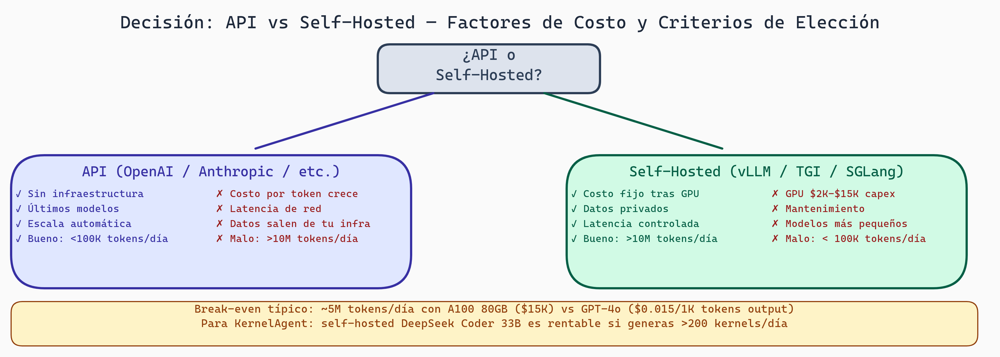

# Lectura 8: Token Economics

## Introducción

¿Cuánto cuesta generar un texto? Si usas OpenAI API, pagas por tokens. Si ejecutas modelos localmente, pagas por electricidad y hardware. Entender la economía de tokens es crítico para:

- Elegir si usar API vs auto-hosting
- Optimizar costos en producción
- Diseñar aplicaciones escalables
- Evaluar viabilidad económica de proyectos IA

---

## Parte 1: Precios de API

### OpenAI Pricing (Enero 2024)

```
GPT-4 Turbo:
  Input:  $0.01 / 1K tokens
  Output: $0.03 / 1K tokens

GPT-3.5 Turbo:
  Input:  $0.0005 / 1K tokens
  Output: $0.0015 / 1K tokens

Claude 2 (Anthropic):
  Input:  $0.008 / 1K tokens
  Output: $0.024 / 1K tokens
```

### Ejemplo de Costo

```
Tarea: Resumir 100 artículos de 2000 palabras cada uno

Input tokens:
  100 artículos * 2000 palabras
  ≈ 100 * 2000 * 1.3 (factor conversión palabra→token)
  = 260,000 tokens
  Costo: 260,000 / 1000 * $0.0005 = $0.13

Output tokens:
  100 resúmenes de ~200 palabras c/u
  ≈ 100 * 200 * 1.3 = 26,000 tokens
  Costo: 26,000 / 1000 * $0.0015 = $0.039

Costo total: $0.169 (muy barato)
```

---

## Parte 2: Costos de Auto-Hosting

### Hardware

```
Opción 1: RTX 4090 (24 GB)
  Costo inicial: $1,500
  Potencia: 450W
  Costo electricidad: $0.12/kWh (USA), ~$30/mes en uso continuo
  Vida útil: 3-5 años
  Costo amortizado: $1,500 / 48 meses = $31/mes + $30 electricidad = $61/mes

Opción 2: A100 (80 GB)
  Costo inicial: $9,000 + DC cooling/power
  Potencia: 250W
  Costo total amortizado: $300-400/mes

Opción 3: Cloud GPU (AWS p3.2xlarge)
  Costo: $3.06/hora = $0.051/minuto
  Uso intensivo (8 horas/día): $24.48/día = $735/mes
```

### Throughput

```
Llama 2 7B en RTX 4090:
  Throughput: ~50 tokens/segundo

Si usas 8 horas al día generando:
  8 horas * 3600 segundos * 50 tokens/s
  = 1,440,000 tokens/día
  = 43,200,000 tokens/mes

Costo por token: $61/mes / 43,200,000 tokens
                = $0.0000014 / token (input + output)
```

### Comparación: API vs Self-Hosted

```
Caso: Aplicación que genera 1,000,000 tokens/mes

Opción 1: OpenAI GPT-3.5 API
  Promedio 0.0005 (input) + 0.0015 (output) = $0.002 / token
  Costo: 1,000,000 * $0.002 = $2,000/mes

Opción 2: Self-hosted RTX 4090 (Llama 2 7B)
  Costo amortizado: $61/mes
  Costo: $61/mes

Opción 3: Self-hosted A100
  Costo amortizado: $300/mes
  Costo: $300/mes
```

**Conclusión:** Self-hosted es 33x más barato si tienes suficiente throughput.

### Punto de Equilibrio

```
Costo mensual API: $0.002 * N tokens
Costo mensual RTX 4090: $61

Punto de equilibrio:
  $0.002 * N = $61
  N = 30,500,000 tokens/mes

Si necesitas > 30M tokens/mes, self-hosted es más barato.
```

---

## Parte 3: Contexto Largo y Costo

### Tamaño de Contexto

```
Versión      Contexto    Costo/M tokens (entrada)
GPT-3.5      4K          $0.5 (normal)
GPT-4        8K          $3 (normal)
             32K         $6 (2x)
             128K        $3 (con descuento)  ← Nuevo
Claude 2     100K        $2.3
Llama 2      4K          $0 (self-hosted)
             + context extension: puedes forzar más, pero menos eficiente
```

### Ejemplo: Análisis de Documento Largo

```
Documento: 50,000 palabras = 65,000 tokens

Opción 1: GPT-3.5 + 4K contexto
  - Divide en chunks, procesa independientemente
  - Múltiples solicitudes
  - No hay contexto entre chunks

Opción 2: Claude 2 + 100K contexto
  - Una solicitud, todo el documento
  - Contexto completo
  - Costo: 65,000 tokens * $2.3 = $0.15

Costo Opción 2 << Costo Opción 1 si necesitas contexto
```

---

## Parte 4: Prompts Largos - Compression

### Problema

```
Patrón común:
1. Sistema prompt: 500 tokens
2. Ejemplos (few-shot): 2000 tokens
3. Documento usuario: 1000 tokens
4. Pregunta: 50 tokens

Total: 3550 tokens

Si generas 100 respuestas/día:
  3550 * 100 = 355,000 input tokens/día
  Solo prompts, sin respuestas
```

### Prompt Compression

#### Opción 1: Resumir Ejemplos

```
Antes (few-shot original):
  "Usuario: ¿Cuál es la capital de Francia?
   Asistente: París
   Usuario: ¿Cuál es la capital de España?
   Asistente: Madrid
   ..."
  = 50 ejemplos, 2000 tokens

Después (resumido):
  "Ejemplos previos: respuestas a preguntas geográficas"
  = 10 tokens

Pero: ¿Pierde la especificidad?
Riesgo: modelo menos preciso con prompt comprimido
```

#### Opción 2: LLM-based Compression

```
Tool: LLMCompress (comprime prompts sin perder significado)

Entrada:
  "El usuario pregunta sobre ciudades.
   Se han mostrado 50 ejemplos de ciudades españolas e internacionales.
   El usuario pregunta por la capital de Italia."

Salida comprimida:
  "Q: Italia?
   A: Roma"
  (De miles de tokens a cientos)
```

#### Opción 3: Smart Caching

```
Arquitectura:
  Sistema prompt (500 tok) → CACHE
  + Ejemplos (2000 tok) → CACHE
  + Documento usuario (1000 tok) → NUEVO
  + Pregunta (50 tok) → NUEVO

Solo pagas por lo nuevo:
  1000 + 50 = 1050 tokens (en lugar de 3550)

OpenAI soporta esto con "prompt_cache_control"
```

---

## Parte 5: Análisis de Costo por Tarea

### Ejemplo 1: Chatbot de Servicio al Cliente

```
Estadísticas:
  - 1000 usuarios/día
  - Promedio 5 mensajes/usuario
  - 5000 mensajes/día

Análisis de tokens:
  Sistema prompt: 300 tokens (instrucciones)
  Historial chat: 500 tokens (promedio)
  Mensaje usuario: 50 tokens
  Total entrada: 850 tokens

  Respuesta: 100 tokens (corta)

Costo por mensaje:
  Entrada: 850 * $0.0005 / 1000 = $0.0004
  Salida: 100 * $0.0015 / 1000 = $0.00015
  Total: $0.00055

Costo diario: 5000 * $0.00055 = $2.75
Costo mensual: $82.50

Viabilidad: SÍ (muy barato, puede ser gratis con publicidad)
```

### Ejemplo 2: Análisis de Documentos Empresariales

```
Estadísticas:
  - 100 documentos/mes
  - Documentos grandes (10,000 palabras c/u)
  - Análisis profundo (extraer insights, generar resumen largo)

Análisis de tokens:
  Documento: 10,000 palabras = 13,000 tokens
  Sistema prompt: 500 tokens
  Total entrada: 13,500 tokens

  Análisis+respuesta: 1000 tokens

Costo por documento:
  Entrada: 13,500 * $0.0005 / 1000 = $0.0068
  Salida: 1000 * $0.0015 / 1000 = $0.0015
  Total: $0.0083

Costo mensual: 100 * $0.0083 = $0.83 (API)

Self-hosted:
  Costo hardware: $61/mes
  Con 100 documentos/mes: $0.61/doc
  Total: $61

Viabilidad con API: SÍ (muy barato)
Viabilidad con self-hosted: SÍ (hardware caro, pero reutilizable)
```

### Ejemplo 3: Generación Masiva (Síntesis de Datos)

```
Estadísticas:
  - Generar 1,000,000 registros de entrenamiento
  - Cada registro: 200 tokens entrada, 100 tokens salida

Total:
  Input: 1,000,000 * 200 = 200,000,000 tokens
  Output: 1,000,000 * 100 = 100,000,000 tokens

Costo con OpenAI GPT-3.5:
  Input: 200M * $0.0005 / 1000 = $100
  Output: 100M * $0.0015 / 1000 = $150
  Total: $250

Costo self-hosted (RTX 4090):
  Hardware: $61/mes
  Tiempo: 300M tokens / 50 tokens/s = 6,000,000 segundos = 70 días
  Entonces: ~3 GPUs, ~$200 amortizado en el mes
  Total: ~$200

Viabilidad: API es competitiva si lo necesitas rápido
Self-hosted si puedes esperar
```

---

## Parte 6: Cuantización y Ahorro

### Impacto de Cuantización en Velocidad/Costo

```
Modelo: Llama 70B

float32 (28 GPU A100):
  Costo hardware: $252K
  Velocidad: 500 tokens/s (distributed)
  Costo/token: $252K / (6 meses * 86400 * 500) ≈ $0.00097

INT8 (7 GPU A100):
  Costo hardware: $63K
  Velocidad: 450 tokens/s
  Costo/token: $63K / (6 meses * 86400 * 450) ≈ $0.00027

INT4 (2 GPU A100):
  Costo hardware: $18K
  Velocidad: 350 tokens/s
  Costo/token: $18K / (6 meses * 86400 * 350) ≈ $0.000025

Pérdida de calidad:
  float32: 0%
  INT8: <1%
  INT4: 2-3%

Recomendación: INT8 es sweet spot
```

---

## Parte 7: Decisión: API vs Self-Hosted

### Matriz de Decisión

```
Criterio                    API              Self-Hosted
─────────────────────────────────────────────────────
Tokens/mes                  < 30M            > 30M
Latencia requerida          < 500ms          flexible
Privacidad datos            No importante    Crítica
Flexibilidad modelo         Necesaria        No importante
Costo capital               No               Sí
Costo operacional           Sí               Bajo
Escalabilidad               Instantánea      Lenta
Control sobre salida        Poco             Completo
Facilidad de uso            Máxima           Mínima
```

### Ejemplo Práctico

```
APLICACIÓN: Servicio de traducción automática
Requisitos:
  - 1M traducciones/mes
  - Latencia < 2 segundos
  - Precisión > 95%
  - Datos sensibles (pueden ser privados)

ANÁLISIS:

Opción 1: API (Google Translate)
  Costo: ~$15/1M caracteres = $3-5/mes
  Latencia: 200-500ms ✓
  Privacidad: Google ve datos ✗
  Control: Ninguno ✗

Opción 2: API (OpenAI GPT-4)
  Costo: $1,000-2,000/mes (caría GPU)
  Latencia: 1-3 segundos (lento para traducción)
  Privacidad: OpenAI ve datos ✗
  Control: Alguno ✓

Opción 3: Self-hosted (Llama 7B cuantizado)
  Costo: $61/mes hardware + $50 electricidad = $111/mes
  Latencia: 500ms-1s ✓
  Privacidad: Completa ✓
  Control: Total ✓

DECISIÓN: Opción 3 (self-hosted) - mejor en casi todo
```

---



> **API vs Self-Hosted — Árbol de Decisión por Costo y Contexto**
>
> Ninguna opción domina en todos los casos. La API es óptima cuando el volumen es bajo (<100K tokens/día), se necesita acceso a los últimos modelos, o el equipo no puede mantener infraestructura. El self-hosting se vuelve rentable a partir de ~5M tokens/día con una GPU A100, y es obligatorio cuando los datos son confidenciales o la latencia de red es inaceptable. Para KernelAgent en producción con generación intensiva, self-hosted con DeepSeek Coder 33B es generalmente la opción más eficiente.

## Reflexión y Ejercicios

### Preguntas para Reflexionar:

1. **Break-even:** ¿A cuántos tokens mensuales cambia el break-even entre diferentes opciones? (Considera hardware de vida útil 3 años, electricidad $0.15/kWh)

2. **Escalabilidad:** Si necesitas 1B tokens/mes, ¿cómo cambiaría tu decisión?

3. **Experiencia del usuario:** Si la latencia es crítica (chatbot), ¿cómo afecta esto la decisión de costo?

### Ejercicios Prácticos:

1. **Cálculo de costo:**
   ```
   Tu aplicación:
   - 500,000 tokens entrada/mes
   - 100,000 tokens salida/mes

   Calcula costo mensual con:
   a) GPT-3.5 API
   b) Claude API
   c) Self-hosted RTX 4090 (amortizado a 3 años)

   ¿Cuál es más barato?
   ¿En cuántos meses se amortiza el hardware?
   ```

2. **Prompt Compression Simulation:**
   ```
   Sistema prompt: 1000 tokens
   Few-shot ejemplos: 5000 tokens
   Usuario input: 500 tokens
   Total: 6500 tokens por solicitud

   Si usas caching:
   - Cache hits: 95% del tiempo
   - Nuevo input por solicitud: 500 tokens

   Costo sin caching: 6500 tokens * $0.002 = $0.013
   Costo con caching: (6500 * 1 + 500 * 99) / 100 = 115 tokens prom = $0.00023

   ¿Ahorro?
   ```

3. **Break-even Analysis:**
   ```
   Hardware A100: $9000 inicial, $200/mes electricidad
   vs
   API a $0.002/token

   Si necesitas N tokens/mes:
   - Amortización hardware: $9000/36 + $200 = $450/mes
   - Costo API: N * $0.002 / 1000

   Break-even: 225M tokens/mes

   ¿Tiene sentido para tu caso de uso?
   ```

4. **Reflexión escrita (350 palabras):** "La economía de tokens sigue cambiando. Modelos se baratizan, hardware baja de precio. ¿Cómo predirías qué será más barato en 2 años? ¿Invertirías en hardware ahora o esperarías?"

---

## Puntos Clave

- **API:** Barata (<30M tokens/mes), fácil de usar, pero privacidad
- **Self-hosted:** Más barata para alto volumen (>30M tokens/mes), total control, pero overhead operacional
- **Break-even:** Típicamente 20-50M tokens/mes dependiendo de hardware y tarifa API
- **Contexto largo:** Crucial para documentos; algunas APIs cobran 2x por 128K vs 4K
- **Prompt caching:** Reduce tokens de entrada; invaluable para aplicaciones repetitivas
- **Cuantización:** INT8/INT4 reduce hardware 75-85%, impacto mínimo en calidad
- **Matriz de decisión:** Combina costo, latencia, privacidad, escalabilidad, control

