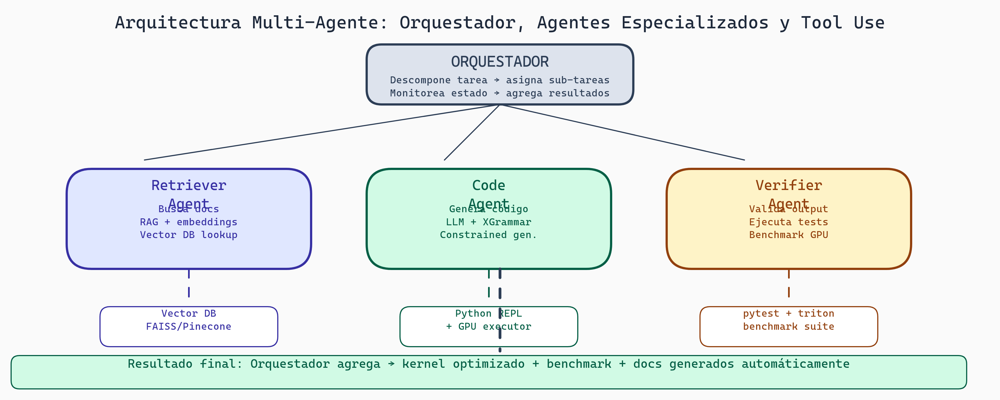

# Lectura 10: Sistemas Agénticos

## Introducción

Un LLM es poderoso, pero limitado: genera texto. Un **sistema agéntico** es una arquitectura donde un LLM actúa como "cerebro", decidiendo qué herramientas usar, cómo planificar, y cómo razonar sobre problemas complejos.

Esta lectura final explora tool use, multi-agent architectures, RAG, reasoning, y el futuro de IA estructurada.

---

## Parte 1: Tool Use / Function Calling

### El Problema Básico

```
Pregunta: "¿Cuál es el precio de Bitcoin hoy?"

LLM (sin herramientas):
  "Bitcoin fluctúa constantemente. Mi conocimiento es hasta Abril 2024..."
  ← No puede responder con información actual

LLM (con herramientas):
  1. Recognizes pregunta requiere información actual
  2. Calls tool: get_bitcoin_price()
  3. Obtiene: $62,000
  4. Responde: "Bitcoin está a $62,000 hoy"
```

### Function Calling Schema

Especificas qué funciones puede usar el LLM:

```json
{
  "name": "get_bitcoin_price",
  "description": "Obtiene el precio actual de Bitcoin",
  "parameters": {
    "type": "object",
    "properties": {}  // Sin parámetros
  }
}

{
  "name": "search_web",
  "description": "Busca en internet",
  "parameters": {
    "type": "object",
    "properties": {
      "query": {
        "type": "string",
        "description": "Lo que buscar"
      }
    },
    "required": ["query"]
  }
}

{
  "name": "send_email",
  "description": "Envía un email",
  "parameters": {
    "type": "object",
    "properties": {
      "to": {"type": "string"},
      "subject": {"type": "string"},
      "body": {"type": "string"}
    },
    "required": ["to", "subject", "body"]
  }
}
```

### Flujo de Ejecución

```
1. Usuario pregunta:
   "Investiga empresas de AI y envía resumen por email"

2. LLM entiende:
   - Necesita search_web para investigar
   - Necesita send_email para enviar resultado

3. Llama tool:
   search_web("empresas AI 2024")
   → Retorna: "OpenAI, Anthropic, Google DeepMind, ..."

4. Llama segunda tool:
   send_email(
     to="usuario@mail.com",
     subject="Resumen empresas AI",
     body="Las principales empresas AI en 2024 son..."
   )

5. Retorna a usuario:
   "Envié el resumen a tu email"
```

### Ventajas

```
✓ Información actual (browsing real-time)
✓ Acciones en sistemas externos (enviar email, actualizar BD)
✓ Cálculos precisos (en lugar de estimar)
✓ Separación clara de responsabilidades
```

---

## Parte 2: ReAct - Reasoning and Acting

**ReAct** = **RE**asoning + **ACT**ing. El LLM no solo actúa, sino que explica su razonamiento:

### Estructura ReAct

```
Thought → Action → Observation → Thought → ...

Ejemplo:
User: "¿Cuánto es 2847 * 1923?"

LLM:
Thought: Necesito calcular 2847 * 1923. Usaré la herramienta de cálculo.
Action: calculator(2847, 1923)
Observation: 5,466,381

Thought: Tengo el resultado, pero déjame verificar si es razonable.
         2847 ≈ 3000, 1923 ≈ 2000, entonces ~6,000,000. Mi respuesta de 5.4M es razonable.
         Puedo responder.

Answer: 2847 * 1923 = 5,466,381
```

### Por Qué Funciona

```
Sin ReAct:
  LLM intenta estimar mentalmente: "2847 * 1923 ≈ 5.5M"
  Problema: La aritmética es débil para LLMs

Con ReAct:
  LLM reconoce que necesita cálculo exacto
  Delega a herramienta especializada
  Verifica razonabilidad del resultado
  Responde con confianza
```

### Implementación

```python
def react_loop():
    history = []
    current_input = user_query

    while True:
        # Obtén thought + action del LLM
        response = llm.generate(
            f"Chat history: {history}\nUser: {current_input}",
            tools=available_tools
        )

        if response.type == "answer":
            return response.content
        elif response.type == "action":
            # Ejecuta la herramienta
            tool_name = response.tool_name
            tool_args = response.tool_args
            observation = execute_tool(tool_name, **tool_args)

            # Agrega a historial
            history.append({
                "thought": response.thought,
                "action": f"{tool_name}({tool_args})",
                "observation": observation
            })

            # Próxima iteración con observación
```

---

## Parte 3: RAG - Retrieval Augmented Generation


***Figura 1:** Pipeline de RAG: Indexación, Recuperación y Generación.*

### El Problema

```
Pregunta: "¿Cuáles son los términos de servicio de mi empresa?"

LLM puro:
  No tiene información sobre tu empresa
  Responde genéricamente (inútil)

RAG (Retrieval Augmented Generation):
  1. Busca en tu base de datos de documentos
  2. Recupera términos de servicio relevantes
  3. Incluye en contexto del LLM
  4. LLM responde basado en documento actual
```

### Arquitectura RAG

```
                  ┌─────────────────────────┐
                  │  Base de Documentos     │
                  │ (ToS, manuales, datos)  │
                  └───────────┬─────────────┘
                              │
                              ▼
                        [Embeddings]
                    (Vectorización de documentos)
                              │
                              ▼
                        [Vector Store]
                    (Búsqueda semántica rápida)

User Query: "¿Términos de servicio?"
    │
    ▼
[Embedding Query]
    │
    ▼
[Búsqueda Vectorial] → Recupera top 3 documentos similares
    │
    ▼
[Augment Prompt]
    System: "Eres asistente de ToS"
    Context: [documentos recuperados]
    Question: "¿Términos de servicio?"
    │
    ▼
[LLM genera respuesta]
    basada en contexto actual, no alucinaciones
```

### Ventajas vs Desventajas

```
Ventajas:
  ✓ Información actual sin reentrenamiento
  ✓ Reduce alucinaciones (contextualizado)
  ✓ Citable (puedes señalar de dónde vino la respuesta)

Desventajas:
  ✗ Relevancia de retrieval es crítica (garbage in = garbage out)
  ✗ Overhead computacional (embedding + búsqueda)
  ✗ Requiere mantener base de documentos actualizada
```

---

## Parte 4: Multi-Agent Systems

Más allá de un agente, ¿qué pasa con múltiples agentes que colaboran?

### Arquitecturas Multi-Agent

#### Tipo 1: Especialistas Colaborativos

```
User: "Analiza este reporte de ventas y genera predicción"

Agente Análisis:
  - Experto en estadística
  - Procesa datos históricos
  - Genera trends

         ↓ (pasa análisis)

Agente Predicción:
  - Experto en ML
  - Usa análisis anterior
  - Genera forecast

         ↓ (pasa predicción)

Agente Presentación:
  - Experto en comunicación
  - Formatea resultado
  - Retorna a usuario
```

#### Tipo 2: Crítica y Mejora Iterativa

```
Agente Propuesta:
  Genera primera versión de solución

         ↓

Agente Crítica:
  Evalúa, señala problemas

         ↓

Agente Propuesta (v2):
  Itera basado en crítica

         ↓ (repite hasta bueno)

Usuario obtiene solución mejorada
```

#### Tipo 3: Competencia y Votación

```
3 Agentes generan soluciones diferentes

Agente 1: Propuesta A
Agente 2: Propuesta B
Agente 3: Propuesta C

Agente Evaluador:
  Compara las 3 propuestas
  Elige la mejor
  O combina lo mejor de cada una
```

### Ejemplo Práctico: Sistema de Análisis de Datos

```python
class AnalysisSystem:
    def __init__(self):
        self.data_agent = Agent("data_specialist")
        self.analysis_agent = Agent("analysis_specialist")
        self.report_agent = Agent("report_specialist")

    def analyze_dataset(self, data_file):
        # Agente 1: Explora datos
        exploration = self.data_agent.run(
            f"Explora {data_file}: tipos, distributions, missing values"
        )
        print(f"Exploración: {exploration}")

        # Agente 2: Analiza
        analysis = self.analysis_agent.run(
            f"Dados estos datos:\n{exploration}\n" +
            "Calcula correlaciones, trends, anomalías"
        )
        print(f"Análisis: {analysis}")

        # Agente 3: Reporta
        report = self.report_agent.run(
            f"Crea un reporte ejecutivo basado en:\n{analysis}"
        )
        return report

system = AnalysisSystem()
print(system.analyze_dataset("sales_2024.csv"))
```

---



> **Multi-Agent Architecture — Orquestación y Especialización**
>
> En lugar de un solo LLM que hace todo, la arquitectura multi-agente delega a especialistas: el Retriever Agent busca documentación relevante en la vector DB, el Code Agent genera el kernel usando XGrammar para output estructurado, y el Verifier Agent ejecuta y benchmarkea el código en GPU real. El Orquestador descompone la tarea, asigna sub-tareas a cada agente, y agrega los resultados. Esto permite que cada agente use el modelo óptimo para su función, reduciendo costo total y aumentando calidad.

## Parte 5: Planning y Reasoning Avanzado

Más allá de ReAct, cómo pueden los agentes planificar tareas complejas:

### Chain-of-Thought Extendido

```
Pregunta: "Planifica mi viaje a Francia por 1 semana"

LLM:

**Breakdown:**
1. Decidir fechas (7 días)
2. Reservar vuelo
3. Reservar hotel
4. Planificar itinerario (museos, restaurantes)
5. Preparar documentos (pasaporte, dinero)

**Subproblemas:**
1.1 ¿Cuándo viajas? (necesito fecha del usuario)
1.2 ¿Cuál es tu presupuesto?
1.3 ¿Qué te interesa? (arte, comida, naturaleza)

**Acciones inmediatas:**
- Pregunta al usuario sobre preferencias

**Acciones después:**
- Busca vuelos
- Busca hoteles
- Genera itinerario

...

Ejecuta este plan paso a paso
```

### Programación Neuro-Simbólica

Combina LLMs (flexible) con lógica simbólica (rigurosa):

```
LLM decide: "Este email debe archivarse"
Sistema simbólico verifica: "¿Regla de negocio autoriza archivar?"
Si no: Retorna al LLM: "No puedo, violaria política X"
LLM propone: "¿Lo marco como spam entonces?"
Sistema simbólico verifica: OK
Ejecuta acción
```

---

## Parte 6: Futura de IA Estructurada

### El Horizonte

```
Hoy (2024):
  - LLMs generan texto
  - Tool use es manual (requiere definir funciones)
  - Razonamiento es implícito (emergente)

Próximo (2025-2026):
  - LLMs descubren herramientas automáticamente
  - Razonamiento es explícito (trazable)
  - Multi-agent es estándar

Futuro (2027+):
  - IA que puede verificar su propio razonamiento
  - Auto-improvement (mejora sin feedback humano)
  - Razonamiento causal (no solo correlación)
```

### Tendencias

```
1. Compositionality
   Armar sistemas complejos de piezas simples y verificables

2. Transparency
   Entender cómo razona la IA (explicabilidad)

3. Robustness
   Sistemas que no fallan cuando están fuera de distribución

4. Efficiency
   Hacer más con menos parámetros

5. Interactivity
   Humanos y IA colaborando, no sustituyendo
```

---

## Parte 7: Ejemplo Completo: Asistente de Investigación

```python
class ResearchAssistant:
    """Agente que investiga preguntas complejas"""

    def __init__(self):
        self.tools = {
            "search_web": search_web,
            "fetch_paper": fetch_academic_paper,
            "summarize": summarize_text,
            "calculate": calculate
        }

    def research(self, query):
        """Investiga una pregunta"""

        # Fase 1: Planning (ReAct)
        plan = self.llm.generate(f"""
            Pregunta: {query}

            Tareas a realizar (ordena por importancia):
            1. ...
            2. ...
        """)

        # Fase 2: Ejecución (Multi-step)
        results = []
        for task in plan.tasks:
            result = self.execute_task(task)
            results.append(result)

        # Fase 3: Síntesis (RAG)
        context = "\n".join(results)
        final_answer = self.llm.generate(f"""
            Basándote en esta investigación:
            {context}

            Responde la pregunta original: {query}
            Include fuentes.
        """)

        return final_answer

    def execute_task(self, task):
        """Ejecuta una tarea individual"""
        # Determina qué herramientas necesita
        tools_needed = self.llm.generate(f"""
            Tarea: {task}
            Herramientas disponibles: {list(self.tools.keys())}

            ¿Cuáles necesitas?
        """)

        # Ejecuta herramientas
        results = []
        for tool in tools_needed:
            result = self.tools[tool](task)
            results.append(result)

        return "\n".join(results)

# Uso
assistant = ResearchAssistant()
answer = assistant.research("¿Cuáles son los avances recientes en fusion nuclear?")
print(answer)
```

---

## Reflexión y Ejercicios

### Preguntas para Reflexionar:

1. **Tool Use vs Fine-Tuning:** ¿Cuándo es mejor enseñar a un LLM con fine-tuning vs darle acceso a herramientas?

2. **RAG vs Knowledge Update:** ¿Por qué RAG es mejor que reentrenar el modelo cada semana?

3. **Multi-Agent:** ¿Cuándo agregar un segundo agente mejora el sistema vs solo agrega complejidad?

### Ejercicios Prácticos:

1. **Diseña función calling:**
   ```
   Aplicación: Asistente bancario que ayuda a transferencias

   Define 5 funciones con schemas JSON:
   1. get_account_balance
   2. transfer_funds
   3. check_transaction_history
   4. ...

   Para cada función, especifica:
   - Descripción
   - Parámetros con tipos
   - Restricciones de seguridad
   ```

2. **RAG Pipeline:**
   ```
   Tienes 100 documentos técnicos (PDFs).
   Diseña pipeline:
   1. Cómo extraes texto de PDFs?
   2. Cómo generas embeddings?
   3. Qué vector store usas?
   4. Cómo evalúas calidad de retrieval?
   ```

3. **Multi-Agent Collaboration:**
   ```
   Tarea: "Analiza rentabilidad de proyecto de energía solar"

   Define 3 agentes especializados:
   1. Agente técnico
   2. Agente financiero
   3. Agente ambiental

   Para cada uno, describe:
   - Expertise específica
   - Herramientas que usa
   - Cómo colaboran con otros agentes
   ```

4. **Reflexión escrita (400 palabras):** "El futuro será sistemas agénticos con múltiples LLMs especializados colaborando. ¿Cómo cambiaría esto la forma en que desarrolladores construyen aplicaciones? ¿Qué nuevos desafíos surgirían?"

---

## Puntos Clave

- **Tool Use:** LLM decide qué herramientas usar; acceso a información actual y acciones externas
- **ReAct:** Razonamiento explícito (Thought) + Acción + Observación
- **RAG:** Recupera documentos relevantes antes de generar; reduce alucinaciones
- **Multi-Agent:** Múltiples agentes especializados colaboran para resolver problemas complejos
- **Planning:** LLM descompone tareas complejas en subtareas manejables
- **Compositionality:** Sistemas complejos de piezas simples y verificables
- **Futuro:** IA transparente, robusta, eficiente; colaboración humano-IA

---

## Conclusión de la Serie

En estas 10 lecturas, viajamos desde los fundamentos de IA clásica hasta sistemas agénticos modernos:

1. Paradigmas históricos y teóricos
2. Matemáticas de redes neuronales
3. Arquitectura Transformer
4. Generación autoregresiva
5. Muestreo y restricciones
6. LLMs para código
7. Infraestructura de serving
8. Economía y costos
9. Mejora y evaluación
10. Sistemas agénticos

El futuro de IA no es un modelo más grande, sino **sistemas más inteligentes**: razonamiento transparente, herramientas integradas, colaboración entre agentes y humanos.

Tu rol como ingeniero es entender estos componentes, elegir las herramientas correctas, y construir sistemas que sean efectivos, eficientes y confiables.

Adelante.

