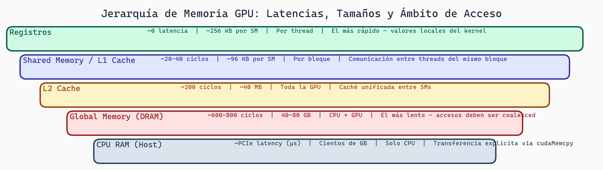

# GPU Fundamentals: Arquitectura y Paralelismo Masivo

> **Módulo:** Project 2 - GPU Computing & Kernel Optimization
> **Semana:** 1
> **Tiempo de lectura:** ~35 minutos

---

## Introducción

¿Por qué los videojuegos necesitan una GPU dedicada? ¿Por qué entrenar un modelo de deep learning es órdenes de magnitud más rápido en GPU? La respuesta está en arquitecturas fundamentalmente diferentes diseñadas para resolver problemas distintos.

Antes de optimizar código para GPU, necesitas entender **por qué** las GPUs son tan poderosas para ciertos tipos de cómputo y **cómo** su arquitectura dicta las estrategias de optimización. Sin este conocimiento, estarías optimizando a ciegas.

---

## Objetivos de Aprendizaje

Al finalizar esta lectura, serás capaz de:

1. Explicar las diferencias fundamentales entre CPUs y GPUs
2. Describir el modelo de ejecución SIMT y la jerarquía Grid→Blocks→Threads→Warps
3. Comprender la jerarquía de memoria GPU y sus implicaciones para performance
4. Identificar cuándo usar GPU vs CPU para un problema dado
5. Justificar por qué la optimización de kernels importa económica y energéticamente

---

## La Filosofía Fundamental: CPU vs GPU

### CPUs: Pocos Trabajadores Muy Inteligentes

Los procesadores tradicionales están optimizados para **ejecutar tareas complejas y secuenciales rápidamente**. Imagina una CPU como un chef experto en una cocina pequeña:

- **Pocos cores** (8-64 típicamente)
- **Cores muy potentes** con predicción de branches, ejecución fuera de orden
- **Caches grandes** para minimizar latencia de memoria
- **Clock alto** (3-5 GHz)
- **Latencia baja**: Optimizado para responder rápidamente a una tarea individual

Las CPUs están diseñadas para ejecutar **una tarea muy rápido**.

### GPUs: Miles de Trabajadores Simples

Las GPUs son máquinas de **paralelismo masivo**. Imagina una GPU como una fábrica con miles de empleados haciendo la misma tarea repetitiva:

- **Miles de cores** (10,000+ en GPUs de datacenter)
- **Cores simples** sin predicción de branches sofisticada
- **Caches pequeños** pero **ancho de banda masivo**
- **Clock moderado** (1-2 GHz)
- **Latencia alta, throughput gigantesco**: Lento para una tarea individual, pero procesa muchísimas en paralelo

Las GPUs están diseñadas para ejecutar **muchas tareas en paralelo**.

```
CPU: Como un profesor experto que resuelve problemas complejos uno a uno
GPU: Como mil estudiantes que resuelven problemas simples simultáneamente
```

> 💡 **Concepto clave:** La GPU sacrifica eficiencia en tareas individuales para maximizar el throughput total. Para deep learning, donde tenemos millones de operaciones independientes, esto es exactamente lo que necesitamos.

---

## El Modelo SIMT (Single Instruction, Multiple Threads)

Este es el secreto de las GPUs: **SIMT** (Single Instruction, Multiple Threads). Es similar a SIMD pero con más flexibilidad.

```
Código GPU:
int result = threadData[threadId] * 2;

Con 4 threads:
Thread 0: threadData[0] * 2
Thread 1: threadData[1] * 2
Thread 2: threadData[2] * 2
Thread 3: threadData[3] * 2
```

Todos los threads ejecutan **exactamente el mismo código**, pero con **datos diferentes**. Esto es masivamente más eficiente que tener que especificar el mismo código 10,000 veces.

### ¿Por qué es esto tan poderoso?

1. **Simplicidad lógica**: El hardware es más simple si todos hacen lo mismo
2. **Escalabilidad**: Podemos agregar más cores sin cambiar el código
3. **Ancho de banda**: Con miles de threads, podemos mantener la memoria constantemente ocupada

---

## Jerarquía de Ejecución: Grids, Blocks, Threads, Warps

Las GPUs organizan el paralelismo en una jerarquía clara:

```
Grid (todo el kernel)
  └── Blocks (grupos de threads)
        └── Threads (unidades de ejecución)
              └── Warps (32 threads ejecutando la misma instrucción)
```

### Grid

El **Grid** representa todo el trabajo a realizar. Cuando lanzas un kernel, especificas el tamaño del grid.

```
GRID (Todo tu trabajo)
├─ Block 0 (256 threads)
│  ├─ Thread 0
│  ├─ Thread 1
│  └─ ... (256 threads total)
├─ Block 1 (256 threads)
│  ├─ Thread 0
│  └─ ...
└─ Block N
   └─ ...
```

### Blocks

Los **Blocks** son grupos de threads que:
- Pueden comunicarse entre sí via shared memory
- Se sincronizan con `__syncthreads()`
- Se ejecutan en un solo Streaming Multiprocessor (SM)
- Típicamente 128-512 threads por bloque

### Threads

Cada **Thread** es una unidad de ejecución que:
- Tiene su propio program counter
- Tiene acceso a registros privados
- Ejecuta el mismo código pero con diferentes datos
- Se identifica con `threadIdx` y `blockIdx`

### Warps: La Unidad Crítica

Un **Warp** es un grupo de **32 threads** que:
- Ejecutan **exactamente la misma instrucción** al mismo tiempo
- Son la unidad fundamental de scheduling en la GPU

```python
# Si tienes un if/else en tu código:
if condition:
    # Todos los threads del warp donde condition=True ejecutan esto
    do_something()
else:
    # Threads donde condition=False esperan, luego ejecutan esto
    do_other()
# Esto se llama "warp divergence" y es costoso!
```

### Divergencia de Warp: El Enemigo del Performance

```cuda
// Divergencia de warp (¡MAL!)
if (threadIdx.x % 2 == 0) {
    // 16 threads ejecutan esto
    resultado = sumaCompleja();
} else {
    // 16 threads ESPERAN
    resultado = multiplicacionSimple();
}
// Los 16 threads que terminaron rápido ESPERAN a los otros
```

> 💡 **Concepto clave:** La divergencia de warps (threads del mismo warp tomando diferentes branches) mata el performance. Diseña tu código para que threads del mismo warp tomen el mismo camino.

**Ejemplo numérico de warps:** Bloque de 256 threads = 8 warps (256/32). Con 100 bloques y GPU de 80 SMs ejecutando 4 warps simultáneos: 800 warps totales ejecutan en 3 waves (ceil(800/320)).

### Distribución de Bloques en SMs

Si tu GPU tiene 80 SMs y lanzas 1000 bloques:

```
Ejecución dinámica de bloques:
┌────────────┬────────────┬────────────┐
│  SM 0      │  SM 1      │  SM 2      │
├────────────┼────────────┼────────────┤
│ Block 0    │ Block 1    │ Block 2    │
├────────────┼────────────┼────────────┤
│ Block 80   │ Block 81   │ Block 82   │
├────────────┼────────────┼────────────┤
│ ...        │ ...        │ ...        │
└────────────┴────────────┴────────────┘

Los bloques se lanzan dinámicamente a los SMs disponibles
```

---

## Jerarquía de Memoria GPU

Si bien las GPUs tienen miles de cores, su verdadero superpoder es el **ancho de banda de memoria**.

### Tipos de Memoria

| Tipo | Tamaño | Latencia | Scope | Uso |
|------|--------|----------|-------|-----|
| **Registers** | ~256KB/SM | 0 cycles | Thread | Variables locales |
| **Shared Memory** | ~48-100KB/SM | ~20 cycles | Block | Comunicación entre threads |
| **L1 Cache** | ~128KB/SM | ~30 cycles | SM | Cache automático |
| **L2 Cache** | ~1-40MB | ~200 cycles | GPU | Cache global |
| **Global Memory** | 16-80GB | ~400 cycles | GPU | Datos principales |

### Visualización de la Jerarquía

```
┌─────────────────────────────────────────────────────┐
│                   GPU MEMORY HIERARCHY              │
├─────────────────────────────────────────────────────┤
│ Registros (Registers)                               │
│ ├─ Privado de cada thread                           │
│ ├─ Más rápido (0 ciclos de latencia)                │
│ └─ Muy limitado (~256 bytes por thread)             │
├─────────────────────────────────────────────────────┤
│ Shared Memory (Memoria Compartida)                  │
│ ├─ Compartida entre threads del mismo bloque        │
│ ├─ ~48-96 KB por bloque                             │
│ ├─ Mucho más rápido que memoria global              │
│ └─ Requiere sincronización                          │
├─────────────────────────────────────────────────────┤
│ L1/L2 Cache                                         │
│ ├─ L1: ~128 KB por SM                               │
│ └─ L2: ~1-40 MB global                              │
├─────────────────────────────────────────────────────┤
│ Memoria Global (HBM)                                │
│ ├─ Toda la memoria del dispositivo (16-80 GB)       │
│ ├─ Mucha latencia (cientos de ciclos)               │
│ └─ Ancho de banda gigantesco (2-3 TB/s)             │
└─────────────────────────────────────────────────────┘
```

### Ancho de Banda vs Latencia

| Dispositivo | Latencia | Ancho de Banda |
|-------------|----------|----------------|
| CPU (DDR5) | Baja (~100ns) | ~50 GB/s |
| GPU A100 | Alta (~400 cycles) | ~2 TB/s |
| GPU H100 | Alta (~400 cycles) | ~3.35 TB/s |

¿Cómo compensa una GPU la alta latencia? **Teniendo miles de threads esperando**, mientras otros threads ejecutan trabajo útil. Es como una fábrica donde mientras algunos empleados esperan materiales, otros continúan trabajando.

---



> **Jerarquía de Memoria GPU**
>
> Los niveles van de registros (0 ciclos, privados por thread) hasta la memoria global HBM (~400 ciclos, 16-80 GB). La clave es que la GPU compensa la alta latencia de DRAM manteniendo miles de warps listos para ejecutar mientras otros esperan datos.

## Métricas de Performance GPU

### Occupancy

**Occupancy** = Warps activos / Warps máximos posibles

- Depende del uso de registros y shared memory por thread
- Más occupancy ≠ siempre mejor performance
- Pero muy bajo occupancy = GPU infrautilizada

### Throughput

Medido en:
- **FLOPS**: Operaciones de punto flotante por segundo
- **GB/s**: Ancho de banda efectivo de memoria

### Arithmetic Intensity

```
Arithmetic Intensity = FLOPs / Bytes transferidos
```

- **Memory bound**: Bajo arithmetic intensity, limitado por ancho de banda
- **Compute bound**: Alto arithmetic intensity, limitado por FLOPS

---

## Comparación Práctica: Suma de Vectores

### En CPU (Secuencial)

```c
void suma_cpu(float *a, float *b, float *c, int n) {
    for (int i = 0; i < n; i++) {
        c[i] = a[i] + b[i];
    }
}
// Tiempo: O(n) secuencial
```

### En GPU (Paralelo)

```cuda
__global__ void suma_gpu(float *a, float *b, float *c, int n) {
    int idx = blockIdx.x * blockDim.x + threadIdx.x;
    if (idx < n) {
        c[idx] = a[idx] + b[idx];
    }
}
// Todos los threads hacen esto simultáneamente
// Tiempo: O(n / num_threads)
```

¿La diferencia? Con 10,000 threads, el kernel GPU es **~10,000 veces más rápido** (teóricamente). En la práctica, movimiento de datos y overhead reducen esto, pero aun así es órdenes de magnitud más rápido.

---

## Cuándo Usar GPU vs CPU

### Usa GPU si:

- ✓ Tienes mucho paralelismo (miles de operaciones independientes)
- ✓ La relación entre trabajo y movimiento de datos es alta (aritmética intensiva)
- ✓ Puedes tolerar divergencia de warp limitada
- ✓ El problema es regular (código similar para todos los threads)

### Usa CPU si:

- ✓ El problema es muy secuencial o tiene muchas ramificaciones
- ✓ Necesitas latencia baja para operaciones individuales
- ✓ El código es muy complicado o variable por dato
- ✓ Movimiento de datos es el cuello de botella

---

## Por Qué Importa Optimizar

### Impacto Económico

```
Costo de GPU A100 en cloud: ~$2-3/hora

Kernel no optimizado: 100ms por inferencia
Kernel optimizado:     10ms por inferencia

A escala (1M inferencias/día):
- No optimizado: 27.7 horas GPU → ~$70/día
- Optimizado:    2.77 horas GPU → ~$7/día

Ahorro anual: ~$23,000 por modelo
```

### Impacto Energético

Las GPUs de datacenter consumen 300-700W. Kernels eficientes:
- Reducen tiempo de ejecución
- Reducen energía total consumida
- Reducen huella de carbono

### Impacto en Experiencia de Usuario

Para aplicaciones interactivas:
- 100ms de latencia = usuario nota el delay
- 10ms de latencia = se siente instantáneo

---

## Resumen

En esta lectura exploramos:

- **CPU vs GPU**: Diferentes filosofías de diseño (latencia vs throughput)
- **SIMT**: Modelo de ejecución donde todos ejecutan la misma instrucción
- **Jerarquía de ejecución**: Grid→Blocks→Threads→Warps
- **Jerarquía de memoria**: Registers→Shared→L1→L2→Global
- **Divergencia de warp**: El enemigo del performance
- **Por qué optimizar**: Impacto económico, energético, y de experiencia

---

## Ejercicios y Reflexión

### Ejercicio 1: Identificar Oportunidades

Para cada problema, ¿sería mejor GPU o CPU? Justifica:
1. Filtrar outliers de un dataset de 10 millones de registros
2. Ejecutar un compilador con análisis complejo
3. Multiplicación de matrices 10,000 x 10,000
4. Parsing de JSON con estructura variable
5. Procesamiento de imágenes (convoluciones, filtros)

### Ejercicio 2: Divergencia de Warp

¿Por qué este código es malo en GPU?
```cuda
__global__ void kernel_malo(float *data, int n) {
    int idx = blockIdx.x * blockDim.x + threadIdx.x;

    if (idx % 2 == 0) {
        data[idx] = sqrt(data[idx]);  // Operación lenta
    } else {
        data[idx] = data[idx] * 2;    // Operación rápida
    }
}
```
¿Cómo lo mejorarías?

### Ejercicio 3: Cálculo de Impacto

Una empresa ejecuta 10M inferencias/día con un kernel que toma 50ms. Si optimizas a 10ms:
- ¿Cuántas horas GPU ahorras por día?
- ¿Cuál es el ahorro anual a $3/hora?

### Preguntas de Comprensión

1. ¿Por qué la divergencia de warps es problemática para el performance?
2. Si tienes un kernel que usa 64 registros por thread, ¿cómo afecta esto al occupancy?
3. ¿Qué tipo de workload se beneficia más de una GPU: sorting de un array pequeño o multiplicación de matrices grandes?

### Para Pensar

> *Si las GPUs tienen miles de cores, ¿por qué no simplemente ponemos más cores en las CPUs y eliminamos la necesidad de programación GPU especializada?*

---

## Próximos Pasos

En la siguiente semana, exploraremos **CUDA y PyTorch Internals**: conceptos fundamentales de CUDA, cómo PyTorch gestiona tensores en GPU, memory allocation, CUDA streams, y cómo usar el profiler para identificar bottlenecks.

---

*Esta lectura es parte del curso "Grammar-Constrained GPU Kernel Generation" - TC3002B*
