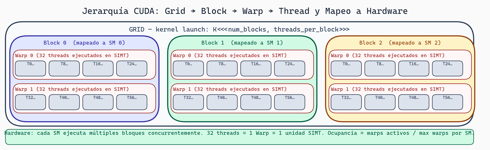

# CUDA Conceptos y PyTorch GPU Internals

> **Módulo:** Project 2 - GPU Computing & Kernel Optimization
> **Semana:** 2
> **Tiempo de lectura:** ~45 minutos

---

## Introducción

CUDA es el lenguaje de NVIDIA para programar GPUs. PyTorch es el framework que usarás para desarrollar y evaluar kernels. Esta lectura combina ambos: entenderás los conceptos fundamentales de CUDA y cómo PyTorch los abstrae para gestionar tensores, memoria, y ejecución en GPU.

---

## Objetivos de Aprendizaje

Al finalizar esta lectura, serás capaz de:

1. Escribir y entender la estructura básica de un programa CUDA
2. Calcular índices globales de threads usando `blockIdx` y `threadIdx`
3. Aplicar coalescing para accesos de memoria eficientes
4. Mover tensores entre CPU y GPU eficientemente en PyTorch
5. Usar el caching allocator y CUDA streams de PyTorch
6. Aplicar `torch.profiler` para identificar bottlenecks

---

## Parte 1: Conceptos Fundamentales de CUDA

### Estructura de un Programa CUDA

Todo programa CUDA tiene esta estructura:

```cuda
#include <stdio.h>

// 1. Kernel (código que corre en GPU)
__global__ void kernel_ejemplo(float *datos) {
    int idx = blockIdx.x * blockDim.x + threadIdx.x;
    datos[idx] = datos[idx] * 2.0f;
}

// 2. Host code (código que corre en CPU)
int main() {
    int n = 1000;
    float *d_datos;  // d_ prefijo = datos en GPU

    // Allocate memoria
    cudaMalloc(&d_datos, n * sizeof(float));

    // Lanzar kernel
    int threads_por_bloque = 256;
    int num_bloques = (n + threads_por_bloque - 1) / threads_por_bloque;
    kernel_ejemplo<<<num_bloques, threads_por_bloque>>>(d_datos);

    // Liberar memoria
    cudaFree(d_datos);

    return 0;
}
```

Elementos clave:
- `__global__`: Marca una función como kernel (ejecutable en GPU)
- `<<<num_bloques, threads_por_bloque>>>`: Sintaxis de lanzamiento
- `blockIdx`, `threadIdx`: Variables que identifican cada thread

### Lanzamiento de Kernels

```cuda
kernel_nombre<<<num_bloques, threads_por_bloque>>>(argumentos);

// Ejemplo: 100 bloques, cada uno con 256 threads
suma_kernel<<<100, 256>>>(a, b, c, n);

// Total: 25,600 threads en paralelo
```

**Reglas:**
1. Threads por bloque: Típicamente 128, 256 o 512. Máximo 1024.
2. Número de bloques: Puede ser muy grande (millones).
3. No hay garantía de orden entre bloques.

### Indexación: La Fórmula Clave

```cuda
__global__ void kernel_indexacion(float *datos) {
    int thread_id_local = threadIdx.x;        // 0 a blockDim.x-1
    int bloque_id = blockIdx.x;               // 0 a gridDim.x-1
    int threads_en_bloque = blockDim.x;

    // Índice global:
    int idx_global = blockIdx.x * blockDim.x + threadIdx.x;

    datos[idx_global] = 42.0f;
}
```

**Visualización:**
```
Grid con 2 bloques de 4 threads:

┌─ Block 0 ──────────┬─ Block 1 ──────────┐
│ blockIdx.x = 0     │ blockIdx.x = 1     │
├────────────────────┼────────────────────┤
│ Thread 0: idx = 0  │ Thread 0: idx = 4  │
│ Thread 1: idx = 1  │ Thread 1: idx = 5  │
│ Thread 2: idx = 2  │ Thread 2: idx = 6  │
│ Thread 3: idx = 3  │ Thread 3: idx = 7  │
└────────────────────┴────────────────────┘
```

### Grillas 2D

Para imágenes o matrices:

```cuda
__global__ void kernel_2d(float *imagen, int ancho, int alto) {
    int x = blockIdx.x * blockDim.x + threadIdx.x;
    int y = blockIdx.y * blockDim.y + threadIdx.y;

    if (x < ancho && y < alto) {
        int idx = y * ancho + x;  // Acceso row-major
        imagen[idx] = imagen[idx] * 2.0f;
    }
}

// Lanzar kernel 2D
dim3 bloques(10, 10);        // 10x10 = 100 bloques
dim3 threads(16, 16);        // 16x16 = 256 threads por bloque
kernel_2d<<<bloques, threads>>>(img, 1920, 1080);
```

### Sincronización con __syncthreads()

```cuda
__global__ void kernel_sincronizado(float *datos) {
    int idx = blockIdx.x * blockDim.x + threadIdx.x;

    float mi_valor = datos[idx] * 2.0f;

    // BARRERA: esperar a que TODOS los threads del bloque lleguen aquí
    __syncthreads();

    // Ahora todos terminaron la fase anterior
    datos[idx] = mi_valor;
}
```

**Importante:** `__syncthreads()` solo sincroniza threads del **mismo bloque**. No hay barrera global.

### Coalescing de Memoria

Cuando múltiples threads leen de memoria:

```cuda
// Acceso coalescido (BUENO):
int idx = threadIdx.x;  // Thread 0 lee [0], Thread 1 lee [1], etc.
float valor = datos[idx];
// Se coalescen en pocas transacciones de memoria

// Acceso NO coalescido (MALO):
int idx = threadIdx.x * 2;  // Thread 0 lee [0], Thread 1 lee [2], etc.
float valor = datos[idx];
// Requiere múltiples transacciones separadas
```

**Regla de oro:** Los primeros 32 threads de un warp deben leer direcciones **consecutivas**.

### Bank Conflicts en Memoria Compartida

```
Memoria Compartida se divide en 32 "bancos":
Bank 0:  [word 0, word 32, word 64, ...]
Bank 1:  [word 1, word 33, word 65, ...]
...
Bank 31: [word 31, word 63, word 95, ...]

Cada banco puede servir UNA lectura por ciclo
```

```cuda
__shared__ float smem[256];

// SIN conflict (excelente):
float v = smem[threadIdx.x];  // Cada thread accede un banco diferente

// CON conflict (terrible):
float v = smem[threadIdx.x * 2];  // Threads pares acceden al mismo banco
```

---



> **Jerarquía de Threads CUDA**
>
> La organización Grid → Block → Warp → Thread dicta cómo se distribuye el trabajo. Los warps (32 threads) son la unidad de scheduling; la divergencia dentro de un warp serializa la ejecución y destruye el paralelismo.

## Parte 2: PyTorch GPU Internals

### Tensores en GPU

```python
import torch

# Crear tensor en CPU
x_cpu = torch.randn(1000, 1000)

# Mover a GPU
x_gpu = x_cpu.to('cuda')        # Copia explícita
x_gpu = x_cpu.cuda()            # Equivalente

# Crear directamente en GPU
x_gpu = torch.randn(1000, 1000, device='cuda')

# Verificar dispositivo
print(x_gpu.device)  # cuda:0
```

### Costo del Movimiento CPU↔GPU

```
PCIe Gen4: ~32 GB/s bidireccional
HBM (GPU interna): ~2000 GB/s

Mover 1GB de CPU a GPU:
- Tiempo: ~30ms
- Durante este tiempo, la GPU está esperando

Regla: Minimiza transferencias CPU↔GPU
```

> 💡 **Concepto clave:** El bandwidth PCIe es 60x menor que el HBM interno. Mantén los datos en GPU el mayor tiempo posible.

### Memory Layout y Contiguidad

```python
# Tensor contiguo (óptimo para GPU)
x = torch.randn(100, 100)
print(x.is_contiguous())  # True

# Tensor no contiguo (después de transpose)
y = x.t()
print(y.is_contiguous())  # False

# Hacer contiguo (copia los datos)
y_contig = y.contiguous()
```

Tensores no contiguos causan accesos de memoria ineficientes.

### Caching Allocator de PyTorch

PyTorch usa un **caching allocator** para evitar llamadas frecuentes a `cudaMalloc`:

```python
# Primera allocación: llama a cudaMalloc
x = torch.randn(1000, 1000, device='cuda')

# Liberar tensor
del x

# Segunda allocación del mismo tamaño: reutiliza memoria cacheada
y = torch.randn(1000, 1000, device='cuda')  # No llama cudaMalloc
```

### Monitoreo de Memoria

```python
# Memoria actualmente allocada
allocated = torch.cuda.memory_allocated()

# Memoria reservada por el caching allocator
reserved = torch.cuda.memory_reserved()

# Pico de memoria
max_allocated = torch.cuda.max_memory_allocated()

print(f"Allocated: {allocated / 1e9:.2f} GB")
print(f"Reserved:  {reserved / 1e9:.2f} GB")
print(f"Peak:      {max_allocated / 1e9:.2f} GB")

# Liberar memoria cacheada
torch.cuda.empty_cache()
```

### CUDA Streams

Un **CUDA stream** es una secuencia de operaciones que se ejecutan en orden. Streams diferentes pueden ejecutarse en paralelo.

```python
# Stream por defecto
x = torch.randn(1000, 1000, device='cuda')
y = x * 2  # Ejecuta en stream por defecto

# Crear stream custom
stream = torch.cuda.Stream()

with torch.cuda.stream(stream):
    z = x + y
    w = z * 3

# Sincronización
torch.cuda.synchronize()  # Todos los streams
stream.synchronize()       # Stream específico
```

### Paralelismo con Streams

```python
# Sin streams: secuencial
def sequential():
    for i in range(10):
        x = torch.randn(1000, 1000, device='cuda')
        y = x @ x.t()
    torch.cuda.synchronize()

# Con streams: paralelo
def parallel():
    streams = [torch.cuda.Stream() for _ in range(10)]
    results = []

    for i, stream in enumerate(streams):
        with torch.cuda.stream(stream):
            x = torch.randn(1000, 1000, device='cuda')
            y = x @ x.t()
            results.append(y)

    torch.cuda.synchronize()
    return results
```

### torch.profiler

```python
from torch.profiler import profile, ProfilerActivity

model = torch.nn.Linear(1000, 1000).cuda()
x = torch.randn(100, 1000, device='cuda')

with profile(
    activities=[ProfilerActivity.CPU, ProfilerActivity.CUDA],
    record_shapes=True,
    profile_memory=True,
) as prof:
    for _ in range(10):
        y = model(x)
        y.sum().backward()

print(prof.key_averages().table(sort_by="cuda_time_total", row_limit=10))
```

**Output típico:**
```
Name                    CPU Time  CUDA Time  # Calls   Memory
aten::addmm              100us     800us       10      4MB
aten::mm                  80us     600us       10      4MB
aten::sum                 20us     100us       10      0B
```

### Patrones Problemáticos

```python
# MALO: Muchas operaciones pequeñas
for i in range(1000):
    x = x + 1  # 1000 kernel launches

# BUENO: Una operación grande
x = x + 1000  # 1 kernel launch

# MALO: Sincronización innecesaria
for i in range(100):
    x = model(x)
    print(x[0, 0].item())  # .item() sincroniza!

# BUENO: Batch las sincronizaciones
results = []
for i in range(100):
    x = model(x)
    results.append(x[0, 0])
torch.cuda.synchronize()
print([r.item() for r in results])
```

### Pinned Memory para Transferencias Rápidas

```python
# Sin pinned memory
x_cpu = torch.randn(1000, 1000)
x_gpu = x_cpu.cuda()  # Copia síncrona lenta

# Con pinned memory
x_pinned = torch.randn(1000, 1000).pin_memory()
x_gpu = x_pinned.cuda(non_blocking=True)  # Copia asíncrona rápida
```

---

## Resumen de Conceptos Clave

| Concepto | CUDA | PyTorch |
|----------|------|---------|
| Identificar thread | `blockIdx`, `threadIdx` | N/A (abstracción) |
| Lanzar kernel | `<<<bloques, threads>>>` | Automático |
| Sincronizar | `__syncthreads()` | `torch.cuda.synchronize()` |
| Memoria GPU | `cudaMalloc/cudaFree` | Caching allocator |
| Streams | `cudaStream_t` | `torch.cuda.Stream()` |
| Profiling | `nvprof`, `nsight` | `torch.profiler` |

---

## Ejercicios y Reflexión

### Ejercicio 1: Cálculo de Índices

Para un grid de 5x3 bloques con 16x16 threads por bloque:
- ¿Cuántos threads totales?
- ¿Cuál es el índice global del thread en bloque (2,1) con threadIdx (3,5)?

### Ejercicio 2: Coalescing

Analiza: ¿Cuál versión tiene mejor coalescing?

```cuda
// Versión A
int idx = threadIdx.x + i;
datos[idx] = procesar(datos[idx]);

// Versión B
int idx = threadIdx.x + blockIdx.x * blockDim.x + i;
datos[idx] = procesar(datos[idx]);
```

### Ejercicio 3: Profiling PyTorch

Usa `torch.profiler` para medir:
1. Multiplicación de matrices 1000x1000
2. Forward pass de ResNet-18

¿Cuál tiene mejor utilización de GPU?

### Para Pensar

> *Si el profiler muestra 80% del tiempo en transferencias CPU↔GPU, ¿qué cambios arquitectónicos considerarías?*

---

## Próximos Pasos

En la siguiente semana, exploraremos **Optimización de Memoria GPU**: coalesced access patterns, bank conflicts, tiling, y el modelo roofline.

---

*Esta lectura es parte del curso "Grammar-Constrained GPU Kernel Generation" - TC3002B*
