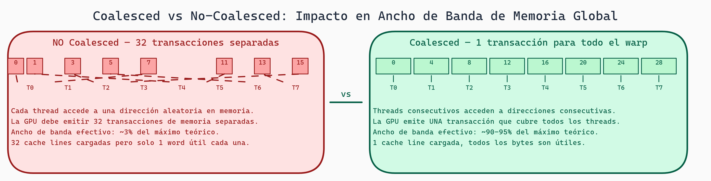

# Optimización de Memoria GPU: Coalescing, Bank Conflicts y Roofline

> **Módulo:** Project 2 - GPU Computing & Kernel Optimization
> **Semana:** 3
> **Tiempo de lectura:** ~40 minutos

---

## Introducción

La diferencia entre un kernel GPU lento y uno rápido frecuentemente está en **cómo accede a la memoria**. Un kernel puede tener la lógica correcta pero ser 10x más lento por patrones de acceso ineficientes.

Esta lectura te enseña los conceptos fundamentales de optimización de memoria GPU: coalesced access, bank conflicts, tiling, y cómo usar el modelo roofline para analizar performance.

---

## Objetivos de Aprendizaje

Al finalizar esta lectura, serás capaz de:

1. Diseñar patrones de acceso coalesced
2. Evitar bank conflicts en shared memory
3. Aplicar tiling para mejorar localidad
4. Usar el modelo roofline para análisis de performance
5. Identificar si un kernel es memory-bound o compute-bound

---

## Coalesced Memory Access

### El Problema

La GPU accede a memoria global en **transacciones de 128 bytes**. Si 32 threads de un warp acceden a direcciones dispersas, necesitas múltiples transacciones:

```
Acceso Coalesced (1 transacción):
Thread 0 → addr[0]
Thread 1 → addr[1]
...
Thread 31 → addr[31]
→ Todos en el mismo bloque de 128 bytes = 1 transacción

Acceso No-Coalesced (32 transacciones):
Thread 0 → addr[0]
Thread 1 → addr[1000]
...
Thread 31 → addr[31000]
→ Cada acceso en bloque diferente = 32 transacciones = 32x más lento!
```

### Patrones Correctos en Triton

```python
# BUENO: Acceso coalesced por filas
@triton.jit
def kernel_good(data_ptr, N, M, BLOCK: tl.constexpr):
    row = tl.program_id(0)
    cols = tl.arange(0, BLOCK)  # 0, 1, 2, ..., BLOCK-1

    # Threads consecutivos acceden a posiciones consecutivas
    offsets = row * M + cols  # [row*M, row*M+1, row*M+2, ...]
    x = tl.load(data_ptr + offsets)

# MALO: Acceso strided por columnas
@triton.jit
def kernel_bad(data_ptr, N, M, BLOCK: tl.constexpr):
    col = tl.program_id(0)
    rows = tl.arange(0, BLOCK)

    # Threads consecutivos acceden con stride M
    offsets = rows * M + col  # [col, M+col, 2M+col, ...]
    x = tl.load(data_ptr + offsets)  # No-coalesced!
```

### Visualización

```
Matriz en memoria (row-major):
[a00][a01][a02][a03][a10][a11][a12][a13][a20][a21]...

Acceso por fila (coalesced):
Thread 0 lee a00, Thread 1 lee a01, Thread 2 lee a02...
→ Posiciones consecutivas en memoria ✓

Acceso por columna (no-coalesced):
Thread 0 lee a00, Thread 1 lee a10, Thread 2 lee a20...
→ Saltos de M posiciones entre accesos ✗
```

---

## Shared Memory y Bank Conflicts

### Estructura de Banks

Shared memory está dividida en **32 banks**. Cada bank puede servir una solicitud por ciclo:

```
Bank 0: addr 0, 32, 64, 96, ...
Bank 1: addr 1, 33, 65, 97, ...
...
Bank 31: addr 31, 63, 95, 127, ...
```

### Bank Conflict

Cuando múltiples threads acceden al mismo bank (diferente dirección), hay **serialización**:

```
Sin conflict (cada thread → diferente bank):
Thread 0 → Bank 0
Thread 1 → Bank 1
...
→ 1 ciclo

2-way conflict (2 threads → mismo bank):
Thread 0 → Bank 0
Thread 1 → Bank 0  ← Conflicto!
→ 2 ciclos

32-way conflict (todos → mismo bank):
Thread 0-31 → Bank 0
→ 32 ciclos!
```

### Patrones Problemáticos

```python
# MALO: Stride de 32 (todos al mismo bank)
shared_mem[threadIdx.x * 32]

# BUENO: Stride de 1 (acceso lineal)
shared_mem[threadIdx.x]

# SOLUCIÓN: Padding para evitar conflicts
shared_mem[row * 33 + col]  # 33 en vez de 32
```

---

## Tiling: Mejorando Localidad

### Concepto

**Tiling** divide el problema en bloques pequeños que caben en cache/shared memory:

```
Sin tiling:
Cada thread carga desde global memory
→ Muchos accesos a memoria lenta

Con tiling:
1. Cargar tile a shared memory
2. Sincronizar
3. Procesar desde shared memory
→ Menos accesos a global, más a shared (rápida)
```

### Ejemplo: Matrix Multiply con Tiling

```python
@triton.jit
def matmul_tiled(
    A, B, C, M, N, K,
    BLOCK_M: tl.constexpr, BLOCK_N: tl.constexpr, BLOCK_K: tl.constexpr
):
    pid_m = tl.program_id(0)
    pid_n = tl.program_id(1)

    offs_m = pid_m * BLOCK_M + tl.arange(0, BLOCK_M)
    offs_n = pid_n * BLOCK_N + tl.arange(0, BLOCK_N)

    acc = tl.zeros((BLOCK_M, BLOCK_N), dtype=tl.float32)

    # Iterar sobre tiles de K
    for k in range(0, K, BLOCK_K):
        offs_k = k + tl.arange(0, BLOCK_K)

        a = tl.load(A + offs_m[:, None] * K + offs_k[None, :])
        b = tl.load(B + offs_k[:, None] * N + offs_n[None, :])

        acc += tl.dot(a, b)  # En registros, muy rápido

    tl.store(C + offs_m[:, None] * N + offs_n[None, :], acc)
```

### Beneficios

```
Sin tiling (matmul MxNxK):
- Accesos a global: M*N*K * 2
- Arithmetic intensity: 2 FLOPs / 8 bytes = 0.25

Con tiling (block size = B):
- Accesos a global: M*N*K*2 / B
- Arithmetic intensity: B/4

Para B=32: 8x mejor arithmetic intensity
```

---



> **Patrones de Acceso a Memoria GPU**
>
> El acceso coalescido (threads consecutivos leen direcciones consecutivas) fusiona múltiples accesos en pocas transacciones. El acceso con stride alto fragmenta las transacciones y puede reducir el ancho de banda efectivo en 10-32×.

## Modelo Roofline

### Concepto

El **modelo roofline** indica si un kernel está limitado por **compute** o **memoria**:

```
Performance (FLOPS)
       │
       │         ╱ Roofline
       │        ╱
       │       ╱............ Peak Compute
       │      ╱
       │     ╱
       │    ╱
       │   ╱
       │  ╱
       │ ╱
       │╱
       └────────────────────────
         Arithmetic Intensity (FLOPS/byte)

Ridge Point: donde memoria = compute
- Izquierda: Memory-bound
- Derecha: Compute-bound
```

### Cálculo

```python
# Datos GPU (ejemplo A100)
peak_compute = 19.5e12  # 19.5 TFLOPS (FP32)
peak_bandwidth = 2.0e12  # 2 TB/s

ridge_point = peak_compute / peak_bandwidth  # ~10 FLOPS/byte

def analyze_kernel(flops, bytes_transferred):
    ai = flops / bytes_transferred

    if ai < ridge_point:
        print(f"Memory-bound. Max: {peak_bandwidth * ai / 1e12:.2f} TFLOPS")
    else:
        print(f"Compute-bound. Max: {peak_compute / 1e12:.2f} TFLOPS")
```

### Operaciones Comunes

| Operación | AI | Bound |
|-----------|-----|-------|
| Vector Add | 0.08 | Memory |
| Elementwise | 0.125 | Memory |
| MatMul (naive) | ~0.5 | Memory |
| MatMul (tiled) | ~8 | Compute |
| Softmax | 0.4 | Memory |

---

## Técnicas de Optimización por Tipo

### Para Kernels Memory-Bound

```python
# 1. Fusionar operaciones
# MALO: 3 kernels, 3 round-trips
y = x + 1
y = y * 2
y = y - 3

# BUENO: 1 kernel fusionado
@triton.jit
def fused(x_ptr, y_ptr, N, BLOCK: tl.constexpr):
    offsets = ...
    x = tl.load(x_ptr + offsets)
    y = (x + 1) * 2 - 3  # Todo en registros
    tl.store(y_ptr + offsets, y)

# 2. Vectorizar cargas (Triton lo hace automáticamente)

# 3. Prefetching
for i in range(N):
    next_data = tl.load(...)  # Prefetch
    result = compute(current_data)
    current_data = next_data
```

### Para Kernels Compute-Bound

```python
# 1. Usar tensor cores (tl.dot en Triton)

# 2. Reducir divergencia
# MALO
if tl.arange(0, 32) % 2 == 0:
    x = compute_a()
else:
    x = compute_b()

# BUENO
x = compute_a()
y = compute_b()
result = tl.where(mask, x, y)

# 3. Loop unrolling
for i in tl.static_range(4):  # Compile-time unroll
    acc += compute(i)
```

---

## Caso de Estudio: Optimizando Softmax

### Versión Naive

```python
def softmax_naive(x):
    # 4 kernel launches, 4 round-trips
    max_x = x.max(dim=-1, keepdim=True)
    x = x - max_x
    exp_x = x.exp()
    sum_exp = exp_x.sum(dim=-1, keepdim=True)
    return exp_x / sum_exp
```

### Análisis

```
Para tensor [B, N]:
- Total bytes: ~7*BN
- FLOPs: ~5*BN
- AI: 5/28 ≈ 0.18 → Muy memory-bound
```

### Versión Optimizada (Fused)

```python
@triton.jit
def softmax_fused(x_ptr, out_ptr, N, BLOCK: tl.constexpr):
    row = tl.program_id(0)
    offsets = tl.arange(0, BLOCK)
    mask = offsets < N

    # Una sola lectura
    x = tl.load(x_ptr + row * N + offsets, mask=mask, other=-float('inf'))

    # Todo en registros
    max_x = tl.max(x, axis=0)
    x = x - max_x
    exp_x = tl.exp(x)
    sum_exp = tl.sum(exp_x, axis=0)
    softmax = exp_x / sum_exp

    # Una sola escritura
    tl.store(out_ptr + row * N + offsets, softmax, mask=mask)
```

### Mejora

```
Total bytes: 2*BN (una lectura, una escritura)
AI: 5/8 ≈ 0.625 → 3.5x mejor

En práctica: 2-4x speedup vs naive
```

---

## Profiling para Identificar Bottlenecks

### Con PyTorch Profiler

```python
with torch.profiler.profile(
    activities=[torch.profiler.ProfilerActivity.CUDA],
    with_flops=True
) as prof:
    my_kernel(...)

for event in prof.key_averages():
    if event.flops > 0:
        achieved = event.flops / (event.cuda_time * 1e-6)
        print(f"{event.key}: {achieved/1e12:.2f} TFLOPS")
```

### Checklist de Diagnóstico

```
□ ¿Accesos a memoria son coalesced?
□ ¿Hay bank conflicts en shared memory?
□ ¿Occupancy es razonable?
□ ¿Estás cerca del roofline?
  → Calcular: achieved_FLOPS / theoretical_max
```

---

## Resumen

- **Coalesced Access**: Threads consecutivos → direcciones consecutivas
- **Bank Conflicts**: Evitar múltiples threads al mismo bank
- **Tiling**: Dividir problema para mejor localidad
- **Roofline**: Memory-bound vs compute-bound
- **Optimización**: Técnicas específicas por tipo de bottleneck

---

## Ejercicios

### Ejercicio 1: Analiza Accesos

```python
offsets = tl.arange(0, 32) * 4  # [0, 4, 8, 12, ...]
x = tl.load(data_ptr + offsets)
```
¿Es coalesced? ¿Cómo mejorarlo?

### Ejercicio 2: Cálculo de Roofline

GPU con 10 TFLOPS peak, 500 GB/s bandwidth.
¿Memory-bound o compute-bound?
1. Vector addition: 1 FLOP/elemento
2. Matrix multiply 1024x1024

### Para Pensar

> *Si un kernel está al 90% del roofline pero sigue siendo lento, ¿qué opciones tienes?*

---

*Esta lectura es parte del curso "Grammar-Constrained GPU Kernel Generation" - TC3002B*
