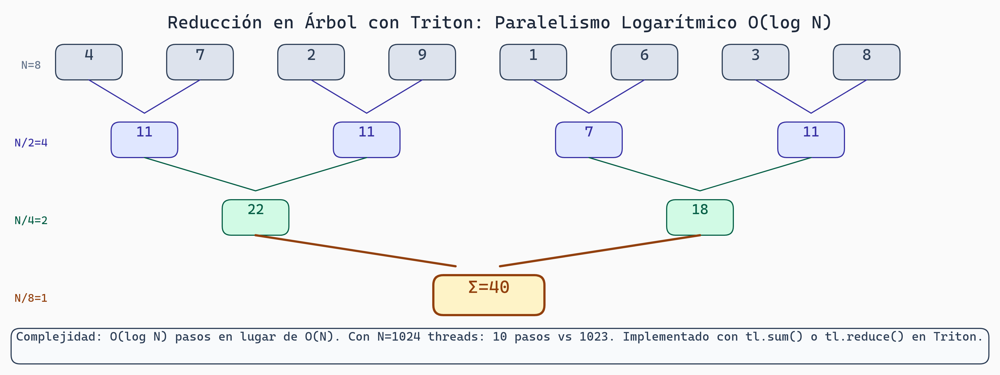

# Triton Completo: Filosofía, API y Reducciones

> **Módulo:** Project 2 - GPU Computing & Kernel Optimization
> **Semana:** 4
> **Tiempo de lectura:** ~45 minutos

---

## Introducción

CUDA requiere controlar muchos detalles: indexación manual, sincronización, gestión de memoria compartida. **Triton** responde a una pregunta simple: ¿Qué pasa si especificas la lógica, no el paralelismo?

En Triton, el **compilador** maneja el paralelismo por ti. Esta lectura cubre la filosofía de Triton, su API completa, y patrones de reducción.

---

## Objetivos de Aprendizaje

Al finalizar esta lectura, serás capaz de:

1. Explicar la filosofía de Triton vs CUDA
2. Usar todas las funciones del módulo `triton.language`
3. Implementar reducciones locales y globales
4. Aplicar autotuning con `@triton.autotune`
5. Escribir kernels completos para operaciones comunes

---

## Contexto
Esta lectura cubre el lenguaje Triton para escribir kernels GPU de forma más productiva que CUDA. Aprenderás su filosofía "bloques, no threads" y patrones de reducción.

## Filosofía de Triton

### Piensa en Bloques, No en Threads

```
CUDA:   1 thread  → 1 elemento
Triton: 1 programa → 1 bloque de datos
```

```python
# CUDA: especificar todo
# idx = blockIdx.x * blockDim.x + threadIdx.x
# if idx < n: data[idx] = data[idx] * 2

# Triton: solo decir qué hacer
@triton.jit
def kernel(data_ptr, n, BLOCK: tl.constexpr):
    pid = tl.program_id(0)
    offsets = pid * BLOCK + tl.arange(0, BLOCK)
    mask = offsets < n
    data = tl.load(data_ptr + offsets, mask=mask)
    tl.store(data_ptr + offsets, data * 2, mask=mask)
```

Triton maneja automáticamente:
- Sincronización
- Coalescing de memoria
- Distribución de threads
- Checks de límites

---

## El Decorador @triton.jit

```python
import triton
import triton.language as tl

@triton.jit
def kernel_simple(x_ptr, y_ptr, n, BLOCK_SIZE: tl.constexpr):
    # program_id: cuál "bloque" soy
    pid = tl.program_id(axis=0)

    # Crear índices
    offsets = pid * BLOCK_SIZE + tl.arange(0, BLOCK_SIZE)
    mask = offsets < n

    # Cargar, computar, guardar
    x = tl.load(x_ptr + offsets, mask=mask)
    y = x * 2
    tl.store(y_ptr + offsets, y, mask=mask)
```

`BLOCK_SIZE: tl.constexpr` es una **constante en tiempo de compilación**, permitiendo optimizaciones que CUDA no puede hacer.

---

## API Completa de triton.language

### Creación de Vectores

```python
# Índices secuenciales
v = tl.arange(0, 256)           # [0, 1, 2, ..., 255]
v = tl.arange(0, 256, 2)        # [0, 2, 4, ..., 254]

# Vectores constantes
zeros = tl.zeros((256,), dtype=tl.float32)
ones = tl.ones((256,), dtype=tl.float32)
pi = tl.full((256,), 3.14159, dtype=tl.float32)
```

### Carga y Almacenamiento

```python
# Cargar datos
x = tl.load(x_ptr + offsets)
x = tl.load(x_ptr + offsets, mask=mask)
x = tl.load(x_ptr + offsets, mask=mask, other=0.0)

# Guardar datos
tl.store(y_ptr + offsets, y)
tl.store(y_ptr + offsets, y, mask=mask)

# Operaciones atómicas
tl.atomic_add(ptr + offsets, values)
tl.atomic_max(ptr + offsets, values)
```

### Operaciones Aritméticas

```python
# Básicas
suma = a + b
resta = a - b
producto = a * b
division = a / b

# Funciones matemáticas
raiz = tl.sqrt(x)
exp_x = tl.exp(x)
log_x = tl.log(x)
sin_x = tl.sin(x)
cos_x = tl.cos(x)
abs_x = tl.abs(x)

# Comparaciones
maximo = tl.maximum(a, b)
minimo = tl.minimum(a, b)
```

### Máscaras y Condicionales

```python
# Crear máscaras
mask_bounds = offsets < n
mask_condition = x > threshold

# Combinar máscaras
combined = mask_bounds & mask_condition

# Condicional vectorizado
result = tl.where(condition, value_true, value_false)

# Ejemplo: ReLU
result = tl.where(x > 0, x, 0.0)
```

### Indexación 2D

```python
@triton.jit
def kernel_2d(matrix_ptr, height, width, BLOCK_H: tl.constexpr, BLOCK_W: tl.constexpr):
    pid_h = tl.program_id(0)
    pid_w = tl.program_id(1)

    # Índices locales
    local_h = tl.arange(0, BLOCK_H)
    local_w = tl.arange(0, BLOCK_W)

    # Expandir a 2D con broadcasting
    h_indices = pid_h * BLOCK_H + local_h[:, None]
    w_indices = pid_w * BLOCK_W + local_w[None, :]

    # Índices lineales (row-major)
    linear = h_indices * width + w_indices

    # Máscara 2D
    mask = (h_indices < height) & (w_indices < width)

    data = tl.load(matrix_ptr + linear, mask=mask, other=0.0)
```

---

## Reducciones

### Reducciones Locales (Dentro del Bloque)

```python
@triton.jit
def kernel_reduce(data_ptr, result_ptr, n, BLOCK: tl.constexpr):
    pid = tl.program_id(0)
    offsets = pid * BLOCK + tl.arange(0, BLOCK)
    mask = offsets < n

    data = tl.load(data_ptr + offsets, mask=mask, other=0.0)

    # Reducciones - producen UN escalar por bloque
    suma = tl.sum(data)
    maximo = tl.max(data)
    minimo = tl.min(data)

    # Guardar (cada bloque produce 1 resultado)
    tl.store(result_ptr + pid, suma)
```

### Reducciones con Máscara

```python
@triton.jit
def suma_condicional(data_ptr, result_ptr, threshold, n, BLOCK: tl.constexpr):
    pid = tl.program_id(0)
    offsets = pid * BLOCK + tl.arange(0, BLOCK)
    mask = offsets < n

    data = tl.load(data_ptr + offsets, mask=mask, other=0.0)

    # Solo sumar elementos > threshold
    filtered = tl.where(data > threshold, data, 0.0)
    suma = tl.sum(filtered)

    tl.store(result_ptr + pid, suma)
```

### Reducción Global (Dos Etapas)

```python
@triton.jit
def kernel_etapa1(data_ptr, temp_ptr, n, BLOCK: tl.constexpr):
    """Cada bloque suma sus datos"""
    pid = tl.program_id(0)
    offsets = pid * BLOCK + tl.arange(0, BLOCK)
    mask = offsets < n

    data = tl.load(data_ptr + offsets, mask=mask, other=0.0)
    tl.store(temp_ptr + pid, tl.sum(data))

@triton.jit
def kernel_etapa2(temp_ptr, result_ptr, num_bloques, BLOCK: tl.constexpr):
    """Sumar todos los resultados parciales"""
    offsets = tl.arange(0, BLOCK)
    mask = offsets < num_bloques

    temp = tl.load(temp_ptr + offsets, mask=mask, other=0.0)
    tl.store(result_ptr, tl.sum(temp))

def suma_total(data):
    n = data.numel()
    BLOCK = 256
    num_bloques = triton.cdiv(n, BLOCK)

    temp = torch.zeros(num_bloques, device='cuda')
    kernel_etapa1[(num_bloques,)](data, temp, n, BLOCK=BLOCK)

    result = torch.zeros(1, device='cuda')
    kernel_etapa2[(1,)](temp, result, num_bloques, BLOCK=BLOCK)

    return result[0]
```

---



> **Reducción en Árbol con Triton**
>
> La reducción paralela divide el trabajo en etapas logarítmicas: cada etapa reduce el array a la mitad usando operaciones simultáneas. Con N=1M elementos y BLOCK=1024, se necesitan solo ~20 etapas versus 1M pasos secuenciales.

## Autotuning

### Configuración Básica

```python
@triton.autotune(
    configs=[
        triton.Config({'BLOCK_M': 64, 'BLOCK_N': 64}),
        triton.Config({'BLOCK_M': 128, 'BLOCK_N': 64}),
        triton.Config({'BLOCK_M': 64, 'BLOCK_N': 128}),
        triton.Config({'BLOCK_M': 128, 'BLOCK_N': 128}),
    ],
    key=['M', 'N']  # Retunar si estos cambian
)
@triton.jit
def kernel_autotuned(A, B, M, N, BLOCK_M: tl.constexpr, BLOCK_N: tl.constexpr):
    # Código del kernel...
    pass
```

### Cómo Funciona

```
Primera llamada:
1. Triton prueba cada configuración
2. Mide tiempo de ejecución
3. Selecciona la más rápida
4. Cachea resultado

Llamadas siguientes:
→ Usa configuración cacheada
```

---

## Ejemplos Completos

### Softmax Fusionado

```python
@triton.jit
def softmax_kernel(x_ptr, out_ptr, M, N, BLOCK: tl.constexpr):
    row = tl.program_id(0)
    offsets = tl.arange(0, BLOCK)
    mask = offsets < N

    # Cargar fila
    x = tl.load(x_ptr + row * N + offsets, mask=mask, other=-float('inf'))

    # Softmax numéricamente estable
    max_x = tl.max(x, axis=0)
    x = x - max_x
    exp_x = tl.exp(x)
    sum_exp = tl.sum(exp_x, axis=0)
    softmax = exp_x / sum_exp

    tl.store(out_ptr + row * N + offsets, softmax, mask=mask)

def softmax_triton(x):
    M, N = x.shape
    out = torch.empty_like(x)
    BLOCK = triton.next_power_of_2(N)
    softmax_kernel[(M,)](x, out, M, N, BLOCK=BLOCK)
    return out
```

### Layer Normalization

```python
@triton.jit
def layernorm_kernel(x_ptr, out_ptr, gamma_ptr, beta_ptr, M, N, eps, BLOCK: tl.constexpr):
    row = tl.program_id(0)
    offsets = tl.arange(0, BLOCK)
    mask = offsets < N

    x = tl.load(x_ptr + row * N + offsets, mask=mask, other=0.0)
    gamma = tl.load(gamma_ptr + offsets, mask=mask, other=1.0)
    beta = tl.load(beta_ptr + offsets, mask=mask, other=0.0)

    # Calcular mean y var
    mean = tl.sum(x, axis=0) / N
    x_centered = x - mean
    var = tl.sum(x_centered * x_centered, axis=0) / N

    # Normalizar
    x_norm = x_centered / tl.sqrt(var + eps)
    out = gamma * x_norm + beta

    tl.store(out_ptr + row * N + offsets, out, mask=mask)
```

### GELU Activation

```python
@triton.jit
def gelu_kernel(x_ptr, out_ptr, n, BLOCK: tl.constexpr):
    pid = tl.program_id(0)
    offsets = pid * BLOCK + tl.arange(0, BLOCK)
    mask = offsets < n

    x = tl.load(x_ptr + offsets, mask=mask)

    # GELU: 0.5 * x * (1 + tanh(sqrt(2/π) * (x + 0.044715 * x³)))
    sqrt_2_over_pi = 0.7978845608028654
    coef = 0.044715
    tanh_arg = sqrt_2_over_pi * (x + coef * x * x * x)
    gelu = 0.5 * x * (1.0 + tl.tanh(tanh_arg))

    tl.store(out_ptr + offsets, gelu, mask=mask)
```

---

## Comparación: Triton vs CUDA

| Aspecto | CUDA | Triton |
|---------|------|--------|
| Abstracción | Bajo (control total) | Alto (automático) |
| Unidad de trabajo | Thread | Programa (bloque) |
| Shared memory | Manual | Automático |
| Sincronización | Manual | Automática |
| Coalescing | Manual | Automático |
| Tensor cores | Manual | Automático (tl.dot) |
| Debugging | Difícil | Más fácil |
| Performance | Máxima | ~95%+ |

### Cuándo Usar Cada Uno

**Triton:**
- Kernels personalizados
- Prototipos rápidos
- Operaciones de deep learning
- Autotuning fácil

**CUDA:**
- Control absoluto necesario
- Patrones muy irregulares
- Optimizaciones específicas de hardware

---

## Resumen

- **Filosofía**: Pensar en bloques, no threads
- **API**: `tl.load`, `tl.store`, `tl.arange`, máscaras
- **Reducciones**: `tl.sum`, `tl.max`, dos etapas para global
- **Autotuning**: `@triton.autotune` para optimización automática
- **Patrones**: Softmax, LayerNorm, activaciones

---

## Ejercicios

### Ejercicio 1: Traducir a Triton

```cuda
__global__ void relu(float *x, float *y, int n) {
    int idx = blockIdx.x * blockDim.x + threadIdx.x;
    if (idx < n) {
        y[idx] = x[idx] > 0 ? x[idx] : 0;
    }
}
```

### Ejercicio 2: Implementar Dropout

Crea un kernel que aplique dropout con probabilidad p.

### Ejercicio 3: Suma Condicional

Escribe un kernel que sume solo elementos positivos.

### Para Pensar

> *Si Triton genera código optimizado automáticamente, ¿por qué aún necesitas entender coalescing y bank conflicts?*

---

*Esta lectura es parte del curso "Grammar-Constrained GPU Kernel Generation" - TC3002B*
