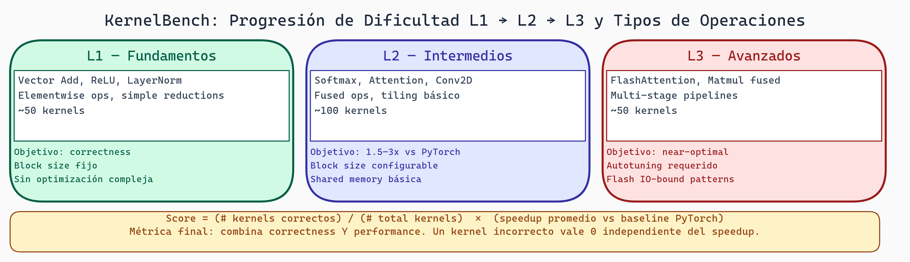

# KernelBench y Corpus: Evaluación de Kernels GPU

> **Módulo:** Project 2 - GPU Computing & Kernel Optimization
> **Semana:** 6
> **Tiempo de lectura:** ~45 minutos

---

## Introducción

KernelBench evalúa tu habilidad para escribir kernels GPU eficientes. A diferencia de "solo hacer que funcione", requiere **tanto corrección como velocidad**. Para evaluar agentes que generan kernels automáticamente, necesitas un **corpus de benchmarks**: problemas con soluciones conocidas.

Esta lectura cubre la estructura de KernelBench, cómo evaluar kernels (manuales o generados), y estrategias para maximizar tu puntuación.

---

## Objetivos de Aprendizaje

Al finalizar esta lectura, serás capaz de:

1. Entender la estructura de KernelBench por niveles
2. Identificar tipos de operaciones y sus patrones
3. Estructurar un corpus de benchmarks
4. Evaluar kernels (correctitud y performance)
5. Aplicar estrategias de selección informada

---

## Estructura de KernelBench

### Organización por Dificultad

```
Benchmark Suite
├─ L1 (Novato)
│  ├─ Operaciones elementales
│  ├─ Sin optimizaciones complejas
│  └─ Enfoque en corrección
├─ L2 (Intermedio)
│  ├─ Operaciones compuestas
│  ├─ Requieren algunos patrones
│  └─ Balance corrección / velocidad
├─ L3 (Avanzado)
│  ├─ Operaciones complejas
│  ├─ Requieren optimizaciones
│  └─ Énfasis en velocidad
└─ L4 (Experto)
   ├─ Kernels fusionados
   └─ Optimizaciones avanzadas
```

### Niveles de Dificultad

| Nivel | Descripción | Ejemplos |
|-------|-------------|----------|
| L1 | Operaciones element-wise | add, mul, relu, sigmoid |
| L2 | Reducciones simples | sum, max, softmax |
| L3 | Operaciones compuestas | layernorm, attention |
| L4 | Optimizaciones avanzadas | flash attention, fused kernels |

---

## Nivel L1: Fundamentos

Estos problemas verifican que **entiendes los conceptos básicos**.

### 1. Element-wise Operations

```python
@triton.jit
def elementwise_multiply(x_ptr, y_ptr, n, BLOCK_SIZE: tl.constexpr):
    pid = tl.program_id(axis=0)
    offsets = pid * BLOCK_SIZE + tl.arange(0, BLOCK_SIZE)
    mask = offsets < n

    x = tl.load(x_ptr + offsets, mask=mask)
    y = x * 2.0

    tl.store(y_ptr + offsets, y, mask=mask)
```

### 2. Vector Reduction

```python
@triton.jit
def sum_reduction(x_ptr, result_ptr, n, BLOCK_SIZE: tl.constexpr):
    pid = tl.program_id(axis=0)
    offsets = pid * BLOCK_SIZE + tl.arange(0, BLOCK_SIZE)
    mask = offsets < n

    x = tl.load(x_ptr + offsets, mask=mask, other=0.0)
    suma = tl.sum(x)

    tl.store(result_ptr + pid, suma)
```

### 3. Basic Indexing (Transpose)

```python
@triton.jit
def matrix_transpose(matrix_ptr, out_ptr, height, width,
                     BLOCK_H: tl.constexpr, BLOCK_W: tl.constexpr):
    pid_h = tl.program_id(axis=0)
    pid_w = tl.program_id(axis=1)

    h_idx = pid_h * BLOCK_H + tl.arange(0, BLOCK_H)
    w_idx = pid_w * BLOCK_W + tl.arange(0, BLOCK_W)

    h_2d = h_idx[:, None]
    w_2d = w_idx[None, :]

    read_idx = h_2d * width + w_2d
    mask = (h_2d < height) & (w_2d < width)
    data = tl.load(matrix_ptr + read_idx, mask=mask, other=0.0)

    write_idx = w_2d * height + h_2d
    tl.store(out_ptr + write_idx, data, mask=mask)
```

**Estrategia L1:**
- ✓ Enfócate en corrección
- ✓ Usa patrones simples
- ✓ Verifica límites
- ✗ No necesitas optimizaciones avanzadas

---

## Nivel L2: Pasos Intermedios

Requieren **composición de operaciones** y **patrones comunes**.

### 1. Operaciones con Máscaras

```python
@triton.jit
def filter_kernel(x_ptr, y_ptr, threshold, n, BLOCK_SIZE: tl.constexpr):
    pid = tl.program_id(axis=0)
    offsets = pid * BLOCK_SIZE + tl.arange(0, BLOCK_SIZE)
    mask_bounds = offsets < n

    x = tl.load(x_ptr + offsets, mask=mask_bounds, other=0.0)
    mask_condition = x > threshold
    y = tl.where(mask_condition, x, 0.0)

    tl.store(y_ptr + offsets, y, mask=mask_bounds)
```

### 2. Reducciones en Matrices

```python
@triton.jit
def sum_rows(matrix_ptr, out_ptr, height, width,
             BLOCK_H: tl.constexpr, BLOCK_W: tl.constexpr):
    pid_h = tl.program_id(axis=0)

    h_idx = pid_h * BLOCK_H + tl.arange(0, BLOCK_H)
    w_idx = tl.arange(0, BLOCK_W)

    h_2d = h_idx[:, None]
    w_2d = w_idx[None, :]

    read_idx = h_2d * width + w_2d
    mask = (h_2d < height) & (w_2d < width)
    data = tl.load(matrix_ptr + read_idx, mask=mask, other=0.0)

    fila_suma = tl.sum(data, axis=1)
    tl.store(out_ptr + h_idx, fila_suma, mask=(h_idx < height))
```

**Estrategia L2:**
- ✓ Diseña en dos etapas: planea, luego codifica
- ✓ Usa reducciones y máscaras apropiadamente
- ✓ Verifica correctness primero, luego optimiza

---

## Nivel L3: Desafíos Avanzados

Requieren **optimización real** y a menudo **múltiples estrategias**.

### Layer Norm Completo

```python
@triton.autotune(
    configs=[
        triton.Config({"BLOCK_SIZE": 256}),
        triton.Config({"BLOCK_SIZE": 512}),
    ],
    key=["n"],
)
@triton.jit
def layer_norm_kernel(
    x_ptr, weight_ptr, bias_ptr, y_ptr,
    n, eps,
    BLOCK_SIZE: tl.constexpr,
):
    row_idx = tl.program_id(axis=0)
    row_start = row_idx * n

    # Etapa 1: Calcular media
    media = 0.0
    for k in range(0, n, BLOCK_SIZE):
        offsets = k + tl.arange(0, BLOCK_SIZE)
        mask = offsets < n
        x = tl.load(x_ptr + row_start + offsets, mask=mask, other=0.0)
        media = media + tl.sum(x)
    media = media / n

    # Etapa 2: Calcular varianza
    var = 0.0
    for k in range(0, n, BLOCK_SIZE):
        offsets = k + tl.arange(0, BLOCK_SIZE)
        mask = offsets < n
        x = tl.load(x_ptr + row_start + offsets, mask=mask, other=0.0)
        diff = x - media
        var = var + tl.sum(diff * diff)
    var = var / n

    # Etapa 3: Normalizar
    desv_est = tl.sqrt(var + eps)
    for k in range(0, n, BLOCK_SIZE):
        offsets = k + tl.arange(0, BLOCK_SIZE)
        mask = offsets < n
        x = tl.load(x_ptr + row_start + offsets, mask=mask, other=0.0)
        w = tl.load(weight_ptr + offsets, mask=mask, other=1.0)
        b = tl.load(bias_ptr + offsets, mask=mask, other=0.0)
        y = ((x - media) / desv_est) * w + b
        tl.store(y_ptr + row_start + offsets, y, mask=mask)
```

**Estrategia L3:**
- ✓ Usa autotuning (@triton.autotune)
- ✓ Implementa tiling si aplica
- ✓ Optimiza para ancho de banda
- ✓ Perfilar antes de optimizar

---

## Tipos de Operaciones

### Categoría 1: Elemento-Elemento

```
Patrón: f(x) = y, donde la función se aplica a cada elemento
Ejemplos: mul, relu, sigmoid, exp, log
Característica: Índice salida = índice entrada
```

### Categoría 2: Reducciones

```
Patrón: scalar = reduce(x)
Ejemplos: sum, max, mean, argmax
Desafío: Múltiples threads escriben al mismo resultado
Solución: Operaciones atómicas o dos etapas
```

### Categoría 3: Índice Complejo

```
Patrón: Índices entrada/salida con relación no trivial
Ejemplos: transpose, gather, scatter, reshape
Desafío: Indexación correcta en múltiples dimensiones
```

### Categoría 4: Compuestas

```
Patrón: Combinación de operaciones simples
Ejemplos: softmax, layer_norm, attention
Desafío: Eficiencia en múltiples pasadas de datos
```

---

## Corpus de Benchmarks

### Estructura

```
corpus/
├── level1_basic/
│   ├── vector_add.json
│   ├── vector_mul.json
│   └── scalar_mul.json
├── level2_intermediate/
│   ├── softmax.json
│   ├── layer_norm.json
│   └── gelu.json
├── level3_advanced/
│   ├── matmul.json
│   └── attention.json
└── level4_expert/
    └── flash_attention.json
```

### Formato de Problema

```json
{
  "id": "softmax_001",
  "name": "Basic Softmax",
  "level": 2,
  "description": "Implement row-wise softmax for a 2D tensor",
  "detailed_spec": {
    "operation": "softmax",
    "inputs": [{"name": "x", "shape": ["M", "N"], "dtype": "float32"}],
    "outputs": [{"name": "y", "shape": ["M", "N"], "dtype": "float32"}],
    "formula": "y[i,j] = exp(x[i,j] - max_j(x[i,:])) / sum_j(exp(...))"
  },
  "test_cases": [
    {"inputs": {"x": "random(100, 256)"}, "check": "torch.softmax(x, dim=-1)"}
  ],
  "expected_performance": {
    "min_speedup_vs_pytorch": 0.8,
    "target_speedup_vs_pytorch": 1.2
  }
}
```

---



> **Niveles de KernelBench (L1 → L2 → L3)**
>
> L1 cubre operaciones elementales (suma, ReLU, softmax); L2 comprende módulos de redes neuronales (atención, normalización); L3 incluye modelos completos end-to-end. La dificultad crece exponencialmente con el nivel, y pocos sistemas resuelven L3 de forma óptima.

## Métricas de Evaluación

### Métrica 1: Correctness

```python
def check_correctness(triton_result, torch_result, rtol=1e-5):
    diff = torch.max(torch.abs(triton_result - torch_result))
    rel_error = diff / (torch.max(torch.abs(torch_result)) + 1e-8)
    return rel_error < rtol
```

### Métrica 2: Performance (ms)

```
Benchmark:
- Warm-up: 10 iteraciones
- Medida: 100 iteraciones
- Reporte: Mediana de tiempo
```

### Métrica 3: Fast-P (Percentil 90)

```
Mide consistencia:
- Mejor: Todos los runs similares (baja varianza)
- Peor: Alta varianza entre runs

Fast-P = tiempo en percentil 90
Si Fast-P / Promedio > 1.5 → hay inconsistencia
```

### Métrica 4: Score Agregado

```python
def calculate_score(metrics, level):
    if not metrics.passes_tests:
        return 0.0

    perf_score = min(1.0, metrics.speedup_vs_pytorch / target_speedup[level])

    # Weights: correctness vs performance by level
    weights = {1: (0.8, 0.2), 2: (0.6, 0.4), 3: (0.4, 0.6), 4: (0.3, 0.7)}
    w_correct, w_perf = weights[level]

    return w_correct + w_perf * perf_score
```

---

## Evaluación de Kernels Generados

### Pipeline de Evaluación

```python
def evaluate_kernel(generated_code, problem):
    # 1. Compilación
    try:
        exec(generated_code)
    except SyntaxError as e:
        return Result(success=False, error=f"Syntax: {e}")

    # 2. Ejecución sin crash
    try:
        output = run_kernel(kernel, test_inputs)
    except Exception as e:
        return Result(success=False, error=f"Runtime: {e}")

    # 3. Correctitud numérica
    if not torch.allclose(output, expected, rtol=1e-5):
        return Result(success=False, error="Wrong output")

    # 4. Performance
    metrics = benchmark_kernel(kernel, problem)
    score = calculate_score(metrics, problem.level)

    return Result(success=True, metrics=metrics, score=score)
```

### Output Típico

```
Evaluation Results
==================

Level 1 (Basic):
  Pass Rate: 95.0%
  Avg Score: 0.87
  Avg Speedup: 1.1x

Level 2 (Intermediate):
  Pass Rate: 82.0%
  Avg Score: 0.71
  Avg Speedup: 0.95x

Level 3 (Advanced):
  Pass Rate: 45.0%
  Avg Score: 0.38
  Avg Speedup: 0.7x
```

---

## Estrategias de Selección

### Enfoque 1: Comenzar Fácil

```
1. Resolver todos los L1 primero
   - Ganar puntos garantizados
   - Aprender patrones básicos

2. Seleccionar L2 "fáciles"
   - Operaciones simples con variaciones

3. Intentar L3 selectivamente
   - Solo si tienes tiempo
```

### Enfoque 2: Agrupar por Tipo

```
Grupo 1: Elemento-Elemento
- sum, multiply, exp, sin...
- 1 patrón base sirve para varios

Grupo 2: Reducciones
- sum_reduction, max_reduction...
- Patrón estándar: dos etapas

Grupo 3: Reshaping
- transpose, gather...
- Indexación cuidadosa

Grupo 4: Complejos
- softmax, matmul, layer_norm
- Mayor retorno en tiempo
```

### Enfoque 3: ROI (Return on Investment)

```
Fácil implementar, muchos puntos → HACER
├─ Operaciones elemento-elemento
├─ Reducciones simples

Difícil implementar, muchos puntos → CONSIDERAR
├─ Matmul, convolution

Difícil implementar, pocos puntos → IGNORAR
└─ Operaciones muy especializadas
```

---

## Checklist de Implementación

### Antes de Resolver

```
[ ] Entender el problema
    ├─ ¿Qué es la entrada? (forma, dtype)
    ├─ ¿Qué es la salida?
    └─ ¿Cuál es la transformación?

[ ] Escribir solución Python/NumPy
    └─ Verifica con ejemplos pequeños

[ ] Diseñar kernel
    ├─ Patrón base
    ├─ Indexación
    └─ Máscaras

[ ] Implementar en Triton

[ ] Verificar Corrección
    ├─ Casos límite
    └─ Comparación contra PyTorch
```

### Si es Lento

```
[ ] Medir
    ├─ ¿Memory-bound o compute-bound?
    └─ Ocupancia

[ ] Optimizar
    ├─ Autotuning
    ├─ Tiling
    └─ Unrolling

[ ] Volver a medir
```

---

## Patrones de Éxito y Fallo

### Patrones de Éxito

```
✓ Problemas bien definidos
  "Suma de dos vectores elemento a elemento"

✓ Operaciones estándar
  "Implementa ReLU"

✓ Especificaciones con fórmulas
  "y[i] = max(0, x[i])"
```

### Patrones de Fallo

```
✗ Requisitos ambiguos
  "Optimiza esta operación"

✗ Operaciones complejas sin descomposición
  "Implementa Flash Attention"

✗ Requisitos de performance implícitos
  "Implementa matmul" (¿naive u optimizado?)
```

---

## Resumen

- **KernelBench**: Benchmark de correctitud + velocidad
- **Niveles L1-L4**: Progresión de dificultad
- **Corpus**: Estructura para evaluación sistemática
- **Métricas**: Correctness, tiempo, speedup
- **Estrategia**: Maximizar ROI en tiempo limitado

---

## Ejercicios

### Ejercicio 1: Categorización

Para cada operación, identifica su categoría:
1. ReLU: y = max(x, 0)
2. Sum All: result = sum(x)
3. Transpose: y[j,i] = x[i,j]
4. Batch Norm: (x - mean) / std
5. ArgMax: indices = argmax(x)

### Ejercicio 2: Estimación de Dificultad

¿L1, L2 o L3?
1. Element-wise multiply
2. Softmax
3. Vector sum reduction
4. Matrix transpose
5. Fused layer norm + activation

### Ejercicio 3: Estrategia Personal

Si tuvieras 4 horas para KernelBench:
- ¿Cuántos L1 harías?
- ¿En qué orden?

### Para Pensar

> *¿Cuándo vale la pena gastar tiempo optimizando vs. ir al siguiente problema?*

---

*Esta lectura es parte del curso "Grammar-Constrained GPU Kernel Generation" - TC3002B*
