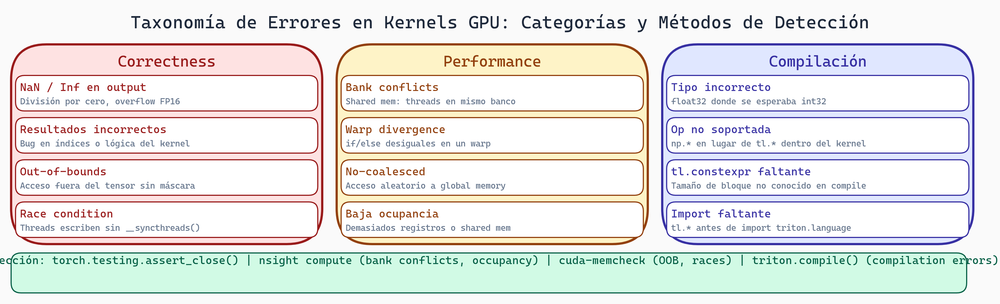

# Debugging de Kernels GPU y Taxonomía de Errores

> **Módulo:** Project 2 - GPU Computing & Kernel Optimization
> **Semana:** 7
> **Tiempo de lectura:** ~45 minutos

---

## Introducción

Los kernels GPU son notoriamente difíciles de debuggear. A diferencia de código CPU donde puedes inspeccionar paso a paso, en GPU los threads ejecutan en paralelo, los errores pueden ser silenciosos (resultados incorrectos sin crash), no determinísticos (race conditions), o difíciles de reproducir.

Esta lectura te enseña a **pensar como un detective de GPU** con una metodología sistemática para encontrar y clasificar errores.

---

## Objetivos de Aprendizaje

Al finalizar esta lectura, serás capaz de:

1. Clasificar errores de kernels GPU en una taxonomía
2. Detectar errores comunes (bounds, sync, indexing, dtype)
3. Aplicar técnicas de debugging específicas para GPU
4. Diseñar tests que detecten errores
5. Documentar errores para mejorar generadores

---

## Taxonomía de Errores en Kernels GPU

### Categoría 1: Errores de Compilación

```
1.1 Errores de sintaxis
    - Código Python/Triton malformado
    - Ejemplo: paréntesis desbalanceados

1.2 Errores de tipo
    - Tipos incompatibles en operaciones
    - Ejemplo: tl.dot(float32, int32)

1.3 Errores de constexpr
    - Valores no constantes donde se requiere constexpr
    - Ejemplo: BLOCK = variable_runtime

1.4 Errores de API
    - Uso incorrecto de funciones Triton
    - Ejemplo: tl.load sin pointer válido
```

### Categoría 2: Errores de Runtime

```
2.1 Out of bounds
    - Acceso a memoria fuera de límites
    - Puede crashear o dar resultados basura

2.2 Race conditions
    - Múltiples threads escriben al mismo lugar
    - Resultados no determinísticos

2.3 Deadlock (raro en Triton)
    - Sincronización incorrecta
    - Kernel nunca termina

2.4 Division by zero
    - Operación inválida
    - Puede dar inf/nan silenciosamente
```

### Categoría 3: Errores de Correctitud

```
3.1 Lógica incorrecta
    - El algoritmo no implementa la especificación
    - Ejemplo: softmax sin restar max (overflow)

3.2 Off-by-one
    - Índices incorrectos por 1
    - Ejemplo: offsets < n vs offsets <= n

3.3 Broadcasting incorrecto
    - Shapes no alineados correctamente

3.4 Reducción incompleta
    - No procesar todos los elementos
```

### Categoría 4: Errores de Performance

```
4.1 Memory coalescing violado
    - Accesos no coalescidos a memoria

4.2 Bank conflicts
    - Accesos conflictivos a shared memory

4.3 Occupancy bajo
    - Muchos registros o shared memory

4.4 Trabajo redundante
    - Recalcular valores innecesariamente
```

---

## Errores Comunes y Cómo Detectarlos

### Error 1: Acceso Fuera de Límites

**Síntomas:**
- Resultados incorrectos en últimos elementos
- Segmentation fault
- NaN inesperado

**Causa:**
```python
# Malo: no verificar límites
@triton.jit
def kernel_malo(x_ptr, y_ptr, n, BLOCK_SIZE: tl.constexpr):
    offsets = tl.program_id(0) * BLOCK_SIZE + tl.arange(0, BLOCK_SIZE)
    x = tl.load(x_ptr + offsets)  # ¿Qué si offsets >= n?
```

**Diagnóstico:**
```python
def test_bounds():
    # Probar con tamaños no divisibles por BLOCK_SIZE
    n = 1000
    BLOCK_SIZE = 256
    x = torch.randn(n, device='cuda')
    y = torch.empty_like(x)
    kernel[grid](x, y, n)
    # ¿Son los últimos elementos correctos?
```

**Solución:**
```python
@triton.jit
def kernel_bien(x_ptr, y_ptr, n, BLOCK_SIZE: tl.constexpr):
    pid = tl.program_id(axis=0)
    offsets = pid * BLOCK_SIZE + tl.arange(0, BLOCK_SIZE)
    mask = offsets < n
    x = tl.load(x_ptr + offsets, mask=mask, other=0.0)
    y = x * 2.0
    tl.store(y_ptr + offsets, y, mask=mask)
```

### Error 2: Race Conditions

**Síntomas:**
- Resultados corruptos cuando múltiples threads escriben
- Resultados no determinísticos

**Diagnóstico:**
```python
def test_determinismo():
    resultados = []
    for _ in range(10):
        y = kernel(x)
        resultados.append(y.clone())

    iguales = all(torch.allclose(r, resultados[0]) for r in resultados[1:])
    if not iguales:
        print("✗ Race condition probable")
```

**Solución:**
```python
@triton.jit
def kernel_bien(x_ptr, result_ptr, n, BLOCK_SIZE: tl.constexpr):
    pid = tl.program_id(axis=0)
    offsets = pid * BLOCK_SIZE + tl.arange(0, BLOCK_SIZE)
    mask = offsets < n
    x = tl.load(x_ptr + offsets, mask=mask, other=0.0)
    suma_bloque = tl.sum(x)
    # Usar atomic para acumular
    tl.atomic_add(result_ptr, suma_bloque)
```

### Error 3: Indexación 2D Incorrecta

**Síntomas:**
- Resultados transpuestos o permutados
- Patrón incorrecto visible

**Causa:**
```python
# Común: confundir row-major vs column-major
# PyTorch: row-major (C-contiguous)

# Malo
idx = pid_h + pid_w * height  # column-major
# Correcto
idx = pid_h * width + pid_w   # row-major
```

**Diagnóstico:**
```python
def test_indexacion_2d():
    matrix = torch.arange(50).reshape(10, 5).float()
    # matrix[3, 2] = 3*5 + 2 = 17
    out = kernel(matrix)
    assert out.flatten()[17] == expected_transform(17)
```

**Solución:**
```python
@triton.jit
def kernel_bien(matrix_ptr, out_ptr, height, width,
                BLOCK_H: tl.constexpr, BLOCK_W: tl.constexpr):
    h_idx = tl.program_id(0) * BLOCK_H + tl.arange(0, BLOCK_H)
    w_idx = tl.program_id(1) * BLOCK_W + tl.arange(0, BLOCK_W)
    h_2d = h_idx[:, None]
    w_2d = w_idx[None, :]
    linear_idx = h_2d * width + w_2d  # row-major
    mask = (h_2d < height) & (w_2d < width)
    data = tl.load(matrix_ptr + linear_idx, mask=mask, other=0.0)
    tl.store(out_ptr + linear_idx, data, mask=mask)
```

### Error 4: Tipo de Datos Incorrecto

**Síntomas:**
- Pérdida de precisión
- Overflow/underflow
- Resultados totalmente incorrectos

**Diagnóstico:**
```python
def test_dtype():
    x_float = torch.randn(1000, device='cuda', dtype=torch.float32)
    y = kernel(x_float)
    print(f"Input: min={x_float.min()}, max={x_float.max()}")
    print(f"Output: min={y.min()}, max={y.max()}")
    # Si output está fuera del rango razonable → dtype incorrecto
```

### Error 5: Divergencia de Warp

**Síntomas:**
- Kernel mucho más lento de lo esperado

**Solución:**
```python
# Usar máscaras en lugar de if
@triton.jit
def kernel_bien(x_ptr, y_ptr, n, BLOCK_SIZE: tl.constexpr):
    offsets = tl.program_id(0) * BLOCK_SIZE + tl.arange(0, BLOCK_SIZE)
    mask = offsets < n
    x = tl.load(x_ptr + offsets, mask=mask, other=0.0)
    condicion = offsets % 2 == 0
    y = tl.where(condicion, x * 2, x * 3)  # Sin divergencia
    tl.store(y_ptr + offsets, y, mask=mask)
```

---



> **Taxonomía de Errores en Kernels GPU**
>
> Los errores se clasifican en tres categorías: correctness (resultados incorrectos, OOB, condiciones de carrera), performance (divergencia de warps, accesos no coalescidos, baja occupancy) y compilación (sintaxis Triton, tipos incompatibles). Cada categoría requiere herramientas de diagnóstico distintas.

## Metodología de Debugging

### Paso 1: Reproducir el Error

```python
def create_minimal_reproduction(kernel, failing_input):
    """Reduce el caso de fallo al mínimo necesario."""
    sizes = [8, 16, 32, 64, 128, 256]

    for size in sizes:
        small_input = failing_input[:size]
        try:
            output = run_kernel(kernel, small_input)
            expected = reference(small_input)
            if not torch.allclose(output, expected):
                return small_input  # Encontramos caso mínimo
        except Exception:
            return small_input

    return failing_input
```

### Paso 2: Clasificar el Error

```python
def classify_error(kernel, failing_input):
    # Intenta compilar
    try:
        compile_kernel(kernel)
    except SyntaxError:
        return "COMPILATION_SYNTAX"
    except TypeError:
        return "COMPILATION_TYPE"

    # Intenta ejecutar
    try:
        output = run_kernel(kernel, failing_input)
    except RuntimeError as e:
        if "out of bounds" in str(e):
            return "RUNTIME_OOB"
        return "RUNTIME_OTHER"

    # Verifica correctitud
    expected = reference(failing_input)
    if not torch.allclose(output, expected):
        if torch.isnan(output).any():
            return "CORRECTNESS_NAN"
        return "CORRECTNESS_LOGIC"

    return "NONE"
```

### Paso 3: Aislar la Causa

```python
def isolate_cause(kernel_code, error_type):
    lines = kernel_code.split('\n')

    if error_type == "RUNTIME_OOB":
        for i, line in enumerate(lines):
            if 'tl.load' in line and 'mask=' not in line:
                return f"Línea {i}: load sin máscara"
            if 'tl.store' in line and 'mask=' not in line:
                return f"Línea {i}: store sin máscara"

    return "Causa no identificada automáticamente"
```

### Paso 4: Verificar Corrección Sistemática

```python
def test_kernel_correctness(kernel_fn, torch_fn):
    test_cases = [(10,), (256,), (257,), (1000,), (1000001,)]

    for size in test_cases:
        print(f"Probando tamaño {size}...", end=" ")
        x = torch.randn(*size, device='cuda')
        y_kernel = kernel_fn(x)
        y_torch = torch_fn(x)

        rel_error = (y_kernel - y_torch).abs().max() / (y_torch.abs().max() + 1e-8)

        if rel_error < 1e-5:
            print("✓")
        else:
            print(f"✗ Error: {rel_error}")
            mask = ~torch.isclose(y_kernel, y_torch, rtol=1e-5)
            print(f"  Errores en: {torch.nonzero(mask)[:5].tolist()}")
```

---

## Técnicas de Debugging para GPU

### Technique 1: Reference Testing

```python
def reference_test(kernel, inputs, reference_fn):
    output = run_kernel(kernel, inputs)
    expected = reference_fn(inputs)

    if not torch.allclose(output, expected, rtol=1e-5, atol=1e-5):
        diff = (output - expected).abs()
        print(f"Max diff: {diff.max().item()}")
        print(f"Mean diff: {diff.mean().item()}")

        wrong_indices = torch.where(diff > 1e-3)
        for idx in zip(*[i[:5] for i in wrong_indices]):
            print(f"  [{idx}]: got {output[idx]}, expected {expected[idx]}")
```

### Technique 2: Boundary Testing

```python
def boundary_test(kernel):
    test_cases = [
        {"name": "size_1", "shape": (1,)},
        {"name": "size_31", "shape": (31,)},   # < warp
        {"name": "size_32", "shape": (32,)},   # = warp
        {"name": "size_33", "shape": (33,)},   # > warp
        {"name": "all_zeros", "data": torch.zeros(256)},
        {"name": "very_large", "data": torch.full((256,), 1e30)},
        {"name": "very_small", "data": torch.full((256,), 1e-30)},
    ]

    for tc in test_cases:
        try:
            inputs = tc.get("data", torch.randn(tc["shape"])).cuda()
            output = run_kernel(kernel, inputs)
            expected = reference(inputs)
            print(f"{tc['name']}: {'✓' if torch.allclose(output, expected) else '✗'}")
        except Exception as e:
            print(f"{tc['name']}: ✗ ({e})")
```

### Technique 3: Determinism Testing

```python
def determinism_test(kernel, inputs, num_runs=10):
    outputs = [run_kernel(kernel, inputs).clone() for _ in range(num_runs)]
    reference = outputs[0]

    for i, out in enumerate(outputs[1:], 1):
        if not torch.equal(out, reference):
            diff = (out - reference).abs()
            print(f"Run {i} differs: max diff = {diff.max().item()}")
            print("WARNING: Non-deterministic behavior - possible race condition!")
            return False

    return True
```

---

## Test Suite para Kernels Generados

```python
class KernelTestSuite:
    def __init__(self, kernel, reference_fn):
        self.kernel = kernel
        self.reference = reference_fn
        self.results = []

    def run_all(self):
        self.test_compilation()
        self.test_basic_correctness()
        self.test_boundaries()
        self.test_determinism()
        return self.summarize()

    def test_compilation(self):
        try:
            x = torch.randn(128, device='cuda')
            _ = self.kernel(x)
            self.results.append(("compilation", True, None))
        except Exception as e:
            self.results.append(("compilation", False, str(e)))

    def test_basic_correctness(self):
        for shape in [(128,), (256, 256), (32, 64, 128)]:
            x = torch.randn(shape, device='cuda')
            try:
                output = self.kernel(x)
                expected = self.reference(x)
                correct = torch.allclose(output, expected, rtol=1e-4)
                self.results.append((f"correctness_{shape}", correct, None))
            except Exception as e:
                self.results.append((f"correctness_{shape}", False, str(e)))

    def summarize(self):
        passed = sum(1 for _, p, _ in self.results if p)
        total = len(self.results)
        failures = [(n, e) for n, p, e in self.results if not p]
        return {
            "passed": passed,
            "total": total,
            "pass_rate": passed / total if total > 0 else 0,
            "failures": failures
        }
```

---

## Documentación de Errores

### Error Report Template

```markdown
## Error Report: [ID]

### Descripción
[Breve descripción del error]

### Clasificación
- **Categoría:** [Compilación/Runtime/Correctitud/Performance]
- **Subcategoría:** [e.g., Out of bounds]
- **Severidad:** [Critical/High/Medium/Low]

### Reproducción
```python
x = torch.randn(256, device='cuda')
output = kernel(x)  # Falla aquí
```

### Análisis
- **Causa raíz:** [Explicación]
- **Línea problemática:** [Código]

### Corrección
```python
# Antes
x = tl.load(x_ptr + offsets)

# Después
x = tl.load(x_ptr + offsets, mask=offsets < N, other=0.0)
```
```

---

## Checklist de Debugging

```
[ ] Compila sin errores de sintaxis
[ ] Ejecuta sin crash CUDA
[ ] Verificar pequeños casos (n=10, n=256, n=257)
[ ] Verificar casos grandes (n=1000000)
[ ] Verificar tipos de datos
[ ] Verificar límites y máscaras
[ ] Comparar contra PyTorch
[ ] Verificar determinismo
[ ] Medir rendimiento
[ ] Identificar bottleneck (memory/compute)
```

---

## Resumen

- **Taxonomía**: 4 categorías (compilación, runtime, correctitud, performance)
- **Errores comunes**: bounds, race conditions, indexación, dtype, divergencia
- **Metodología**: Reproducir → Clasificar → Aislar → Verificar
- **Técnicas**: Reference, boundary, determinism testing
- **Test suite**: Framework completo para kernels

---

## Ejercicios

### Ejercicio 1: Detectar el Error

```python
@triton.jit
def kernel_buggy(x_ptr, y_ptr, n, BLOCK_SIZE: tl.constexpr):
    pid = tl.program_id(axis=0)
    offsets = pid * BLOCK_SIZE + tl.arange(0, BLOCK_SIZE)
    x = tl.load(x_ptr + offsets)  # ¿Error?
    y = tl.where(offsets >= n, x, 0.0)  # ¿Error?
    tl.store(y_ptr + offsets, y)  # ¿Error?
```

Identifica todos los problemas.

### Ejercicio 2: Clasificación

Para cada caso, identifica la categoría de error:
1. Load sin máscara
2. Softmax sin restar max
3. Índices column-major en tensor row-major

### Para Pensar

> *Si un error solo aparece con N=1000 pero no N=1024, ¿qué indica sobre la causa?*

---

*Esta lectura es parte del curso "Grammar-Constrained GPU Kernel Generation" - TC3002B*
