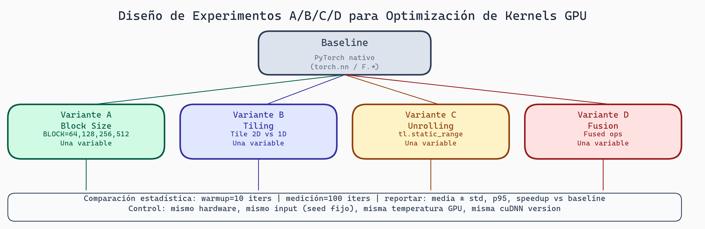

# Baseline y Experimentos: Medición Sistemática de Performance

> **Módulo:** Project 2 - GPU Computing & Kernel Optimization
> **Semana:** 8
> **Tiempo de lectura:** ~50 minutos

---

## Introducción

Antes de optimizar, necesitas saber **dónde estás**. Un baseline te da un punto de referencia confiable. Un diseño experimental sistemático te permite comparar variantes de forma rigurosa, evitando conclusiones falsas por varianza.

Esta lectura cubre cómo establecer baselines sólidos, diseñar experimentos A/B/C/D, y automatizar benchmarks.

---

## Objetivos de Aprendizaje

Al finalizar esta lectura, serás capaz de:

1. Establecer baselines confiables para kernels GPU
2. Diseñar benchmarks reproducibles
3. Diseñar experimentos con múltiples variantes
4. Calcular significancia estadística
5. Automatizar pipelines de benchmarking

---

## Estableciendo Baselines

### ¿Qué es un Baseline?

Un **baseline** es una medición de referencia que representa:
- El estado actual del sistema
- Un punto de comparación para mejoras
- Una garantía mínima de performance

### Fuentes de Baseline

```python
# 1. PyTorch nativo
def pytorch_baseline(x):
    return torch.softmax(x, dim=-1)

# 2. Biblioteca optimizada (cuDNN)
def cudnn_baseline(x):
    return F.softmax(x, dim=-1)

# 3. Implementación manual verificada
def reference_baseline(x):
    max_x = x.max(dim=-1, keepdim=True).values
    exp_x = torch.exp(x - max_x)
    return exp_x / exp_x.sum(dim=-1, keepdim=True)

# 4. Kernel Triton conocido
@triton.jit
def triton_baseline(...):
    pass
```

### Criterios de un Buen Baseline

```
✓ Correcto
  - Produce resultados matemáticamente correctos
  - Verificado contra múltiples implementaciones

✓ Reproducible
  - Mismos inputs → mismos outputs
  - Misma performance en múltiples ejecuciones

✓ Representativo
  - Refleja uso realista del kernel
  - Tamaños de datos típicos

✓ Documentado
  - Hardware donde se midió
  - Configuración de software
  - Fecha de medición
```

---

## Benchmarking Sistemático

### Estructura de un Benchmark

```python
@dataclass
class BenchmarkConfig:
    name: str
    kernel_fn: Callable
    input_generator: Callable
    sizes: List[int]
    warmup_iterations: int = 10
    benchmark_iterations: int = 100
    dtype: torch.dtype = torch.float32

@dataclass
class BenchmarkResult:
    config: BenchmarkConfig
    size: int
    mean_time_ms: float
    std_time_ms: float
    min_time_ms: float
    max_time_ms: float
    throughput_gbps: float
```

### Medición Correcta

```python
def benchmark_kernel(config: BenchmarkConfig, size: int) -> BenchmarkResult:
    """Mide performance de un kernel correctamente."""
    inputs = config.input_generator(size, config.dtype)

    # Warmup (importante para JIT)
    # WARMUP CRÍTICO: Primera ejecución incluye JIT compilation + CUDA init +
    # GPU frequency scaling. Sin warmup: mediciones 25x más lentas.
    # Mínimo 10-20 iteraciones antes de medir.
    for _ in range(config.warmup_iterations):
        _ = config.kernel_fn(*inputs)
    torch.cuda.synchronize()

    # Benchmark
    times = []
    for _ in range(config.benchmark_iterations):
        torch.cuda.synchronize()
        start = torch.cuda.Event(enable_timing=True)
        end = torch.cuda.Event(enable_timing=True)

        start.record()
        _ = config.kernel_fn(*inputs)
        end.record()

        torch.cuda.synchronize()
        times.append(start.elapsed_time(end))

    times = np.array(times)
    return BenchmarkResult(
        config=config,
        size=size,
        mean_time_ms=times.mean(),
        std_time_ms=times.std(),
        min_time_ms=times.min(),
        max_time_ms=times.max(),
        throughput_gbps=calculate_throughput(size, times.mean())
    )
```

### Errores Comunes

```python
# ERROR 1: No sincronizar
start = time.time()
output = kernel(x)
end = time.time()  # Mide lanzamiento, no ejecución

# CORRECTO:
torch.cuda.synchronize()
start = time.time()
output = kernel(x)
torch.cuda.synchronize()
end = time.time()

# ERROR 2: No hacer warmup
# Primeras iteraciones incluyen JIT compilation

# ERROR 3: Incluir overhead de Python
for i in range(100):
    result = kernel(input_list[i])  # List indexing cada vez
```

---



> **Diseño de Experimentos de Rendimiento**
>
> Un experimento bien diseñado controla las variables, calienta la GPU antes de medir, repite N veces para calcular media y desviación estándar, y varía parámetros de forma sistemática. Evitar sesgos de medición (warmup, sincronización, overhead Python) es tan importante como el diseño del kernel.

## Diseño de Experimentos A/B/C/D

### Estructura de un Experimento

```
Experimento: "Comparar tamaños de bloque para softmax"

Hipótesis: BLOCK_SIZE=256 será más rápido que BLOCK_SIZE=128 para N>1024

Variables:
  - Independiente: BLOCK_SIZE (128, 256, 512, 1024)
  - Dependiente: Tiempo de ejecución (ms)
  - Controladas: GPU, input size, dtype, num_warmup

Configuraciones:
  A: BLOCK_SIZE=128 (baseline)
  B: BLOCK_SIZE=256
  C: BLOCK_SIZE=512
  D: BLOCK_SIZE=1024
```

### Definición en Código

```python
@dataclass
class ExperimentConfig:
    name: str
    hypothesis: str
    variants: Dict[str, Dict]  # A, B, C, D -> parameters
    controlled_variables: Dict[str, Any]
    metrics: List[str]
    num_repetitions: int = 100
    input_sizes: List[int] = field(default_factory=lambda: [256, 1024, 4096])

experiment = ExperimentConfig(
    name="block_size_comparison",
    hypothesis="Larger BLOCK_SIZE improves performance for large inputs",
    variants={
        "A": {"BLOCK_SIZE": 128},
        "B": {"BLOCK_SIZE": 256},
        "C": {"BLOCK_SIZE": 512},
        "D": {"BLOCK_SIZE": 1024},
    },
    controlled_variables={
        "dtype": torch.float32,
        "warmup_iterations": 20,
        "device": "cuda:0",
    },
    metrics=["time_ms", "throughput_gbps"],
)
```

### Tipos de Variantes

```python
# Tipo 1: Variantes de parámetros
variants_block_size = {
    "A": {"BLOCK_M": 64, "BLOCK_N": 64},
    "B": {"BLOCK_M": 128, "BLOCK_N": 64},
    "C": {"BLOCK_M": 64, "BLOCK_N": 128},
    "D": {"BLOCK_M": 128, "BLOCK_N": 128},
}

# Tipo 2: Variantes de algoritmo
variants_algorithm = {
    "A": "sequential_reduction",
    "B": "tree_reduction",
    "C": "warp_shuffle",
    "D": "cooperative_groups",
}

# Tipo 3: Variantes de optimización
variants_optimization = {
    "A": {"vectorize": False, "prefetch": False},
    "B": {"vectorize": True, "prefetch": False},
    "C": {"vectorize": False, "prefetch": True},
    "D": {"vectorize": True, "prefetch": True},
}
```

---

## Control de Variables

### Variables Confusoras

```
⚠️ Variables que pueden afectar resultados:

1. Estado de GPU
   - Temperatura (thermal throttling)
   - Otros procesos usando GPU
   - Power management state

2. Estado de sistema
   - Otros procesos en CPU
   - Memoria disponible
   - Estado del cache

3. Varianza de medición
   - Overhead de lanzamiento
   - Scheduling de OS
```

### Mitigación

```python
def prepare_experiment():
    """Prepara entorno para experimento reproducible."""
    # 1. Limpiar GPU
    torch.cuda.empty_cache()
    torch.cuda.synchronize()

    # 2. Establecer semilla
    torch.manual_seed(42)
    torch.cuda.manual_seed(42)

    # 3. Calentar GPU
    warm_up_gpu()

    # 4. Verificar no hay otros procesos
    if torch.cuda.memory_allocated() > 0:
        print("WARNING: GPU memory already in use")

def run_randomized_experiment(experiment: ExperimentConfig):
    """Ejecuta con orden randomizado."""
    combinations = [
        (variant, size)
        for variant in experiment.variants
        for size in experiment.input_sizes
    ]
    random.shuffle(combinations)  # Evitar efectos temporales

    results = defaultdict(list)
    for variant, size in combinations:
        prepare_experiment()
        times = measure_kernel(experiment.variants[variant], size)
        results[(variant, size)].extend(times)

    return results
```

---

## Análisis Estadístico

### Comparación de Variantes

```python
from scipy import stats

def compare_variants(results: Dict, baseline: str = "A"):
    """Compara todas las variantes contra baseline."""
    comparisons = {}
    baseline_results = results[baseline]

    for variant, variant_results in results.items():
        if variant == baseline:
            continue

        # Test t
        t_stat, p_value = stats.ttest_ind(baseline_results, variant_results)

        # Tamaño del efecto (Cohen's d)
        pooled_std = np.sqrt(
            (np.var(baseline_results) + np.var(variant_results)) / 2
        )
        cohens_d = (np.mean(baseline_results) - np.mean(variant_results)) / pooled_std

        # Speedup
        speedup = np.mean(baseline_results) / np.mean(variant_results)

        comparisons[variant] = {
            "mean_baseline": np.mean(baseline_results),
            "mean_variant": np.mean(variant_results),
            "speedup": speedup,
            "p_value": p_value,
            "significant": p_value < 0.05,
            "cohens_d": cohens_d,
        }

    return comparisons

def interpret_cohens_d(d: float) -> str:
    d = abs(d)
    if d < 0.2: return "negligible"
    elif d < 0.5: return "small"
    elif d < 0.8: return "medium"
    else: return "large"
```

### ANOVA

```python
def anova_analysis(results: Dict):
    """ANOVA para comparar múltiples grupos."""
    groups = [results[v] for v in sorted(results.keys())]
    f_stat, p_value = stats.f_oneway(*groups)

    return {
        "f_statistic": f_stat,
        "p_value": p_value,
        "significant": p_value < 0.05,
        "interpretation": (
            "Al menos una variante es significativamente diferente"
            if p_value < 0.05
            else "No hay diferencias significativas"
        )
    }
```

---

## Automatización

### Pipeline de Benchmarks

```python
class BenchmarkPipeline:
    def __init__(self, config_path: str):
        self.config = self.load_config(config_path)
        self.results_dir = Path(self.config["results_dir"])
        self.results_dir.mkdir(parents=True, exist_ok=True)

    def run(self) -> Dict:
        all_results = {}

        for benchmark_config in self.config["benchmarks"]:
            print(f"Running {benchmark_config['name']}...")
            results = []

            for size in benchmark_config["sizes"]:
                result = benchmark_kernel(
                    BenchmarkConfig(**benchmark_config), size
                )
                results.append(result)
                self.save_intermediate(result)

            all_results[benchmark_config["name"]] = results

        self.save_final(all_results)
        self.generate_report(all_results)
        return all_results
```

### Configuración YAML

```yaml
# benchmark_config.yaml
results_dir: "./benchmark_results"
hardware:
  gpu: "NVIDIA A100"
  cuda_version: "12.2"

benchmarks:
  - name: "softmax"
    kernel_fn: "kernels.softmax_triton"
    baseline_fn: "torch.softmax"
    sizes: [256, 512, 1024, 2048, 4096, 8192]
    warmup_iterations: 20
    benchmark_iterations: 200

regression_threshold: 0.05  # 5% = regression
```

### Integración CI/CD

```yaml
# .github/workflows/benchmark.yml
name: Performance Benchmarks

on:
  push:
    branches: [main]
  pull_request:

jobs:
  benchmark:
    runs-on: [self-hosted, gpu]
    steps:
      - uses: actions/checkout@v3

      - name: Run benchmarks
        run: python -m benchmark_pipeline --config ci_config.yaml

      - name: Check regressions
        run: |
          python -m check_regressions \
            --current results/current \
            --baseline results/baseline \
            --threshold 0.05 \
            --fail-on-regression
```

---

## Detección de Regresiones

```python
def detect_regressions(
    current_results: List[BenchmarkResult],
    baseline_results: List[BenchmarkResult],
    threshold: float = 0.05
) -> List[Regression]:
    regressions = []

    for current in current_results:
        baseline = find_matching_baseline(current, baseline_results)
        if baseline is None:
            continue

        change = (current.mean_time_ms - baseline.mean_time_ms) / baseline.mean_time_ms

        if change > threshold:
            regressions.append(Regression(
                benchmark=current.config.name,
                size=current.size,
                baseline_ms=baseline.mean_time_ms,
                current_ms=current.mean_time_ms,
                degradation_pct=change * 100
            ))

    return regressions
```

---

## Resumen

- **Baselines**: Referencias confiables para comparar
- **Benchmarking**: Warmup, sincronización, estadísticas
- **Experimentos A/B/C/D**: Diseño sistemático con control de variables
- **Análisis**: ANOVA, t-tests, tamaño del efecto
- **Automatización**: Pipelines, CI/CD, detección de regresiones

---

## Ejercicios

### Ejercicio 1: Diseña Experimento

Compara:
- A: Softmax naive
- B: Softmax con online normalization
- C: Softmax con tiling
- D: Flash softmax

Define variables, métricas, y tamaños.

### Ejercicio 2: Analiza Resultados

```
A: [1.2, 1.3, 1.1, 1.2, 1.4]
B: [1.0, 1.1, 0.9, 1.0, 1.1]
C: [0.8, 0.9, 0.8, 0.7, 0.8]
D: [0.85, 0.9, 0.88, 0.87, 0.86]
```

1. ¿Hay diferencias significativas?
2. ¿Cuál es la mejor variante?

### Para Pensar

> *Si la variante B es 20% más rápida pero tiene varianza 3x mayor, ¿cuál elegirías para producción?*

---

*Esta lectura es parte del curso "Grammar-Constrained GPU Kernel Generation" - TC3002B*
