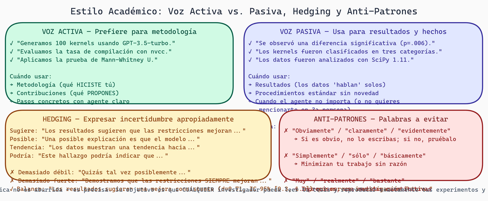

# Estilo Académico: La Voz Profesional de tu Investigación

> **Módulo:** Research
> **Semana:** 6
> **Tiempo de lectura:** ~27 minutos

---

## Introducción

¿Alguna vez has leído un artículo de investigación de un profesor y pensaste "¿por qué suena tan diferente a mi escritura normal?" No es accidente. Existe una convención profesional en la escritura académica—una "voz" o "tono" que los investigadores usan. Esta voz comunica autoridad, rigor, y confianza en los hallazgos.

Aprender a escribir con esta voz no es cambiar quién eres. Es aprender un nuevo registro del lenguaje, como aprender a hablar formalmente en una entrevista de trabajo versus con amigos. Una vez que practicas, se vuelve natural.

En esta lectura aprenderás las convenciones clave: cómo usar voz activa vs. pasiva estratégicamente, cómo "hedging" (expresar incertidumbre apropiadamente), cómo presentar resultados negativos sin parecer que fracasaste, y cómo diseñar figuras y tablas que comunican claramente.

---

## Objetivos de Aprendizaje

Al finalizar esta lectura, serás capaz de:

1. Identificar y escribir en el estilo académico estándar
2. Usar voz activa vs. pasiva estratégicamente según contexto
3. Aplicar "hedging" lingüístico para expresar incertidumbre apropiadamente
4. Presentar resultados negativos o inesperados de manera constructiva
5. Diseñar figuras y tablas que cumplen estándares APA/IEEE

---

## La Voz Académica: No es Aburrido, es Preciso

Un mito común: "La escritura académica es aburrida." No es verdad. Es **precisa**. Hay diferencia.

### Comparación

**❌ Informal/No-académico:**
"Entonces, lo que pasó fue que nuestro modelo fue realmente preciso, casi 92% de las veces, lo cual es bastante increíble."

**✅ Académico:**
"El modelo alcanzó una precisión sintáctica del 92%, representando una mejora significativa sobre el baseline."

¿Ves la diferencia? La versión académica:
- Especifica qué es el 92% (precisión sintáctica, no "preciso en general")
- Evita evaluaciones subjetivas ("bastante increíble")
- Coloca el resultado en contexto ("mejora sobre el baseline")
- Usa lenguaje más formal ("alcanzó", no "fue realmente")

### Características del Estilo Académico

**Especificidad:** Cada término tiene un significado preciso

- ❌ "El rendimiento mejoró"
- ✅ "La latencia de generación se redujo de 400ms a 320ms (20% mejora)"

**Evidencia:** Las afirmaciones están respaldadas

- ❌ "Las restricciones gramaticales mejoran kernels"
- ✅ "Nuestros resultados muestran que las restricciones gramaticales mejoran la validez sintáctica (p < 0.01)"

**Impersonalidad moderada:** No es sobre ti, es sobre la investigación

- ❌ "Creo que hicimos un descubrimiento increíble"
- ✅ "Los resultados sugieren un hallazgo importante"

> 💡 **Concepto clave:** La voz académica priroriza precisión sobre entretención. Suena "formal", pero eso es porque excluye ruido y ambigüedad.

---

## Voz Activa vs. Pasiva: Estrategia Consciente



> **Estilo Académico: Voz Activa vs. Pasiva, Hedging y Errores a Evitar**
>
> Panel izquierdo: comparación Voz Activa vs. Voz Pasiva con ejemplos del dominio y cuándo usar cada una. Panel derecho: técnicas de hedging (verbos epistémicos, adverbios de probabilidad, frases de atenuación) con ejemplos concretos. Panel inferior: anti-patrones de estilo académico más comunes y sus correcciones.

Muchos estudiantes evitan la voz activa creyendo que "suena más académica." De hecho, es lo opuesto: investigación moderna prefiere voz activa cuando es clara.

### Voz Activa

**Estructura:** Sujeto + verbo + objeto

"El equipo condujo 50 experimentos."

**Ventajas:**
- Claro quién hizo qué
- Más dinámico de leer
- Menos palabras típicamente

### Voz Pasiva

**Estructura:** Objeto + "fue" + verbo por sujeto

"Cincuenta experimentos fueron conducidos por el equipo."
O, sin sujeto: "Cincuenta experimentos fueron conducidos."

**Ventajas:**
- Enfatiza la acción, no el agente
- Útil cuando el agente es obvio o desconocido

### Cuándo Usar Cada Una

**Usa activa cuando:**
- El agente (quién realizó la acción) es importante
- Quieres claridad (¿quién hizo esto?)
- La oración es larga (activa es más corta)

"Nosotros evaluamos 1500 kernels en el dataset de prueba."

**Usa pasiva cuando:**
- El proceso importa más que el agente
- El agente es obvio (se entiende del contexto)
- Es convencional en el campo

"Se observó que la validez sintáctica mejoraba con restricciones." (El agente—los investigadores—es obvio)

**Regla de oro:** La mayoría (70%+) de tu tesis debería ser voz activa. Usa pasiva selectivamente.

---

## Hedging: Expresar Incertidumbre Apropiadamente

"Hedging" significa expresar incertidumbre o cautela. En investigación, esto es no solo aceptable; es esperado. Nadie puede estar 100% seguro de algo.

### Técnicas de Hedging

**1. Verbos hedged**

- ❌ "Las restricciones mejoran la calidad" (muy absoluto)
- ✅ "Las restricciones parecen mejorar la calidad" (hedged)
- ✅ "Las restricciones pueden mejorar la calidad" (hedged)

Verbos útiles: suggest, indicate, appear, seem, may, tend to, contribute to

**2. Adverbios hedged**

- ❌ "Siempre mejoramos el rendimiento"
- ✅ "A menudo mejoramos el rendimiento"
- ✅ "Típicamente mejoramos el rendimiento"

Adverbios útiles: generally, typically, often, frequently, potentially, arguably

**3. Cuantificadores hedged**

- ❌ "Todos los kernels compilaron"
- ✅ "Aproximadamente el 92% de los kernels compilaron"
- ✅ "La mayoría (92%) de los kernels compilaron"

**4. Cláusulas hedged**

- ❌ "Las restricciones mejoran la seguridad"
- ✅ "Las restricciones parecen mejorar la seguridad, aunque investigación adicional es necesaria"
- ✅ "Dentro del alcance de nuestro estudio, las restricciones mejoran la seguridad"

### El Balance Correcto

**Demasiado hedging:**
"Los resultados podrían sugerir, posiblemente, que las restricciones quizás mejoren la seguridad, en teoría."

Suena inseguro. Nadie te creerá.

**No hay hedging:**
"Las restricciones mejoran la seguridad."

Suena absolutista. Y si alguien encuentra una excepción, pareces desinformado.

**Balance correcto:**
"Nuestros resultados indican que las restricciones mejoran la seguridad sintáctica en un 92% de casos, aunque casos edge casos persisten."

Suena confiado pero honesto.

> 💡 **Consejo práctico:** Escribe tu primer borrador sin hedging. Luego, en la revisión, agrega hedging estratégicamente donde hay incertidumbre legítima.

---

## Presentación de Resultados Negativos o Inesperados

Aquí está la verdad incómoda: A veces, tus resultados no son lo que esperabas. Quizás una condición fue peor, no mejor. Quizás algo falló.

### El Riesgo de Ocultar

Un grave error es "spin" (sesgar) resultados. Por ejemplo:
- Esperabas A > B
- Obtuviste A < B
- Reportas solo como "A y B son diferentes" (ocultando dirección)

Esto es deshonesto. Se descubre. Te hace parecer poco confiable.

### Cómo Presentar Resultados Negativos Constructivamente

**1. Sé honesto y directo**

"Contrario a nuestra hipótesis, el modelo con restricciones EBNF fue 15% más lento que el modelo sin restricciones (p < 0.05)."

No minimices. No gires.

**2. Proporciona contexto explicativo**

"Este resultado fue inesperado. Analizamos logs y encontramos que la implementación actual de EBNF introduce overhead significativo en el paso de compilación de gramática, el cual no fue optimizado."

Explica por qué crees que sucedió. Esto convierte "resultado negativo" en "insight".

**3. Discute implicaciones**

"Aunque esto sugiere que EBNF puede ser impracticable en aplicaciones latency-sensitive, los resultados también indican que optimización de la compilación de gramática podría recuperar la mayoría del overhead (basado en análisis de profiling)."

Aún tiene valor. Señala dirección para trabajo futuro.

**4. Integra en narrativa más amplia**

"Mientras el enfoque EBNF fue más lento, resultó ser más preciso (94% vs. 88%). Esta es una verdadera tradeoff: velocidad vs. precisión."

No es un fracaso. Es un hallazgo interesante sobre un tradeoff fundamental.

---

## Figuras y Tablas: Diseño Efectivo

Las figuras y tablas son dónde tus resultados "viven". Un gráfico mal diseñado puede confundir y obscurecer incluso resultados hermosos.

### Estándares APA / IEEE

Ambos estándares requieren:
- Números (Figure 1, Table 3), sin punto final
- Captions debajo de figuras, arriba de tablas
- Caption auto-explicatorio (alguien debería entender la figura sin leer el texto)
- Fuente citada (si datos de otra fuente)
- Citas en texto ("como se muestra en la Figura 1...")

Ejemplo IEEE:

```
Table 1. Comparison of Grammar-Constrained Generation Methods

| Method | Overhead (%) | Precis (%) | Framework |
|--------|-------------|-----------|-----------|
| Baseline | 0 | 78 | N/A |
| Outlines | 8 | 85 | Guidance |
| EBNF | 15 | 94 | XGrammar |

*Precision sintáctica evaluada en 1500 kernels. Overhead medido contra baseline sin restricciones.*
```

### Principios de Buen Diseño

**1. Claridad sobre ornamentación**

- ❌ Colores arcoíris, efectos 3D, fondos texturizados
- ✅ Colores de alto contraste, líneas limpias, fondo simple

**2. Etiquetas explícitas**

- ❌ Eje Y es simplemente "Score"
- ✅ Eje Y es "Syntactic Validity (%)"

**3. Escalas sensatas**

- ❌ Gráfico donde Y va de 0-100 pero tus datos va de 70-95 (exagera diferencias)
- ✅ Gráfico donde Y escala sensatamente a tu rango de datos

**4. Leyendas en lugar de colores mágicos**

- ❌ "El rojo es mejor" (¿por qué? alguien color-ciego no lo entiende)
- ✅ Leyenda explícita: "Rojo = Modelo con restricciones, Azul = Baseline"

**5. Citas completas**

- ❌ "Comparado con [2]"
- ✅ "Comparado con Smith et al. (2023)"

> 💡 **Consejo práctico:** Crea figuras para ti (en borrador) pero rediseña para la audiencia (en final). "¿Qué necesita una persona nueva entender de este gráfico?"

---

## Errores Comunes de Estilo Académico

**Error 1: Cambio de voz medio-camino**

"El modelo fue entrenado en 10,000 kernels. Luego lo evaluamos. El modelo demostró..."

(Nota: pasiva, luego activa, luego activa. Inconsistente.)

Solución: Elige una voz y mantente.

**Error 2: Lenguaje coloquial**

"Nuestro modelo es realmente genial porque..."

Solución: "Nuestro modelo demuestra ventajas significativas..."

**Error 3: Ambigüedad de antecedentes**

"El modelo supera el baseline porque tiene menos parámetros. Esto es importante porque..."

(¿A qué se refiere "esto"? ¿Que el modelo es mejor? ¿Que tiene menos parámetros? ¿Que fue importante?)

Solución: Repite el referente: "Esta eficiencia de parámetros es importante porque..."

**Error 4: Abreviaciones sin contexto**

"El modelo usa CNN para..." (¿Qué es CNN si el lector no lo sabe?)

Solución: "El modelo usa redes neuronales convolucionales (CNN) para..."

**Error 5: Tense inconsistente**

"Nosotros entrenamos el modelo. El modelo era evaluado en..."

(Pasado + pasado, pero estructura inconsistente)

Solución: Sé consistente: "Entrenamos el modelo. Lo evaluamos en..."

---

## Tu Guía de Estilo Personal

Desarrolla una guía de referencia para ti mismo mientras escribes. Ejemplo:

```
Mi Guía de Estilo para esta Tesis:

Voz activa vs. pasiva:
- Activa cuando describe nuestro trabajo
- Pasiva cuando describe resultados de otros

Hedging:
- Uso "suggest" / "indicate" para inferencias
- Uso "show" / "demonstrate" para resultados directos
- Evito absolutismo absoluto

Jerga técnica:
- Primera ocurrencia: Defino
- Ocurrencias después: Uso libremente

Figuras / Tablas:
- Captions de 1-2 oraciones
- Colores: Azul (baseline), Rojo (propuesto)
- Leyendas always incluidas
```

---

## Resumen

En esta lectura exploramos:

- **Voz académica:** Precisa sobre entretenida, formal sobre casual
- **Voz activa vs. pasiva:** Principalmente activa, pero pasiva estratégicamente
- **Hedging:** Expresar incertidumbre apropiadamente, balance entre confianza y honestidad
- **Resultados negativos:** Presenterlos honestamente, proporcionar contexto, extraer insights
- **Figuras y tablas:** Diseño claro, etiquetas explícitas, estándares APA/IEEE

---

## Ejercicios y Reflexión

### Preguntas de comprensión

1. ¿Cuál es la diferencia entre "escritura académica" y "escritura aburrida"? ¿Son lo mismo?

2. ¿Cuándo preferirías voz activa vs. pasiva en una tesis? Proporciona ejemplos.

3. Si obtuviste un resultado que contradice tu hipótesis, ¿cómo lo presentarías honestamente?

### Ejercicio práctico

**Tarea 1: Conversión de Estilo (30 minutos)**

Reescribe estas oraciones en estilo académico:

1. "Nuestro modelo es realmente genial y supera al baseline por un montón."
2. "Obviamente, las restricciones son mejores porque producen kernels que compilan."
3. "No sabemos por qué el modelo fue lento, la razón es un misterio."
4. "El modelo falló a veces, pero usualmente funcionó bien."

**Tarea 2: Voz Activa vs. Pasiva (25 minutos)**

Escribe 3 pares de oraciones (una activa, una pasiva) sobre tu investigación. Para cada par, explica qué versión preferirías en tu tesis y por qué.

Ejemplo:
- Activa: "Entrenamos el modelo en 10,000 kernels."
- Pasiva: "El modelo fue entrenado en 10,000 kernels."
- Preferencia: Activa, porque el agente (nosotros) es importante.

**Tarea 3: Diseñar una Figura (45 minutos)**

Identifica un resultado clave de tu investigación. Diseña una figura (puede ser en papel, Excel, o describir en detalle) que comunique este resultado. Asegúrate de que:
- Tenga título y caption
- Tenga ejes claramente etiquetados
- Tenga leyenda si necesario
- Un novato pudiera entenderlo sin leer el texto

**Tarea 4: Presentar un Resultado Negativo (20 minutos)**

Imagina que uno de tus experimentos falló o produjo resultados inesperados. Escribe 2-3 oraciones presentando esto honestamente, proporcionando contexto, y extrayendo insight constructivo.

### Para pensar

> *¿Cómo cambia tu comprensión de un resultado si está escrito ambiguamente versus con claridad? ¿Por qué importa cómo escribes tus resultados, además de cuáles son?*

---

## Próximos pasos

Con estilo académico dominado, estás listo para la sección más técnica: **Resultados**. Aquí presentarás tus hallazgos con rigor, usarás todos los principios de figura/tabla design, y aplicarás hedging apropiadamente. Verás cómo el estilo académico te ayuda a comunicar findings complejos con claridad.

---

*Esta lectura es parte del curso "Grammar-Constrained GPU Kernel Generation" - TC3002B*
