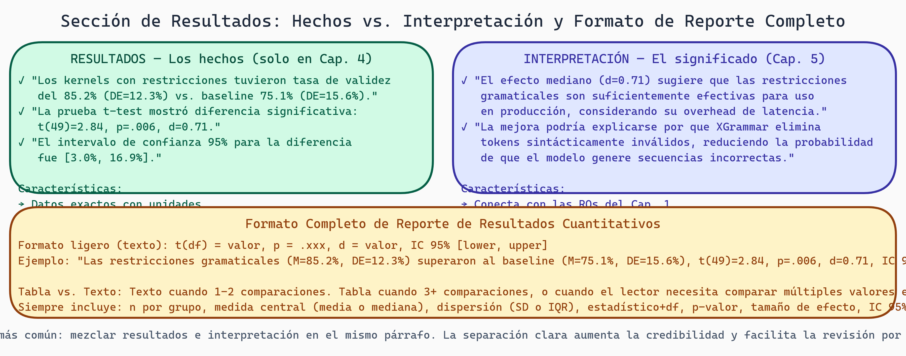

# Sección de Resultados: Presentar lo Que Encontraste con Rigor

> **Módulo:** Research
> **Semana:** 7
> **Tiempo de lectura:** ~26 minutos

---

## Introducción

Tu sección de Resultados es donde toda tu investigación converge en un punto: qué encontraste, presentado con claridad y rigor. Muchos estudiantes cometen el error de confundir "Resultados" con "Interpretación"—dos cosas distintas.

Resultados es: "Aquí están los números, aquí está el gráfico."

Interpretación es: "¿Qué significa esto? ¿Por qué sucedió? ¿Es importante?"

En esta lectura aprenderás a separar estas responsabilidades, presentar resultados cuantitativos con estadísticas apropiadas, interpretar la significancia estadística vs. significancia práctica, y estructurar una sección que el lector puede seguir fácilmente.

---

## Objetivos de Aprendizaje

Al finalizar esta lectura, serás capaz de:

1. Presentar resultados cuantitativos con contexto y claridad
2. Distinguir entre significancia estadística y significancia práctica
3. Escribir captions de figuras y tablas que son auto-explicatorios
4. Estructurar la sección de Resultados de forma lógica
5. Integrar figuras, tablas, y texto de manera coherente

---

## Resultados vs. Interpretación: Distinción Crítica

Muchas tesis mezclan esto. Es un error.

### Resultados (Los Hechos)

"Observamos X"

- Número bruto de kernels compilados: 1,245 de 1,500
- Latencia promedio: 325ms ± 45ms
- Tasa de error: 17%

Sin interpretación. Solo datos.

### Interpretación (El Significado)

"¿Qué significa X?"

- "La tasa de compilación del 83% sugiere que las restricciones redujeron significativamente errores de sintaxis"
- "El overhead de 325ms es aceptable para aplicaciones no-latency-sensitive"
- "La variancia alta (±45ms) sugiere que algunos kernels son mucho más complejos que otros"

### Estructura Estándar

**Sección de Resultados:** Presenta datos, figuras, tablas
**Sección de Discusión:** Interpreta qué significan, implicaciones

Algunas tesis combinan estas ("Resultados y Discusión"), lo cual está bien, pero aún deben estar separadas conceptualmente.

> 💡 **Concepto clave:** En Resultados, tu trabajo es comunicar; en Discusión, tu trabajo es explicar.



> **Resultados vs. Interpretación: La Distinción que Define Rigor Científico**
>
> Dos columnas en paralelo: Resultados (Cap. 4 — hechos, datos crudos, tablas y figuras sin juicio de valor) vs. Interpretación (Cap. 5 — significado, conexión con literatura, limitaciones reconocidas). Panel inferior: formato completo de reporte cuantitativo con todos los elementos obligatorios (M, DE, estadístico, p-valor, d de Cohen, IC 95%).

---

## Presentación de Resultados Cuantitativos

Números crudos son confusos. Contexto y formato hacen diferencia.

### Formato: Completo vs. Ligero

**Completo (necesario para hallazgos principales):**
"El modelo con restricciones EBNF alcanzó una validez sintáctica del 94.3% (1,414 de 1,500 kernels compilaron exitosamente), una mejora de 16.3 puntos porcentuales sobre el baseline (78.0%, 1,170 de 1,500). Este resultado fue estadísticamente significativo (t(1498) = 12.47, p < 0.001, d = 0.64)."

Observa que incluye:
- Métrica (validez sintáctica)
- Porcentaje (94.3%)
- Números crudos (1,414 de 1,500)
- Comparación (16.3 puntos porcentuales sobre baseline)
- Estadísticas (t-test, p-valor, effect size)

**Ligero (aceptable para resultados secundarios):**
"La latencia también se redujo significativamente en el modelo con restricciones (M = 312ms, SD = 38ms, comparado con 425ms, SD = 52ms para el baseline)."

Observa M = mean, SD = standard deviation. Formato reconocido.

### Tabla vs. Texto

¿Cuándo presentas números en tabla vs. en párrafo?

**Tabla si:**
- Comparas muchos métodos (3+)
- Hay muchas métricas (4+)
- El lector necesita buscar un número específico

**Texto si:**
- Comparas 2 métodos
- 1-2 métricas
- Es un hallazgo central que merece énfasis

### Ejemplo: Estructura de Tabla

```
Table 2. Comparison of Grammar-Constrained Generation Methods on Test Set (N=1,500)

Method                  Syntactic    Speed        Memory      Implementation
                        Validity (%) (ms/kernel)  (MB)        Complexity

Baseline (no constraints)   78.0        425 ± 52     2.1         Simple
Regex (Outlines)           85.2*       398 ± 48     2.3         Moderate
EBNF (XGrammar)            94.3**      312 ± 38     3.8         Complex

*p < 0.05 vs. Baseline; **p < 0.001 vs. Baseline
M = mean, SD = standard deviation
```

Caption:
"Table 2. Validation metrics for three grammar-constrained generation approaches evaluated on 1,500 CUDA kernels from the test set. Significance tested with independent samples t-tests."

### Significancia Estadística vs. Práctica

**Significancia Estadística**

Responde: "¿Es este resultado probablemente debido a chance o a un efecto real?"

Determinado por: p-valores, effect sizes, intervalos de confianza

Ejemplo: p < 0.05 significa menos del 5% de chance de observar esto si no hay efecto real.

**Significancia Práctica**

Responde: "¿Importa este resultado en el mundo real?"

Determinado por: effect size, implicaciones prácticas

Ejemplo: Mejorar de 78% a 79% de validez sintáctica es estadísticamente significativo (si N es grande) pero quizás no sea prácticamente importante.

### La Relación

- Pequeño efecto + gran N = estadísticamente significativo pero quizás no importante prácticamente
- Grande efecto + pequeño N = no significativo estadísticamente pero podría ser importante si se confirma

**Mejor práctica:** Reporta ambas:

"El modelo con restricciones mejoró validez sintáctica de 78% a 94% (p < 0.001), un efecto grande (d = 0.64) que es importante tanto estadística como prácticamente. Este tipo de mejora afecta aplicaciones reales donde errores de compilación bloquean generación."

> 💡 **Consejo práctico:** Cuando reportes p-valores, también reporta effect sizes. P-valores solamente sin effect sizes es incompleto.

---

## Estructurando la Sección de Resultados

Una sección de Resultados bien estructurada guía al lector lógicamente a través de tus hallazgos.

### Estructura Recomendada

**1. Vista General / Resumen Ejecutivo (1-2 párrafos)**

"Condujimos tres investigaciones: (1) comparamos modelos con diferentes tipos de restricciones, (2) analizamos el overhead computacional, (3) evaluamos seguridad funcional. Presentamos resultados en ese orden."

**2. Investigación Primaria (La que responde RQ1)**

Típicamente 3-5 páginas, la más prominente

Subsecciones:
- Métrica 1 + tabla/figura
- Métrica 2 + tabla/figura
- Resumen de hallazgos

**3. Investigaciones Subsidiarias (RQ2, RQ3)**

Más breves (1-2 páginas cada una)

Cada una sigue estructura similar

**4. Hallazgos Inesperados**

Si algo sorprendente sucedió, menciónalo aquí

### Ejemplo: Estructura Concreta

```
## 5. Results

### 5.1 Overall Performance

We evaluated three models... Figure 1 shows...

### 5.2 Syntactic Validity (RQ1)

The primary finding was a significant improvement...

[Figure 2: Syntax Validity Comparison]

Table 2 presents... [Table with results]

The EBNF-constrained model achieved...

### 5.3 Computational Overhead (RQ2)

We measured latency... [Figure 3]

### 5.4 Functional Safety (RQ3)

Beyond syntactic validity, we evaluated...

### 5.5 Unexpected Findings

During evaluation, we noticed...
```

---

## Integración de Figuras, Tablas, y Texto

Un error común: Figuras/tablas flotan sin conexión con texto.

### Referenciación Apropiada

En el texto, siempre refiere a figuras/tablas ANTES de que aparezcan:

"As shown in Figure 2, the EBNF approach achieved 94% validity..."

Luego incluye la figura justo después (o poco después).

**En-text reference:**
"Figure 2 presents a comparison of three approaches. As visible, EBNF dominates on validity but lags on speed."

### Captions Auto-explicatorios

El caption (título + descripción debajo de figura) debería ser suficiente para entender la figura sin leer el texto.

**❌ Mal caption:**
"Figure 1. Results"

(¿Qué resultados? ¿Qué método? ¿Quién?)

**✅ Buen caption:**
"Figure 1. Syntactic validity (%) for three grammar-constrained generation approaches (N=1,500 kernels). EBNF-constrained model shows highest validity at 94.3%, followed by regex-based Outlines at 85.2%, and baseline (unconstrained) at 78.0%. Error bars represent 95% confidence intervals."

### Mencionar Números Principales en Texto

No dejes que el lector busque en figuras números principales:

"The EBNF-constrained model achieved 94.3% syntactic validity, a 16.3 percentage point improvement over the baseline (78.0%)."

Luego, refiere a figura para que vea el contexto visual.

---

## Presentación de Hallazgos Inesperados en Resultados

Algo sucedió que no esperabas. ¿Cómo lo presentas en Resultados?

### Directamente, Sin Sorpresa Dramatizada

**❌ Demasiado drama:**
"Surprisingly, we discovered that EBNF was slower than expected—a shocking finding!"

(Es reportaje, no investigación)

**✅ Neutral y factual:**
"The EBNF-constrained model exhibited higher latency than anticipated (312ms vs. projected 200ms based on prior work). We attribute this to unexpected compilation overhead in the grammar parser (see Discussion)."

Simplemente reporta, explicarás en Discusión.

---

## Subsecciones que Funcionan Bien

Según tu tipo de investigación, diferentes subsecciones tienen sentido:

**Por métrica:**
```
### Syntactic Validity Results
### Speed Results
### Functional Safety Results
```

**Por comparación:**
```
### Grammar-Constrained vs. Unconstrained
### Effect of Grammar Specification Type
### Scaling with Kernel Complexity
```

**Por pregunta de investigación:**
```
### RQ1: Quality Improvements with Constraints
### RQ2: Computational Overhead
### RQ3: Functional Safety Coverage
```

Elige lo que tenga más sentido para tu narrativa.

---

## Errores Comunes de la Sección de Resultados

**Error 1: Interpretación en Resultados**

"Our results show that constraints are better, indicating that the field should adopt constraints going forward."

(Esto es Discusión, no Resultados)

Correcto: "Constraints achieved higher validity (94% vs. 78%), representing a 16 percentage point improvement."

**Error 2: Vaguedad de números**

"Results improved significantly"

(¿Mejoró qué? ¿Cuánto?)

Correcto: "Syntactic validity improved from 78% to 94%."

**Error 3: Cherry-picking (reportar solo resultados buenos)**

Reportas métrica 1 porque fue buena, omites métrica 2 porque fue mediocre.

Correcto: Reporta todas las métricas planeadas, incluso si no son brillantes.

**Error 4: Figuras pobres**

Figuras que son difíciles de leer, colores confusos, sin leyenda.

Correcto: Figuras claras, colores de alto contraste, leyenda explícita.

**Error 5: Demasiada prosa**

Párrafos largos describiendo cada pequeño número.

Correcto: Combina datos relacionados en tablas, describe en tablas, refiere brevemente en texto.

---

## Checklist para Sección de Resultados Completa

- [ ] Vista general / roadmap de qué resultados presento
- [ ] Cada resultado principal está acompañado de figura/tabla relevante
- [ ] Números crudos reportados, no solo porcentajes (ej: "X de Y")
- [ ] Medidas de variabilidad (SD, SEM, CI) incluidas
- [ ] Significancia estadística reportada cuando comparamos grupos
- [ ] Effect sizes incluidos, no solo p-valores
- [ ] Figuras/tablas tienen captions auto-explicatorios
- [ ] Texto refiere a figuras/tablas antes de que aparezcan
- [ ] Ninguna interpretación / discusión filosófica en Resultados
- [ ] Hallazgos inesperados simplemente reportados (explicación en Discusión)
- [ ] Subheadings claros que guían al lector

---

## Resumen

En esta lectura exploramos:

- **Resultados vs. Interpretación:** Resultados = hechos; Interpretación = significado
- **Presentación de números:** Contextualizado, con estadísticas, en tabla o texto según apropiado
- **Significancia estadística vs. práctica:** Ambas importan; reporta ambas
- **Estructura lógica:** Por métrica, por comparación, o por pregunta de investigación
- **Integración figura/tabla/texto:** Referencias, captions auto-explicatorios, números en texto

---

## Ejercicios y Reflexión

### Preguntas de comprensión

1. ¿Cuál es la diferencia entre "resultados" e "interpretación"? ¿Qué sección es cuál?

2. ¿Por qué reportar tanto significancia estadística como efecto práctico es importante?

3. ¿Cuándo prefieres presentar números en tabla vs. en párrafo? Proporciona ejemplos.

### Ejercicio práctico

**Tarea 1: Escribir Resultados Principales (45 minutos)**

Identifica tu resultado más importante. Escribe 1-2 párrafos presentándolo:
- Métrica específica
- Números crudos y porcentajes
- Comparación vs. baseline
- Significancia estadística (si aplicable)
- Medidas de variabilidad

**Tarea 2: Diseñar Tabla de Resultados (30 minutos)**

Crea una tabla comparando 3+ métodos o condiciones. Debería incluir:
- Columnas para cada métrica importante
- Filas para cada método/condición
- Caption descriptivo (1-2 oraciones)
- Notas sobre significancia si aplicable

**Tarea 3: Escribir Captions (20 minutos)**

Selecciona una figura o tabla de tu investigación. Escribe un caption que sea tan descriptivo que alguien pudiera entender la figura solo leyendo el caption.

Incluye:
- Qué métrica(s) está siendo medida
- Qué métodos/condiciones se comparan
- Tamaño de muestra (N)
- Medidas de variabilidad
- Hallazgo clave

**Tarea 4: Estructura de Sección de Resultados (40 minutos)**

Escribe un outline para tu sección de Resultados. Incluye:
- Vista general (qué presento en orden)
- Subsecciones principales (por métrica, por pregunta, etc.)
- Qué figura/tabla acompaña cada subsección
- Longitud estimada de cada subsección

### Para pensar

> *¿Cómo cambiaría tu comprensión de un resultado si se presentara mal (con figuras confusas) versus bien (con figuras claras)? ¿Por qué el "empaque" de resultados importa, además del contenido?*

---

## Próximos pasos

Una vez que has presentado tus resultados cuidadosamente, estás listo para la **Sección de Discusión** donde interpretarás qué significan, cómo se conectan a tu pregunta de investigación, y qué implicaciones tienen. Verás cómo tus resultados bien-presentados hacen la interpretación más clara y convincente.

---

*Esta lectura es parte del curso "Grammar-Constrained GPU Kernel Generation" - TC3002B*
