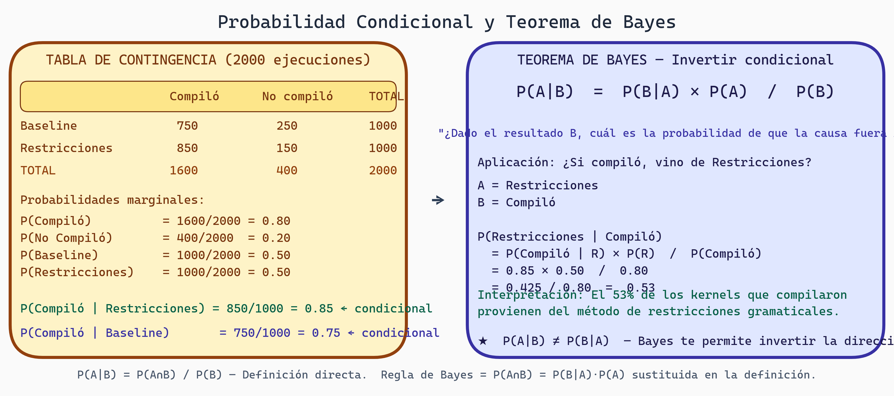

# Fundamentos de Probabilidad
## Semana 1 - Estadística para Generación de Kernels GPU

Bienvenida a este módulo de estadística. Aquí aprenderemos los conceptos fundamentales que necesitas para analizar los resultados de tu investigación sobre generación de kernels GPU con restricciones gramaticales. Imagina que necesitas comparar cuántas iteraciones toma el algoritmo baseline versus tu versión mejorada. La probabilidad es el lenguaje que usamos para hablar sobre esta incertidumbre.

## Espacio Muestral y Eventos

Comencemos con lo más básico: **¿qué es un espacio muestral?** En tu proyecto, podrías ejecutar tu generador de kernels 100 veces y contar cuántos kernels generados son válidos (compilables). El **espacio muestral** Ω es el conjunto de todos los posibles resultados. En este caso:

```
Ω = {0, 1, 2, ..., 100}
```

Representa todos los números posibles de kernels válidos en 100 intentos.

Un **evento** es un subconjunto del espacio muestral. Por ejemplo:
- Evento A: "Más del 80% de los kernels son válidos" → A = {80, 81, ..., 100}
- Evento B: "Menos del 50% de los kernels son válidos" → B = {0, 1, ..., 50}

### Operaciones entre Eventos

Así como combinamos conjuntos, combinamos eventos:
- **Unión (A ∪ B)**: "Menos del 50% O más del 80% son válidos"
- **Intersección (A ∩ B)**: "Menos del 50% Y más del 80% son válidos" (imposible, por lo que es vacío)
- **Complemento (A^c)**: "No más del 80% son válidos"

## Axiomas de Probabilidad

Ahora que tenemos espacios y eventos, necesitamos una forma consistente de asignar probabilidades. Los **axiomas de Kolmogorov** nos dan tres reglas fundamentales:

**Axioma 1: No negatividad**
Para cualquier evento A: P(A) ≥ 0

Las probabilidades no pueden ser negativas. Tiene sentido.

**Axioma 2: Certeza**
P(Ω) = 1

Algo debe ocurrir. La probabilidad de que ocurra alguno de los resultados posibles es 1.

**Axioma 3: Aditividad**
Si los eventos A₁, A₂, A₃, ... son mutuamente excluyentes (no pueden ocurrir simultáneamente):
```
P(A₁ ∪ A₂ ∪ A₃ ∪ ...) = P(A₁) + P(A₂) + P(A₃) + ...
```

Estas reglas garantizan que nuestras probabilidades sean coherentes y útiles.

### Consecuencias Útiles

De estos axiomas, derivamos:
- P(A) + P(A^c) = 1
- P(∅) = 0
- Si A ⊆ B, entonces P(A) ≤ P(B)

## Probabilidad Condicional y Bayes

Aquí es donde las cosas se ponen interesantes. **¿Qué pasa si sabemos algo más sobre la situación?**

En tu proyecto, podrías preguntarte: "Si el kernel compiló exitosamente, ¿cuál es la probabilidad de que haya usado decoding con restricciones gramaticales?" Esta es una **probabilidad condicional**.

La probabilidad condicional de A dado B se denota P(A|B) y se define como:

```
P(A|B) = P(A ∩ B) / P(B)    [si P(B) > 0]
```

Intuitivamente, nos enfocamos solo en los casos donde B ocurrió y preguntamos qué fracción de esos casos también tienen A.

### Ejemplo Práctico

Supongamos que tenemos 1000 ejecuciones de nuestro generador:

| | Compiló | No compiló | Total |
|---|---------|-----------|-------|
| Baseline | 750 | 250 | 1000 |
| Restricciones | 850 | 150 | 1000 |
| Total | 1600 | 400 | 2000 |

P(Compiló) = 1600/2000 = 0.8
P(Compiló | Baseline) = 750/1000 = 0.75
P(Compiló | Restricciones) = 850/1000 = 0.85

Notemos que P(Compiló | Restricciones) > P(Compiló). Las restricciones parecen mejorar la compilabilidad.



> **Probabilidad Condicional y Teorema de Bayes**
>
> Panel izquierdo: tabla de contingencia 2×2 con 2000 corridas de kernel GPU (Baseline/Restricciones × Compiló/No compiló). Panel derecho: Teorema de Bayes P(A|B) = P(B|A)×P(A)/P(B) aplicado para calcular P(Restricciones|Compiló) = 0.53 — dada una compilación exitosa, hay 53% de probabilidad de que provenga del método con restricciones.

## Teorema de Bayes

El **Teorema de Bayes** es una de las herramientas más poderosas en probabilidad:

```
P(A|B) = P(B|A) × P(A) / P(B)
```

¿Por qué es tan importante? Porque con frecuencia queremos invertir el sentido de una probabilidad condicional. Sabemos qué tan probable es que veamos cierta evidencia si una hipótesis es verdadera, pero queremos saber cuán probable es la hipótesis dada la evidencia.

### Ejemplo: Diagnóstico

Imagina que tenemos un "detector de calidad" que identifica kernels optimizados:
- P(detector dice "optimizado" | kernel es realmente optimizado) = 0.95
- P(detector dice "optimizado" | kernel NO es optimizado) = 0.10
- P(kernel es realmente optimizado en la población) = 0.05

Si el detector dice que un kernel es optimizado, ¿cuál es la probabilidad de que realmente lo sea?

```
P(realmente optimizado | detector dice optimizado)
= P(detector dice optimizado | realmente optimizado) × P(realmente optimizado) / P(detector dice optimizado)
```

Primero calculamos P(detector dice optimizado):
```
P(detector dice optimizado)
= P(detector | optimizado) × P(optimizado) + P(detector | no optimizado) × P(no optimizado)
= 0.95 × 0.05 + 0.10 × 0.95
= 0.0475 + 0.095
= 0.1425
```

Entonces:
```
P(realmente optimizado | detector) = 0.95 × 0.05 / 0.1425 ≈ 0.333
```

¡Sorpresa! Incluso con un detector que tiene 95% de exactitud, cuando dice que un kernel es optimizado, solo hay 33% de probabilidad de que realmente lo sea. Esto es porque los kernels optimizados son raros en la población (solo 5%). Este es un hallazgo crucial para entender la precisión en tareas desbalanceadas.

## Variables Aleatorias Discretas

Una **variable aleatoria** es una función que asigna números a resultados. Es "aleatoria" porque el resultado aún es incierto antes de que ocurra.

Formalmente, X : Ω → ℝ. Para nuestro ejemplo de kernels:
- X = "número de kernels válidos en 100 intentos" (puede ser 0-100)

Una variable aleatoria es **discreta** si toma un número finito o contable de valores.

### Función de Masa de Probabilidad (PMF)

La **PMF** describe la probabilidad de cada valor posible:

```
p(x) = P(X = x)
```

Por ejemplo, si generamos 5 kernels y X = "número de kernels válidos":

```
x    | 0    | 1    | 2    | 3    | 4    | 5    |
-----|------|------|------|------|------|------|
p(x) | 0.01 | 0.05 | 0.15 | 0.30 | 0.35 | 0.14 |
```

Una PMF válida debe cumplir:
- p(x) ≥ 0 para todo x
- Σ p(x) = 1

## Valor Esperado y Varianza

**El valor esperado** E[X] es el promedio ponderado de todos los resultados posibles:

```
E[X] = Σ x × p(x)
```

Es lo que esperamos "en promedio" si repitiéramos el experimento muchas veces.

Para nuestro ejemplo:
```
E[X] = 0(0.01) + 1(0.05) + 2(0.15) + 3(0.30) + 4(0.35) + 5(0.14)
     = 0 + 0.05 + 0.30 + 0.90 + 1.40 + 0.70
     = 3.35 kernels válidos (en promedio)
```

**La varianza** mide cuánta dispersión hay alrededor de la media:

```
Var(X) = E[(X - E[X])²]
       = E[X²] - (E[X])²
```

Es útil porque nos dice si nuestros resultados son consistentes (varianza baja) o erráticos (varianza alta).

### Propiedades Importantes

```
E[aX + b] = aE[X] + b
Var(aX + b) = a² × Var(X)
```

Si multiplicas todos los resultados por 2, el valor esperado también se multiplica por 2, pero la varianza se multiplica por 4.

## Resumen de Conceptos

| Concepto | Definición | En tu proyecto |
|----------|-----------|-----------------|
| Espacio muestral | Todos los resultados posibles | Todos los kernels posibles |
| Evento | Subconjunto del espacio muestral | "Kernel compiló" |
| Probabilidad condicional | P(A\|B) | ¿Validez dado que usamos restricciones? |
| Teorema de Bayes | Invertir probabilidades condicionales | Diagnosticar si un kernel es óptimo |
| Variable aleatoria | Función numérica de resultados | Número de kernels válidos |
| PMF | Probabilidad de cada valor discreto | Distribución de validez |
| Valor esperado | Promedio ponderado | Promedio de iteraciones |
| Varianza | Dispersión alrededor de la media | Consistencia del algoritmo |

## Ejercicios y Reflexión

### Ejercicio 1: Espacio Muestral y Eventos
En tu experimento de generación de kernels, ejecutas el baseline 20 veces y cuentas cuántos son válidos.
- Define el espacio muestral Ω
- Define el evento A: "al menos 15 kernels son válidos"
- Define el evento B: "exactamente 10 kernels son válidos"
- ¿Son A y B mutuamente excluyentes? ¿Es B ⊆ A?

### Ejercicio 2: Probabilidad Condicional
Tienes datos:
- P(kernel válido) = 0.80
- P(kernel válido | método A) = 0.75
- P(kernel válido | método B) = 0.85

Calcula P(método A | kernel válido) y P(método B | kernel válido) usando Bayes.

### Ejercicio 3: Variables Aleatorias
Si X = número de kernels válidos en 10 intentos y p(X=k) = C(10,k) × 0.8^k × 0.2^(10-k):
- Calcula E[X]
- Calcula Var(X)
- ¿Cuál es la desviación estándar?

### Reflexión
1. En tu proyecto, ¿cuál es el espacio muestral natural? ¿Cuáles son los eventos de interés?
2. ¿Hay relaciones causales o solo probabilidades condicionales? ¿Cómo esto afecta tus conclusiones?
3. Si observas que P(compiló | restricciones) > P(compiló | baseline), ¿qué puedes concluir? ¿Qué información adicional necesitarías?

---

**Próxima semana**: Aprenderemos distribuciones específicas (binomial, normal, Poisson) y estadística descriptiva para resumir nuestros datos.
