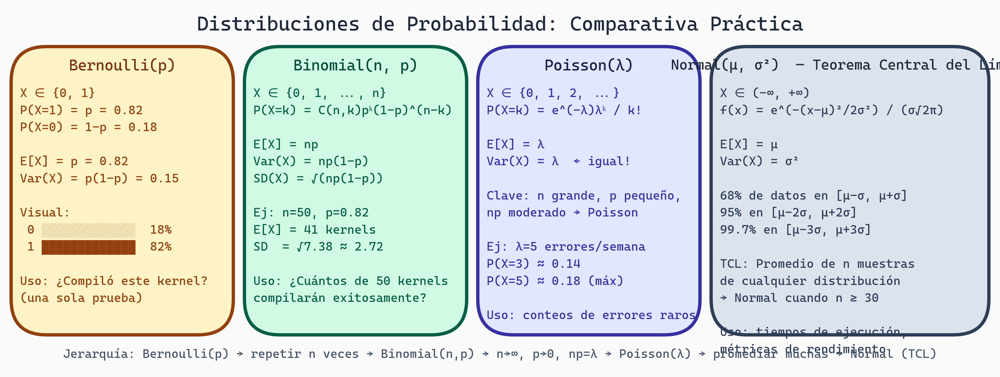

# Distribuciones y Estadística Descriptiva
## Semana 2 - Estadística para Generación de Kernels GPU

Ahora que entiendes probabilidad fundamental, es tiempo de aprender sobre distribuciones específicas. Una distribución describe cómo se comportan nuestros datos. En tu proyecto, necesitarás saber si tus conteos de iteraciones siguen una distribución normal, Poisson, o binomial. Esto determinará qué pruebas estadísticas puedes usar después.

## Distribución de Bernoulli

La más simple de todas. Una **prueba de Bernoulli** es un experimento con solo dos resultados: éxito o fracaso.

```
X ~ Bernoulli(p)

P(X = 1) = p
P(X = 0) = 1 - p

E[X] = p
Var(X) = p(1-p)
```

En tu proyecto: cada generación de kernel es una prueba de Bernoulli. ¿Compiló (1) o no compiló (0)?

Por ejemplo, si p = 0.82, entonces:
- E[X] = 0.82 (esperamos éxito 82% de las veces)
- Var(X) = 0.82 × 0.18 = 0.1476

## Distribución Binomial

Si repites una prueba de Bernoulli n veces de forma independiente, el número total de éxitos sigue una **distribución binomial**.

```
X ~ Binomial(n, p)

P(X = k) = C(n,k) × p^k × (1-p)^(n-k)

donde C(n,k) = n! / (k!(n-k)!)

E[X] = np
Var(X) = np(1-p)
SD(X) = √(np(1-p))
```

### Ejemplo Práctico

Ejecutas tu generador 50 veces. Cada intento tiene p = 0.82 de compilación exitosa. ¿Cuántos kernels válidos esperas?

```
X ~ Binomial(50, 0.82)
E[X] = 50 × 0.82 = 41 kernels válidos
Var(X) = 50 × 0.82 × 0.18 = 7.38
SD(X) = √7.38 ≈ 2.72
```

Entonces esperas alrededor de 41 kernels válidos, con una desviación estándar de 2.72. La mayoría de las veces estarás entre 38-44.

## Distribución de Poisson

Cuando n es grande y p es pequeño, pero np es moderado, usamos la **distribución de Poisson**. Modela conteos de eventos raros en intervalos fijos.

```
X ~ Poisson(λ)

P(X = k) = (e^(-λ) × λ^k) / k!

E[X] = λ
Var(X) = λ
```

**Característica interesante**: En Poisson, la media y varianza son iguales.

### Cuándo usarla

- Número de errores de compilación en 1000 intentos
- Número de regiones de memoria inválidas detectadas en 100 kernels
- Número de fallos en una semana de ejecución

Si esperamos λ = 5 errores por semana:

```
P(X = 3) = (e^(-5) × 5^3) / 3! ≈ 0.1404

P(X ≤ 2) = P(X=0) + P(X=1) + P(X=2) ≈ 0.1247
```

## Distribución Normal (Gaussiana)

La distribución más importante en estadística. **Muchos fenómenos naturales convergen a esta forma**.

```
X ~ N(μ, σ²)

PDF: f(x) = (1/(σ√(2π))) × e^(-(x-μ)²/(2σ²))

E[X] = μ
Var(X) = σ²
```

Propiedades:
- Simétrica alrededor de μ
- ~68% de datos dentro de μ ± σ
- ~95% de datos dentro de μ ± 2σ
- ~99.7% de datos dentro de μ ± 3σ

### Estandarización (Z-score)

Para trabajar con cualquier normal, la convertimos a **normal estándar** N(0,1):

```
Z = (X - μ) / σ
```

Si tu tiempo de compilación promedio es 5.2 segundos con σ = 1.1, y observas un kernel que toma 7.5 segundos:

```
Z = (7.5 - 5.2) / 1.1 = 2.09
```

Este kernel es 2.09 desviaciones estándar arriba de la media, lo que es bastante inusual (~2% de probabilidad).

## Teorema Central del Límite (TCL)

El **Teorema Central del Límite** es el corazón de la estadística práctica:

> Si tomas muestras de cualquier distribución (normal o no) y calculas la media muestral, esa media seguirá aproximadamente una distribución normal, siempre que la muestra sea suficientemente grande.

```
Si X₁, X₂, ..., Xₙ son independientes e idénticamente distribuidas (i.i.d.) con E[X] = μ y Var(X) = σ²:

Entonces: X̄ ~ N(μ, σ²/n)    aproximadamente para n grande
```

### Implicación Práctica

Ejecutas tu generador 100 veces y calculas el promedio de iteraciones. Incluso si cada ejecución individual sigue una distribución rara o asimétrica, el **promedio de 100 ejecuciones seguirá aproximadamente una distribución normal**.

Esto es por qué el TCL es tan poderoso: nos permite usar estadística basada en distribuciones normales incluso cuando nuestros datos individuales no lo son.



> **Distribuciones de Probabilidad: Comparativa**
>
> Cuatro paneles: Bernoulli (éxito/fracaso binario, p=0.8 para kernel GPU), Binomial (k éxitos en n ensayos, B(10,0.8)), Poisson (eventos por intervalo, λ=3 errores/kernel), y Normal/TCL (distribución continua, media de promedios converge a N(μ,σ²/n)). Incluye fórmulas, E[X], Var(X) y ejemplos aplicados a kernels GPU.

## Estadística Descriptiva

Ahora aprendemos a **resumir datos** con números simples.

### Media (Promedio)

```
x̄ = (Σ xᵢ) / n
```

La suma de todos los valores dividida por cuántos hay. Fácil de calcular, pero sensible a valores atípicos.

Ejemplo: Tiempos de compilación (segundos): 2.1, 2.3, 2.2, 2.0, 15.5
```
x̄ = (2.1 + 2.3 + 2.2 + 2.0 + 15.5) / 5 = 24.1 / 5 = 4.82
```

Nota que ese 15.5 tira el promedio hacia arriba. La media es 4.82, pero la mayoría de valores están alrededor de 2.

### Mediana

El valor del medio cuando los datos están ordenados. No se ve afectada por valores atípicos.

```
Datos ordenados: 2.0, 2.1, 2.2, 2.3, 15.5
Mediana = 2.2 (elemento del medio)
```

Para un número par de elementos, promedias los dos del medio.

Comparación:
- **Media = 4.82** (tirada por el atípico)
- **Mediana = 2.2** (más representativa del "típico")

### Desviación Estándar y Varianza

Miden cuán dispersos están tus datos.

```
Varianza: s² = Σ(xᵢ - x̄)² / (n-1)    [muestral]

Desviación Estándar: s = √(s²)
```

Para nuestros datos:
```
Desviaciones: (2.1-4.82)², (2.3-4.82)², ..., (15.5-4.82)²
            = 7.39, 6.33, 6.76, 8.07, 114.49

s² = 143.04 / 4 = 35.76
s = 5.98 segundos
```

Un σ alto indica datos muy dispersos; σ bajo indica datos agrupados.

### Percentiles e Intervalo Intercuartílico (IQR)

El **percentil p** es el valor bajo el cual está el p% de tus datos.

Cuartiles importantes:
- Q1 (25º percentil): el 25% de datos están por debajo
- Q2 (50º percentil): la mediana
- Q3 (75º percentil): el 75% de datos están por debajo

**IQR = Q3 - Q1** es el rango del 50% central de datos.

Para nuestros 5 valores ordenados (2.0, 2.1, 2.2, 2.3, 15.5):
```
Q1 = 2.05 (promedio de 2.0 y 2.1)
Q2 = 2.2
Q3 = 2.25 (promedio de 2.2 y 2.3)
IQR = 2.25 - 2.05 = 0.20
```

El IQR es robusto a valores atípicos: no importa cuánto sea 15.5, el IQR se mantiene pequeño.

### Detección de Valores Atípicos (Outliers)

Una regla común:
```
Límite inferior = Q1 - 1.5 × IQR = 2.05 - 1.5(0.20) = 1.85
Límite superior = Q3 + 1.5 × IQR = 2.25 + 1.5(0.20) = 2.55
```

Cualquier valor fuera de [1.85, 2.55] es un atípico. En nuestro caso, 15.5 es definitivamente un atípico.

## Diagramas de Caja (Box Plots)

Un visualizador útil que muestra mediana, cuartiles y atípicos:

```
     *              ← atípico (15.5)

1.0  |----[Q1--Q2--Q3]----| 2.3

     Q1=2.05  Q2=2.2  Q3=2.25
```

Es especialmente útil para **comparar distribuciones**. En tu proyecto, podrías tener un box plot lado a lado: baseline vs. con restricciones.

## Comparación: Media vs. Mediana

¿Cuándo usas cada una?

| Situación | Usa |
|-----------|-----|
| Datos simétricos, sin atípicos | Media |
| Datos con algunos atípicos | Mediana |
| Datos muy asimétricos | Mediana |
| Necesitas para cálculos posteriores | Media |
| Quieres robusto y simple | Mediana |

En nuestro ejemplo de tiempos de compilación:
- **Media = 4.82**: engañosa, no representa el típico
- **Mediana = 2.2**: mejor representa la experiencia típica

**En contexto ML:** Usa mediana para tiempos de GPU (outliers por thermal throttling), throughput con warm-up variable. Usa media para métricas de training (loss, accuracy) que son estables.

## Resumen de Distribuciones

| Distribución | Caso de uso | Parámetros | Media | Varianza |
|--------------|-------------|-----------|-------|----------|
| Bernoulli | Éxito/fracaso | p | p | p(1-p) |
| Binomial | n ensayos Bernoulli | n, p | np | np(1-p) |
| Poisson | Conteos de eventos raros | λ | λ | λ |
| Normal | Datos continuos "típicos" | μ, σ | μ | σ² |

## Ejercicios y Reflexión

### Ejercicio 1: Identifica la Distribución
Para cada escenario en tu proyecto, identifica qué distribución es apropiada:
1. Número de kernels válidos en 30 intentos
2. Tiempo de compilación de un kernel individual
3. Número de fallos de memoria en 1000 ejecuciones
4. Tasa de error promedio en 50 ejecuciones

### Ejercicio 2: Cálculos Binomiales
Si p = 0.85 (probabilidad de compilación) y n = 20:
- ¿Cuál es E[X]?
- ¿Cuál es SD[X]?
- ¿Aproximadamente qué rango esperas con 95% confianza?

### Ejercicio 3: Z-scores
Tiempos de compilación: μ = 3.2s, σ = 0.8s
- Un kernel toma 5.6s. ¿Cuál es su z-score?
- ¿Qué tan inusual es esto?
- ¿Un kernel de 2.0s es atípico?

### Ejercicio 4: Estadística Descriptiva
Datos de iteraciones para baseline: 42, 45, 43, 41, 90, 44, 43
Datos de iteraciones para restricciones: 38, 39, 37, 40, 38, 39, 36
- Calcula media, mediana, SD para ambos
- ¿Hay atípicos?
- ¿Cuál método es más consistente?

### Reflexión
1. **TCL en tu proyecto**: Cuando ejecutas tu algoritmo 100 veces, ¿por qué el TCL te permite asumir normalidad en el promedio?
2. **Elegir entre media y mediana**: En tu conjunto de datos de iteraciones, ¿cuál es más informativo? ¿Por qué?
3. **Asimetría**: Si tus datos de validez de kernels tienen q = 0.85, ¿esperas una distribución simétrica? ¿Cómo lo afecta esto?

---

**Próxima semana**: Aprenderemos cómo usar estas distribuciones para hacer pruebas de hipótesis sobre si nuestro método es realmente mejor que el baseline.
