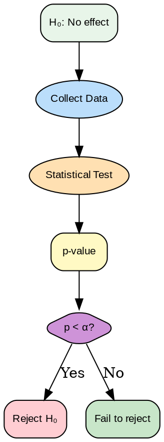

# Pruebas de Hipótesis
## Semana 3 - Estadística para Generación de Kernels GPU

Finalmente llegamos a la pregunta central de tu investigación: **¿Es mi método realmente mejor, o fue solo suerte?** Las pruebas de hipótesis son el marco que usamos para responder esto de manera rigurosa.

## Estructura de una Prueba de Hipótesis

Toda prueba de hipótesis tiene dos competidores:



***Figura 1:** Diagrama de flujo para pruebas de hipótesis estadísticas.*


1. **Hipótesis Nula (H₀)**: La afirmación "aburrida" que asumimos verdadera. Típicamente es "no hay diferencia".
2. **Hipótesis Alternativa (H₁)**: Lo que buscas demostrar. Típicamente es "hay una diferencia".

### Ejemplos en tu Proyecto

```
H₀: La tasa de compilación con restricciones = tasa sin restricciones (p₁ = p₂)
H₁: La tasa de compilación con restricciones ≠ tasa sin restricciones (p₁ ≠ p₂)
```

O si tienes razones para esperar una dirección:

```
H₀: iteraciones con restricciones ≥ iteraciones sin restricciones
H₁: iteraciones con restricciones < iteraciones sin restricciones
```

## Errores Tipo I y Tipo II

Al decidir si rechazamos H₀, podemos cometer dos tipos de errores:

|  | H₀ es verdadera | H₀ es falsa |
|---|---|---|
| **Rechazamos H₀** | Error Tipo I (α) | ✓ Correcto |
| **No rechazamos H₀** | ✓ Correcto | Error Tipo II (β) |

### Error Tipo I (False Positive)

Rechazamos H₀ cuando en realidad es verdadera. Declaramos que nuestro método es mejor cuando realmente no lo es.

**α (alfa)** = P(Error Tipo I) = P(rechazar H₀ | H₀ verdadera)

Típicamente establecemos α = 0.05, significando que aceptamos una tasa de falsos positivos del 5%.

### Error Tipo II (False Negative)

No rechazamos H₀ cuando en realidad es falsa. Perdemos detectar una mejora real.

**β (beta)** = P(Error Tipo II) = P(no rechazar H₀ | H₀ falsa)

Típicamente buscamos β = 0.20, lo que significa:
- **Poder = 1 - β = 0.80**: Tenemos 80% de probabilidad de detectar un efecto real

### El Balance

Hay un trade-off entre α y β. Si reduces α (más conservador), aumentas β (menos poder). Por eso el diseño experimental cuidadoso es crucial.

## P-valores y Niveles de Significancia

El **p-valor** es probablemente el concepto más mal entendido en estadística.

> El **p-valor** es la probabilidad de observar datos tan o más extremos que los que observaste, SI H₀ fuera verdadera.

**NO es** "la probabilidad de que H₀ sea verdadera". Es lo opuesto: asume H₀ y pregunta "¿qué tan sorprendentes son mis datos?"

### Interpretación Correcta

Si p = 0.03:
- "Si no hubiera diferencia real entre métodos, solo hay 3% de probabilidad de ver una diferencia tan grande (por casualidad)."
- Esto sugiere que probablemente hay una diferencia real.

Si p = 0.50:
- "Si no hubiera diferencia real, hay 50% de probabilidad de ver esto o algo más extremo."
- Esto es muy plausible bajo H₀. No hay evidencia de diferencia.

### Nivel de Significancia (α)

Establecemos una **línea de corte**: si p < α, rechazamos H₀.

```
Típicamente α = 0.05

Si p < 0.05: "Significante al nivel 0.05"
Si p < 0.01: "Significante al nivel 0.01" (más fuerte)
Si p ≥ 0.05: "No significante"
```

**Advertencia**: p = 0.051 es tan evidencia contra H₀ como p = 0.049 en un sentido real, pero uno es "significante" y el otro no según la regla de corte arbitraria.

## Prueba t de Una Muestra

Comparas el promedio de tu muestra contra un valor conocido. Por ejemplo, ¿es el tiempo promedio de compilación diferente de 5 segundos?

```
H₀: μ = 5
H₁: μ ≠ 5

Estadístico de prueba: t = (x̄ - μ₀) / (s / √n)

Donde:
- x̄ = promedio muestral
- μ₀ = valor hipotético (5 segundos)
- s = desviación estándar muestral
- n = tamaño muestral
```

### Ejemplo Práctico

Ejecutas 25 veces y obtienes:
- x̄ = 5.8 segundos
- s = 1.2 segundos
- n = 25

```
t = (5.8 - 5.0) / (1.2 / √25)
  = 0.8 / (1.2 / 5)
  = 0.8 / 0.24
  = 3.33
```

Con df = n - 1 = 24 grados de libertad, este t = 3.33 corresponde a p ≈ 0.003.

**Conclusión**: p < 0.05, rechazamos H₀. El tiempo promedio es significativamente diferente de 5 segundos.

## Prueba t de Dos Muestras: Muestras Independientes

Comparas promedios entre dos grupos diferentes (baseline vs. tu método).

```
H₀: μ₁ = μ₂ (no hay diferencia)
H₁: μ₁ ≠ μ₂ (hay diferencia)

Estadístico: t = (x̄₁ - x̄₂) / SE(x̄₁ - x̄₂)

Donde SE = error estándar de la diferencia
```

### Asunciones Importantes

- **Normalidad**: Datos aproximadamente normales (TCL hace esto menos crítico con n > 30)
- **Igualdad de varianzas**: Las dos muestras tienen varianzas similares (Welch's t si no)
- **Independencia**: Las observaciones no dependen unas de otras

### Ejemplo: Baseline vs. Con Restricciones

Baseline (30 ejecuciones): x̄₁ = 4.2s, s₁ = 0.9s
Restricciones (30 ejecuciones): x̄₂ = 3.8s, s₂ = 0.8s

```
t = (4.2 - 3.8) / SE ≈ 1.85

Con df ≈ 58, esto da p ≈ 0.068
```

Con α = 0.05, esto **no es estadísticamente significante**. No podemos rechazar H₀.

Pero nota: hay una diferencia numérica de 0.4 segundos. Podría ser prácticamente importante aunque no sea estadísticamente significante. Hablaremos de esto cuando cubramos tamaño del efecto.

## Pruebas Pareadas (Paired t-test)

Cuando los mismos sujetos se prueban en dos condiciones, usas una **prueba pareada**.

Ejemplo: Ejecutas 20 kernels con ambos métodos (baseline y restricciones) y comparas.

```
Kernel | Baseline | Restricciones | Diferencia
-------|----------|---------------|-----------
1      | 4.1      | 3.9           | 0.2
2      | 4.3      | 3.8           | 0.5
3      | 3.9      | 3.7           | 0.2
...    | ...      | ...           | ...
```

En lugar de comparar dos muestras independientes, calculas las diferencias por par y pruebas si el promedio de diferencias es 0.

```
H₀: μ_diferencia = 0
H₁: μ_diferencia ≠ 0

t = d̄ / (s_d / √n)
```

### Ventaja de Diseños Pareados

Controlas la variabilidad entre kernels. El mismo kernel tiende a tomar tiempos similares en ambos métodos; solo importa la diferencia.

Esto reduce varianza y aumenta poder, permitiéndote detectar efectos más pequeños.

**Paired vs Unpaired:**
- Paired: mismos 50 kernels con método A y B (cada kernel es su propio control)
- Unpaired: 50 kernels método A vs 50 kernels diferentes método B
- Regla: si puedes emparejar, hazlo (más poder estadístico)

## Decisiones e Interpretación

### Flujo de Decisión

```
1. Establece H₀, H₁, α antes del análisis
2. Recolecta datos
3. Calcula estadístico de prueba
4. Obtén p-valor
5. ¿p < α?
   - Sí: Rechaza H₀ (evidencia para H₁)
   - No: No rechaces H₀ (sin evidencia suficiente)
```

### Lo Que NO Dicen los P-valores

- **NO te dice la probabilidad de H₀**: p-valor asume H₀
- **NO te dice el tamaño del efecto**: p < 0.01 puede ser efecto minúsculo si n es muy grande
- **NO controla la tasa de falsos positivos globalmente**: solo para una prueba

## Resumen: Tipos de Pruebas

| Prueba | Compara | Asunciones | Uso |
|--------|---------|-----------|-----|
| t de una muestra | Muestra vs. valor | Normalidad | ¿Es diferente de un estándar? |
| t de dos muestras | Dos grupos | Normalidad, igualdad varianza | ¿Difieren dos grupos? |
| t pareada | Mismo sujeto x2 condiciones | Normalidad de diferencias | ¿Cambia tras intervención? |

Próximas semanas usaremos alternativas no paramétricas cuando no se cumplan asunciones.

## Ejercicios y Reflexión

### Ejercicio 1: Plantear Hipótesis
Para tu proyecto, escribe formalmente:
- H₀ y H₁ para comparar baseline vs. restricciones en términos de:
  - Tasa de validez
  - Número promedio de iteraciones
  - Tiempo de compilación
- ¿Son pruebas de una cola o dos colas? ¿Por qué?

### Ejercicio 2: Interpretación de P-valores
Para cada p-valor, decide qué conclusión sacar (α = 0.05):
1. p = 0.002: Evidencia ___ para H₁
2. p = 0.045: Evidencia ___ para H₁
3. p = 0.051: Evidencia ___ para H₁
4. p = 0.15: Evidencia ___ para H₁

(Llena con: "fuerte", "moderada", "débil", "ninguna")

### Ejercicio 3: Errores Tipo I y II
En tu proyecto:
- ¿Cuál es peor: decir que tus restricciones mejoran cuando no lo hacen, o perder detectar una mejora real?
- ¿Qué α y β propondrías? ¿Por qué?

### Ejercicio 4: Analizar un Escenario
Datos hipotéticos:
- Baseline: n=25, x̄=5.2, s=1.1
- Restricciones: n=25, x̄=4.8, s=1.3

a) Escribe H₀ y H₁
b) ¿Cuál es el error estándar de la diferencia?
c) Calcula el estadístico t aproximadamente
d) Con df≈48, ¿es esto significante a α=0.05?

### Reflexión
1. En tu proyecto, ¿cuál es la consecuencia de un Error Tipo I? ¿Y de un Tipo II?
2. ¿Cómo afecta el tamaño muestral tu capacidad de detectar diferencias?
3. Si observas p=0.06, ¿deberías concluir que no hay efecto? ¿Por qué o por qué no?

---

**Próxima semana**: Aprenderemos a diseñar experimentos cuidadosamente para asegurar que tenemos suficiente poder para detectar efectos reales.
