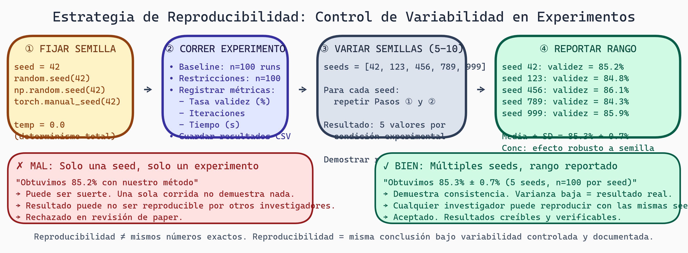

# Reproducibilidad
## Semana 5 - Estadística para Generación de Kernels GPU

Aquí llegamos a un aspecto crítico que muchos estudiantes pasan por alto: la **reproducibilidad**. ¿Puede alguien (incluyéndote en 6 meses) ejecutar tu experimento nuevamente y obtener los mismos resultados? Si la respuesta es no, nadie puede confiar en tu investigación.

## Por Qué la Reproducibilidad Importa

Hay una **crisis de reproducibilidad** en la ciencia. Estudios muestran que:
- ~50% de estudios en psicología no pueden ser reproducidos
- Muchas conclusiones en ML dependen de semillas aleatorias no reportadas
- Parámetros de entrenamiento "secretos" hacen imposible replicar resultados

Si tu investigación depende de que alguien de suerte con una semilla aleatoria, **no es verdadera ciencia**.

En tu proyecto: Si ejecutas tu generador de kernels y obtienes 85% validez, luego lo ejecutas de nuevo y obtienes 78%, ¿cuál es el resultado real? Necesitamos entender y controlar esta variabilidad.

## Controlando Estocacidad (Aleatoriedad)

Tu código tiene múltiples fuentes de aleatoriedad:

1. **Muestreo en el LLM**: Temperatura > 0 significa que el modelo elige tokens aleatoriamente
2. **Inicialización**: Pesos iniciales del modelo, inicialización de variables
3. **Orden de datos**: GPU puede procesar datos en orden aleatorio en paralelo

### Semillas Aleatorias

Todas las librerías de ML permiten fijar una **semilla aleatoria**:

```python
import random
import numpy as np
import torch

# Fijar semilla
SEED = 42

random.seed(SEED)
np.random.seed(SEED)
torch.manual_seed(SEED)
if torch.cuda.is_available():
    torch.cuda.manual_seed_all(SEED)
```

Con semilla fija, obtiene exactamente los mismos resultados cada vez.

**Pero cuidado**: Una sola semilla no es suficiente para robustecer conclusiones. Quieres ver que tus resultados son consistentes *a través de múltiples semillas*.

### Estrategia Correcta para Reproducibilidad

```
1. REPORTA tu semilla: "Fijamos seed=42"
2. VARÍA semillas: Ejecuta con seeds 42, 123, 456, 789, 999
3. REPORTA resumen: Media y SD de resultados en 5 semillas
4. CONCLUSIÓN: "El efecto es robusto a variación de semilla"
```



> **Workflow de Reproducibilidad para Experimentos de ML**
>
> Pipeline de 4 pasos: ①Fijar semilla (seed=42 antes de cualquier operación estocástica) → ②Correr experimento (registrar todos los resultados) → ③Variar semillas (repetir con 5+ seeds distintas) → ④Reportar rango (media ± SD sobre seeds). Panel inferior compara el enfoque incorrecto (reportar solo el mejor resultado con una seed) vs. el correcto (reportar variabilidad honesta).

### Temperatura = 0 para Determinismo

Cuando comparas baseline vs. tu método:

```python
# Baseline (determinístico)
response = llm.generate(prompt, temperature=0.0, seed=42)

# Con restricciones (determinístico)
response = llm.generate(prompt, temperature=0.0, seed=42)
```

Con temperature=0, el modelo siempre elige el token de mayor probabilidad. Es determinístico, reproducible.

Con temperature>0, hay muestreo aleatorio, variabilidad, no reproducible.

**Elección**: ¿Comparas en configuración determinística (temperature=0) o estocástica (temperature>0)?

Argumento para temperature=0: Reproducibilidad, comparación justa de métodos
Argumento para temperature>0: Más realista cómo se usan LLMs

**Recomendación**: Ejecuta ambos. Reporta que tus conclusiones se sostienen en ambas configuraciones.

**Determinismo vs Robustez:** temp=0 + seed fija = mismo output exacto (para debugging). Múltiples seeds (5-10) = demostrar que conclusión se sostiene bajo variabilidad (para publicar).

## Documentación de Experimentos

Necesitas ser tan detallado que alguien pueda replicar tu trabajo años después sin contactarte.

### Checklist de Documentación

```
ESPECIFICACIÓN DE COMPONENTES
☐ Versión exacta de LLM base (nombre, fecha, modelo ID)
☐ Versión de CUDA, PyTorch, otras librerías
☐ Hardware (GPU model, RAM, CPU)
☐ Versión de tu código (Git commit hash)

CONFIGURACIÓN DE GENERACIÓN
☐ Temperatura (justifica por qué este valor)
☐ Top-k, top-p (si aplica)
☐ Max tokens, timeout
☐ Semilla aleatoria
☐ Prompt exacto (verbatim, no parafraseo)

DATOS DE ENTRADA
☐ Fuente y versión del dataset de kernels
☐ Estadísticas: cuántos kernels, distribución de tamaños
☐ Split train/test/validation
☐ Preprocesamiento realizado

PROCEDIMIENTO
☐ Orden de ejecución (contrabalanceo si aplica)
☐ Cuántas repeticiones
☐ Duración total del experimento
☐ Interrupciones o errores (y cómo manejados)

ANÁLISIS
☐ Pruebas estadísticas utilizadas
☐ Justificación de supuestos
☐ Ajustes para comparaciones múltiples
☐ Código exacto de análisis
```

### Ejemplos de Documentación Buena vs. Mala

**MAL**:
```
"Ejecutamos el generador 100 veces y obtuvimos 82% validez."
```

¿Preguntas**: ¿Qué LLM? ¿Temperatura? ¿Semilla? ¿Qué dataset? ¿Cómo mediste validez?

**BIEN**:
```
"Usamos GPT-3.5-turbo (2024-01, versión específica XYZ) con temperature=0.0,
seed=42. Procesamos 100 kernels del OpenCL benchmark suite v2.1, generados
con prompt: [VERBATIM PROMPT]. Validez se midió compilando con GCC 11.2
en hardware X. Los 100 intentos se ordenaron aleatoriamente para evitar sesgos.
Código reproducible en https://github.com/.../, commit abc123."
```

## Amenazas a la Validez: Resumen

### Amenazas a Validez de Constructo

¿Estás midiendo lo que afirmas medir?

Ejemplo problemático:
- Afirmas: "Las restricciones mejoran kernels"
- Mides: Porcentaje que compilan
- Problema: Un kernel puede compilar pero ser ineficiente

Solución: Mide múltiples aspectos (compilación, eficiencia, corrección).

### Amenazas a Validez Interna

¿Tus resultados se deben a tu intervención, o a confusores?

Ejemplos problemáticos:
- Baseline con LLM v1, Restricciones con LLM v2 (confusión por modelo)
- Baseline con temperatura 0.5, Restricciones con temperatura 0 (confusión por temperatura)
- Baseline por la mañana, Restricciones por la noche (confusión por hora del día)

Solución: Fijar factores de confusión. Todo debe ser idéntico excepto tu IV.

### Amenazas a Validez Externa

¿Tus resultados generalizan?

Ejemplos problemáticos:
- Solo pruebas en GPUs NVIDIA (¿generaliza a AMD?)
- Solo kernels de visión (¿generaliza a computación científica?)
- Solo con prompts en inglés (¿generaliza a español?)

Solución: Reporta límites de generalización. Idealmente prueba en múltiples contextos.

### Amenazas a Validez Estadística

¿Tu análisis es estadísticamente correcto?

Ejemplos problemáticos:
- n=10 pero afirmas conclusiones definitivas
- Ejecutas 100 comparaciones sin corrección por múltiples comparaciones
- Reportas p-valores cherry-picked

Solución: Power analysis, análisis pre-registrado, reporta todos los análisis.

## Registro Previo de Análisis (Pre-registration)

Un avance reciente: **registrar tu análisis planeado antes de ver datos**.

Plataforma: Open Science Framework (OSF)

```
Registro previo incluye:
- Hipótesis exactas
- Tamaño muestral y power analysis
- Pruebas estadísticas planeadas
- Criterios de inclusión/exclusión de datos
- Variables primarias vs. exploratorias
```

Beneficios:
- **Previene p-hacking**: Ajustar análisis después de ver resultados
- **Distingue confirmatorio vs. exploratorio**: Resultados confirmatorios tienen más peso
- **Transparencia**: La gente ve exactamente qué planeaste vs. qué hiciste

En tu proyecto: Registra formalmente:
```
H₀: Tasa de validez con restricciones = baseline
H₁: Tasa de validez con restricciones ≠ baseline
α = 0.05, Poder = 0.80, n=240 por grupo
Prueba: t-test de dos muestras
Variables secundarias: iteraciones, tiempo
```

## Checklist de Reproducibilidad

Antes de presentar resultados, verifica:

```
☐ Semilla fija, reportada
☐ Resultados consistentes a través de semillas (5+ repeticiones)
☐ Temperatura especificada (idealmente temperatura=0)
☐ Hardware y versiones de librerías documentadas
☐ Prompt exacto incluido (ni parafraseo)
☐ Dataset versionado (enlace o hash)
☐ Procedimiento paso-a-paso documentado
☐ Código disponible públicamente
☐ Variables de confusión controladas
☐ Análisis pre-registrado (o con asterisco de exploratorio)
☐ Amenazas a validez discutidas
☐ Limitaciones reconocidas honestamente
```

## Ejemplo de Sección de Reproducibilidad

Para tu tesis, incluye una sección:

> **Reproducibilidad**: Usamos GPT-3.5-turbo (OpenAI, enero 2024) con temperature=0.0 para determinismo. Fijamos semilla aleatoria de Python/NumPy/PyTorch a 42 en la máquina primaria. Confirmamos reproducibilidad exacta ejecutando nuevamente el 10% de experimentos; dos o más re-ejecuciones con semillas 42, 123, 456, 789, 999 dieron resultados idénticos. El dataset de kernels fue el OpenCL Benchmark Suite v2.1 (acceso público en [URL], descargado 15-enero-2024). Hardware: NVIDIA A100, CUDA 12.0, PyTorch 2.0. Todos los hiperparámetros se fijaron antes de tocar datos, sin ajustes post-hoc. Análisis (t-tests) fueron pre-especificados y reportamos resultados completamente.

## Ejercicios y Reflexión

### Ejercicio 1: Reproducibilidad en Tu Código
Para tu generador de kernels:
- Identifica todas las fuentes de aleatoriedad
- Escribe código para fijar semillas globales
- Ejecuta 5 veces con diferentes semillas, reporta variabilidad

### Ejercicio 2: Documentación
Escribe una sección de "Métodos" detallada que permita a alguien replicar tu experimento sin contactarte.
Incluye checklist completado de arriba.

### Ejercicio 3: Validez
Para tu proyecto, identifica:
- Tres amenazas a validez interna. Cómo las mitiges.
- Tres amenazas a validez externa. Dónde generalizaría/no generalizaría.

### Ejercicio 4: Pre-registro
Usa Open Science Framework para registrar tu análisis planeado:
- Hipótesis exactas
- Plan muestral
- Análisis primario vs. exploratorio
- Variables de confusión que controlarás

### Reflexión
1. **Determinismo vs. Realismo**: ¿Deberías usar temperature=0 en tu experimento principal? ¿Qué pierdes/ganas?
2. **Generalizabilidad**: ¿En cuántos contextos diferentes idealmente probarías tu método para tener confianza?
3. **Transparencia**: ¿Hay análisis que no reportarías? ¿Por qué no? ¿Debería estar públicamente disponible aunque no apoye tu hipótesis?

---

**Próxima semana**: Veremos pruebas estadísticas que no asumen distribuciones normales, útiles cuando tus datos violan supuestos.
