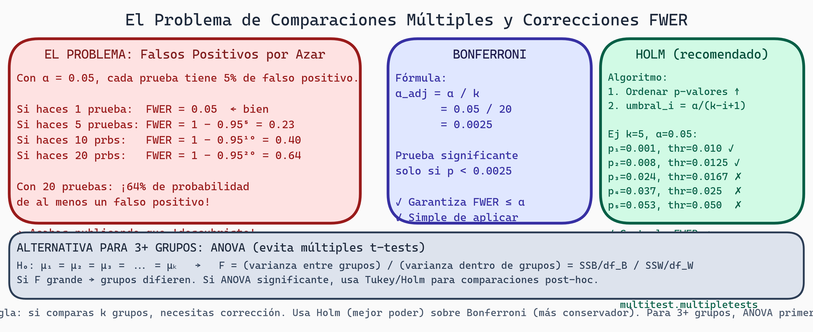

# Comparaciones Múltiples
## Semana 8 - Estadística para Generación de Kernels GPU

Aquí llegamos a un peligro estadístico: **si haces suficientes pruebas, alguna será "significante" solo por suerte**. Aprendemos a controlar esto.

## El Problema de Comparaciones Múltiples

Imagina que tienes 20 variables y comparas baseline vs. restricciones. Sin correcciones:

```
Pruebas independientes: 20
Nivel de significancia por prueba: α = 0.05
Probabilidad de al menos un falso positivo (Tipo I):
P(al menos un falso positivo) = 1 - (1 - 0.05)²⁰
                               = 1 - 0.95²⁰
                               = 1 - 0.358
                               = 0.642

¡64% de probabilidad de un falso positivo!
```

Acabas reportando un resultado "significante" que fue pura suerte.

## Tasa de Error Familia-wise (FWER)

**FWER** = Probabilidad de al menos un Error Tipo I en toda la familia de pruebas.

Sin corrección: FWER ≈ 0.64 (arriba)
Con corrección Bonferroni: FWER ≤ 0.05

### Corrección de Bonferroni

Simple: divide α por número de pruebas.

```
α_ajustado = α_original / número de pruebas
          = 0.05 / 20
          = 0.0025

Reportas como significante solo si p < 0.0025
```

**Desventaja**: Muy conservador. Pierde poder. Con 20 pruebas, casi nada será significante.

## Corrección de Holm

Menos conservador que Bonferroni, pero controla FWER.

```
1. Ordena p-valores de menor a mayor: p₁ ≤ p₂ ≤ ... ≤ pₖ
2. Para i-ésima prueba, usa umbral: α / (k - i + 1)

Ejemplo con k=5 pruebas:
p₁ = 0.001, umbral: 0.05/5 = 0.010  → Significante (0.001 < 0.010)
p₂ = 0.008, umbral: 0.05/4 = 0.0125 → Significante (0.008 < 0.0125)
p₃ = 0.024, umbral: 0.05/3 = 0.0167 → No significante (0.024 > 0.0167)
p₄ = 0.037, umbral: 0.05/2 = 0.025  → No significante
p₅ = 0.053, umbral: 0.05/1 = 0.050  → No significante
```

**Ventaja**: Menos poder perdido que Bonferroni.



> **Comparaciones Múltiples y Control de FWER**
>
> Panel izquierdo (rojo): escalada del problema — con 1 prueba FWER=5%, con 10 pruebas FWER≈40%, con 20 pruebas FWER≈64%. Panel central (índigo): corrección de Bonferroni — dividir α por número de pruebas k. Panel derecho (verde): procedimiento de Holm — ordenar p-values, ajustar umbrales de forma paso a paso. Panel inferior: cuándo usar ANOVA de una vía como alternativa a múltiples t-tests.

## ANOVA: Comparar 3+ Grupos

Cuando comparas más de 2 grupos, uses **ANOVA** (Analysis of Variance) en lugar de múltiples t-tests.

```
H₀: μ₁ = μ₂ = μ₃ = ... = μₖ (todos los grupos son iguales)
H₁: Al menos un grupo difiere
```

### Lógica de ANOVA

ANOVA particiona varianza total en:
- **Varianza entre grupos** (SSB): ¿Qué tan diferentes son los promedios?
- **Varianza dentro de grupos** (SSW): ¿Cuánta variación hay internamente?

```
F = (SSB / df_between) / (SSW / df_within)
  = Mean Square Between / Mean Square Within

Si F es grande: grupos muy diferentes (significante)
Si F es pequeño: grupos similares (no significante)
```

### Ejemplo: Tres Métodos de Decoding

```
Método A (Baseline):     42, 43, 41, 45, 43  (M=42.8, SD=1.6)
Método B (Restricciones): 38, 39, 37, 40, 38  (M=38.4, SD=1.1)
Método C (Restricciones v2): 35, 37, 36, 38, 34  (M=36.0, SD=1.4)

ANOVA:
F = 47.2, df=(2,12), p < 0.001

Conclusión: Métodos difieren significativamente.
```

Pero, ¿cuál difiere de cuál?

## Pruebas Post-Hoc: Desglosa Comparaciones

Después de ANOVA significante, necesitas saber qué grupos difieren.

### Prueba de Tukey HSD

Compara todos los pares, controlando FWER.

```
Comparaciones:
A vs. B: diferencia = 42.8 - 38.4 = 4.4 → p < 0.001 ✓
A vs. C: diferencia = 42.8 - 36.0 = 6.8 → p < 0.001 ✓
B vs. C: diferencia = 38.4 - 36.0 = 2.4 → p = 0.021 ✓

Conclusión: Todos los pares difieren.
```

### Prueba de Dunn (no paramétrica)

Alternativa a Tukey cuando no tienes normalidad. Basada en Kruskal-Wallis.

```
Compara rangos medios entre grupos.
Controla FWER como Tukey.
```

## Decisión: ANOVA vs. Kruskal-Wallis

| Criterio | ANOVA | Kruskal-Wallis |
|----------|-------|----------------|
| Supuesto | Normalidad | Ninguno |
| Datos | Continuos | Ordinales o continuos |
| Tamaño n | Cualquiera | Mejor > 5 por grupo |
| Poder | Mayor si normal | Menor pero robusto |
| Post-hoc | Tukey | Dunn |

En tu proyecto:
- Si iteraciones son normales: ANOVA
- Si no normales o n pequeño: Kruskal-Wallis

## Correcciones en Contexto

### Estrategia Conservadora (muchas pruebas exploratorias)

Especifica **una prueba primaria**:
```
Hipótesis primaria: Validez difiere entre baseline y restricciones
Prueba: t-test pareado, α = 0.05
```

Pruebas secundarias sin corrección, reportadas como exploratorias:
```
"Como análisis exploratorio (no ajustado por comparaciones múltiples):
- Iteraciones: p = 0.023
- Tiempo: p = 0.087
- Memoria: p = 0.301
```

Los lectores entienden que estos son menos confiables.

### Estrategia Balanceada (múltiples hipótesis pre-registradas)

Pre-registra todas las comparaciones planeadas, usa Holm:
```
Hipótesis primarias:
1. Validez
2. Iteraciones
3. Tiempo

Corrección: Holm para k=3
α_adjusted para primero: 0.05/3 = 0.0167
```

## Tasa de Descubrimiento Falso (FDR)

Alternativa a FWER. **Más liberal**, útil en exploración.

```
FDR = Proporción esperada de falsos positivos entre descubrimientos

Método Benjamini-Hochberg:
1. Ordena p-valores: p₁ ≤ p₂ ≤ ... ≤ pₖ
2. Encuentra mayor i donde: pᵢ ≤ (i/k) × α
3. Rechaza todas las pruebas ≤ i

Ejemplo k=10, α=0.05:
p₅ = 0.021 ≤ (5/10)×0.05 = 0.025 ✓
p₆ = 0.028 > (6/10)×0.05 = 0.030 ✗

Rechaza hipótesis 1-5, no 6-10
```

**Interpretación**: Esperas que ~5% de tus "significantes" sean falsos positivos.

Útil para descubrimiento exploratorio, menos para confirmación.

## Resumen: Cuándo Usar Qué

```
¿Cuántos grupos comparo?
├─ Dos → t-test (o Mann-Whitney U)
├─ Tres+
│  ├─ ¿Normalidad? → ANOVA
│  └─ No-normal → Kruskal-Wallis
│
¿Cuántas comparaciones hago?
├─ Una (la que me importa) → Sin corrección
├─ Pocas (2-5) → Holm
├─ Muchas (>10) → Bonferroni, FDR, o pre-registro
└─ Exploratorio → FDR
```

## Ejemplo Completo

Proyecto comparando 4 métodos de generación (Baseline A, B, Restricciones C, D):

```
Paso 1: ANOVA
  H₀: μₐ = μᵦ = μc = μd
  F(3,76) = 8.4, p = 0.0002 ✓ Significante

Paso 2: Pruebas Post-Hoc (Tukey)
  A vs. B: p = 0.89 (no diferencia)
  A vs. C: p < 0.001 ✓ Restricciones mejor
  A vs. D: p < 0.001 ✓ Restricciones mejor
  B vs. C: p = 0.006 ✓ Restricciones mejor
  B vs. D: p = 0.004 ✓ Restricciones mejor
  C vs. D: p = 0.32 (ambas restricciones similares)

Conclusión:
- Métodos A y B (baseline) no difieren entre sí
- Métodos C y D (restricciones) no difieren entre sí
- Ambas variantes de restricciones mejoran baseline
```

## Ejercicios y Reflexión

### Ejercicio 1: FWER sin Corrección
Si haces 15 pruebas independientes con α=0.05:
- ¿Cuál es FWER sin corrección?
- ¿Cuántos falsos positivos esperas?
- ¿Cuál es α_ajustado con Bonferroni?

### Ejercicio 2: Elegir Corrección
Para cada escenario, elige Bonferroni, Holm, Tukey, o FDR:
1. Tienes 1 hipótesis principal, 5 secundarias exploratorias
2. Comparas 6 métodos diferentes (15 pares)
3. Exploras 100 variables potencialmente correlacionadas
4. Tienes 3 hipótesis pre-registradas

### Ejercicio 3: ANOVA
Datos de 3 métodos (10 réplicas cada uno):
Método A: 45, 44, 46, 43, 47, 44, 45, 46, 44, 45 (M=44.9)
Método B: 40, 41, 39, 42, 40, 41, 39, 40, 41, 40 (M=40.3)
Método C: 50, 51, 49, 52, 50, 51, 49, 50, 51, 50 (M=50.3)

Corre ANOVA manualmente o en Python. ¿Significante? Si sí, corre Tukey.

### Ejercicio 4: En Tu Proyecto
¿Cuántas comparaciones planeadas vas a hacer? Propón estrategia:
- ¿Una prueba primaria o múltiples?
- ¿Qué corrección usarías?
- ¿Qué pre-registrarías vs. explorarías?

### Reflexión
1. **Conservadurismo**: ¿Por qué es mejor ser conservador con comparaciones múltiples en primera instancia?
2. **Exploración**: ¿Cómo reportarías análisis exploratorio de forma honesta sin engañar?
3. **Diseño**: ¿Cómo evitas comparaciones múltiples diseñando mejor tu experimento desde el inicio?

---

**Próxima semana**: Aprenderemos a registrar y visualizar experimentos con herramientas modernas de MLOps.
