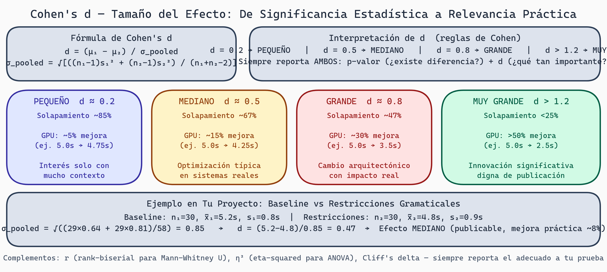

# Tamaño del Efecto
## Semana 7 - Estadística para Generación de Kernels GPU

Aquí es donde pasamos de "¿hay diferencia?" a "¿qué tan grande es la diferencia y le importa?" Un p-valor pequeño significa que una diferencia es estadísticamente significante, pero no te dice si es **prácticamente importante**.

## Por Qué el Tamaño del Efecto Importa

Imagina dos escenarios con el mismo p-valor:

**Escenario A**: n = 100,000
- Baseline: x̄ = 5.0s
- Restricciones: x̄ = 5.01s
- t-test: p = 0.001 (¡significante!)
- **Diferencia real**: 0.01 segundos (imperceptible)

**Escenario B**: n = 20
- Baseline: x̄ = 5.0s
- Restricciones: x̄ = 5.5s
- t-test: p = 0.04 (¡significante!)
- **Diferencia real**: 0.5 segundos (noticeable)

Ambos tienen p < 0.05, pero las conclusiones prácticas son opuestas.

## p-valores vs. Tamaño del Efecto

| Aspecto | p-valor | Tamaño del efecto |
|---------|---------|------------------|
| **Mide** | Probabilidad de datos | Magnitud de diferencia |
| **Sensible a** | Tamaño muestral | Efecto real |
| **Determina por** | n y efecto | Solo el efecto |
| **Utilidad** | Rechaza H₀ | Cuán importante es |

**La práctica moderna**: Reporta AMBOS. Nunca solo p-valor.

## Cohen's d (Diferencias entre Medias)

La métrica estándar para comparar dos grupos:

```
Cohen's d = (μ₁ - μ₂) / σ_pooled

Donde:
σ_pooled = √[((n₁-1)s₁² + (n₂-1)s₂²) / (n₁+n₂-2)]
```

### Interpretación

- d = 0.2: Efecto **pequeño** (noticeable solo con atención)
- d = 0.5: Efecto **mediano** (fácilmente noticeable)
- d = 0.8: Efecto **grande** (muy importante)
- d > 1.2: Efecto **muy grande** (obvio a todos)

**En GPU benchmarks:** d=0.2-0.3 (~5% mejora): marginal. d=0.5-0.7 (~15%): optimización típica. d=0.8-1.2 (~30%): cambio arquitectónico. d>1.5 (>50%): innovación significativa.



> **Cohen's d — Tamaño del Efecto: De Significancia Estadística a Relevancia Práctica**
>
> Fila superior: fórmula de Cohen's d y reglas de interpretación. Cuatro paneles de magnitud: Pequeño (d≈0.2, solapamiento 85%, ~5% mejora GPU), Mediano (d≈0.5, solapamiento 67%, ~15% mejora, típico en optimizaciones reales), Grande (d≈0.8, solapamiento 47%, ~30% mejora), Muy Grande (d>1.2, solapamiento <25%, >50% mejora, innovación significativa). Panel inferior: ejemplo de cálculo con datos de tu proyecto mostrando d=0.47 (efecto mediano).

### Ejemplo en Tu Proyecto

Baseline tiempos: n₁=30, x̄₁=5.2s, s₁=0.8s
Restricciones tiempos: n₂=30, x̄₂=4.8s, s₂=0.9s

```
σ_pooled = √[((29×0.64 + 29×0.81) / 58)]
         = √[(18.56 + 23.49) / 58]
         = √0.727
         = 0.853

d = (5.2 - 4.8) / 0.853
  = 0.4 / 0.853
  = 0.47

Interpretación: Efecto mediano. Las restricciones ahorran ~0.4s,
lo que es prácticamente importante.
```

### Cuándo el Efecto Importa Prácticamente

La importancia depende del contexto:

**Compilación de kernel (esperado < 1s)**:
- d = 0.4 es importante (40% del tiempo típico)

**Entrenar red neuronal (esperado 10 horas)**:
- d = 0.4 es trivial (solo ~50 minutos ahorrados)

Necesitas juicio para definir "prácticamente importante". En tu propuesta de tesis, especifica:

> "Consideramos un tamaño de efecto de d ≥ 0.5 como prácticamente importante, basado en [justificación]."

## Intervalos de Confianza (CI)

En lugar de solo reportar un punto (media), reporta un rango: **Intervalo de Confianza de 95%**.

```
IC 95%: [μ_bajo, μ_alto]

Interpretación: "Confiamos 95% que el verdadero parámetro está en este rango."

No: "Hay 95% de probabilidad de que esté en este rango" (incorrecto)
```

### Cálculo

```
IC 95% = x̄ ± (1.96 × SE)

Donde SE = s / √n
```

Ejemplo: x̄ = 4.8s, s = 0.8s, n = 30

```
SE = 0.8 / √30 = 0.146
IC = 4.8 ± 1.96×0.146
   = 4.8 ± 0.286
   = [4.51, 5.09]

Reporta: "Tiempo medio = 4.8s (IC 95%: [4.51, 5.09])"
```

### Cómo Usar IC para Comparar

Si los ICs de dos grupos **se solapan**, la diferencia no es significante.
Si los ICs **no se solapan**, la diferencia es significante.

```
Grupo A: [4.51, 5.09]
Grupo B: [4.20, 4.80]

Solapan en [4.51, 4.80], luego no significante.

Grupo C: [4.40, 4.70]
Grupo D: [4.80, 5.20]

No solapan, luego significante.
```

Esto da una visión intuitiva. Si reportas solo p-valor, no ves esto claramente.

## Bootstrap: Estimación No Paramétrica de CI

Cuando no puedes asumir normalidad, usa **bootstrap**:

```
1. Tienes datos originales: [4.1, 4.3, 4.2, 4.4, 3.9]

2. Resamplea con reemplazo, calcula estadístico:
   Bootstrap muestra 1: [4.1, 4.1, 4.3, 3.9, 4.2] → media = 4.12
   Bootstrap muestra 2: [4.4, 4.3, 4.1, 4.1, 4.2] → media = 4.22
   Bootstrap muestra 3: [3.9, 4.2, 4.2, 4.1, 4.4] → media = 4.16
   ... repite 10,000 veces

3. Distribución de las 10,000 medias bootstrap
   Percentil 2.5% = 4.05
   Percentil 97.5% = 4.35
   → IC 95% = [4.05, 4.35]
```

**Ventaja**: No asume normalidad. Funciona para cualquier estadístico.

```python
from scipy.stats import bootstrap

data = np.array([4.1, 4.3, 4.2, 4.4, 3.9])
def mean_func(x, axis):
    return np.mean(x, axis=axis)

res = bootstrap((data,), mean_func, n_resamples=10000)
print(f"IC 95%: [{res.confidence_interval.low:.3f}, {res.confidence_interval.high:.3f}]")
```

## Reportando Resultados Completos

En lugar de esto:

> "Las restricciones mejoraron significativamente el tiempo (t(58)=2.1, p=0.04)."

Reporta:

> "Las restricciones redujeron el tiempo de compilación (M=4.8s, DE=0.9s vs. M=5.2s, DE=0.8s), t(58)=2.1, p=0.04, d=0.47, IC 95% de la diferencia: [0.05, 0.79]."

Esto proporciona:
- **Medias y DEs**: Contexto numérico
- **Estadístico t**: Cómo fue calculado
- **p-valor**: Significancia estadística
- **d**: Tamaño del efecto
- **IC**: Rango plausible de la diferencia

## Comparar Múltiples Efectos

En tu proyecto, medirás múltiples DVs (validez, iteraciones, tiempo).

Para cada una, reporta tamaño del efecto:

```
| DV | Baseline | Restricciones | d | IC 95% | Conclusión |
|----|----------|---------------|---|--------|------------|
| Validez (%) | 75 | 85 | 0.58 | [0.12, 1.04] | Mediano, significante |
| Iteraciones | 45 | 38 | 0.65 | [0.18, 1.12] | Mediano, significante |
| Tiempo (s) | 5.2 | 4.8 | 0.47 | [0.05, 0.79] | Pequeño-mediano, significante |
```

Ahora el lector ve: todas las métricas mejoran, pero validez es el mayor ganador.

## Efecto Tamaño para Proporciones

Si comparas porcentajes/proporciones:

```
p₁ = 0.75 (baseline válido)
p₂ = 0.85 (restricciones válido)

Diferencia relativa = (p₂ - p₁) / p₁ = 0.10 / 0.75 = 13.3%

O usa h de Cohen:
h = 2 × arcsin(√p₂) - 2 × arcsin(√p₁)
  = 2 × arcsin(√0.85) - 2 × arcsin(√0.75)
  ≈ 0.42 (mediano)
```

Reporta ambos:

> "Las restricciones aumentaron tasa de validez de 75% a 85% (aumento relativo 13%), h=0.42."

## Número Necesario a Tratar (NNT)

Para datos binarios, NNT dice cuántos casos necesitas tratar para ver un beneficio:

```
NNT = 1 / (p₂ - p₁)
    = 1 / (0.85 - 0.75)
    = 1 / 0.10
    = 10
```

**Interpretación**: Necesitas usar restricciones en 10 kernels para que 1 adicional compile exitosamente.

Útil para contexto: ¿Vale la pena el esfuerzo de implementar restricciones para 1 mejora por cada 10 intentos?

## Ejercicios y Reflexión

### Ejercicio 1: Calcular Cohen's d
Datos:
- Método A: n=25, x̄=42, s=8
- Método B: n=25, x̄=38, s=9

Calcula:
a) Cohen's d (step-by-step)
b) ¿Cuál es la interpretación (pequeño/mediano/grande)?
c) ¿Es esto prácticamente importante en tu proyecto?

### Ejercicio 2: Intervalo de Confianza
Para datos arriba (Método B):
- Calcula error estándar (SE)
- Calcula IC 95%
- Reporta completo: "Media = ___ (IC 95%: [___, ___])"

### Ejercicio 3: Bootstrap
Para una variable en tu proyecto:
- Resamplea 1000 veces con reemplazo
- Calcula media para cada resample
- Grafica distribución bootstrap
- Reporta IC 95% bootstrap vs. paramétrico

### Ejercicio 4: Reportar Completo
Para comparación baseline vs. restricciones en tu proyecto, escribe párrafo que incluya:
- Medias (M) y desviaciones estándar (DE)
- Estadístico de prueba y p-valor
- Cohen's d o efecto tamaño apropiado
- IC 95% de diferencia
- Conclusión práctica

### Reflexión
1. **Muestras grandes vs. pequeñas**: ¿Por qué pequeño n pero gran efecto es mejor que gran n pero efecto tiny?
2. **Significancia vs. Importancia**: En tu proyecto, ¿qué efecto tamaño sería "prácticamente importante"?
3. **Reporte transparente**: ¿Por qué reportar efecto tamaño es mejor que "significancia" a secas?

---

**Próxima semana**: Aprenderemos qué pasa cuando comparas más de dos grupos (múltiples comparaciones y sus problemas).
