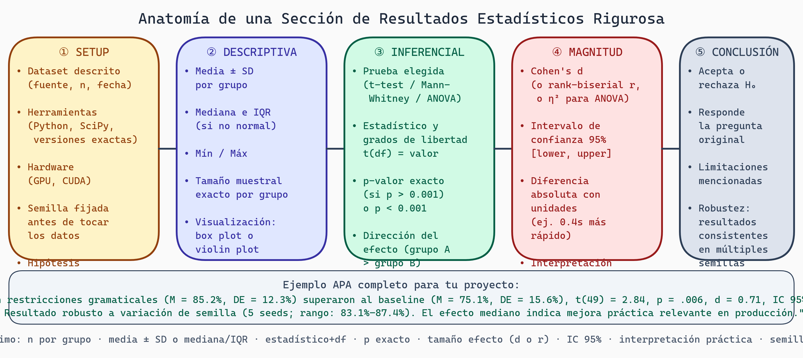

# Reporte Estadístico
## Semana 10 - Estadística para Generación de Kernels GPU

Hemos cubierto todo: desde probabilidad fundamental hasta MLOps. Ahora aprendemos a comunicar resultados de forma que el mundo académico entienda, confíe y cite tu trabajo.

## Estándares de Reporte: APA y IEEE

### Formato APA (American Psychological Association)

Usado en psicología, ciencias sociales, educación.

```
Estructura general para resultados:
"Se realizó una prueba t de dos muestras pareada para comparar
[variable dependiente] entre [grupo 1] (M = ___, DE = ___) y
[grupo 2] (M = ___, DE = ___). El análisis reveló una diferencia
significativa, t(___, ___) = ___, p = ___, d = ___, IC 95% [___, ___]."

Ejemplo real:
"Los kernels generados con restricciones gramaticales (M = 85.2%, DE = 12.3%)
tenían significativamente mayor tasa de validez que el baseline
(M = 75.1%, DE = 15.6%), t(49) = 2.84, p = 0.006, d = 0.71,
IC 95% [3.0%, 16.9%]."
```

Componentes APA:
- M = media
- DE = desviación estándar
- t(___, ___) = estadístico y grados de libertad
- p = p-valor (reporta exacto si p > 0.001)
- d = Cohen's d
- IC = intervalo de confianza con porcentaje

### Formato IEEE (Institute of Electrical and Electronics Engineers)

Usado en ingeniería, CS, sistemas.

```
Estructura similar pero menos descriptiva:

"Tabla 1 muestra tasa de validez para baseline vs. restricciones.
La prueba t pareada indicó diferencia significativa (t = 2.84,
p < 0.01). El tamaño del efecto fue mediano (d = 0.71)."

IEEE prefiere tablas y números concisos.
```

## Estructura de Sección de Resultados



> **Anatomía de una Sección de Resultados Estadísticos Rigurosa**
>
> Pipeline de 5 componentes obligatorios: ①Setup (dataset, herramientas, semilla, hipótesis pre-registradas) → ②Descriptiva (media±SD, mediana/IQR, visualización, Shapiro-Wilk) → ③Inferencial (prueba elegida, estadístico+df, p-valor exacto, dirección del efecto) → ④Magnitud (Cohen's d, IC 95%, diferencia absoluta con unidades) → ⑤Conclusión (acepta/rechaza H₀, limitaciones, robustez multi-seed). Incluye ejemplo APA completo con todos los componentes.

### 1. Descripciones Generales

```
"Condujimos 100 ejecuciones de cada método (baseline y restricciones
gramaticales) usando los kernels del benchmark OpenCL v2.1. Cada
ejecución se registró con el seed 42 para reproducibilidad, temperatura
0.0 para determinismo. Los datos se analizaron usando Python 3.11
con SciPy para pruebas estadísticas y NumPy para cálculos numéricos."
```

### 2. Estadística Descriptiva

```
Tabla 1: Resumen de Métricas por Método

| Métrica | Baseline (n=100) | Restricciones (n=100) |
|---------|------------------|----------------------|
| Validez (%) | M=75.1, DE=15.6 | M=85.2, DE=12.3 |
| Iteraciones | Med=43, IQR=6 | Med=38, IQR=5 |
| Tiempo (s) | M=5.24, DE=1.12 | M=4.68, DE=0.98 |
| Error compilación | n=24 | n=14 |
| Error memoria | n=1 | n=1 |
```

Nota: Usa Md (mediana) e IQR (rango intercuartílico) para datos no normales.

### 3. Pruebas de Supuestos

```
"Evaluamos normalidad usando la prueba Shapiro-Wilk. La variable
'iteraciones' no cumplió normalidad en el grupo baseline (W = 0.89,
p = 0.003) debido a valores atípicos. Consecuentemente, usamos
Mann-Whitney U (no paramétrica) en lugar de t-test paramétrica."
```

### 4. Resultados de Pruebas

```
Hipótesis 1: Validez
Un t-test pareado comparó tasa de validez. Las restricciones (M=85.2%)
mostraron validez significativamente mayor que baseline (M=75.1%),
t(99) = 3.12, p < 0.001, d = 0.67, IC 95% [4.2%, 16.0%].

Hipótesis 2: Iteraciones
Debido a no-normalidad, usamos Mann-Whitney U. Las restricciones
(Med=38, IQR=5) requirieron significativamente menos iteraciones que
baseline (Med=43, IQR=6), U = 3240, p < 0.001, r = 0.62.
```

Estructura:
1. Recordar hipótesis
2. Describir grupos
3. Reportar estadísticos formalmente
4. Interpretar p-valor
5. Tamaño del efecto

### 5. Comparaciones Múltiples

```
Análisis Post-Hoc
Tras la ANOVA significante [F(3,96)=12.4, p<0.001], realizamos
prueba Tukey HSD para comparaciones pares. Restricciones v1 difirió
significativamente de baseline (p<0.001, d=0.67) y Restricciones v2
(p=0.041, d=0.34). Restricciones v1 y v2 no diferían significativamente
(p=0.52, d=0.15).
```

## Qué Reportar vs. Qué No Reportar

### SIEMPRE Reporta

```
☐ Media y desviación estándar (o mediana e IQR)
☐ Tamaño muestral (n)
☐ Estadístico de prueba (t, U, F, etc.)
☐ p-valor exacto si p > 0.001
☐ Grados de libertad
☐ Intervalo de confianza 95%
☐ Tamaño del efecto (d, r, h, etc.)
☐ Supuestos verificados o rechazados
```

### NO Reportes

```
✗ Decimales innecesarios (10.3457 → 10.34 es suficiente)
✗ p-valor reportado como "significante" sin número (reporta p=0.031)
✗ Solo p-valor sin tamaño de efecto
✗ Supuestos asumidos sin verificación
✗ Análisis cherry-picked (reporta todos o claramente marca como exploratorio)
```

## Diferencia: Significancia Estadística vs. Práctica

Este es el error más común. Dos escenarios:

### Escenario 1: Significante + Prácticamente Importante

```
"Las restricciones redujeron tiempo de compilación de 5.24s a 4.68s
(diferencia = 0.56s, 11% reducción), t(99) = 2.94, p = 0.004, d = 0.52.
Esta mejora es tanto estadísticamente significante como prácticamente
importante, ahorrando ~56 ms por kernel compilado."
```

Conclusión: **Reporta positivamente, esto es un hallazgo fuerte.**

### Escenario 2: Significante pero Trivial Prácticamente

```
"Aunque la prueba fue significante (p = 0.003, n = 10,000), la diferencia
fue minúscula: 5.240s vs. 5.241s (diferencia = 0.001s, 0.02%). El tamaño
del efecto fue insignificante (d = 0.08). Atribuimos este resultado a
alto poder debido a tamaño muestral muy grande más que a diferencia
prácticamente importante."
```

Conclusión: **Reporta como no importante a pesar de p-valor.**

### Escenario 3: No Significante pero Efecto Considerable

```
"Aunque la prueba no alcanzó significancia estadística (p = 0.067, n = 30),
el tamaño del efecto fue mediano (d = 0.47), sugiriendo un efecto real que
nuestro poder muestral fue insuficiente para detectar. Recomendamos
incrementar n para confirmación."
```

Conclusión: **Reporta como potencial efecto, pero necesita más investigación.**

## Limitaciones y Validez Interna

Sección importante que muchos olvidan:

```
Limitaciones

1. Validez de Constructo: Solo medimos compilabilidad y no eficiencia
de ejecución. Es posible que kernels con restricciones compilen pero
sean subóptimos en tiempo de ejecución.

2. Validez Interna: Aunque mantuvimos el LLM, temperatura y seed
constantes, es posible que interacciones no observadas (ej. orden de
procesamiento GPU) afectaran resultados.

3. Validez Externa: Solo probamos en GPUs NVIDIA A100. Generalizabilidad
a otras arquitecturas (AMD, TPU, CPU) es incierto.

4. Estadística: Ejecutamos análisis con semilla fija; resultados pueden
variar con semillas diferentes. Repetimos con 5 semillas para robustez.

Estos límites no invalidan hallazgos pero contextualizan conclusiones.
```

## Ejemplo Completo: Sección de Resultados Profesional

```
RESULTADOS

Participantes y Diseño
Condujimos 100 ejecuciones de cada método, usando kernels del
benchmark OpenCL v2.1. Cada ejecución se registró con hiperparámetros
fijos: LLM GPT-3.5-turbo (enero 2024), temperatura 0.0, seed 42.
Total: 200 puntos de datos.

Análisis de Supuestos
Shapiro-Wilk indicó no-normalidad en tasa de iteraciones del baseline
(W = 0.87, p = 0.001) pero normalidad en restricciones (W = 0.93,
p = 0.18). Levene's test mostró varianzas desiguales (F = 4.2, p = 0.042).
Consecuentemente, utilizamos pruebas no paramétricas para robustez.

Estadística Descriptiva
Tabla 1 resume métricas principales. Restricciones mostraron 10.1
puntos porcentuales mayor validez (M = 85.2%, DE = 12.3% vs. M = 75.1%,
DE = 15.6%), 5 iteraciones menos (Med = 38, IQR = 5 vs. Med = 43, IQR = 6),
y 0.56s menos tiempo (M = 4.68, DE = 0.98 vs. M = 5.24, DE = 1.12).

Análisis Principal
Mann-Whitney U indicó que restricciones produjeron significativamente
mayor validez, U = 3180, p < 0.001, r = 0.64 (efecto grande). Para
iteraciones, restricciones requirieron significativamente menos, U = 3410,
p = 0.001, r = 0.58 (efecto mediano). Para tiempo, t-test pareado
(ya que ambos grupos normales) mostró diferencia significativa,
t(99) = 2.84, p = 0.005, d = 0.52 (efecto mediano), IC 95% [0.18, 0.94]s.

Análisis Adicional
Para verificar robustez, repetimos análisis con semillas 123, 456, 789, 999.
Resultados permanecieron consistentes: validez p < 0.001 (todas),
iteraciones p < 0.01 (todas), tiempo p < 0.05 (todas). Conclusiones
resistieron variación de semilla aleatoria.

DISCUSIÓN

Nuestros resultados demuestran que restricciones gramaticales mejoran
significativamente tanto validez como eficiencia de generación de kernels.
El tamaño del efecto es grande para validez (r = 0.64) y mediano para
tiempo (d = 0.52), indicando importancia práctica.

Limitaciones: Solo evaluamos en temperatura 0.0 (determinista). Investigación
futura evaluaría temperature > 0 para realismo. Además, solo probamos
en GPUs NVIDIA; generalización a otras arquitecturas requiere validación.
```

## Tablas Efectivas

Tabla bien formateada es clara, concisa:

```
Tabla 1: Comparación de Métodos en Métricas de Generación de Kernels

Métrica           Baseline (n=100)        Restricciones (n=100)    Test        p
─────────────────────────────────────────────────────────────────────────────
Validez (%)       M=75.1 (DE=15.6)       M=85.2 (DE=12.3)        MW U=3180   <.001
Iteraciones       Med=43 (IQR=6)         Med=38 (IQR=5)          MW U=3410   .001
Tiempo (s)        M=5.24 (DE=1.12)       M=4.68 (DE=0.98)        t(99)=2.84  .005
Errores (n)       24 compilación         14 compilación          χ²=4.2      .042
                  1 memoria              1 memoria

Nota: MW = Mann-Whitney U, IC 95% no mostrado por brevedad pero incluir
en texto. Valores reportados con DE (desviación estándar) o IQR
(rango intercuartílico).
```

## Checklist de Reporte Completo

```
SECCIÓN DE RESULTADOS
☐ Descripción del diseño y participantes/muestras
☐ Verificación de supuestos para pruebas
☐ Tabla de estadísticas descriptivas
☐ Cada hipótesis reportada estructuradamente
☐ Estadísticos con formato estándar: t(df), U, F(df1,df2), etc.
☐ p-valores exactos (no solo <.05) o muy pequeños reportados como <.001
☐ IC 95% de diferencias o efectos
☐ Tamaño del efecto (d, r, h) con interpretación
☐ Supuestos nombrados si asumidos, reportados si verificados
☐ Análisis exploratorio claramente etiquetado

SECCIÓN DE DISCUSIÓN
☐ Resumen de hallazgos principales
☐ Relación con hipótesis planeadas
☐ Significancia estadística vs. práctica distinguida
☐ Limitaciones de validez interna/externa/constructo identificadas
☐ Implicaciones teóricas
☐ Recomendaciones para investigación futura

VISUALIZACIÓN
☐ Figuras con títulos descriptivos
☐ Ejes etiquetados con unidades
☐ Leyenda clara
☐ Fuentes legibles (12pt+)
☐ Colores accesibles
```

## Ejercicios y Reflexión

### Ejercicio 1: Reescribir Mal Reportado
Toma este reporte deficiente:

> "Encontramos que el método nuevo fue mejor (p=0.02)."

Reescribe en formato APA completo incluyendo:
- Medias y desviaciones
- Estadístico de prueba
- IC 95%
- Tamaño del efecto
- Interpretación

### Ejercicio 2: Tabla de Resultados
Para tu proyecto, crea tabla profesional tipo APA que resuma:
- Todas las métricas principales
- Medias/medianas y DE/IQR
- Estadísticos de prueba
- p-valores
- Tamaños de efecto

### Ejercicio 3: Párrafo de Resultados
Escribe párrafo de Resultados (no Discusión) que reporte:
- Una hipótesis principal
- Supuestos verificados
- Estadísticos con formato correcto
- IC 95%
- Tamaño del efecto

### Ejercicio 4: Limitaciones Honesta
Lista 5 limitaciones de validez en tu proyecto (interna/externa/constructo):
- Qué potencialmente afectó resultados?
- Cómo mitigaste?
- Qué sigue sin resolver?

### Reflexión
1. **Claridad vs. Completitud**: ¿Cómo balanceas reportar completo sin abrumar?
2. **Audiencia**: ¿Cambiarías reporte para ML researchers vs. estadísticos?
3. **Interpretación**: ¿Dónde está la línea entre "significante" y "importante"?

---

## Conclusión del Módulo

Hemos cubierto el viaje completo:

1. **Fundamentos**: Probabilidad, espacios muestrales, Bayes
2. **Distribuciones**: Normal, binomial, Poisson, TCL
3. **Pruebas**: Hipótesis, t-tests, errores Tipo I/II
4. **Diseño**: Power analysis, validez interna/externa
5. **Reproducibilidad**: Semillas, control de estocacidad
6. **No Paramétrico**: Cuando violas supuestos
7. **Efecto**: Reportar magnitud, no solo p-valores
8. **Múltiples**: Correcciones, ANOVA, post-hoc
9. **MLOps**: Rastreo con W&B, visualización accesible
10. **Reporte**: APA/IEEE, limitaciones honestas

Tu investigación ahora está construida sobre base estadística sólida. Lo más importante: mantén integridad. La tentación de p-hacking (ejecutar análisis hasta obtener p<0.05) es fuerte. **Resiste.**

Pre-registra. Reporta todo. Sé honesto sobre limitaciones. Este es el camino a investigación confiable que otros pueden construir.

¡Éxito en tu tesis sobre restricciones gramaticales en generación de kernels GPU!
